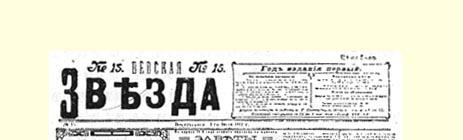
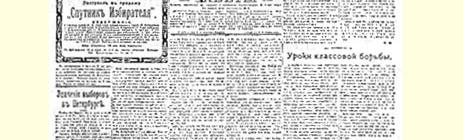
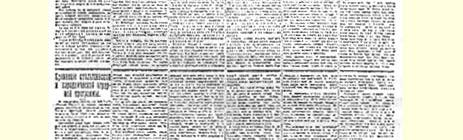
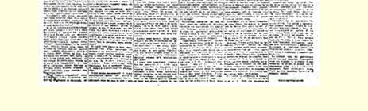

# 彼得堡选举的意义

> （１９１２年７月１日〔１４日〕）

据一些报纸报道，关于第四届国家杜马召开日期和选举时间问题，在统治集团内部引起了许多疑虑。有些人主张把国家杜马召开的日期延到１月，有些人主张在１０月召开。现在，据说问题已按照第二种意见解决了。

这就是说，选举已近在眼前，离现在只有７至９个星期。因此必须考虑如何**鼓足十倍**干劲去进行全部选举工作。

我想在本文中谈谈一个专门性的、然而又是对工人民主派有极其重大和普遍意义的问题。这就是彼得堡选举的作用问题。

彼得堡第二城市选民团的选举，是第四届国家杜马选举中**整个**选举运动的中心。

只有彼得堡有一家办得还算可以的工人报纸，这家报纸经常遭受疯狂迫害和罚款，编辑遭到逮捕，它的处境极不稳定，并且受到书报检查机关的严厉控制，但是它还能够稍许反映一点工人民主派的观点。

如果没有一家日报，选举仍旧会是漆黑一团，它对群众进行政治教育的作用就会减少一半，甚至减少得更多。

因此，彼得堡的选举就具有工人民主派在俄国极其艰难的条件下进行选举运动的**示范**作用。在其他任何地方，工人都不能进行另外一种大家都**看得见的**选举运动。工人选民团的选举当然有极其重大的意义，但工人在这里不能同其他阶级的居民接触，因而不能**相当**广泛地阐明先进的无产阶级民主派为领导整个民主运动而提出的**全民性**要求和对**总的政治**任务的看法。

在彼得堡是进行直接选举的。因此，这里的竞选斗争能比其他地方开展得更加明确，党派界限更加分明。其他各大城市本来也会象彼得堡一样具有同样的重大意义，但外省的行政压力**还是**比首都大得多，因此工人民主派很难打开局面，使人们听取他们的意见。

最后，在彼得堡，斗争一定会在第二选民团中的自由派和民主派之间开展起来。立宪民主党认为第二选民团是**自己的**财富。代表彼得堡的是米留可夫、罗季切夫和库特列尔。

不用说，由自由派代表相当广泛的民主派选民群众这种情况， 决不能认为是正常现象。第二届杜马的选举表明，立宪民主党在民主派城市选民中的“统治地位”远远不是稳固的。在彼得堡，如果当时孟什维克如唐恩之流没有分裂工人的选举运动，没有因此使得民粹派产生对取得成功极为有害的动摇，那么在第二届杜马选举时，“左派联盟”即工人民主派和资产阶级民主派（民粹派）的联盟， 不仅**能够**取得胜利，**甚至一定会**取得胜利。只要指出一点就足以说明问题了：甚至“社会革命党人”在第二届杜马选举中直到最后时刻还是跟着孟什维克一起维护同立宪民主党的联盟！

根据目前选举法的规定，可以进行决选投票，因此在第一阶段就不需要也不能容许结成任何联盟。

彼得堡的斗争将在工人民主派和自由派之间进行。民粹派未必有力量独立进行活动，因为他们遵照我们的取消派的路线，已经

> １９１２年７月１日载有列宁《彼得堡选举的意义》和
>
> 《斯托雷平土地纲领和民粹派土地纲领的比较》两文的
>
> 《涅瓦明星报》第１５号第１版
>
> （按原版缩小） 不遗余力地“取消了”自己。因此，资产阶级民主派（劳动派和民粹派）几乎肯定会支持工人民主派，如果不是在选举的第一阶段，至少在决选投票时是会支持的。

自由派在彼得堡有自己的领袖米留可夫先生。直到如今大多数人都拥护他们。自由主义君主派资产阶级供给他们经费，有两家日报作为宣传工具，还有一个实际上被允许存在的、几乎事实上合法的组织，—— 这一切都使立宪民主党人拥有巨大的优势。

在工人方面则有工人群众，有彻底的真正的民主主义，还有极大的干劲以及对社会主义和工人民主事业的耿耿忠心。依靠**这些** 力量，再加上拥有工人的日报，工人就**能够**取得胜利。工人争取彼得堡代表席位的斗争，无疑会在整个第四届杜马选举运动中具有巨大的**全俄的**意义。

喜欢谈论所有反对派“团结一致”的人—— 从进步派和立宪民主党人到小心谨慎、支吾搪塞的取消派马尔托夫和愚蠢幼稚的普罗柯波维奇和阿基莫夫—— 都竭力回避或撇开彼得堡的选举问题。他们绕过政治中心，甘愿一头扎进可以说是政治上的穷乡僻壤。他们关于在选举的第二阶段，即在选举运动的基本的、主要的和有决定意义的部分已经结束时怎样做是合适的这一点谈得很多，很热烈，很动听；可是对被立宪民主党人霸占而必须从他们手中**夺下**交还给民主派的彼得堡却“意味深长地绝口不谈”。

不论根据１９０５年１２月１１日的法律，或是根据１９０７年的六三法令，都没有选出过彼得堡的民主派代表，因此，“交还”这个字眼似乎是用得不恰当的。但是，从整个俄国解放运动的发展态势来看，彼得堡是属于民主派的，而在运动发展的某个阶段，**甚至**连六三选举法这条高得出奇的拦河坝也阻挡不住“民主洪流”的冲击。

第二选民团的多数选民无疑都是来自居民中的民主阶层。立宪民主党人**公然欺骗**他们，把自己这个自由主义君主派资产阶级政党打扮成民主派，使他们跟着自己走。在各种议会选举时，世界上**一切**自由派一直都在耍这种骗局。因此，各国的工人政党衡量自己成就的尺度，就是看他们能在多大程度上使小资产阶级民主派摆脱自由派的影响。

俄国马克思主义者也应当给自己明确而肯定地提出这项任务。因此，他们在自己著名的一月决议中公开指出，由于显然没有黑帮危险，在各大城市**只**容许同民主派联合起来对付自由派。[^1]这项决议是“抓住了问题的关键”，对选举策略的一个最重要问题作了直接回答，确定了**整个**选举运动的**精神**、方针和性质。

相反，喜欢谈论立宪民主党人是“城市民主派”的“代表”的取消派，却犯了大错误。取消派的这些言论**歪曲了**事实，因为这样就是把自由派在选举中战胜民主派、自由派**对**民主派选民所玩弄的选举骗局，当成是立宪民主党奉行“民主主义”的证据。只要真正的资产阶级民主派，尤其是社会民主派，还没有使各种民主阶层摆脱性质同它们**完全相反**的政党的影响，这些民主阶层就会受**反**民主派政党多年的摆布，这种例子在欧洲是屡见不鲜的。

彼得堡的选举斗争，是自由派和工人民主派在俄国整个解放运动中争夺领导权的斗争。

彼得堡选举所起的这种极重要的作用，可以使我们作出两个实际的结论。谁得到的多，谁负的责任也要多。彼得堡工人势必代表全俄**整个**工人民主派进行彼得堡第二城市选民团的选举运动。 他们肩负着伟大而艰巨的事业。他们要作出榜样。他们应当发挥最大限度的主动性、干劲和坚忍不拔的精神。他们在办工人日报方面已经做到了这一点。他们在选举中也应当继续进行已经出色地开始了的事业。

整个俄国都注视着彼得堡的选举斗争。整个俄国也应当竭力 **支援**这里。如果没有来自全俄各地对彼得堡工人的各方面的支援， 单枪匹马是无法打败“敌人”的。

> 载于１９１２年７月１日《涅瓦明星报》译自《列宁全集》俄文第５版第１５号第２１卷第３７５—３７９页

[^1]: 见本卷第１４８—１４９页。—— 编者注