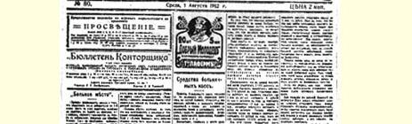
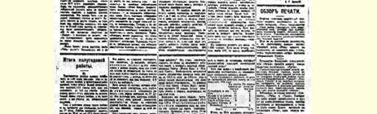
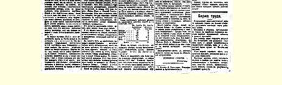

# 半年工作总结 １９４

> （１９１２年７月１２—１４日〔２５—２７日〕）

彼得堡工人出版了工人日报，也就完成了一项巨大的工作，可以毫不夸大地说，这是一项具有历史意义的工作。工人民主派在极端困难的条件下团结了起来，增强了自己的力量。当然，现在还不能说我们工人民主派的报纸已经**巩固**了，因为大家都很清楚，工人报纸现在经常遭到种种迫害。

但是，不管怎样，《真理报》的创刊仍然是一个非常有力的证据，它证明俄国工人是有觉悟、有毅力和团结一致的。

回顾并考察一下俄国工人半年来在创办**自己的**报纸方面所做的工作，是很有益处的，因为正是从今年一月起，彼得堡工人十分明显地表现出对创办自己的报纸的兴趣，当时在与工人有关的各种色彩的报章杂志上都出现了很多谈论工人日报的文章。

## 一

俄国的工人日报是由**谁**创办和**如何**创办的，关于这方面的材料好在是相当完整的。这就是关于为工人日报**捐款**的材料。

现在我们就从创办《真理报》的捐款谈起。我们有从今年１月 １日至６月３０日这整整半年的《明星报》、《涅瓦明星报》和《真理报》报道的帐目。这些帐目是公开的，所以能保证内容绝对正确，个别的错误都根据有关方面的意见及时加以更正了。

对我们来说，最重要和最值得注意的不是捐款的总额，而是**捐款者的成分**。比如《涅瓦明星报》第３号上公布了为工人日报捐款的总额是４２８８卢布８４戈比（从１月开始到５月５日截止，但从４ 月２２日《真理报》创刊时起直接寄给该报的捐款未计算在内），于是我们马上就产生这样一个问题：工人本身和各个工人团体在筹集这笔捐款中起的作用如何？这笔钱是由同情者的大笔捐款凑起来的呢，还是工人自己对工人报纸表现了极大的关心，由**大量的**工人团体筹集的巨额捐款凑起来的？

从工人**本身的**创举和力量的观点来看，比方３０个工人团体捐献了１００卢布，那就要比几十个“同情者”捐献的１０００卢布重要得多。依靠工厂工人的小团体以许多个**５戈比硬币**凑起来的捐款创办的报纸，比依靠知识分子中的同情者提供的几十个和几百个卢布创办的报纸要扎实、巩固和**有分量**好多倍，这不论是从财政观点来看，或**更为重要**是从工人民主派的发展来看，都是这样的。

为了掌握这一根本的、最重要的问题的精确材料，我们对上述三种报纸所登载的有关捐款的材料作了下面的统计。我们这里**只是**把工人**团体**或职员**团体**的捐款抽出来看。

目前我们所关心的只是工人**自己的**捐款，而且指的不是单个工人的捐款，因为他们也许是偶尔碰上了某个募捐人，在思想上， 也就是在观点和信仰上同他并没有联系，我们指的是工人**团体**的捐款，他们一定都预先**讨论过**应不应当捐款，捐给**谁**，捐款的目的何在。

凡是《明星报》、《涅瓦明星报》和《真理报》说明了为工人日报捐款的正是工人**团体**或职员**团体**的每一次报道，都被算作是工人自己的**一次团体捐款**。

那么，在１９１２年上半年这样的工人团体捐款究竟有过多少次呢？

**有５０４次团体捐款**！

工人为创办和支持**自己的**报纸团体捐款５００多次，他们有的是拿出一天的工资，有的是同时一次捐款，有的是有时一捐再捐。 **５０４个工人团体**（单个工人和同情者除外）非常积极地参加了创办自己的报纸的活动，这个数目无疑说明了，工人**群众**已经开始自觉地极其关心工人报纸，并且他们关心的不是什么一般的工人报纸， 而是工人民主派的报纸。既然群众有这种自觉性和积极性，任何困难和障碍就都不可怕了。没有而且也不可能有什么困难和障碍是工人群众的自觉性、积极性和参与感所不能克服的。

５０４次团体捐款按月分布情况如下：

> １９１２年１月……………………………………………１４
>
> １９１２年２月……………………………………………１８
>
> １９１２年３月……………………………………………７６
>
> １９１２年４月……………………………………………２２７
>
> １９１２年５月……………………………………………１３５
>
> １９１２年６月……………………………………………３４

>

> **   半年总数**………………………………………５０４

从上面这张小统计表中可以清楚地看到４—５月的全部意义， 这两个月可以说是个**转折点**。这是从黑暗到光明、从消极到积极、 从个别行动到群众行动的转折点。

在１—２月间，工人团体捐款的次数还很少。显然，事情还只是刚开始。３月间可以看出已经增加很多。一个月中有７６次工人团体捐款，这至少说明工人真的动了起来，群众不怕任何牺牲，竭力要达到自己的目的。这说明工人群众深信自己的力量，深信整个工作安排，深信已着手创办的报纸的方向等等。３月间工人日报还没有创办起来，工人团体就已经把钱凑集起来，先贷给了《明星报》。

４月份数字立刻**大大**增加，这起了决定作用。这一个月有２２７ 次工人团体捐款，每日平均７次以上！堤坝被冲垮了，工人日报有了保障。每一次的团体捐款，不仅表明５戈比硬币和１０戈比硬币的总数，更重要的是说明工人**团体**同心协力以实际行动支持、宣传、指导、创办工人报纸的决心。

可能产生一个问题：４月份的捐款是不是主要集中**在**４月２２ 日**以后**，即《真理报》创刊以后呢？不是。《明星报》**在**４月２２日**前** 登载了**１８８次团体捐款**的帐目。而《真理报》从４月２２日至月底一共登载了３９次团体捐款的帐目。这就是说，４月份的前２１天，即在《真理报》创刊前，每日平均有**９次团体捐款**，而在４月份的后９ 天每日平均只有４次。

由此可以得出两个重要结论：

第一，工人正是**在**《真理报》创刊**前**尽了最大的努力。工人信任 《明星报》，把钱“贷”给了它，正是表示要实现自己主张的决心。

第二，由此可以看到，**正是**由于工人在**４月间**的捐款**增加**，工人的《真理报》才得以创刊。毫无疑问，工人运动的普遍高涨（不是以狭隘的行会形式出现的，不是以狭隘的工会形式出现的，而是具有全民规模的运动）同彼得堡工人民主派日报的创刊之间有最密切的联系。工会的刊物对我们来说是不够的，我们需要自己的政治性报纸—— 这就是群众在４月间形成的坚定的信念；我们需要的不是随便什么政治性的工人报纸，而是先进的工人民主派的报纸； 我们需要创办报纸不仅是为了要它帮助我们工人进行斗争，而且是为了要它给全民树立榜样，成为他们的火炬。

５月份捐款的次数还是很多。团体捐款每日平均４次以上。一方面，从这里可以看到４—５月份的普遍增加。另一方面，工人群众认识到，工人日报虽已开始发行，但它开始时的处境特别困难，因此就特别需要集体的支持。

６月份团体捐款的次数已比３月份减少。当然，应当注意到这样一个事实：**在**工人日报创刊**以后**出现了**另一种**具有决定意义的赞助报纸的形式，这就是订阅报纸并向自己的同志、熟人、同乡等等推销。《真理报》的一切自觉的拥护者不仅自己是订阅者，他们还把《真理报》作为样板散发介绍到其他工厂、邻舍和农村等等。遗憾的是，我们无法把**这种**集体帮助完全统计出来。

## 二

仔细看看这５０４次工人团体捐款在**各城市**和工业区的分布情况，是非常有意义的。在俄国有哪些地区的工人响应了创办工人日报的号召，他们响应的热情又是怎样的呢？

在这方面幸好有关于所有工人团体捐款的材料，《明星报》、 《涅瓦明星报》和《真理报》都刊登了这些捐款的帐目。

我们把这些材料汇集在一起时，首先应当提出彼得堡，因为在创办彼得堡工人报纸方面它自然是站在前列的；其次是有**两个以上**的工人团体的捐款的１４个城市及工业区，最后是其余的３５个城市，这些城市半年来都只有一次工人团体捐款。于是就得出下面的情况：

> 团体捐款总次数
>
> 彼得堡…………………………………………………４１２
>
> 有２—１２次团体捐款的１４个城市……………………５７
>
> 有１次团体捐款的３５个城市…………………………３５

>

> **５０个城市的总次数**……………………………………５０４ 由此可见，**几乎整个**俄国都在不同程度上积极参加了创办工人日报的事业。如果注意到在外省发行工人民主派报纸方面所遇到的种种困难，那么看到半年来有许多城市都响应了彼得堡工人的号召，是会令人感到惊奇的。

除首都外，俄国的４９个城市[^1]共有**９２次**工人团体捐款，这至少对于开始来说是个很惊人的数目。这里指的决不是那些偶然的、 漠不关心的、消极的捐款者。我们所看到的，毫无疑问是无产阶级群众的代表，他们虽然分散在俄国各地，但是对于工人民主派的自觉的同情把他们联合起来了。

应当指出，站在外省城市前列的是基辅，有１２次团体捐款；其次是叶卡捷琳诺斯拉夫，有８次；可是莫斯科却是居第４位，只有 ６次。莫斯科和整个莫斯科区的这种落后现象，从下列俄国各区的综合材料中可以看得更清楚：

### １９１２年１—６月半年中工人团体为工人日报捐款的次数

> 彼得堡和它的郊区………………………………４１５
>
> 南方…………………………………………………５１
>
> 莫斯科和莫斯科区…………………………………１３
>
> 北方和西方…………………………………………１２
>
> 乌拉尔和伏尔加河流域……………………………６
>
> 高加索、西伯利亚、芬兰……………………………７

>

> **全俄总计**…………………………………………５０４

对这份材料可以作如下说明。

从俄国工人民主派重趋活跃的程度来看，无产阶级的彼得堡已经觉醒并走上了自己的光荣岗位。南方正在觉醒。而母亲莫斯科和俄国的其他地区还在沉睡。这些地方也已经到了该开始觉醒的时候了。

如果把整个莫斯科区同其他**外省**地区比较一下，就可以清楚地看出莫斯科区的落后状态。南方离彼得堡很远，比莫斯科离彼得堡远得多。南方的产业工人也比莫斯科区**少**，可是工人团体捐款的次数却**几乎是莫斯科区的４倍**。

看来莫斯科甚至比乌拉尔和伏尔加河流域还落后，因为莫斯科和莫斯科区的工人比乌拉尔和伏尔加河流域的工人多许多倍， 而不是多一倍。可是乌拉尔和伏尔加河流域的团体捐款有６次，而莫斯科和莫斯科区总共只有１３次。

自然，莫斯科和莫斯科区的落后状态大概受到了两个特殊条件的影响。第一，这里纺织工业占多数。而纺织工业的经济条件也即市场情况和生产活跃的程度要比别的工业例如冶金工业差一些。因此，纺织工人不大参加罢工，不大关心政治和工人民主派。第二，在莫斯科区工厂大多分散在偏僻的地方，往那里送报纸比往大城市送要困难。

可是不论怎样，我们大家无疑都从上述材料中吸取了教训。必须特别关注在莫斯科发行工人报纸的工作。不能再让莫斯科处于落后状态。每个觉悟工人都懂得，只有彼得堡而没有莫斯科，就象只有一只手而失去了另一只手。

俄国的工厂工人**大部分**集中在莫斯科和莫斯科区。据官方统计，１９０５年这里的工厂工人有５６７０００人，即占全俄工厂工人 （１６６００００人）的**三分之一以上**，大大超过彼得堡区（２９８０００人）。因此，在工人报纸的读者和拥护者的数目方面，在工人民主派的有觉悟的代表的数目方面，莫斯科区本应占**第一**位。当然，莫斯科一定会创办起**自己的**工人日报的。

目前彼得堡应当帮助莫斯科。《真理报》的读者每天早上都应当对自己和自己的朋友们说：“工人们，要想到莫斯科人！”

> １９１２年８月１日载有列宁《半年工作总结》一文第３节的
>
> 《真理报》第８０号第１版
>
> （按原版缩小）

## 三

从另一种极其重要的、实际上非常现实的观点来看，上述材料也应当引起我们的注意。任何人都了解，政治性的报纸是现代社会任何一个阶级参加国内政治生活，特别是参加选举运动的一个基本条件。

因此，一般来说，工人需要报纸，为了进行第四届杜马的选举更是如此。工人很清楚，不论第三届杜马，还是第四届杜马，都不能指望它们做出什么好事来。但是我们应当参加选举，首先是为了在选举时，也就是在党派斗争和整个政治生活活跃起来的时候，在**群众**通过各种方式**学习政治**的时候，去团结工人群众，并对他们进行政治教育；其次是为了把自己的工人代表选进杜马。即使在十足的黑帮杜马即纯粹的地主杜马里，工人代表也给工人事业**带来过**而且还会带来不少好处，只要这些代表是真正的工人民主派，只要他们能够联系群众，而群众也学会指导和监督他们。

在１９１２年上半年，俄国的**一切**政党开始了、实际上**已经结束了**所谓选举前**动员**党内力量的工作。动员是个军事术语，就是说使军队作好战斗准备。正象战争前军队要进入战斗准备，召集预备役士兵，分发武器和装备一样，各党派在选举前要总结自己的工作， 重申关于本党的观点和口号的决定，聚集自己的力量，准备同其他一切党派进行斗争。

再说一遍，这项工作实际上已经结束了。离选举只剩下**几个星期**；在这段时间里，可以而且应当竭力设法加强对选民、对群众的影响，但是，如果党本身（每个阶级的政党）半年来还未作好准备， 那就什么也帮不了它的忙了，它在选举中就等于**零**了。

这就说明，为什么我们的统计所包括的半年是第四届杜马选举前**大力**动员工人力量的半年。这半年是动员工人民主派一切力量的半年，当然不只是为了杜马斗争，不过我们暂时要把注意力集中在这一方面。

这里又产生一个不久前在《涅瓦明星报》第１６号和《真理报》 第６１号上曾经提到的问题，这就是关于所谓取消派的问题。取消派从１９１２年１月起在彼得堡出版《现代事业报》和《涅瓦呼声报》， 因为他们有了自己单独的报纸，就说什么为了工人民主派在选举中的“统一”，必须同他们取消派“达成协议”，否则他们就用“双重候选人名单”这种无中生有的东西相威胁。１９５

这种试图吓唬人的手法，到现在为止看来很少产生效果。

这是完全可以理解的。对于那些被公正地称为取消派和称为自由派工人政策传播者的人，怎么能够认真看待呢？

可是，对这部分知识分子的非社会民主主义的错误观点，也许还有许多工人赞成吧？那么是不是应当特别注意这些工人呢？目前，我们有客观的、公开的和完全确切的材料来回答这个问题。大家知道，在１９１２年的整个上半年，取消派特别激烈地攻击《真理报》、《涅瓦明星报》、《明星报》以及一切反对取消派的人。

取消派在工人中间取得了怎样的成绩呢？这一点可以由取消派的《现代事业报》和《涅瓦呼声报》所登载的为工人日报的捐款来说明。关于创办日报的必要性，取消派很早就承认了，如果不是从 １９１０年起，至少也是从１９１１年起就已承认，而且对自己的拥护者大力宣传这种思想。１９１２年１月２０日创刊的《现代事业报》从２ 月就开始登载关于它为此而募集到的捐款的帐目。

现在我们完全象对非取消派的报纸所做的那样，从这些捐款 （１９１２年上半年为１３９卢布２７戈比）中抽出**工人团体的捐款**来谈。把所有１６号《现代事业报》和５号《涅瓦呼声报》（第６号《涅瓦呼声报》出版时已是７月份了）作一总结，甚至加上对《现代事业报》本身的捐款（虽然我们并没有把非取消派报纸上的这种捐款计算在内），我们就可以得到半年来工人团体捐款的总次数：

> **１９１２年上半年工人团体为工人日报捐款的次数**
>
> 为非取消派的 为取消派的
>
> 报纸     报纸
>
> １月………………………………１４０
>
> ２月………………………………１８０
>
> ３月………………………………７６７
>
> ４月………………………………２２７８
>
> ５月………………………………１３５０
>
> ６月………………………………３４０

>

> **共 计**…………………５０４１５ 总之，**半年**来一小撮知识分子取消派费了九牛二虎之力**总共** 才得到**１５个工人团体**的支持！

可以设想比取消派从１９１２年１月起遭到的失败更加彻底的失败吗？可以设想比这更加确切的证据来证明我们面前的这一小撮知识分子取消派虽然能够出版半自由派杂志和报纸，但是根本得不到无产阶级群众任何象样的支持吗？

下面还有按地区划分的工人团体为取消派捐款的材料：

> **１９１２年上半年工人团体为工人日报捐款的次数**
>
> 为非取消派的 为取消派的
>
> 报纸报纸
>
> 彼得堡和郊区……………………４１５１０
>
> 南部…………………………………５１１
>
> 莫斯科和莫斯科区…………………１３２
>
> 北部和西部…………………………１２１
>
> 乌拉尔和伏尔加河流域……………６０
>
> 高加索、西伯利亚和芬兰……………７１

>

> **共 计**…………………５０４１５[^2]

总之，半年来取消派在南部遭到的失败甚至比在彼得堡还要惨重。

整整半年来在针锋相对的两派报纸上公开发表的这些确切的工人统计材料，完全解决了“取消主义”的问题。尽可以任意辱骂甚至诬蔑反对取消主义的人，但是关于工人团体捐款的确切材料却是铁证如山。

现在可以完全理解，为什么《涅瓦明星报》和《真理报》都没有认真看待取消派的所谓“双重候选人名单”的威胁。如果认真看待那些在半年公开斗争中已经证明自己是比零强不了多少的人的威胁，那是可笑的。取消主义的一切维护者都被《现代事业报》和《涅瓦呼声报》联合起来了。而半年来他们总共只争取到１５个工人团体！

取消主义在工人运动中的影响是微不足道的；它只是在自由派知识分子中有很大的影响。

## 四

一般说来，《真理报》上关于各种工人捐款的材料，是非常值得注意的材料。我们从这里第一次得到有关工人运动和俄国工人民主派生活的各个方面的最确切的材料。对这些材料，我们希望不止一次地再来分析研究。

现在，在概述了工人团体为日报的捐款之后，我们就应当作出一个实际结论。

工人们为了创办**自己的**报纸而向《明星报》和《真理报》提供了 ５０４次团体捐款。除了创办和支持自己的工人报纸以外，他们决没有任何其他目的。正因为这样，把半年来的这些材料真实地汇集起来，就勾画出一幅有关俄国工人民主派的生活的极其珍贵的图画。 把５戈比或１０戈比的硬币聚集起来并标上“某工厂的工人团体捐”，就使我们能够判断工人的情绪，判断他们的觉悟程度、团结程度以及对工人事业的同情程度。

正因为这样，必须继续保持、发扬并扩大４—５月的高涨中养成的这种工人团体捐款的习惯，当然也必须象《真理报》那样经常刊登关于这些捐款的帐目。

不论从巩固工人抵纸的观点出发，或是从工人民主派的共同利益的观点出发，这种习惯都具有重大的意义。

必须使工人报纸不断发展，日趋巩固。这就需要钱。只有在工人经常不断地大量捐款的条件下，经过顽强的努力，才能把俄国工人报纸办得象个样子。美国有一家工人报纸（《向理智呼吁报》 １９６）拥有**５０多万**订户。让我们稍微修改一下一句常用的口头语说：不想赶上和超过自己的美国同行的俄国工人，是没有出息的人。

但是更重要得多的还不是钱的方面，而是另一方面。假定一个工厂各部门的１００名工人每人每次领取工资时为工人报纸捐**１个戈比**，那每月总共不过２个卢布。再假定有１０名挣钱多的工人，偶然相遇，一下子就凑了１０个卢布。

前者的２个卢布比后者的１０个卢布更宝贵。这一点每个工人都很清楚，是不需要详细说明的。

必须使**每个**工人养成这样的习惯：**每次**领取工资时捐**一个戈比**给工人报。报纸的订阅工作可以照往常一样进行，谁能多付，就依旧多付一些。但除此以外，最重要的是保持并发扬“**为工人报捐一戈比**”的习惯。

这种捐款的全部意义在于能够不间断地在每次领取工资时正常地进行，在于能够使愈来愈多的工人参加这种经常性的捐献。捐款帐目可以简单地刊登：“多少多少戈比”—— 这也就表明某某工厂有多少工人捐款给工人报，—— 除此之外，如果有大笔捐款，就可以这样刊登：“此外，多少工人捐款多少。”

如果养成了**为工人报捐一戈比**的习惯，那俄国工人就会很快地把自己的报纸提到应有的高度。工人报应当更多地提供多种材料，出版星期日副刊等等，在杜马中，在俄国的一切城市以及国外各大城市中都应当有自己的记者。工人报应当**经常不断地**发展和改进，可是如果没有尽可能多的工人经常为自己的报纸捐款，那就不可能办到这一点。

每月汇集**工人捐献戈比**的材料，就能使所有人都看到，俄国各地的工人是在怎样改变自己的漠不关心的态度和摆脱沉睡的状态，他们是在怎样觉醒过来投入正当的文化生活，当然并不是官方和自由派所理解的那种文化生活。从这里还可以清楚地看到，人们对工人民主派的关心日益增长的情况，莫斯科和一切大城市创办自己的工人报纸的日子日益临近的情况。

资产阶级的《戈比报》１９７的统治时代应当结束了！无原则的商人小报的统治时代应当结束了。彼得堡工人在这短短的半年里表明，工人的集体捐款能收到多么大的成效。希望他们的榜样和创举能发扬光大。希望**工人为工人报捐献一戈比**的习惯日益发展和巩固！

> 载于１９１２年７月２９日和３１日、译自《列宁全集》俄文第５俄 ８月１日和２日《真理报》第７８、第２１卷第４２７—４４０页 ７９、８０、８１号

[^1]: 所有这些城市和地区的名称如下。圣彼得堡郊区有：喀琅施塔得、科尔皮诺、谢斯特罗列茨克。南方有：哈尔科夫——４次团体捐款，叶卡捷琳诺斯拉夫——８次、阿纳尼耶夫——２次、卢甘斯克——３次、赫尔松、顿河畔罗斯托夫、巴甫洛格勒、波尔塔瓦、基辅——１２次、阿斯特拉罕——４次、切尔尼戈夫、尤佐夫卡——３次，米纳科沃、谢尔比诺夫卡矿区、雷科沃矿区、别尔哥罗德、伊丽莎白格勒、叶卡捷琳诺达尔、马尔乌波尔——２次、下第聂伯罗夫斯克、纳希切万。莫斯科区有：罗德尼基——２次、梁赞、图拉——２次、别热茨克——２次。北方有：阿尔汉格尔斯克——５次、沃洛格达。西方有：德文斯克、维尔诺、戈梅利、里加、利巴瓦、缪尔格拉宾。乌拉尔有：彼尔姆、克什特姆、明亚尔、奥伦堡。伏尔加河流域有：索尔莫沃、巴拉科沃村。高加索有：巴库——２次、格罗兹尼、梯弗利斯。西伯利亚有：秋明、布拉戈维申斯克。芬兰有：赫尔辛福斯。

[^2]: 莫斯科——２次，纳希切万、新尼古拉耶夫斯克、阿尔汉格尔斯克各１次。