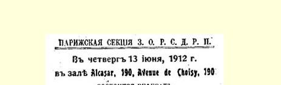
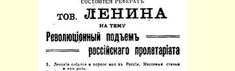
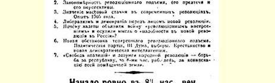
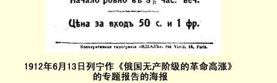

# 附录俄国社会民主工党第六次 （布拉格）全国代表会议材料

> （１９１２年１月）

## １ 对《关于召集代表会议的俄国组织委员会》的决议草案的意见２１５

> （１月５日〔１８日〕以前）
>
> 这与感谢**无关**。

这是代表资格审查委员会的事。

我建议不要“感谢”，而是（郑重地）***承认***所做的工作具有极为重大的意义，并**说明**条件的艰难。

> 载于１９４１年《无产阶级革命》杂志译自《列宁全集》俄文第５版第１期第２１卷第４８１页

## ２ 关于确定代表会议性质的发言提纲

> （１月５日〔１８日〕以前）

１．瓦解和没有中央委员会。

２．地方组织对恢复党的主动精神。

第四届 ３．迫切的实际工作任务使恢复党的任务特别

杜马选举。  突出。

４．**·所*有的组织***都被邀请，只有那些不愿意帮助党的组织不出席。

５．在俄国进行活动的所有组织都派代表参加。

—— 确认代表会议为党的最高机关，它有责任建立有全

权的中央机关并帮助各地恢复党的组织和党的工作。

（１）各民族组织曾被邀请三四次

——（一）确认脱离俄国组织的过错完全应由各民族组织承担；

（２）对公开的取消派（崩得）企图的部分支持；

在党要不要存在这个问题上极其动摇不定；

（３）如果那些担负最重要的运动中心的全部工作的俄国组织

拒绝这项工作，拒绝恢复党，那将是极不正常的。

４ （１）三年中没有；

（２）两年半中一直认为有必要并且作了准备；

（３）毫无例外地通知和邀请了所有的组织并为它们的出席提供了可能；

（４）有２０个国内组织团结在俄国组织委员会的周围。

> 载于１９３７年１月１８日《真理报》译自《列宁全集》俄文第５版第１８号第２１卷第４８２—４８３页

## ３ 对党的组织章程的修改草案 [^1]

> （不晚于１月１１日〔２４日〕）

### 组织章程

第１条—— 照旧。

第２条—— 补充容许增补这一点，作为临时措施（根据１９０８ 年１２月决议）。

第３条—— 照旧。

第４条—— 照旧。

第５条—— 照旧。

第６条—— 照旧。

第７条—— 照旧。

第８条——** 全部删去**。授权中央委员会＋地方。

第９条—— 把１０００名选举人改为３０名或５０名，取消（暂时） 比例代表制。

**附注**：鉴于情况紧急，１９１２年的代表会议被确认为**党的最高机关**（见关于代表会议的决议）。[^2]

> 载于１９４１年《无产阶级革命》杂志译自《列宁全集》俄文第５版第１期第２１卷第４８４页

## ４ 对《关于党的工作的性质和组织形式》的决议草案的意见 [^3]

> （１月１１日〔２４日〕）

将下列两点放进开头部分：（ａ）确认１９０８年１２月的决议或确认决议的正确性已被三年来的**经验**所证实；（β）承认地方社会民主力量的工作为我们创造了**近似**１８７８—１８９０年德国那种类型的党２１６。还应该照这种办法做**下去**这**代替**第１条。

在第５条中删去**形成**，“扩大”改为**巩固**。

第７条—— 象１９０８年１２月那样，讲得谨慎些。

第９条—— 应该这样叙述：按时散发定期和经常出版的社会民主党的秘密报纸，无论对政治鼓动，或对领导革命斗争，**还是*对联系*所有的秘密组织**和各种社团中的**秘密支部**，都是特别重要的。

> 载于１９４１年《无产阶级革命》杂志译自《列宁全集》俄文第５版第１期第２１卷第４８５页

## ５ 关于“请愿运动”的决议的材料 [^4]

> （不晚于１月１７日〔３０日〕）

关于请愿运动的决议

题目：

（１）著作家脱离群众的杜撰，［不是］从群众中来［的］；

（２）毫无意义的签名运动，没有明确的［口号］，没有在［群众］ 中进行鼓动，没有得到［群众的］关心；

（３）请愿书的文字和性质都不能令人满意；

（４）当形势把全体人民［获得］自由的全部基本要求提上日程的时候，却抽出部分要求；

（５）失败：１３００人的签名。没有得到基辅、叶卡捷琳诺斯拉夫、 高加索等地的支持；

（６）对无产阶级群众集会的关心表明，接近群众的“［途径］”不应该到取消派喜欢的地方去找。

结论：

承认彻底失败。

从［时代］的具体条件来看，请愿是进行鼓动工作的一种最不 ［利的］方式。

号召进行争取［结社］自由的鼓动，把这一鼓动与总的［政治］ 要求和对群众的革命鼓动**联系起来**。

决议草案

承认：

（１）已经开始的……［所］谓“请愿运动”是由取消派［彼得堡著作家集团］发起的，决不是［群众斗争］的产物……和工人组织或先进工人的积极创举……也无关；

（２）［由于］请愿的［性质］，由于总的政治条件，上述［运动］［必然变成纯形式的］、毫无意义的、群众不感兴趣的［纸上］签名运动， 无论在报刊上，还是在集会上都［没有］工人亲自广泛参加讨论 ……请愿书；

（３）提出的上述请愿书和取消派为此所作的解释，为一个［最］ 先进的、最革命的阶级抽出一个政治自由的要求，［不］把这个要求 ［同］［全体人民］政治自由的［全部的］基本条件［联系起来］，因而歪曲了无产阶级，全体人民的［领袖］……反沙皇制度的斗争的任务，并使“运动”必然遭到［失败］；

（４）这个［请愿运动］的结局明显证实了［整个］这一活动是错误的，是脱离［工人群众］的：请愿书一共征集到１３００人的签名， ［而且］这个显然不被［群众］支持的请愿运动在所有的党组织中， 其中包括［高加索］、叶卡捷琳诺斯拉夫和基辅等地的党组织，甚至在同情取消派的……党组织中，［根本没有得到］任何支持，［我们社会民主党杜马党团］也不支持这个［运动］。

> 载于１９４１年《无产阶级革命》杂志译自《列宁全集》俄文第５版第１期第２１卷第４８６—４８７页

# 《俄国无产阶级的革命高涨》的专题报告提纲

２１７

> （１９１２年５月３１日〔６月１３日）以前）

１．勒拿事件和俄国的五一。群众性罢工及其作用。

２．革命高涨的规律性，革命高涨的前奏和前景。

３．群众性罢工在现代革命中的意义。１９０５年的经验。

４．面临新的革命的自由派和民主派。

５．为什么立宪民主党人向“革命情绪”宣战并谴责“俄国需要一次新的革命”的思想？

６．当前革命高涨的新形势。各个政党、第三届杜马、选举。农民和新的民主派知识分子。

７．“结社自由”和人民革命的口号—— 为争取建立共和国、实行八小时工作制、没收地主全部土地而斗争。

> 载于１９１２年６月１３日以前（公历）译自《列宁全集》俄文第５版俄国社会民主工党国外组织巴黎第２１卷第４８８页支部发布的关于报告的海报

> １９１２年６月１３日列宁作《俄国无产阶级的
>
> 革命高涨》的专题报告的海报
>
> （按原版缩小）

### 注释 １ *俄国组织委员会*是指召开党的全国代表会议的国内组织委员会，它是

> 根据１９１１年俄国社会民主工党中央委员六月会议的决议成立的，于当年９月底在各地方党组织代表会议上组成。
>
> 这次各地方党组织代表的会议，由国外组织委员会全权代表格·康 ·奥尔忠尼启则领导召开，参加会议的有巴库、梯弗利斯、叶卡捷琳堡、 基辅和叶卡捷琳诺斯拉夫等地党组织的代表，包括斯·格·邵武勉、苏 ·斯·斯潘达良、伊·伊·施瓦尔茨等，列席会议的有叶·德·斯塔索娃等。
>
> 会议总共开了三次会。第一次会是在巴库开的，听取了国外组织委员会全权代表的工作总结报告，讨论了各地方的报告，通过了关于会议组成为俄国组织委员会的决议。由于会议开幕后第二天邵武勉即被捕， 出于安全的考虑，已组成为俄国组织委员会的会议随即转移到梯弗利斯继续举行。第二次会讨论了俄国组织委员会同国外组织委员会和国外技术委员会的相互关系问题。会议通过的决议指出，国外组织委员会应服从担负着召开代表会议全部筹备工作的俄国组织委员会，国外组织委员会和国外技术委员会除非通知俄国组织委员会，并经它的同意和指示， 不得通过文字或其他方式发表意见和支用党的经费。这次会还制定了出席党代表会议代表的选举程序。会议通过的关于合法组织参加党代表会议的代表权问题的决议说，俄国组织委员会邀请所有承认秘密的俄国社会民主工党并争取同它建立思想联系的合法的工人组织派代表出席党的代表会议，他们在代表会议上的权利问题由代表会议本身解决。会议通过的《关于民族组织的决议》呼吁各民族组织派代表参加俄国组织委员会，并着手进行出席代表会议代表的选举。第三次会讨论并通过了告各地党组织书草案。告各地党组织书（即《通报》）以及俄国组织委员会各项决议在梯弗利斯以单页形式印了１０００份，分发给了各地的和国外的组织。
>
> 到１９１１年底，在俄国组织委员会周围已团结了２０多个地方组织： 彼得堡、莫斯科、巴库、梯弗利斯、基辅、叶卡捷琳诺斯拉夫、叶卡捷琳堡、 萨拉托夫、喀山、尼古拉耶夫、维尔诺等。俄国组织委员会的活动到１９１２ 年１月俄国社会民主工党第六次（布拉格）全国代表会议召开时结束。——１。 ２ *路标派* 即俄国立宪民主党的著名政论家、反革命自由派资产阶级的代表人物尼·亚·别尔嘉耶夫、谢·尼·布尔加柯夫、米·奥·格尔申宗、 亚·索·伊兹哥耶夫、波·亚·基斯嘉科夫斯基、彼·伯·司徒卢威和谢 ·路·弗兰克。１９０９年春，他们把自己的论述俄国知识分子的一批文章编成文集在莫斯科出版，取名为《路标》，路标派的名称即由此而来。在这些文章中，他们妄图诋毁俄国解放运动的革命民主主义传统、贬低维·格 ·别林斯基、尼·亚·杜勃罗留波夫、尼·加·车尔尼雪夫斯基、德·伊 ·皮萨列夫等人的观点和活动。他们诬蔑１９０５年的革命运动，感谢沙皇政府“用自己的刺刀和牢狱”把资产阶级“从人民的狂暴中”拯救了出来。 列宁在《论〈路标〉》一文中对立宪民主党黑帮分子的这一文集作了批判分析和政治评价（见《列宁全集》第２版第１９卷第１６７—１７６页）。列宁把《路标》文集的纲领在哲学方面和政论方面同黑帮报纸《莫斯科新闻》的纲领相比拟，称该文集为自由派叛变行为的百科全书，是泼向民主派的一大股反动污水。——１。 ３ *召回派*是１９０８年在布尔什维克中间出现的一种机会主义派别，主要代表人物有亚·亚·波格丹诺夫、格·阿·阿列克辛斯基、安·弗·索柯洛夫 （斯·沃尔斯基）、阿·瓦·卢那察尔斯基、马·尼·利亚多夫等。召回派以革命词句作掩护要求从第三届国家杜马中召回俄国社会民主党的代表，并停止在合法和半合法组织中进行工作，宣称在反动条件下党只应进行不合法的工作。召回主义的变种是最后通牒主义。最后通牒派主张向社会民主党杜马党团提出最后通牒，要求党团必须无条件服从党中央委员会的决定，否则即将社会民主党杜马代表召回。召回派的政策使党脱离群众，把党变成为没有能力聚集力量迎接新的革命高潮的宗派组织。
>
> 同召回派的斗争是从１９０８年春天开始的。１９０８年３—４月在讨论第三届国家杜马社会民主党党团头５个月工作总结时，莫斯科的一些区通过了召回主义的决议。５月，在莫斯科市党代表会议上，召回派提出的决议案仅以１８票对１４票被否决。１９０８年６月４日（１７日）《无产者报》第３１ 号发表了莫斯科党代表会议的材料，并根据列宁的建议从这一号起开始讨论对杜马和社会民主党杜马党团的态度问题。与此同时，在各个党组织的内部都同召回派展开了斗争。１９０８年秋，在彼得堡党组织选举出席第五次全国代表会议的代表时，召回派和最后通牒派制定了一个特别纲领， 作为彼得堡委员会扩大会议的决议案。由于这个决议案在各个党组织得不到广泛支持，召回派才未敢在代表会议上公开提出自己的特别纲领。在代表会议以后，根据列宁的意见，《无产者报》登载了召回派的这个纲领。 列宁并写了一系列文章，对召回主义进行批判。
>
> 召回派的领袖人物波格丹诺夫和卢那察尔斯基还同孟什维克取消派尼·瓦连廷诺夫、帕·索·尤什凯维奇一起在报刊上攻击马克思主义理论基础—— 辩证唯物主义和历史唯物主义。卢那察尔斯基并宣扬必须建立新的宗教，把社会主义同宗教结合起来。
>
> １９０９年，召回派、最后通牒派和造神派组成发起小组，在意大利卡普里岛创办了一所实际上是反党派别中心的党校。１９０９年６月，《无产者报》扩大编辑部会议通过决议，指出“布尔什维主义作为俄国社会民主工党中的一个派别，同召回主义和最后通牒主义毫无共同之处”，并号召布尔什维克同这些背离革命马克思主义的反党派别进行最坚决的斗争，在这次会议上，召回派的鼓舞者波格丹诺夫被开除出布尔什维克的队伍。——２。 ４ 指１９１０年１月２—２３日（１月１５日—２月５日）在巴黎举行的俄国社会民主工党中央委员会全体会议，即所谓“统一的”全体会议。
>
> 关于巩固党及其统一的途径和方法问题，１９０９年秋天就特别尖锐地提出来了。１９０９年１１月，列宁根据《无产者报》扩大编辑部会议的决定， 提出布尔什维克同孟什维克护党派接近和结成联盟以便共同反对取消派和召回派的计划。调和派格·叶·季诺维也夫，列·波·加米涅夫、阿 ·伊·李可夫违抗列宁的计划，力图使布尔什维克同孟什维克呼声派（取消派）和托洛茨基分子联合，这实际上就意味着取消布尔什维克党。中央委员约·费·杜勃洛文斯基和维·巴·诺根也表现出调和主义的动摇。 由于党内和俄国国内的既成局势迫切要求解决与联合党的力量有关的各项问题，布尔什维克于１９０９年１１月１日（１４日）致函中央委员会国外局，声明必须在最近期间召开党中央委员会全体会议。
>
> 出席这次全体会议的有布尔什维克、孟什维克取消派、波兰王国和立陶宛社会民主党、崩得、拉脱维亚社会民主党、前进派等派别和集团的代表。列·达·托洛茨基代表维也纳《真理报》出席。格·瓦·普列汉诺夫托词有病没有到会，因此，会上没有孟什维克护党派的代表。
>
> 全会的议程是：中央委员会俄国局的工作报告；中央委员会国外局的工作报告；中央机关报编辑部的工作报告；各民族社会民主党中央委员会的工作报告；党内状况；关于召开下届全党代表会议；俄国社会民主工党中央委员会章程；其他问题。
>
> 在这次全会上，反对列宁立场的人占多数。列宁和他的拥护者经过紧张斗争，在有些问题上达到了目的，但由于调和派搞妥协，也不得不作一些局部的让步，包括组织问题上的让步。会议的决议最终具有折中性质。
>
> 在讨论党内状况问题时，孟什维克呼声派同前进派结成联盟并在托洛茨基分子支持下，竭力维护取消主义和召回主义。列宁在会议上对机会主义和调和派进行了顽强斗争，坚决谴责取消派和召回派，贯彻布尔什维克同孟什维克护党派接近的路线。在他的坚持下，全会通过的《党内状况》这一决议，乃是１９０８年十二月代表会议关于谴责取消主义、无条件地要求承认社会民主党的杜马工作和利用合法机会的决议的继续。尽管调和派和各民族组织的代表因受孟什维克呼声派、前进派和托洛茨基分子的压力而同意不在决议中提取消派和召回派的名称，全会决议仍然谴责了取消主义和召回主义，承认这两个派别的危险性和同它们斗争的必要性。
>
> 全会关于召开全党代表会议的决议反映了一些取消派的观点，但是承认必须召开代表会议，因此仍具有重要意义。布尔什维克根据这个决议展开了筹备召开代表会议的工作。
>
> 在全会上，调和派违反列宁的意旨同托洛茨基结成联盟，把孟什维克呼声派（取消派）而不是把孟什维克护党派安排进党的中央机关。全会还决定资助托洛茨基的维也纳《真理报》，并派中央委员会的代表加米涅夫参加该报编辑部，担任第三编辑。全会决定解散布尔什维克中央，《无产者报》停刊，布尔什维克将自己的部分财产移交中央委员会，其余部分交第三者（卡·考茨基、弗·梅林和克·蔡特金）保管，并由第三者在两年内将它移交给中央委员会会计处，条件是孟什维克呼声派取消自己的派别中心并停止出版自己的派别机关报。在《关于派别中心的决定》中，全会指出“党的利益和党的统一的利益要求在最近停办《社会民主党人呼声报》”。然而全会也只限于得到呼声派和前进派的口头允诺而已。
>
> 孟什维克呼声派、前进派和托洛茨基分子我行我素，拒绝服从全会的决定。因此，１９１０年秋天，布尔什维克宣布他们不受一月全会上各派通过的协议的约束，开始出版自己的机关报《工人报》，争取召开新的全体会议并要求归还交由中央暂时支配的他们自己的财产和资金。
>
> 一月全会的记录已经失落。关于全会的工作以及会上同取消派、前进派、托洛茨基分子和调和派的斗争，详见列宁的《政论家札记》一文（《列宁全集》第２版第１９卷第２３６—３００页）。——２。 ５ *崩得分子*即崩得的成员。崩得是立陶宛、波兰和俄罗斯犹太工人总联盟的简称，１８９７年９月在维尔诺成立。参加这个组织的主要是俄国西部各省的犹太手工业者。崩得在成立初期曾进行社会主义宣传，后来在争取废除反犹太人特别法律的斗争过程中滑到了民族主义立场上。在１８９８年俄国社会民主工党第一次代表大会上，崩得作为只在专门涉及犹太无产阶级的问题上独立的“自治组织”，加入了俄国社会民主工党。在１９０３年俄国社会民主工党第二次代表大会上，崩得分子要求承认崩得是犹太无产阶级的唯一代表。在代表大会否决了这个要求之后，崩得退出了党。在１９０６ 年俄国社会民主工党第四次（统一）代表大会后，崩得重新加入了党。崩得从１９０１年起，是俄国工人运动中民族主义和分离主义的代表。它在党内一贯支持机会主义派别（经济派、孟什维克和取消派），反对布尔什维克。 第一次世界大战期间，崩得分子采取社会沙文主义立场。１９１７年二月革命后，崩得支持资产阶级临时政府。１９１８—１９２０年外国武装干涉和国内战争时期，崩得的领导人同反革命势力勾结在一起，而一般的崩得分子则开始转变，主张同苏维埃政权合作。１９２１年３月崩得自行解散，部分成员加入了俄国共产党（布）。——２。 ６ *《争论专页》*（《》）是俄国社会民主工党中央机关报 《社会民主党人报》的附刊，根据该党中央委员会１９１０年一月全会的决议创办，１９１０年３月６日（１９日）—１９１１年４月２９日（５月１２日）在巴黎出版，共出了３号。编辑部成员包括布尔什维克、孟什维克、最后通牒派、崩得分子、普列汉诺夫派、波兰社会民主党和拉脱维亚边疆区社会民主党的代表。《争论专页》刊登过列宁的《政论家札记》、《俄国党内斗争的历史意义》、《合法派和反取消派的对话》等文章。——２。 ７ 指“前进”集团的成员。

*“前进”集团*是俄国社会民主党内的一个反布尔什维主义的反党集

> 团。它是在亚·亚·波格丹诺夫和格·阿·阿列克辛斯基的倡议下，由召回派、最后通牒派和造神派于１９０９年１２月在它们的派别活动中心卡普里党校的基础上建立的。该集团出版过《前进》文集等刊物。
>
> 前进派在１９１０年一月中央全会上与取消派－呼声派以及托洛茨基分子紧密配合行动。他们设法使全会承认“前进”集团为“党的出版团体”， 并得到中央委员会对该集团刊物的津贴，在全会以后却站在召回派－最后通牒派的立场上尖锐抨击并且拒绝服从全会的决定。１９１２年党的布拉格代表会议以后，前进派同孟什维克取消派和托洛茨基分子联合起来反对这次党代表会议的决议。
>
> 由于得不到工人运动的支持，“前进”集团于１９１３年实际上瓦解， １９１７年二月革命后正式解散。——３。 ８ 呼声派即围绕着《社会民主党人呼声报》形成的取消派集团。

*《社会民主党人呼声报》*（《》）是俄国孟什维克

> 的国外机关报，１９０８年２月—１９１１年１２月先后在日内瓦和巴黎出版，共出了２６号（另外还于１９１１年６月—１９１２年７月出了《〈社会民主党人呼声报〉小报》６号）。该报编辑是：帕·波·阿克雪里罗得、费·伊·唐恩、 尔·马尔托夫、亚·马尔丁诺夫和格·瓦·普列汉诺夫。《社会民主党人呼声报》从创刊号起就维护取消派的立场，为他们的反党活动辩护。普列汉诺夫于１９０８年１２月与该报实际决裂，１９０９年５月１３日正式退出该报编辑部。此后该报就彻底成为取消派的思想中心。——３。 ９ 指孟什维克护党派。

*孟什维克护党派*是孟什维克队伍中的一个在组织上没有完全形成的

> 派别，于１９０８年开始出现，为首的是格·瓦·普列汉诺夫。１９０８年１２ 月，普列汉诺夫同取消派报纸《社会民主党人呼声报》编辑部决裂；为了同取消派进行斗争，１９０９年他恢复出版了《社会民主党人日志》这一刊物。 １９０９年在巴黎、日内瓦、圣雷莫、尼斯等地成立了孟什维克护党派小组。 在俄国国内，彼得堡、莫斯科、叶卡捷琳诺斯拉夫、哈尔科夫、基辅、巴库都有许多孟什维克工人反对取消派，赞成恢复秘密的俄国社会民主工党。普列汉诺夫派在保持孟什维主义立场的同时，主张保存和巩固党的秘密组织，为此目的而同布尔什维克结成了联盟。他们同布尔什维克一起参加地方党委员会，并为布尔什维克的《工人报》、《明星报》撰稿。列宁的同孟什维克护党派接近的策略，扩大了布尔什维克在合法工人组织中的影响。
>
> １９１１年底，普列汉诺夫破坏了同布尔什维克的联盟。他打着反对俄国社会民主工党内部的“派别活动”和分裂的旗号，企图使布尔什维克党同机会主义者和解。１９１２年普列汉诺夫派同托洛茨基派分子、崩得分子和取消派一起反对俄国社会民主工党布拉格代表会议的决议。——３ １０ *《社会民主党人报》*（《》）是俄国社会民主工党秘密发行
>
> 的中央机关报。１９０８年２月在俄国创刊，第２—３２号（１９０９年２月— １９１３年１２月）在巴黎出版，第３３—５８号（１９１４年１１月—１９１７年１月）
>
> 在日内瓦出版，总共出了５８号。根据俄国社会民主工党第五次代表大会
>
> 选出的中央委员会的决定，该报编辑部由布尔什维克、孟什维克和波兰
>
> 社会民主党人的代表组成。列宁是该报实际上的领导者。１９１１年６月孟
>
> 什维克尔·马尔托夫和费·伊·唐恩退出编辑部，同年１２月起《社会民
>
> 主党人报》由列宁主编。该报先后刊登过８０多篇列宁的文章和短评。在
>
> 斯托雷平反动时期和新的革命高涨年代，该报同取消派、召回派和托洛
>
> 茨基分子进行了斗争，宣传了布尔什维克的路线，加强了党的统一和党
>
> 与群众的联系。在第一次世界大战期间，该报同国际机会主义、民族主
>
> 义和沙文主义进行了斗争，团结了各国坚持国际主义立场的社会民主党
>
> 人，宣传了列宁在战争、和平和革命等问题上提出的口号，联合并加强了
>
> 党的力量。——３。 １１ *《工人报》*（《》）是俄国布尔什维克的不合法的通俗机关报， １９１０年１０月３０日（１１月１２日）—１９１２年７月３０日（８月１２日）在巴黎
>
> 不定期出版，共出了９号。创办《工人报》的倡议者是列宁。出版《工人
>
> 报》则是在１９１０年８月哥本哈根国际社会党代表大会期间举行的俄国
>
> 社会民主工党代表（包括布尔什维克、孟什维克护党派，社会民主党杜马
>
> 党团代表等）的联席会议正式决定的。出席这次会议的有列宁、格·瓦·
>
> 普列汉诺夫、格·叶·季诺维也夫、列·波·加米涅夫、亚·米·柯伦
>
> 泰、阿·瓦·卢那察尔斯基、尼·古·波列塔耶夫、伊·彼·波克罗夫斯
>
> 基等。
>
> 列宁是《工人报》的领导者。参加该报编辑部的有列宁、季诺维也夫
>
> 和加米涅夫。积极为该报撰稿的有谢·伊·霍普纳尔、普·阿·贾帕里
>
> 泽、尼·亚·谢马什柯、斯·格·邵武勉等。娜·康·克鲁普斯卡娅是编
>
> 辑部秘书。马·高尔基曾给该报巨大的物质上的帮助。在国外的各布尔
>
> 什维克团体中成立的《工人报》协助小组给予该报极大的物质支援，并协
>
> 助运送报纸到俄国。该报登载过１１篇列宁的文章。该报很受俄国工人欢
>
> 迎，印数达６０００份。工人们纷纷为该报募捐，并积极给该报写稿。该报的 《党的生活》、《各地来信》两栏经常刊登工人和地方党组织的来信和通
>
> 讯。
>
> 《工人报》完成了筹备召开俄国社会民主工党第六次（布拉格）全国
>
> 代表会议的巨大工作。这次代表会议在特别决定中指出《工人报》坚定不
>
> 移地捍卫了党和党性，并宣布《工人报》为俄国社会民主工党中央委员会
>
> 正式机关报。——３。 １２ 指中央委员会代表被排挤出维也纳《真理报》编辑部一事。１９１０年俄国
>
> 社会民主工党中央委员会一月全会关于《真理报》作了如下决议：“中央
>
> 委员会决定：资助《真理报》并派自己的代表加入其编辑部任第三编辑。
>
> 《真理报》编辑部组成的任何变动均须通过编辑部和中央委员会之
>
> 间的协议。
>
> 关于把《真理报》变为中央委员会机关报的问题延至最近一次代表
>
> 会议决定。”
>
> 根据这一决议，列·波·加米涅夫作为中央委员会代表参加了《真
>
> 理报》编辑部。由于该报根本不理会全会决议，双方不断发生摩擦和冲
>
> 突，加米涅夫被迫于１９１０年８月退出该报编辑部。——３。 １３ 指《明星报》和《思想》杂志。

*《明星报》*（《》）是俄国布尔什维克的合法报纸，１９１０年１２月

> １６日（２９日）—１９１２年４月２２日（５月５日）在彼得堡出版。起初每周出
>
> 版一次，从１９１２年１月２１日（２月３日）起每周出版两次，从１９２１年３
>
> 月８日（２１日）起每周出版三次，共出了６９号。（明星报》的续刊是《涅瓦
>
> 明星报》，它是因《明星报》屡被没收（６９号中有３９号被没收）而筹备出
>
> 版的，于１９１２年２月２６日（３月１０日）即《明星报》尚未被查封时在彼得
>
> 堡创刊，最后１号即第２７号于１９１２年１０月５日（１８日）出版。根据在哥
>
> 本哈根国际社会党代表大会期间召开的会议上的协议，《明星报》编辑部
>
> 起初由弗·德·邦契－布鲁耶维奇（代表布尔什维克）、尼·伊·约尔丹
>
> 斯基（代表孟什维克护党派）和伊·彼·波克罗夫斯基（代表第三届国家
>
> 杜马社会民主党党团）组成。尼·古·波列塔耶夫在组织报纸的出版工
>
> 作方面起了很大作用。在这一时期，《明星报》是作为社会民主党杜马党
>
> 团的机关报出版的，曾受孟什维克的影响。１９１１年６月１１日（２４日），该
>
> 报出到第２５号暂时停刊。１９１１年１０月复刊后，编辑部经过改组，已没
>
> 有孟什维克护党派参加。该报就成为纯粹布尔什维克的报纸了。
>
> 列宁对《明星报》进行思想上的领导。他在《明星报》和《涅瓦明星报》
>
> 发表了约５０篇文章，用过的笔名有：弗·伊林、威·弗·、威廉·弗雷、
>
> 弗·尔－科、克·土·、特·、勃·克·、姆·什·、普·普·、尔·西林、
>
> 尔·西·、勃·格·、一个非自由主义怀疑论者、克·弗·、弗·、姆·姆
>
> ·等。
>
> 积极参加该报编辑和组织工作或为该报撰稿的还有尼·尼·巴图
>
> 林、康·斯·叶列梅耶夫、米·斯·奥里明斯基、安·伊·叶利扎罗娃－
>
> 乌里扬诺娃、瓦·瓦·沃罗夫斯基、列·米·米哈伊洛夫、弗·伊·涅夫
>
> 斯基、杰米扬·别德内依、马·高尔基等。《明星报》刊登过格·瓦·普列
>
> 汉诺夫的多篇文章。
>
> 在列宁的领导下，《明星报》成了战斗的马克思主义的报纸。该报与
>
> 工厂工人建立了经常的密切联系，在俄国工人阶级和劳动人民中享有很
>
> 高的威信。１９１２年春，由于工人运动的高涨，《明星报》的作用大大增强
>
> 了。
>
> 以无产阶级先进阶层为读者对象的《明星报》，还为创办布尔什维克
>
> 的群众性的合法报纸《真理报》作了准备。它宣传创办布尔什维克的群众
>
> 性日报的主张，并从１９１２年１月开始为筹办这种报纸开展募捐，得到了
>
> 工人群众的热烈支持。

*《思想》杂志*（《》）是俄国布尔什维克的合法的哲学和社会经

> 济刊物（月刊），１９１０年１２月—１９１１年４月在莫斯科出版，共出了５期。
>
> 该杂志是根据列宁的倡议，为加强对取消派合法刊物的斗争和用马克思
>
> 主义教育先进工人和知识分子而创办的。该杂志的正式编辑和出版者是
>
> ．．皮罗日柯夫，实际编辑是列宁，他从国外领导这一杂志，经常与编
>
> 辑部通信。积极参加杂志工作的有瓦·瓦·沃罗夫斯基、米·斯·奥里
>
> 明斯基、伊·伊·斯克沃尔佐夫－斯捷潘诺夫等人，为杂志撰稿的还有
>
> 孟什维克护党派格·瓦·普列汉诺夫、沙·拉波波特等人。《思想》杂志
>
> 头４期刊载了６篇列宁的文章。《思想》杂志最后一期即第５期被没收，
>
> 杂志被查封。不久《启蒙》杂志在彼得堡出版，它实际上是《思想》杂志的
>
> 续刊。——３。 １４ *《我们的曙光》杂志*（《》）是俄国孟什维克取消派的合法的社会
>
> 政治刊物（月刊），１９１０年１月—１９１４年９月在彼得堡出版。领导人是亚
>
> ·尼·波特列索夫，撰稿人有帕·波·阿克雪里罗得、费·伊·唐恩、尔
>
> ·马尔托夫、亚·马尔丁诺夫等。围绕着《我们的曙光》杂志形成了俄国
>
> 取消派中心。第一次世界大战一开始，该杂志就采取了社会沙文主义立
>
> 场。

*《前进》*即*《前进*。*当前问题文集》*（《ｅ．

> 》）是“前进”集团的刊物，在巴黎出版，共出了４
>
> 集。——４。 １５ *造神派*是俄国１９０５—１９０７年革命失败后在俄国社会民主工党内部分知
>
> 识分子中形成的宗教哲学派别，主要代表人物是阿·瓦·卢那察尔斯
>
> 基、弗·亚·巴扎罗夫等。造神派主张把马克思主义和宗教调和起来，使
>
> 科学社会主义带有宗教信仰的性质，鼓吹创立一种“无神的”新宗教，即 “劳动宗教”。他们认为马克思主义的整个哲学就是宗教哲学，社会民主
>
> 主义运动本身是“新的伟大的宗教力量”，无产者应成为“新宗教的代
>
> 表”。马·高尔基也曾一度追随造神派。列宁在《唯物主义和经验批判主
>
> 义》一书以及１９０８年２—４月、１９１３年１１—１２月给高尔基的信（见《列宁
>
> 全集》第２版第１８、４５、４６卷）中揭露了造神说的反马克思主义本
>
> 质。——４。 １６ 指《社会民主党人呼声报》。见注８。——４。 １７ 指波兰王国和立陶宛社会民主党。

*波兰王国和立陶宛社会民主党*成立于１８９３年７月，最初称波兰王

> 国社会民主党，其宗旨是实现社会主义，建立无产阶级政权，最低纲领是
>
> 推翻沙皇制度，争取政治和经济解放。１９００年８月，该党和立陶宛工人
>
> 运动中的国际主义派合并，改称波兰王国和立陶宛社会民主党。在 １９０５—１９０７年俄国革命中，波兰王国和立陶宛社会民主党提出与布尔
>
> 什维克相近的斗争口号，对自由派资产阶级持不调和的态度。但该党也
>
> 犯了一些错误。列宁曾批评该党的一些错误观点，同时也指出它对波兰
>
> 革命运动的功绩。１９０６年４月，在俄国社会民主工党第四次（统一）代表
>
> 大会上，该党作为地区组织加入俄国社会民主工党，保持组织上的独立。
>
> 在第一次世界大战期间，波兰王国和立陶宛社会民主党持国际主义立
>
> 场，反对支持外国帝国主义者的皮尔苏茨基分子和民族民主党人。该党
>
> 拥护俄国十月社会主义革命，１９１８年在波兰领导建立了一些工人代表
>
> 苏维埃。１９１８年１２月，在该党与波兰社会党—“左派”的统一代表大会
>
> 上，成立了波兰共产党。——５。 １８ *中央委员会国外局*是由１９０８年８月俄国社会民主工党中央委员会全体
>
> 会议批准成立的，是从属于中央委员会俄国局的全党的国外代表机构，
>
> 由三人组成。中央委员会国外局的任务是与在俄国国内活动的中央委员
>
> 会和在国外工作的中央委员保持经常联系，监督俄国社会民主工党国外
>
> 各协助小组以及代表它们的国外中央局的活动，收纳国外组织上缴中央
>
> 委员会会计处的钱款，并为中央委员会募捐。为了把俄国社会民主工党
>
> 国外各协助小组联合起来，使其服从全党的统一领导，１９０８年８月召开
>
> 的中央委员会全会责成中央委员会国外局召开这些小组的专门代表大
>
> 会。但是由于孟什维克取消派所控制的国外中央局的阻挠，在１９０９年整
>
> 整一年内中央委员会国外局未能召集起这个代表大会。１９１０年中央委
>
> 员会一月全会改组了中央委员会国外局，限定它的职能为领导党的一般
>
> 事务，同时相应地加强了中央委员会俄国局的权力。中央委员会国外局
>
> 改由５人组成，其中有各民族组织的中央委员会的代表３人，布尔什维
>
> 克代表１人和孟什维克代表１人。起初组成中央委员会国外局的是：阿
>
> ·伊·柳比莫夫（布尔什维克）、波·伊·哥列夫（孟什维克）、扬·梯什
>
> 卡（波兰社会民主党），约诺夫（崩得）和扬·安·别尔津（拉脱维亚社会
>
> 民主党）。但是不久布尔什维克的代表改为尼·亚·谢马什柯，崩得代表
>
> 改为米·伊·李伯尔，拉脱维亚社会民主党代表改为施瓦尔茨，后二人
>
> 是取消派。这样，取消派就在中央委员会国外局的成员中取得了稳定的
>
> 多数。他们极力破坏党中央机关的工作，阻挠召开中央委员会全会。布尔
>
> 什维克代表谢马什柯被迫于１９１１年５月退出中央委员会国外局。
>
> １９１１年６月在巴黎召开的俄国社会民主工党中央委员会议作出了
>
> 谴责中央委员会国外局政治路线的决议，指出国外局走上了反党的、维
>
> 护派别策略的道路，决定把国外局是否继续存在的问题提交最近召开的
>
> 中央委员会全会解决。１９１１年１１月，波兰社会民主党从中央委员会国
>
> 外局召回了自己的代表，随后拉脱维亚社会民主党也召回了自己的代
>
> 表。１９１２年１月，中央委员会国外局自行撤销。——５ １９ 参看《“保管人”仲裁法庭的总结》一文（见本卷第３５—３７页）。——５。 ２０ 指俄国社会民主工党中央委员会议。

*俄国社会民主工党中央委员会议*（俄国社会民主工党国外中央委员

> 会议）于１９１１年５月２８日—６月４日（６月１０—１７日）在巴黎举行。这
>
> 次会议是在列宁领导下撇开中央委员会国外局筹备和召开的，因为该局
>
> 的取消派多数一直在阻挠中央全会的召开。会议的筹备工作于１９１１年 ４月开始。１９１１年５月上半月，布尔什维克根据１９１０年中央一月全会通
>
> 过的中央委员会章程，由自己在中央国外局的代表尼·亚·谢马什柯再
>
> 次向中央委员会国外局提出必须在国外召开中央全会，结果再次遭到拒
>
> 绝。１９１１年５月１４日（２７日）谢马什柯退出了中央委员会国外局。同一
>
> 天，以布尔什维克和波兰社会民主党方面的中央委员和候补中央委员的
>
> 名义，向国外的中央委员发出了参加会议的邀请书。
>
> 会议于１９１１年５月２８日（６月１０日）开幕。有权参加会议的９个人
>
> 除崩得分子约诺夫外，都出席了会议，他们是布尔什维克列宁、格·叶·
>
> 季诺维也夫、阿·伊·李可夫，波兰社会民主党代表扬·梯什卡、费·埃
>
> ·捷尔任斯基，拉脱维亚社会民主党代表马·奥佐林，呼声派分子波·
>
> 伊·哥列夫，崩得分子米·伊·李伯尔。
>
> 鉴于当时党内的状况，列宁在第一次会议上建议应承认这次中央委
>
> 员会议不仅有权对某些问题提出意见，而且有权通过党必须执行的决
>
> 议。呼声派分子哥列夫和崩得分子李伯尔则企图证明会议无权就召开中
>
> 央全会和筹备全党代表会议采取任何实际措施。当会议通过关于确定会
>
> 议性质的决定（会议根据这个决定把关于恢复中央的问题列入了议程）
>
> 以后，哥列夫退出了会议，并指责会议的参加者“侵权”。
>
> 会议讨论了召开中央全会的问题。当讨论到有权参加全会的人选问
>
> 题时，列宁声明说，孟什维克约·安·伊苏夫（米哈伊尔）、康·米·叶尔
>
> 莫拉耶夫（罗曼）和彼·阿·勃朗施坦（尤里）是斯托雷平“工”党的组织
>
> 者，无权参加全会。崩得分子李伯尔则为他们辩护，并退出了会议，以示
>
> 对列宁声明的抗议。
>
> 会议通过了近期在国外召开中央全会的决议，并为此成立了一个委
>
> 员会。
>
> 会议拟出了制定党在第四届国家杜马选举运动中的策略和拟订选
>
> 举纲领草案的措施。
>
> 会议议程上的主要问题是召开党的代表会议。会议就这个问题通过
>
> 的决议指出，第四届杜马选举的临近，工人运动的活跃以及党内的状况，
>
> 使召开党代表会议刻不容缓。鉴于不可能立即召开中央全会，会议主动
>
> 承担了发起召开代表会议的责任，并成立了筹备代表会议的组织委员
>
> 会。会议通过了列宁提出的关于成立俄国委员会以开展筹备代表会议的
>
> 实际工作的建议（见《列宁全集》第２版第２０卷第２７４页）。会议的决议
>
> 规定邀请在国外的党组织一道参加组织委员会的工作。在表决时，列宁
>
> 对这项决议总的表示同意，同时声明反对邀请反党集团呼声派和前进派
>
> 的代表参加组织委员会（同上，第２７５页）。
>
> 会议谴责中央委员会国外局的反党的派别政策，并决定把中央委员
>
> 会国外局的存在问题提交中央全会解决。列宁在表决决议案的最后一部
>
> 分时弃权，因为他坚持立即改组中央委员会国外局。会议成立了执行技
>
> 术职能（为党的出版工作服务、组织运输等）的技术委员会，归参加会议
>
> 的中央委员和候补中央委员领导。
>
> 为了筹备全党代表会议，列宁把富有经验的党的工作者—— 布尔什
>
> 维克格·康·奥尔忠尼启则（谢尔戈）、波·阿·布列斯拉夫（扎哈尔）和
>
> 伊·伊·施瓦尔茨（谢苗）派回国内。到１９１１年９月，赞同会议决议的已
>
> 有基辅、叶卡捷琳诺斯拉夫、巴库和罗斯托夫委员会，俄国社会民主工党
>
> 梯弗利斯选出的领导小组，俄国社会民主工党彼得堡组织市区小组代表
>
> 大会以及乌拉尔许多城市的社会民主党组织等。１９１１年９月，组成了有
>
> 许多社会民主党组织的代表参加的俄国组织委员会。该委员会筹备了 １９１２年１月召开的俄国社会民主工党第六次（布拉格）全国代表会
>
> 议。——５。 ２１ *技术委员会*（国外技术委员会）是１９１１年俄国社会民主工党中央委员六
>
> 月会议在６月１日（１４日）会议上成立的，执行有关党的出版、运输等工
>
> 作的技术职能。技术委员会作为在举行中央全会之前的临时机构，由出
>
> 席六月会议的中央委员和候补中央委员领导。布尔什维克、调和派和波
>
> 兰社会民主党各有１名代表参加这一委员会。该委员会中调和派多数 （米·康·弗拉基米罗夫和支持他的弗·Ｌ．列德尔）拖延支付国外组织
>
> 委员会用于召开党代表会议的款项以及出版布尔什维克的《明星报》的
>
> 拨款，并企图阻止党中央机关报《社会民主党人报》的出版。技术委员会
>
> 在自己的机关刊物——《情报公报》中攻击列宁和布尔什维克。在１０月 １９日（１１月１日）委员会会议讨论俄国组织委员会的《通报》和决议时，
>
> 布尔什维克代表米·费·弗拉基米尔斯基提议服从俄国组织委员会的
>
> 决议。这一提议被否决，因而弗拉基米尔斯基退出了技术委员会，从此布
>
> 尔什维克和该委员会断绝了一切联系。——５。 ２２ *国外组织委员会*于１９１１年６月１日（１４日）在六月中央委员会议上成
>
> 立，由布尔什维克、调和派和波兰社会民主党人的代表组成。被邀参加
>
> 委员会的其他国外组织和团体没有派出自己的代表。组织委员会派格
>
> ·康·奥尔忠尼启则为全权代表回国进行筹备全党代表会议的工作，并
>
> 印发《告社会民主党各组织、团体和小组书》，号召它们着手选举俄国组
>
> 织委员会。然而国外组织委员会从成立时起就由调和派分子以及支持
>
> 他们的波兰社会民主党代表占了多数，这一调和派多数执行了同拒绝派
>
> 代表参加国外组织委员会的前进派和列·达·托洛茨基继续谈判的无
>
> 原则方针。调和派在自己的刊物上指责布尔什维克搞派性。他们利用自
>
> 己在国外组织委员会中的优势，迟迟不把党的经费寄回俄国，阻挠筹备
>
> 代表会议。
>
> 由于布尔什维克进行工作的结果，成立了俄国组织委员会。１９１１年 １０月底，国外组织委员会讨论了俄国组织委员会通过的关于它的成立
>
> 的《通报》和决议，根据决议，俄国组织委员会完全拥有召开代表会议的
>
> 一切权力，而组织委员会和技术委员会均须服从俄国组织委员会。国外
>
> 组织委员会的调和派多数拒绝服从这些决议，布尔什维克代表乃退出了
>
> 国外组织委员会。１０月３０日（１１月１２日），由国内来到巴黎的奥尔忠尼
>
> 启则在国外组织委员会会议上作了关于俄国组织委员会活动的报告，在
>
> 这以后，国外组织委员会不得不承认俄国组织委员会的领导作用。然而
>
> 国外组织委员会不久就开始公开反对俄国组织委员会，１１月２０日（１２
>
> 月３日）它印发了《致俄国组织委员会的公开信》，指责俄国组织委员会
>
> 搞派性。奥尔忠尼启则在１９１１年１２月８日《社会民主党人报》第２５号
>
> 上发表的《给编辑部的信》中，揭露了国外组织委员会的反党行为。俄国
>
> 组织委员会把在俄国的秘密党组织团结在自己周围，一手完成了召开全
>
> 党代表会议的全部筹备工作。——５。 ２３ *《崩得评论》*（《》）是崩得国外委员会的机关刊物（不定
>
> 期），１９０９年３月—１９１１年２月在日内瓦出版，共出了５期。——６。 ２４ *《真理报》*（《》）是托洛茨基派的派别报纸，１９０８—１９１２年出版，开
>
> 头３号在利沃夫出版，后来在维也纳出版，共出了２５号。除前两号作为
>
> 斯皮尔卡（乌克兰社会民主联盟）的机关报出版外，该报不代表俄国的
>
> 任何党组织，按照列宁的说法，它是一家“私人企业”。该报编辑是列·
>
> 达·托洛茨基。
>
> 该报以“非派别性”的幌子作掩护，从最初几号起就反对布尔什维
>
> 主义，维护取消主义和召回主义，宣扬革命者和机会主义者共处于一党
>
> 之中的中派理论。１９１０年中央一月全会以后，该报采取赤裸裸的取消派
>
> 的立场，支持反党的“前进”集团。１９１２年，托洛茨基及其报纸成了反党
>
> 的八月联盟的发起人和主要组织者。——６。 ２５ *巴库和基辅的党组织*都是反动时期和新的革命高涨年代最积极的地方
>
> 党组织。在巴库，原来存在着两个平行的组织：布尔什维克的巴库委员会
>
> 和“孟什维克的领导集体”。１９１１年初，两个组织在反对召回主义和取消
>
> 主义、争取恢复秘密的俄国社会民主工党的基础上合并成为统一的俄国
>
> 社会民主工党巴库委员会。巴库党组织拥护１９１１年中央委员六月会议
>
> 关于召开党的全国代表会议的决定，并积极参加了建立俄国组织委员会
>
> 的工作。在基辅，１９１０—１９１１年间，布尔什维克同孟什维克护党派一起
>
> 工作。基辅党组织第一个支持１９１１年中央委员六月会议关于召开党代
>
> 表会议的决定以及建立俄国组织委员会来召开党代表会议的主张，并派
>
> 遣了基辅委员会一名委员去协助国外组织委员会的代表进行工
>
> 作。——６。 ２６ 在俄国组织委员会第一次会议上担任主席的是基辅和叶卡捷琳诺斯拉
>
> 夫组织的代表、孟什维克护党派分子．索柯林。——６。 ２７ 指１９１１年１１月以单页形式印发的俄国组织委员会的《通报》和决议（见 《苏联共产党代表大会、代表会议和中央全会决议汇编》１９６４年人民出
>
> 版社版第１分册第３２３—３２８页）。——７。 ２８ 指格·康·奥尔忠尼启则给《社会民主党人报》编辑部的信。这封信发表
>
> 于１９１１年１２月８日（２１日）《社会民主党人报》第２５号，署名尼
>
> ·。——８。 ２９ *中央委员会俄国局*是俄国社会民主工党中央委员会的一部分，其任务是
>
> 领导俄国国内地方党组织的实际工作。从１９０８年起，俄国局由在俄国活
>
> 动的中央委员会俄国委员会全体会议选出，在两次全体会议之间负责处
>
> 理俄国委员会的一切事务。在１９１０—１９１１年间，即在１９１０年中央委员
>
> 会一月全会之后，俄国局由布尔什维克方面的中央委员和候补中央委员
>
> 组成，起初是约·彼·戈尔登贝格（梅什科夫斯基）和约·费·杜勃洛文
>
> 斯基（英诺森），他们被捕以后是维·巴·诺根（马卡尔）和加·达·莱特
>
> 伊仁（林多夫）。孟什维克取消派方面的中央委员和候补中央委员不参加
>
> 俄国局的工作，约·安·伊苏夫（米哈伊尔）、彼·阿·勃朗施坦（尤里）
>
> 和康·米·叶尔莫拉耶夫（罗曼）不仅拒绝参加工作，而且宣称他们认为
>
> 中央委员会存在的本身是有害的。俄国局尽一切努力召集俄国委员会，
>
> 但始终未能成功。１９１１年３月，在诺根和莱特伊仁被捕以后，俄国局即
>
> 不复存在。列宁对俄国局整顿国内工作和召集俄国委员会的尝试给予积
>
> 极评价，同时对俄国局成员的调和立场给予了尖锐的批评。
>
> 俄国社会民主工党第六次（布拉格）全国代表会议选出的中央委员
>
> 会重新建立了俄国局，其成员有中央委员格·康·奥尔忠尼启则、雅·
>
> 米·斯维尔德洛夫、苏·斯·斯潘达良、斯大林，候补中央委员米·伊·
>
> 加里宁、叶·德·斯塔索娃等。——９。 ３０ 指拉脱维亚边疆区社会民主党。

*拉脱维亚边疆区社会民主党*原称拉脱维亚社会民主工党，于１９０４

> 年６月在该党第一次代表大会上成立。１９０５年６月召开第二次代表大
>
> 会，通过党纲。１９０５年该党领导了工人的革命行动，并训练群众准备武
>
> 装起义。在１９０６年俄国社会民主工党第四次（统一）代表大会上，拉脱维
>
> 亚社会民主工党作为地区组织加入俄国社会民主工党。代表大会后改称
>
> 拉脱维亚边疆区社会民主党。——９。 ３１ 这里说的是中央委员会国外局召开的会议所通过的决议。

*中央委员会国外局召开的会议*于１９１１年８月在伯尔尼的布本贝尔

> 格咖啡馆举行。参加这次会议的除了中央委员会国外局的取消派多数米
>
> ·伊·李伯尔、彼·伊·哥列夫和施瓦尔茨外，还有列·达·托洛茨基 （维也纳《真理报》）、费·伊·唐恩（《社会民主党人呼声报》）和卢吉斯 （拉脱维亚边疆区社会民主党国外委员会）。李伯尔还代表崩得国外委员
>
> 会。扬·梯什卡接到了邀请，但没有出席会议。拒绝出席这次会议的不仅
>
> 有《工人报》编辑部，而且还有波兰和立陶宛社会民主党总执行委员会，
>
> 以及《社会民主党人日志》编辑部和“前进”集团。会议通过了关于成立国
>
> 内组织委员会、关于对技术委员会和组织委员会的态度等问题的决议，
>
> 企图干扰俄国社会民主工党第六次（布拉格）全国代表会议的筹备工作，
>
> 但没有产生任何实际效果。
>
> 会议发表的《告全体党员书》说，“三个最强大的党组织”—— 高加索
>
> 区域组织、崩得和拉脱维亚社会民主党—— 给自己提出了立即采取必要
>
> 的步骤以成立国内的组织委员会这一任务，会议对它们的倡议表示欢
>
> 迎。但是，这个倡议是在所谓“三个最强大的党组织”之一的拉脱维亚社
>
> 会民主党尚未表态时就宣扬出去的。因此，１９１１年秋，李伯尔同取消派
>
> 的高加索区域委员会的一位代表一道前往拉脱维亚边疆区社会民主党
>
> 国外委员会的所在地布鲁塞尔（“ｚ城”），企图取得该委员会在决议上的
>
> 签名，同时签订“三个最强大的组织的倡议书”。——９。 ３２ 指召回派分子安·弗·索柯洛夫（斯·沃尔斯基）。——９。 ３３ *高加索区域委员会*（外高加索区域委员会）是高加索孟什维克取消派的
>
> 派别中心。该委员会是在１９０８年２月外高加索社会民主党组织第五次
>
> 代表大会上选出的。出席代表大会的有１５名孟什维克和１名布尔什维
>
> 克。
>
> 委员会没有经过任何选举，也不顾各个党组织的意志，就任命帕·
>
> 波·阿克雪里罗得，费·伊·唐恩和诺·维·拉米什维里为出席俄国社
>
> 会民主工党第五次全国代表会议的代表。１９１２年该委员会参加了托洛
>
> 茨基组织的反党的八月联盟。——９。 ３４ 指俄国社会民主工党第五次全国代表会议。

*俄国社会民主工党第五次全国代表会议*于１９０８年１２月２１—２７日

> （１９０９年１月３—９日）在巴黎举行。出席代表会议的有２４名代表，其中
>
> 有表决权的代表１６名：布尔什维克５名（中部工业地区代表２名，彼得
>
> 堡组织代表２名，乌拉尔组织代表１名），孟什维克３名（均持高加索区
>
> 域委员会的委托书），波兰社会民主党５名，崩得３名。布尔什维克另有 ３名代表因被捕未能出席。列宁作为俄国社会民主工党中央委员会的代
>
> 表出席代表会议，有发言权。代表会议的议程包括：俄国社会民主工党中
>
> 央委员会、波兰社会民主党中央委员会、崩得中央委员会以及一些大的
>
> 党组织的工作报告；目前政治形势和党的任务；关于社会民主党杜马党
>
> 团；因政治情况变化而发生的组织问题；地方上各民族组织的统一；国外
>
> 事务。
>
> 在代表会议上，布尔什维克就所有问题同孟什维克取消派进行了不
>
> 调和的斗争，也同布尔什维克队伍中的召回派进行了斗争，并取得了重
>
> 大的胜利。代表会议在关于工作报告的决议里，根据列宁的提议建议中
>
> 央委员会维护党的统一，并号召同一切取消俄国社会民主工党而代之以
>
> 不定形的合法联合体的企图进行坚决的斗争。由于代表会议须规定党在
>
> 反动年代条件下的策略路线，讨论目前形势和党的任务就具有特别重要
>
> 的意义。孟什维克企图撤销这一议程未能得逞。会议听取了列宁作的《关
>
> 于目前形势和党的任务的报告》（报告稿没有保存下来，但其主要思想已
>
> 由列宁写入《走上大路》一文，见《列宁全集》第２版第１７卷第３２９—３３９
>
> 页），并稍作修改通过了列宁提出的决议案。在讨论列宁的决议草案时，
>
> 孟什维克建议要在决议里指出，专制制度不是在变成资产阶级君主制，
>
> 而是在变成财阀君主制，这一修改意见被绝大多数票否决；召回派则声
>
> 明他们不同意决议草案的第５条即利用杜马和杜马讲坛进行宣传鼓动
>
> 那一条，但同意其他各条，因此投赞成票。关于杜马党团问题的讨论集中
>
> 在是否在决议中指出杜马党团的错误和中央委员会对党团决定有无否
>
> 决权这两点上。孟什维克对这两点均持否定态度，并且援引西欧社会党
>
> 的做法作为依据。召回派则声称俄国本来不具备社会民主党杜马党团活
>
> 动的条件，杜马党团的错误是客观条件造成的，因此不应在决议中指出。
>
> 列宁在发言中对召回派作了严厉批评，指出他们是改头换面的取消派，
>
> 他们和取消派有着共同的机会主义基础。代表会议通过了布尔什维克的
>
> 决议案，对党团活动进行了批评，同时也指出了纠正党团工作的具体措
>
> 施。在组织问题上代表会议也通过了布尔什维克的决议案，其中指出党
>
> 应当特别注意建立和巩固秘密的党组织，而同时利用各种各样的合法团
>
> 体在群众中进行工作。在关于地方上各民族组织统一的问题上，代表会
>
> 议否定了崩得所维护的联邦制原则。此外，代表会议也否决了孟什维克
>
> 关于把中央委员会移到国内、取消中央委员会国外局以及把中央机关报
>
> 移到国内等建议。
>
> 俄国社会民主工党第五次全国代表会议的意义在于它把党引上了
>
> 大路，是在反革命胜利后俄国工人运动发展中的一个转折点。——１０。 ３５ 关于第二届国家杜马社会民主党代表案件的审判，参看列宁的《关于第
>
> 二届杜马的社会民主党党团。对整个案件的介绍》一文（《列宁全集》第２
>
> 版第２０卷第３８１—３８５页）。第三届杜马社会民主党党团提出的质问，在 １９１１年１１月１５日（２８日）杜马会议上讨论过，后来又秘密讨论过三次；
>
> 质问提交委员会后被否决。——１２。 ３６ *第三届杜马*（第三届国家杜马）是根据１９０７年６月３日（１６日）沙皇解散
>
> 第二届杜马时颁布的新的选举条例在当年秋天选举、当年１１月１日（１４
>
> 日）召开的，存在到１９１２年６月９日（２２日）。这届杜马共有代表４４２人，
>
> 先后任主席的有尼·阿·霍米亚科夫、亚·伊·古契柯夫（１９１０年，３月
>
> 起）和米·弗·罗将柯（１９１１年起），他们都是十月党人。这届杜马按其
>
> 成分来说是黑帮－十月党人的杜马，是沙皇政府对俄国革命力量实行反
>
> 革命的暴力和镇压政策的驯服工具。这届杜马的４４２名代表中，有右派 １４７名，十月党人１５４名，立陶宛－白俄罗斯集团７名，波兰代表联盟１１
>
> 名，进步派２８名，穆斯林集团８名，立宪民主党人５４名，劳动派１４名，
>
> 社会民主党人１９名。因此它有两个反革命的多数：黑帮－十月党人多数
>
> 和十月党人－立宪民主党人多数。沙皇政府利用前一多数来保证推行斯
>
> 托雷平的土地政策，在工人问题上采取强硬政策，对少数民族采取露骨
>
> 的大国主义政策；而利用后一多数来通过微小的让步即用改良的办法诱
>
> 使群众脱离革命。
>
> 第三届杜马全面支持沙皇政府在六三政变后的内外政策。它拨巨款
>
> 给警察、宪兵、法院、监狱等部门，并通过了一个大大扩大了军队员额的
>
> 兵役法案。第三届杜马的反动性在工人立法上表现得尤为明显，它把几
>
> 个有关工人保险问题的法案搁置了３年，直到１９１１年在新的革命高潮
>
> 到来的形势下才予以批准，但保险条件比１９０３年法案的规定还要苛刻。 １９１２年３月５日（１８日），杜马工人委员会否决了罢工自由法案，甚至不
>
> 许把它提交杜马会议讨论。在土地问题上，第三届杜马完全支持斯托雷
>
> 平的土地法，于１９１０年批准了以１９０６年１１月９日（２２日）法令为基础
>
> 的土地法，而拒绝讨论农民代表提出的一切关于把土地分配给无地和少
>
> 地农民的提案。在少数民族问题上，它积极支持沙皇政府的俄罗斯化政
>
> 策，通过一连串的法律进一步限制少数民族的基本权利。在对外政策方
>
> 面，它主张沙皇政府积极干涉巴尔干各国的内政，破坏东方各国的民族
>
> 解放运动的革命。
>
> 第三届国家杜马的社会民主党党团，尽管工作条件极为恶劣，人数
>
> 不多，在最初活动中犯过一些错误，但是在列宁的批评和帮助下，工作有
>
> 所加强，在揭露第三届杜马的反人民政策和对无产阶级和农民进行政治
>
> 教育等方面都做了大量的工作。——１２。 ３７ 立宪民主党（正式名称为人民自由党）是俄国自由主义君主派资产阶级
>
> 的主要政党，于１９０５年１０月成立。中央委员中多数是资产阶级知识分
>
> 子、地方自治人士和自由派地主。主要活动家有帕·尼·米留可夫、谢·
>
> 安·穆罗姆采夫、瓦·阿·马克拉柯夫、安·伊·盛加略夫、彼·伯·司
>
> 徒卢威、约·弗·盖森等。立宪民主党提出一条与革命道路相对抗的和
>
> 平的宪政发展道路，主张俄国实行立宪君主制和资产阶级的自由。１９０６
>
> 年春，它曾同政府进行参加内阁的秘密谈判，后来在国家杜马中自命为 “负责的反对派”。在第一次世界大战期间，它支持沙皇政府的掠夺政策，
>
> 曾同十月党等反动政党组成“进步同盟”，要求成立责任内阁，即资产阶
>
> 级和地主所信任的政府，力图阻止革命并把战争进行到最后胜利。二月
>
> 革命后，立宪民主党在资产阶级临时政府中居于领导地位，竭力阻挠土
>
> 地问题、民族问题等基本问题的解决，奉行继续帝国主义战争的政策。七
>
> 月事变后，它支持科尔尼洛夫叛乱，阴谋建立军事独裁。十月革命胜利
>
> 后，苏维埃政府于１９１７年１１月２８日（１２月１１日）宣布立宪民主党为 “人民公敌的党”。该党随之转入地下，继续进行反革命活动，并参与白卫
>
> 将军的武装叛乱。国内战争结束后，该党上层分子大多数逃亡国外。１９２１
>
> 年５月，该党在巴黎召开代表大会时分裂，作为统一的党不复存在。

*“陛下的反对派”*一词出自俄国立宪民主党领袖帕·尼·米留可夫

> 的一次讲话。１９０９年６月１９日（７月２日），米留可夫在伦敦市长举行的
>
> 早餐会上说：“在俄国存在着监督预算的立法院的时候，俄国反对派始终
>
> 是陛下的反对派，而不是反对陛下的反对派。”（见１９０９年６月２１日（７
>
> 月４日）《言语报》第１８７号）本卷里的“伦敦口号”也是指米留可夫的这
>
> 句话。——１２。 ３８ *“进步派”*是俄国自由主义君主派资产阶级的一个政治集团，由第三届国
>
> 家杜马中的和平革新党和民主改革党的代表联合组成。出于害怕爆发新
>
> 的革命的动机，“进步派”批评沙皇政府的“极端行为”，认为政府不肯让
>
> 步造成了左派革命力量活动的条件。在１９１２年第四届国家杜马选举中， “进步派”同立宪民主党结成了联盟。“进步派”杜马代表在第三届杜马初
>
> 期是２８名，末期增加到３７名，到了第四届杜马又进一步增至４８名。
>
> １９１２年１１月１１—１３日，“进步派”在彼得堡召开代表大会，组成独
>
> 立政党—— 进步党。该党纲领的要点是：制定温和的宪法，实行细微的改
>
> 革，建立责任内阁即对杜马负责的政府，镇压革命运动。列宁称这个纲领
>
> 为民族主义自由派纲领，认为进步党人按其成分和思想体系来说是十月
>
> 党人和立宪民主党人的混合物，该党将成为德国也有的那种“真正的”资
>
> 本主义资产阶级政党。进步党的首领中有著名的大工厂主亚·伊·柯诺
>
> 瓦洛夫、帕·巴·里亚布申斯基、弗·巴·里亚布申斯基，大地主和地方
>
> 自治人士伊·尼·叶弗列莫夫、格·叶·李沃夫、尼·尼·李沃夫、叶·
>
> 尼·特鲁别茨科伊、德·尼·希波夫、马·马·柯瓦列夫斯基等。第一次
>
> 世界大战期间，进步党人支持沙皇政府，倡议成立军事工业委员会。１９１５
>
> 年夏，进步党同其他地主资产阶级政党联合组成“进步同盟”，后于１９１６
>
> 年退出。１９１７年二月革命后，进步党的一些首领加入了国家杜马临时委
>
> 员会，后又加入了资产阶级临时政府。但这时进步党本身实际上已经瓦
>
> 解。十月革命胜利后，原进步党首领积极反对苏维埃政权。——１２。 ３９ 十月党人是俄国十月党的成员。十月党（十月十七日同盟）代表和维护俄
>
> 国大工商业资本家和按资本主义方式经营的大地主的利益，属于自由派
>
> 右翼。该党于１９０５年１１月成立，名称取自沙皇１９０５年１０月１７日宣
>
> 言。十月党的主要领导人是大工业家和莫斯科房产主亚·伊·古契柯夫
>
> 和大地主米·弗·罗将柯，活动家有彼·反·葛伊甸、德·尼·希波夫、
>
> 米·亚·斯塔霍维奇、尼·阿·霍米亚科夫等。十月党完全拥护沙皇政
>
> 府的对内对外政策。第一次世界大战期间，它曾号召支持政府，后来参加
>
> 了军事工业委员会的活动，同立宪民主党等组成“进步同盟”，主张把帝
>
> 国主义的掠夺战争进行到最后胜利，并通过温和的改革来阻止人民革命
>
> 和维护君主制。二月革命后，该党参加了资产阶级临时政府。十月革命
>
> 后，十月党人反对苏维埃政权，在白卫分子政府中担任要职。——１２。 ４０ *《莫斯科呼声报》*（《》）是俄国十月党人的机关报（日报），
>
> １９０６年１２月２３日—１９１５年６月３０日（１９０７年１月５日—１９１５年７
>
> 月１３日）在莫斯科出版。十月党人领袖亚·伊·古契柯夫是该报的出
>
> 版者和第一任编辑，也是后来的实际领导者。参加该报工作的有尼·斯
>
> ·阿夫达科夫、亚·弗·博勃里舍夫－普希金、尼·谢·沃尔康斯基、
>
> 弗·伊·格里耶、费·尼·普列瓦科、亚·阿·斯托雷平等。该报得到
>
> 俄国大资本家的资助。——１２。 ４１ *《生活事业》*杂志（《》）是孟什维克取消派的合法机关刊物，
>
> １９１１年１—１０月在彼得堡出版，共出了９期。——１３。 ４２ *《言语报》*（《》）是俄国立宪民主党的中央机关报（日报），１９０６年２月 ２３日（３月８日）起在彼得堡出版，实际编辑是帕·尼·米留可夫和约·
>
> 弗·盖森。积极参加该报工作的有马·莫·维纳维尔、帕·德·多尔戈
>
> 鲁科夫、彼·伯·司徒卢威等。１９１７年二月革命后，该报积极支持资产
>
> 阶级临时政府的对内对外政策，反对布尔什维克。１９１７年１０月２６日 （１１月８日）被查封。后曾改用《我们的言语报》、《自由言语报》、《时代
>
> 报》、《新言语报》和《我们的时代报》等名称继续出版，１９１８年８月最终
>
> 被查封。——１３。 ４３ *经济主义*是１９世纪末—２０世纪初俄国社会民主党内的机会主义派别，
>
> 是国际机会主义的俄国变种。经济派的代表人物是康·米·塔赫塔廖
>
> 夫、谢·尼·普罗柯波维奇、叶·德·库斯柯娃、波·尼·克里切夫斯
>
> 基、亚·萨·皮凯尔（亚·马尔丁诺夫）、弗·彼·马赫诺韦茨（阿基莫
>
> 夫）等。经济派的主要报刊是《工人思想报》（１８９７—１９０２年）和《工人事
>
> 业》杂志（１８９９—１９０２年）。
>
> 经济派主张工人阶级只进行争取提高工资、改善劳动条件等等的经
>
> 济斗争，认为政治斗争是自由派资产阶级的事情。他们否认工人阶级政
>
> 党的领导作用，崇拜工人运动的自发性，否认向工人运动灌输社会主义
>
> 意识的必要性，维护分散的和手工业的小组活动方式，反对建立集中的
>
> 工人阶级政党。经济主义有诱使工人阶级离开革命道路而沦为资产阶级
>
> 政治附庸的危险。
>
> 列宁对经济派进行了始终不渝的斗争。他在《俄国社会民主党人抗
>
> 议书》（见《列宁全集》第２版第４卷第１４４—１５６页）中尖锐地批判了经
>
> 济派的纲领。列宁的《火星报》在同经济主义的斗争中发挥了重大作用。
>
> 列宁的《怎么办？》（见《列宁全集》第２版第６卷第１—１８３页）一书，从思
>
> 想上彻底地粉碎了经济主义。——１４。 ４４ 指俄国社会民主工党第五次（伦敦）代表大会通过的《关于对待非无产阶
>
> 级政党的态度的决议》（见《苏联共产党代表大会、代表会议和中央全会
>
> 决议汇编》１９６４年人民出版社版第１分册第２０６—２０７页）。

*俄国社会民主工党第五次（伦敦）代表大会*于１９０７年４月３０日—５

> 月１９日（５月１３日—６月１日）举行。出席大会的代表有３４２名，代表约 １５万名党员，其中有表决权的代表３０３名，有发言权的代表３９名。在有
>
> 表决权的代表中，有布尔什维克８９名，孟什维克８８名，波兰王国和立陶
>
> 宛社会民主党代表４５名，拉脱维亚边疆区社会民主党代表２６名，崩得
>
> 代表５５名。列宁作为卡马河上游地区（乌拉尔）党组织的代表参加了代
>
> 表大会并被选入了主席团。
>
> 代表大会讨论了以下问题：中央委员会的工作报告；杜马党团的工
>
> 作报告和杜马党团组织；对待资产阶级政党的态度；国家杜马；“工人代
>
> 表大会”和非党工人组织；工会和党；游击行动；组织问题；军队中的工
>
> 作。列宁作了关于对待资产阶级政党的态度问题的报告和总结发言，并
>
> 就中央委员会的工作报告和杜马党团的工作报告等问题发了言。
>
> 布尔什维克在代表大会上得到了波兰王国和立陶宛社会民主党以
>
> 及拉脱维亚边疆区社会民主党的代表的支持。布尔什维克用革命的纲领
>
> 团结了他们，因而在代表大会上获得了多数，取得了革命马克思主义路
>
> 线的胜利。在一切主要问题上，代表大会都通过了布尔什维克的决议案。
>
> 布尔什维克的策略被确定为全党的统一的策略。代表大会选举了由５名
>
> 布尔什维克、４名孟什维克、２名波兰社会民主党人、１名拉脱维亚社会
>
> 民主党人组成的中央委员会。鉴于新的中央委员会成分不一，中央的领
>
> 导不可靠，在代表大会结束时布尔什维克在自己的会议上成立了以列宁
>
> 为首的布尔什维克的中央。——１５。 ４５ *《未来报》*（《》）（《ＬＡｖｅｎｉｒ》）是俄国自由派资产阶级的报纸，
>
> １９１１年１０月２２日—１９１４年１月４日在巴黎用俄文出版（有些材料用
>
> 法文刊印），编辑是弗·李·布尔采夫，撰稿人中有孟什维克和社会革
>
> 命党人。——１６。 ４６ 指第一届和第二届国家杜马。

*第一届国家杜马*（即所谓维特杜马）是根据沙皇政府大臣会议主席

> 谢·尤·维特制定的条例于１９０６年４月２７日（５月１０日）召开的，共有
>
> 代表４７８名，其中立宪民主党人占三分之一强。主席是立宪民主党人谢
>
> ·安·穆罗姆采夫。布尔什维克抵制了这一届杜马的选举。
>
> 第一届国家杜马的中心议题是土地问题。立宪民主党人于５月８日 （２１日）向杜马提出了由４２名代表签署的法案，力图保持地主土地占有
>
> 制，只允许通过“按公平价格”赎买的办法来强制地主转让主要用农民的
>
> 耕畜和农具耕种的或已出租的土地。劳动派于５月２３日（６月５日）提出
>
> 了以“１０４人法案”著称的土地立法草案，要求建立全民土地资产，把超
>
> 过劳动土地份额的地主土地及其他私有土地收归国有，按劳动土地份额
>
> 平均使用土地。沙皇政府于６月２０日（７月３日）发表声明，断然表示地
>
> 主土地占有制不可动摇，并于７月９日（２２日）宣布解散第一届国家杜
>
> 马。
>
> 第二届国家杜马于１９０７年２月２０日（３月５日）召开，共有代表 ５１８人。主席是立宪民主党人费·亚·戈洛文。尽管当时俄国革命处于
>
> 低潮时期，而且杜马选举是间接的、不平等的，但由于各政党的界限比第
>
> 一届国家杜马时期更为明显，群众的阶级觉悟较前提高，以及布尔什维
>
> 克参加了选举，所以第二届国家杜马中左派力量有所加强。

*第二届国家杜马*的中心议题仍然是土地问题。右派和十月党人拥护

> １９０６年１１月９日斯托雷平关于土地改革的法令。立宪民主党人大大删
>
> 削了自己的土地立法草案，把强制转让土地的做法减到最低限度。劳动
>
> 派在土地问题上仍然采取在第一届杜马中采取的立场。孟什维克占多数
>
> 的社会民主党党团提出了土地地方公有化草案，布尔什维克则捍卫全部
>
> 土地国有化纲领。
>
> 在第二届国家杜马中，布尔什维克执行与劳动派建立“左派联盟”的
>
> 策略，孟什维克则执行支持立宪民主党人的机会主义策略。
>
> １９０７年６月３日（１６日），沙皇政府发动反革命政变，解散了第二届
>
> 国家杜马。——１８。 ４７ 指１９０５年１０月１７日（３０日），沙皇尼古拉二世迫于革命运动高涨的形
>
> 势而颁布《关于完善国家制度的宣言》，许诺给予居民以“公民自由”和召
>
> 开“立法杜马”一事。参看列宁《革命第一个回合的胜利》和《总解决的时
>
> 刻临近了》两文（《列宁全集》第２版第１２卷第２６—３３页和第６５—７４
>
> 页）。——１９。 ４８ *《无产者报》*（《》）是俄国布尔什维克的秘密报纸，于１９０６年８
>
> 月２１日（９月３日）—１９０９年１１月２８日（１２月１１日）出版，共出了５０
>
> 号。该报由列宁主编，在不同时期参加编辑部的有亚·亚·波格丹诺
>
> 夫、约·彼·戈尔登贝格、约·费·杜勃洛文斯基等。《无产者报》的头 ２０号是在维堡排版送纸型到彼得堡印刷的，但为保密起见报上印的是
>
> 在莫斯科出版。由于秘密报刊出版困难，从第２１号起移至国外出版（第 ２１—４０号在日内瓦、第４１—５０号在巴黎出版）。《无产者报》是作为俄国
>
> 社会民主工党莫斯科委员会和彼得堡委员会的机关报出版的，在头２０
>
> 号中有些号还同时作为莫斯科郊区委员会、彼尔姆委员会、库尔斯克委
>
> 员会和喀山委员会的机关报出版，但它实际上是布尔什维克的中央机关
>
> 报。该报共发表了列宁的１００多篇文章和短评。《无产者报》第４６号附刊
>
> 上发表了１９０９年６月在巴黎举行的《无产者报》扩大编辑部会议的文
>
> 件。在斯托雷平反动时期，《无产者报》在保存和巩固布尔什维克组织方
>
> 面起了卓越的作用。根据俄国社会民主工党中央委员会１９１０年一月全
>
> 体会议的决议，《无产者报》停刊。——２０。 ４９ *国务会议*是俄罗斯帝国的最高咨议机关，于１８１０年设立，１９１７年二月
>
> 革命后废除。国务会议审议各部大臣提出的法案，然后由沙皇批准；它本
>
> 身不具有立法提案权。国务会议的主席和成员由沙皇从高级官员中任
>
> 命。在沙皇亲自出席国务会议时，由沙皇担任主席。国家杜马设立以后，
>
> 国务会议获得了除改变国家根本法律以外的立法提案权。国务会议成
>
> 员半数改由正教、各省地方自治会议、各省和各州贵族组织、科学院院士
>
> 和大学教授、工商业主组织、芬兰议会分别选举产生。国务会议讨论业经
>
> 国家杜马审议的法案，然后由沙皇批准。——２１。 ５０ 这里说的是１９１１年１２月１７日《未来报》第９号登载的《第二届国家杜
>
> 马代表格·叶·别洛乌索夫》一文。关于“拿炸弹的自由派”一词，参看 《列宁全集》第２版第２０卷第９８页。——２３。 ５１ 第三届杜马社会民主党党团成员阿·阿·沃伊洛什尼科夫在１９１１年 １２月２日（１５日）第三十五次杜马会议上讨论关于修改兵役条例的法律
>
> 草案时发言，把沙皇军队叫作警察军队，并号召用全民武装来代替常备
>
> 军。由于这个发言，杜马主席提议取消沃伊洛什尼科夫参加５次会议的
>
> 资格。沃伊洛什尼柯夫在这次会议上作了第二次发言以后，取消参加会
>
> 议资格的次数又增至１５次。对杜马主席的第一次提议，立宪民主党人投
>
> 了赞成票。——２３。 ５２ 指尼·亚·罗日柯夫的《俄国的现状和当前工人运动的基本任务》一文。
>
> 列宁在《自由派工党的宣言》一文中已批判过罗日柯夫的这篇文章（见 《列宁全集》第２版第２０卷第３９５—３９５页）。——２４。 ５３ 劳动派（劳动团）是俄国国家杜马中的农民代表和民粹派知识分子代表
>
> 组成的小资产阶级民主派集团，１９０６年４月成立。领导人有阿·费·阿
>
> 拉季因、斯·瓦·阿尼金。在国家杜马中，劳动派动摇于立宪民主党和布
>
> 尔什维克之间。第一次世界大战期间，劳动派多数采取了社会沙文主义
>
> 立场。二月革命后，劳动派积极支持资产阶级临时政府，１９１７年６月与
>
> 人民社会党合并。十月革命后，劳动派站在资产阶级反革命势力方
>
> 面。——２４。 ５４ 召开工人代表大会的主张是帕·波·阿克雪里罗得于１９０５年夏首次提
>
> 出的，得到了其他孟什维克的支持。这一思想概括起来说就是召开各种
>
> 工人组织的代表大会，在这个代表大会上建立社会民主党人、社会革命
>
> 党人和无政府主义者都参加的合法的“广泛工人政党”。俄国社会民主工
>
> 党第五次（伦敦）代表大会专门就工人代表大会和非党工人组织问题通
>
> 过了一项决议，指出孟什维克召开工人代表大会的思想“实质上要导致
>
> 以长期性的非党工人组织代替社会民主党，而工人代表大会的宣传和组
>
> 织准备工作必不可免地会导致党的瓦解，并促使广大工人群众接受资产
>
> 阶级民主派的影响”（见《苏联共产党代表大会、代表会议和中央全会决
>
> 议汇编》１９６４年人民出版社版第１分册第２０８页）。与布尔什维克一起
>
> 反对召开工人代表大会的有波兰和拉脱维亚社会民主党人。列宁对孟什
>
> 维克召开工人代表大会的主张的批判，见《革命界的庸俗习气》、《孟什维
>
> 主义的危机》、《知识分子斗士反对知识分子的统治》、《气得晕头转向（关
>
> 于工人代表大会问题）》（《列宁全集》第２版第１４卷第４３—５３页和第 １４７—１７１页，第１５卷第１６５—１６８页和第２４３—２５６）等文。——２９。 ５５ *请愿运动*是取消派和列·达·托洛茨基围绕着彼得堡取消派于１９１０年 １２月起草的《请愿书》而掀起的宣传运动。这份要求结社、集会和罢工自
>
> 由的《请愿书》，准备以工人的名义提交第三届国家杜马，因此曾被发到
>
> 各企业去征集工人的签名。但是请愿运动在工人中间没有取得多大成
>
> 功，征集到的签名仅有１３００个。布尔什维克对“请愿运动”的看法，见俄
>
> 国社会民主工党第六次（布拉格）全国代表会议《关于“请愿运动”的决
>
> 议》（本卷第４９１—４９２页）。——３０。 ５６ 指彼得堡召回派在俄国社会民主工党第五次全国代表会议前夕提交彼
>
> 得堡委员会扩大会议的决议案。１９０９年４月４日（１７日）《无产者报》第 ４４号附刊发表了这个决议案。列宁在同期附刊上发表了《面目全非的布
>
> 尔什维主义》一文，对召回派的这个决议案进行了批判（见《列宁全集》第 ２版第１７卷第３６７—３７９页）。——３３。 ５７ *民族党人*是指全俄民族盟的成员。全俄民族联盟是俄国地主、官僚的反
>
> 革命君主主义政党。该党前身是１９０８年初从第三届国家杜马右派总联
>
> 盟中分离出来的一个独立派别，共２０人，主要由西南各省的杜马代表组
>
> 成。１９０９年１０月２５日，该派同当年４月１９日组成的温和右派党的党团
>
> 合并成为“俄国民族党人”共同党团（１００人左右）。１９１０年１月３１日组
>
> 成为统一的党—— 全俄民族联盟，党和党团主席是彼·尼·巴拉绍夫，
>
> 领导人有．．．克鲁平斯基、弗·阿·鲍勃凌斯基、米·奥·缅施科夫
>
> 和瓦·维·舒利金。该党以维护贵族特权和地主所有制、向群众灌输好
>
> 战的民族主义思想为自己的主要任务。该党的纲领可以归结为极端沙文
>
> 主义、反犹太主义和要求各民族边疆区俄罗斯化。１９１７年二月资产阶级
>
> 民主革命后，该党即不复存在。

*君主派*是指俄国君主党。该党于１９０５年秋在莫斯科最终形成，参加

> 者是一些大土地占有者、沙皇政府的大臣和高级僧侣，首领是反动政论
>
> 家弗·安·格林格穆特、大司祭．．沃斯托尔戈夫、．．多尔戈鲁科夫
>
> 公爵、．．罗森男爵等。该党的机关刊物是《莫斯科新闻》和《俄罗斯通
>
> 报》。该党奉行与俄罗斯人民同盟相近的方针，维护沙皇专制制度、等级
>
> 制度以及正教和大俄罗斯民族的特权。１９１１年该党改名为“俄罗斯君主
>
> 主义同盟”。——３８。 ５８ 指以．．戈洛洛博夫为代表的极右翼十月党人。——３９。 ５９ 指社会革命党。

*社会革命党*是俄国最大的小资产阶级政党，于１９０１年底—１９０２年

> 初由南方社会革命党、社会革命党人联合会、老民意党人小组、社会主义
>
> 土地同盟等民粹派团体联合而成。成立时的领导人有马·安·纳坦松、
>
> 叶·康·布列什柯－布列什柯夫斯卡娅、尼·谢·鲁萨诺夫、维·米·
>
> 切尔诺夫、米·拉·郭茨、格·安·格尔舒尼等。社会革命党人的理论观
>
> 点是民粹主义和修正主义思想的折中混合物。他们否认无产阶级和农民
>
> 之间的阶级差别，抹杀农民内部的矛盾，否认无产阶级在资产阶级民主
>
> 革命中的领导作用。在土地问题上，社会革命党人主张消灭土地私有制，
>
> 按照平均使用原则将土地交村社支配，发展各种合作社。在策略方面，社
>
> 会革命党人采用了社会民主党人进行群众性鼓动的方法，但主要斗争方
>
> 法还是搞个人恐怖。为了进行恐怖活动，该党建立了秘密的事实上脱离
>
> 该党中央的战斗组织。
>
> 在１９０５—１９０７年俄国第一次革命中，社会革命党曾在农村开展焚
>
> 烧地主庄园、夺取地主财产的所谓“土地恐怖”运动，并同其他政党一起
>
> 参加武装起义和游击战，但也曾同资产阶级的解放社签订协议。在国家
>
> 杜马中，该党动摇于社会民主党和立宪民主党之间。该党内部的不统一
>
> 造成了１９０６年的分裂，该党的右翼和极左翼分别组成了人民社会党和
>
> 最高纲领派社会革命党人联合会。在斯托雷平反动时期，社会革命党经
>
> 历了思想上、组织上的严重危机。在第一次世界大战期间，社会革命党的
>
> 大多数领导人采取了社会沙文主义的立场。１９１７年二月革命后，社会革
>
> 命党积极支持资产阶级临时政府，七月事变时期公开转向资产阶级方
>
> 面。十月革命后，社会革命党人公开进行反苏维埃的活动，在国内战争时
>
> 期进行反对苏维埃政权的武装斗争，对共产党和苏维埃政权的领导人实
>
> 行个人恐怖。内战结束后，他们在“没有共产党人参加的苏维埃”的口号
>
> 下组织了一系列叛乱。１９２２年，社会革命党彻底瓦解。——４４。 ６０ 指沙皇尼古拉二世１９０７年６月３日（１６日）颁布的解散第二届杜马和修
>
> 改杜马选举条例的宣言。新的选举条例大大增加了地主和工商业资产阶
>
> 级在杜马中的代表权。按照新的选举条例，地主选民团每２３０人选出１
>
> 个复选人，第一城市选民团每１０００人选出１个复选人，第二城市选民团
>
> 每１５０００人选出１个复选人，农民选民团每６００００人选出１个复选人，
>
> 工人选民团每１２５０００人选出１个复选人。地主和资产阶级共选出６５％
>
> 的复选人（其中地主选出４９．４％的复选人），农民选出２２％的复选人（原
>
> 为４４％），工人只选出２％的复选人（原为４％）。新的选举条例还剥夺了
>
> 俄国亚洲部分土著居民以及阿斯特拉罕省和斯塔夫罗波尔省突厥民族
>
> 的选举权，并削减了民族地区的杜马席位（高加索由２９席减为１０席，波
>
> 兰王国由３７席减为１４席）。在整个俄国，所有不会俄语的人都被剥夺了
>
> 选举权。根据这个选举条例选出的第三届杜马，按其成分来说是黑帮－
>
> 十月党人的杜马。——４４。 ６１ 根据１９０７年６月３日《国家杜马选举条例》，城市选民按照财产状况分
>
> 为两个等级：第一等城市选民大会和第二等城市选民大会（或第一城市
>
> 选民团和第二城市选民团）。第一等城市选民大会是由大资产阶级组成
>
> 的。——４５。 ６２ 指各省选举大会首先从各选民团复选人中选出的杜马代表。１９０７年６
>
> 月３日的选举条例规定了每个省所选杜马代表总名额，同时还规定每个
>
> 省的选举大会首先从哪些选民团的复选人中分别选举杜马代表各１名 （由土地占有者选民团和第一城市选民团复选人占多数的省选举大会来
>
> 选举，并非由该选民团复选人自己推举），然后再来选举名额中余下的代
>
> 表。——４７。 ６３ 列宁对无党派和右派农民代表提交第三届国家杜马的土地法案的评价，
>
> 见《新土地政策》和《第三届杜马关于土地问题的讨论》两文（《列宁全集》
>
> 第２版第１６卷第４３３—４３６页，第１７卷第２８３—２９７页）。——４８。 ６４ 这是有关布尔什维克国外小组会议的一组文献。

*布尔什维克国外小组会议*于１９１１年１２月１４—１７日（２７—３０日）在

> 列宁领导下于巴黎举行。会议是由布尔什维克《工人报》巴黎协助小组发
>
> 起召开的，目的是团结国外的布尔什维克力量，对全国党代表会议的召
>
> 开加以协助。出席会议的有１１名有表决权的代表，他们代表巴黎、南锡、
>
> 苏黎世、达沃斯、日内瓦、列日、伯尔尼、不来梅和柏林的布尔什维克小
>
> 组，其他地区的布尔什维克小组由于各种困难，未能派代表出席会议。有
>
> 些布尔什维克小组给会议寄来了书面报告。列入会议日程的有以下问
>
> 题：组织局和各地代表的报告；关于党内状况；关于国外状况和对各派别
>
> 的态度；组织问题；关于国外工作的任务；对代表会议的态度。
>
> 列宁致开幕词并作了关于党内状况的报告。尼·亚·谢马什柯和米
>
> ·费·弗拉基米尔斯基分别作了关于国外状况的报告。列宁提出的决议
>
> 草案构成了会议通过的关于这三个报告的总决议的基础。会议确认呼声
>
> 派和前进派已彻底离开了党。会议赞同中央委员六月会议就召开党代表
>
> 会议所采取的措施。会议通过了列宁提出的关于支持俄国组织委员会及
>
> 其召开的代表会议的决议。
>
> 会议决定在贯彻真正的党的路线的基础上建立俄国社会民主工党
>
> 国外组织（包括各地的支部），而不容许同取消派妥协。会议选出了国外
>
> 组织委员会。会议的《通报》和决议由俄国社会民主工党国外组织委员会
>
> 于１９１２年１月１２日以单页形式出版（见《苏联共产党代表大会、代表会
>
> 议和中央全会决议汇编》１９６４年人民出版社版第１分册第３２９—３３９
>
> 页）。——６３。 ６５ 这里说的是１９１０年俄国社会民主工党中央一月全会上布尔什维克同其
>
> 他派别签订的“条约”，即全会一致通过的《关于派别中心的决议》和所附
>
> 的《布尔什维克的宣言》和《社会民主党人报》的《编辑部按》（见《苏联共
>
> 产党代表大会、代表会议和中央全会决议汇编》１９６４年人民出版社版第 １分册第３０７—３１０页）。——６３。 ６６ *“１９１０年１２月—１９１１年６月”*是指从１９１０年１１月２２日（１２月５日），
>
> 由于孟什维克、前进派及其他派别不履行协议和执行１９１０年中央一月
>
> 全会的决议，列宁及其他布尔什维克向俄国社会民主工党中央委员会国
>
> 外局提出声明，要求召开中央全会以解决关于把交给“保管人”的钱款归
>
> 还给布尔什维克的问题起，到１９１１年５月２８日—６月４日（６月１０—１７
>
> 日）在巴黎召开中央委员会议止的这段时间。——６３。 ６７ 指１９１１年在巴黎召开的中央委员六月会议。在这次会议上布尔什维克、
>
> 调和派和波兰社会民主党人（“三个派别的联盟”）通过了关于在国外召
>
> 开中央全会和召开党的代表会议的决议，并成立了召开代表会议的组织
>
> 委员会和技术委员会。会后不久，调和派和波兰社会民主党人就在组织
>
> 委员会和技术委员会里进行反对执行会议决议的斗争。布尔什维克和孟
>
> 什维克护党派在他们的阻挠下共同执行了这些决议（“诺言”）。——６３。 ６８ *多数派反对布尔什维克*的第一个时期是指俄国社会民主工党中央一月
>
> 全会（１９１０年）以后一个时期，那时调和派中央委员徒然试图吸收孟什
>
> 维克取消派（彼·阿·勃朗施坦，康·米·叶尔莫拉耶夫，约·安·伊苏
>
> 夫等）参加中央委员会俄国局的实际工作，结果严重地妨碍了工作，而为
>
> 取消派效了劳。这一时期由于４名中央委员（约·彼·戈尔登贝格、约·
>
> 费·杜勃洛文斯基、加·达·莱特伊仁和维·巴·诺根）被捕而结束。多
>
> 数派反对布尔什维克的第二个时期是指１９１１年中央委员六月会议以后
>
> 的时期，那时调和派和波兰社会民主党人在负责召开代表会议的国外组
>
> 织委员会和技术委员会里联合起来反对布尔什维克。——６３。 ６９ 列宁的这个建议是在１９１１年１２月１６日（２９日）布尔什维克国外小组会
>
> 议上提出的，当时会议正在审议是在这次会议上详细讨论国外组织章程
>
> 草案还是把它移交给国外组织委员会去同各小组协商并最后批准这一
>
> 问题。列宁的建议以８票对１票获得通过。——６８。 ７０ *关于召集代表会议的俄国组织委员会的决议*由列宁提出，在１９１１年１２
>
> 月１７日（３０日）布尔什维克国外小组巴黎会议最后一次会议上一致通
>
> 过。俄国社会民主工党国外组织委员会的《通报》公布了这个决议，并附
>
> 有以下说明：“会议通过这一特别决议告诫一切护党同志必须竭力支持
>
> 俄国组织委员会及其召开的代表会议。”（见《苏联共产党代表大会、代表
>
> 会议和中央全会决议汇编》１９６４年人民出版社版第１分册第３３７
>
> 页）——６９。 ７１ *１９０６年１１月９日（２２日）法令*即沙皇政府颁布的《关于农民土地占有和
>
> 土地使用现行法令的几项补充决定》（这项法令由国家杜马和国务会议
>
> 通过后称为１９１０年６月１４日法令）。作为对这项法令的补充，沙皇政府
>
> 于１９０６年１１月１５日（２８日）又颁布了《关于农民土地银行以份地作抵
>
> 押发放贷款的法令》。根据这两个法令，农民可以退出村社，把自己的份
>
> 地变成私产，也可以卖掉份地。村社必须为退社农民在一个地方划出建
>
> 立独立田庄或独立农庄的土地。独立田庄主和独立农庄主可以从农民土
>
> 地银行取得优惠贷款来购买土地。沙皇政府大臣会议主席彼·阿·斯托
>
> 雷平制定这些土地法令的目的是，在保留地主土地私有制和强制破坏村
>
> 社的条件下，建立富农这一沙皇专制制度在农村的支柱。列宁称１９０６年
>
> 斯托雷平土地法令是继１８６１年改革以后俄国从农奴主专制制度变为资
>
> 产阶级君主制的第二步。
>
> 尽管沙皇政府鼓励农民退出村社，但在欧俄部分，九年中（１９０７— １９１５年）总共只有２５０万农户退出村社。首先使用退出村社的权利的是
>
> 农村资产阶级，因为这能使他们加强自己的经济。也有一部分贫苦农民
>
> 退出了村社，其目的是为了出卖份地，彻底割断同农村的联系。穷苦的小
>
> 农户仍旧象以前一样贫穷和落后。斯托雷平的土地政策并没有消除全体
>
> 农民和地主之间的矛盾，只是导致了农民群众的进一步破产，加剧了富
>
> 农和贫苦农民之间的阶级矛盾。——７０。 ７２ *和平革新党*是俄国大资产阶级和地主的君主立宪主义组织，由左派十月
>
> 党人彼·亚·葛伊甸、德·尼·希波夫、米·亚·斯塔霍维奇和右派立
>
> 宪民主党人尼·尼·李沃夫、叶·尼·特鲁别茨科伊等在第一届国家杜
>
> 马中的“和平革新派”基础上组建，１９０６年７月成立。该党持介乎十月党
>
> 和立宪民主党之间的立场，主要是在策略上与它们有所不同，而其纲领
>
> 则十分接近于十月党。和平革新党维护工商业资产阶级和按资本主义方
>
> 式经营的地主的利益，列宁曾称之为“和平掠夺党”。在第三届国家杜马 （１９０７年选出）中，和平革新党同民主改革党联合组成“进步派”，该派是 １９１２年成立的进步党的核心。和平革新党的正式机关刊物是《言论报》
>
> 和《莫斯科周刊》。——７５。 ７３ *《俄罗斯新闻》*（《》）是俄国报纸，１８６３—１９１８年在莫斯
>
> 科出版。它反映自由派地主和资产阶级的观点，主张在俄国实行君主立
>
> 宪，撰稿人是一些自由派教授。至７０年代中期成为俄国影响最大的报纸
>
> 之一。８０—９０年代刊登民主主义作家和民粹主义者的文章。１８９８年和 １９０１年曾经停刊。从１９０５年起成为右翼立宪民主党人的机关报。１９１７
>
> 年二月革命后支持资产阶级临时政府。十月革命后被查封。——７６。 ７４ *《新时报》*（《》）是俄国报纸，１８６８—１９１７年在彼得堡出版。出
>
> 版人多次更换，政治方向也随之改变。１８７２—１８７３年一度采取进步自由
>
> 主义的方针。１８７６—１９１２年由反动出版家阿·谢·苏沃林掌握，成为俄
>
> 国最没有原则的报纸。１９０５年起是黑帮报纸。１９１７年二月革命后，完全
>
> 支持资产阶级临时政府的反革命政策，攻击布尔什维克。１９１７年１０月 ２６日（１１月８日）被查封。列宁称《新时报》是卖身投靠的报纸的典
>
> 型。——７７。 ７５ *《俄国报》*（《》）是一份反动的黑帮报纸（日报），１９０５年１１月—
>
> １９１４年４月在彼得堡出版。从１９０６年起成为内务部的机关报。该报接
>
> 受由内务大臣掌握的政府秘密基金的资助。——８３。 ７６ *关于保安机关的质询*即因大臣会议主席彼·阿·斯托雷平被暗杀而对
>
> 保安机关和警察司的活动提出的质询。这一质询是由以十月党人与民族
>
> 党人这两个党团为一方，社会民主党党团为另一方分别提出的，曾在 １９１１年１０月１５日（２８日）第三届国家杜马会议上讨论。

*关于饥荒的质询*即就没有采取必要的措施对歉收省份的居民给予

> 粮食救援一事提出的质询。这一质询由劳动派提出，在１９１１年１０月１５
>
> 日（２８日）的杜马会议上通过。

*关于１８８１年“暂行”条例的质询*即就延长１８８１年８月１４日沙皇批

> 准的维护国家秩序和社会安定的措施的条例的有效期一事提出的质询。
>
> 这一质询是由立宪民主党杜马党团５４名成员签名提出的，曾在１９１１年 １０月１７日（３０日）的杜马会议上讨论。——８３。 ７７ 立宪民主党代表尼·瓦·捷斯连科在发言的结尾说：“……你们认为可
>
> 以通过行政程序而不通过法律程序来继续实施非常状态，但是请允许我
>
> 提醒你们，伟大的国家法学家耶利内克曾就此说过：‘不要忘记，这种行
>
> 动程序已把王冠加给了两位国君，一位英国的和一位法国的。’”为此他
>
> 被取消了参加１５次会议的资格。——９３。 ７８ 达达兰是法国作家阿·都德的小说《达拉斯贡城的达达兰》中的主人公，
>
> 一个惯于说大话、吹牛皮的人物。——１０１。 ７９ 指沙皇亚历山大三世在位时期（１８８１—１８９４年），当时曾进行反动的“反
>
> 改革”。——１０９。 ８０ 指沙皇尼古拉一世在位时期（１８２５—１８５５年）。——１０９。 ８１ *“第三种分子”*是对在地方自治机关里受雇担任农艺师、统计人员、技术
>
> 员、医生、兽医、教师等职务的平民知识分子的一种称呼，以区别于政府
>
> 与行政当局的人员（第一种分子）和选举产生的地方自治机关的代表（第
>
> 二种分子）。“第三种分子”这个词是俄国萨马拉省副省长．．康多伊迪
>
> 于１９００年首次使用的，在２０世纪最初１０年里流行于俄国。据统计，１９
>
> 世纪末俄国３４省共有６５０００—７００００名地方自治机关职员。“第三种分
>
> 子”的队伍中有不少资产阶级自由派人士和民粹派分子，也有社会民主
>
> 党人。地方自治机关的文化经济活动，特别是医疗卫生在学校事业，靠着 “第三种分子”而得到广泛发展。“第三种分子”作用的增强，遭到了沙皇
>
> 行政机关和保守的贵族地方自治人士的反对。关于“第三种分子”，可参
>
> 看《列宁全集》第２版第５卷第２９３—３０１页。——１０９。 ８２ 拉萨尔派和爱森纳赫派是１９世纪６０年代和７０年代初期德国工人运动
>
> 中的两个派别。

*拉萨尔派*是全德工人联合会的成员，德国小资产阶级社会主义者斐

> ·拉萨尔的拥护者。全德工人联合会在１８６３年于莱比锡召开的全德工
>
> 人代表大会上成立，拉萨尔是它的第一任主席。他为联合会制定了纲领
>
> 和策略基础，规定争取普选权和建立由国家帮助的工人生产合作社为联
>
> 合会的政治纲领和经济纲领。在实践活动中，拉萨尔派支持奥·俾斯麦
>
> 的在普鲁士领导下通过王朝战争自上而下统一德国的政策。马克思和恩
>
> 格斯曾多次尖锐地批判拉萨尔派的理论、策略和组织原则，指出它是德
>
> 国工大运动中的机会主义派别。

*爱森纳赫派*是德国社会民主工党的成员。该党是在奥·倍倍尔和威

> ·李卜克内西领导下，于１８６９年在爱森纳赫代表大会上成立的，曾参加
>
> 第一国际。由于经常接受马克思和恩格斯的指导，爱森纳赫派执行了比
>
> 较彻底的革命政策，尤其是在德国统一的问题上一贯坚持民主的和无产
>
> 阶级的道路。
>
> 拉萨尔派和爱森纳赫派于１８７５年在哥达代表大会上合并为统一的
>
> 德国社会主义工人党。——１１８。 ８３ *“你把本性赶出门外*，*它会从窗口飞进来”*是法国作家让·拉封丹所写寓
>
> 言《变成女人的牝猫》的结束语，意思是事物的本性不能改变。寓言说，一
>
> 个男人养了一只牝猫，经过日夜祈祷，牝猫终于变成了女人，做了他的妻
>
> 子。可是一天夜里，老鼠来咬席子，新娘又象猫一样捉起老鼠来。—— １１９。 ８４ *《鄂毕生活报》*（《》）是俄国自由派资产阶级的日报，１９０９— １９１２年在新尼古拉耶夫斯克（现称新西伯利亚）出版。——１２０。 ８５ *利德瓦尔案件*是指１９０６年瑞典大奸商埃·莱·利德瓦尔和沙皇俄国副
>
> 内务大臣弗·约·古尔柯利用饥荒盗窃公款的案件。利德瓦尔在古尔柯
>
> 帮助下，同政府签订了一项合同，规定在１９０６年１０—１２月为俄国南方
>
> 饥荒省份提供１０００万普特黑麦。利德瓦尔从古尔柯那里支取了巨额的
>
> 国家预付款，然后向古尔柯及其他官员行贿。结果，直到１２月中旬运达
>
> 铁路线的粮食还不及总量的十分之一。这一盗窃国库和利用饥荒进行投
>
> 机的罪行被揭露后，沙皇政府不得不把案件提交法庭审理。但是古尔柯
>
> 除被撤职外，未受其他处分。——１２４。 ８６ 这里是借用基督教圣经里的话。耶稣曾用装酒的譬喻来说明新旧难合： “没有人把新酒装在旧皮囊里；若是这样，皮囊就会裂开，酒漏出来，连皮
>
> 囊也坏了；唯独把新酒装在新皮囊里，两样就都保全了。”——１２４。 ８７ 指１９０８年１２月俄国社会民主工党第五次全国代表会议《关于目前形势
>
> 和党的任务的决议》中对斯托雷平土地政策的性质所作的分析（见《苏联
>
> 共产党代表大会、代表会议和中央全会决议汇编》１９６４年人民出版社版
>
> 第１分册第２４７—２４９页）。关于斯托雷平的改革，见注７１。——１２４。 ８８ 这里说的是俄国社会民主工党第五次全国代表会议《关于目前形势和党
>
> 的任务的决议》。——１２４。 ８９ 这是关于俄国社会民主工党第六次全国代表会议的一组文献。有关这次
>
> 代表会议的另外一些材料，收在本卷《附录》中（见第４８６—４９２页）。

*俄国社会民主工党第六次全国代表会议*于１９１２年１月５—１７日

> （１８—３０日）在布拉格举行，会址在布拉格民众文化馆捷克社会民主党
>
> 报纸编辑部内。
>
> 这次代表会议共代表２０多个党组织。出席会议的有来自彼得堡、莫
>
> 斯科、中部工业地区、萨拉托夫、梯弗利斯、巴库、尼古拉耶夫、喀山、基
>
> 辅、叶卡捷琳诺斯拉夫、德文斯克和维尔诺的代表。由于警察的迫害和其
>
> 他方面的困难，叶卡捷琳堡、秋明、乌法、萨马拉、下诺夫哥罗德、索尔莫
>
> 沃、卢甘斯克、顿河畔罗斯托夫、巴尔瑙尔等地党组织的代表未能到会，
>
> 但这些组织都送来了关于参加代表会议的书面声明。出席会议的还有中
>
> 央机关报《社会民主党人报》编辑部、《工人报》编辑部、国外组织委员会、
>
> 俄国社会民主工党中央运输组等单位的代表。代表会议的代表中有两位
>
> 是孟什维克护党派分子．．施瓦尔茨曼和雅·达·捷文），其余都是
>
> 布尔什维克。这次代表会议实际上起了代表大会的作用。
>
> 出席代表会议的一批代表和俄国组织委员会的全权代表曾经写信
>
> 给拉脱维亚边疆区社会民主党中央委员会、崩得中央委员会、波兰和立
>
> 陶宛社会民主党总执行委员会以及国外各集团，请它们派代表出席代表
>
> 会议，但被它们所拒绝。马·高尔基因病没有到会，他曾写信给代表们表
>
> 示祝贺。
>
> 列入代表会议议程的问题是：报告（俄国组织委员会的报告，各地方
>
> 以及中央机关报和其他单位的报告）；确定会议性质；目前形势和党的任
>
> 务；第四届国家杜马选举；杜马党团；工人国家保险；罢工运动和工会； “请愿运动”；关于取消主义；社会民主党人在同饥荒作斗争中的任务；党
>
> 的出版物；组织问题；党在国外的工作；选举；其他。
>
> 列宁代表中央机关报编辑部出席代表会议，领导了会议的工作。列
>
> 宁致了开幕词，就确定代表会议的性质讲了话，作了关于目前形势和党
>
> 的任务的报告和关于社会党国际局的工作的报告，并在讨论中央机关报
>
> 工作、关于社会民主党在同饥荒作斗争中的任务、关于组织问题、关于党
>
> 在国外的工作等问题时作了报告或发了言。他起草了议程上所有重要问
>
> 题的决议案，代表会议通过的决议也都经过他仔细审订。
>
> 代表会议共开了２３次会议，对各项决议进行了详细的讨论（《关于
>
> 党的工作的性质和组织形式》这一决议，是议程上的组织问题与罢工运
>
> 动和工会这两个问题的共同决议）。会议的记录至今没有发现，只保存了
>
> 某些次会议的片断的极不完善的记录。会议的决议由中央委员会于 １９１２年以小册子的形式在巴黎出版。
>
> 布拉格代表会议恢复了党，选出了中央委员会，并由它重新建立了
>
> 中央委员会俄国局。当选为中央委员的是：列宁、菲·伊·戈洛晓金、格
>
> ·叶·季诺维也夫、格·康·奥尔忠尼启则、苏·斯·斯潘达良、．．
>
> 施瓦尔茨曼、罗·瓦·马林诺夫斯基（后来发现是奸细）。在代表会议结
>
> 束时召开的中央委员会全会决定增补伊·斯·别洛斯托茨基和斯大林
>
> 为中央委员。过了一段时间又增补格·伊·彼得罗夫斯基和雅·米·斯
>
> 维尔德洛夫为中央委员。代表会议还决定安·谢·布勃诺夫、米·伊·
>
> 加里宁、亚·彼·斯米尔诺夫、叶·德·斯塔索娃和斯·格·邵武勉为
>
> 中央候补委员。代表会议选出了以列宁为首的《社会民主党人报》编辑委
>
> 员会，并选举列宁为俄国社会民主工党驻社会党国际局的代表。
>
> 这次代表会议规定了党在新的条件下的政治路线和策略，决定把取
>
> 消派开除出党，对俄国社会民主工党这一新型政党的进一步发展和巩固
>
> 党的统一具有决定性意义。——１２６。 ９０ 这篇报告和下面两篇在布拉格代表会议上的发言，是依据这次代表会议
>
> 某几次会议的片断记录整理出来的。方括号里的文字是俄文版编者根据
>
> 文意增补的。——１３５。 ９１ *社会党国际局*是第二国际的常设的执行和通讯机关，根据１９００年巴黎
>
> 代表大会的决议成立。社会党国际局由各国社会党代表组成。执行主席
>
> 是埃·王德威尔得，书记是卡·胡斯曼。俄国社会民主党参加社会党国
>
> 际局的代表是格·瓦·普列汉诺夫和波·尼·克里切夫斯基。从１９０５
>
> 年１０月起，列宁代表俄国社会民主工党参加社会党国际局。１９１４年６
>
> 月，根据列宁的建议，马·马·李维诺夫被任命为社会党国际局俄国代
>
> 表。社会党国际局在第一次世界大战开始后停止活动。——１３５。 ９２ *哥本哈根代表大会*（第二国际第八次代表大会）于１９１０年８月２８日—９
>
> 月３日举行。出席代表大会的有来自欧洲、南北美洲、南部非洲和澳洲 ３３个国家的８９６名代表。同奥地利、英国、德国、法国一样，俄国在大会
>
> 上拥有２０票，其中社会民主党（包括立陶宛和亚美尼亚社会民主党）１０
>
> 票，社会革命党７票，工会３票。代表俄国社会民主工党出席代表大会的
>
> 有列宁、格·瓦·普列汉诺夫、亚·米·柯伦泰、阿·瓦·卢那察尔斯基
>
> 等。
>
> 代表大会的主要议题是反对军国主义和战争、合作社与党的关系、
>
> 国际团结和工会运动的统一等问题。为了预先讨论和草拟各项问题的决
>
> 议，大会成立了５个委员会：合作社问题委员会；工会、国际团结和奥地
>
> 利工会运动统一委员会；反战委员会；工人立法和失业问题委员会；关于
>
> 社会党统一，关于死刑，关于芬兰、阿根廷、波斯等各种问题的决议制定
>
> 委员会。
>
> 列宁参加了合作社问题委员会的工作。他在《哥本哈根国际社会党
>
> 代表大会关于合作社问题的讨论》一文（见《列宁全集》第２版第１９卷第 ３３８—３４６页）中分析了代表大会合作社委员会的工作以及围绕着合作
>
> 社在无产阶级革命斗争中的作用和任务与合作社同社会主义政党的关
>
> 系等问题展开的斗争。
>
> 代表大会通过的《仲裁法庭和裁军》这一反战问题的决议重申了 １９０７年斯图加特代表大会的《军国主义和国际冲突》决议，要求各国社
>
> 会党人利用战争引起的经济危机和政治危机来推翻资产阶级。决议还责
>
> 成各国社会党及其议员在议会中提出下列要求：必须把各国间的一切冲
>
> 突提交国际仲裁法庭解决；普遍裁军；取消秘密外交；主张各民族都有自
>
> 决权并保护它们不受战争侵略和暴力镇压。决议号召全国工人反对战争
>
> 的威胁。
>
> 为了团结各国革命马克思主义者，列宁在大会期间倡议召开了出席
>
> 代表大会的各国左派社会民主党人的会议，与会者有法国的茹·盖得和
>
> 沙·拉波波特，比利时的路·德·布鲁凯尔，德国的罗·卢森堡和埃·
>
> 武尔姆，波兰的尤·约·马尔赫列夫斯基（卡尔斯基），西班牙的巴·伊
>
> 格莱西亚斯，奥地利的阿·布劳恩，俄国的普列汉诺夫等人。——１３５。 ８８ 指１９１１年９月２３—２４日在苏黎世举行的社会党国际局会议。——
>
> １３５。 ９４ １９１０年９月２日，在哥本哈根国际社会党代表大会开会期间，由于德国
>
> 社会民主党中央机关报《前进报》刊登了列·达·托洛茨基匿名攻击俄
>
> 国社会民主工党的文章，俄国代表团成员列宁和格·瓦·普列汉诺夫以
>
> 及波兰社会民主党代表阿·瓦尔斯基（阿·绍·瓦尔沙夫斯基）曾联名
>
> 写信给德国社会民主党执行委员会表示抗议（见《列宁全集》第２版第 ４５卷）。列宁还在１９１０年９月２５日（１０月８日）《社会民主党人报》第１１
>
> 号发表《谈谈某些社会民主党人是如何向国际介绍俄国社会民主工党的
>
> 情况的》和在１９１１年４月２９日（５月１２日《争论专页》第３号上发表《俄
>
> 国党内斗争的历史意义》，以反驳来自托洛茨基的诽谤（见《列宁全集》第 ２版第１９卷第３４７—３４９页和第３５０—３６８页）。——１３５。 ９５ 指斯图加特国际社会党代表大会。

*斯图加特国际社会党代表大会*（第二国际第七次代表大会）于１９０７

> 年８月１８—２４日举行。出席代表大会的有来自２５个国家的８８６名社会
>
> 党和工会的代表，其中英国１２３名，奥地利７５名，匈牙利２５名，波希米
>
> 亚４１名，意大利１３名，波兰２３名，法国７８名，美国２０名，德国２８９名，
>
> 俄国６５名。德国代表团中工会代表占多数。俄国代表团包括社会民主党
>
> 人３７名、社会革命党人２１名和工会代表７名。参加这次代表大会的布
>
> 尔什维克代表有列宁、亚·亚·波格丹诺夫、约·彼·戈尔登贝格（维什
>
> 科夫斯基）、波·米·克努尼扬茨、马·马·李维诺夫、阿·瓦·卢那察
>
> 尔斯基、尼·亚·谢马什柯、米·格·茨哈卡雅等人。列宁是第一次出席
>
> 第二国际的代表大会。
>
> 代表大会审议了下列问题：军国主义和国际冲突，政党和工会的相
>
> 互关系；殖民地问题；工人的侨居；妇女选举权。
>
> 在代表大会期间，列宁为团结国际社会民主党的左派力量做了大量
>
> 工作，同机会主义者进行了坚决的斗争。代表大会的主要工作是在起草
>
> 代表大会决议的各个委员会中进行的。列宁参加了军国主义和国际冲突
>
> 问题委员会的工作。在这个委员会讨论奥·倍倍尔提出的决议草案时，
>
> 列宁同罗·卢森堡和尔·马尔托夫一起对它提出了许多原则性的修改
>
> 意见，其中最重要的是对决议草案的最后一段的修改意见：“只要存在战
>
> 争的威胁，各有关国家的工人及其在议会中的代表就有责任各尽所能，
>
> 以便利用相应的手段来阻止战争的爆发。这些手段自然是根据阶级斗争
>
> 和一般政治形势的尖锐化程度的不同而改变和加强。如果战争仍然爆发
>
> 了的话，他们的责任是迅速结束战争，并竭尽全力利用战争引起的经济
>
> 危机和政治危机唤醒各阶层人民的政治觉悟，加速推翻资产阶级的统
>
> 治。”在代表大会正式通过的决议中，这条修改意见除了个别文字改动外
>
> 被完全采纳。这条修改意见末尾的著名论点还为１９１０年哥本哈根代表
>
> 大会所重申并写进了１９１２年巴塞尔代表大会的决议。
>
> 代表大会在殖民地问题上也展开了尖锐的斗争。以荷兰社会民主党
>
> 人亨利克·万科尔为首的殖民地问题委员会中的多数派，不顾少数派的
>
> 抗议，提出了一份决议草案，认为代表大会不应在原则上谴责一切殖民
>
> 政策，因为殖民政策在社会主义制度下可以起传播文明的作用。万科尔
>
> 把荷兰的殖民政策说成典范，宣称即使在将来，社会党人也不但要带着
>
> 机器和其他文化成就，而且要手持武器到“野蛮民族”那里去。这一机会
>
> 主义决议草案得到德国代表团多数的支持。只是由于俄国、波兰的代表，
>
> 德国、法国、英国的部分代表以及没有殖民地的各小国的代表的共同努
>
> 力，才推翻了委员会的决议，通过了在实质上改变了决议内容的修正案。
>
> 代表大会通过的关于殖民地问题的决议谴责了一切殖民政策。
>
> 在草拟工人侨居问题决议案的委员会中，一部分机会主义者反映了
>
> 美国和澳大利亚工人贵族的狭隘行会利益，要求禁止中国和日本的无产
>
> 者移居这些国家，说他们没有组织能力。持这种观点的人在全体会议上
>
> 没有公开发言。因此，代表大会就这一问题通过的决议符合革命的社会
>
> 民主党的要求，也符合对各国工人进行国际主义教育的要求。
>
> 在关于工会和工人阶级政党相互关系问题委员会中，卢那察尔斯基
>
> 捍卫了关于工会应具有党性的列宁主义路线。代表大会就此问题通过了
>
> 确认工会的党性原则的决议。
>
> 列宁在两篇题为《斯图加特国际社会党代表大会》的文章中对这次
>
> 代表大会及其意义作了扼要的介绍和评述（见《列宁全集》第２版第１６
>
> 卷第６４—７５页和第７９—８５页）。——１３５。 ９８ 指巴登邦议会的社会民主党代表退出１９１０年９月１８—２４日举行的德
>
> 国社会民主党马格德堡代表大会一事。巴登邦议会社会民主党党团不
>
> 顾历届党代表大会的有关决议，对资产阶级政府的预算投了赞成票。马
>
> 格德堡代表大会以２８９票对８０票的压倒多数谴责了巴登社会民主党人
>
> 的机会主义策略。巴登代表随即声明他们今后仍然保留不服从代表大
>
> 会决定的权利。针对这个声明，代表大会以多数票通过一项特别决议，宣
>
> 布：任何人如违反党代表大会关于表决预算的决定将立即予以开除出
>
> 党。在通过这项决议前巴登代表示威性地退出了代表大会。——１３６。 ９７ 指捷克和奥地利社会民主党人在工会统一问题上的分歧。１９０５年１２
>
> 月，在奥地利工会非常代表大会上，捷克社会民主党人提出成立其权限
>
> 可及于奥地利全境的民族工会的问题。捷克人的建议被绝大多数票否
>
> 决。但是捷克社会民主党代表拒绝服从代表大会的决议。奥地利社会民
>
> 主党人在１９１０年把这个问题提交哥本哈根国际社会党代表大会解决。
>
> 大会否决了捷克人的分立主义的建议，一致主张工会组织统一。——
>
> １３６。 ９８ 说的是德国社会民主党总书记、机会主义者赫·莫尔肯布尔给该党执行
>
> 委员会的信。信中建议，鉴于帝国国会选举临近，对德国政府的殖民政策
>
> 不要进行批判。罗·卢森堡公布了这封信。——１３６。 ９９ 指１９０８年１２月在巴黎举行的俄国社会民主工党第五次全国代表会议
>
> 关于组织问题的决议（见《苏联共产党代表大会、代表会议和中央全会决
>
> 议汇编》１９６４年人民出版社版第１分册第２５４—２５６页）。——１３９。 １００ *反社会党人非常法*即《反对社会民主党企图危害治安的法令》，是德国
>
> 俾斯麦政府从１８７８年１０月起实行的镇压工人运动的反动法令。这个
>
> 法令规定取缔德国社会民主党和一切进步工人组织，封闭工人刊物，没
>
> 收社会主义书报，并可不经法律手续把革命者逮捕和驱逐出境。在反社
>
> 会党人非常法实施期间，有１０００多种书刊被查禁，３００多个工人组织
>
> 被解散，２０００多人被监禁和驱逐。为适应非法存在的条件，德国社会民
>
> 主党改造了自己的工作：党的中央机关报《社会民主党人报》在国外出
>
> 版，党的全国代表大会定期在国外举行，在国内则巩固和发展地下党组
>
> 织，并利用一切合法机会加强同群众的联系。结果，党的影响进一步增
>
> 长。在工人运动压力下，反社会党人非常法于１８９０年１０月被废
>
> 除。——１３９。 １０１ 指《社会民主党人报》。见注１０。——１４０。 １０２ 指波兰王国和立陶宛社会民主党。

*波兰王国和立陶宛社会民主党*成立于１８９３年７月，最初称波兰王

> 国社会民主党，其宗旨是实现社会主义，建立无产阶级政权，最低纲领
>
> 是推翻沙皇制度，争取政治和经济解放。１９００年８月，该党和立陶宛工
>
> 人运动中的国际主义派合并，改称波兰王国和立陶宛社会民主党。在
>
> １９０５—１９０７年俄国革命中，波兰王国和立陶宛社会民主党提出与布尔
>
> 什维克相近的斗争口号，对自由派资产阶级持不调和的态度。但该党也
>
> 犯了一些错误。列宁曾批评该党的一些错误观点，同时也指出它对波兰
>
> 革命运动的功绩。１９０６年４月，在俄国社会民主工党第四次（统一）代
>
> 表大会上，该党作为地区组织加入俄国社会民主工党，保持组织上的独
>
> 立。在第一次世界大战期间，波兰王国和立陶宛社会民主党持国际主义
>
> 立场，反对支持外国帝国主义者的皮尔苏茨基分子和民族民主党人。该
>
> 党拥护俄国十月社会主义革命，１９１８年在波兰领导建立了一些工人代
>
> 表苏维埃。１９１８年１２月，在该党与波兰社会党—“左派”的统一代表大
>
> 会上，成立了波兰共产党。——１４３。 １０３ １９０７年６月３日的选举条例第１０６条规定：选民大会选举复选人，得票
>
> 过半数者当选；如得票数相等，以抽签决定；如当选的复选人不足额，则
>
> 举行补充选举。这里说的决选投票，即是指的补充选举。——１４８。 １０４ 按照１９０７年６月３日的选举条例，彼得堡、莫斯科、里加、敖德萨和基
>
> 辅这５个城市实行杜马代表的直接选举，办法是：每个城市的第一、第
>
> 二两个城市选民团分别按分配给自己的名额直接选举杜马代表，得票
>
> 过半数者当选；如得不出结果，则另订日期选举不足额的代表，得票最
>
> 多者即当选。——１４８。 １０５ 指《社会民主党人报》。见注１０。——１６０。 １０６ 参看注１２。——１６１。 １０７ 这里说的组织章程是俄国社会民主工党第五次（伦敦）代表大会通过
>
> 的，全文见《苏联共产党代表大会、代表会议和中央全会决议汇编》１９６４
>
> 年人民出版社版第１分册第２１５—２１７页。——１６１。 １０８ *国外组织委员会*是１９１１年１２月在布尔什维克国外小组巴黎会议上选
>
> 出的。这次会议决定“在拒绝同取消派－呼声派达成任何直接或间接协
>
> 议的基础上”，“在执行真正的党的路线的基础上”建立俄国社会民主工
>
> 党国外组织。会议还“决定在各地设立这一国外组织的分部，并认为必
>
> 须吸收一切同意支持俄国组织委员会、中央机关报和《工人报》的护党
>
> 分子参加这些分部”（见《苏联共产党代表大会、代表会议和中央全会决
>
> 议汇编》１９６４年人民出版社版第１分册第３３７页）。会议选出的国外组
>
> 织委员会成员有：尼·亚·谢马什柯、米·费·弗拉基米尔斯基、伊涅
>
> 萨·阿尔曼德等人。国外组织委员会的工作是在列宁领导下进行的。
>
> 国外组织委员会在团结党的力量，同孟什维克取消派、调和派、托
>
> 洛茨基派和其他机会主义分子进行的斗争中发挥了重要的作用。
>
> 国外组织委员会于１９１７年停止活动。——１６２。 １０９ 德国社会民主党在１９１２年１月德意志帝国国会选举中获得了巨大胜
>
> 利，共有１１０名社会民主党人当选为帝国国会议员，他们共得到４５０万
>
> 张选票。
>
> 俄国社会民主工党给德国社会民主党的贺电发表于１９１２年１月
>
> ２７日《前进报》第２２号。——１６４。 １１０ *《现代事业报》（《》）*是俄国孟什维克取消派的合法报

纸（周报），１９１２年１月２０日（２月２日）—４月２８日（５月１１

日）在彼得堡出版，共出了１６号。参加该报工作的有尔·马

尔托夫、费·伊·唐恩、帕·波·阿克雪里罗得等。接替《现

代事业报》出版的是《涅瓦呼声报》。——１６５。

> １１１ 列宁给社会党国际局的这个报告，作为关于已举行的俄国社会民主工
>
> 党全国代表会议的正式通知，由社会党国际局书记卡·胡斯曼于１９１２
>
> 年３月１８日分发给了各国社会党。与通知一起发出的社会党国际局第
>
> ４号通报，请求各国社会党在自己的机关报上发表这一通知。通知曾刊
>
> 载于１９１２年３月２３日比利时工人党机关报《人民报》，１９１２年３月２６
>
> 日德国社会民主党中央机关报《前进报》第２７号（附刊第１号）。《前进
>
> 报》给通知加了由列·达·托洛茨基写的诽谤性的注释（参看本卷第
>
> ２０４—２１４页《前进报》上的匿名作者和俄国社会民主工党的党内状况》
>
> 一文）。——１６９。 １１２ *《土地呼声报》*（《》）是自由派资产阶级的日报，于１９１２年１
>
> 月１０日（２３日）—３月１０日（２３日）在彼得堡出版。

*《俄罗斯言论报》*（《》）是俄国报纸（日报），１８９５年起

> 在莫斯科出版（第１号为试刊号，于１８９４年出版）。出版人是伊·德·
>
> 瑟京，撰稿人有弗·米·多罗舍维奇（１９０２年起实际上为该报编辑）、
>
> 亚·瓦·阿姆菲捷阿特罗夫、彼·德·博博雷金、弗·阿·吉利亚罗夫
>
> 斯基、瓦·伊·涅米罗维奇－丹琴科等。该报表面上是无党派报纸，实
>
> 际上持资产阶级自由派立场。二月革命后完全支持资产阶级临时政
>
> 府，并曾拥护科尔尼洛夫叛乱，是一家公开的反革命报纸。１９１７年十月
>
> 革命后不久被查封，其印刷厂被没收。１９１８年１月起，该报曾一度以
>
> 《新言论报》和《我们的言论报》的名称出版，１９１８年７月最终被查封。

*《基辅思想报》*（《》）是俄国资产阶级民主派的政治

> 文学报纸（日报），１９０６—１９１８年在基辅出版。１９１５年以前，该报每周出
>
> 版插图附刊１份；１９１７年起出上午版和晚上版。该报的编辑是Ａ．尼古
>
> 拉耶夫和．塔尔诺夫斯基。参加该报工作的社会民主党人主要是孟什
>
> 维克，其中有亚·马尔丁诺夫、列·达·托洛茨基等。在第一次世界大
>
> 战中，该报采取护国主义立场。——１７１。 １１３ *《复兴》杂志*（《》）是俄国孟什维克取消派的合法刊物（双周
>
> 刊），１９０８年１２月—１９１０年７月在莫斯科出版。为该杂志撰稿的有费
>
> ·伊·唐恩、亚·伊·波特列索夫、亚·马尔丁诺夫等。——１７３。 １１４ *《俄国思想》杂志*（《》）是俄国科学、文学和政治刊物（月
>
> 刊），１８８０—１９１８年在莫斯科出版。它起初是同情民粹主义的温和自由
>
> 派的刊物。１９０５年革命后成为立宪民主党右翼的刊物，由彼·伯·司
>
> 徒卢威和亚·亚·基泽韦捷尔编辑，宣传民族主义、“路标主义”、僧侣
>
> 主义，维护地主所有制。——１７４。 １１５ *赫拉克勒斯*是希腊神话中的人物，主神宙斯和阿尔克墨涅的私生子，因
>
> 婴儿时吸过宙斯的妻子天后赫拉的几口神奶，后来变得力大无
>
> 比。——１７５。 １１６ *特韦尔多昂托和乌格留姆－布尔切耶夫*都是俄国作家米·叶·萨尔蒂
>
> 科夫－谢德林笔下的人物。前者是特写集《在国外》里的一个出国游历
>
> 的俄国官吏，他文化水平不高，头脑糊涂，却经常谈论所谓“治国之道”，
>
> “驭民之术”。后者是讽刺作品《一个城市的历史》中的愚人城市长，他是
>
> 一个野蛮无知、专横凶残的恶棍，一个阴森可怕、毫无理性的白痴。“把
>
> 某个特韦尔多昂托换成某个乌格留姆－布尔切耶夫”，意思是换汤不换
>
> 药。——１８３。 １１７ *《俄国社会民主工党选举纲领》*是以俄国社会民主工党第六次（布拉格）
>
> 全国代表会议的决议为基础于１９１２年３月初在巴黎写的，经中央委员
>
> 会批准后，以中央委员会的名义在梯弗利斯印成单页，运到包括最大的
>
> 无产阶级中心的１８个地点。《社会民主党人报》根据在俄国出版的单页
>
> 在第２６号附刊予以转载。列宁于１９１２年３月１３日（２６日）把纲领的一
>
> 份手抄件寄给《明星报》编辑部，并写了附言，要求停止制定其他纲领
>
> （见《列宁全集》第２版第４６卷）。——１８４。 １１８ １８９６年５月１８日（３０日），在莫斯科附近的霍登卡，官方为庆祝尼古拉
>
> 二世加冕礼而举办一次民众游乐会。由于当局没有采取任何安全措施，
>
> 结果当天挤死了１３８９人，挤伤致残１３００人。这件事引起了社会上的普
>
> 遍愤慨。尼古拉二世被称为“血腥的尼古拉”和“霍登卡的沙皇”，就是由
>
> 此而来的。——１８４。 １１９ *１９０６年３月４６（１７日）的法律*是指沙皇政府在这一天颁布的两个法
>
> 令：关于结社和关于集会的暂行条例。这两个法令允许组织社团和集
>
> 会，但同时又设置许多障碍，实际上使之成为一纸空文。法令授权内务
>
> 大臣可以酌情查封社团，并拒绝新社团的登记注册。——１８６。 １２０ *《把牌摊到桌面上来》*一文是１９１２年３月列宁在巴黎为布尔什维克的
>
> 合法报纸《明星报》写的，但当时没有刊登出来。列宁于３月１２日或１３
>
> 日（２５日或２６日）寄发文章时给《明星报》编辑部写了一封信（见（列宁
>
> 全集》第２版第４６卷）。——１９１。 １２１ *“摩纳哥公国的语言”*意为赌徒的语言。摩纳哥公国是地中海沿岸的一
>
> 个小国，以赌场收入为其国民收入主要来源之一。——１９１。 １２２ *《生活》杂志*（《》）是俄国孟什维克取消派的合法的社会政治刊
>
> 物，１９１０年８月和９月在莫斯科出版，共出了两期。——１９２。 １２３ 指弗·列维茨基在《我们的“宪法”和争取权利的斗争》一文中提出的
>
> “不是领导权，而是阶级的政党”这一“理论”。——１９２。 １２４ 指登载在１９１２年２月２５日（３月９日）《言语报》上的捷·奥·别洛乌
>
> 索夫给该报编辑部的信。孟什维克取消派别洛乌索夫是第三届杜马伊
>
> 尔库茨克省代表，他在１９１２年２月向社会民主党党团递交一份声明，
>
> 宣布他退出党团，同时又要求对此不要公开。社会民主党党团讨论了
>
> 别洛乌索夫的声明，一致认为他应立即辞去杜马代表的职务。党团的
>
> 决定于１９１２年２月２３日（３月７日）在《明星报》上发表。别洛乌索夫给
>
> 《言语报》编辑部的信就是针对党团的决定而写的。
>
> 几天以后，１９１２年２月２９日（３月１３日），伊尔库茨克交易所委员
>
> 会讨论了这个问题，决定致电别洛乌索夫，表示该省“工商界人士恳请
>
> 他不要放弃杜马代表的称号”。当天别洛乌索夫电复该委员会，对其
>
> “支持和信任”表示感谢。列宁写这篇文章时，还不知道别洛乌索夫与
>
> 伊尔库茨克交易所委员会之间的电报来往。因此，《明星报》编辑部在
>
> 发表列宁这篇文章的同时，向读者披露了这些电文的内容。列宁的文
>
> 章发表后，别洛乌索夫又向《明星报》编辑部递交一个声明，其中充满了
>
> 对革命社会民主党的谩骂。——１９８。 １２５ 这篇文章是列宁对列·达·托洛茨基在德国社会民主党中央机关报
>
> 《前进报》上匿名发表的反对党的布拉格代表会议及其决议的诽谤性文
>
> 章的答复。文章以俄国社会民主工党中央机关报《社会民主党人报》编
>
> 辑部的名义用德文印成小册子，分寄给了德国社会民主党各刊物编辑
>
> 部、各地方委员会、各图书馆，共６００个单位。
>
> 在《列宁全集》俄文各版中，这篇文章是根据《社会民主党人报》编
>
> 辑部的小册子从德文译成俄文刊印的。——２０４。 １２６ *《前进报》*（《Ｖｏｒｗａｒｔｓ》）是德国社会民主党的中央机关报（日报）。该报
>
> 于１８７６年１０月在莱比锡创刊，编辑是威·李卜克内西和威·哈森克
>
> 莱维尔。１８７８年１０月反社会党人非常法颁布后被查禁。１８９０年１０月
>
> 反社会党人非常法废除后，德国社会民主党哈雷代表大会决定把１８８４
>
> 年在柏林创办的《柏林人民报》改名为《前进报》（全称是《前进。柏林人
>
> 民报》），从１８９１年１月起作为中央机关报在柏林出版，由威·李卜克
>
> 内西任主编。恩格斯曾为《前进报》撰稿，帮助它同机会主义的各种表现
>
> 进行斗争。１８９５年恩格斯逝世以后，《前进报》逐渐转入党的右翼手中。
>
> 它支持过俄国的经济派和孟什维克。第一次世界大战期间持社会沙文
>
> 主义立场。１９３３年停刊。——２０４。 １２７ 指１９１２年３月１２日在崩得国外委员会、“前进”集团、《社会民主党人
>
> 呼声报》、列·达·托洛茨基的维也纳《真理报》、孟什维克护党派和调
>
> 和派等单位的代表于巴黎召开的会议上通过的攻击俄国社会民主工党
>
> 第六次（布拉格）全国代表会议的决议。该会议还决定将此决议通报社
>
> 会党国际局，德国、法国、奥地利三国社会党的中央委员会和中央机关
>
> 报以及所谓“保管人”。该决议除印成单页外，还刊载于维也纳《真理报》
>
> 和崩得的《新闻小报》第４号。列宁以俄国社会民主工党中央委员会驻
>
> 社会党国际局的代表的身分，就这个决议发表了一个正式的抗议声明
>
> （见本卷第２２１—２２４页），并在３月２８日以前给社会党国际局书记卡
>
> ·胡斯曼写了一封信（见《列宁全集》第２版第４６卷）。——２０４。 １２８ *《社会民主党人日志》*（《》）是格·瓦·普列
>
> 汉诺夫创办的不定期刊物，１９０５年３月—１９１２年４月在日内瓦出版，
>
> 共出了１６期。１９１６年在彼得格勒复刊，仅出了１期。在第１—８期
>
> （１９０５—１９０６年）中，普列汉诺夫宣扬极右的孟什维克机会主义观点，
>
> 拥护社会民主党和自由派资产阶级联盟，反对无产阶级和农民联盟，
>
> 谴责十二月武装起义。在第９—１６期（１９０９—１９１２年）中，普列汉诺夫
>
> 反对主张取消秘密党组织的孟什维克取消派，但在基本的策略问题上
>
> 仍站在孟什维克立场上。１９１６年该杂志出版的第１期里则明显地表达
>
> 了普列汉诺夫的社会沙文主义观点。——２０５。 １２９ 指格·瓦·普列汉诺夫的文章《关于召开俄国社会民主工党代表会议
>
> 问题》，载于１９１２年４月《社会民主党人日志》第１６期（见《普列汉诺夫
>
> 全集》１９２７年俄文版第１９卷第３９５—４０７页）。文章引用了《社会民主
>
> 党人日志》编辑部同取消派组织委员会代表的来往信件。在这些信件
>
> 里，取消派组织委员会的代表坚持要求普列汉诺夫和孟什维克护党派
>
> 集团参加组织委员会。普列汉诺夫在答复中揭露了正在筹备召开的八
>
> 月代表会议的取消主义性质，并拒绝参加组织委员会的工作。——
>
> ２０５。 １３０ 指德国社会民主党内以拉·富里德伯格为首的无政府工团主义派
>
> 别。——２０６。 １３１ *《社会主义月刊》*（《ＳｏｚｉａｌｉｓｔｉｓｃｈｅＭｏｎａｔｓｈｅｆｔｅ》）是德国机会主义者的
>
> 主要刊物，也是国际修正主义者的刊物之一，１８９７—１９３３年在柏林出
>
> 版。编辑和出版者为右翼社会民主党人约·布洛赫。撰稿人有爱·伯恩
>
> 施坦、康·施米特、弗·赫茨、爱·大卫、沃·海涅、麦·席佩尔等。第一
>
> 次世界大战期间，该杂志持社会沙文主义立场。——２０６。 １３２ 指俄国社会民主工党第五次全国代表会议《关于地方上各民族组织统
>
> 一的决议》。决议说：“代表会议建议中央委员会采取措施，把违背斯德
>
> 哥尔摩代表大会决议至今尚未进行统一的各区域内的我党地方组织统
>
> 一起来。”（见《苏联共产党代表大会、代表会议和中央全会决议汇编》人
>
> 民出版社版第１分册第２５６页）。——２０８。 １３３ *《启蒙》*杂志（《》）是俄国布尔什维克的合法社会政治和文
>
> 学月刊，１９１１年１２月—１９１４年６月在彼得堡出版，一共出了２７期。该
>
> 杂志是根据列宁的倡议，为代替被沙皇政府封闭的布尔什维克刊物
>
> —— 在莫斯科出版的《思想》杂志而创办的，受以列宁为首的国外编辑
>
> 委员会的领导。出版杂志的实际工作，由俄国国内的编辑委员会负责。
>
> 在不同时期参加国内编辑委员会的有：安·伊·乌里扬诺娃－叶利扎
>
> 罗娃、列·米·米哈伊洛夫、米·斯·奥里明斯基、Ａ．Ａ．里亚比宁、马
>
> ·亚·萨韦利耶夫、尼·阿·斯克雷普尼克等。从１９１３年起，《启蒙》
>
> 杂志文艺部由马·高尔基领导。《启蒙》杂志作为布尔什维克的机关刊
>
> 物，曾同取消派、召回派、托洛茨基分子和资产阶级民族主义者进行过
>
> 斗争，登过列宁的２８篇文章。第一次世界大战前夕，《启蒙》杂志被沙
>
> 皇政府封闭。１９１７年秋复刊后，只出了一期（双刊号），登载了列宁的
>
> 《布尔什维克能保持国家政权吗？》和《论修改党纲》两篇著作。——
>
> ２１３。 １３４ *地方官*是沙皇俄国农村中管理行政和司法的公职人员，其职权是监督
>
> 农民社会管理机关的活动和农民案件的初审。按照１８８９年７月１２日
>
> 的法令，地方官由省长从拥有不动产的世袭贵族中任命，并由内务大臣
>
> 批准，实行地方官制度是亚历山大三世政府的反动措施之一，目的在于
>
> 加强领地贵族在废除农奴制后的农村中的作用。——２１７。 １３５ 社会党国际局于１９１２年４月１２日把列宁的这封信随第７号通报分发
>
> 给各国社会党，通报建议各国社会党在报刊上公布列宁的这封
>
> 信。——２２１。 １３６ 劳动派代表会议于１９１２年３月底在彼得堡举行。这次会议主要讨论了
>
> 第四届国家杜马选举运动的一些问题。——２４３。 １３７ *１９０５年１２月１１日（２４日）的法律*是指沙皇政府在莫斯科武装起义高
>
> 潮中作为对工人的某种让步而颁布的国家杜马选举法。与１９０５年８月
>
> ６日颁布的关于“咨议性”布里根杜马的条例不同，这个法律规定成立
>
> “立法”杜马。除原定的土地占有者（地主）选民团、城市（资产阶级）选民
>
> 团和农民选民团外，增添了工人选民团，并在维持城市选民团复选人总
>
> 数不变的情况下稍许扩大了城市选民的组成。按照这个选举法，选举不
>
> 是普遍的，有大量男性工人（２００多万）、无地农民、游牧民族、军人、不
>
> 满２５岁的青年以及妇女没有选举权。选举不是平等的，土地占有者选
>
> 民团每２０００名选民摊到１名复选人，城市选民团每７０００名选民摊到１
>
> 名复选人，农民选民团每３万名选民摊到１名复选人，工人选民团每９
>
> 万名选民才摊到１名复选人。这就是说地主的１票等于城市资产阶级
>
> 的３票，农民的１５票，工人的４５票。工人选民团产生的复选人只占国
>
> 家杜马复选人总数的４％。在工人选民团中，５０人以上的企业的工人才
>
> 允许参加选举。选举不是直接的，而是多级的，地主和资产阶级是二级
>
> 选举，工人是三级选举，农民则是四级选举。选举事实上也不是秘密的。
>
> 根据这个法律选举出来的第一届和第二届杜马，都由立宪民主党
>
> 人占首位。——２４４。 １３８ *《生活需要》*杂志（《》）是彼得堡的一家周刊，１９０９—１９１２
>
> 年出版。为它撰稿的有立宪民主党人、人民社会党人和孟什维克取消
>
> 派。列宁称它是“取消派－劳动派－路标派的”杂志。——２４８。 １３９ 指１９１２年４月４日（１７日）沙皇军队枪杀西伯利亚勒拿金矿工人的事
>
> 件。勒拿金矿的老板是英国资本家，俄国资本家、皇室成员和高官是他
>
> 们的合伙人。金矿的业主们每年获得利润达７００万卢布。而由于金矿处
>
> 在西伯利亚原始森林之中，远离铁路线达２０００公里，资本家及其爪牙
>
> 们对工人特别霸道。他们驱使工人从事苦役般的劳动而仅支付微薄的
>
> 工资，给工人们吃腐烂的食品，并侮辱其妻子儿女。工人们不堪资本家
>
> 的残酷剥削和压迫，于１９１２年２月底开始举行罢工。３月４日（１７日）
>
> 工人们选举了领导罢工的总委员会，布尔什维克帕·尼·巴塔绍夫当
>
> 选为总委员会主席。３月中旬，罢工席卷了各矿，参加者达６０００余人。
>
> 罢工者提出实行八小时工作制、增加工资１０—３０％、取消罚款、提供医
>
> 疗救护、改善供应和居住条件等要求。勒拿采金工业公司管理处拒绝了
>
> 这些要求，并决定解雇罢工工人，断绝其食宿，企图把他们和他们的家
>
> 属饿死。罢工工人们表现得异常坚定，他们不受挑拨和恐吓。沙皇当局
>
> 根据有势力的英国和俄国股东的要求，决定调动军队镇压罢工。４月３
>
> 日（１６日）夜，按照警察司的命令逮捕了几乎全部罢工委员会成员。４月
>
> ４日（１７日）２５００名工人前往纳杰日金斯基矿向检察机关的官员递交
>
> 申诉书，控告当局的非法行为，要求释放被捕人员。士兵们根据宪兵大
>
> 尉Ｈ．Ｂ．特列先科夫的命令，向工人开枪，当场死２７０人，伤２５０人。勒
>
> 拿屠杀事件激起了全俄工人的愤怒，抗议罢工和游行示威遍于全国。俄
>
> 国革命运动从此迅速地向前发展。——２５３。 １４０ *《俄国财富》杂志*（《》）是俄国科学、文学和政治刊物。１８７６
>
> 年创办于莫斯科，同年年中迁至彼得堡。１８９７年以前为旬刊，以后为月
>
> 刊。１８７９年起成为自由主义民粹派的刊物。１８９２年以后由尼·康·米
>
> 海洛夫斯基和弗·加·柯罗连科领导，成为自由主义民粹派的中心。
>
> 在１８９３年以后的几年中，曾同马克思主义者展开理论上的争论。为该
>
> 杂志撰稿的也有一些现实主义作家。１９０６年该杂志逐渐成为人民社会
>
> 党的机关刊物。１９１４—１９１７年３月以《俄国纪事》为刊名出版。１９１８年
>
> 被查封。——２５３。 １４１ *《同时代人》*杂志（《》）是俄国文学、政治、科学、历史和艺术
>
> 刊物，１９１１—１９１５年在彼得堡出版，原为月刊，１９１４年起改为半月刊。
>
> 聚集在杂志周围的有孟什维克取消派、社会革命党人、人民社会党人
>
> 和自由派左翼。１９１３年以前该杂志事实上的编辑是亚·瓦·阿姆菲捷
>
> 阿特罗夫，以后是尼·苏汉诺夫（尼·尼·吉姆美尔）。撰稿人有格·
>
> 瓦·普列汉诺夫、叶·德·库斯柯娃、费·伊·唐恩、尔·马尔托夫、谢
>
> ·尼·普罗柯波维奇、维·米·切尔诺夫等。《同时代人》杂志自称是
>
> “党外社会主义刊物”，实际上是取消派和民粹派的刊物。该杂志同工
>
> 人群众没有任何联系。第一次世界大战期间，该杂志采取社会沙文主
>
> 义的立场。——２５３。 １４２ 指俄罗斯帝国刑法第１２９条。该条规定了对公开发表反对沙皇政府的
>
> 言论者或传播反对沙皇政府的著作者的各种刑罚，直到把他们流放边
>
> 远地方服苦役。——２５５。 １４３ *发起小组*（社会民主党公开工人运动活动家发起小组）是俄国孟什维克
>
> 取消派为与秘密的党组织相抗衡而从１９１０年底起先后在彼得堡、莫斯
>
> 科、叶卡捷琳诺斯拉夫和康斯坦丁诺夫卡建立的组织。取消派把这些小
>
> 组看作是他们所鼓吹的适应斯托雷平六三制度的新的广泛的合法政党
>
> 的支部。这些小组是一些人数不多、同工人阶级没有联系的知识分子小
>
> 集团，其领导中心是取消派在国外出版的《社会民主党人呼声报》和他
>
> 们在俄国国内出版的《我们的曙光》杂志和《生活事业》杂志。——２５６。 １４４ 指在１９１２年１月崩得、高加索区域委员会和拉脱维亚边疆区社会民主
>
> 党中央委员会的代表举行的取消派会议上成立的组织委员会。积极参
>
> 加这个组织委员会的工作的，除了民族的社会民主党组织外，还有维也
>
> 纳《真理报》编辑部、《社会民主党人呼声报》编辑部、“前进”集团以及彼
>
> 得堡取消派“发起小组”的代表。组织委员会的事实上的领导人是列·
>
> 达·托洛茨基。组织委员会是召集１９１２年八月反党代表会议的正式机
>
> 关。——２５８。 １４５ *《护党报》*（《》）是俄国孟什维克护党派和调和派的小报，１９１２
>
> 年４月１６日（２９日）—１９１４年２月在巴黎不定期出版，共出了５号。参
>
> 加该报工作的有格·瓦·普列汉诺夫、索·阿·洛佐夫斯基、阿·伊·
>
> 柳比莫夫等。小报大部分在国外销售，主要反映在巴黎的普列汉诺夫
>
> 集团的观点。——２６０。 １４６ *马尼洛夫*是俄国作家尼·瓦·果戈理的小说《死魂灵》中的一个地主，
>
> 他生性怠惰，终日想入非非，崇尚空谈，刻意地讲究虚伪客套。后人常用
>
> 马尼洛夫来形容耽于幻想的人物。——２６１。 １４７ 指十二月党人。

*十二月党人*是俄国贵族革命家，因领导１８２５年１２月１４日（２６日）

> 的彼得堡卫戍部队武装起义而得名。在起义前，十二月党人建立了三个
>
> 秘密团体：１８２１年成立的由尼·米·穆拉维约夫领导的、总部设在彼
>
> 得堡的北方协会；同年在乌克兰第二集团军驻防区成立的由帕·伊·
>
> 佩斯捷利领导的南方协会；１８２３年成立的由安·伊·和彼·伊·波里
>
> 索夫兄弟领导的斯拉夫人联合会。这三个集团的纲领都要求废除农奴
>
> 制和限制沙皇专制。但是十二月党人害怕发生广泛的人民起义，因而企
>
> 图通过没有人民群众参加的军事政变来实现自己的要求。１８２５年１２
>
> 月１４日（２６日），在向新沙皇尼古拉一世宣誓的当天上午，北方协会成
>
> 员率领约３０００名同情十二月党人的士兵开进彼得堡参议院广场。他们
>
> 计划用武力阻止参议院和国务会议向新沙皇宣誓，并迫使参议员签署
>
> 告俄国人民的革命宣言，宣布推翻政府、废除农奴制、取消兵役义务、实
>
> 现公民自由和召开立宪会议。但十二月党人的计划未能实现，因为尼古
>
> 拉一世还在黎明以前，就使参议院和国务会议举行了宣誓。尼古拉一世
>
> 并把忠于他的军队调到广场，包围了起义者，下令发射霰弹。当天傍晚
>
> 起义被镇压了下去。据政府发表的显系缩小了的数字，在参议院广场有
>
> ７０多名“叛乱者”被打死。南方协会成员领导的切尔尼戈夫团于１８２５
>
> 年１２月２９日（１８２６年１月１０日）在乌克兰举行起义，也于１８２６年１
>
> 月３日（１５日）被沙皇军队镇压下去。
>
> 沙皇政府残酷惩处起义者，十二月党人的著名领导者佩斯捷利、谢
>
> ·伊·穆拉维约夫－阿波斯托尔、孔·费·雷列耶夫、米·巴·别斯图
>
> 热夫－留明和彼·格·卡霍夫斯基于１８２６年７月１３日（２５日）被绞
>
> 死，１２１名十二月党人被流放西伯利亚，数百名军官和４０００名士兵被
>
> 捕并受到惩罚。十二月党人起义对后来的俄国革命运动产生了很大影
>
> 响。——２６１。 １４８ *罗慕洛和瑞穆斯*是罗马神话中的人物，西尔维亚和战神马尔斯结合而
>
> 生的一对孪生兄弟。他们生下不久被国王阿穆利乌斯投入台伯河，但河
>
> 水把这对婴儿漂到岸边。战神马尔斯派一只母狼把他们带入山洞，用狼
>
> 奶喂养他们。他们长大后体格健壮，膂力过人，性格刚强，见义勇为，深
>
> 得人民的爱戴。两人中的罗慕洛是罗马城的建造者。——２６１。 １４９ 指国际工人协会。

*国际工人协会*（第一国际）是国际无产阶级的第一个群众性的革命

> 组织，１８６４年９月２８日在伦敦建立。马克思为国际工人协会起草了成
>
> 立宣言和临时章程等重要文件，规定其任务是：团结各国工人，为完全
>
> 解放工人阶级并消灭任何阶级统治而斗争。国际工人协会的中央领导
>
> 机关是总委员会，马克思是总委员会的成员。国际工人协会在马克思和
>
> 恩格斯的指导下，团结了各国工人阶级，传播了科学社会主义，同蒲鲁
>
> 东主义、工联主义、拉萨尔主义、巴枯宁主义等各种机会主义流派进行
>
> 了坚决的斗争。国际工人协会积极支持了１８７１年的巴黎工人起义。巴
>
> 黎公社失败后，反动势力猖獗，工人运动处于低潮。１８７２年海牙代表大
>
> 会以后，国际工人协会实际上已停止活动。根据马克思的建议，国际工
>
> 人协会于１８７６年７月在费城代表会议上正式宣布解散。——２６３。 １５０ *农民协会*（全俄农民协会）是俄国１９０５年革命中产生的群众性的革命
>
> 民主主义政治组织，于１９０５年７月３１日—８月１日（８月１３—１４日）
>
> 在莫斯科举行了成立大会。据１９０５年１０—１２月的统计，协会在欧俄有
>
> ４７０个乡级和村级组织，会员约２０万人。协会的纲领性要求是：实现政
>
> 治自由和在普选基础上立即召开立宪会议，支持抵制第一届国家杜马；
>
> 废除土地私有制，由农民选出的委员会将土地分配给自力耕作的农民
>
> 使用，同意对一部分私有土地给以补偿。农民协会曾与彼得堡工人代表
>
> 苏维埃合作，它的地方组织在农民起义地区起了革命委员会的作用。农
>
> 民协会从一开始就遭到警察镇压，１９０７年初被解散。——２６４。 １５１ *《钟声》杂志*（《》）是亚·伊·赫尔岑和尼·普·奥格辽夫在国
>
> 外（１８５７—１８６５年在伦敦，１８６５—１８６７年在日内瓦）出版的俄国革命刊
>
> 物，最初为月刊，后来为不定期刊，共出了２４５期。该刊印数达２５００份，
>
> 在俄国国内传播甚广。《钟声》杂志除刊登赫尔岑和奥格辽夫的文章
>
> 外，还刊载各种材料和消息，报道俄国人民的生活状况和社会斗争，揭
>
> 露沙皇当局的秘密计划和营私舞弊行为。在１８５９—１８６１年俄国革命形
>
> 势发展时期，来自俄国国内的通讯数量激增，每月达到几百篇。尼·亚
>
> ·杜勃罗留波夫、米·拉·米哈伊洛夫、尼·伊·吴亭等担任过它的
>
> 记者，伊·谢·阿克萨科夫、尤·费·萨马林、伊·谢·屠格涅夫等为
>
> 它供过稿。《钟声》杂志最初阶段的纲领以赫岑创立的俄国农民社会主
>
> 义理论为基础，极力鼓吹解放农民，提出废除书报检查制度和肉刑等
>
> 民主主义要求。但它也有自由主义倾向，对沙皇抱有幻想。１８６１年农民
>
> 改革以后，《钟声》杂志便坚决站到革命民主派一边，登载赫尔岑和奥格
>
> 辽夫尖锐谴责农民改革的文章以及俄国地下革命组织的传单、文件
>
> 等。《钟声》杂志编辑部协助创立了土地和自由社，积极支持１８６３—
>
> １８６４年的波兰起义，从而与自由派最终决裂。——２６４。 １５２ *《北极星》*（《》）是一种文学政治文集，１８５５—１８６２年由
>
> 亚·伊·赫尔岑创办的自由俄罗斯印刷所在伦敦出版，最后一集于
>
> １８６８年在日内瓦出版，共出了８集。前３集由赫尔岑主编，后几集由赫
>
> 尔岑和尼·普·奥格辽夫主编。赫尔岑把文集取名为《北极星》并在文
>
> 集封面上印了五位被判处死刑的十二月党人的画像，都意在强调他和
>
> 十二月党人的革命继承关系（十二月党人亚·亚·别斯图热夫和孔·
>
> 费·雷列耶夫曾在１８２３—１８２５年出版了一种叫作《北极星》的文学丛
>
> 刊）。《北极星》文集刊登了大量有关十二月党人的资料、被检查机关查
>
> 禁的亚·谢·普希金、雷列耶夫、米·尤·莱蒙托夫的诗，维·格·别
>
> 林斯基致尼·瓦·果戈理的信，赫尔岑的文章和回忆录《往事与随
>
> 想》，奥格辽夫的文章和诗等。《北极星》对俄国进步文学和社会思想的
>
> 发展起了重要的作用。——２６４。 １５３ 指波兰１８６３—１８６４年起义。这次反对沙皇专制制度的起义，是由波兰
>
> 王国的封建农奴制的危机和社会矛盾、民族矛盾的加剧而引起的。起义
>
> 的直接原因是沙皇政府决定于１８６３年１月在波兰王国强制征兵，企图
>
> 用征召入伍的办法把大批怀有革命情绪的青年赶出城市。领导起义的
>
> 是代表小贵族和小资产阶级利益的“红党”所组织的中央民族委员会。
>
> 它同俄国革命组织土地和自由社中央委员会以及在伦敦的《钟声》杂志
>
> 出版人建立了联系。它的纲领包含有波兰民族独立、一切男子不分宗教
>
> 和出身一律平等、农民耕种的土地不付赎金完全归农民所有、废除徭
>
> 役、国家出资给地主以补偿等要求。起义从１８６３年１月２２日向俄军数
>
> 十个据点发动攻击开始，很快席卷了波兰王国和立陶宛，并波及白俄罗
>
> 斯和乌克兰部分地区。参加起义的有手工业者、工人、大学生、贵族知识
>
> 分子、部分农民和宗教界人士等各阶层的居民。代表大土地贵族和大资
>
> 产阶级利益的“白党”担心自己在社会上声誉扫地，也一度参加了斗争，
>
> 并攫取了领导权。马克思对波兰起义极为重视，曾参与组织国际军团，
>
> 支援起义。１８６４年５月，起义被沙皇军队镇压下去，数万名波兰爱国者
>
> 被杀害、囚禁和流放西伯利亚。但是，起义迫使沙皇政府于１８６４年３月
>
> 颁布了关于在波兰王国解放农奴的法令，因而在波兰历史上具有划时
>
> 代的意义。——２６６。 １５４ 指喀山省斯帕斯基县别兹德纳村农民起义。关于废除农奴制的条件的
>
> １８６１年２月１９日宣言和条例的颁布，引起了农民的失望和愤怒。他们
>
> 不相信宣读的条例文本是真的，认为地主和官吏把真正的宣言和条例
>
> 藏起来了。１８６１年春，在许多省都发生了农民骚动，而以别兹德纳村农
>
> 民的暴动规模最大。领导这次运动的是别兹德纳村青年农民安东·彼
>
> 得罗夫。在他的号召下，农民拒绝服徭役，拒绝向地主交纳代役租，拒绝
>
> 在确定份地数量和义务范围的“规约”上签字，抢夺地主仓库里的粮食。
>
> 骚动波及到喀山省斯帕斯基、奇斯托波尔、拉伊舍沃三县以及相邻的萨
>
> 马拉省和辛比尔斯克省各县共７５个村庄。别兹德纳村起义遭到了残酷
>
> 的镇压。１８６１年４月１２日（２４日），根据阿普拉克辛将军的命令，向
>
> ４０００名手无寸铁的农民群众开枪，据官方报告，被打死和因伤而死的
>
> 共９１人，伤３５０人以上。４月１９日（５月１日），安东·彼得罗夫被枪
>
> 决。交付军事法庭审判的１６个农民中，５个被判处笞刑和不同期限的
>
> 监禁。别兹德纳惨案在俄国社会各进步阶层中引起了广泛的反响。亚·
>
> 伊·赫尔岑在《钟声》杂志上对别兹德纳惨案作了详细报道。——２６６。 １５５ *民意党*是俄国土地和自由社分裂后产生的革命民粹派组织，于１８７９年
>
> ８月建立。主要领导人是安·伊·热里雅鲍夫、亚·德·米哈伊洛夫、
>
> 米·费·弗罗连柯、尼·亚·莫罗佐夫、维·尼·菲格涅尔、亚·亚·
>
> 克维亚特科夫斯基、索·李·佩罗夫斯卡娅等。该党主张推翻专制制
>
> 度，在其纲领中提出了广泛的民主改革的要求，如召开立宪会议，实现
>
> 普选权，设置常设人民代表机关，实行言论、信仰、出版、集会等自由和
>
> 广泛的村社自治，给人民以土地，给被压迫民族以自决权，用人民武装
>
> 代替常备军等。但是民意党人把民主革命的任务和社会主义革命的任
>
> 务混为一谈，认为在俄国可以超越资本主义，经过农民革命走向社会主
>
> 义，并且认为俄国主要革命力量不是工人阶级而是农民。民意党人从积
>
> 极的“英雄”和消极的“群氓”的错误理论出发，采取个人恐怖的活动方
>
> 式，把暗杀沙皇政府的个别代表人物作为推翻沙皇专制制度的主要手
>
> 段。他们在１８８１年３月１日刺杀了沙皇亚历山大二世。由于理论上、策
>
> 略上和斗争方法上的错误，在沙皇政府的严重摧残下，民意党在１８８１
>
> 年以后就瓦解了。列宁批判了民意党人的乌托邦式的纲领，但十分敬重
>
> 他们同沙皇制度英勇斗争的精神。——２６７。 １５６ *俄罗斯人民同盟*是俄国群众性的黑帮组织，于１９０５年１０月在彼得堡
>
> 成立。该组织联合城市小资产阶级的反动代表、地主、部分知识界和宗
>
> 教界人士、城市无业游民、一部分富农以及某些不觉悟的工人和农民，
>
> 创始人为亚·伊·杜勃洛文、弗·安·格林格穆特、弗·米·普利什凯
>
> 维奇等。１９０５年１２月２３日（１９０６年１月５日），沙皇尼古拉二世接见
>
> 了同盟的代表团，接受了同盟成员的称号和徽章。同盟纲领以维护俄国
>
> 的统一和不可分、保持专制制度、沙皇和人民通过咨议性的国民代表会
>
> 议取得一致、大国沙文主义、反犹太主义等为基本内容，同时也包含一
>
> 些蛊惑性的条文，如批评官僚制、保持村社土地所有制、各等级权利平
>
> 等、国家对工人实行保险等。同盟的中央机构是由１２人组成的总委员
>
> 会，设在彼得堡。全国各城市、村镇所设的同盟分部在１９０５—１９０７年间
>
> 达９００个。同盟通过宣传鼓动几次掀起俄国反犹太人大暴行的浪潮，同
>
> 时也进行个人恐怖活动。它刺杀了第一届国家杜马代表米·雅·赫尔
>
> 岑施坦、格·波·约洛斯，并两次对谢·尤·维特行刺。第二届国家杜
>
> 马解散后，同盟于１９０８—１９１０年分裂为米迦勒天使长同盟、俄罗斯人
>
> 民同盟、彼得堡全俄杜勃洛文俄罗斯人民同盟等几个互相敌对的组织。
>
> １９１７年二月革命后同其他黑帮组织一起被取缔。——２８３。 １５７ *《俄国旗帜报》*（《》）是黑帮组织俄罗斯人民同盟的机关
>
> 报，１９０５—１９１７年在彼得堡出版。——２８４。 １５８ *《光明报》*（《》）是俄国的资产阶级民族主义报纸（日报），１８８２—
>
> １９１７年在彼得堡出版。——２８５。 １５９ *贵族联合会*是农奴主－地主的反革命组织，于１９０６年５月在各省贵族
>
> 协会第一次代表大会上成立，存在到１９１７年１０月。成立该组织的主要
>
> 目的是维护君主专制制度，维护大地主土地占有制和贵族特权。贵族联
>
> 合会的领导人是阿·亚·鲍勃凌斯基伯爵、．．卡萨特金－罗斯托夫
>
> 斯基公爵、．．奥尔苏菲耶夫伯爵、弗·米·普利什凯维奇等人。列
>
> 宁称贵族联合会为“农奴主联合会”。贵族联合会的许多成员参加了国
>
> 务会议和黑帮组织的领导中心。——２８５。 １６０ *人民社会党人*是１９０６年从俄国社会革命党右翼分裂出来的小资产阶
>
> 级政党人民社会党的成员。人民社会党的领导人有尼·费·安年斯基、
>
> 韦·亚·米雅柯金、阿·瓦·彼舍霍诺夫、弗·格·博哥拉兹、谢·雅
>
> ·叶尔帕季耶夫斯基、瓦·伊·谢美夫斯基等。该党赞同立宪民主党的
>
> 路线，列宁曾称之为“社会立宪民主党人”、“小市民机会主义者”、“社会
>
> 革命党的孟什维克”。六三政变后，该党因没有群众基础，实际上处于瓦
>
> 解状态。１９１７年二月革命后恢复组织。该党代表富农利益，积极支持资
>
> 产阶级临时政府，十月革命后参加反革命阴谋活动和武装叛乱，１９１８
>
> 年后不复存在。——２９０。 １６１ *俄罗斯帝国技术协会*（俄国技术协会）是以在俄国发展技术和工业为宗
>
> 旨的科学团体，１８６６年在彼得堡成立。该协会共有１５个部，在全国各
>
> 地设有数十个分会。协会活动包括出版刊物、举办学校、资助实验、举行
>
> 普及科技知识的讲座及展览会等。１９１７年十月革命后，协会改组了自
>
> 己的活动，于１９２３年通过了新的章程和《关于工业基本需要》的纲领。
>
> 参加协会的有敌视苏维埃政权的资产阶级技术知识分子和前企业主。
>
> １９２９年协会被查封。——２９４。 １６２ *交易所委员会* 是附属于交易所的常设机构，由大商人、工厂主、银行
>
> 家选举产生，因而是俄国资产阶级的“代表组织”的形式之一。俄国第一
>
> 个交易所委员会于１８１６年成立于彼得堡，以后各城镇陆续成立，到
>
> １９１７年全国共有１０１个交易所委员会。交易所委员会的活动主要限于
>
> 讨论经济问题。１９０５年交易所委员会被许可派工商界代表参加国务会
>
> 议。１９１７年十月革命后，交易所委员会停止活动。——２９４。 １６３ *《采矿工厂事业》杂志*（《》）是俄国南方采矿工业家
>
> 代表大会委员会的刊物，于１９１０—１９１８年在哈尔科夫出版。

*《石油事业》杂志*（《》）是石油工业家代表大会委员

> 会的刊物，于１８９９—１９２０年在巴库出版。

*《工商业》杂志*（《》）是工商界代表大会

> 委员会的刊物，于１９０８—１９１７年在彼得堡出版。

*《俄国酿酒业主协会通报》杂志*（《

> 》）是俄国酿酒业主协会理事会的刊物，于
>
> １９０８—１９１５年在彼得堡出版。——２９９。 １６４ 指沙皇俄国《国家根本法》第８７条。该条规定，在立法机关停止活动期
>
> 间，如遇非常情况，政府可不经立法机关迳行颁布法律。１９１１年３月，
>
> 沙皇俄国大臣会议主席被·阿·斯托雷平曾将国家杜马和国务会议暂
>
> 时解散３天，以便援用该条来颁布被国务会议否决了的在西部各省推
>
> 行地方自治条例的法令。——３０１。 １６５ *基特·基特奇*（季特·季特奇·勃鲁斯科夫）是俄国剧作家亚·尼·奥
>
> 斯特罗夫斯基的喜剧《无端遭祸》中的一个专横霸道、贪婪成性的富商。
>
> 这是一个未受过教育的野蛮愚钝而刚愎自用的人物形象。——３０８。 １６６ *《涅瓦明星报》*（《》是俄国布尔什维克的合法报纸，１９１２
>
> 年２月２６日（３月１０日）—１０月５日（１８日）在彼得堡出版，共出了２７
>
> 号。《涅瓦明星报》最初与《明星报》同时出版，以备《明星报》被查封或
>
> 没收对可资替补。１９１２年４月２２日（５月５日）以后即接替被查封了的
>
> 《明星报》出版。参加该报编辑工作的有尼·尼·巴图林、维·米·莫
>
> 洛托夫、米·斯·奥里明斯基等。列宁从国外对报纸实行思想领导。该
>
> 报发表了２０篇列宁的文章和３６０多篇工人通讯。报纸经常遭到政府的
>
> 迫害，在所出的２７号报纸中有９号被没收，两号被罚款，编辑曾不止一
>
> 次被法庭审讯。——３１３。 １６７ *“全包制”*是俄国１８６１年改革后的一种工役制形式。实行“全包制”的农
>
> 民须用自己的农具和耕畜替地主包种土地，即种一俄亩春播作物，一俄
>
> 亩秋播作物，有时还要割一俄亩的草，以换取货币，或冬季的贷款，或租
>
> 地。——３１４。 １６８ 《俄国晨报》（《》）是俄国的一家日报，１９０７年９月—１９１８
>
> 年４月在莫斯科出版（１９０８年未出版）。该报自称“非党民主派报刊”，
>
> 实际上代表俄国帝国主义资产阶级的利益。它曾是进步党人的机关
>
> 报，接受里亚布申斯基家族银行的津贴。１９１８年４月初，该报因诽谤苏
>
> 维埃政权而被查封。１９１８年４月中旬—６月底曾以《俄国曙光报》的名
>
> 称出版。——３２０。 １６９ *《涅瓦呼声报》*（《》）是俄国孟什维克取消派的合法报纸
>
> （周报），１９１２年５月２０日（６月２日）—８月３１日（９月１３日）在彼得
>
> 堡出版，共出了９号。该报由．．科斯特罗夫出版，为该报撰稿的有
>
> 帕·波·阿克雪里罗得、尔·马尔托夫、亚·马尔丁诺夫、尤·查茨基
>
> 等。该报的前身是《现代事业报》。——３２７。 １７０ *“旷野里的呼声”*一词来源于基督教圣经（见《旧约全书·以塞亚书》），
>
> 意思是得不到人们响应，因而是徒劳的号召或呼吁。——３４１。 １７１ *《革命的高涨》*一文是列宁１９１２年４月２６日（５月９日）在俄国社会民
>
> 主工党国外组织巴黎支部的会议上作了关于国内情况的报告和５月
>
> ３１日（６月１３日）作了《俄国无产阶级的革命高涨》的专题报告以后写
>
> 的。专题报告的详细提纲，载于俄国社会民主工党国外组织巴黎支部
>
> 印发的海报上，同本文的基本论点一致（见本卷《附录》第４９５
>
> 页）。——３４２。 １７２ 列宁提到的这个宣言于１９１２年“五一”前在彼得堡印刷并散发到各工
>
> 厂。宣言号召工人于５月１日这一天，在俄国社会民主工党第六次（布
>
> 拉格）全国代表会议所提出的“召开立宪会议，实行八小时工作制，没收
>
> 地主土地”的口号下，在涅瓦大街举行群众大会和游行示威。宣言以“打
>
> 倒沙皇政府；废除六三专制宪制；民主共和国万岁；社会主义万岁”的口
>
> 号结束。宣言署名为：“圣彼得堡全体有组织工人代表会议”：“社会民主
>
> 党‘联合’小组”，“社会民主党城市中心小组”，社会革命党工人小组，
>
> “圣彼得堡社会民主党工人小组”，“五月委员会代表”。
>
> １９１２年６月４日（１７日）《社会民主党人报》第２７号在纪事栏里全
>
> 文刊载了这个宣言。——３４４。 １７３ *《圣彼得堡报》*（《Ｓｔ．Ｐｅｔｅｒｓｂｕｒｇｅｒ Ｚｅｉｔｕｎｇ》）是１７２７—１９１４年在彼得
>
> 堡用德文出版的日报，德意志族十月党人的机关报。——３４７。 １７４ *“过去如此*，*将来还会如此”*这句话是内务大臣亚·亚·马卡罗夫１９１２
>
> 年４月１１日（２４日）在国家杜马会议上答复社会民主党党团就勒拿惨
>
> 案提出的质询时说的。——３４８。 １７５ 指波兰社会党—“左派”。

*波兰社会党*是以波兰社会党人巴黎代表大会（１８９２年１１月）确定

> 的纲领方针为基础于１８９３年成立的。这次代表大会提出了建立独立民
>
> 主共和国、为争取人民群众的民主权利而斗争的口号，但是没有把这一
>
> 斗争同俄国、德国和奥匈帝国的革命力量的斗争结合起来。该党右翼领
>
> 导人约·皮尔苏茨基等认为恢复波兰国家的唯一道路是民族起义而不
>
> 是以无产阶级为领导的全俄反对沙皇的革命。从１９０５年２月起，以马
>
> ·亨·瓦列茨基、费·雅·柯恩等为首的左派逐步在该党内占了优势。
>
> 他们反对皮尔苏茨基分子的民族主义及其恐怖主义和密谋策略，认为
>
> 只有在全俄革命运动胜利基础上才能解决波兰劳动人民的民族解放和
>
> 社会解放问题。１９０６年１１月在维也纳召开的波兰社会党第九次代表
>
> 大会把皮尔苏茨基及其拥护者开除出党，该党遂分裂为两个党：波兰社
>
> 会党—“左派”和所谓的波兰社会党—“革命派”（弗腊克派）。
>
> 波兰社会党—“左派”主张同全俄工人运动密切合作，可是它力图
>
> 把波兰和俄国工人运动中除民族主义派别外的所有派别机械地联合起
>
> 来。在１９０８—１９１０年期间，它主要通过工会、文教团体等合法组织进行
>
> 活动。它不接受孟什维克的在反对专制制度斗争中领导权属于资产阶
>
> 级的论点，可是与孟什维克合作，支持他们反对第四届国家杜马中的布
>
> 尔什维克代表。第一次世界大战爆发后，该党持国际主义立场，参加了
>
> １９１５年的齐美尔瓦尔德代表会议和１９１６年的昆塔尔代表会议。该党
>
> 欢迎俄国十月革命。１９１６年１２月，该党同波兰王国和立陶宛社会民主
>
> 党一起建立了波兰共产党。
>
> 波兰社会党—“革命派”于１９０９年重新使用波兰社会党的名称，强
>
> 调通过武装斗争争取波兰独立，但把这一斗争同无产阶级的阶级斗争
>
> 割裂开来。从第一次世界大战开始起，该党的骨干分子参加了皮尔苏茨
>
> 基站在奥德帝国主义一边搞的军事政治活动（成立波兰军团）。在战争
>
> 期间，以皮尔苏茨基为首一批领导骨干脱离该党。１９１７年俄国二月革
>
> 命后，该党转而对德奥占领者采取反对立场，开展争取建立独立的民主
>
> 共和国和进行社会改革的斗争。１９１８年波兰社会党参加创建独立的资
>
> 产阶级波兰国家，１９１９年同原普鲁士占领区波兰社会党以及原奥地利
>
> 占领区的加里西亚和西里西亚波兰社会民主党合并。该党不反对地主
>
> 资产阶级波兰对苏维埃俄国的武装干涉，并于１９２０年７月参加了所谓
>
> 国防联合政府。１９２６年该党支持皮尔苏茨基发动的政变，同年１１月由
>
> 于拒绝同推行“健全化”的当局合作而成为反对党。——３５８。 １７６ *锡安社会党人* 是１９０４年成立的俄国小资产阶级的犹太民族主义组
>
> 织锡安社会党的成员。在一般政治问题上，锡安社会党人要求在普遍、
>
> 平等、直接和无记名投票的选举基础上召开立宪会议，在第一届国家杜
>
> 马选举时坚持抵制策略。但锡安社会党人认为，犹太无产阶级的主要任
>
> 务是为取得自己的领土并建立自己的民族国家而斗争。锡安社会党人
>
> 的民族主义活动模糊了犹太工人的阶级意识，给工人运动带来很大危
>
> 害。１９０８年１０月，社会党国际局决定不再同锡安社会党往来。１９１７年
>
> 二月资产阶级民主革命后，锡安社会党同犹太社会主义工人党合并为
>
> 犹太社会主义统一工人党。——３５８。 １７７ *“拉脱维亚社会民主党人同盟*”是１９００年秋天在国外建立的。这个组织
>
> 就其提出的要求来说接近于俄国社会革命党人，并具有相当程度的民
>
> 族主义倾向。１９０５年在部分农民中暂时有些影响，但很快被拉脱维亚
>
> 社会民主工党排挤，以后再未起过什么明显的作用。——３５８。 １７８ 指俄国社会民主党第四次（统一）代表大会通过的《波兰王国和立陶宛
>
> 社会民主党同俄国社会民主工党合并的条件》。这个文件的第１条注１
>
> 规定：“波兰的社会主义组织只有加入了波兰和立陶宛社会民主党后才
>
> 能参加俄国社会民主工党。”（见《苏联共产党代表大会、代表会议和中
>
> 央全会决议汇编》１９６４年人民出版社版第１分册第１５９页）。——
>
> ３５９。 １７９ *赫列斯塔科夫* 是俄国作家尼·瓦·果戈理的喜剧《钦差大臣》中的主
>
> 角。他是一个恬不知耻、肆无忌惮地吹牛撒谎的骗子手。——３６１。 １８０ 说的是下述事实：第三届国家杜马代表费·亚·戈洛文于１９１０年１０
>
> 月声明辞去自己的代表职务，过了不久就积极参加了铁路的承租。
>
> 第三届国家杜马代表、律师瓦·阿·马克拉柯夫于１９１２年３月担
>
> 任了塔吉耶夫案件的辩护人。塔吉耶夫是巴库大石油工业家，他被控告
>
> 折磨自己的职员、工程师别布托夫。——３７１。 １８１ *“政治上幼稚的人”*是指在国内外都有自己的小集团的布尔什维克调和
>
> 派。
>
> “老练的外交家”是指维也纳《真理报》的取消派小集团和崩得的领
>
> 导人。——３７４。 １８２ １９０７年６月３日《国家杜马选举条例》关于第二等城市选民资格的规
>
> 定中，有一项是：“在本市界内用自己名字占用单另住宅一年以上
>
> 者。”——３７９。 １８３ *《现代言论报》*（《》）是俄国立宪民主党人的报纸（日
>
> 报），１９０７年９月—１９１８年８月３日（１６日）在彼得堡出版。——３７９。 １８４ 《真理报》（《》）是俄国布尔什维克的合法报纸（日报），根据俄国
>
> 社会民主工党第六次（布拉格）全国代表会议的决定创办，１９１２年４月
>
> ２２日（５月５日）起在彼得堡出版。《真理报》是群众性的工人报纸，拥有
>
> 大批工人通讯员和工人作者，靠工人自愿捐款出版，同时也是布尔什
>
> 维克党的实际上的机关报。《真理报》编辑部还担负着党的很大一部分
>
> 组织工作，如约见基层组织的代表，汇集各工厂党的工作的情况，转发
>
> 党的指示等。在不同时期参加《真理报》编辑部工作的有斯大林、雅·
>
> 米·斯维尔德洛夫、尼·尼·巴图林、维·米·莫洛托夫、米·斯·奥
>
> 里明斯基、康·斯·叶列梅耶夫、米·伊·加里宁、尼·伊·波德沃伊
>
> 斯基、马·亚·萨韦利耶夫、尼·阿·斯克雷普尼克、马·康·穆拉诺
>
> 夫等。第四届国家杜马的布尔什维克代表积极参加了《真理报》的工
>
> 作。列宁在国外领导《真理报》，他筹建编辑部，确定办报方针，组织撰
>
> 稿力量，并经常给编辑部以工作指示。１９１２—１９１４年，《真理报》刊登了
>
> ３００多篇列宁的文章。
>
> 《真理报》经常受到沙皇政府的迫害。１９１２—１９１４年出版的总共
>
> ６４５号报纸中，就有１９０号受到种种阻挠和压制。报纸被封８次，每次
>
> 都变换名称继续出版。１９１３年先后改称《工人真理报》、《北方真理报》、
>
> 《劳动真理报》、《拥护真理报》；１９１４年相继改称《无产阶级真理报》、
>
> 《真理之路报》、《工人日报》、《劳动的真理报》。１９１４年７月８日，即在
>
> 第一次世界大战前夕，沙皇政府下令禁止《真理报》出版。
>
> １９１７年二月革命后，《真理报》于３月５日（１８日）复刊，成为俄国
>
> 社会民主工党中央委员会和彼得堡委员会的机关报。列宁于４月３日
>
> （１６日）回到俄国，５日（１８日）就加入了编辑部，直接领导报纸的工作。
>
> １９１７年七月事变中，《真理报》编辑部于７月５日（１８日）被士官生捣
>
> 毁。７—１０月，该报不断受到资产阶级临时政府的迫害，先后改称《〈真
>
> 理报〉小报》、《无产者报》、《工人日报》、《工人之路报》。１９１７年１０月２７
>
> 日（１１月９日），《真理报》恢复原名，继续作为俄国社会民主工党中央
>
> 委员会的机关报出版。１９１８年３月１６日起，《真理报》改在莫斯科出
>
> 版。——３７９。 １８５ 见《马克思恩格斯全集》第２６卷第２册第２６２—２６６页。列宁在《１９世纪
>
> 末俄国的土地问题》一文中对马克思的这些原理作了说明（见《列宁全
>
> 集》第２版第１７卷第１０８—１２０页）。——３９０。 １８６ 指第二届国家杜马中的社会革命党党团领袖伊·瑙·穆申科在第二届
>
> 国家杜马第四十七次会议上的发言。列宁在《社会民主党在１９０５—
>
> １９０７年俄国第一次革命中的土地纲领》一文中曾对穆申科的这一发言
>
> 作过评价（见《列宁全集》第２版第１６卷第２５０—２５１页和第３６９—３７０
>
> 页）。——３９３。 １８７ *《工人报》*（《Ｇａｚｅｔａ Ｒｏｂｏｔｎｉｃｚａ》）是波兰和立陶宛社会民主党华沙委
>
> 员会的秘密机关报，１９０６年５—１０月先后在克拉科夫和苏黎世出版，
>
> 由亨·卡缅斯基主编，出了１４号以后停刊。１９１２年波兰社会民主党分
>
> 裂后，出现了两个华沙委员会。两个委员会所办的机关报都叫《工人
>
> 报》，一家是由在华沙的总执行委员会的拥护者办的，出了４号，另一家
>
> 是由在克拉科夫的反对派华沙委员会办的，出了１１号（最后两号是作
>
> 为波兰王国和立陶宛社会民主党边疆区执行委员会机关报在苏黎世
>
> 出版的）。波兰王国和立陶宛社会民主党两派合并后，《工人报》在１９１８
>
> 年８月还出了１号。关于波兰王国和立陶宛社会民主党的分裂，见列宁
>
> 的《波兰社会民主党的分裂》一文（《列宁全集》第２版第２２卷）。
>
> 列宁的《俄国社会民主党的状况和党的最近任务》一文发表于反
>
> 对派华沙委员会出版的《工人报》第１５—１６号合刊。在《列宁全集》俄文
>
> 版中，这篇文章是根据《工人报》从波兰文译成俄文刊印的。——３９５。 １８８ 指格·瓦·普列汉诺夫《关于召开俄国社会民主工党代表会议》一文。
>
> 见注１２９。——３９７。 １８９ 指普列汉诺夫的《我党中央委员会最近召开的一次全体会议》一文，载
>
> 于１９１０年３月《社会民主党人日志》第１１期（见《普列汉诺夫全集》
>
> １９２７年俄文版第１９卷第９９—１２１页）。——４００。 １９０ 俄国社会民主工党第六次（布拉格）全国代表会议代表资格审查委员会
>
> 主席是基辅组织的代表、孟什维克护党派．Ｍ．施瓦尔茨曼。——
>
> ４０１。 １９１ 指１９１２年１月中旬在俄国国内举行的取消派会议。会议是在崩得和拉
>
> 脱维亚边疆区社会民主党中央的倡议下召开的，通称“各民族社会民主
>
> 党组织会议”。参加会议的有拉脱维亚社会民主党代表２人、崩得代表
>
> １人、高加索区域委员会代表１人、波兰和立陶宛社会民主党代表１人
>
> （只参加了第二次会议）。在这次会议上成立了筹备召开１９１２年托洛茨
>
> 基－取消派八月代表会议的组织委员会（参看注１４４）。——４０１。 １９２ *《红旗报》*（《Ｃｚｅｒｗｏｎｙ Ｓｚｔａｎｄａｒ》）是波兰和立陶宛社会民主党总执行
>
> 委员会的秘密机关报，１９０２—１９１８年先后在苏黎世、克拉科夫、华沙、
>
> 柏林出版（１９１４—１９１７年暂时停刊），共出了１９５号。——４０１。 １９３ *《答取消派》*这篇评论是列宁为《真理报》写的，该报编辑部于１９１２年７
>
> 月１１日（２４日）收到，但没有刊登。——４０４。 １９４ *《半年工作总结》*一文是专为《真理报》写的。１９１２年７月１５日或１６日
>
> （２８日或２９日），列宁在寄发文章的同时，给《真理报》编辑部写了一封
>
> 信，就如何刊登这篇文章，详细地谈了自己的意见（见《列宁全集》第２
>
> 版第４６卷）。编辑部遵照列宁的意见将该文分四次在《真理报》上刊
>
> 出。——４０９。 １９５ 指孟什维克取消派威胁要在第四届杜马工人选民团选举中提出自己的
>
> 候选人来对抗布尔什维克的候选人一事。列宁在这篇文章以及以后的
>
> 一些著作——《论俄国社会民主工党的现状》（见本卷第４４０—４５７页），
>
> 《第四届杜马选举的前夜》（见《列宁全集》第２版第２２卷）—— 中都指
>
> 出，所谓“双重候选人名单”的谈论，不过是脱离了工人运动的知识分子
>
> 小团体的吓人企图罢了。这一点完全被工人选民团选举的实践所证
>
> 实。——４２０。 １９６ *《向理智呼吁报》*（《Ａｐｐｅａｌ ｔｏ Ｒｅａｓｏｎ》）是美国社会党人的报纸，
>
> １８９５年在美国堪萨斯州吉拉德市创刊，但与美国社会党没有正式关
>
> 系。该报宣传社会主义思想，很受工人欢迎。在第一次世界大战期间，
>
> 该报采取国际主义立场。——４２３。 １９７ *《戈比报》*（《》）是俄国资产阶级的低级趣味报纸（日报），
>
> １９０８年６月１９日（７月２日）—１９１８年在彼得堡出版，出版者是Ｍ．戈
>
> 萝杰茨基。该报零售每份１戈比，并且免费赠送哄动小说丛书之类的附
>
> 刊，因而在下层市民中颇为流行，在彼得堡工人中也有不少读者，发行
>
> 数达２５万份。——４２４。 １９８ 指孙中山《中国革命的社会意义》一文（见《孙中山全集》１９８２年中华书
>
> 局版第２卷第３２４—３２６页）。该文是孙中山１９１２年４月１日《在南京
>
> 中国同盟会会员饯别会的演说》的前半部分，译成法文后载于同年７月
>
> １１日《人民报》，又从法文转译成俄文，同列宁的《中国的民主主义和民
>
> 粹主义》一文一起载于１９１２年７月１５日（２８日）《涅瓦明星报》第１７
>
> 号。——４２６。 １９９ *《人民报》*（《Ｌｅ Ｐｅｕｐｌｅ》）是比利时工人党的中央机关报（日报），１８８５
>
> 年起在布鲁塞尔出版。在比利时工人党改称为比利时社会党后，是比
>
> 利时社会党的机关报。——４２６。 ２００ *《有何吩咐报》*最初是俄国作家米·叶·萨尔蒂科夫－谢德林给向专制
>
> 政府奴颜婢膝的自由派报刊取的绰号（见他的特写《莫尔恰林老爷
>
> 们》）。“有何吩咐？”原是沙皇俄国社会中仆人对主人讲话时的用
>
> 语。——４３６。 ２０１ *《圣彼得堡新闻》*（《．》）是１７０３年创办的第一
>
> 家俄国报纸《新闻报》的续刊，１７２８年起在彼得堡出版。１７２８—１８７４年
>
> 由科学院出版，１８７５年起改由国民教育部出版。１９１７年底停刊。——
>
> ４３６。 ２０２ *《论俄国社会民主工党的现状》*这本小册子写作和出版的原委如下：
>
> １９１２年６月２４日，拉脱维亚边疆区社会民主党国外委员会写信给德
>
> 国社会民主党执行委员会，建议它召开由组织委员会、崩得、拉脱维亚
>
> 社会民主党中央委员会、高加索区域委员会、《社会民主党人呼声报》
>
> 编辑部、维也纳《真理报》、“前进”集团、《社会民主党人日志》编辑部、
>
> 布尔什维克护党派、波兰和立陶宛社会民主党总执行委员会以及俄国
>
> 社会民主工党中央委员会共１１个国外的“中心”和“集团”的代表参加
>
> 的会议，以“获致”社会民主党在第四届杜马选举中的统一和分配德国
>
> 社会民主党执行委员会资助俄国选举运动的钱款。７月２２日，德国社
>
> 会民主党执行委员会将这封信分别寄给上述各单位，建议它们对这个
>
> 计划表示态度，并于９月５日前派自己的代表到柏林来。列宁于７月
>
> １７日（３０日）写了俄国社会民主工党中央委员会给德国社会民主党执
>
> 行委员会的复信。信中表示拒绝参加这个会议。波兰和立陶宛社会民
>
> 主党总执行委员会以及格·瓦·普列汉诺夫也拒绝参加这个会议。
>
> 这次会议没有开成。德国社会民主党执行委员会后来把它提供第
>
> 四届杜马选举运动使用的钱款的一部分拨给了取消派组织委员会、高
>
> 加索区域委员会、崩得和拉脱维亚社会民主党中央委员会支配，从而
>
> 支持了取消派来反对布尔什维克。
>
> 为了使德国社会民主党内更多的人了解布尔什维克拒绝参加这
>
> 个会议的理由，列宁随后为俄国社会民主工党中央委员会给德国社会
>
> 民主党执行委员会的复信加写了前言和后记，并于１９１２年９月，以俄
>
> 国社会民主工党中央机关报《社会民主党人报》编辑部的名义，在莱比
>
> 锡用德文把它印成了小册子。附言是在小册子印好以后写的，以单页
>
> 印出贴入小册子。《论俄国社会民主工党的现状》这本小册子分寄给了
>
> 德国社会民主党各地方党部、出席１９１２年９月举行的开姆尼茨党代表
>
> 大会的代表以及德国社会民主党各重要报纸的编辑部。——４３８。 ２０３ *《小报》*全称是*《召集全党代表会议的组织委员会小报》*（《
>
> 》）是这
>
> 个组织委员会的新闻公报，１９１２年５—８月在布鲁塞尔出版，共出了４
>
> 号。列宁在这里提到的第３号是１９１２年７月６日（１９日）出版
>
> 的。——４４１。 ２０４ *波将金村*是指实际上不存在的骗人的东西。据传说，１７８７年俄国女皇
>
> 叶卡捷琳娜二世南巡时，当时南方三省总督格·亚·波将金为了显示
>
> 自己“治理有方”，曾在女皇巡视沿途假造繁荣的村落。——４４２。 ２０５ *衰败城镇*是指英国１８世纪末和１９世纪初一些人口锐减但仍

沿袭旧制享有选举议员权利的小城镇和乡村。衰败城镇的议

员大多数实际上是由支配着当地居民的大土地贵族指派

的。——４４２。 ２０６ *斯皮尔卡*（乌克兰社会民主联盟）是从小资产阶级民族主义政党乌克兰

> 革命党分裂出来的一个组织，于１９０４年底成立。斯皮尔卡曾作为自治
>
> 的区域组织加入俄国社会民主工党，在俄国社会民主工党的党内斗争
>
> 中追随孟什维克。在反动时期斯皮尔卡陷于瓦解，到１９１２年还有几个
>
> 不大的分散的“斯皮尔卡”小组，其大部分成员则都变成了资产阶级民
>
> 族主义者。列·达·托洛茨基的《真理报》最初两号（１９０８年１０月和１２
>
> 月）是作为斯皮尔卡的机关报出版的。——４４３。 ２０７ 国际社会党例行代表大会即第二国际第九次代表大会原定于１９１３年
>
> 秋在维也纳召开。由于１９１２年巴尔干战争爆发和世界大战危险临头，
>
> 社会党国际局提前于１９１２年１１月２４—２５日在巴塞尔召开了非常代
>
> 表大会。——４５２。 ２０８ 指取消派的八月代表会议。这次会议于１９１２年８月１２—２０日（８月２５
>
> 日—９月２日）在维也纳召开，倡议者是列·达·托洛茨基。出席会议
>
> 的代表共２９名，其中有表决权的代表１８名：彼得堡“中央发起小组”２
>
> 名，崩得４名，高加索区域委员会４名，拉脱维亚边疆区社会民主党中
>
> 央４名，莫斯科调和派小组１名，塞瓦斯托波尔、克拉斯诺亚尔斯克和
>
> 黑海舰队水兵组织各１名；有发言权的代表１１名：组织委员会代表２
>
> 名，维也纳《真理报》代表１名，《社会民主党人呼声报》代表１名，《涅瓦
>
> 呼声报》代表１名，莫斯科取消派小组代表１名，波兰社会党—“左派”
>
> 代表４名和以个人身分参加的尤·拉林。２９人中只有３人来自俄国国
>
> 内，其余都是同地方工作没有直接联系的侨民。普列汉诺夫派—— 孟什
>
> 维克护党派拒绝出席这一会议。前进派代表出席后很快就退出了。代表
>
> 会议通过的纲领没有提出成立民主共和国和没收地主土地的口号，没
>
> 有提出民族自决权的要求，而仅仅提出了宪法改革、全权杜马、修订土
>
> 地立法、结社自由、“民族文化自治”等自由派的要求。八月联盟还号召
>
> 取消秘密的革命党。代表会议选出了试图与俄国社会民主工党中央委
>
> 员会抗衡的组织委员会，但它在俄国国内只得到少数取消派小组、《光
>
> 线报》和孟什维克七人团的承认。代表会议上成立的八月联盟只经过一
>
> 年多的时间就瓦解了。参看《“八月联盟”的空架子被戳穿了》、《论高喊
>
> 统一实则破坏统一的行为》两文（见《列宁全集》第２版第２５卷第３０—
>
> ３３页和第１９４—２１６页）。——４５４。 ２０９ *《科学评论》杂志*（《Ｌａ Ｒｅｖｕｅ Ｓｃｉｅｎｔｉｆｉｑｕｅ》）是法国的一种刊物，１８６３
>
> 年起在巴黎出版。——４６２。 ２１０ 指彼得堡面包师联合会理事会的决议。决议指出要办所谓“非党的阶级
>
> 报纸”是徒劳的努力，认为必须出版一种不是“自由派工人政策机关报”
>
> 的工人日报，因此对《真理报》的即将出版表示欢迎，并号召全体会员为
>
> 该报组织募捐。１９１２年４月８日《明星报》第２７号报道了这个决
>
> 议。——４６５。 ２１１ *《箴言》杂志*（《》）是倾向俄国社会革命党的合法的文学政治刊物
>
> （月刊），１９１２年４月—１９１４年７月在彼得堡出版。为杂志撰稿的有Ｐ．
>
> Ｂ．伊万诺夫－拉祖姆尼克、波·维·萨文柯夫、尼·苏汉诺夫、维·米
>
> ·切尔诺夫等。——４７２。 ２１２ *盖得派*是１９世纪８０年代至２０世纪初法国社会主义运动中以茹·盖
>
> 得为首的一个革命的马克思主义派别，基本成员是１９世纪７０年代末
>
> 期团结在盖得创办的《平等报》周围的进步青年知识分子和先进工人。
>
> 该派于１８７９年组成了法国工人党，１８８０年在勒阿弗尔代表大会上制
>
> 定了马克思主义纲领。在米勒兰事件上持反对加入资产阶级内阁的立
>
> 场。１９０１年与其他反入阁派一起组成法兰西社会党。盖得派为在法国
>
> 传播马克思主义作出了重要贡献，但它的一些领导人对马克思主义的
>
> 认识犯有片面性和教条主义的错误。

*饶勒斯派*是１９世纪末２０世纪初法国社会主义运动中的以让·饶

> 勒斯为首的右翼改良主义者。饶勒斯派以要求“批评自由”为借口，修正
>
> 马克思主义基本原理，宣传无产阶级同资产阶级的阶级合作。他们认
>
> 为，社会主义的胜利不会通过无产阶级同资产阶级的阶级斗争而取得，
>
> 这一胜利将是民主主义思想繁荣的结果。他们还赞同蒲鲁东主义关于
>
> 合作社的主张，认为在资本主义条件下合作社的发展有助于逐渐向社
>
> 会主义过渡。在米勒兰事件上，饶勒斯派竭力为亚·艾·米勒兰参加资
>
> 产阶级内阁的背叛行为辩护。１９０２年，饶勒斯派成立了改良主义的法
>
> 国社会党。——４７３。 ２１３ 引自俄国诗人亚·谢·普希金的抒情诗《英雄》。这首诗采取“诗人”和
>
> “友人”对话的形式，诗中的“诗人”认为：拿破仑冒着生命危险去传染病
>
> 院同患黑死病的士兵握手表示慰问一事，虽经历史学家考证并非事实，
>
> 但一句“令人鼓舞的谎言”，要比千万个“卑微的真理”更加可贵。此处列
>
> 宁是反普希金诗原意引用的。——４７４。 ２１４ 指１９１２年夏葡萄牙君主派为恢复君主制而组织的叛乱。叛乱以失败告
>
> 终。——４７４。 ２１５ 列宁的这个意见是针对有人建议对俄国组织委员会在团结所有俄国党
>
> 组织方面和召开俄国社会民主工党第六次（布拉格）全国代表会议方面
>
> 所做的工作表示感谢，并给俄国组织委员会出席代表会议的代表以表
>
> 决权而提出的。——４８５。 ２１６ 指在反社会党人非常法时期的秘密的德国社会民主党。参看注
>
> １００。——４８９。 ２１７ 这个报告提纲载在俄国社会民主工党国外组织巴黎支部印发的海报
>
> 上。海报样式如下：
>
> “１９１２年６月１３日 星期四
>
> 在舒瓦西林荫路１９０号阿尔卡扎大厅

### ### 列宁同志

> 作专题报告
>
> 题目：《**俄国无产阶级的革命高涨**》。”
>
> 提纲中所列举的问题，在１９１２年列宁的许多著作中，特别是在《革
>
> 命的高涨》一文（见本卷第３４２—３４９页）中有所反映。
>
> １９５５年苏联《历史档案》杂志第２期刊登了这个海报。——４９２。

[^1]: 该章程见本卷第１５３页。—— 编者注

[^2]: 手稿上这一段已被勾掉。—— 俄文版编者注

[^3]: 该决议见本卷第１５１—１５２页。—— 编者注

[^4]: 文件的手稿部分损坏。方括号里的词语是根据意思和通过的决议复原的。—— 俄文版编者注