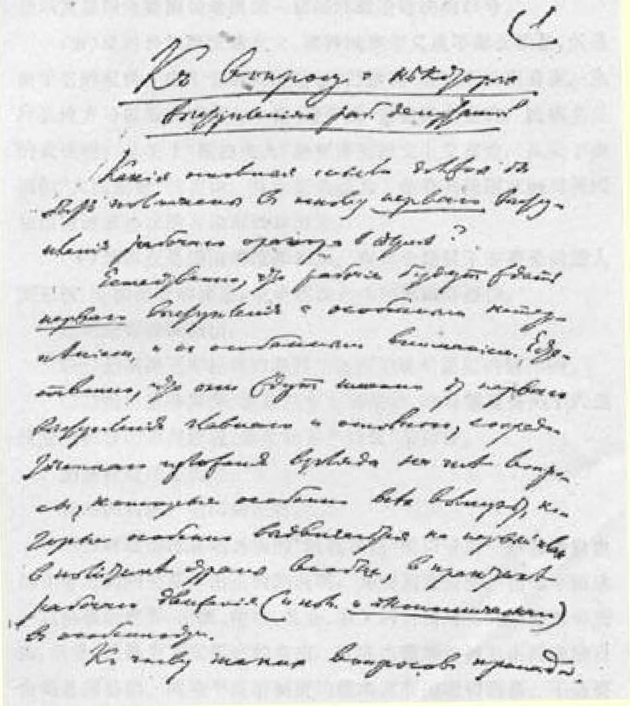

# 关于工人代表的某些发言问题 １４６

> （１９１２年１１月１１日〔２４日〕以后）
>
> 杜马中的工人发言人的**第一次**发言应当以哪些根本思想为基础呢？

当然，工人们都会十分焦急地、十分关切地等待**第一次**发言。 当然，他们希望发言人在第一次发言中就能对大家特别关心的那些问题扼要地、集中地阐明看法，因为那些问题在国内政治中尤其是在工人运动（既包括政治运动，**也包括经济运动**）的实践中是居于首要地位的。

这些问题包括：

（１）社会民主党第四届杜马党团的活动的**继承性**。所谓继承性，应该理解为保持同历届社会民主党杜马党团的**不可割裂的联系**，而特别要强调的是同社会民主党第二届杜马党团的联系，因为社会民主党第二届杜马党团曾经受到来自反革命方面的人所共知的攻击。

强调继承性很重要，因为工人民主派同各资产阶级政党不同， 它把**自己**在第一、二、三、四届杜马中的工作看作一个**统一的整体**， 不允许因为任何事变（甚至象六三政变１４７这样的事变）而放弃自己的任务，不再追求自己坚定不移的目的。

（２）工人代表的第一次发言必须讲的第二点是社会主义。其实这里包括两个题目。一个题目是：俄国社会民主党是国际社会主义无产阶级大军中的一支队伍。波克罗夫斯基在第三届杜马中也确曾这样说过（见他的声明，官方出版的速记记录第３２８页，１９０７年 １１月１６日第七次会议）。指出这一点显然是绝对必要的。

但是在现在，还有极为重要的另一点要指出。这就是指出全世界社会主义运动的**现**状和任务。社会主义运动的现状的特点是什么呢？（一）工人阶级同资产阶级的斗争极端尖锐化（生活费用飞涨；群众性的罢工；各大国的**帝国主义**，它们为争夺市场而进行疯狂竞争，它们在走向战争）；（二）社会主义即将实现。全世界工人阶级进行斗争不是为了使自己组织社会主义政党的权利得到承认， 而是为了***夺取政权***，为了建立新的社会制度。在杜马讲坛上讲明这种情况，告诉俄国工人欧洲和美洲争取社会主义的伟大战斗已经开始，社会主义在文明世界**即将**胜利（必然会胜利），—— 这是极端重要的。

（３）第三点是关于巴尔干战争、国际形势和俄国的对外政策。

这个最具有现实意义的题目决不能避而不谈。这个题目包括下列几个问题：

（一）巴尔干战争。俄国工人代表也应该宣布建立巴尔干联邦共和国的口号。反对斯拉夫人同土耳其人互相敌视。**争取**巴尔干 **一切**民族的自由和平等。

（二）反对其他强国干涉巴尔干战争。必须响应国际社会党代表大会１４８召开时在巴塞尔举行的那种维护和平的游行示威。以战争对付战争！反对一切干涉！保卫和平！这就是工人的口号。

（三）反对俄国政府的整个对外政策，要特别提到它侵占（并且已经开始侵占）博斯普鲁斯海峡、土耳其属亚美尼亚、波斯、蒙古的 “野心”。

 **1912^^]=?**

1912^m;£TXÀft:&l$£*MtlW>^O

 1 Ж

®®«>ю

（四）反对政府的民族主义，指出芬兰、波兰、乌克兰、犹太等是被压迫民族。为了抵制一切不彻底的提法（例如**单单**提出“平等”）， 极端重要的是要确切地提出一切民族**政治自决**的口号。

（五）反对自由派民族主义，这种民族主义虽不那么粗暴，但是由于它的虚伪、由于它对人民进行“巧妙的”欺骗而特别有害。从什么地方可以看到这种自由派（进步党－**立宪民主党的**）民族主义的表现呢？从关于“斯拉夫人”的使命的沙文主义言论，从关于俄国的 “大国使命”的言论，从主张俄国为了**掠夺**其他国家而同英国和法国达成协议的言论可以看出来。

（４）第四点是俄国的政治形势。在这个题目下主要是描述人民无权、专横肆虐的情形，说明政治自由的**极端**必要性。

这里应该特别指出：

（一）必须提到库托马拉和阿尔加契等地的监狱的情况１４９。

（二）指出选举舞弊，波拿巴主义的手法，政府**甚至**丧失了六三政变所依靠的那些阶级（地主和资产阶级）的信任。

司祭被迫违心投票。

杜马向右转，全国向左转。

（三）对取消派臭名远扬的“结社自由”的口号同一般**政治自由** 的任务之间的关系作出正确的说明，是特别重要的。指出下面这一点也极端重要：出版、结社、集会、罢工的自由对工人是***绝对***必要的，但是，***正是***为了实现这种自由，就应当懂得这种自由同政治自由的总的基础、同整个政治制度的**根本**改变的***密切联系***。不是要在六三制度下实现自由派的结社自由的空想，而是要为了自由，尤其是结社自由而***同这个制度***展开全面的斗争，反对这个制度的**基础**。

（５）第五点：农民的难以忍受的处境。１９１１年有３０００万人挨饿。农村破产和贫困。政府的“土地规划”只是使情况更加**恶化**。财政稳定虚有其表，是靠强征赋税、鼓励人民酗酒取得的表面的稳定。甚至第三届杜马中的**右派**农民（“４３个农民”）提出的温和的土地法案１５０也被束之高阁。农民必须摆脱地主和地主土地占有制的压迫。

（６）第六点：第四届杜马选举时的三个阵营和国内的三个阵营：

（一）政府阵营。力量虚弱。选举舞弊。

（二）自由主义阵营。这里极端重要的是指出（哪怕用一两句话指出）自由派的反革命性：他们**反对**新的革命。可以原原本本地援引《真理报》第８５号（８月８日）转引的格列杰斯库尔的话[^1]：“用不着进行第二次人民运动〈即第二次革命〉，需要的只是平静的、顽强的、有信心的立宪工作。”格列杰斯库尔就是这样说的，《言语报》转载了这些话。

自由派希望***在***保存现行制度的***基础的情况下***，***不经过***广大的人民运动而实行立宪改革，这是空想。

（三）第三个阵营是民主派。它以工人阶级为首。可以用第三人称谈过去，指出***连***《莫斯科呼声报》***也***讲过的事实，即工人阶级是在这样**三个**口号下参加选举的：（１）建立民主共和国；（２）实行八小时工作制；（３）没收地主的全部土地交给农民。

（７）第七点：说明１９１２年的政治运动和罢工。

（一）极端重要的是指出参加**政治**罢工的人数达到了１００万。 整个解放运动很活跃。

（二）极端重要的是说明工人的政治罢工具有***全民的***目的，它提出的不是局部的而是***全民的***任务。

（三）必须指出，正是政治罢工和经济罢工相结合才使运动具有了力量和生气。

（四）指出工人抗议判处水兵死刑。

（８）第八点是很重要的一点，它是由上述各点产生的，并且同上述各点有密切的联系，这就是无产阶级的领导权。无产阶级的领导作用。它的领袖地位。它领导全体人民，领导整个民主派。它要求自由并且领导群众进行争取自由的斗争。它是榜样和典范。能鼓舞人心。能造成新的情绪。

（９）第九点也是最后一点，简短的复述和综合。应当用第三人称讲讲觉悟的工人，指出他们“坚定不移地忠于”**三个**原则：第一， 忠于社会主义；第二，忠于“在战斗中久经考验的老俄国社会民主工党的原则”，—— 工人们都忠于俄国社会民主工党，这个**事实**应当谈一谈；第三，忠于工人“自己的共和制的信念”。这里指的不是号召，不是口号，而是对信念的忠诚。（在英国、瑞典、意大利、比利时等许多君主制的国家中都有公开的共和党。）

附言：可能还会产生一个问题，就是关于**专门**提出“结社自由” 的必要性的问题。应当指出，取消派常常在这个幌子下提出***在***毫不触动六三体制***基础的情况下***实行立宪改革的自由主义的要求 ……[^2]

> 载于１９３０年《列宁全集》俄文第２、３译自《列宁全集》俄文第５版版第１６卷
>
> 第２２卷第１９７—２０１页

[^1]: 见本卷第２４—２５页。—— 编者注

[^2]: 手稿到此中断。—— 俄文版编者注