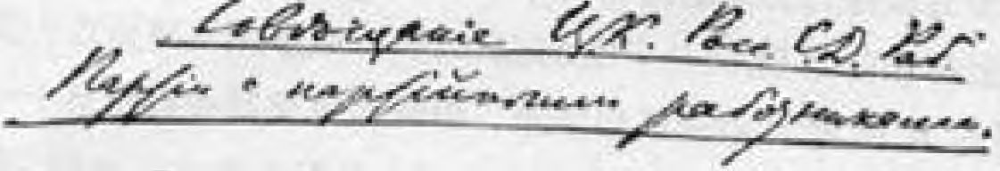
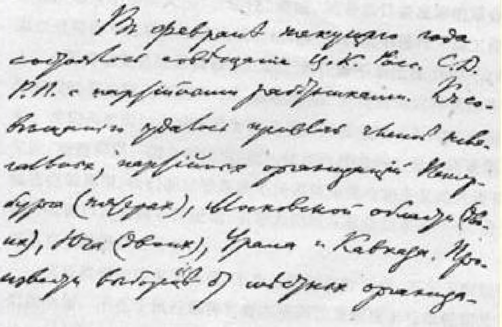

# 有党的工作者参加的俄国社会民主工党中央委员会克拉科夫会议的通报和决议１７４

> （１９１２年底—１９１３年初）

## 通报

> （１９１３年１月１日和８日〔１４日和２１日〕之间）

今年２月召开了有党的工作者参加的俄国社会民主工党中央委员会会议。到会的有彼得堡（５人）、莫斯科地区（２人）、南方地区 （２人）、乌拉尔和高加索的秘密的党组织的成员。各地方组织无法进行选举产生代表，因此这次会议不能算作代表会议。部分中央委员由于警察方面的原因，未能出席会议。

几乎全体与会者都积极参加了各种合法的工人团体，并利用了各种所谓“合法机会”。因此，会议的成员能够正确地反映俄国各主要地区党的整个工作状况。

会议共开了１１次，就下列各项议程制定了决议（不包括未宣读的）[^1]：（１）革命高潮、罢工和党的任务；（２）秘密组织的建设；（３） 社会民主党杜马党团；（４）党的报刊；（５）保险运动；（６）对取消主义的态度。关于统一问题；（７）关于“民族的”社会民主党组织。

上述决议，除一个同志对“保险”决议中的两条和另一个同志对“民族”决议中的部分条文弃权外，是一致通过的。

经中央委员会批准的这次会议的决议，总结了党的经验，并就社会民主党在当今俄国的工作中的一切最重要问题制定了领导路线。

系统地估计１９１２年的经验是社会民主党的最重要的任务，因为这一年是俄国工人运动发生具有历史意义的伟大转变的一年。 仅仅说活跃正在代替低潮和涣散，是不够的。工人阶级已经转入对资本家和沙皇君主制的大规模进攻。经济罢工和政治罢工的浪潮大大高涨，使俄国在罢工方面又走**在**世界**各**国，甚至走在最发达的国家的**前面**。

当然，这个事实不会使任何一个觉悟的工人忘记，自由国家的无产者在群众的组织和群众的阶级教育方面是远远超过我们的。但是这个事实表明，俄国已经进入了一个**新革命**的高涨时期。

工人阶级所承担的伟大任务是要启发一切民主群众的革命意识，在斗争中教育他们，领导他们进行猛烈的冲击，以便推翻罗曼诺夫王朝，使俄国得到自由和建立共和国。全面支持群众的公开的革命斗争，组织这种斗争，扩大、加深和加强这种斗争，—— 这就是当前的基本任务。谁意识不到这个任务，谁不在某一个促进革命事业发展的秘密组织、小组或支部中工作，谁就不是社会民主党人。

«Affi» ító’R

### сфжта»)

１９１２年无产阶级的革命高潮是民主派情绪发生公认的变化的基本动力。社会民主党无论在第四届杜马选举中，或者在创办合法的、哪怕只是宣传马克思主义初步原理的工人报刊方面，都取得了巨大的胜利。沙皇政府不能阻止这些成就，完全是因为群众的公开的革命斗争已经改变了整个的社会政治状况。俄国社会民主工党一方面要坚决利用一切“合法机会”，从黑帮杜马的讲坛到任何一个戒酒协会都要加以利用，继续进行坚持不懈的有步骤的工作； 同时一分钟也不要忘记，只有真正按照党的决议的精神，即按照那些不是从六三“合法性”着眼，而是从日益高涨的革命着眼经过周密考虑后作出的决议的精神，在群众中进行一切工作的人，才配得上党员的崇高称号。我们的任务不是迁就１９０８—１９１１年这段时期遗留下来的混乱和涣散状态，而是要同这种状态作斗争。我们所要做的事情不是随波逐流，跟混乱的无原则的合法主义跑，而是利用一切合法机会，把一切生气勃勃的力量逐渐聚集到秘密党的周围。 我们的口号是决不同那些滥用合法主义的人讲和，因为他们以此来散布怀疑论，引导人们漠视群众的革命斗争，或者甚至直接阻挠这一斗争。

实现我们的要求的保证，不在于降低这种要求，不在于删削我们的纲领，不在于执行那种高呼在俄国沙皇制度下可以轻而易举地实行某种立宪改革的骗人口号来引诱觉悟不高的人的策略。不是的。这种保证在于以彻底的民主主义精神教育群众，使他们认清立宪幻想的欺骗性。这种保证在于先进阶级即无产阶级的革命组织，在于群众的伟大的革命热情。

反革命猖獗时期留给我们的后果是：思想上的混乱和瓦解，许多工人运动的中心组织涣散，手工业方式，一些人与党失去了联系，另一些人对维护革命传统、制定革命策略的“地下组织”抱蔑视的甚至深恶痛绝的态度。取消派从社会民主党中分裂出去，他们实际上另树一帜，许多地方的组织忘记了社会民主党的原则，一些 “民族的”社会民主党组织陷于瓦解，所有这一切，使人们对统一的要求显得特别迫切了。

社会民主主义无产阶级的统一是这个阶级取得胜利的必要条件。

**社会民主主义无产阶级**的党—— 俄国社会民主工党不统一， 这个无产阶级也就不可能统一。

从这里我们一下子就可以看到，如果不仅在口头上而且在行动上不首先解决秘密的党的必要性问题，那么这个统一问题也就不能得到解决。谁一方面高谈统一，同时又宣传“公开的工人政党”，谁就是欺骗自己，欺骗工人。谁一方面高谈统一，同时又装模作样地说这个问题可以解决，可以澄清，甚至可以只在合法的范围内提出来，谁就是欺骗自己，欺骗工人。

不，统一问题并不是在合法的刊物上空谈“统一”，同“各奔东西的”各种知识分子小集团妥协，在国外谈判中使用外交手腕所能解决的，**只有所有**参加俄国社会民主工党的工人在各地实现联合， 真正**合并成**一个统一的秘密组织，只有这样才能解决统一问题。

工人们已经自己从下面着手实行这种唯一严肃认真、唯一实事求是的解决统一问题的办法了。会议号召全体社会民主党党员都来这样做。

社会民主主义工人正在各地恢复俄国社会民主工党统一的秘密组织，即工厂支部、工厂委员会、区分部、市总部和**一切**合法机关中的社会民主党小组等等。谁不愿意陷入单枪匹马、毫无力量的处境，谁就参加这些组织吧。这些地方，在工人亲自监督下，秘密的党得到了承认，群众的革命斗争得到了支持。

瓦解时期就要过去。聚集力量的时期已经到来。让我们在俄国社会民主工党的秘密组织中团结起来。任何一个社会民主党人， 只要他愿意在秘密组织中工作，愿意帮助无产阶级的组织，支援他们反对资本的斗争和已经开始的对沙皇君主制的革命冲击，这些秘密组织是不会拒绝他的。

俄国全国性的政治危机正慢慢地然而不断地发展着。六三体制是挽救黑帮的沙皇君主制的最后尝试，是勾结资产阶级上层分子振兴这种君主制的尝试，但是这个尝试也破产了。新生的民主力量在俄国农民和城市资产阶级中间不是每日而是每时地在增长、 壮大起来。城乡无产者的人数比过去增加得更快，他们的组织性、 团结性日益提高，群众性罢工的经验使他们的必胜信心日益增强了。

俄国社会民主工党必须把这个无产阶级的先进部队组织成一个统一的整体，领导无产阶级为实现我们老的革命要求而投入革命的搏斗。

### 俄国社会民主工党中央委员会

１９１３年２月

# 决议

> （１９１２年１２月２６日—１９１３年１月１日
>
> 〔１９１３年１月８—１４日〕）

### 革命高潮、罢工和党的任务

１．在１９１２年这一年里，工人运动史和俄国革命史上最重大的事实，是无产阶级经济的和政治的罢工斗争都有了显著的发展。参加政治罢工的人数达到１００万人。

２．１９１２年罢工斗争的性质值得特别注意。在很多情况下工人同时提出经济要求和政治要求，经济罢工和政治罢工此起彼伏，互相交替。为了夺回被反革命剥夺了的１９０５年的胜利果实而同资本家进行的斗争以及生活费用的不断飞涨，唤醒了一层又一层的工人群众，以最尖锐的形式向他们提出了政治问题。这种经济斗争和政治斗争互相结合、交叉穿插的形势，是使运动具有威力，使群众性的革命罢工得以形成的条件和保证。

３．成了１９１２年突出特点的陆海军中的不满情绪和起义的爆发，一开始就同工人的群众性的革命罢工有明显的联系，它表明广大民主派，特别是作为主要兵源的农民的骚动和愤懑与日俱增。

４．所有这些事实，同全国普遍向左转的形势（尽管黑帮的沙皇政府十分无耻地在第四届杜马选举中舞弊，这次选举还是表明了普遍向左转的形势）联系起来看，充分证明了俄国又进入了群众进行公开的革命斗争的时期。刚刚开始的这场新的革命，是沙皇政府六三政策破产的必然结果。这种政策甚至没能使最会巴结讨好的大资产阶级满意。人民群众沦于更加无权的地位，被压迫民族的人民群众尤其是这样；农民则再次有成百万成百万人挨饿。

５．在这种情况下，群众性的革命罢工所以具有十分重要的意义，还因为这种罢工是克服农业无产阶级和农民的冷漠、绝望情绪和涣散状态，激发他们的政治主动性，吸引他们参加尽可能齐心协力、步调一致、声势浩大的革命行动的最有效的手段之一。

６．党组织一方面必须扩大和加强为实现俄国社会民主工党的最近要求（建立民主共和国，实行八小时工作制，没收地主的全部土地交给农民）而进行的宣传鼓动工作，同时必须把全面支持群众性的革命罢工，发展和组织群众的各种革命行动放在自己工作的首要地位。特别是必须把举行街头革命示威游行（同政治罢工相结合，或者单独行动）这个迫切的任务提出来。

７．某些资本家采取同盟歇业（大批解雇）来对付罢工工人，这就使工人阶级面临一个新的任务。必须仔细地估计每个地区、每个工业部门、每一次的罢工的经济条件，寻找反击同盟歇业的新的斗争方法（例如意大利式罢工１７５），以及用革命的群众大会和革命的街头示威游行来代替政治罢工。

８．某些合法的机关报刊，无论它们如何评价这次或那次罢工， 它们总的宣传鼓动都是反对群众性革命罢工的。例如，除自由派的报刊外，《光线报》取消派集团也违背这样或那样支持这份报纸的大部分工人的心愿，进行着这种宣传鼓动。因此，全体社会民主党工人党员的任务是：（１）同这个集团进行坚决的斗争；（２）有步骤地、坚持不懈地、不分派别地向全体工人解释上面所说的那种宣传的全部危害性；（３）团结一切无产阶级力量来进一步推进革命的宣传鼓动和群众的革命行动。

### 秘密组织的建设

１．会议总结了１９１２年的工人运动和党的工作，认为：

已经开始涌现的群众的革命行动的新浪潮，完全证明了俄国社会民主工党过去通过的关于建党问题的决议（尤其是１９１２年一月代表会议的决议）是正确的。１９１２年罢工斗争的进程、社会民主党在第四届杜马选举时进行的选举运动、保险运动的进程等等，都清楚地表明了当前组织建设的唯一正确形式是秘密的党，它是有各种合法的和半合法的工人团体作外围的许多党支部的总和。

２．秘密建设的组织形式适应当地的条件是绝对必要的。用各种各样的形式来掩护秘密的支部，使工作形式尽可能灵活地适应当地生活条件，是秘密组织具有生命力的保证。

３．目前组织建设方面的重要而迫切的任务是：在所有的工厂中建立由工人中最积极的分子组成的纯粹是党的秘密的工厂委员会。工人运动的巨大高涨正在创造条件，使大部分地区有可能恢复党的工厂委员会和巩固现有的党的工厂委员会。

４．会议指出，现在已经迫切需要在每个中心由分散的地方小组建立领导组织。

例如，在彼得堡，通过由各区支部选举的原则同增补的原则相结合的办法产生的市领导委员会，就是这样一种全市性的组织形式。

这种组织形式能够使领导机关和基层支部之间建立起最密切、最直接的联系，同时又能够建立一个人员不多、机动灵便、极其秘密、有权随时代表整个组织进行活动的执行机关。会议向其他各个工人运动中心推荐这种组织形式，并建议根据当地的生活条件作某些改变。

５．为了建立地方组织同中央委员会的密切联系，同时为了指导和统一党的工作，会议认为绝对必须在工人运动的各主要地区建立区域中心。

６．在建立社会民主党中央委员会和地方组织之间的经常而有活力的联系方面，以及在大的工人运动中心建立灵活的地方工作领导形式方面，最重要的实际任务之一就是建立受托人制度。受托人应当从担任地方工作的工人领导人员中选拔。只有这些先进的工人才会用自己的力量使各地以至全俄国的党的中心机构得到加强和巩固。

７．会议希望中央委员会尽可能经常地召开有从事社会民主党各部门工作的党的地方工作者参加的会议。

８．会议请大家注意党屡次通过的决议：工人政党只有依靠党员定期交纳的党费和工人的捐款才能生存。没有这种捐款，尤其在目前情况下，即使最精简的党的中心机关（地方的和全国的）也绝对不可能生存。

９．（不公布。）

### 关于社会民主党杜马党团

１．会议肯定，尽管政府进行了空前的迫害和在选举中舞弊，尽管黑帮和自由派反对社会民主党的联盟在许多地方已经完全形成，俄国社会民主工党在第四届杜马选举中还是取得了重大的胜利。几乎所有地方第二城市选民团中拥护社会民主党的选票都增加了，社会民主党正逐渐把第二城市选民团从自由派手中夺取过来。而在对我们党说来是主要的工人选民团中，俄国社会民主工党照旧保持了绝对的优势，同时工人阶级十分一致地通过使选民团中的布尔什维克代表全部当选的行动有力地表明了他们是毫不动摇地忠于老俄国社会民主工党及其革命传统的。

２．会议对于社会民主党第四届杜马代表所进行的有力的活动，如在杜马中的许多发言、提出的质询、宣读的基本上正确地反映了社会民主党主要原则的宣言等，表示欢迎。

３．会议承认我们党内树立起来的传统是唯一正确的，这个传统就是，社会民主党杜马党团是服从以党的各个中心机关为代表的整个党的一个机构；同时会议认为，为了从政治上教育工人阶级和合理安排党的杜马工作，必须注意社会民主党党团所采取的每一个步骤，从而实现党对党团的监督。

４．会议不能不认为，社会民主党党团通过关于亚格洛的决议， 是直接违背党团对党所承担的义务的。这个决议助长了崩得的分裂行动，而崩得勾结了非社会民主党（波兰社会党）反对波兰的社会民主党人，违反了在工人复选人中占多数的所有社会民主党复选人的意志，选举了非社会民主党人亚格洛。党团通过这一决议就扩大了波兰工人中间的分裂，妨碍了全党的统一事业。

５．契恒凯里同志以党团的名义，为打着“建立每一个民族的自由发展所必要的机构”旗号的民族文化自治辩护，这是公然违背党纲的行为。１７６党的第二次代表大会在批准党纲时曾专门投票否决了本质上与此相似的条文。１７７无产阶级的政党不能容许向民族主义情绪让步，即使对以这种隐蔽形式出现的民族主义情绪也一样。

６．社会民主党党团投票赞成了进步党人（实际上是十月党人） 就内阁宣言提出的程序提案，而没有提出社会民主党的独立的提案，这是一种失误；１７８党必须指出这一点，因为自由派的报刊正对此进行恶意的解释。

７．８．９．（不公布。）１７９

### 关于秘密书刊

会议在讨论了必须全面发展秘密出版事业的问题并就这个问题拟订了若干具体指示之后，坚决号召各级地方党组织、一切工人支部和工人个人在运输工作和同中央局１８０取得联系方面发挥更大的独立性和主动性，以传播秘密书刊。

### 关于保险运动

会议肯定，工人阶级及其政党不顾一切迫害，在实行保险法１８１ 方面为保卫无产阶级的利益作了巨大的努力，同时认为：

１．必须进行最坚决的、齐心协力的斗争，反对政府和资本家企图强迫工人不经过工人大会糊里糊涂地推选参加伤病救济基金会的受托人。

２．各地工人都应当力争做到通过私下磁头的办法，把工人理想的受托代表候选人预先确定下来。

３．工人们应当举行革命的群众大会，抗议在实行保险法过程中所发生的暴力和刁难行为。

４．在任何情况下都必须预先确定工人的受托代表的候选人名单，候选人要从最孚众望的社会民主党工人中提出，而且要做到使不能召开任何会议的地方也能一致通过这个名单。

５．会议认为，抵制受托人的选举是不适当而且有害的。当前资本家正以最大的努力企图使工人不能掌握工厂中某些无产阶级基层组织，而工人伤病救济基金会就是这样的基层组织。抵制的办法，在目前会使工人分散力量，从而只会有利于资本家的上述企图的实现。

６．争取合理地选举伤病救济基金会代表的斗争一分钟也不应当停顿。要千方百计，全力以赴，利用一切有利时机，扩大和发展工人的斗争，一分钟也不让企业主以为生产的正常进行有了保证；同时，不管有多少障碍，都要坚持使社会民主党的候选人名单得到通过。选举不会排斥斗争的进一步发展。相反，我们把坚定的社会民主党工人选为代表，将会有助于今后的争取正常选举的斗争，因为在这个斗争中代表们将尽力帮助工人。

７．在没有开会就进行选举的地方，必须采取工人们能够接受的一切方式进行鼓动，争取根据真正自由选举的原则开会重选受托人。

８．社会民主党杜马党团必须立即就禁止工人开会进行选举一事再次提出质询。

９．必须把关于实行保险制度的整个鼓动工作同说明沙皇俄国的全部实际状况这一内容密切地结合起来，同时要说明我们的社会主义原则和革命要求。

### 关于对取消主义的态度和关于统一

１．４年来党同取消主义所进行的斗争证明，１９０８年俄国社会民主工党十二月全党代表会议所作的决定是完全正确的。决定说：

“党内有一部分知识分子试图取消现有的俄国社会民主工党组织，代之以一种绝对要在合法范围内活动的不定形的联盟，甚至不惜以公然放弃党的纲领、策略和传统为代价。”

由此可见，取消派受到谴责，决不是因为他们提出必须进行合法的工作，而是因为他们背弃秘密的党，破坏秘密的党。

俄国第一份马克思主义工人日报的创办和工人选民团中布尔什维克代表候选人的全部当选，充分证明了我们党在排除取消派之后，已经掌握了合法活动。

２．取消派脱离秘密的党，脱离地方组织单独组织小集团，制造分裂，而在许多地方，特别是在彼得堡成立所谓发起小组，就更扩大了分裂。１９１２年俄国社会民主工党一月代表会议断定：《我们的曙光》杂志和《生活事业》杂志的取消派文人集团是这些发起小组的核心，“已使自己完全置身于党外”[^2]，这只是肯定取消派制造了分裂。

３．１９１２年八月代表会议自封为“俄国社会民主工党各组织的代表会议”，其实是取消派的代表会议，因为会议的主要成员和领导成员是从党内分裂出去的、脱离俄国工人群众的取消派文人集团。

４．绝大多数的先进工人是忠于秘密的党的，这就使八月代表会议不得不向党性作表面的让步，表面上承认秘密的党。其实，这次代表会议的所有决议都彻头彻尾贯穿着取消主义，代表会议结束后，《我们的曙光》杂志和《光线报》马上声明赞成八月决议，更加卖力地展开了取消主义的宣传，内容是：

（一）主张成立公开的党；

（二）反对地下组织；

（三）反对党的纲领（维护民族文化自治，修改第三届杜马土地法，把建立共和国的口号挪到次要地位等等）；

（四）反对群众性的革命罢工；

（五）主张实行改良主义的、纯粹合法的策略。

因此，同《我们的曙光》杂志和《光线报》的取消派集团作坚决斗争，向工人群众说明取消派集团的宣传的严重危害性，仍然是党的任务之一。

５．取消派在合法刊物上掀起“统一”运动，回避和模糊关于加入秘密的党并在其中工作这个主要问题，这样会把工人引入迷途， 因为这个问题甚至不能在合法报刊上提出。实际上取消派照旧在进行分裂活动，彼得堡的选举特别清楚地说明了这一点，—— 在复选人分成势均力敌的两部分的时候，正是取消派反对抽签的建议， 而当时抽签是唯一能够避免工人在资产阶级政党面前发生分裂的办法。１８２

６．各种思潮和倾向的社会民主主义工人在承认并且加入俄国社会民主工党的秘密组织的条件下实现统一，是绝对必要的，是工人运动的一切利益坚决要求的。

在彼得堡纳尔瓦区组织以及许多外省组织内部正是根据这样的原则实行联合的。

７．会议大力支持这样的联合，并建议各地立即自下而上地，即从工厂委员会、区分部等开始实行这样的联合，同时由工人同志认真检查：是不是承认秘密的组织了，有没有支持群众的革命斗争和革命策略的决心。只有实际建立起这种自下而上的统一，才能实现党的完全的团结和全国范围的十分巩固的统一。

### 关于“民族的”社会民主党组织

１．１９１２年的经验完全肯定了俄国社会民主工党一月代表会议（１９１２年）关于这个问题的决议[^3]是正确的。崩得违反波兰社会民主党人的意志支持非社会民主党人候选人亚格洛，取消派、崩得和拉脱维亚社会民主党人的八月代表会议（１９１２年）违背党纲、助长民族主义的行为，都十分明显地表明社会民主党建党中的联邦制原则彻底破产了，表明“民族的”社会民主党组织处于互相隔绝的境地对于无产阶级事业是十分有害的。

２．因此，会议坚决号召俄国各民族工人坚决反击反动派的黩武的民族主义，反对劳动群众中民族主义情绪的任何表现，号召社会民主主义工人紧密地团结起来，组成当地的俄国社会民主工党的统一组织；这些组织要象高加索早就实行的那样，用当地无产阶级的每一种语言进行工作，并且真正实现自下而上的统一。

３．会议对于波兰社会民主党的队伍发生分裂一事表示十分遗憾，因为这种分裂严重地削弱了波兰社会民主主义工人的斗争。会议不得不指出，波兰社会民主党总执行委员会现在并不代表波兰无产阶级的波兰社会民主党组织中的多数人，它采取了令人不能容忍的手段反对这些多数人（例如毫无根据地猜疑华沙整个组织在搞奸细活动）。会议号召一切同波兰社会民主主义工人有接触的党组织协助波兰社会民主党建立真正的统一。

４．会议特别指出崩得最近一次（第九次）代表会议决议中的极端机会主义和取消主义，这次代表会议取消了建立共和国的口号， 把秘密工作挪到次要地位，并且把无产阶级的革命任务置于脑后。 崩得阻挠各地（在华沙、罗兹和维尔纳等地）全体社会民主主义工人的联合，即１９０６年以来俄国社会民主工党的历次代表大会和代表会议一再坚持的联合，这种行为也应当受到同样的谴责。

５．会议欢迎拉脱维亚组织中革命的社会民主主义工人不懈地进行的反取消主义的宣传，并对拉脱维亚社会民主党中央委员会支持取消派的反党行动的倾向表示遗憾。

６．会议坚信，已经开始的革命高潮、群众性的经济罢工和政治罢工、街头示威游行以及其他形式的群众的公开革命斗争，都将有助于各地社会民主主义工人不分民族的、亲密无间的团结和打成一片，从而加强对压迫俄国各民族的沙皇制度的冲击，加强对联合起来的俄国各族资产阶级的冲击。

### 关于《真理报》编辑部的改组和工作

１．编辑部贯彻党的精神不够坚定。坚决要求编辑部更严格地遵守和执行党的一切决议。合法办报的方针必须遵循。

中央委员会要采取措施改组编辑部。

２．编辑部对彼得堡社会民主主义工人的党的生活反应不力。 转述党的决议或者提及这些决议必须无条件地用合法的形式。

３．编辑部应该更重视阐明整个取消主义的错误和危害，尤其是《光线报》宣传的错误和危害。

４．编辑部应该更重视在工人中间进行征求订户和募捐的宣传。

５．布尔什维克的杜马代表都应该加入扩大的报纸编辑委员会，并且经常地、坚持不懈地分担写作和经营方面的工作。

６．编辑部对它的前进派撰稿人应该采取特别审慎的态度，以免妨碍刚开始的互相接近，以免犯原则性的路线错误。

７．必须全力缩减出版费用和建立一个人员有限的领导委员会 （主持整个工作），这个领导委员会必须有六人团１８３的至少一名代表参加。

要有一个同样的领导委员会（经营委员会）来掌管经营方面的工作，该委员会也必须有六人团的一名代表参加。

８．中央委员会认为必须刊登的文章，应该（署上商定的署名） 立即刊登。

９．在严格保持报纸合法性的同时，必须吸收彼得堡及外省的工人团体、协会、委员会、小组和个人积极参加为报纸写稿和推销报纸的工作。

１０．支持圣彼得堡一部分社会民主党人关于出版反取消派的总的工会机关报的倡议，事先要就地仔细检查一下工作的安排。

１１．采取措施使报纸和杂志１８４在写作和经营方面相互密切配合。

１２．必须积极着手在莫斯科创办一份工人日报作为彼得堡工人日报的分支。为此应当使莫斯科小组同莫斯科地区三位杜马代表在组织上建立联系。

> １９１３年２月上半月由俄国社会民主工党译自《列宁全集》俄文第５版中央委员会在巴黎印成小册子第２２卷第２４９—２７０页 《关于〈真理报〉编辑部的改组和工作》 首次发表于１９５６年《历史问题》杂志第１１期

[^1]: 手稿中勾掉了括号内的这句话，出于秘密工作的考虑在小册子中省略了。—— 俄文版编者注

[^2]: 见《列宁全集》第２版第２１卷第１６０页。—— 编者注

[^3]: 见《列宁全集》第２版第２１卷第１４３—１４５页。—— 编者注