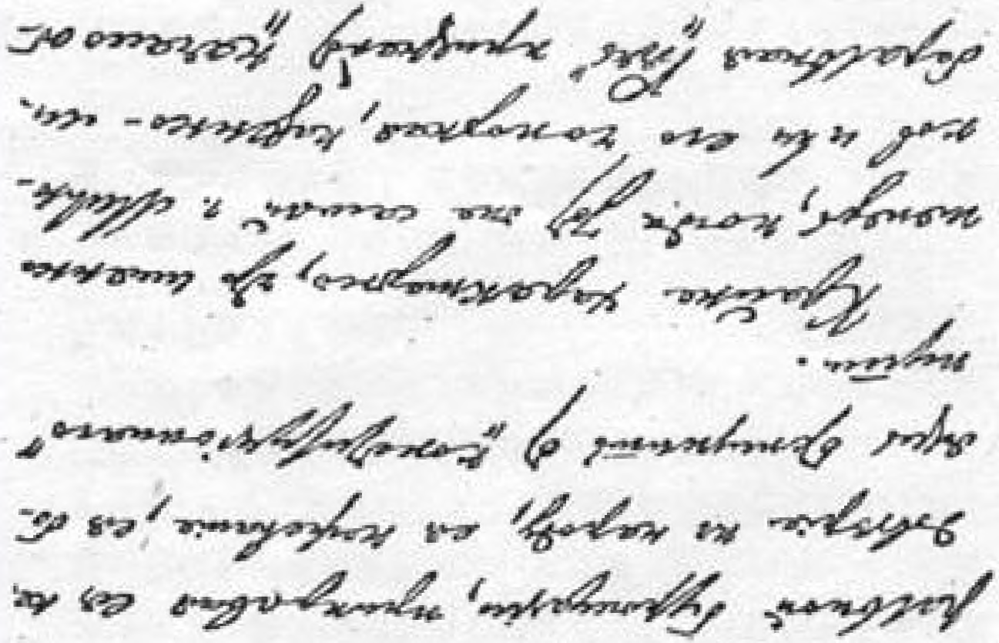

# 立宪幻想的破灭

> （１９１３年１月底—２月初）

米留可夫先生在１９０７年６月３日以后感叹说：“谢天谢地，我们总算立宪了。”自由派资产阶级的首领用这样的宽心话来安慰自己，以掩饰自由派资产阶级不相信人民，不愿而且害怕离开“立宪” 道路的心理。

尤其意味深长的是，现在，正当同一个米留可夫先生或者他的循规蹈矩的官方的自由派《言语报》承认“社会运动开始高涨”（第 ２６号）的时候，这些立宪幻想的破灭就愈来愈明显了。企图回避令人不快的现实（和回避令人不快的走同“立宪”的道路完全不同的道路的必然性），企图用“立宪”的字眼安慰自己和别人，就是这些幻想的基础。

请看自由派对目前形势的评论！

> “杜马的空气很沉闷，因为没有斗争。”（第２５号）

先生们，可当初你们何苦要宣称我们总算立宪了呢！ “话都说尽了。现在需要的是行动，**可是对行动没有信心**。因此就消沉

> 了。”（同上）
>
> 你们用对**空话**的信心安慰自己，而这些空话主要是说给十月党人听的。现在你们承认了，你们是用这些空话掩饰**对行动**缺乏

 äiKzfc «земвсяи ¿4ií$£t6i

## 191 зэдшшш»шiж

> (ЙЖЛЖЖ) **信**心的事实。

自由派先生们，你们自己谴责了自己。

整个民主派—— 特别是工人—— 对空话（立宪的空话）是不相信……[^1]

> 载于１９４８年《列宁全集》俄文第４版译自《列宁全集》俄文第５版第１８卷第２２卷第３４９—３５０页

[^1]: 手稿到此中断。—— 俄文版编者注