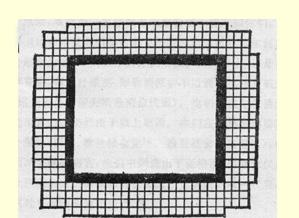

# 俄国地主的大地产和农民的小地产

> （１９１３年３月２日〔１５日〕）

纪念１８６１年２月１９日１７的日子刚刚过去不久，因此不妨借这个机会谈谈目前俄国欧洲部分土地的分配情形。

内务部公布了欧俄土地分配的最新官方统计材料，这个材料是有关１９０５年的。

根据这个统计材料，拥有５００俄亩以上土地的大地主将近 （凑成整数）３万户，他们共拥有土地将近７０００万俄亩。

将近１０００万贫苦农户拥有的土地**也是这么多**。 这就是说，每一个大地主拥有的土地平均等于将近３３０个贫苦农户拥有的土地，而每个农户将近有７（**七**）俄亩土地，每个大地主将近有２３００（**二千三百**）俄亩土地。

为了更清楚地说明这一点，特在上面绘制了一张图。

中间的空白大方块，表示一个大地主的地产。周围的小方格， 表示小农的地块。

总共有３２４个小方格，而空白方块的面积等于３２０个小方格。

> 载于１９１３年３月２日《真理报》  译自《列宁全集》俄文第５版第５１号  第２３卷第１０—１１页