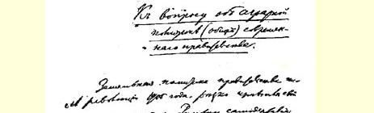
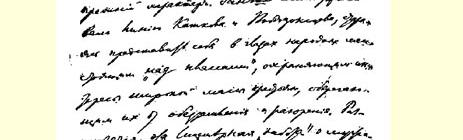
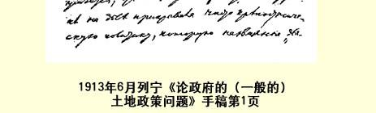

# 论现政府的（一般的） 土地政策问题１３０

> （不晚于１９１３年６月７日〔２０日〕）

１９０５年革命以后，政府的土地政策大大改变了它原来的性质。以前，专制政府实行卡特柯夫和波别多诺斯采夫的路线，竭力在人民群众面前显示自己是站在“各阶级之上” 的，是保护广大农民群众的利益的，是防止农民失去土地和遭到破产的。自然， 这种对庄稼汉假仁假义的“关怀”，实际上是掩盖纯粹农奴主的政策，上述这两位革命以前的旧俄国的“活动家”，在社会生活和国家生活的各个方面都曾以愚蠢的直率态度实行过这种政策。专制政府当时完全依靠农民群众的极端落后、愚昧无知和没有觉悟。在革命以前，专制政府冒充“禁止转让”份地的保护人和“村社”的拥护者，企图指靠俄国在经济上的停滞和农民群众在政治上的沉睡。那时，整个土地政策是彻头彻尾的农奴主－贵族的政策。

现在，１９０５年革命引起了专制政府整个土地政策的转变。斯托雷平在切实执行贵族联合会的旨意时，曾决定（用他自己的话说）“寄希望于强者”。这就是说，自**１９０５**年革命使俄国无产阶级和广大的民主派农民阶层猛然觉醒以后，我国政府再也不能**冒充弱者**的保护人了。人民既然能够在俄国农奴制的旧国家制度上打开第一个缺口（虽然还不够大），那也就证明了：人民已经从政治

> １９１３年６月列宁《论现政府的（一般的）土地政策问题》手稿第１页
>
> （按原稿缩小） 上的沉睡中觉醒了，所谓政府保护“村社”、保护“禁止转让份地” 一类的神话，所谓超阶级的政府保护弱者的神话，在农民中间完全没有人相信了。

１９０５年以前，政府还可以指望把全体农民群众的备受压制和停滞不前作为它的支柱，当时农民还摆脱不了他们许多世纪以来所持有的那种甘受奴役、忍气吞声和俯首听命的政治偏见。当农民还是俯首听命和备受压制的时候，政府**可以**装模作样，似乎它是“寄希望于弱者” 的，也就是说是关怀弱者的，虽然实际上它只关怀农奴主－地主，只关怀保持自己的专制制度。

１９０５年以后，旧的政治偏见被破除得非常彻底，也非常广泛， 以致政府和领导它的农奴主－贵族联合会已经认识到不能象从前那样利用庄稼汉的愚昧和绵羊般的顺从来投机了。政府认识到，它 **同**那些被它弄得破产的并且弄到一贫如洗、忍饥挨饿地步的农民 **群众不可能和平相处了**。就是这种不可能同农民“和平相处” 的认识，使“农奴主联合会” 的政策发生了变化。联合会决定无论如何要分裂农民，从农民中培植一个“新式地主”，即富裕的农民私有者阶层，这些人会“**真心诚意地**” 来保护地主大地产的安宁和不可侵犯，使之**不受群众的侵害**，而这种地主的大地产在１９０５ 年毕竟多少受到了革命群众的冲击。

因此，在革命以后政府整个土地政策的转变决不是偶然的。相反，这种转变对于政府、对于“农奴主联合会” 来说，是**阶级的必然性**。政府没有别的出路。政府认识到，它同农民群众不可能 “和平相处”，农民已经从长达几世纪的、农奴制的沉睡中觉醒过来了。政府没有其他任何出路，它只好**试图**作出最大的努力，采取各种使农村破产的办法来**分裂**农民，把农村交给富农和富裕农民去“任意洗劫”，以便指靠农奴主－贵族同“新式地主”的**联盟**， 即同富人—— 农民私有者，同农民资产阶级的**联盟**。

斯托雷平忠心耿耿地为“农奴主联合会” 效劳，并且执行它的政策，他自己说：“给我２０年的安宁，我就能改革俄国。”他的所谓“安宁”，是**墓地的安宁**，是要农村默不作声地、绵羊般地忍受所遭到的空前的破产和贫困的安宁。他的所谓“安宁”，是**地主** 的安宁，地主希望看到农民完全停滞不前，忍受压制，毫不反抗， 只要地主老爷们感到舒服和愉快，情愿平静而欢快地饿死，情愿变出自己的土地，离开农村，遭受破产，斯托雷平的所谓改革俄国，就是要引起这样一种变化：农村只剩下心满意足的地主，心满意足的富农和吸血鬼，再就是分散的、备受压制的、无依无靠的、软弱无力的雇农。

斯托雷平真心实意地希望俄国有２０年这样的墓地的安宁，这在一个地主看来是极其自然和完全可以理解的。可是我们现在已经知道，现在已经完全看到和感觉到，结果是既没有“改革”，也没有“安宁”，有的是３０００万农民忍饥挨饿，农民贫穷和破产程度空前的（就是在多灾多难的俄国也是空前的）严重以及他们强烈的怨恨和不满情绪。

有人向国家杜马提议用批准预算的办法来再一次表示赞同 （杜马中地主的政党当然会赞同）政府的所谓“斯托雷平的”土地政策１３１，但是这个政策已经**破产**了，为了弄清这一破产的原因，我想稍微详细地谈一谈我国“新” 土地政策的可以说是**两张**主要的 ***王牌***：

第一张王牌是移民。

第二张王牌是声名狼藉的**独立农庄**。

说到移民，那么，１９０５年革命已经向地主们表明，农民在政治上已经觉醒，革命迫使地主“稍稍打开” 一点气门，使他们不再象从前那样阻挠移民，而是竭力“冲淡” 俄国的气氛，竭力把更多的**不安分的**农民**打发到**西伯利亚去。

政府是否收到了成效呢？它是否使农民多少**安分了**一些，使俄罗斯和西伯利亚的农民的生活状况多少改善了一些呢？恰恰相反。***无论*在俄罗斯*还是*在西伯利亚**，政府都使农民的生活状况变得更加紧张、更加恶化了。

现在我就向你们证明这一点。

财政大臣的１９１３年国家预算草案的说明书中，洋溢着常见的官方的乐观态度和对于政府政策的“成就” 的吹捧。

据说：移民正在把荒僻的地区变成“文明的地区”，移民正在发财致富，正在改善他们的经营，等等，等等。一套常见的官方的吹嘘！无非是“**天下太平”**，**“在希普卡平静无事**”１３２这类老生常谈。

遗憾的只是，这个说明书**绝口不提**倒流的移民的数字！！好一个奇怪的、意味深长的沉默！

不错，先生们，**１９０５**年以后，移民人数平均每年增加５０万。 不错，移民浪潮到１９０８年达到了顶点：一年之内有６６５０００人。可是后来浪潮**急速地低落**，１９１１年只有**１８９０００**人。这不是清楚地说明，被吹得天花乱坠的政府“安置”移民的办法已成**泡影**了吗？ 这不是清楚地说明，革命后只过了６年，政府又要去守**破木盆**１３３了吗？

关于倒流的移民人数的资料，即财政大臣先生在他的“说明书”（正确些说，是一个隐瞒书）中故意不提的资料，向我们表明， 倒流的人数有了***惊人的***增加，**１９１０年**达到**３０％或４０％**，**１９１１年达到６０％**。这个移民倒流的大浪潮，表明农民遭受到极大的灾难、 破产和贫困。他们卖掉了家里的一切到西伯利亚去；而现在又不得不从西伯利亚跑回来，变成完全破产的穷光蛋了。

这个完全破产的移民倒流的大浪潮极其明显地向我们表明， 政府的移民政策已经***完全破产***。只引证关于在西伯利亚定居已久的移民经营情况得到改善的统计表（移民管理署预算的说明书就是这样做的），而对**数万**倒流的移民已经完全彻底破产的事实却**默不作声**，这简直是对统计资料的歪曲！这明明是拿纸牌搭成的房子和天下太平的童话来应付杜马代表，而实际上我们看到的却是破产和贫穷。

先生们，财政大臣在他的说明书中**隐瞒**关于倒流的移民人数， **隐瞒**他们绝望的、贫困的生活状况，**隐瞒**他们完全破产的事实，这就说明政府**拼命**想**隐瞒真相**。可是这种尝试是徒劳的！真相是隐瞒不了的！真相是一定要被人们承认的。**返回**俄罗斯的那些破产的农民的贫穷状况，西伯利亚的那些破产的当地居民的贫穷状况， 是**一定要**被人们谈论的。

为了更清楚地说明我这个关于政府移民政策破产的结论，我还要引证一位官员的评论。这位官员在西伯利亚林业部门工作了 ２７年，—— 先生们，**２７年**！—— 他熟悉移民工作的全部情况，他 **不能容忍**我国移民主管机关内的种种胡闹行径。

这位官员就是五等文官**阿·伊·科马罗夫**先生，他工作了２７ 年后不得不承认，１９１０年首席大臣斯托雷平及农业和土地规划管理总署署长克里沃舍因对西伯利亚那次著名的巡视是一次“***滑稽的巡视***” —— 这是工作了２７年的五等文官自己说的话！！这位官员不能容忍通过这类“滑稽的巡视” 对整个俄国进行的欺骗，因此他**弃官而去**，出版了一本专门的小册子，真实地叙述我国移民政策执行中的一切盗窃财物、侵吞公款的现象以及这一政策的种种荒唐、野蛮和劳民伤财的情况。

这本小册子叫作《移民工作的真相》，是今年即１９１３年在圣彼得堡出版的，定价６０戈比—— 书中载有大量揭发性材料，因此价钱不贵。我国政府在移民工作中，也象其他一切“事业” 和 “管理部门”一样，照例总是尽量隐瞒真相，生怕“家丑外扬”。官员科马罗夫在任职时曾不得不**隐姓埋名**，不得不用**笔名**在报上发表揭发性的来信，而当局也曾竭力“**缉拿**” 这位通讯作者。并不是所有的官员都能够抛弃官职和出版说明真相的揭发性小册子！ 不过只要看一本这样的小册子，我们就可以想象得到在这个“黑暗的王国” 里充满着多么腐朽衰败的现象。

官员阿·伊·科马罗夫绝对不是什么革命者。绝对不是！他自己曾说他如何出自内心地仇视社会民主党人和社会革命党人的理论。不，这是一个普普通通的最心地善良的俄国官员，他会满足于最初步最起码的诚实和正派。这是一个仇视１９０５年革命并决心为反革命政府服务的人。

连这样的人都弃官出走，坚决洗手不干，这就更加值得注意了。他不能容忍的是，我国的移民政策意味着“**所谓合理的林业遭到彻底破坏**”（第１３８页）。他不能容忍“**当地居民的可耕地遭到剥夺**（即被抢走）” 而使“**当地居民日益贫困**”（第１３７页和第 １３８页）。他不能容忍“**国家这样地*侵吞***，或者更确切些说是***破坏*** 西伯利亚土地和森林的情况，与此相比，以前**对巴什基尔土地的侵吞就实在是微不足道了**”（第３页）。

下面就是这位官员得出的结论： “移民管理总署对于安排这样巨大规模的工价**毫无准备**”，“工作完全缺乏计划性，而且工作的质量很差”，“把不宜于耕种的、缺乏水源或**水质不宜于饮用的**地段分给移民”（第１３７页）。

当移民浪潮高涨时，官员们都张皇失措。他们“把几乎是昨天刚刚建设起来的官有林区分成许多小块”，——“他们把这些小块土地拿来，碰上哪一块就是哪一块，—— 不管好歹只求能把那 ***数十个疲惫不堪***、***倦怠已极的人***安置下来，使他们不再纠缠就行， 因为这些人老是呆在移民站，长时间地站在移民管理署的门口”。 （第１１页）

请看两个例子。官方为移民划出了**库林**移民区。该区土地是从阿尔泰制盐厂附近的异族人手里夺来的。异族人遭到了掠夺。新迁入的人碰到了不宜饮用的咸水！官方拨款掘井，但白费金钱，毫无成效。新迁入的人要到７—８俄里（七八俄里！）之外去运水！！ （第１０１页）

“维耶兹德诺伊” 区是在马纳河上游，迁入了３０户人家。新迁入的人过了７个艰苦的年头后最终确信土地不能耕种。**几乎所有的人都走了**。剩下的几个人则以打猎捕鱼为生。（第２７页）

丘纳－安加拉边疆区：官方把该边疆区划分为***数百***块土地，如 ９００块、４６０块等等。但没有移民。不能居住。遍地都是山岭和沼泽，水不能饮用。

官员阿·伊·科马罗夫又谈到财政大臣先生避而不谈的那些倒流的移民，说出了政府所**不高兴听的真相**。

关于这些倒流的破产的贫苦移民，他说道：“**人数不止１０万**。返回来的

> 都是些在未来的革命中（如果将来会发生这样的革命的话）会起可怕作用的人…… 返回来的不是那些终生当雇农的人……返回来的是不久以前的业主，是那些从来也不会想到可以同土地分开的人，这些人正当地怀着一股强烈的怨气，因为他们不但没有得到好的安排，反而破产了，—— 这样的人对于任何国家制度都是危险的。”（第７４页）

对革命怀有恐惧心理的官员科马罗夫先生就是这样说的。科马罗夫先生认为只有**地主的**“国家制度” 才有可能存在，那是不对的。在最好最文明的国家里，***没有*地主也**过得去。俄国没有地主也会过得去，而且对人民有好处。

科马罗夫揭示了当地居民的**破产**。由于当地居民遭到这种掠夺，甚至号称“西伯利亚的意大利” 的米努辛斯克县也开始“歉收” —— 照实说是已经开始**闹饥荒**。科马罗夫先生揭露，承包人如何侵吞公款，官员们如何弄虚作假即写假报告和编假计划，他们的工程，如耗费了数百万卢布的鄂毕—叶尼塞运河，如何毫无用处，**数以亿计的卢布**如何被白白地浪费掉。

这位敬畏神灵的朴实的官员说道：我国的整个移民运动“**不过是一部地地道道的丑史而已**”（第１３４页）。

这就是财政大臣先生避而不谈的关于**倒流的**移民的**真相**！这就是我国移民政策完全**破产**的**真相**！**无论**在俄罗斯**还是**在西伯利亚，到处都遭到破产，一贫如洗。侵吞土地，**破坏**森林规划—— 写假报告，官场的弄虚作假。

现在来谈一谈独立农庄问题。

财政大臣先生的说明书在这个问题上也同在移民问题上一样，向我们提供的只是一些笼统的、什么也说明不了的官方虚假材料（确切些说，是**所谓的**材料）。

说明书中说，到１９１２年已有１５０多万农户完全脱离村社；有 １００多万农户已建起独立农庄。

至于独立农庄主的实际经营状况究竟怎样，在政府的报告中 **没有一处**讲到，**连一句**实话**也没有**！！

然而，根据诚实的观察家（如已故的伊万·安德列耶维奇· 柯诺瓦洛夫）关于新的土地规划情况的记述，以及根据自己对农村和农民生活的观察，我们现在已经知道，***独立农庄主***有截然不同的两类。政府把这两类混淆起来，举出一些笼统的数字，那只是为了欺骗人民。

一类独立农庄主为数极少，这就是富裕的庄稼汉，富农；在实行新的土地规划以前，这类人的生活就已经很优裕。这种农民由于退出村社和收买贫苦农民的份地，无疑是在靠损害他人致富， 使居民群众更加破产和受盘剥。可是，我再说一遍，这样的独立农庄主**为数极少**。

占大多数而且占绝大多数的是另一类独立农庄主，即贫穷破产的农民，他们为贫困所迫而建立独立农庄，因为他们走投无路。 “既然走投无路，那就干独立农庄吧”，—— 这种农民就是这样说的。他们依靠穷困窘迫的经营只能挨饿受苦，他们抓住最后一根稻草，为的是领取迁移补助金，借得安置费。他们在独立农庄中拼命挣扎；他们卖尽所有的粮食，为的是向银行偿付债款；他们总是靠借债度日，穷困不堪，象乞丐一样生活；他们因**不能偿付债款**而**被人逐出**独立农庄，最后变成无家可归的流浪者。

如果官方的统计不是虚构出一幅什么都说明不了的天下太平的图景来供我们欣赏，如果这个统计能够真实地告诉我们这些带着衣衫褴褛的患病的儿女、住在又饲养牲畜又住人的土屋里、过着半饥半饱生活的**贫苦的独立农庄主**的数目，那么我们就会了解 “**独立农庄的真相**” 了。

可是，问题就在于政府竭力隐瞒独立农庄的这一真相。独立自主地考察农民生活的人遭到迫害并被逐出农村。农民向报馆投稿，遭到的警察和当局的欺凌、压制和迫害甚至在俄国也是闻所未闻的。

分明只有一小撮富裕的独立农庄主，却说成有大批富裕的农民！分明是官方制造的关于富农的谎言，却说成是农村的真相！然而政府是隐瞒不住真相的。政府隐瞒农村破产和闹饥荒的真相的做法，只会引起农民理所当然的**怨恨**和**愤怒**。去年和前年曾有数千万农民挨饿，这一事实比长篇大论更能揭露关于独立农庄起着良好作用的神话的欺骗性和虚伪性。这一事实最清楚不过地表明： **即使是在**政府改变土地政策**以后**，**即使是在**臭名昭彰的斯托雷平改革**以后**，俄国农村仍然象在农奴制时代一样受压迫、受剥削、贫穷，没有权利。贵族联合会的“**新**” 土地政策，仍然保护**旧**农奴主不受侵犯，仍然维护他们的数千俄亩乃至数万俄亩的大地产的压迫。“新”土地政策使**旧**地主和一小撮农民资产者富了起来，使农民群众更加穷困。

已故的斯托雷平在说明自己的土地政策并为它辩护时，高声喊道：“我们寄希望于强者”。这句话值得注意并且值得记住，因为这是一句出自大臣口中的不可多得的老实话，绝无仅有的老实话。农民很清楚地理解这句老实话，并且根据亲身的经历领会了这句老实话。这句话的意思就是：**新**法律是**为了富人**并**由富人**所制定的法律；**新**土地政策是**为了富人**并**由富人**所执行的政策。农民懂得了这么一个“**并不**奥妙的” 诀窍：老爷们的杜马只会制定老爷们的法律，政府是体现农奴主－地主意志的机关，是他们统治俄国的机关。

如果斯托雷平曾想拿他的“著名的”（以卑鄙无耻著名的）格言—— “我们寄希望于强者” 来教导农民懂得**这一点**，那么，我们深信，他在破产的怨恨的农民群众中间已经找到并且还会找到好学生，这些学生领悟到政府**寄希望于谁**以后，就会更好地懂得 ***他们***应当**寄希望于谁**，就是说应当寄希望于工人阶级及其争取自由的斗争。

为了证实我的话，我想引证几个例子。这些例子是一位能干的、矢忠于自己事业的观察家伊万·安德列耶维奇·柯诺瓦洛夫从实际生活中得来的（伊万·柯诺瓦洛夫《现代农村概况》１９１３ 年圣彼得堡版，定价１卢布５０戈比，页码在引文后标明）。

在奥廖尔省利夫内县，如下的４家大地产已被分成独立农庄： 安德列·弗拉基米罗维奇大公５０００俄亩，波利亚科夫９００俄亩， 纳波柯夫４００俄亩，科尔夫６００俄亩。总计将近７０００俄亩。独立农庄的面积确定为９俄亩，１２俄亩的只是例外，所以一共有**６００** 多个独立农庄。

为了更清楚地说明这些数字的意义，我再引证一下关于奥廖尔省的１９０５年官方统计材料。该省**５个**贵族共有**１４３４４６**俄亩土地，平均每人有**２８０００俄亩**。显然，这样惊人的大地产是不会全由占有者耕种的，而只是用来压迫和盘剥农民的。每户拥有５俄亩以下份地的前地主农民１３４，１９０５年在奥廖尔省有４４５００户，共有土地１７３０００俄亩。一个地主平均拥有**２８０００俄亩**，而一个 “**隶属于地主的**” 贫苦庄稼汉平均只有**４俄亩**。

奥廖尔省拥有５００俄亩以上土地的贵族，在１９０５年共有３７８ 人，共有土地**５９２０００**俄亩，平均每人有**１５００多俄亩**，而奥廖尔省每户拥有７俄亩以下份地的“**前地主**”农民，有１２４０００户，共有土地**６４７０００**俄亩，平均每户有**５俄亩**。

据此可以判定，奥廖尔省的农民被农奴主的大地产压迫到什么程度，而利夫内县被分成许多独立农庄的**４家**大地产在贫穷困苦的汪洋大海之中是多大的一滴。但独立农庄主在自己的９俄亩地块上又是怎样谋生的呢？

每俄亩土地的价值为２２０卢布。农民一年要交付１１８卢布８０ 戈比（也就是说，每俄亩耕地将近要交付２０卢布）。贫苦农民是无力交付这笔钱的。他们为了弄到一点钱，就把一部分土地廉价出租。他们把全部粮食卖掉，为的是向银行交付这笔钱。在他们手里既没有留下种子，也没有留下口粮。要去借，就又得受盘剥。 奶牛卖掉了，只剩下一匹瘦马。耕具是旧的。根本谈不上改善经营。“小孩们连牛奶是什么颜色都忘记了，更不用说怎样喝了” （第１９８页）。这样的业主因到期付不了款而被赶离土地，他也就完全破产了。

财政大臣先生在自己的说明书里竭力泰然自若地掩饰新的土地规划所造成的，或者确切些说，新的土地破坏所造成的这种农民破产的事实。

大臣先生在自己的说明书第２部分第５７页上，引用了官方关于截至１９１１年底出卖土地的农民人数的资料。这个数字是**３８５** **４０７户**。

大臣先生这样“**安慰**” 人们说：买主的人数（３６２８４０人） “**与卖主的人数**（３８５４０７人）**十分接近**”。每个卖主平均卖出３．９ 俄亩，每个买主平均买进４．２俄亩（说明书第５８页）。

这有什么好安慰的呢？第一，就连这些官方材料也表明买主比卖主***少***。这就是说，农村破产和贫穷在日益加剧。第二，谁不知道，由于法律规定购买份地不得超过法定的不大的数量，买主便逃避法律，用妻子、亲属或别人的名义购买土地呢？？谁不知道， 农民出于需要，不得不假借一切其他的交易形式，如出租等等，来出卖土地（这种方法非常流行）呢？只要看一看半立宪民主党人、 半十月党人奥博连斯基公爵在《俄国思想》杂志上写的文章，就可以知道：就连这位持有十足地主观点的地主也承认，富人在**大批**购买份地并千方百计用种种逃避法律的办法来**掩盖**这种购买！！

不，先生们，政府和贵族的“新” 土地政策就是贵族老爷们为了保护自己的财产和收入不受侵犯（甚至常常通过地价**暴涨**和 “农民银行”１３５对贵族多方宽容的办法而**增加**自己的收入）所能做的**一切**。

但贵族的这“**一切**” 已经化为**乌有**了。农村更加破产了，更加**怨声载道了**。农村的怨恨达到了可怕的程度。所谓流氓行为主要就是农民怨恨达到极点和**他们**采用***原始*反抗**形式的结果。无论怎样迫害农民，无论怎样加重惩罚农民，都消除不了千百万饥饿农民的这种怨恨和反抗，因为他们目前已被“土地规划者” 以空前的速度，以粗暴和残酷的手段弄到破产的地步了。

不，贵族的或斯托雷平的土地政策并不是一种出路，而只是重新**解决**俄国土地问题的一条最痛苦的**途径**。这种解决办法应当是怎样的呢？这甚至从爱尔兰的命运中可以间接地看出来；在爱尔兰，尽管土地占有者千方百计地拖延和阻挠，土地还是转到了农场主手中。

俄国土地问题的实质是什么呢？关于地主大地产的材料再清楚不过地说明了这个问题。１９０５年官方的即政府的统计资料中就有这些材料；凡是认真地关心俄国农民的命运和我国整个政治形势的人，都一定会注意这些材料。

请看俄国欧洲部分的地主大地产。占地５００俄亩以上的地主有**２７８３３人**，共有**土地６２００万俄亩**！！再加上皇族的土地和乌拉尔工厂主的大地产，总共就有**７０００万俄亩**，但地主人数却不到**３** **万**。每个大地主平均有**２０００多俄亩**。**６９９个**地主每人拥有**１万**多 **俄亩**，共计有２０７９８５０４俄亩，从这里可以看出俄国大地产的规模之大。这些巨头或达官显贵平均每人几乎有**３万俄亩**（２９７５４俄亩）！！

拥有这样规模巨大的农奴制大地产的国家，在欧洲甚至在全世界都是不容易找到的。

而且最重要的，就是这些土地只有一部分是用资本主义方式经营，即土地靠雇佣工人和用土地占有者的农具耕种的。而大部分是用**农奴制**方式经营的，即象１００年、３００年或５００年以前一样，地主盘剥农民，迫使他们用**自己的**耕马和**自己的农具**来耕种地主的土地。

这不是资本主义。这不是欧洲的经营方式，右派和十月党人先生们；请注意这一点，你们这些吹嘘自己愿意使俄国农业“欧化”（即按欧洲方式进行改造）的先生们！不，这完全不是欧洲式的。这是**古老的中国式**的。这是**土耳其式**的。这是**农奴制式**的。

这不是经过改良的经营，而是土地的高利贷制。这是陈旧不堪的盘剥制。一个贫穷的农民甚至在收成好的年头还是一个过半饥半饱生活的穷光蛋，只有一匹瘦弱而饥饿的马和几件陈旧而可怜的农具，只好到地主“**老爷**” 那里去受盘剥，因为庄稼汉走投无路。

如果农民不甘愿受“老爷”的盘剥，“老爷”就不租给他土地， 不让过路，不给饮马场，也不给草地和木料。如果农民因“非法” 砍伐林木而被拿获了，那会怎样呢？巡查员、切尔克斯人等等就把他痛打一顿，然后就是这位在杜马中大谈我国农业的进步以及效法欧洲等等的“**老爷**”，叫被痛打的庄稼汉作如下的抉择： 要么进监狱；要么替他播种和收割两三俄亩！农民的牲口践踏田禾也要这样办理；借粮过冬也要这样办理。借用草地或牧场等等， 等等，也都要这样办理。

这不是地主的大规模的经营。这是对庄稼汉的**盘剥**。这是靠数千俄亩大地产，靠地主的大地产对千百万贫苦农民进行的**农奴制的**剥削，这些地主从各方面压榨和扼杀农民！！

独立农庄所解救的只是一小撮富人。而大批群众却依旧挨饿。 地主老爷们，为什么欧洲早就没有饥荒了呢？为什么那里只在农奴制下才有过象我国１９１０—１９１１年那样可怕的饥荒呢？

因为在欧洲没有农奴制的盘剥。在欧洲有富裕农民、中等农民，也有雇农，可是没有千百万完全破产的、一贫如洗的、由于长年累月的劳累和苦役般的生活而变得痴呆的、无权的、备受压制的、依附于“老爷” 的农民！

怎么办呢？出路何在呢？

出路只有一条：使农村从这种农奴制的大地产的压迫下解脱出来，把这**７０００万**俄亩土地从地主的手里夺过来转交给农民，并且是无偿地转交给农民。

只有这一条出路能使俄国变得真正象个欧洲国家。只有这一条出路能使俄国千百万农民喘口气并且恢复元气。只有这一条出路能使俄国从一个受地主盘剥而一直挨饿的贫苦农民的国家变成 “欧洲式进步”的国家，从一个文化水平很低的国家变成文化水平高的国家，从一个落后的、极端停滞的国家变成能发展能前进的国家，从一个人民没有权利的奴隶制的国家变成自由的国家。

工人阶级的政党认识到，除了自由的民主的设施以外，没有而且也不可能有其他通向社会主义的道路，因此它指出：政府用它的土地政策又使俄国陷于绝境，而摆脱绝境的出路，就是把地主的全部土地无偿地转交给农民，就是进行新的革命来争得完全的政治自由。

> 载于１９３０年《列宁全集》俄文  译自《列宁全集》俄文第５版第２、３版第１６卷  第２３卷第２６０—２７７页