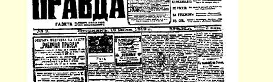
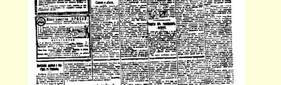
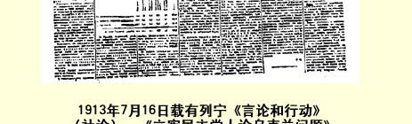

# 言论和行动

> （１９１３年７月１６日〔２９日〕）

我们有些人在评价某一党派的口号、策略和它的总方针时，经常错误地拿这个党派自己提出的愿望或动机来作根据。这样的评价实在要不得。俗话说得好，地狱是由善良的愿望铺成的。

问题不在于愿望，不在于动机，不在于言论，而在于不依这些东西为转移的客观环境。正是客观环境决定着某一党派的口号、 策略或总方针的成败和意义。

现在我们就用这种观点来分析当前工人运动中最重要的问题。彼得堡７月１—３日的罢工有６２０００多工人参加，这还是根据资产阶级报纸《言语报》和《俄罗斯言论报》的统计数字，这两家报纸在这种情况下总是提供缩小了的数字。

因此，有６万多人参加罢工，这是事实。大家知道，这次罢工的直接起因是抗议迫害工人报刊，抗议每天没收这些报刊等等。 我们甚至从《新时报》、《言语报》、《现代报》１５８、《俄罗斯言论报》 这类报纸的报道中也可以看出，工人通过自己的发言和其他方式着重指出他们的抗议具有全民的意义。

俄国社会的各个不同的阶级是怎样对待这一事件的呢？他们采取了什么立场呢？

我们知道，《俄国报》１５９、《庶民报》之类的报纸都对这一事件发表了照例是措辞激烈的谴责性声明，并且往往带有极粗鲁的谩骂和威胁等等。这并不新奇。这是可以理解的。这是必然的。

比较“新奇的” 倒是资产阶级对这一事件采取了非常冷淡的态度，这一点在自由派报纸上已经反映出来了，而且这种冷淡态度往往转变为否定态度。可是，当工人运动在１７—１８年以前还不太重要，参加的人数还不太多的时候，自由派资产阶级曾对工人运动表示过明显的同情。可见，自由派无疑已经坚决地向右转了， 它背离了民主运动并且反对民主运动。

自由派的《俄罗斯言论报》如果不是俄国销路最广的报纸，那也是俄国销路最广的报纸之一，这家报纸在评论彼得堡７月１—３ 日事件时写道：

> “指出彼得堡出版的社会民主党报纸对这次罢工的态度是很有意思的。 社会民主党的《真理报》专为昨天的〈此文写于７月３日〉罢工辟出很大的篇幅，而所谓取消派集团的机关报《光线报》却只登了一篇关于这次罢工的短评，在此之前，它曾为政治罢工写了一篇社论〈７月２日《光线报》〉，表示反对工人的这类行动。”（１９１３年７月３日《俄罗斯言论报》）

事实就是这样。反动派采取敌视态度。自由派和取消派则采取冷淡和否定的态度。自由派和取消派行动上是统一的。只有反对取消派，工人的群众性行动才能统一起来。

无产阶级要想履行自己的民主主义职责，要想尽到先锋队的义务，要想为人民群众服务，对他们进行教育，使他们团结起来， 就只有同行动上完全依赖于自由派的取消派进行坚决的斗争。

自由派同各种各样的貌似马克思主义者的分子或动摇分子一

> １９１３年７月１６日载有列宁《言论和行动》（社论）、
>
> 《立宪民主党人论乌克兰问题》和《关于德国各政党的最新材料》
>
> 三篇文章的《工人真理报》第３号第１版
>
> （按原版缩小） 样，也常常在杜马讲坛上表现激进，但是这并不妨碍自由派（在取消派的帮助下）去反对杜马外的群众的民主运动。 载于１９１３年７月１６日《工人真理报》  译自《列宁全集》俄文第５版第３号  第２３卷第３３５—３３６页