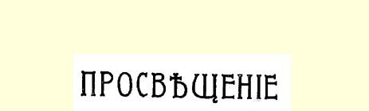
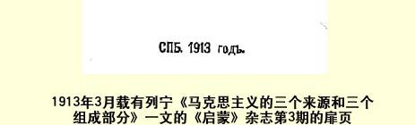

１９世纪所创造的优秀成果—— 德国的哲学、英国的政治经济学和法国的社会主义的当然继承者。

现在我们就来简短地说明一下马克思主义的这三个来源以及它的三个组成部分。

# 一

马克思主义的哲学就是**唯物主义**。在欧洲全部近代史中，特别是１８世纪末叶，在同一切中世纪废物，同农奴制和农奴制思想展开决战的法国，唯物主义成了唯一彻底的哲学，它忠于一切自然科学学说，仇视迷信、伪善行为及其他等等。因此，民主的敌人便竭尽全力来“驳倒”、败坏和诋毁唯物主义，维护那些不管怎样总是为宗教辩护或支持宗教的各种哲学唯心主义。

马克思和恩格斯最坚决地捍卫了哲学唯物主义，并且多次说明，一切离开这个基础的倾向都是极端错误的。在恩格斯的著作 《路德维希·费尔巴哈》和《反杜林论》里最明确最详尽地阐述了他们的观点，这两部著作同《共产党宣言》一样，都是每个觉悟工人必读的书籍。

但是，马克思并没有停止在１８世纪的唯物主义上，而是把哲学向前推进了。他用德国古典哲学的成果，特别是用黑格尔体系 （它又导致了费尔巴哈的唯物主义）的成果丰富了哲学。这些成果中主要的就是**辩证法**，即最完备最深刻最无片面性的关于发展的学说，这种学说认为反映永恒发展的物质的人类知识是相对的。不管那些“重新” 回到陈腐的唯心主义那里去的资产阶级哲学家的

> １９１３年３月载有列宁《马克思主义的三个来源的三个组成部分》一文的
>
> 《启蒙》杂志第３期的扉页
>
> （按原版缩小）