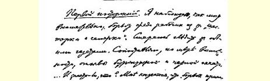
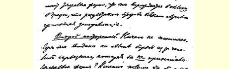
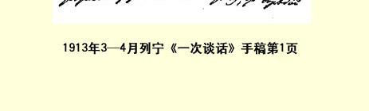

# 一 次谈话

> （１９１３年３—４月）
>
> **第一个局外人**：我正在尽量仔细地观察“六人团和七人团”３４ 在工人中间引起的斗争。我非常注意双方的报纸

３５。我尽可能地对照资产阶级报刊和黑帮报刊的评论。……你知道这是怎么一回事？ 在我看来，斗争采取了严重的形式，斗争会变成无谓的纠纷，无谓的争执，结果一定是一团糟。

**第二个局外人**：我根本不懂。世界上哪有因某种严重问题而引起的斗争竟不采取严重形式的？正因为要用斗争来解决严重问题，这里“小小的”“争吵”就无济于事。那些一贯否定并且还在继续否定建党原则的人不经过拼命的反抗是不会投降的。拼命的反抗随时随地都会产生“严重的形式”，都会产生把原则性的争论变成无谓的纠纷的**尝试**。那怎么办呢？是不是因此就要我们放弃为建党的基本原则而斗争呢？

**第一个局外人**：你多少有些离开了我提的问题，而且过分急于“转入进攻”。双方的每个工人小组都忙着“赶写”决议，而且双方都抢着使用厉害的字眼，就好象在进行一场竞赛。这样谩骂， 会使那些探索社会主义光明的工人群众不愿意看工人的报刊。他们可能会对社会主义产生疑惑或某种羞愧之感而抛弃这些报纸 ……他们甚至可能长期对社会主义感到失望。谩骂竞赛会造成一种“**非**自然淘汰” 的局面，使那些“拳斗专家” 占上风……双方都在鼓励自己人放肆地侮辱对方。社会主义政党应该**这样**教育无产阶级吗？这如果不是对机会主义的赞许，至少也是对机会主义的放任，因为机会主义就是为了暂时的胜利而牺牲工人运动的**根本**利益。双方都在为暂时的胜利而牺牲工人运动的根本利益…… 社会党人没有使群众由于进行社会主义工作而感到愉快，没有使他们全力以赴地来做这一工作，也没有使他们以严肃的态度对待这一工作，反而使他们离开了社会主义。这里不由得使人想起这样一句辛辣的话：无产阶级**不管**社会党人做得怎样也能达到社会主义。

**第二个局外人**：我们俩都是局外人，也就是说都没有直接参加斗争。但是局外人在分析他们眼前所发生的事情的时候，对斗争可能抱两种态度。从旁边来观察，只能看到所谓斗争的外表，形象地说，就是只能看到紧握的拳头、扭曲的脸、不雅观的场面；可以斥责这一切，为此而哭泣和悲叹。但是从旁边来观察也可以了解所进行的斗争的**意义**，这一意义比起斗争中的所谓“过火行为”或“极端行动”的场面和情景来，恕我直言，可要稍微有意思一些，在历史上要稍微重要一些。有斗争就会有激情，有激情就会有极端行动；至于我自己，我最恨那些在阶级、政党、派系的斗争中首先看到“极端行动”的人。我总是激动地—— 恕我直言—— 对这些人大声说：“我以为，喝酒没有什么关系，只要能把事情办好。”３６

现在正在做的是一件大事，是一件有历史意义的大事情。这就是建立工人政党。工人要自主，工人要影响**自己的**党团，工人要自己解决自己政党的问题，—— 这就是正在发生的事情的伟大历史意义，我们所希望的东西正在我们眼前变成**事实**。“极端行动”

> １９１３年３－４月列宁《一次谈话》手稿第１页
>
> （按原稿缩小） 使得您惊骇和悲伤，而我却兴奋地观察着这场斗争，因为在这一斗争中俄国工人阶级确实在成熟和壮大。只是由于就是一个局外人，不能投到这一斗争中去，我简直要发狂……

**第一个局外人**：是投到“极端行动” 中去吗？如果这些“极端行动” 到了炮制决议的程度，那你也宣布“仇恨” 那些指出这一点、对这一点感到愤慨并且要求坚决停止这样做的人吗？

**第二个局外人**：请别吓唬人！你吓不倒我！说实在的，你愈来愈象那种对公开揭穿谣言总要横加指责的人了。我记得，有一次在《真理报》上登了一条消息，说一个社会民主党人在政治上不诚实，这条消息过了很久才得到澄清。我在想象，从刊登时起到澄清时止，这位社会民主党人该怀着什么样的心情！但是公开揭穿是一把利剑，它自己可以治疗它所带来的创伤。那炮制决议呢？炮制者一定会被揭穿和被抛弃的。只能是这样。在进行一场严重的会战时，战场附近不可能没有野战医院。但是因为看到 “野战医院的”情景就害怕起来或者紧张起来，那是绝对不能原谅的。你怕狼，就别到森林里去。

至于谈到机会主义，即谈到忘却社会主义的根本目的，那你是在委过于人。在你看来，这些根本目的只是某种“完美的理想”，它同为当前的问题，为现时的迫切问题而进行的“罪恶”斗争是没有联系的。这样看社会主义，就是把社会主义曲解为甜言蜜语，脉脉温情。应当把为当前的每一个迫切问题而进行的每一次斗争同根本目的**紧紧地联系起来**。只有这样理解斗争的历史意义，才有可能在深化和加剧斗争的同时清除那些坏东西，那种 “放肆” 和“拳斗”。凡是人多、嘈杂、喧嚣和拥挤的地方，这种 “拳斗” 总是免不了的，但是这种现象会自然而然地得到消除。

你谈到了社会主义政党怎样教育无产阶级的问题。当前斗争中的问题**恰恰**是要捍卫党性的**基本**原则。现在，每个工人小组都面临着一个尖锐的、丝毫不能含糊的、必须立即直截了当予以答复的问题，这就是：***它***希望在杜马中执行**什么**政策？***它***怎样看待公开的党和地下组织？它是否认为杜马党团**在**党**之上**，或者相反？ 所有这一切都是有关党的存亡的基本问题，因为这是牵涉到要不要党的问题。

社会主义不是将赐恩于人类的现成制度。社会主义是现在的无产阶级**为了**达到自己的根本目标而进行的阶级斗争，是从今天的目标走向明天的目标从而日益**接近**根本目标的斗争。今天，在这个称为俄国的国家里，社会主义正经历着一个阶段，即觉悟的工人不顾自由派知识分子和“杜马的社会民主党知识分子” 对工人政党的建设进行种种**破坏**而由自己完成这一建设的阶段。

取消派要**破坏**工人建立自己的工人政党，这就是“六人团同七人团” 斗争的意义和重要性所在。但是他们破坏不了。斗争是艰巨的，但是胜利一定属于工人。让那些软弱的、被吓坏的人因斗争的“极端行动” 而动摇吧，—— 他们明天就会看到：不通过这种斗争就休想前进一步。

> 载于１９３２年５月５日《真理报》  译自《列宁全集》俄文第５版第１２３号  第２３卷第５１—５４页