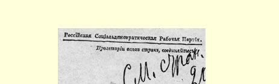
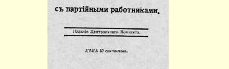
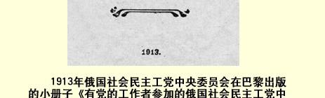
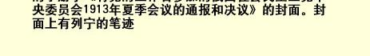

# 有党的工作者参加的俄国社会民主工党中央委员会 １９１３年夏季会议的决议３６

> （１９１３年９月）

## 关于目前的鼓动任务

１．国内局势日趋紧张。反动地主的统治甚至使最温和的居民阶层也怨声载道。沙皇君主制度仍然是俄国通向一切真正政治自由的道路上的障碍，它敌视一切重大改良，只保护农奴主的权益， 并且特别残酷地镇压工人运动的一切表现。

２．工人阶级仍然是争取全国解放的革命斗争的领导者。群众性的革命罢工继续发展。工人阶级的先进队伍正在革命的口号下进行实际斗争。

群众性的经济运动，开始往往提出一些最初步的要求，后来在整个斗争形势的影响下逐渐和工人阶级的革命运动汇合。

先进工人的任务是，通过自己的宣传教育工作使无产阶级在当前的革命口号下尽快联合起来。同时只有在这个条件下，先进的工人也才能完成自己所肩负的唤醒农民民主派和城市民主派的

> １９１３年俄国社会民主工党中央委员会在巴黎出版的小册子 《有党的工作者参加的俄国社会民主工党中央委员会１９１３年夏季
>
> 的通报和决议》的封面。封面上有列宁的笔迹任务。

３．工人阶级在革命口号下进行的斗争，迫使一部分企业主和自由主义十月党人资产阶级也开始大谈其改良的必要性来了，特别是大谈其打了折扣的结社自由的必要性来了。资产阶级一方面狂热地组织各种企业主联合会来防止罢工，并且要求政府有步骤地镇压工人运动，另一方面又建议工人**不要**提革命要求而只提结社自由之类的个别立宪改革。工人阶级应当利用政府一切可能产生的动摇，利用资产阶级和反动阵营之间存在的分歧，以加强自己在经济斗争领域和政治斗争领域的冲击。但是，工人阶级正是为了卓有成效地利用形势，应当坚持不打折扣的革命口号。

４．在这样的总形势下，社会民主党的任务是，照旧在群众中广泛进行推翻君主制和建立民主共和国的革命鼓动。必须坚持不懈地用现实的生动例子证明改良主义的全部害处，即证明把局部改善的要求作为中心来**代替**革命口号这种策略的全部害处。

５．取消派鼓动争取结社自由以至争取各种局部的改良而误入自由派的歧途。他们实际上反对在群众中进行革命鼓动，他们在自己的机关刊物上公开宣扬，“建立民主共和国”和“没收土地”的口号不能作为对群众进行鼓动的题目。他们提出结社自由作为当前无所不包的口号，实际上是用这个口号来代替１９０５年的革命要求。

６．会议提出，要防止取消派进行有害的改良主义的鼓动。同时指出，俄国社会民主工党早已在自己的最低纲领中提出了结社、言论、出版等自由的要求，而且把这些要求同推翻沙皇君主制度的革命斗争密切联系起来。会议认为１９１２年一月代表会议３７的决议是正确的，决议说：“代表会议号召所有社会民主党人向工人说明结社自由对无产阶级是绝对必要的，而且必须经常把这个要求同我们总的政治要求和对群众的革命鼓动密切联系起来。”[^1]

当前的主要口号仍然是：（１）建立民主共和国，（２）没收地主的土地，（３）实行八小时工作制。结社自由作为整体的一部分也包括在这些口号内。

## 关于组织问题和党代表大会的决议

１．来自各地的报告表明，不仅要巩固每个城市的党的领导组织，而且要把各个城市联合起来，这是当前最重要的组织任务。

２．会议建议，作为地区联合的第一步，举行由工人运动各据点派同志参加的联席会议（有的地方也可以举行代表会议）。同时必须力求党的工作的一切部门，如政治、工会、保险、合作社等部门都有代表参加会议。

３．会议认为，中央委员会代理人制度对于统一全俄的工作是完全必要的。二月会议关于代理人的决定３８刚开始执行。各地先进工人都应该关心这件事，至少在每个大的工人运动中心要推选出代理人，而且多多益善。

４．会议把召开党代表大会３９的问题提上了日程。工人运动的发展、国内政治危机的成熟、在全国范围内工人阶级统一行动的必要性，都表明经过充分筹备之后召开这样的代表大会是有必要和有可能的。

５．会议请各地同志讨论这个问题，并提出初步议程、召开代表大会的适当日期、决议草案等等。

６．会议指出，代表大会的经费开支问题以及其他困难，都只能靠工人自己来解决。

会议号召同志们着手筹集召开党代表大会所需要的经费。

## 关于罢工运动

１．会议认为１９１２年一月代表会议和１９１３年二月会议通过的决议[^2]是正确的，因为这些决议对罢工运动的估计符合最近几个月的全部经验。

２．革命罢工高涨的新时期的特点是，莫斯科运动兴起，至今尚未参加运动的几个地方的情绪不断高涨。

３．会议欢迎彼得堡委员会和莫斯科许多党组织的创举，欢迎它们提出政治总罢工的问题以及它们今年７月和９月在这方面采取的步骤。[^3]

４．会议认为，运动即将把全俄政治罢工提上日程。必须为这一罢工作准备，立即普遍开展有系统的鼓动工作。

５．建立民主共和国，实行八小时工作制，没收地主的土地，这些当前的基本革命要求应当成为政治罢工的口号，必须大力加以宣传。

６．会议号召各地所有的工作者散发传单展开鼓动工作，建立各城市工人政治组织和其他组织之间尽可能正常尽可能密切的联系。尤其必须注意的是，首先使彼得堡和莫斯科的工人达成协议， 使种种缘由（迫害报刊、保险罢工等等）诱发的政治罢工尽可能同时在两个首都进行。

## 关于党的报刊

１．会议确认，合法报刊对社会民主党的鼓动工作和组织工作具有重大意义，因此号召党的机关和全体觉悟工人大力支持合法报刊，最广泛地推销这些报刊，组织群众集体订阅，经常募集捐款。 同时，会议再次指出，此项捐款就是党员交纳的党费。

２．尤其必须大力巩固莫斯科的合法工人机关报４０，并且尽快在南方创办工人报纸。

３．会议希望现有各合法工人机关刊物通过交换情报、举行各种会议来尽可能加强联系。

４．会议肯定了马克思主义理论刊物存在的重要性和必要性， 并希望党和工会出版的一切刊物向工人介绍《启蒙》杂志４１，号召工人长期订阅并不断给予支持。

５．会议要求党的各个出版社４２注意，目前急需大量出版有关社会民主党宣传鼓动问题的通俗小册子。

６．最近时期群众革命斗争激化，有必要对这一斗争进行充分全面的阐述，而合法刊物对此又无力承担，因此会议特别强调必须大力发展党的秘密出版社，同时，除了散发秘密传单、小册子等等外，务必更经常地定期出版党的秘密机关报（中央机关报）４３。

## 关于社会民主党的杜马工作

会议详细研究了俄国社会民主工党１９０８年十二月代表会议通过的关于社会民主党杜马党团的决议，讨论了有关第四届杜马中社会民主党杜马工作的一切材料之后，认为：

１．上述决议完全正确地规定了社会民主党杜马工作的任务和方针，因此今后必须仍以这一决议为指针；

２．对十二月决议第３条最后一部分（第３条第８款）（对改善工人生活状况的问题是赞成还是弃权）４４，应作如下说明。如果法案、提案等等直接涉及改善工人、下级职员以至全体劳动群众的生活状况（例如，缩短工作日，增加工资，消除工人以至整个广大居民阶层生活中哪怕是不大的弊端等等），那就应该投票赞成包含着这些改善内容的条款。

如果由于第四届杜马提出附带条件而使改善成了问题，党团则应当弃权，并在事先同工人组织的代表就这个问题进行商讨，必须专门说明弃权的理由。

会议认为：

在讨论一切要求、重大法案等等时，社会民主党党团应该提出自己的程序提案。

社会民主党的提案被否决之后，如果党团和其他党派一致投票反对政府的方案，那么党团在投票赞成别的整个提案或别的部分提案时，必须尽力专门说明一下自己的理由。

## 关于社会民主党杜马党团

会议认为，社会民主党党团４５在杜马工作方面采取统一行动是可能的和必要的。

但是会议认为，７个代表的行为严重地威胁党团的统一。

７个代表利用一票之差的偶然多数，侵犯了代表大多数俄国工人的６个工人代表的基本权利。

７个代表从狭隘的派别利益出发，剥夺了６个代表在杜马讲坛上就工人生活最重要的问题发言的机会。有许多次发言，社会民主党党团都推举了２名或２名以上的发言人，但是尽管６个代表提出了自己的要求，却得不到推举自己发言人的机会。

在分配杜马各委员会（如预算委员会）的席位时，７个代表同样也拒绝把两个席位分一个给６个代表。

在党团选举代表进入对工人运动有重要意义的机构时，７个代表以一票之差的多数剥夺了６个代表的代表权。党团的工作人员也往往是由单方面选定的（例如，否决了任命第二书记的要求）。

会议认为，７个代表的这种行为方式，不可避免地会在党团中造成摩擦，妨碍团结一致地进行工作并导致党团分裂。

会议最坚决地抗议７个代表的这种行为方式。

６个代表代表着俄国大多数的工人，他们的行动完全符合大多数工人有组织的先锋队的政治路线。

因此，会议认为，只有党团的这两个部分完全平等，只有７个代表放弃压制政策，才能保持社会民主党党团在杜马工作方面的统一。

尽管不只是在杜马工作的领域内存在着不可调和的意见分歧，会议仍然要求党团根据上面提出的党团内两个部分平等的原则保持统一。

会议请觉悟工人就这个重要问题发表意见，并且全力促进党团在６个工人代表享有平等权利这个唯一可能的基础上保持统一。

## 关于合法社团中的工作

１．在目前工人阶级经济斗争和政治斗争高涨时期，尤其有必要加强一切合法工人社团（工会、俱乐部、伤病救济保险基金会、合作社等等）中的工作。

２．合法工人社团中的一切工作不应按中立精神来进行，而应该根据俄国社会民主工党伦敦代表大会和斯图加特国际代表大会决议４６的精神来进行。社会民主党人应该尽可能更广泛地吸收工人参加各种工人社团，不分党派观点，一律邀请加入工人社团。但是，社会民主党人应当在这些社团的内部建立党的小组，在所有这些社团内部进行长期系统的工作，使这些社团和社会民主党之间建立最密切的关系。

３．国际工人运动和我们俄国工人运动的经验告诉我们，从这样的工人组织（工会、合作社、俱乐部等等）刚一创立，就必须争取使每一个这样的机构成为社会民主党的支柱。会议提请全体党员注意俄国目前这个最迫切的重要任务，因为俄国的取消派一贯企图利用合法社团来**反对**党。

４．会议认为，在选举保险基金会的全权代表时，在工会等等的一切工作中，都必须坚持在运动中行动完全统一，少数服从多数， 贯彻党的路线，把党的拥护者选到所有的负责岗位上去等等。

５．为了总结合法工人社团中实际工作的经验，最好更经常地举行各地合法工人组织工作积极分子联席会议，同时尽量多吸收在合法社团中工作的党的小组的代表出席全党的代表会议。

## 关于民族问题的决议

黑帮民族主义的甚嚣尘上，自由派资产阶级中民族主义倾向的日益滋长，被压迫民族上层分子中民族主义倾向的不断加强，目前这一切已把民族问题提到突出的位置上。

社会民主党内部的状况（高加索社会民主党人、崩得４７、取消派企图取消党纲４８等等），使党不得不更加重视这个问题。

为了搞好社会民主党关于民族问题的鼓动工作，会议根据俄国社会民主工党的纲领提出下列各点：

１．在以人剥削人、巧取豪夺、勾心斗角为基础的资本主义社会里，实现民族和平的条件只能是：建立彻底的民主共和国国家制度，保证一切民族和语言完全平等，取消强制性国语；保证为居民设立用本地语言授课的学校，宪法中还要加一条基本法律条款，宣布任何一个民族不得享有特权，不得侵犯少数民族的权利。与此同时，尤其必须实行广泛的区域自治和完全民主的地方自治，并且根据当地居民自己对经济条件和生活条件、居民民族成分等等的估计，确定地方自治地区和区域自治地区的区划。

２．从民主观点来看，特别是从无产阶级阶级斗争的利益来看， 在一国之内按民族分开办学是绝对有害的。在俄国一切犹太资产阶级政党和各民族的市侩机会主义分子通过的所谓“民族文化”自治或“建立保障民族发展自由的机构”的计划中，恰恰就是要这样分开办学。

３．工人阶级的利益要求一国之内各族工人在统一的无产阶级组织—— 政治组织、工会组织、合作－教育组织等等中打成一片。 只有各族工人在这种统一的组织中打成一片，无产阶级才有可能进行反对国际资本、反对反动派的胜利斗争，粉碎各民族的地主、 神父和资产阶级民族主义者的宣传和意图，因为这些人通常都是在“民族文化”的幌子下，贯彻反对无产阶级的意图的。全世界的工人运动正在创造而且正在日益发展各民族共同的（国际的）无产阶级文化。

４．至于在沙皇君主制度压迫下的各民族的自决权，即分离权和成立独立国家的权利４９，无疑是社会民主党应当维护的。这是国际民主派的基本原则的要求，尤其是遭受沙皇君主制度空前的民族压迫的俄国多数居民的要求，因为沙皇君主制度同欧洲和亚洲的邻国相比是最反动最野蛮的国家制度。其次，这也是大俄罗斯居民本身的自由事业的要求，因为不根除黑帮的大俄罗斯民族主义， 大俄罗斯居民就无法建立民主国家。黑帮的大俄罗斯民族主义有一连串血腥镇压民族运动的传统，它不仅受到沙皇君主制度和一切反动政党的不断培植，而且还受到特别是在反革命时期向君主制卑躬屈节的大俄罗斯资产阶级自由派的不断培植。

５．不允许把民族自决权问题（即受国家宪法保障用完全自由和民主的方式解决分离的问题）同某一民族实行分离是否适宜的问题混淆起来。对于后者，社会民主党应当从整个社会发展的利益和无产阶级争取社会主义的阶级斗争的利益出发，完全独立地逐个加以解决。

同时，社会民主党应当注意到，被压迫民族的地主、神父和资产阶级往往用民族主义的口号来掩饰他们离间工人和愚弄工人的意图，暗中同占统治地位的民族的地主和资产阶级勾结，损害各民族劳动群众的利益。

会议把关于民族纲领的问题列入党代表大会议程。会议请中央委员会、党的报刊和各地方组织对民族问题尽量详细地加以阐述（用小册子、讨论会等）。

## 关于民粹派

１．伦敦代表大会在总结各民粹主义党派（还有社会革命党 ５０）在革命时期的活动时，准确地指出，这些党派经常动摇不定，时而屈服于自由派的领导权，时而坚决反对地主土地占有制、反对农奴制国家；同时还指出，他们进行伪（假）社会主义宣传，抹杀无产者和小业主之间的对立。

２．反动时期使这些特点更加突出：一方面，社会革命党放弃了彻底的民主主义政策，它的某些党员甚至成了追随自由派的批评革命的人。另一方面，它也变成了一个脱离群众生活的纯知识分子团体。

３．社会革命党继续正式采用恐怖手段，但是，在俄国采用恐怖手段的历史证明，社会民主党对这种斗争方法提出的批评是完全正确的，而且这个历史也以完全破产而告终。同时，由于这个知识分子的组织抵制选举，而且丝毫不能有计划地促进国家的社会发展进程，因此，各地革命运动的新高涨并不受社会革命党的任何影响。

４．民粹派的小资产阶级社会主义无非就是向工人阶级进行有害的说教，宣传抹杀劳资利益之间日益加深的鸿沟、试图缓和激烈的阶级斗争的思想：这种小资产阶级社会主义使人们在合作社问题上产生小市民空想。

５．在维护民主口号方面所表现的动摇、党的小组习气及其小资产阶级的偏见，都极其严重地妨碍着民粹派在广大农民中开展民主共和的宣传。因此，这个宣传的利益本身也首先要求社会民主党坚决地批评民粹派。

会议决不排斥同各民粹主义党派采取伦敦代表大会特别规定的联合行动，因此认为，社会民主党的任务应该是：

（一）揭露各民粹主义党派表现出的动摇行为和放弃彻底的民主主义的行为；

（二）同抹杀劳资间鸿沟的民粹派的小资产阶级社会主义作斗争；

（三）支持农民群众中的民主共和思潮，同时不断指出，只有彻底奉行民主主义的社会主义无产阶级，才能成为贫苦农民群众在与君主制和地主土地占有制进行斗争时的可靠领导者；

（四）更加重视在那些虽然为数不多、但迄今尚未摆脱民粹派的落后理论的工人团体中宣传社会民主主义思想。

> 载于１９１３年１２月俄国社会民主工党译自《列宁全集》俄文第５版中央委员会在巴黎出版的小册子《有第２４卷第４５—６１页党的工作者参加的俄国社会民主工党中央委员会１９１３年夏季会议的通报和决议》

[^1]: 见《列宁全集》第２版第２１卷第１５０页。—— 编者注

[^2]: 见《列宁全集》第２版第２１卷第１３６—１３８页和第２２卷第２５８—２６０页。——编者注

[^3]: 九月事件是当时受托公布会议决议的中央机关报编辑部添上的，完全证明了会议决议是正确的。