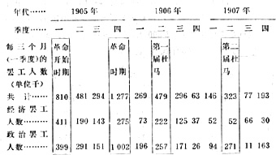

# 俄国的罢工 １２５

> （１９１３年１２月１４日〔２７日〕）

西欧大部分国家正式的罢工统计建立的时间不长，才１０—２０ 年，而俄国仅仅从１８９５年才开始有罢工统计资料。我国官方统计的主要缺陷是压低罢工人数，统计对象也仅仅是工厂视察机关所属的各企业的工人。至于铁路工人、采矿工人、电车工人、纳消费税的企业和采矿等企业的工人、建筑工人、农业工人均不在统计之列。

下面就是俄国建立罢工统计以来的一般材料：

> 年 代
>
> 罢  工  次  数罢工工人人数
>
> 共  计共  计
>
> 占企业总数占工人总数
>
> 的百分比的百分比
>
> １８９５６８０．４３１１９５２．０
>
> １８９６１１８０．６２９５２７１．９
>
> １８９７１４５０．７５９８７０４．０
>
> １８９８２１５１．１４３１５０２．９
>
> １８９９１８９１．０５７４９８３．８
>
> １９００１２５０．７２９３８９１．７
>
> １９０１１６４１．０３２２１８１．９
>
> １９０２１２３０．７３６６７１２．２
>
> １９０３５５０３．２８６８３２５．１
>
> （续表）
>
> 年 代
>
> 罢  工  次  数罢工工人人数
>
> 共  计共  计
>
> 占企业总数占工人总数
>
> 的百分比的百分比
>
> １９０４６８０．４２４９０４１．５
>
> １９０５１３９９５９３．２２８６３１７３１６３．８
>
> １９０６６１１４４２．２１１０８１０６６５．８
>
> １９０７３５７３２３．８７４００７４４１．９
>
> １９０８８９２５．９１７６１０１９．７
>
> １９０９３４０２．３６４１６６３．５
>
> １９１０２２２１．４４６６２３２．４
>
> １９１１４６６２．８１０５１１０５．１
>
> １９１２１９１８？６８３３６１？

从下面一个例子中就可以看出，这些数字被压得多么低。普罗柯波维奇先生这位小心谨慎的作家援引了１９１２年的另一个数字： ６８３０００个罢工工人，“按另一种算法得出，工厂企业中有１２４８０００ 人，此外不属工厂视察机关监督的企业中还有２１５０００人”，也就是说总共有**１４６３０００人**，差不多达到１５０００００人。

经济罢工（从１９０５年起）的数字如下：

> 年  代罢工次数工人数
>
> １９０５４３８８１０５１２０９
>
> １９０６２５４５４５７７２１
>
> １９０７９７３２００００４
>
> １９０８４２８８３４０７
>
> １９０９２９０５５８０３
>
> １９１０２１４４２８４６
>
> １９１１４４２９６７３０
>
> １９１２７０２１７２０５２

由此可见，俄国罢工的历史很明显地划分为４个时期（且不谈 ８０年代，当时爆发了著名的莫罗佐夫工厂罢工，就连反动的政论家卡特柯夫也说那次罢工是在俄罗斯出现的“工人问题”１２６）：

> 每年平均罢工人数
>
> 第一时期（１８９５—１９０４年），革命前时期４３０００
>
> 第二时期（１９０５—１９０７年），革命时期１５７００００
>
> 第三时期（１９０８—１９１０年），反革命时期９６０００
>
> 第四时期（１９１１—１９１２年），开始活跃的
>
> 当前时期３９４０００

总的说来，整个１８年间，我国每年平均罢工人数是３４５４００ 人。德国在１４年间（１８９９—１９１２年）平均罢工人数是２２９５００人， 英国在２０年间（１８９３—１９１２年）平均罢工人数是３４４２００人。为了具体地说明俄国罢工同政治历史的联系，我们列出１９０５—１９０７年的材料，**一年分四个季度**：

从下面的材料中可以看出俄国各个地区工人参加罢工的情况：

> 罢工人数（单位千）

按罢工的原因，可进行下列分类（１８９５—１９０８年这１４年中）： 参加政治罢工的占５９．９％；为工资而罢工的占２４．３％；为工作日而罢工的占１０．９％；为劳动条件而罢工的占４．８％。

我们根据罢工的成功与否作了如下分类（其中参加以妥协告终的罢工的人数平分后分别加到胜利者和失败者的人数上去）：

> 参加经济罢工的人数（单位千）
>
> １０年（１８９５
>
> —１９０４年
>
> 的 总 数
>
> 百分１９０５百分１９０６百分１９０７百分１９１１百分１９１２百分
>
> 比年比年比年比年比年比胜利者……１５９ ３７．５７０５４８．９２３３５０．９５９２９．５４９５１５５４２ 失败者……２６５ ６２．５７３４５１．１２２５４９．１１４１７０．５４７４９７７５８

**共 计**４２４１００．０１４３９１００．０４５８１００．０２００１００．０９６１００１３２１００

１９１１年到１９１２年这段时间的材料不完全，因此同上面的材料不完全可比。

最后，我们还要列出一些有关罢工分布情况（按企业的规模和企业所在地点）的简略材料：

### 在各类企业每１００个工人中的罢工人数

> 企 业 类 别１９０５年一年的数字
>
> １８９５—１９０４年
>
> 即１０年的总数
>
> ２０个工人以下的２．７４７．０
>
> ２１—５０个工人的７．５８９．４
>
> ５１—１００个工人的９．４１０８．９
>
> １０１—５００个工人的２１．５１６０．２
>
> ５０１—１０００个工人的４９．９１６３．８
>
> １０００个工人以上的８９．７２３１．９
>
> **城市内和城市以外所举行的罢工的百分比**
>
> 城 市 内城市以外 １８９５—１９０４年……………７５．１２４．９ １９０５年……………………８５．０１５．０

从这些数字中可以很清楚地看到，在罢工运动中大企业居多数，而农村工厂则比较落后。

> 载于１９１３年１２月１４日（２７日）译自《列宁全集》俄文第５版圣彼得堡波涛出版社出版的历书第２４卷第２１４—２１８页 《１９１４年工人手册》