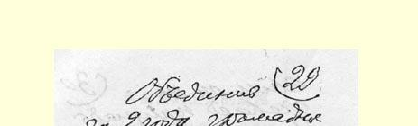
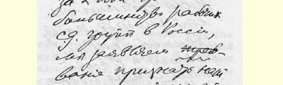
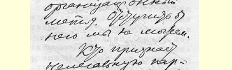
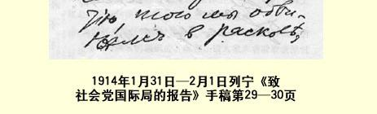
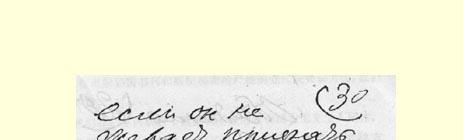
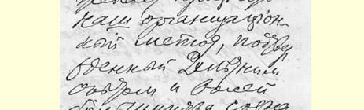
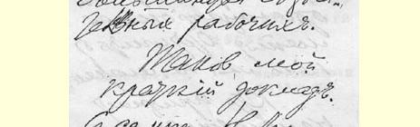
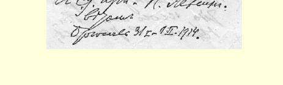

# 致社会党国际局的报告

> （１９１４年１月１８—１９日
>
> 〔１月３１日—２月１日〕）

致卡·胡斯曼

根据您的请求，我以我个人的名义写了下面一篇简短报告 （ｂｒｅｆ ｒａｐｐｏｒｔ），由于时间仓促，这个报告（ｒａｐｐｏｒｔ）难免出差错， 先致歉意。我们党的中央委员会大概会给社会党国际局执行委员会寄去正式报告[^1]，我个人的报告中可能出现的错误就会得到纠正。

我们党的中央委员会和**组织委员会**之间的分歧（ｄｉｓｓｅｎｔｉ－ ｍｅｎｔｓ）是什么呢？问题就在这里。这些分歧可以归纳为如下六点：

## 一

俄国社会民主工党建立于１８９８年，它是一个**秘密**党，并且***一直***是一个秘密党。现在，我们的党仍然只能作为一个秘密党存在， 因为在俄国，连温和自由派的政党也还没有合法化。

但是，在１９０５年俄国革命前，自由派在国外有过一个秘密的机关刊物１６１。革命失败后，自由派就脱离了革命，并且气愤地否定了关于出版秘密刊物的思想。因此，革命以后，在我们党内的机会主义一翼中，就产生了背弃秘密党的思想，产生了**取消**秘密党（这就是“**取消派**”这个名称的由来）而***代之以***合法的（“公开的”）党的思想。

我们全党曾在１９０８年和１９１０年两次***正式地***、无保留地谴责过取消主义。这里的意见分歧是绝对不可调和的。不能同那些不相信秘密党并且根本就不想建立秘密党的人一道去恢复和建设秘密党。

组织委员会和选举组织委员会的１９１２年八月代表会议，**口头上**承认秘密党。**事实上**，俄国的取消派报纸（１９１２—１９１３年的《光线报》和《新工人报》），在八月代表会议作出决定后，还在合法刊物上继续**攻击**秘密党的存在（尔·谢·、费·唐·、查苏利奇等人的许多文章）。

由此可见，我们之所以同组织委员会发生分歧，是因为组织委员会是一个空架子，它口头上不承认自己是取消派的组织，行动上却掩盖和粉饰俄国的取消派集团。

组织委员会不想（而且也不可能—— 因为它没有力量反对取消派集团）坚定不移地谴责取消主义，这是我们发生分歧的原因。

我们不同那些在合法刊物上攻击秘密党的人作斗争，就不能建立秘密党。俄国目前（从１９１２年起）有**两种**在圣彼得堡出版的工人日报。一种报纸（《真理报》）执行秘密党的决定，并且贯彻落实这些决定。另一种报纸（《光线报》和《新工人报》）攻击和嘲笑秘密党， 向工人灌输不需要这样的党的思想。如果取消派集团的这种报纸不根本改变自己的方向，或者组织委员会对这种报纸坚决不予谴责，不同它断绝关系，那么，秘密党同反对它存在的集团之间的统一是不可能的。

## 二

我们同取消派的意见分歧，也就是任何一个地方的革命者同改良主义者的意见分歧。但是，由于取消派在合法刊物上攻击革命口号，我们的这些意见分歧就变得特别尖锐和不可调和了。例如， 对于在合法刊物上声称不宜在向群众鼓动时提出建立共和国或没收地主土地这类口号的集团，我们是不可能和他们统一的。我们不可能在合法刊物上驳斥这种（在客观上）等于背叛社会主义并向自由主义和君主制让步的宣传。

而对俄国的这种君主制来说，还需要进行一系列革命，才能教育俄国沙皇接受立宪主义。

我们的秘密党在地下组织革命罢工和游行示威，它不可能和那些在合法刊物上称罢工运动为“罢工狂热”的著作家集团统一。

## 三

民族问题也是我们发生分歧的一个原因。这个问题在俄国十分尖锐。我们党的纲领绝对不承认所谓“超地域的民族自治”。维护这种民族自治，实际上就等于宣扬精致的资产阶级民族主义。可是取消派的八月代表会议（１９１２年）公开违反党的纲领，承认这种 “超地域的民族自治”。在中央委员会和组织委员会之间采取中立的普列汉诺夫同志，曾经反对这种违反党的纲领的行为，并且说这种行为是使社会主义迁就民族主义。

组织委员会不愿意收回它的违反我们党的纲领的决定，这是我们发生分歧的原因。

## 四

其次，表现在组织方面的民族问题也是我们发生分歧的原因。 哥本哈根代表大会公开谴责了按民族分开成立工会的做法。奥地利的经验已经证明，按这种办法来区分工会和无产阶级政党是行不通的。

我们党一贯主张建立一个统一的国际主义的社会民主党组织。在１９０８年分裂前，党曾经又一次提出关于各地各民族的社会民主主义组织合并的要求。

我们之所以同支持组织委员会的独立的犹太工人组织崩得发生分歧，是因为崩得违反党的决定，坚决拒绝宣布各地各民族组织实现统一的原则，拒绝在行动上实现这样的联合。

必须着重指出，崩得不仅拒绝同那些属于我们中央委员会领导的各个组织实现这样的联合，而且还拒绝同拉脱维亚社会民主党、波兰社会民主党和波兰社会党（左派）实现联合。因此，对崩得自称为联合者，我们不予承认，并声明：分裂分子恰恰就是崩得，因为它不实现社会民主主义工人在各地方组织中的国际主义统一。

## 五

组织委员会维护取消派和崩得同非社会民主主义的政党波兰社会党（左派）的联盟——** 反对**波兰社会民主党的两个部分，这种做法使我们发生分歧。

波兰社会民主党在１９０６—１９０７年间就已经加入了我们的党。

波兰社会党（左派）***从来***也没有加入过我们的党。

组织委员会同波兰社会党结成联盟来**反对**波兰社会民主党的两个部分，进行骇人听闻的分裂活动。

组织委员会和杜马代表中拥护组织委员会的人，不顾波兰社会民主党的两个部分的正式抗议，把非社会民主党人亚格洛（波兰社会党党员）吸收进社会民主党杜马党团，制造了骇人听闻的分裂。

组织委员会不愿意谴责并解散这个同波兰社会党（左派）一起进行分裂活动的联盟，因此我们发生了分歧。

## 六

最后，我们之所以同组织委员会、同许多国外集团和许多空架子组织发生分歧，是因为我们的反对者不愿意公开地、老老实实地、无条件地承认俄国绝大多数的觉悟工人是支持我们党的。

我们认为这一情况具有重大意义，因为国外有人时常利用一些毫无根据的、没有确凿可靠的材料证实的说法，来散布一些骇人听闻的关于俄国国内情况的谎言。

二者必居其一：要么我们的反对者承认他们和我们之间存在着不可调和的意见分歧（如果是这样，那他们关于统一的言论是虚伪的）；要么他们看不见这些不可调和的意见分歧（如果是这样，那他们要是不愿意被称为分裂分子，就应当老老实实地承认我们拥有绝对的多数）。

有哪些公开的经过核对的事实可以**证明**俄国真正占多数的有觉悟有组织的社会民主主义工人究竟站在哪一边呢？

第一，国家杜马的选举。

第二，整个１９１２年和几乎整个１９１３年社会民主党的两种报纸上的材料。

不难理解，两年来在圣彼得堡出版的两个派别的日报提供了有关我们所争论的问题的最重要材料。

第三，有关俄国工人公开声明在社会民主党两个杜马党团中拥护哪一个的材料（登载在**两种**报纸上）。

所有这三方面的材料，都已经写进了我们中央委员会递交给社会党国际局（在１９１３年１２月１４日的常会上）的正式报告。我再简单地提一下这些材料：

第一类材料。在第二届杜马（１９０７年）的选举中，“布尔什维克”（即拥护我们的人）占工人选民团选出的全体代表的４７％；在第三届杜马（１９０７—１９１２年）中占５０％；在第四届杜马中占６７％。

第二类材料。从１９１２年１月１日到１９１３年１０月１日，这２１ 个月中，圣彼得堡的两种工人报纸都公布了各工人团体的捐款帐目，取消派及其**所有的**同盟者有５５６个团体；我们党有２１８１个团体。

第三类材料。有４８５０个工人**签名**拥护我们的杜马党团（截至 １９１３年１１月２０日），有２５３９个工人拥护取消派（及其所有的同盟者崩得、高加索派等等）。

这些确凿可靠的材料证明，尽管俄国秘密党遇到了前所未见的困难，我们在两年之内仍然**联合了**俄国**绝大多数**的社会民主主义工人团体。

（在出版秘密书刊和组织秘密的严格的党代表会议方面，我们的优势更大。）

我们在两年内联合了俄国大多数的社会民主主义工人团体， 因此我们要求承认我们的组织方法。我们是不能放弃这种方法的。

谁要是承认秘密党但又不愿意承认我们两年来的经验所证实的和体现多数觉悟工人的意志的组织方法，我们就要谴责他进行分裂活动。

这就是我的简短的报告。

致社会民主主义的敬礼！

### 尼·列宁

１９１４年１月３１日—２月１日

于布鲁塞尔

> 载于１９２４年《无产阶级革命》杂志译自《列宁全集》俄文第５版第３期第２４卷第２９６—３０３页

[^1]: 见《列宁全集》第２版第２５卷第８６—８９页。—— 编者注