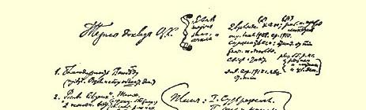
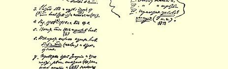

# 俄国社会民主工党中央委员会在布鲁塞尔会议上的报告的提纲

> （１９１４年６月２３—３０日〔７月６—１３日〕） 中央委员会的报告提纲    “没有军队的司令部” １感谢王德威尔得（到来。公布和收集***客观***材料）。 ２“争论点”。

题  目两种主要的观点

α 派别斗争（在国外）

### β俄国工人的团结和他们的大多数。 ３斗争的由来和实质：

（Ａ） 取消派脱离党（１９０８—１９１１年）以及

（Ｂ） 开除他们（１９１２年）。

（Ａ） ４１９０８年和１９１０年的决议。中央机关报的斗争。 ５**·与**取消派的愿望***相反***，１９１２年恢复了党。

（Ｂ） ６从理论上评价取消主义的实质 ***党***（秘密党）***的存在***和对党的背弃。 ７用（αα）我党的经验和（ββ）我们的反对者的经验来检验这一理论和党的这些决议…… 两种看法：（α）混乱状态；（β）工人政党反对取消派。 １９０８年的取消主义的定义。参看１９１０年。 它的实质：脱离党。 地下组织的意义。 与策略的关系。

工人阶级的革命斗争：

革命的群众大会

革命的罢工

革命的街头游行示威 １９１２年一月代表会议和党的恢复。

提纲：分歧的实质。

我党的经验。

我们的反对者的经验。

和解的实际条件。９条

１０？？

> 译自《列宁全集》俄文第５版
>
> 第２５卷第４４８—４４９页

### 注释