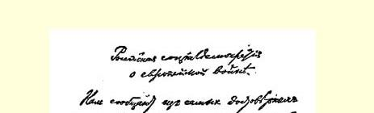
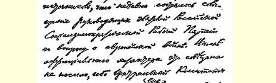
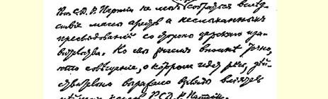
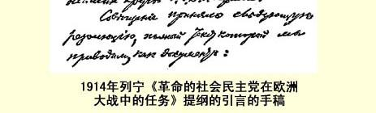

# 革命的社会民主党在欧洲大战中的任务１

> （１９１４年８月２３—２４日〔９月５—６日〕）

## 俄国社会民主党对欧洲大战的态度

我们从最可靠方面获悉，俄国社会民主工党的一些领导人不久前举行了一次会议，讨论了欧洲大战问题。这次会议不是十分正式的会议，因为沙皇政府所进行的大规模逮捕和闻所未闻的迫害， 使俄国社会民主工党中央委员会还无法召开会议。但是我们十分确切地知道，这次会议真正反映了俄国社会民主工党中最有影响的人们的观点。

会议通过了一项决议，现在我们把它作为文件全文引述如下：

### 一 批社会民主党人通过的决议

（１）这场欧洲的和世界的大战，具有十分明显的资产阶级、帝国主义、王朝战争的性质。争夺市场和掠夺其他国家，力图扼制国内无产阶级和民主派的革命运动，力图愚弄、分裂和屠杀各国无产者，驱使一国的雇佣奴隶为了资产阶级的利益去反对另一国的雇佣奴隶—— 这就是这场战争唯一真实的内容和作用。

（２）第二国际（１８８９—１９１４年）最强大和最有影响的党—— 德国社会民主党的领袖们投票赞成军事预算２，重弹普鲁士容克和资产阶级的资产阶级沙文主义老调，这是直接背叛社会主义的行为。 不管怎样，即使这个党确实力量过于薄弱而不得不暂时屈从本国资产阶级多数的意志，德国社会民主党领袖们的行为也是不能原谅的。实际上，这个党现在采取了民族主义自由派政策。

（３）比利时和法国社会民主党的领袖们参加了资产阶级内阁３，出卖了社会主义，他们的行为理应受到同样的谴责。

（４）第二国际（１８８９—１９１４年）大多数领袖背叛社会主义，意味着这个国际在思想上政治上的破产。这种破产的主要原因是，在第二国际中事实上占优势的是小资产阶级机会主义，对于它的资产阶级性和危险性，世界各国革命无产阶级的优秀代表早就指出过了。机会主义者早就在为第二国际的破产准备条件了：他们否定社会主义革命而代之以资产阶级改良主义；他们否定阶级斗争及其在一定时机转变为国内战争的必然性，而鼓吹阶级合作；他们在爱国主义和保卫祖国的幌子下鼓吹资产阶级沙文主义，而忽视或否定《共产党宣言》中早已阐明的一条社会主义的基本真理，即工人没有祖国[^1]；他们在同军国主义的斗争中局限于感伤主义的小市民观点，而不承认所有国家的无产者必须以革命战争来反对所有国家的资产阶级；他们把必须利用资产阶级的议会制度和资产阶级所容许的合法性变成盲目崇拜这种合法性，而忘记了在危机

> １９１４年列宁《革命的社会民主党在
>
> 欧洲大战中的任务》提纲的引言的手稿
>
> （按原稿缩小） 时代必须有秘密的组织形式和鼓动形式。机会主义的国际机关刊物之一，早已站在民族主义自由派立场上的德国《社会主义月刊》４，现在正在为自己战胜欧洲社会主义而欢欣鼓舞，这是完全有道理的。德国社会民主党内和其他国家社会民主党内的所谓“中派”，事实上已经胆怯地向机会主义者举手投降了。未来的国际的任务，应当是坚决彻底地抛开社会主义运动中的这一资产阶级派别。

（５）在欧洲大陆上相互角逐的两个主要民族—— 德意志民族和法兰西民族—— 的资产阶级政党和政府着力用来愚弄群众，而社会主义运动中盲目地追随资产阶级的公开和隐蔽的机会主义者则不断加以重复的那些资产阶级和沙文主义的诡辩中，以下几点应当特别指出并严厉地加以驳斥：

德国资产者说他们是要保卫祖国，反对沙皇政府，捍卫文化发展和民族发展的自由，这是在撒谎，因为以威廉为首的普鲁士容克和德国大资产阶级，一直是奉行维护沙皇君主政府的政策的， 而且不管战争的结局如何，他们都一定会竭力支持沙皇君主政府的；他们是在撒谎，因为实际上奥地利资产阶级向塞尔维亚发动了强盗式的进攻，德国资产阶级正在压迫丹麦人、波兰人和阿尔萨斯－洛林的法国人，他们向比利时和法国发动进攻性战争以掠夺这两个较富有较自由的国家，他们发动进攻是在他们认为可以使用其经过改进的最新军事技术装备的最有利的时机，是在俄国实行所谓大军事计划的前夜。

法国资产者也说他们是要保卫祖国等等，他们也是在撒谎，因为事实上他们是在维护资本主义技术比较落后的、发展比较缓慢的国家，用亿万巨款雇用俄国沙皇政府的黑帮分子发动进攻性战争，即掠夺奥地利和德国的领土。

两个参战国集团在战争中都表现出极端残暴和野蛮，谁也丝毫不比对手逊色。

（６）俄国社会民主党的首要任务，就是无情地、全力地同大俄罗斯的和沙皇君主派的沙文主义作斗争，同俄国自由派—— 立宪民主党人５、部分民粹派６以及其他资产阶级政党为这种沙文主义进行诡辩的行为作斗争。从俄国各民族的工人阶级和劳动群众的观点来看，沙皇君主政府和它的军队战败为害最小，因为它们压迫波兰、乌克兰和俄国的许多民族，并且煽起民族仇恨来加强大俄罗斯人对其他民族的压迫和巩固反动的野蛮的沙皇君主政府。

（７）社会民主党现时的口号应当是：

第一，在各方面（包括在军队内、在战场上）宣传社会主义革命，宣传必须把枪口对准各国反动的资产阶级政府和政党，而不是对准自己的弟兄—— 其他国家的雇佣奴隶。迫切需要在各国军队中组织秘密的支部和小组，以便用各种语言进行这种宣传。要向一切国家的小市民的和资产者的沙文主义和“爱国主义” 展开无情的斗争。必须依靠肩负着战争全部重担、在大多数情况下敌视机会主义和沙文主义的工人群众的革命觉悟，来反对当今的国际的背叛了社会主义的领袖人物；

第二，作为当前的口号之一，宣传建立德意志、波兰、俄罗斯等共和国，并且把欧洲各个单独的国家变成共和制的欧洲联邦７。

第三，特别要同沙皇君主制度和大俄罗斯的、泛斯拉夫主义的沙文主义作斗争，宣传在俄国进行革命以及让俄国压迫下的各民族获得解放和自决，其当前的口号是建立民主共和国、没收地主土地、实行八小时工作制。

> **一批社会民主党人（俄国社会民主工党党员）** 载于１９２９年《列宁全集》俄文第２、３版译自《列宁全集》俄文第５版第１８卷；引言载于１９４８年《列宁全集》第２６卷第１—７页俄文第４版第２１卷

[^1]: 见《马克思恩格斯全集》第４卷第４８７页。—— 编者注