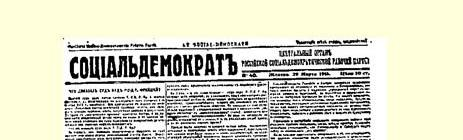
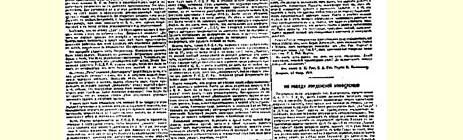
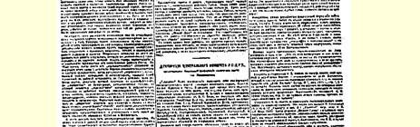
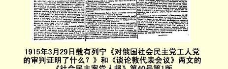

# 对俄国社会民主党工人党团的审判证明了什么？

> （１９１５年３月１６日〔２９日〕）

沙皇法庭对１９１４年１１月４日在彼得格勒近郊召开的代表会议上被捕的俄国社会民主党工人党团的５名成员和另外６名社会民主党党员的审判，已经结束了。他们都被判处终身流放。各合法报纸登载了审判报道，但那些使沙皇政府和爱国主义者不愉快的地方，全被书报检查机关删掉了。对“国内的敌人”的惩治进行得很迅速，在社会生活的表面，除一大群资产阶级沙文主义者的疯狂叫嚣和一小撮社会沙文主义者的随声附和之外，又什么也看不到、听不到了。

对俄国社会民主党工人党团的审判究竟证明了什么呢？

第一，它表明俄国革命社会民主党的这支先进部队在法庭上表现得不够坚强。当时被告的目的是使检察官查不出谁是俄国国内的中央委员，谁代表党同工人组织保持一定的联系。这个目的是达到了。今后，要达到这个目的，在法庭上也应当继续采用党早就正式提出的办法—— 拒绝招供。但是，象罗森费尔德同志那样竭力证明自己和社会爱国主义者约尔丹斯基先生意见一致，或者证明自己同中央委员会意见不合，这种做法是不正确的，从革命的社会民主党人的观点来说是不能容许的。

> １９１５年３月２９日载有列宁《对俄国社会民主党工人党团的审判
>
> 证明了什么？》和《谈伦敦代表会议》两文的
>
> 《社会民主党人报》第４０号第１版
>
> （按原版缩小）

必须指出，根据《日报》１７１（第４０号）登载的报告—— 正式的完整的审判报告没有发表—— 彼得罗夫斯基同志声明说：“我在同一时期（１１月）收到了中央委员会的决议……此外，我还收到７个地方的工人关于对待战争的态度的决议，**这些决议和中央委员会的态度是一致的**。”

这个声明使彼得罗夫斯基赢得了荣誉。当时周围沙文主义情绪非常强烈。难怪彼得罗夫斯基在日记中写道：**连**具有激进思想的齐赫泽也兴奋地谈到“解放”战争。俄国社会民主党工人党团代表在入狱之前曾反击过这种沙文主义，而在法庭上，他们也有责任同这种社会沙文主义划清界限。

立宪民主党的《言语报》１７２卑躬屈膝地“感谢”沙皇法庭，因为它“驱散了”社会民主党代表希望沙皇军队战败的“传说”。立宪民主党人利用俄国国内社会民主党人被捆住手脚的机会，假装着把党和党团之间的虚构的“冲突”当作真实的事情，硬说被告招供完全不是由于畏惧法官。多么天真幼稚的孩子啊！他们假装不知道， 在审判初期，代表们曾受到送交军事法庭和判处死刑的威胁。

这些同志在秘密组织问题上应当拒绝招供，他们应当懂得这是具有世界历史意义的时刻，要利用公开审判的机会毫不隐讳地阐明社会民主党的不但反对整个沙皇制度、而且反对形形色色的社会沙文主义的观点。

让政府和资产阶级的报刊疯狂地攻击俄国社会民主党工人党团吧！让社会革命党人、取消派和社会沙文主义者去幸灾乐祸地 “捕捉”弱点或虚构的“同中央委员会意见不合”的表现吧（既然他们不能同我们进行原则性的斗争，他们总得想个办法同我们作斗争！）。革命无产阶级的政党已相当强大，不怕公开进行自我批评， 坦率地说出自己的错误和弱点。俄国的觉悟工人已经建立了这样的政党，选拔出这样的先进部队，它们在世界大战和国际机会主义在全世界崩溃的时候表现出能执行国际的革命社会民主党人的职责。我们走过的道路已经经受了最严重的危机的考验，并且一次又一次地被证明，它是唯一正确的道路。我们将更加坚定地走这条道路，将不断选拔出新的先进部队，我们一定要使它们不仅进行这种活动，而且要更正确地把它进行到底。

第二，审判展现出国际社会主义运动中从来没有过的**革命的** 社会民主党利用议会制度的情景。这种利用的实例会比任何演说都更能打动无产阶级群众的心灵，会比任何论据都更有说服力地驳倒崇拜合法性的机会主义者和无政府主义空谈家。关于穆拉诺夫秘密活动的报告和彼得罗夫斯基的札记，将在很长时期内成为议会代表们从事**这样一项**活动的榜样，对这种活动我们曾不得不尽量秘而不宣，而现在，俄国的一切觉悟工人会愈来愈用心地加以思考这种活动的意义了。当欧洲“社会主义的”（请原谅我玷污了这个词！）议会代表几乎全都成为沙文主义者和沙文主义者的仆从的时候，当一度使我们的自由派和取消派神魂颠倒的出名的“欧洲主义”已经成为盲目崇拜合法性的一种麻木不仁的习惯的时候，在俄国却可以看到一个工人政党，这个党的议会代表最突出的地方，不是夸夸其谈，不是“出入”资产阶级的、知识分子的沙龙，不是耍“欧洲”律师和议员的老练的狡猾手腕，而是联系工人群众，在工人群众中忘我地工作，完成秘密宣传员和组织者平凡的、不显眼的、艰苦的、默默无闻的、特别危险的职责。向上爬，获得在“社会”上有地位的议员或部长的头衔，—— 这就是“欧洲的”（应读作：奴仆式的） “社会主义的”议会活动的**真正**含义。到下面去，帮助启发和团结被剥削者和被压迫者，—— 这就是穆拉诺夫和彼得罗夫斯基这样的榜样所提出的口号。

这个口号将来一定会具有世界历史意义。当所有先进国家内资产阶级议会制度所提供的合法性被一笔勾销，结果只剩下机会主义者和资产阶级最紧密的事实上的联盟的时候，世界上任何国家的任何一个有头脑的工人都不会老是满足于这种合法性了。谁幻想让革命社会民主党的工人同昨天的——** 也包括今天的**—— “欧洲”社会民主党的合法主义者“统一”，谁就是什么也没有学到， 而且忘记了一切，谁就在实际上成为资产阶级的盟友和无产阶级的敌人。谁如果到现在还不了解，为什么俄国社会民主党工人党团同对合法主义和机会主义抱调和态度的社会民主党党团分裂，那就请他读一读对穆拉诺夫和彼得罗夫斯基的活动的审判报道吧。 进行这种活动的**不只是**这两位代表，只有极端幼稚的人才会幻想， 在进行这种活动的同时，还能对《我们的曙光》杂志、《北方工人报》１７３、《同时代人》杂志、组织委员会、崩得等采取“友好宽容的态度”。

政府把俄国社会民主党工人党团成员流放到西伯利亚去，是想借此吓唬工人吗？它想错了。工人是吓不倒的，他们只会更清楚地理解自己的任务—— 与取消派和社会沙文主义者不同的工人政党的任务。工人们一定会学会把象俄国社会民主党工人党团成员这样的人选进杜马，让他们在群众中进行同样的活动，进行更广泛而又更**秘密**的活动。政府想扼杀俄国的“秘密的议会活动”吗？它只会**恰恰**加强无产阶级和这种议会活动的联系。

第三，—— 这也是最主要的一点，—— 对俄国社会民主党工人党团的审判，首次就俄国社会**各阶级**对战争的态度这个最重要、最基本、最本质的问题，提供了公开的、在俄国发行千百万份的客观的材料。难道知识分子的所谓“保卫祖国”与“原则性的”（应读作： 口头上的或虚伪的）国际主义可以并行不悖的那些极端令人厌烦的胡说还不够吗？难道现在还不该看一看那些涉及**各阶级**即千百万现实生活中的人而与一小撮说大话的英雄无关的**事实**吗？

战争已经进行半年多了。各种倾向的公开的和秘密的报刊都已发表了意见，杜马中的所有党派集团都已确定了自己的立场 —— 这是我们各阶级集团的很不完全的然而是唯一客观的标志。 对俄国社会民主党工人党团的审判及各种报刊的反应，总结了整个这份材料。审判证明，俄国无产阶级的先进代表不仅反对任何沙文主义，而且特别赞同我们中央机关报的立场。代表们是在１９１４ 年１１月４日被捕的。可见，他们已经进行了两个多月的活动。他们是和谁一道并且是采取什么方式进行活动的呢？他们反映和代表了工人阶级中的哪些派别呢？下列事实回答了这两个问题：“提纲”和《社会民主党人报》就是代表会议的材料，我们党的彼得堡委员会也不止一次印发过同样内容的传单。代表会议上没有其他材料。代表们没有准备向代表会议报告工人阶级中其他派别的情况， 因为不存在其他派别。

俄国社会民主党工人党团成员也许只代表了少数工人的意见吧？我们没有理由这样设想，因为从１９１２年春天到１９１４年秋天这两年半的时间里，俄国五分之四的觉悟工人都团结在《真理报》的周围，而这些代表是在思想上与《真理报》完全一致的情况下工作的。这是事实。如果工人对中央委员会的立场有什么比较大的异议的话，这种异议不会不反映在某个或某些决议草案中。法庭没有发现任何这样的情况，虽然它可以说是“发现了”俄国社会民主党工人党团活动中的许多情况。从彼得罗夫斯基亲笔修改的地方也看不出任何细小分歧。

事实说明，在战争爆发后的头几个月里，俄国工人的觉悟的先锋队**实际上**就已团结在中央委员会和中央机关报的周围。不管这个事实使某些“党团”多么不愉快，但这是无可置辩的事实。起诉书引用了这样一句话：“不应当把枪口对准自己的兄弟即别国的雇佣奴隶，而要对准各国反动的资产阶级政府和政党。”通过审判，这句话一定会把而且已经把实行无产阶级国际主义、进行无产阶级革命的号召传遍俄国。通过审判，俄国工人先锋队的这一阶级口号已经深入广大群众。

资产阶级和部分小资产阶级中普遍流行的沙文主义，另一部分小资产阶级的动摇不定，工人阶级的上述号召—— 这就是我国政治分野的客观实际情景。必须把自己的“展望”、希望和口号同这种实际情景结合起来，而不是把它们同知识分子和各种小团体的创立者的善良愿望结合起来。

真理派的报纸和“穆拉诺夫式”的活动，已使俄国五分之四的觉悟工人团结起来。约有４万工人购买《真理报》，而读《真理报》的工人就更多得多了。即使战争、牢狱、西伯利亚、苦役会夺去他们中间五分之四或十分之九的人，但要消灭这个阶层**是不可能的**。这个阶层生气勃勃，充满着革命精神和反沙文主义思想。只有这个阶层站在人民群众中间，扎根于群众之中，宣传被剥削被压迫的劳动者的国际主义。在四处出现土崩瓦解的情况下，只有这个阶层岿然屹立。只有这个阶层在领导半无产者阶层**脱离**立宪民主党人、劳动派分子、普列汉诺夫、《我们的曙光》杂志的社会沙文主义的影响而走向社会主义。对俄国社会民主党工人党团的审判，使整个俄国都看到了这个阶层的存在，看到了它的思想和活动，看到了它的“同别国雇佣奴隶兄弟般地团结起来”的呼吁。

必须对这个阶层进行工作，必须反对社会沙文主义以维护这个阶层的统一。俄国工人运动只有沿着这条道路才能走向社会革命，而不是走向“欧洲”式的民族自由主义。

> 载于１９１５年３月２９日《社会民主党人报》译自《列宁全集》俄文第５版第４０号第２６卷第１６８—１７６页