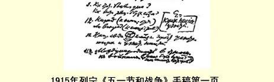

# 五一节和战争 １７８

> （不早于１９１５年４月１４日〔２７日〕）

### 引言 １．今年，国际无产阶级运动的游行示威，将在欧洲大战已经爆发的情况下举行。 ２．也许，在１９１５年，在“检阅自己的力量”这方面没有什么事情可做了吧？ 在对比“成就和失败”、对比无产阶级世界和资产阶级世界方面没有什么事情可做了吧？—— 因为表面现象＝一切都瓦解了。 ３．其实并不是这样。战争＝最大的危机。**任何**危机都意味着（尽管可能出现**暂时的**停滞和倒退）

（α）发展的加速

（γ）（β）矛盾的尖锐化

（β）（γ）矛盾的暴露

（δ）一切朽物的崩溃，等等。

所以一定要从这个角度来看待这次危机（在五一节），看它是

> １９１５年列宁《五一节和战争》手稿第１页
>
> （按原稿缩小） 不是包含任何危机所包含的那些进步的和有益的因素。

### 资产阶级民族祖国的破产 ４．“保卫祖国”和战争的真正性质。实质是什么？民族主义与帝国主义对比。 ５．１７８９—１８７１年（将近１００年）…… 和１９０５年—？ ６．“保卫祖国”（比利时？加里西亚？为了瓜分奴隶主的赃物）与“打破国界”对比。民族祖国的破产？

活该如此！！ ７．老的和新的帝国主义——***罗马***和***英国***与***德国*对比**。

掠夺领土

殖民地

瓜分世界

资本输出 ８．社会主义的客观条件的成熟。 ９．怎样维持原状？ 怎样进行争取社会主义的革命斗争？ １０．民族自由**与**帝国主义**对比**。压迫民族和被压迫民族的无产阶级。 １１．在对待各次战争的态度上的“国际观点”。（（“什么样的资产阶级较好”？或者是无产阶级的独立行动？）） １２．是后退（退到民族祖国）还是前   结果＝ 进（进到社会主义革命）。民族狭隘观点的破产。

## 正式的社会民主党的破产 １３．所有的人都感觉到（如果不是认识到的话）工人运动史上的转折点。国际的危机和破产。问题在哪里？过去国际是统一的还是具有两种倾向？ １４．主要国家工人运动内部对战争的态度概述：

德国：８月４日与博尔夏特１７９和《**国际**》杂志１８０对比

英国：

法国：（盖得＋桑巴与梅尔黑姆对比）

俄国。

意大利

瑞 士  实际上到处都有两派

瑞 典 １５．实质是什么？比较英国和德国的工人运动＝

### 工人运动中的资产阶级倾向和影响。 １６．反对机会主义的１５年斗争和机会主义在西欧的发展。机会主义的破产对工人运动有好处。 （（盖得—海德门—考茨基—普列汉诺夫。）） １７．正式的马克思主义的危机（１８９５—１９１５年）。

不是要让死尸复活，而是要发展革命的马克思主义来反

对机会主义的“冒牌马克思主义”。 １８．马克思主义与司徒卢威主义１８１对比……

辩证法与折中主义对比…… １９．被扯破的旗帜？ （幻相的破灭）  开姆尼茨１９１０年１８２

斯图加特１９０７年

巴塞尔１９１２年 ２０．**除了**革命行动**以外**的“一切可能性”。 ２１．无政府主义＝机会主义（小资产阶级的）。

**《工团战斗报》１８３**

科尔纳利森

格拉弗

克鲁泡特金 ２２．德国社会民主党的退位。

> **无用的**组织被破坏了，或者，更确切些说，死亡了—— 为更好的组织扫清基地。

“过分成熟”（不是无产阶级还没有成熟）：同１９０７年比较。

## 小资产阶级对资本主义的幻觉的破灭 ２３．战争或者被说成是一项全民族的事业，或者被说成是不正常现象，是对“和平的”资本主义的破坏，等等。

这两种幻觉都是有害的。战争正在使这两种幻觉破灭。 ２４．战时的“国内和平”、“举国联合”、“神圣同盟”？？ ２５．战争是“可怕的”事情吗？是的。但它又是***可以获得***骇人听闻的 ***利润的***事情。

１６００亿卢布＞６００亿卢布。

> **剩余价值＝１００—２００亿**卢布。 ２６．使工业“适应”战争条件。

（破产。迅速积聚。） ２７．战争和资本主义的基础。

是“和平的民主主义”、“文化”、“法制”等与战争的惨祸对

比吗？？

不正确。

>

> ***私有制和交换***。
>
> **使一些人破产的保证**，**暴力的保证和基础**。 ２８．殖民地和租让。

“诚实的承租人”？

“人道的”殖民者？ ２９．战争＝可以获得骇人听闻的利润的事情

＝资本主义直接的、必然的产物。 ３０．上述有害的幻觉只会阻碍反对资本主义的斗争。

## 和平主义幻想的破灭 ３１．**·没*有***帝国主义的资本主义？

（向后看？） ３２．从理论上（抽象地）说，没有殖民地等也是可能的。 ３３．就象四小时工作制也是可能的一样，最少３０００工人…… ***附于*３３**。“在充分的贸易自由的条件下，资本主义**可以没有**帝国主

义，没有战争，没有殖民地而得到发展。”

是这样吗？

> 资本主义**可以**不把亿万金钱用在战争上，而用来帮助贫

民和工人，从而使资本家阶级的统治永世长存！

理论上相同的命题。“工人阶级的强制性的压力和资产

者的人道措施。”问题的实质就在于：对这些东西不能靠**一般**

**的**压力加以强制，需要的是有真正的革命这种***压力***。而革命

和反革命势必使斗争激化到触及更本质的东西。

问题被归结为争取改良的斗争。这个斗争在一定的限度

内是合理的和需要的，这个限度就是：（１）还不具备革命的形

势；（２）局部性的改善，阶级斗争没有尖锐到引起革命的程

度。 ３４．由于什么？由于战争的惨祸？（那么，骇人听闻的利润呢？） 由于无产阶级的压力？

（那么，机会主义的背叛呢？） ３５．没有兼并的和约，裁军，等等、等等。“取消秘密外交”？

（（费尔巴哈：宗教可以安慰人注意［《民权报》对

客观上的作用：***牧师的安慰***“乌托邦还是地狱”？

们。有用吗？））。 **福雷尔**的评论］ ３６．争取改良的斗争？

是的。—— 它的限度。

局部的。

> 改良的时代，***不具备*革命的形势**。
>
> **关键在这里**。

## 幻觉破灭的结果

３７．革命的形势

（α）下层不愿，上层不能

（β）灾难加剧

（γ）异乎寻常的积极性。 ３８．发展的缓慢性和曲折性。

对比１９００年与１９０５年。 ３９．资本家的掠夺和政府的欺骗？“军事奴役制” ４０．战争和技术的奇迹？ ４１．战争和重新组合。

（工人与农民对比） ４２．三种心理

（α）绝望和宗教

（β）仇恨敌人

> （γ）不仅一般地仇恨资本主义，而且仇恨***自己的***政府和资

产阶级。 ４３．“加邦请愿事件”１８４。 ４４．信：“准备吹口哨”

“同志们” ４５．每次危机都使一些人消沉，***使***另一些人***得到锻炼***。 ４６．锻炼——** 为了**社会主义革命

总结＝

工人运动中有害的腐朽的东西的崩溃＝革命斗争的障碍的消

除。 资本家的利润 **顺便提一下**。德国的１００亿公债。公债的利息是５％。政府作了如

下安排：**储蓄**银行（为了认购这项公债）从**信贷**银行（Ｄａｒｌｅ－

ｈｅｎｓｋａｓｓｅｎ）得到钱，付给它们５．２５％的利息。而政府又把钱

给信贷银行！！欺骗。

> １９１５年４月２７日**《*民权报*》**（苏黎世）１８５。 “善良的”空想的荒谬性：取消秘密外交—— 将说出战争的目的

—— 没有兼并的和约，等等、等等。感伤主义的和反动的胡

言乱语。 老的民族（相应的是资产阶级国家）**与**“打破国界”**对比**！ 俄国的经验：１９００年**与**１９０５年**对比**。

打倒专制制度（１９００年）和“人民”……

革命口号和革命运动的发展……

> 载于１９２９年《无产阶级革命》杂志译自《列宁全集》俄文第５版第１期第２６卷第３７２—３８０页