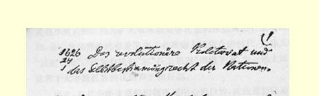
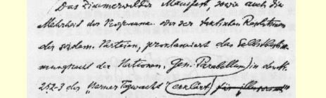
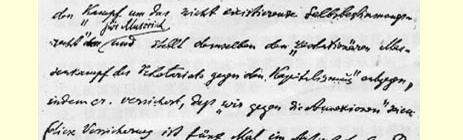
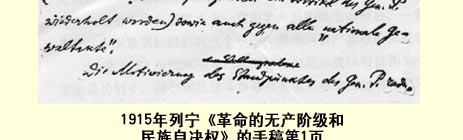

# 革命的无产阶级和民族自决权 ６４

> （１９１５年１０月１６日〔２９日〕以后）

齐美尔瓦尔德宣言也同社会民主党大多数纲领或策略决议一样，宣布了“民族自决权”。巴拉贝伦在《伯尔尼哨兵报》第２５２— ２５３号合刊上却把“争取并不存在的自决权的斗争”说成是“虚幻的” 斗争，并**把**“无产阶级反对资本主义的群众革命斗争” 同这种斗争**对立起来**，同时他**担保说**，“我们反对兼并”（巴拉贝伦的这个担保在他的文章中重复达**五**次之多），反对对各民族施加任何暴力。

巴拉贝伦持这种立场的理由是：现时的所有民族问题，如阿尔萨斯－洛林问题、亚美尼亚问题等，都是帝国主义问题；资本的发展已超出了民族国家的范围；不能把“历史的车轮倒转过来”，退向民族国家这种过了时的理想等等。

让我们来看看巴拉贝伦的论断对不对。

首先，向后看而不向前看的正是巴拉贝伦自己。因为他反对工人阶级接受“民族国家的理想” 时，目光只是停留在英国、法国、意大利、德国，即民族解放运动已成为过去的国家，而没有投向东方，投向亚洲、非洲，没有投向民族解放运动方兴未艾或终将兴起的殖民地。这方面只要举印度、中国、波斯、埃及为例就够了。

其次，帝国主义意味着资本的发展超出了民族国家的范围，意味着民族压迫在新的历史基础上的扩大和加剧。由此得出的结论与巴拉贝伦的正好相反：我们应当**把**争取社会主义的革命斗争同民族问题的革命纲领**联系起来**。

照巴拉贝伦说来，他是**为了**社会主义革命，才以轻蔑的态度抛弃民主制方面的彻底革命的纲领的。这是不对的。无产阶级只有通过民主制，就是说，只有充分实现民主，把最彻底的民主要求同自己的每一步斗争联系起来，才能获得胜利。把社会主义革命和反对资本主义的革命斗争同民主问题**之一**（在这里是民族问题）**对立起来**是荒谬的。我们应当把反对资本主义的革命斗争同实现一切民主要求的革命纲领和革命策略**结合起来**；这些民主要求就是：建立共和国，实行民兵制，人民选举官吏，男女平等，民族自决等等。 只要存在着资本主义，所有这些要求的实现只能作为一种例外，而且只能表现为某种不充分的、被扭曲的形式。我们在依靠已经实现的民主制、揭露它在资本主义制度下的不彻底性的同时，要求推翻资本主义，剥夺资产阶级，因为这是消灭群众贫困和**充分地**、**全面地**实行**一切**民主改革的必要基础。在这些改革中，有一些将在推翻资产阶级以前就开始，有一些要**在**推翻资产阶级**过程中**实行，还有一些则要在推翻资产阶级以后实行。社会革命不是一次会战，而是在经济改革和民主改革的所有一切问题上进行一系列会战的整整一个时代。这些改革只有通过剥夺资产阶级才能完成。正是为了这个最终目的，我们应当用彻底革命的方式表述我们的**每一项**民主要求。某一个国家的工人**在**一项基本的民主改革都未充分实现 **以前**就推翻资产阶级，这是完全可以设想的。但是，无产阶级作为一个历史阶级，如果不经过最彻底和最坚决的革命民主主义的训练而要战胜资产阶级，却是根本不可设想的。

帝国主义是极少数大国对世界各民族的愈来愈厉害的压迫，

> １９１５年列宁《革命的无产阶级和民族自决权》手稿第１页
>
> （按原稿缩小） 是极少数大国之间为扩大和巩固对各民族的压迫而进行战争的时代，是一些伪善的社会爱国主义者欺骗人民群众的时代，这些人 **在**“民族自由”、“民族自决权” 和“保卫祖国”** 的幌子下**，为一些大国对世界上大多数民族的压迫辩护和开脱。

因此，在社会民主党的纲领中居中心地位的，应当是把民族区分为压迫民族和被压迫民族。这正是帝国主义的**本质**所在，正是社会沙文主义者和考茨基**用谎言**加以回避的东西。从资产阶级的和平主义或小市民的空想的观点，即认为各独立民族在资本主义制度下可以和平竞争的观点看来，这种区分是无关紧要的，但是从反对帝国主义的革命斗争的观点看来，它恰恰是至关重要的。根据这个区分应当得出**我们**对“民族自决权”的彻底民主主义的、革命的、 同为社会主义而立即斗争的总任务**相适应**的定义。为了这种权利， 为了真正承认这种权利，压迫民族的社会民主党人应当提出被压迫民族有分离的自由这一要求，否则，所谓承认民族平等和工人的国际团结，实际上就只能是一句空话，只能是一种欺人之谈。被压迫民族的社会民主党人则应当把被压迫民族的工人同压迫民族的工人的团结一致和打成一片摆到首位，否则，这些社会民主党人就会不由自主地成为**一贯**出卖人民和民主的利益、**一贯**准备兼并和压迫其他民族的这个或那个民族的**资产阶级**的同盟者。

１９世纪６０年代末期某些人对民族问题的提法可以作为一个有教益的例子。同任何阶级斗争和社会主义革命的思想格格不入的小资产阶级民主派，为自己描绘了自由平等的民族在资本主义制度下和平竞争的乌托邦。蒲鲁东主义者从社会革命的直接任务出发，根本“否认” 民族问题和民族自决权。马克思嘲笑了法国的蒲鲁东主义，指出了它同法国沙文主义的血缘关系（“整个欧洲都可以而且应当安静地坐在那里等待法国老爷们来消灭贫穷”[^1]……“他们大概是完全不自觉地把否定民族特性理解为由模范的法国民族来吞并各个民族了”[^2]）。马克思曾要求**爱尔兰**从英国**分离**，“即使分离以后还会成立联邦”[^3]。他提出这个要求不是从小资产阶级的和平资本主义的空想出发，不是要“替爱尔兰主持公道”[^4]，而是从**压迫民族即英吉利民族的**无产阶级反对资本主义的革命斗争的利益出发的。这个民族对另一个民族的压迫，限制和损害了**这个**民族的自由。如果**英国**无产阶级不提出爱尔兰有分离的自由这个要求，那**它的**国际主义就不过是伪善的言词。马克思从来不主张建立小国，不笼统主张国家分裂，也不赞成联邦制原则，他认为被压迫民族的分离是走向联邦制的一个步骤，因此不是走向分裂，而是走向政治上和经济上集中的一个步骤，但这是在民主主义基础上的集中。在巴拉贝伦看来，马克思提出爱尔兰分离这个要求，想必是在进行“虚幻的斗争”。而事实上**只有**这种要求才是彻底的革命纲领，只有这种要求才符合国际主义，只有这种要求所维护的集中才**不是**帝国主义**性质**的集中。

当今的帝国主义使大国压迫其他民族成为普遍现象。在大国民族为了巩固对其他民族的压迫而进行帝国主义战争，压迫世界上大多数民族和全球大多数居民的今天，唯有同大国民族的社会沙文主义进行斗争的观点应当成为社会民主党民族纲领中决定性的、主要的、基本的观点。

请看一看社会民主党目前在这个问题上的各种思想派别吧。 梦想在资本主义制度下实现民族平等和民族和平的小资产阶级空想主义者已让位于社会帝国主义者。巴拉贝伦犹如同风车搏斗６５ 一样地同前者搏斗，结果不由自主地为后者效了劳。社会沙文主义者在民族问题上的纲领是怎样的呢？

他们或者引用类似巴拉贝伦那样的论据来根本否定民族自决权（如库诺、帕尔乌斯和俄国的机会主义者谢姆柯夫斯基、李普曼等人）；或者显然伪善地承认这种权利，就是说恰恰不把它应用于受他们本民族或本民族的军事盟国压迫的那些民族（如普列汉诺夫、海德门、所有亲法爱国主义者以及谢德曼等等）。考茨基的社会沙文主义谎言说得最漂亮，因而对无产阶级也最危险。口头上他**拥护**民族自决，口头上他主张社会民主党“全面地〈！！〉和无条件地 〈？？〉尊重和捍卫民族独立”（《新时代》杂志第３３年卷第２册第 ２４１页；１９１５年５月２１日）。而**实际上**他使民族纲领顺应占统治地位的社会沙文主义，歪曲和删减民族纲领，不去确切地规定压迫民族的社会党人的责任，甚至公然伪造民主原则，说什么为每个民族要求“国家独立”（ｓｔａａｔｌｉｃｈｅ Ｓｅｌｂｓｔａｎｄｉｇｋｅｉｔ）是“非分的”（“ｚｕ ｖｉｅｌ”）（《新时代》杂志第３３年卷第２册第７７页；１９１５年４月１６ 日）。请看，“民族自治”就够了！！恰恰是帝国主义资产阶级不允许涉及的那个主要问题，即建立在民族压迫之上的**国家疆界**问题，考茨基回避了，他为了讨好帝国主义资产阶级而把最本质的东西从纲领中一笔勾销。资产阶级对什么样的“民族平等”和什么样的“民族自治”都可以允诺，只要无产阶级能够在合法的范围内活动并在国家**疆界**问题上“乖乖地”听命于它就行！考茨基是用改良主义的方式而不是用革命的方式表述社会民主党的民族纲领的。

对于巴拉贝伦的民族纲领，更确切些说，对于他的“我们反对兼并”的**担保**，德国社会民主党执行委员会、考茨基和普列汉诺夫及其一伙都举双手赞成，因为这个纲领并没有揭露居统治地位的社会爱国主义者。就连资产阶级和平主义者也会赞成这个纲领的。 巴拉贝伦的漂亮的**总**纲领（“反对资本主义的群众革命斗争”）对他来说，也象对６０年代的蒲鲁东主义者那样，并不是为了依照这个纲领，根据它的精神来制定一个毫不妥协的、彻底革命的民族问题纲领，而是为了在这个问题上替社会爱国主义者扫清道路。在我们所处的帝国主义时代，世界上大多数社会党人属于压迫其他民族并力求扩大这种压迫的民族。因此，如果我们不公开宣布：一个压迫民族的社会党人，无论在和平时期还是在战争时期，不宣传被压迫民族有分离的自由，那他就不是社会主义者，不是国际主义者， 而是沙文主义者！一个压迫民族的社会党人如果不违反政府禁令， 也就是说在不经书报检查的即秘密的报刊上进行这种宣传，那么他所谓的拥护民族平等就只能是伪善的！—— 如果我们不这样宣布的话，那我们的“反对兼并的斗争”将始终是一种毫无内容的、社会爱国主义者毫不感到可怕的斗争。

对于尚未完成资产阶级民主革命的俄国，巴拉贝伦只说了下面一段话：

“就连经济非常落后的俄国也通过波兰、拉脱维亚和亚美尼亚的资产阶级的行为表明，把各族人民拘禁在这个‘各族人民的牢狱’中的不仅有武装的卫兵，而且还有资本主义扩张的需要，因为对它来说，广大的领土是它借以发展的沃土。”

这不是“社会民主党的观点”，而是自由派资产阶级的观点，不是国际主义的观点，而是大俄罗斯沙文主义的观点。巴拉贝伦虽然同德国社会爱国主义者卓越地进行了斗争，但是看来他对大俄罗斯沙文主义却很不了解。为了从巴拉贝伦这段话中得出社会民主党的原理和社会民主党的结论，应该把这段话修改和补充如下：

俄国是各族人民的牢狱，这不仅是因为沙皇制度具有军事封建性质，不仅是因为大俄罗斯资产阶级支持沙皇制度，而且还因为波兰等民族的资产阶级为了资本主义扩张的利益而牺牲民族自由和整个民主制度。俄国无产阶级若不在现时就彻底地和“无条件地”要求让一切受沙皇制度压迫的民族有从俄罗斯分离的自由，那它就不能领导人民进行胜利的民主革命（这是它的最近任务），也不能同欧洲的兄弟无产者一道为社会主义革命而斗争。我们并不是脱离我们争取社会主义的革命斗争来提这个要求的，而是因为不把这个斗争同所有民主问题，其中包括民族问题的革命提法联系和结合起来，这个斗争就始终只能是一句空话。我们要求民族有自决的自由，**即**独立的自由，**即**被压迫民族有分离的自由，并不是因为我们想实行经济上的分裂，或者想实现建立小国的理想，相反，是因为我们想建立大国，想使各民族接近乃至融合，但是这要在真正民主和真正国际主义的基础上实现；没有分离的自由，这是 **不可想象的**。马克思在１８６９年要求爱尔兰分离，并不是为了制造分裂，而是为了将来爱尔兰能同英国自由结盟，不是“替爱尔兰主持公道”，而是为了英国无产阶级革命斗争的利益；同样，我们认为，俄国社会党人拒绝要求上述意义上的民族自决的自由，那就是对民主主义、国际主义和社会主义的直接背叛。

> 载于１９２７年《列宁文集》俄文版译自《列宁全集》俄文第５版第６卷第２７卷第６１—６８页

[^1]: 见《马克思恩格斯全集》第３１卷第２２４页。—— 编者注

[^2]: 同上，第２３１页。—— 编者注

[^3]: 同上，第３８１页。—— 编者注

[^4]: 同上，第３２卷第３９８页。—— 编者注