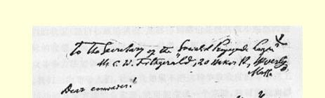
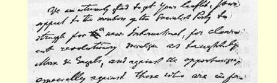
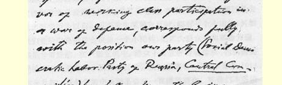
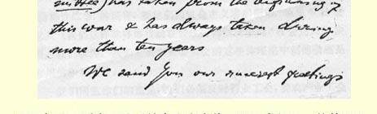
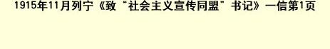

# 致“社会主义宣传同盟”书记 ６６

> （１９１５年１０月３１日和１１月９日〔１１月１３日和２２日〕之间） 亲爱的同志们：

收到你们的传单我们非常高兴。你们号召社会党的党员进行斗争，争取建立新的国际，实现马克思和恩格斯所教导的真正革命的社会主义，反对机会主义，尤其是反对那些主张工人阶级参加防御性战争的人，这完全符合我们党（俄国社会民主工党，**中央委员会**）在这场战争一开始就采取的和１０多年来一直坚持的立场。

我们向你们致以最诚挚的敬礼，并衷心祝愿我们维护真正国际主义的共同斗争获得成功。

在我们的报刊和宣传中，我们在某几点上同你们的纲领存在着分歧。我们认为完全有必要向你们扼要指出这些分歧，以便立即采取认真的步骤，使各国不同意妥协的革命社会党人特别是马克思主义者的国际斗争能够协调一致。

我们最严厉地批评旧的国际即第二国际（１８８９—１９１４年），我们宣布它已经死亡，而且不值得在旧的基础上恢复它。但是我们在自己的报刊上从来没有讲过：到目前为止对所谓“眼前要求”注意过多了，这样会阉割社会主义。我们断言并且证明，一切资产阶级政党，除工人阶级革命政党以外的一切政党，在谈论改良的时候， 都是在撒谎，都是假仁假义。我们在竭力帮助工人阶级，争取使他

> １９１５年１１月列宁《致“社会主义宣传同盟”书记》一信第１页
>
> （按原稿缩小） 们的状况（经济和政治状况）能够得到哪怕是极其微小的然而是实际的改善。而与此同时我们一向说，**任何**改良，如果没有革命的群众斗争方法加以支持，都不可能是持久的、真正的、认真的改良。我们一向劝导人们：社会党如果不把这种争取改良的斗争同工人运动的革命方法结合起来，就可能变成一个宗派，就可能脱离群众， 对于真正革命的社会主义运动的成功来说，这是一个最严重的威胁。

我们在自己的报刊上一向维护党内民主。但是我们从未反对过党的集中。我们主张民主集中制。我们说，德国工人运动的集中， 并不是它的一个弱点，而是它的一个强处，一个优点。现时德国社会民主党的弊病不在于集中，而在于机会主义者占优势；应该把这些机会主义者开除出党，尤其是现在，当他们在战争时期已经表现出叛变行为以后。每当发生某种危机时，能有一个小团体（例如我们党的中央委员会就是一个小团体）把广大群众引**向革命方面**，那是非常好的。在**一切**危机中，群众不会直接行动起来，他们需要党的中央机关这类小团体的帮助。从这场战争一开始，即从１９１４年 ９月起，我们党的中央委员会就一直诱导群众，要他们不听信“防御性战争”的谎言，要他们同机会主义者和所谓“琼果６７社会党人” （我们这样称呼那些**现在**赞成防御性战争的“社会党人”）决裂。我们认为，我们党的中央委员会的这些体现集中制的措施是有用的和必要的。

我们同意你们的意见：我们必须反对行业工会，赞成产业工会即集中的大工会，我们必须使**全体**党员最积极地参加经济斗争和工人阶级的**一切**工会组织和合作社组织。但是我们认为，象德国的列金先生和美国的龚帕斯先生这样的人物都是资产者，他们的政策不是社会主义的政策，而是民族主义的资产阶级政策。列金先生、龚帕斯先生以及象他们这一类的人物，并不是工人阶级的代表，他们代表的只是工人阶级中的贵族和官僚。

在发动政治行动时，你们要求工人举行“群众性行动”，这我们完全赞同。德国革命的国际主义派社会党人也是这样要求的。我们在自己的报刊中力求较详细地阐明，究竟应当怎样理解这样一些群众性政治行动，例如政治罢工（这在俄国是很常见的）、街头游行示威以及当前这场各国间的帝国主义战争在为之作准备的国内战争。

我们并不鼓吹在**当前的**（在第二国际中占优势的）各社会党内部讲统一。相反，我们坚持同机会主义者**决裂**。战争是一堂极好的直观教育课。现时在**一切**国家中，机会主义者；他们的领袖，他们最有影响的报纸和杂志，都**拥护**战争，换句话说，他们事实上已经同 “他们”本国的资产阶级（即中产阶级，资本家）**联合起来**反对无产阶级群众。你们说，在美国也有为防御性战争辩护的社会党人。我们坚决认为，同这样的人联合就是犯罪。实行**这样的**联合就是同本国的中产阶级和资本家联合，而同国际的革命工人阶级**决裂**。我们主张的是同民族主义的机会主义者决裂，而同国际的革命马克思主义者和工人阶级的政党联合。

我们在自己的报刊上从未反对过美国的社会党和社会主义工人党６８（Ｓ．Ｐ．ａｎｄ Ｓ．Ｌ．Ｐ．）实行联合。我们经常引用马克思和恩格斯一些信件（特别是写给美国社会主义运动积极的一员左尔格的信）[^1]，在这些信中，他们都谴责了社会主义工人党（Ｓ．Ｌ．Ｐ．）的宗派主义性质。

我们完全同意你们对旧国际的批评。我们参加了１９１５年９月 ５—８日举行的齐美尔瓦尔德（瑞士）代表会议。我们在那里组成了一个**左翼**，还提出了**我们的决议案**和宣言草案。不久前我们用德文公布了这些文件，现在我把这些文件连同我们的《社会主义与战争》这本小册子的德文译本一并寄给你们，希望你们的联盟里有懂德文的同志。如果你们能帮助我们把这些东西用英文出版的话（只能在美国出版，然后我们再把它们送到英国），我们是很乐意接受你们的帮助的。

在我们维护真正的国际主义和反对“琼果社会主义”的斗争中，我们在自己的报刊上经常举美国社会党（Ｓ．Ｐ．）内的机会主义领袖作为例子，因为他们赞成限制中国工人和日本工人入境（特别是在１９０７年斯图加特代表大会以后，**违反**大会的决定６９）。我们认为，做一个国际主义者，同赞成这种限制，是不能兼容的。我们可以断定，如果美国的和特别是英国的那些属于统治民族和**压迫**民族的社会党人不反对任何入境限制，不反对占有殖民地（如夏威夷群岛），不主张殖民地完全独立，那么，这样的社会党人实际上就是 “琼果”社会党人。

最后，我再一次向你们联盟致以最崇高的敬礼和最良好的祝愿。如果今后能继续从你们那里得到信息，如果能把我们反对机会主义、维护真正国际主义的斗争**联合起来**，我们将感到十分高兴。

### 你们的尼·列宁

请注意：俄国有**两个**社会民主党。我们的党（“**中央**委员会”）是反对机会主义的。另一个党（“**组织**委员会”）是机会主义的。我们 **反对**同它联合。

来信可写我们机关的地址：瑞士**日内瓦**雨果·德·桑热街７ 号俄国图书馆交中央委员会。但是最好写我个人的地址：瑞士**伯尔尼**（）赛登路４ａ号**弗拉·乌里扬诺夫**。

> 载于１９２４年《列宁文集》俄文版译自《列宁全集》英文版第２１卷第２卷第４２３—４２８页

[^1]: 见《马克思恩格斯全集》第３６卷第５７４—５７７页，第３７卷第３１４—３１８、３３７—３３９页。—— 编者注