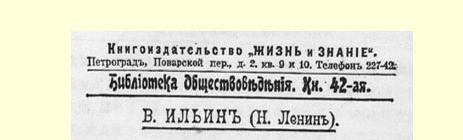
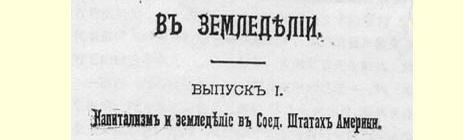

# 关于农业中资本主义发展规律的新材料

> 第 一 编
>
> 美国的资本主义和农业１００
>
> （不晚于１９１５年１２月２９日〔１９１６年１月６日〕）

这个最新资本主义的先进国家，对于研究现代农业的社会经济结构和演进来说，是一个特别令人感兴趣的国家。无论就１９世纪末和２０世纪初资本主义的发展速度来说，还是就资本主义发展已经达到的最高程度来说，无论就根据各种不同的自然和历史条件采用最新科学技术的土地面积的广大来说，还是就人民群众的政治自由和文化水平来说，美国都是举世无双的。这个国家在很多方面都是我们的资产阶级文明的榜样和理想。

研究美国农业演进的形式和规律也是比较方便的，因为美国每１０年进行一次人口普查（“ｃｅｎｓｕｓ”），对所有工农业企业也连带作极其详尽的调查。这就提供了世界上任何一个国家都没有的确切而丰富的材料，使我们有可能用来检验许多流行的论断，这些论断在理论上多半是草率的，传播的往往是资产阶级的观点和偏见， 可是人们总是不加批判地加以重复。

吉姆美尔先生在１９１３年《箴言》杂志１０１６月号上引用了最近

> １９１７年列宁《关于农业中资本主义发展规律的新材料。
>
> 第一篇。美国的资本主义和农业》一书封面
>
> （按原版缩小） 一次即１９１０年进行的第１３次人口普查中的一些材料，并据此一再重复了最流行的、在理论基础和政治意义上都是十足资产阶级的论断，说什么“美国大多数农场都是**劳动**农场”；“在比较发达的地区，农业资本主义正在解体”；在“全国绝大多数地方”，“小劳动农业正在扩大自己的统治范围”；正是“在文化较悠久、经济发达程度较高的地区”，“资本主义农业日益瓦解，生产正变得分散而零碎”；“没有一个地区的垦殖开发过程已经停止，没有一个地区的大资本主义农业不在解体并被劳动农业所排挤”，等等，等等。

所有这些论断都错得离奇。它们同实际情形正好相反，完全是对实际情况的嘲弄。对于这些论断的错误应当详细加以剖析，因为吉姆美尔先生并不是偶尔在杂志上写点小文章的等闲之辈，而是代表俄国和欧洲社会思想界中最民主、最左的资产阶级派别的最有名的经济学家之一。唯其如此，吉姆美尔先生的观点就有可能 —— 而在一部分非无产阶级居民阶层中则已经—— 广泛流传并产生影响。因为这不是他个人的观点，个人的错误，而是表述了用民主主义精心润色过的、用貌似社会主义的词句精心粉饰过的**一般** 资产阶级观点。在资本主义社会的环境中，无论是只知走老路的御用教授，或是千百万小农中觉悟较高的小农，都最容易附和这种观点。

吉姆美尔先生所捍卫的资本主义社会中农业的非资本主义演进理论，实质上是绝大多数资产阶级教授、资产阶级民主派和世界工人运动中的机会主义者即最新的一种资产阶级民主派的理论。 说这种理论是整个资产阶级社会的一种幻觉、梦想和自我欺骗，是并不过分的。我在下文中将尽力提供美国农业资本主义的全貌以推翻这一理论，因为资产阶级经济学家的一个主要错误，就是把各种大大小小的个别的事实和数字同政治经济关系的总联系割裂开来。我所引用的材料全部取自北美合众国官方出版的统计资料；首先是１９００年第１２次人口普查和１９１０年第１３次人口普查中有关农业的**第５**卷[^1]；其次是１９１１年的《统计汇编》（Ｓｔａｔｉｓｔｉ－ｃａｌＡｈ ｓｔｒａｃｔｏｆｔｈｅＵｎｉｔｅｄＳｔａｔｅｓ）。指出了这些资料来源，我就不再一一标出每一个数字的页码和统计表的序号了，那样会加重读者的负担，毫无必要地增加篇幅；有兴趣的人可以按照上面列举的出版物的目录毫不费力地找到相应的材料。

## １．三个主要地区概述。垦殖开发中的西部和移民宅地

美国幅员辽阔（面积仅略小于整个欧洲），全国各地经济条件千差万别，因此，对经济状况十分不同的各个主要地区必须分别进行考察。美国的统计学家在１９００年把全国划分为５个地区，在 １９１０年又划分为以下９个地区：（１）新英格兰，即大西洋岸东北部的６个州（缅因、新罕布什尔、佛蒙特、马萨诸塞、罗得岛、康涅狄格）。（２）大西洋岸中部各州（纽约、新泽西、宾夕法尼亚）；这两个地区在１９００年合称“大西洋岸北部”区。（３）中部东北各州（俄亥俄、 印第安纳、伊利诺伊、密歇根、威斯康星）。（４）中部西北各州（明尼苏达、艾奥瓦、密苏里、北达科他、南达科他、内布拉斯加、堪萨斯）； 这两个地区在１９００年合称“中北”区。（５）大西洋岸南部各州（特拉华、马里兰、哥伦比亚特区、弗吉尼亚、西弗吉尼亚、北卡罗来纳、南卡罗来纳、佐治亚、佛罗里达）；这个地区同１９００年的一样。（６）中部东南各州（肯塔基、田纳西、亚拉巴马、密西西比）。（７）中部西南各州（阿肯色、俄克拉何马、路易斯安那、得克萨斯）；这两个地区在 １９００年合称“中南”区。（８）山区各州（蒙大拿、爱达荷、怀俄明、科罗拉多、新墨西哥、亚利桑那、犹他、内华达）。（９）太平洋岸各州（华盛顿、俄勒冈、加利福尼亚）；这两个地区在１９００年合称“西部”区。

这种划分过于复杂，因此美国的统计学家在１９１０年又把它合并为三个大区：北部（１—４）、南部（５—７）和西部（８—９）。我们下面就会看到，这样划成三大地区是极其重要的，非常必需的，当然，在这里也象在其他任何情况下一样，存在着过渡类型，而且在某些基本问题上，还必须把新英格兰和大西洋岸中部各州单独列出。

为了明确这三大地区最根本的差别，我们可以称它们为：**工业的**北部、**原先蓄奴的**南部和**垦殖开发中的**西部。

下面是一份关于土地面积、耕地比例和人口的材料：

> 全部土地面积其中耕地的人口（１９１０年，
>
> 地 区（单位百万英亩）百分比单位百万）
>
> 北部…………５８８４９％５６
>
> 南部…………５６２２７％２９
>
> 西部…………７５３５％７
>
> 全美国………１９０３２５％９２

北部和南部的土地面积大致相等，西部则几乎比它们大一半。 但是北部的人口比西部多７倍。西部可以说几乎渺无人烟。至于西部的人口在以怎样的速度增长，可以从下面的数字看出来：从 １９００年到１９１０年这１０年间，北部的人口增加了１８％，南部增加了２０％，而西部竟增加了６７％！北部的农场数几乎毫无增加：１９００ 年是２８７４０００个，１９１０年是２８９１０００个，（＋０．６％）；南部增加了 １８％，从２６０万个增加到３１０万个；而西部却增加了５４％，即增加了一半以上，从２４３０００个增加到３７３０００个。

西部的土地占有形式怎样，这可以从**移民宅地**的材料看出来。 移民宅地是指由政府无偿分发的或者说只是名义上收点费用的地块，一般有１６０英亩，即约等于６５俄亩。从１９０１年至１９１０年这１０ 年间，在北部，有主的移民宅地面积为５５３０万英亩（其中５４３０万英亩即９８％以上集中在中部西北区）；在南部为２０００万英亩（其中１７３０万英亩集中在中部西南区）；在西部为５５３０万英亩，分布于西部的两个地区。这就是说，西部整个是一个移民宅地的地区， 全是无偿分发的无主的土地，这和俄国边远地区的强占土地类似， 不过不是由农奴制的国家来调整，而是通过民主的办法加以调整 （我险些说成通过民粹派的办法；共和制的美国用资本主义的方法实现了“民粹主义的”思想—— 把无主的土地分发给每一个想要土地的人）。北部和南部都只有一个移民宅地地区，它们好象是由渺无人烟的西部到人烟稠密的北部和南部的一个过渡类型。顺便指出，近１０年来完全没有分发移民宅地的，只有北部的新英格兰和大西洋岸中部这两个地区。在这两个工业最发达的地区，垦殖开发过程已经完全停止，这我们在下面还要谈到。

上面援引的关于有主的移民宅地的数字，是指申请发给宅地的数字，而不是最后实发的数字；按地区分列的后一种数字，我们没有掌握。但是，即使上面援引的材料作为绝对数字是被夸大了的，它无论如何还是确切地表明了各个地区之间的对比关系。在北部，农场占有的土地在１９１０年总共为４１４００万英亩，也就是说，近 １０年来申请发给的移民宅地占它的１

８左右，在南部占１１７左右 （３５４００万英亩中的２０００万英亩），在西部竟占**一半**（１１１００万英亩中的５５００万英亩）！所以，如果把实际上几乎还不存在土地占有的地区的材料同全部土地都已有主的地区的材料混在一起，那显然是对科学研究方法的嘲弄。

美国的事实特别明显地证实了马克思在《资本论》第３卷中所强调的这样一个真理，即农业中的资本主义并不取决于土地所有权和土地使用权的**形式**。资本会碰到各种各样的中世纪和宗法制的土地所有权形式：封建的、“份地农民的”（即依附农民的）、克兰１０２的、村社的、国家的等等。所有这些土地所有权形式，资本都使之服从于自己，只是采取的形式和手段有所不同而已。[^2]农业统计工作要做得周密合理，就应当根据资本主义渗入农业的不同**形式** 而分别采取不同的研究方法和分类方法等，例如，应当把移民宅地单独列出，追踪其经济的变迁。可惜在统计学中盛行的却是因循守旧，毫无意义地、千篇一律地重复着同一的方法。

同其他地区相比，西部的农业究竟粗放到什么程度，这从关于人造肥料费用的材料也可以看出来。在１９０９年，每英亩耕地的人造肥料费用在北部是１３美分（０．１３美元），在南部是５０美分，在西部仅为６美分。南部的肥料费用之所以特别高，是因为种植棉花需要很多肥料，而这种作物在南部占着最显要的地位：棉花加上烟草的产值，占全部农产品价值的４６．８％，谷物只占２９．３％，干草和牧草占５．１％。相反，在北部居于首位的是谷物，占６２．６％，其次是干草和牧草，占１８．８％，而且其中主要是播种的牧草。在西部，谷物的产值占全部农产品价值的３３．１％，干草和牧草占３１．７％，而且草地牧草比播种的牧草多。此外，水果产值占１５．５％，这个商业性农业的特殊部门，在太平洋沿岸地带得到迅速的发展。

## ２．工业的北部

１９１０年，在北部，城市人口的百分比高达５８．６％，而南部只占２２．５％，西部占４８．８％。从下列材料可以看出工业的作用：

> 产 值（单 位 十 亿 美 元） 农 业畜牧业总 数工 业工业工人数
>
> （原料价值除外）（单位百万） 北部……３．１２．１５．２６．９５．２ 南部……１．９０．７２．６１．１１．１ 西部……０．５０．３０．８０．５０．３ 全美国…５．５３．１８．６８．５６．６

这里的农产品总值是夸大了的，因为一部分农产品，例如饲料，被重复计入了畜牧业产值。但是，无论如何可以得出一个无可怀疑的结论，就是美国近５

６的工业集中在北部，工业在这个地区比农业占优势。相反，南部和西部则基本上是农业地区。

从上面援引的材料可以看出，北部有别于南部和西部的特点是，它的工业发达程度高得多，这就给农业开辟了市场，并且促进了农业的集约化。但是，“工业的”（上述意义上的）北部依然是农产品的主要生产者。农业生产的一半以上即大约３

５，集中在北部。至于北部农业的集约化程度高于其他地区的情况，可以从下面按每英亩土地平均计算的全部农业财产（土地、建筑物、农具和机器、牲畜）价值的数字中看出来：在１９１０年，北部是６６美元，南部是２５ 美元，西部是４１美元。其中每英亩土地的农具和机器的价值，北部是２．０７美元，南部是０．８３美元，西部是１．０４美元。

而新英格兰和大西洋岸中部这两个地区尤为突出。我们曾经指出，在这两个地区，垦殖开发已经结束。在１９００年到１９１０年间， 农场的数目已经绝对地减少了，各农场的耕地面积和土地总面积也都绝对地减少了。从业统计表明，这两个地区只有１０％的人口从事农业，而全美国从事农业的人口平均为３３％，北部其他地区为２５—４１％，南部则为５１—６３％。在这两个地区，谷物种植面积仅占耕地的６—２５％（全国平均占４０％，北部平均占４６％），牧草（多半是播种的牧草）占５２—２９％（全国平均占１５％，北部平均占 １８％），蔬菜占４．６—３．８％（全国和北部平均都占１．５％）。这是集约化程度最高的农业区。在１９０９年，这两个地区每英亩耕地的肥料费用平均为１．３０美元和０．６２美元；第一个数字是全国最高的， 第二个数字仅次于南部的一个地区。每英亩耕地的农具和机器平均价值为２．５８美元和３．８８美元，这在美国是最高的数字。我们将从进一步的叙述中看到，工业的北部的这两个工业最发达地区的特点是，它们的农业不但集约化程度最高，而且经营也最具资本主义性质。

## ３．原先蓄奴的南部

吉姆美尔先生写道：美国是一个“根本不知道封建制度为何物，绝对没有封建制度的经济残余的国家”（上述文章，第４１页）。 这是与事实截然相反的论断，因为**奴隶制**的经济残余同封建制度的经济残余丝毫没有区别，而在美国原先蓄奴的南部，这种残余**至今还很强大**。如果吉姆美尔先生的这个错误可以看作不过是仓促写成的杂志文章中的一个错误，那就不值一提了。然而俄国自由派和民粹派的全部著作都证明，在俄国的工役制度问题上，即我国的封建制度残余问题上，它们一贯地、非常顽固地犯着同样的“错误”。

在１８６１—１８６５年的国内战争废除奴隶制以前，美国的南部一直是蓄奴地区。南部的黑人至今还占总人口的２２．６—３３．７％，而北部和西部各地区则不超过０．７—２．２％。在美国全国，黑人平均占人口的１０．７％。黑人所处的屈辱地位是无需多说的，美国资产阶级在这方面一点也不比其他国家的资产阶级好些。美国资产阶级在“解放”黑人之后，就竭力在“自由的”、民主共和的资本主义基础上恢复一切可能恢复的东西，做一切可能做到和不可能做到的事情，来最无耻最卑鄙地压迫黑人。为了说明黑人的文化水平，只需举出一个小小的统计数字就够了。在１９００年，美国白人中的文盲占６．２％（按１０岁以上的人口计算），而在黑人中，这个百分比竟高达４４．５％！！高出６倍以上！！在北部和西部，文盲占４—６％ （１９００年），而在南部则占２２．９—２３．９％！！在国民文化水平方面既然如此屈辱，在法律和日常生活方面总的情况如何，也就可想而知了。

这个可爱的“上层建筑”是在什么样的经济基础上生长出来和存在下去的呢？

在典型俄国式的、“道地俄国式的”**工役制**即**分成制**的基础上。

１９１０年，黑人农场有９２０８８３个，占农场总数的１４．５％。在全体农场主中，佃农占３７％，自耕农占６２．１％，剩下０．９％的农场是由管理人经营的。但是，佃农在白人中只占３９．２％，而在黑人中竟占７５．３％！在美国，典型的白人农场主是自己拥有土地的自耕农， 而典型的黑人农场主则是佃农。在西部，佃农一共只占１４％。这是一个垦殖开发中的地区，到处是新的、闲置的土地，是小“独立农民”的埃尔多拉多１０３（暂时的、不牢靠的埃尔多拉多）。在北部，佃农占２６．５％，而在南部竟占４９．６％！南部的农场主有一半是佃农。

不仅如此。这里所说的佃农还根本不是欧洲式的、有文化的、 现代资本主义意义上的佃农。这里所说的佃农主要是半封建的，或者说是半奴隶制的（这从经济上来讲是同一个东西）**分成制农民**。 在“自由的”西部，分成制农民在佃农中占少数（５３０００个佃农中有 ２５０００个）。在老的、早已是人烟稠密的北部，７６６０００个佃农中有 ４８３０００个分成制农民，即占６３％。在南部，１５３７０００个佃农中有 **１０２１０００个分成制农民**，**即占６６％**。

在１９１０年，自由的、民主共和的美国有１５０万分成制佃农，其中**黑人占１００万以上**。而且分成制农民在农场主总数中所占的比例不是在降低，而是在不断地、相当迅速地增长。分成制农民在美国农场主总数中所占的百分比，１８８０年是１７．５％，１８９０年是１８． ４％，１９００年是２２．２％，１９１０年是２４％。

> 美国统计学家们在１９１０年人口普查的结论中写道：“南部的条件一向和北部有些不同，南部有很多佃农农场是那些规模巨大的、产生于国内战争以前的种植园的一部分。”在南部，“靠佃农，主要是黑人佃农经营的制度代替了靠奴隶劳动经营的制度”。“租佃制度的发展在南部最引人注目，那里许多过去由奴隶劳动耕作的大种植园，在很多情况下都已分为许多小的地块，出租给佃农。……在很多情况下，这些种植园直到现在实质上还是作为农业单位经营着，因为佃农受到一定程度的监督，和北部农场里的雇佣工人受到监督多少有点相象。”（上述著作第５卷第１０２、１０４页）

为了说明南部的特点，还必须作个补充：南部的居民纷纷逃往别的资本主义地区和城市去，正象俄国的农民纷纷从最落后和保留农奴制残余最多的中部农业省份、从土皇帝马尔柯夫之流的统治下，逃往俄国资本主义比较发达的地区，逃往都市、各工业省份和南部去的情况一样（见《俄国资本主义的发展》[^3]）。实行分成制的地区，无论在美国或俄国，都是最停滞的地区，都是劳动群众受屈辱和压迫最厉害的地区。对美国的经济和整个社会生活起着十分重大作用的外来移民，都回避南部。在１９１０年，非美国出生的居民占美国人口的１４．５％。但是他们在南部各地区只占１—４％，而在美国其他地区，外来人最少也有１３．９％，有的则多达２７．７％（新英格兰）。闭塞不通，粗野落后，死气沉沉，一座为“解放了的”黑人设置的监狱—— 这就是美国南部的写照。在这里，居民的定居率最高，“对土地的依恋心理”最重。南部除一个地区在大规模垦殖开发 （中部西南区）以外，其余两个地区有９１—９２％的居民是土生土长的，而在全国，这样的居民占７２．６％，这就是说，居民的流动率要高得多。在整个都是垦殖开发地区的西部，只有３５—４１％的居民是土生土长的。

在南部的没有垦殖开发的两个地区，黑人纷纷外逃：在最近两次人口普查之间的１０年内，这两个地区向美国其他地区提供了约 ６０万“黑人”居民。黑人主要是逃往城市。在南部，７７—８０％的黑人住在农村，而在其他地区只有８—３２％。在经济状况上，美国的黑人和俄国中部农业地区的**“前地主”**农民是极其相似的。

## ４．农场的平均面积。南部 “资本主义的解体”

在考察了美国三大地区的基本特征和经济条件的一般性质之后，我们现在可以进而分析一下人们通常运用的那些材料。这里首先是关于农场平均面积的材料。许许多多的经济学家，其中包括吉姆美尔先生，根据这些材料作出了一些非常大胆的结论。

> 美国农场的平均面积（单位英亩） 年 份全农场土地面积耕地面积 １８５０………………………………２０２．６７８．０ １８６０………………………………１９９．２７９．８ １８７０………………………………１５３．３７１．０ １８８０………………………………１３３．７７１．０ １８９０………………………………１３６．５７８．３ １９００………………………………１４６．２７２．２ １９１０………………………………１３８．１７５．２

大体上说来，从这个材料一眼看到的是，全农场的土地平均面积在减少，耕地的平均面积变化则增减不定。但是在１８６０—１８７０ 年期间有一个明显的界限，因此我们在这里划上了一条线。正是在这个时期，全农场的土地平均面积大大减少，减少了４６英亩（１９９． ２—１５３．３）；耕地的平均面积也发生了很大的变化，也减少了（７９． ８—７１．０）。

原因何在呢？很明显，是由于１８６１—１８６５年的国内战争和奴隶制的废除。奴隶主大地产遭到了决定性的打击。下面我们将看到这个事实一再得到证实，虽然这个事实是众所周知的，再来证实它未免令人感到奇怪。现在我们把南部和北部的材料分列如下。

> 农 场 的 平 均 面 积（单 位 英 亩）
>
> 南  部北  部
>
> 全农场土地的耕地的全农场土地的耕地的
>
> 年 份平均面积平均面积平均面积平均面积 １８５０……………３３２．１１０１．１１２７．１６５．４ １８６０……………３３５．４１０１．３１２６．４６８．３ １８７０……………２１４．２６９．２１１７．０６９．２ １８８０……………１５３．４５６．２１１４．９７６．６ １８９０……………１３９．７５８．８１２３．７８７．８ １９００……………１３８．２４８．１１３２．２９０．９ １９１０……………１１４．４４８．６１４３．０１００．３

我们看到，南部每个农场耕地的平均面积在１８６０—１８７０年间大幅度**减少**（１０１．３—６９．２），北部则稍有**增多**（６８．３—６９．２）。这就是说，问题正在于南部的发展条件。我们看到，那里就是在奴隶制废除以后，农场的平均面积也仍然在减少，虽然这种减少是缓慢的，断断续续的。

> 吉姆美尔先生作出结论说：“在这里，小劳动农业在扩大自己的势力范围，资本则放弃了农业而投入其他部门。”“……在大西洋岸南部各州，农业资本主义急剧解体……”

真是奇谈怪论，能与之相媲美的恐怕只有我国民粹派的论调了。我国的民粹派说过，俄国在１８６１年以后由于地主从徭役制经济过渡到工役制（即半徭役制！）经济而引起了“资本主义的解体”。 奴隶主大地产的分化被叫作“资本主义的解体”。昨天的奴隶主的未耕地变成了今天黑人的小农场，而这些黑人中有一半是分成制农民（我们还记得，分成制农民的百分比在每一次人口普查中都不断**提高**！），这种变化也被叫作“资本主义的解体”。对经济科学基本概念的歪曲达到了登峰造极的地步！

美国统计学家们在１９１０年人口普查的说明书第１２章中，援引了关于南部现代的、而不是奴隶制时代的典型“种植园”的材料。 在３９０７３个种植园中有３９０７３个“领主农场”（ｌａｎｄｌｏｒｄ ｆａｒｍｓ）和 ３９８９０５个佃农农场。这就是说，平均每一个“领主”，即“地主”有１０ 个佃农。种植园的平均面积是７２４英亩。其中耕地只有４０５英亩， 平均每个种植园有未耕地３００英亩以上。昨天的奴隶主老爷为未来的开拓计划储备了很不少的土地……

中等种植园土地的分配情况如下：“领主农场”有地３３１英亩， 其中耕地８７英亩。“佃农”农场，即照旧为“领主”干活并受其监督的分成制黑人的地块，平均有地３８英亩，其中耕地３１英亩。

南部昨天的奴隶主拥有广大的地产，其中９１０以上的土地直到现在还未耕种，随着人口和对棉花需求的增长，他们正逐渐把这些土地出卖给黑人，尤其常见的是按对分制把小块田地租给黑人。 （从１９００年到１９１０年，南部拥有自己全部土地产权的农场主，从 １２３７０００人增加到１３２９０００人，即增加了７．５％，分成制农民则从 ７７２０００人增加到１０２１０００人，即增加了３２．２％。）而现在居然出现了一位经济学家，把这种现象说成是“资本主义的解体”……

我们把占有土地１０００英亩以上的农场算作大地产。这样的农场，１９１０年在全美国只占０．８％（共５０１３５个），可是它们拥有土地 １６７１０万英亩，占总数的１９％。这样，每个大地产平均拥有土地 ３３３２英亩。大地产中的耕地只占１８．７％，而全部农场中耕地一般占５４．４％。此外，在资本主义的北部，大地产最少，只占农场总数的０．５％，拥有全部土地的６．９％，在大地产中耕地占４１．１％。西部的大地产最多，占农场总数的３．９％，拥有全部土地的４８．３％， 大地产中有３２．３％的土地已经耕种。在原先蓄奴的南部，大地产中未耕地的百分比**最高**：在那里，大地产占农场总数的０．７％，拥有全部土地的２３．９％，大地产中已耕的**土地只占８．５％**！**！**这个详细的材料也清楚地表明，不对每一国家和每一地区的具体材料作专门分析就把大地产算作**资本主义**经济，这种流行的做法是多么轻率。

在１９００—１９１０年这１０年间，恰恰是大地产的、而且也只有大地产的土地总数**减少了**。而且减少得很厉害：从１９７８０万英亩减少到１６７１０万英亩，即减少了３０７０万英亩。南部大地产的土地减少了３１８０万英亩（北部增加了２３０万英亩，西部减少了１２０万英亩）。可见，恰恰是南部，也只有蓄奴的南部，大地产的耕地百分比很低（８．５％），这些大地产正处于大规模分化的过程中。

从这一切必然得出如下的结论：对这一正在发生的经济过程的唯一准确的说明是，有十分之九的土地根本未耕种的奴隶主大地产，正转变为小**商业性**农业。不是象吉姆美尔先生和民粹派以及一切向“劳动”唱廉价颂歌的资产阶级经济学家所爱讲的那样，转变为“劳动”农业，而是转变为商业性农业。“劳动”这个词非但没有任何政治经济意义，而且间接地会使人产生误解。这个词所以说毫无意义，是因为在任何社会经济结构下，无论在奴隶制度下，或是在农奴制度下，或是在资本主义制度下，小农总是要“劳动”的。“劳动”是空话，是毫无内容的空谈，它掩盖了仅仅对资产阶级有利的东西，即**混淆了**各种不同的社会经济结构。“劳动”这个词会使人产生误解，对公众是个欺骗，因为它暗示不存在**雇佣**劳动。

吉姆美尔先生和一切资产阶级经济学家一样，恰恰回避了有关雇佣劳动的材料，虽然这在农业中的资本主义问题上是最重要的材料，虽然不仅在１９００年的人口普查中，而且在吉姆美尔先生所引用的（他的文章第４９页的注释）１９１０年的人口普查《公报》 （《关于各州农场收成的材料摘编》）中都有这个材料。

南部小农业的发展也就是商业性农业的发展，这从南部主要农产品的性质可以看出来。这种产品就是棉花。在南部的全部农作物总产值中，各种谷物占２９．３％，干草和牧草占５．１％，而棉花则占４２．７％。从１８７０年到１９１０年，美国的羊毛产量从１６２００万磅增加到３２１００万磅，增加了一倍；小麦从２３６００万蒲式耳增加到 ６３５００万蒲式耳，增加了将近两倍；玉米从１０９４００万蒲式耳增加到２８８６００万蒲式耳，也增加了将近两倍；而棉花则从４００万包（每包５００磅）增加到１２００万包，即增加了两倍。主要作为商品的农产品的增长超过了其他商业性较差的农产品的增长。此外，在“大西洋岸南部各州”这个南部的主要地区，以下几种作物的生产也获得了相当大的发展：烟草（在弗吉尼亚州占农业产值的１２．１％），蔬菜（在特拉华州占农业总产值的２０．１％，在佛罗里达州占２３． ２％），水果（在佛罗里达州占农业总产值的２１．３％）等等。所有这些都属于这样一类农作物，它们表明了农业的集约化，表明了土地面积减少而经营规模扩大，雇佣劳动的使用增加。

现在我们来详细地研究一下关于雇佣劳动的材料。这里我们只指出一点，虽然南部在这方面比其他地区落后（这里雇佣劳动的使用**较少**，因为半奴隶制的分成制还**比较强大**），但是即使在南部， 雇佣劳动的使用也在增长。

## ５．农业的资本主义性质

人们通常是根据关于农场的大小或者大农场（就土地面积而言）的数量和作用的材料来衡量农业中的资本主义。这类材料， 一部分我们已经研究过，一部分下面还要继续研究。但是必须指出，所有这些材料都是间接的，因为面积的大小远不是任何时候都能说明，也远不能直接说明一个**农场**真正是大规模的，说明它是资本主义性质的。

在这方面，关于雇佣劳动的材料更有说服力和更雄辩得多。近年来的农业普查，如奥地利１９０２年的普查和德国１９０７年的普查 （这些普查我们将在别的地方加以分析）都表明了，现代农业中尤其是小农业中使用雇佣劳动的规模，比人们通常想象的要大得多。 再没有比这种材料更能确凿无疑地驳倒小市民们关于小“劳动”农业的无稽之谈了。

美国的统计在这个问题上收集了非常广泛的材料，因为在每个农场主的调查卡上都记载着，是否支出了雇用工人的费用，如果支出了，具体数字是多少。与欧洲的（例如刚才提到的那两个国家的）统计不同，美国的统计没有把每个业主当时雇用的工人数目登记下来，虽然这是很容易做到的，而如果有这方面的材料作为关于雇佣劳动费用总额的材料的补充，其科学价值就很大了。然而尤其糟糕的是，１９１０年的那次普查中的这部分材料编制得根本不适用，一般说要比１９００年的普查差得多。在１９１０年的普查中，农场是按土地面积的大小分类的，这和１９００年一样，但是与１９００年不同的是，它并没有按这一分类列出使用雇佣劳动的材料。因此我们就不可能比较大小农场（就土地面积而言）在使用雇佣劳动方面的情况。我们所掌握的只是各州和各地区的平均材料，即把资本主义和非资本主义农场混在一起的材料。

我们在后面将单独来研究编制得较好的１９００年的材料，现在我们先引用１９１０年的材料。其实它们是有关１８９９年和１９０９年的材料：

> 地  区
>
> 雇用工人的农场雇佣劳动费用每英亩耕地的
>
> 所占的百分比增加的百分比雇佣劳动费用
>
> （１９０９年）（１８９９—（单位美元）
>
> １９０９年）１９０９年１８９９年北 部……５５．１＋７０．８１．２６０．８２ 南 部……３６．６＋８７．１１．０７０．６９ 西 部……５２．５＋１１９．０３．２５２．０７ 全美国……４５．９＋８２．３１．３６０．８６

从这个材料首先可以得出这样一个确定无疑的结论：最具资本主义性质的是北部的农业（５５．１％的农场使用雇佣劳动），其次是西部（５２．５％），最少的是南部（３６．６％）。这正是人烟稠密的工业地区同垦殖开发中的地区和分成制地区三者作对比时应有的情况。要准确地比较各个地区，使用雇佣劳动的农场所占百分比的材料，自然要比每英亩耕地的雇佣劳动费用的材料更为适用。为了使后一种材料具有可比性，各个地区的工资标准应当是一样的。我们没有美国农业工资的材料，但是，既然我们知道各个地区之间存在着根本的差异，那就很难设想它们的工资标准会是一样的。

总之，在北部和西部这两个集中了全国２２

３耕地和３牲畜的地区，**一半以上**的农场不能不使用雇佣劳动。南部使用雇佣劳动的较少，只是由于那里以分成制形式出现的半封建（也是半奴隶制） 剥削还很厉害。毫无疑问，在美国也象在世界上其他一切资本主义国家一样，一部分处境最坏的农场主不得不出卖自己的劳动力。可惜美国的统计根本没有提供这方面的材料，而德国１９０７年的统计则不同，它不仅收集了这种材料，而且编制得相当详细。根据德国的材料，在５７３６０８２个农业业主（这是农业业主的全部人数，其中包括最小的“业主”）中有１９４０８６７人，即３０％以上的农业业主，就其**主要**职业来说是雇佣工人。自然，这许多有一小块土地的雇工和日工都应列入最下等的农民。

按照美国一般的惯例，极小的农场（不到３英亩者）是根本不登记的。假定在这个国家里，出卖劳动力的农场主只占１０％，那我们就会得到这样的结论：全国有**１３以上**的农场主是**直接**受地主和资本家剥削的（受过去奴隶主的封建剥削或半封建剥削的分成制农民占２４％，加上这１０％受资本家剥削的，一共是３４％）。这就是说在全部农场主中，只有**少数**，未必超过**１１４**，既不雇用工人，

### ５ 或也不受人雇用，或者说也不受人奴役。

在这个“典型的和先进的”资本主义国家中，在这个无偿分发千百万亩土地的国家中，实际情况就是如此。那个出名的非资本主义的、小“劳动”农业，在这里也是无稽之谈。

美国农业中的雇佣工人有多少？同农场主的人数比起来，同全体农村人口比起来，他们是在增加呢，还是在减少？

对于这些极端重要的问题，可惜美国的统计没有作出直接的答复。现在我们来寻找大概的答案。

第一，职业统计数字（人口普查报告第４卷）能够提供大概的答案。这种统计美国人也“没有搞好”。它编制得死板、机械、极不合理，竟然没有关于一个人在行业中所处的地位的材料，即没有区分出业主、本户工人和雇佣工人。不在经济上作确切的划分，而满足于使用一些“流行的”、“常见的”字眼，在“农业工人”这一栏里， 毫无道理地把农场主的家庭成员和雇佣工人混在一起。大家知道， 在这个问题上，**并不是**只有美国的统计中才充满这种极端混乱的现象。

１９１０年的普查曾试图稍微澄清一下这种混乱现象，纠正某些明显的错误，至少把雇佣工人（Ｗｏｒｋｉｎｇｏｕｔ）部分从本户工人 （ｗｏｒｋｉｎｇｏｎｔｈｅｈｏｍｅｆａｒｍ）中分出来。统计学家们进行了一系列的计算之后，对农业从业人员的总数作了修正，从总数中减去了 ４６８１００人（第４卷第２７页）。其次，计算出**女**雇佣工人在１９００年是２２００４８人，在１９１０年是３３７５２２人（增加了５３％）。男雇佣工人在１９１０年是２２９９４４４人。假定１９００年农业雇佣工人在全体农业工人中所占的比例和１９１０年一样，那么１９００年的男雇佣工人就是１７９８１６５人。这样我们就得出如下的情况：

### １９００年１９１０年增加的百分比农业从业人员的全部人数…１０３８１７６５１２０９９８２５＋１６％ 农场主人数……………… ５６７４８７５５９８１５２２＋５％ 雇佣工人人数…………… ２０１８２１３２５６６９６６＋２７％

这就是说，雇佣工人人数增加的百分比为农场主人数增加的百分比的５倍以上（２７％比５％）。农场主在农村人口中所占的比重**降低了**，雇佣工人所占的比重**提高了**。独立业主在全部农村人口中所占的比重降低了，依附的、被剥削的人增多了。

１９０７年德国农业中的本户工人和雇佣工人总数是１５００万， 其中有农业雇佣工人４５０万。这就是说，雇佣工人占３０％。根据上面大致的计算，美国１２００万农业从业人员中，雇佣工人有２５０万， 即占２１％。很可能由于无偿地分发闲置土地，以及分成制农民占有很大比重，美国雇佣工人的百分比降低了。

第二，１８９９年和１９０９年花在雇佣工人上的费用的数字能够提供大概的答案。在这期间，工业中的雇佣工人从４７０万增加到 ６６０万，即增加了４０％；他们的工资则从２００８００万美元增加到 ３４２７００万美元，即增加了７０％（不要忘记，食品等价格的提高抵销了工资名义上的增加）。

根据这个材料可以这样假设：农业中雇佣工人大约增加了 ４８％，相应地，花在雇佣工人上的费用增加了８２％。如果我们对三个主要地区作类似的假设，那就得出如下的情况：

> １９００—１９１０年增 加 的 百 分 比
>
> 地  区全部农村人口农场数雇佣工人数北部……………＋３．９％＋０．６％＋４０％ 南部……………＋１４．８％＋１８．２％＋５０％ 西部……………＋４９．７％＋５３．７％＋６６％ 全美国…………＋１１．２％＋１０．９％＋４８％

这个材料也向我们表明，就全国来说，业主的增加落后于农村人口的增加，雇佣工人的增加则超过了农村人口的增加。换句话说，就是独立劳动者的比重降低了，依附劳动者的比重提高了。

要看到，按第一种计算所得的雇佣工人增加数（＋２７％）和按第二种计算所得的增加数（＋４８％）之间有很大的差额，这是完全可能的。因为第一种计算只包括**职业**雇佣工人，第二种计算则包括 **一切**使用雇佣劳动力的**情况**。在农业中，间或使用雇佣劳动力的情况是很重要的，因此不应当只满足于算出雇佣工人（固定的和临时的）的数目，还要尽可能地算出花在雇佣劳动上的费用总额，这在任何时候都应当作为一条原则。

不管怎样，这两种计算都向我们确切无疑地表明了美国农业中的资本主义的**增长**，雇佣劳动的使用的**增长**，这种增长超过了农村人口和农场主数量的增长。

## ６．农业集约化程度最高的地区

我们已经研究了农业中资本主义最直接的指标—— 雇佣劳动的一般材料。现在可以进而更详细地分析一下，这一国民经济部门中的资本主义是以什么样的特殊**形式**表现出来的。

我们已经知道，有一个地区的农场平均面积正在缩小，这就是南部。在那里，这个过程表明奴隶主大地产正转变为小商业性农业。还有一个地区的农场平均面积也在缩小，那就是北部的一部分 —— 新英格兰和大西洋岸中部各州。下面就是关于这两个地区的材料：

> 农场耕地的平均面积（单位英亩）
>
> 新英格兰大西洋岸中部各州 １８５０年…………………………６６．５７０．８ １８６０年…………………………６６．４７０．３ １８７０年…………………………６６．４６９．２ １８８０年…………………………６３．４６８．０ １８９０年…………………………５６．５６７．４ １９００年…………………………４２．４６３．４ １９１０年…………………………３８．４６２．６

新英格兰的农场平均面积在美国各地区中是最小的。在南部， 有两个地区的农场平均面积是４２—４３英亩，在第三个地区，即垦殖开发还在进行的中部西南区，农场平均面积是６１．８英亩，这和大西洋岸中部各州差不多。在新英格兰和大西洋岸中部各州，即 “在文化较悠久、经济发达程度较高的地区”（吉姆美尔先生的文章，第６０页），在没有进行垦殖开发的地区，农场平均面积在缩小， 这使我们的作者也象很多其他资产阶级经济学家一样得出结论说：“资本主义农业日益瓦解”，“生产正变得分散而零碎”，“没有一个地区的垦殖开发过程已经停止，没有一个地区的大资本主义农业不在解体并被劳动农业所排挤”。

吉姆美尔先生得出这些根本违反事实的结论，是由于他忘记了一件……“小事”：农业的集约化过程！这似乎是不可思议的，但这是事实。许多资产阶级经济学家，几乎是所有的资产阶级经济学家，虽然“在理论上”清楚地“知道”并且承认农业的集约化过程，但是在谈到农业中的小生产和大生产时，总是想方设法忘掉这件“小事”，因此我们必须特别认真地谈谈这个问题。资产阶级的（包括民粹主义的和机会主义的）经济学在小“劳动”农业问题上漏洞百出， 其基本根源之一就在这里。他们忘记的一件“小事”就是：由于农业的技术特点，农业的集约化过程往往导致经营规模的扩大，引起生产和资本主义的增长，同时农场的平均耕地面积却在减少。

首先我们来考察一下，新英格兰和大西洋岸中部各州同北部其他地区以及全国其他地区比较起来，在农业技术上，在农业的一般性质和集约化程度上，有没有根本的差别。

下面的材料表明了在种植方面的差别：

> 几种作物在农业总产值中所占的百分比（１９１０年） 地 区谷物干草和牧草
>
> 蔬菜、水果等
>
> 特种作物新英格兰……………………７．６４１．９３３．５ 大西洋岸中部各州…………２９．６３１．４３１．８ 中部东北各州………………６５．４１６．５１１．０ 中部西北各州………………７５．４１４．６５．９

种植情况存在着根本的差别。我们看到，前两个地区的农业是高度集约化的，后两个地区的农业是粗放的。在后两个地区中，谷物占总产值的绝大部分，在前两个地区中，谷物不仅只占一小部分，有时甚至微不足道（７．６％），而特种“商业性”作物（蔬菜、水果等）在产值中所占的百分比却**大于**谷物。粗放农业已经让位给集约化农业。这里广泛实行牧草播种。在新英格兰，提供干草和牧草的 ３８０万英亩土地中，有３３０万英亩是**播种的**牧草。在大西洋岸中部各州，提供干草和牧草的８５０万英亩土地中，有７９０万英亩是**播种的**牧草。相反，在中部西北各州（这是一个垦殖开发区和粗放农业区），提供干草和牧草的２７４０万英亩土地中，有１４５０万英亩，即一大半是“野生的”草地等等。

“集约化”各州的收获量明显高于其他地区：

> 每英亩的收获量（单位蒲式耳）
>
> 地 区玉  米小  麦
>
> １９０９年１８９９年１９０９年１８９９年新英格兰…………………４５．２３９．４２３．５１８．０ 大西洋岸中部各州………３２．２３４．０１８．６１４．９ 中部东北各州……………３８．６３８．３１７．２１２．９ 中部西北各州……………２７．７３１．４１４．８１２．２

在这些地区特别发达的商业性畜牧业和牛奶业方面，也可以看到同样的现象：

> 地 区
>
> 每个农场的每头奶牛的平均产乳量
>
> 奶牛平均数（单位加仑）

### （１９００年）１９０９年１８９９年

> 新英格兰………………………５．８４７６５４８ 大西洋岸中部各州……………６．１４９０５１４ 中部东北各州…………………４．０４１０４８７ 中部西北各州…………………４．９３２５３７１ 南部（３个地区）………………１．９—３．１２３２—２８８２９０—３９５ 西部（２个地区）………………４．７—５．１３３９—４７５３３４—４７０ 全美国的平均数………………３．８３６２４２４

从这里可以看出，“集约化”各州的牛奶业规模比所有其他州大得多。农场最小（就耕地面积而言）的地区是牛奶业规模最大的地区，这个事实具有极大的意义，因为大家知道，牛奶业发展得最快的地方是城市近郊和工业高度发达的国家或地区。我们在另一个地方[^4]谈到的丹麦、德国和瑞士的统计材料，也向我们表明了产乳牲畜**日益集中**这一事实。

我们看到，在“集约化”各州中，干草和牧草在农业总产值中所占的比重比谷物大得多。这里的畜牧业在很大程度上是靠**购进饲料**发展的。下面是１９０９年有关这方面的材料：

> 地 区
>
> 卖出饲料的购进饲料的收入超过
>
> 收入总额支出总额支出（＋）
>
> （单位百万美元）或支出超过
>
> 收入（一） 新英格兰……………＋４．３－３４．６－３０．３ 大西洋岸中部各州…＋２１．６－５４．７－３３．１ 中部东北各州………＋１９５．６－４０．６＋１５５．０ 中部西北各州………＋１７４．４－７６．２＋９８．２

北部粗放各州出卖饲料。集约化各州则购买饲料。不难理解， 由于购进饲料，便有可能在**小**块土地上进行**大**规模的高度资本主义性质的经营。

我们现在把北部的两个集约化地区—— 新英格兰和大西洋岸中部各州拿来同北部最粗放的地区—— 中部西北区作一比较：

> 地 区（单位百万英亩）牲畜总值
>
> 耕地面积卖出饲料的购进饲料的
>
> 收入支出
>
> （单位百万美元） 新英格兰＋大西洋岸中部各州３６．５４４７２６８９ 中部西北各州…１６４．３１５５２１７４７６

我们看到，集约化各州平均每英亩耕地的牲畜（４４７３６＝每英亩１２美元）多于粗放各州（１５５２１６４＝９美元）。就是说，在单位土地面积上以牲畜形式投入的资本较多。而且单位面积的饲料贸易（买和卖）总额在集约化各州（３６００万英亩有２６００万＋８９００ 万＝１１５００万美元）要比粗放各州（１６４００万英亩有１７４００万＋ ７６００万＝２５０００万美元）多得多。很清楚，集约化各州的农业比粗放各州具有更大的商业性。

关于肥料费用、农具和机器价值的材料，可以作为说明农业集约化程度的最准确的统计数字。请看下面的材料：

> 地  区平均耕地
>
> 购买肥每个农场的每英亩耕地
>
> 料的农平均肥料的平均肥料
>
> 场的百费  用费  用
>
> 分比（单位美元）（单位美元）
>
> 每个农场的
>
> （单位英亩）
>
> １９０９年１８９９年（１９０９年） 北 > > 部
>
> 新英格兰……………６０．９８２１．３００．５３３８．４
>
> 大西洋岸中部各州…５７．１６８０．６２０．３７６２．６
>
> 中部东北各州………１９．６３７０．０９０．０７７９．２
>
> 中部西北各州………２．１４１０．０１０．０１１４８．０ 南中部东南各州………３３．８３７０．２９０．１３４２．２ 部
>
> 大西洋岸南部各州…６９．２７７１．２３０．４９４３．６
>
> 中部西南各州………６．４５３０．０６０．０３６１．８ 西部
>
> 山区各州……………１．３６７０．０１０．０１８６．８
>
> 太平洋岸各州………６．４１８９０．１００．０５１１６．１
>
> 全美国………………２８．７６３０．２４０．１３７５．２

在这里，北部粗放各州和集约化各州之间的差别是十分明显的，粗放各州使用购进的肥料的农场所占的百分比是微乎其微的 （２—１９％），每英亩耕地的肥料费用也是微不足道的（０．０１—０．０９ 美元）；而集约化各州**大多数**农场（５７—６０％）都使用购进的肥料， 而且这项费用相当可观。例如新英格兰每英亩的肥料费用达１．３０ 美元，这个数字在所有各地区中是**最高的**（又是农场土地面积最小而肥料费用最高！），超过了南部的一个地区（大西洋岸南部各州）。 必须指出，在我们已经知道使用分成制黑人的劳动最为盛行的南部，棉花种植业需要特别多的人造肥料。

我们看到，在太平洋岸各州，使用肥料的农场的百分比是很低的（６．４％），而每个农场的平均肥料费用却最高（１８９美元），当然这里所计算的只是使用肥料的那些农场。这又是一个农场土地面积**减少**而资本主义**大**农业却增长的例子。在太平洋岸的三个州中， 华盛顿和俄勒冈这两个州一般很少使用肥料，每英亩土地的肥料费用不过０．０１美元。只有另一个州，即加利福尼亚州，这个数字比较大些：１８９９年是０．０８美元，１９０９年是０．１９美元。在这个州中， 水果生产起着特殊的作用，它以纯粹资本主义的形式飞速地发展着，在１９０９年，它在农业总产值中所占的比重是３３．１％，而谷物只占１８．３％，干草和牧草只占２７．６％。在水果生产中，典型的农场是土地面积**低于平均数**、而使用肥料和雇佣劳动**大大高于**平均数的农场。后面我们还要谈到这种关系，因为这是农业集约化的资本主义国家的典型关系，也是最容易被统计学家和经济学家所忽略的关系。

现在我们再回过头来谈北部的“集约化”各州。在新英格兰，不仅一个农场的耕地面积最小（３８．４英亩）而使用的肥料最多（每英亩１．３０美元），而且肥料费用增长得特别快。在１８９９年到１９０９年的１０年中，每英亩的这项费用从０．５３美元提高到１．３０美元，增加了一倍半。可见，这里农业的集约化、农业的技术进步以及栽培技术的提高都是非常快的。为了更清楚地说明这个事实的意义，我们把北部集约化程度最高的地区新英格兰和最粗放的中部西北区作一比较。后一个地区几乎不使用人造肥料（使用这种肥料的农场仅占２．１％，每英亩的费用是０．０１美元），然而这里的农场面积在美国所有地区中是最大的（１４８英亩），其增长速度也是最快的。人们通常正是把这个地区当作美国农业中资本主义的标本，吉姆美尔先生也是这样做的。这个流行的见解是不对的，这一点我们在后面还要更详细地加以说明。所以产生这种见解，是由于人们把最粗野最原始的粗放农业形式同技术进步的集约农业形式混同了起来。中部西北区的一个农场面积几乎比新英格兰的大三倍（１４８英亩比３８．４英亩），而每个农场的肥料费用（按使用肥料的农场平均计算）却只有新英格兰的一半：４１美元比８２美元。

可见，现实生活中存在着农场土地面积大量**减少**而同时其人造肥料费用大量**增加**的情况，因此“小”生产—— 如果仍然按照惯例，根据土地面积把它算作小生产的话—— 按其投入土地的资本数量来说却是“大”生产。这种情况并不是个别的，而是所有正在以集约农业代替粗放农业的国家的典型现象。**一切**资本主义国家都是如此，如果忽视农业的这个典型的、本质的、根本的特点，就会犯小农业崇拜者常犯的错误—— 只根据土地面积的大小来作出判断。

## ７．农业中的机器和雇佣劳动

现在我们来看看在技术上与前一种不同的另一种对土地投资的形式—— 使用农具和机器。整个欧洲的农业统计都无可辩驳地证实，农场愈大（就土地面积而言），使用各种机器的农场的百分比就愈高，使用的机器数量也愈多。大农场在这个极重要的方面的优越性是绝对无可怀疑的。美国的统计在这一点上也有点奇怪：农具和农业机器都没有分别加以登记，而只是计算它们的总的价值。 自然，这类材料在每一个别情况下也可能不太准确，不过总体上来说，它还是能够使我们在各个地区之间和各类农场之间作一番比较，而这种比较靠别的材料是无法进行的。

下面就是各个地区农具和农业机器的材料：

> 地   区
>
> 农具和机器价值
>
> （１９０９年，单位美元）
>
> 按每个农场平均按农场全部土地每英亩平均北 > > 部
>
> 新英格兰……………２６９２．５８
>
> 大西洋岸中部各州…３５８３．８８
>
> 中部东北各州………２３９２．２８
>
> 中部西北各州………３３２１．５９
>
> 南部（三个地区）……７２—８８—１２７０．７１—０．９２—０．９５
>
> 西部（两个地区）……２６９—３５００．８３—１．２９ 全美国………………………１９９１．４４

材料表明原先蓄奴的南部，即分成制的地区，在使用机器方面居于末位。北部集约化各州每英亩土地平均的农具和机器的价值要比这里高两倍、三倍乃至四倍（各个地区有所不同）。这些集约化的州在全国各州中居于首位，甚至中部西北各州这个号称美国粮仓的典型农业地区也望尘莫及，然而至今还有一些肤浅的观察者惯于把这些农业州看作是使用机器的和资本主义的模范地区。

必须指出，美国统计学家在确定每英亩土地机器价值时，也象确定土地、牲畜和建筑物等的价值那样，不是按农场的耕地来计算，而是按其**全部**土地来计算，这种方法低估了北部“集约化”各州的优越性，以至不能认为是正确的。耕地所占的百分比在各个地区差别很大：西部山区各州，这个百分比低到只有２６．７％，而北部的中部东北各州，却高达７５．４％。对于经济统计，更重要的无疑是耕地的面积而不是全部土地的面积。在新英格兰，农场的耕地面积和耕地所占的百分比自１８８０年以来下降得特别厉害，这大概是受了西部闲置土地（不必交纳地租，不必向土地占有者老爷交纳贡税的土地）竞争的影响。同时在这个地区里机器的使用特别普遍，每英亩**耕地**机器价值特别高。在１９１０年，这里每英亩机器价值为７美元，大西洋岸中部各州约为５１

２美元，其他各地区则不超过２—３ 美元。

情况再一次表明，农场最**小**（就土地面积而言）的地区同时也是以机器形式对土地投资最**多**的地区。

如果我们把北部的“集约化”地区中的大西洋岸中部各州拿来同北部的最粗放地区的中部西北区比较一下，就会看到，按每个农场的平均耕地面积来说，第一个地区的农场是**不到**第二个地区的 **一半**（６２．６英亩比１４８英亩）的**“小”**生产，可是按所使用的机器的价值来说，它却**超过了**第二个地区（３５８美元比３３２美元）。小农场按使用机器的规模来说却是比较大的农场。

现在我们还要把说明农业集约性质的材料同关于使用雇佣劳动的材料比较一下。在前面第５节中，我们曾经以简化的形式引用过后一种材料。现在我们应当更详细地、分地区地考察一下。

> 地  区农场所占的的雇佣劳动
>
> 雇用工人的每英亩耕地
>
> 百 分 比费   用
>
> 每个农场雇雇佣劳动
>
> 用工人的平费用增加
>
> 均 费 用的百分比
>
> （单位美元）（１８９９—

### （１９０９年）１９０９年１８９９年１９０９年）

> 北 > > 部
>
> 新英格兰……………６６．０２７７４．７６２．５５＋８６％
>
> 大西洋岸中部各州…６５．８２５３２．６６１．６４＋６２％
>
> 中部东北各州………５２．７１９９１．３３０．７８＋７１％
>
> 中部西北各州………５１．０２４００．８３０．５６＋４８％ 南中部东南各州………３１．６１０７０．８００．４９＋６３％ 部
>
> 大西洋岸南部各州…４２．０１４２１．３７０．８０＋７１％
>
> 中部西南各州………３５．６１７８１．０３０．７５＋３７％ 西部
>
> 山区各州……………４６．８５４７２．９５２．４２＋２２％
>
> 太平洋岸各州………５８．０６９４３．４７１．９２＋８０％
>
> 全美国………………４５．９２２３１．３６０．８６＋５８％

从上表可以看出：第一，北部集约化各州的特点就是，它们的农业中的资本主义发展水平，在各方面都无可怀疑地高于粗放各州；第二，资本主义在前一类地区比在粗放地区发展得快；第三，农场最小的地区新英格兰，其农业中的资本主义无论在发展水平方面，还是在发展速度方面，都居全国各区之冠。这里每英亩耕地的雇佣劳动费用增长了８６％。在这方面，太平洋岸各州居第二位。在太平洋岸各州中，加利福尼亚在这方面也是最突出的， 在这里，我们已经讲过，“小” 资本主义水果种植业发展得很快。

中部西北各州农场的规模最大（在１９１０年，单就耕地计算， 平均为１４８英亩），并且从１８５０年以来就以最快的速度不断扩大， 因此人们通常都把这个地区看作是美国农业资本主义的“模范”地区。现在我们看到，这种见解是极其错误的。使用雇佣劳动的多少自然是资本主义发展的最无可置辩的、最直接的标志。这个标志告诉我们，在号称美国“粮仓” 的地区，也就是特别引人注目的、声名远扬的所谓“小麦工厂” 地区，其资本主义性质要比工业的和农业集约化的地区**弱**，农业集约化地区的农业技术进步不表现于耕地面积的扩大，而表现于在耕地面积**缩小**的情况下对土地投资的**增多**。

尽管雇佣劳动费用增长得不太快，但是在使用机器的情况下， 仍然可以很快地扩大“黑土” 或任何未开垦处女地的耕种，这是完全想象得到的。在中部西北各州，按每英亩耕地计算的雇佣劳动费用１８９９年是０．５６美元，１９０９年是０．８３美元，只增加了 ４８％。在新英格兰—— 这里耕地的面积在减少而不是在增加，农场的平均面积在减少而不是在增加—— 雇佣劳动费用不仅在 １８９９年（每英亩２．５５美元）和１９０９年（４．７６美元）都高得多， 而且在这个期间获得了无比迅速的增长（＋８６％）。

新英格兰每个农场的平均耕地面积相当于中部西北各州的１

４（３８．４英亩比１４８英亩），而这里的雇佣劳动平均费用却比那里**高**（２７７美元比２４０美元）。因此，农场面积的缩小在这种情况下意味着用于农业的资本数额的增大，农业的资本主义性质的增强，资本主义和资本主义生产的增长。

如果说占全国耕地面积３４．３％的中部西北各州是最典型的资本主义“粗放” 农业地区的代表的话，那么**山区**各州就是在垦殖开发最快的条件下进行类似的粗放经营的样板。与中部西北区相比，山区各州就雇用工人的农场所占的百分比来看，使用雇佣劳动是比较少的，但是它的雇佣劳动平均费用却高得多。不过这里雇佣劳动的增长在全国所有地区中是最慢的（总共增加了 ２２％）。这种类型的演进想必是由以下这样一些情况决定的：在这一地区，垦殖开发和分发移民宅地进行得极快。这里耕地面积的增加比其他任何地区都快—— 从１９００年到１９１０年增加了８９％。 自然，垦殖者即移民宅地的占有者，至少在开始经营时是很少使用雇佣劳动的。另一方面，这里大规模使用雇佣劳动的，首先应该是某些大地产—— 在这个地区，也和整个西部一样，大地产特别多；其次是种植高度资本主义化的特种作物的农场。譬如在这个地区的某些州中，占农业总产值很大比重的是水果（亚利桑那占６％，科罗拉多占１０％）、蔬菜（科罗拉多占１１．９％，内华达占１１．２％）等等。

吉姆美尔先生说：“没有一个地区的垦殖开发过程已经停止， 没有一个地区的大资本主义农业不在解体并被劳动农业所排挤。” 综上所述，我们应当说：吉姆美尔先生的这个论断是对实际情况的嘲弄，是与实际情况截然相反的。新英格兰地区就没有任何垦殖开发现象，它的农场最小，它的农业的集约化程度最高，我们看到，这个地区的农业中的资本主义最发达，资本主义发展得也最快。这个结论对于了解资本主义在农业中的一般发展过程，具有最本质最根本的意义，因为农业集约化以及与之相联系的农场土地平均面积的减少并不是偶然的、局部的、意外的现象，而是所有文明国家的**普遍**现象。一切资产阶级经济学家在有关大不列颠、丹麦、德国等国的农业演进的材料上犯了许许多多错误，其原因就在于他们对这个普遍现象认识、了解、领会、思考得不够。

## ８．大农场排挤小农场。耕地面积

我们考察了农业中资本主义发展过程所采取的各种主要形式，看到这些形式是极其多种多样的。其中最主要的几种是南部奴隶主大地产的瓦解，北部粗放区的大规模粗放农业的增长，北部集约化地区农场平均面积最小而资本主义发展最快。许多事实确凿地证明，能够说明资本主义发展的，有时是农场规模的扩大， 有时则是农场数目的增加。因此，关于全国农场平均规模的一般材料说明不了任何问题。

那么，各种地方性特点和种植方面的特点造成的总的结果是什么呢？关于雇佣劳动的材料向我们表明了这个总结果。雇佣劳动的使用日益增多是贯穿所有这些特点的总过程。但是绝大多数文明国家的农业统计，都自觉或不自觉地秉承占统治地位的资产阶级的观点和偏见办事，根本没有提供关于雇佣劳动的系统材料， 或者只提供了最近时期的材料（如德国１９０７年的农业普查），因此不可能和过去进行比较。美国的统计对１９００年到１９１０年的雇佣劳动材料的综合和研究，搞得非常糟糕，这一点我们到适当的地方再详细谈论。

美国和其他大多数国家在编制总结材料时通常使用的最流行的方法，仍然是按照土地面积来比较农场的大小。现在我们就来看一下这种材料。

美国的统计在按土地多少来进行农场分类时，是按全部土地的面积而不是仅按耕地的面积；这样做当然比较正确，德国的统计就是这样做的。美国在１９１０年的普查中，把农场分为７类（不满２０英亩的，２０—４９英亩的，５０—９９英亩的，１００—１７４英亩的， １７５—４９９英亩的，５００—９９９英亩的，１０００英亩以上的），但是没有说明这样分类的合理根据是什么。看来，这里起主要作用的是在统计上墨守成规。我们把１００—１７４英亩的这一类叫作中等农场，因为其中包括的主要是移民宅地（法定标准＝１６０英亩），还因为通常拥有这样规模的土地正好保证农民能在使用雇佣劳动最少的情况下保持最大的“独立性”，较高的两类我们称之为大农场或资本主义农场，因为按照一般情况，这两类农场不使用雇佣劳动是不行的。１０００英亩以上（其中的未耕地，在北部占３５，在南部占９１０，在西部占２３）的农场我们称之为大地产。不到１００ 英亩的农场我们称之为小农场；在这三类小农场中，无马的农场自下而上依次占５１％、４３％和２３％，根据这个事实可以在一定程度上判断小农场在经济上的独立程度。不用说，这个说明不能从绝对意义上去理解，也不能不作具体分析地应用于每一个地区或条件特殊的个别地方。

在这里，我们不可能把美国各个主要地区的所有这７类的材料都加以引用，因为大量的数字将使文章变得冗长不堪。因此我们只简略地指出北部、南部和西部之间最主要的差别，只有关于整个美国的材料我们才全部加以引用。我们要记住，北部的耕地占全国耕地的３５（６０．６％），南部不到１１

３（３１．５％），西部不到

１２ （７．９％）。

这三大地区之间一个最显著的差别，就是资本主义北部的大地产最少，但是它们的数目及其土地总面积和耕地面积都在不断地增加。在１９１０年，北部１０００英亩以上的农场占０．５％，占有土地总面积的６．９％和耕地的４．１％。南部这样的农场数占０． ７％，占有土地总面积的２３．９％和耕地的４．８％。西部这样的农场占３．９％，占有土地总面积的４８．３％和耕地的３２．３％。下面的情况是我们已经知道的：南部的大地产是奴隶主大地产，西部的大地产更大，它一部分是最粗放的畜牧业的基地，一部分是 “移民者”占据的空地，准备转卖或出租（较少见）给开发“遥远的西部” 的真正的农民的。

美国的例子清楚地告诉我们，把大地产同大资本主义农业混为一谈是多么轻率，因为大地产往往是前资本主义关系的残余，即奴隶制、封建制或宗法制关系的残余。无论在南部或西部，大地产都处在分化、瓦解的过程中。在北部，农场的土地总面积增加了３０７０万英亩；其中大地产的土地一共只增加了２３０万英亩，而资本主义大农场（１７５—９９９英亩）的土地则增加了３２２０万英亩。 在南部，农场的土地总面积减少了７５０万英亩，大地产的土地**减少了**３１８０万英亩，小农场的土地增加了１３００万英亩，中等农场的增加了５００万英亩。在西部，农场的土地总面积增加了１７００万英亩，大地产的土地减少了１２０万英亩，小农场的土地增加了２００ 万英亩，中等农场的增加了５００万英亩，大农场的增加了１１００万英亩。

三个地区的大地产的**耕地**都有所增加：北部增加得最多（＋ ３７０万英亩＝＋４７％），南部最少（＋３０万英亩＝＋５．５％），西部也比较多（＋２８０万英亩＝＋２９．６％）。但是在北部，耕地增加得最多的是**大**农场（１７５—９９９英亩），南部是**小**农场**和中等**农场， 西部是**大**农场**和中等**农场。结果，耕地**比重**增加了的在北部是大农场，在南部和西部是小农场和一部分中等农场。这种情况与我们所知道的这三个地区的条件差异完全相符。南部的小商业性农业是在奴隶主大地产解体的基础上发展起来的；在西部，这个过程却是在更大的大地产瓦解得不太厉害的情况下进行的，这种更大的大地产**不是**奴隶制性质的，而是粗放畜牧业和“强占” 性质的。此外，关于西部的太平洋岸各州的情况，美国的统计学家指出：“太平洋沿岸地带的小水果农场和其他农场的蓬勃发展，是近年来进行灌溉的结果，至少部分地是由于这个原因。这使得太平洋岸各州不满５０英亩的小农场有所增加。”（第５卷第２６４页）

在北部，既没有奴隶主大地产，也没有“原始的”大地产，而且也没有出现大地产瓦解以及小农场在大农场瓦解的基础上得到发展的现象。

整个说来，在全美国，这个过程的情况如下：

> 农场类别
>
> 农场数目
>
> （单位千）所占的百分比增减

### １９００年１９１０年１９００年１９１０年

> 不满２０英亩的……６７４８３９１１．７１３．２＋１．５
>
> ２０—４９英亩的……１２５８１４１５２１．９２２．２＋０．３
>
> ５０—９９英亩的……１３６６１４３８２３．８２２．６－１．２ １００—１７４英亩的……１４２２１５１６２４．８２３．８－１．０ １７５—４９９英亩的……８６８９７８１５．１１５．４＋０．３ ５００—９９９英亩的……１０３１２５１．８２．０＋０．２ １０００英亩以上的……４７５００．８００．８—
>
> **  共 计……**５７３８６３６１１００．０１００．０—

这就是说，大地产在全部农场中所占的比例没有变化。其余各类对比关系上的变化是：**中间被冲刷**，两头有所增强。中间的一类（１００—１７４英亩的）和小农场中最接近中间的一类，被挤到后面去了。增加得最多的是最小农场和小农场这两类，其次是大资本主义农场（１７５—９９９英亩的）。

现在我们来看一下全部土地的面积：

> 农 场 类 别增减
>
> 农场的全部土地面积所占的
>
> （单位千英亩）百分比
>
> １９００年１９１０年１９００年１９１０年不满２０英亩的……………７１８１８７９４０．９１．０＋０．１ ２０—４９英亩的……………４１５３６４５３７８５．０５．２＋０．２ ５０—９９英亩的……………９８５９２１０３１２１１１．８１１．７－０．１ １００—１７４英亩的…………１９２６８０２０５４８１２３．０２３．４＋０．４ １７５—４９９英亩的…………２３２９５５２６５２８９２７．８３０．２＋２．４ ５００—９９９英亩的…………６７８６４８３６５３８．１９．５＋１．４ １０００英亩以上的…………１９７７８４１６７０８２２３．６１９．０－４．６
>
> **共 计**…………８３８５９２８７８７９８１００．０１００．０—

这里我们首先看到的是，大地产所占土地的比重大大降低了。 应当提起注意的是，绝对减少的只有南部和西部，在这两个地区， 大地产中的未耕地在１９１０年分别占９１．５％和７７．１％。其次，最高一类小农场（５０—９９英亩的）的全部土地所占的比重略有下降 （—０．１％）。土地比重增加得最多的是大资本主义农场，即１７５— ４９９英亩的和５００—９９９英亩的这两类。最小的两类农场土地总量所占的比重增加得比较少。中间的一类（１００—１７４英亩的）几乎处于停滞状态（＋０．４％）。

现在我们再来看一下关于耕地面积的材料：

> 农 场 类 别增减
>
> 农场耕地面积所占的
>
> （单位千英亩）百分比
>
> １９００年１９１０年１９００年１９１０年
>
> 不满２０英亩的……６４４０７９９２１．６１．７＋０．１
>
> ２０—４９英亩的……３３００１３６５９６８．０７．６－０．４
>
> ５０—９９英亩的……６７３４５７１１５５１６．２１４．９－１．３ １００—１７４英亩的……１１８３９１１２８８５４２８．６２６．９－１．７ １７５—４９９英亩的……１３５５３０１６１７７５３２．７３３．８＋１．１ ５００—９９９英亩的……２９４７４４０８１７７．１８．５＋１．４ １０００英亩以上的……２４３１７３１２６３５．９６．５＋０．６
>
> 共计………４１４４９８４７８４５２１００．０１００．０—

只有耕地的面积而不是全部土地的面积可以在一定程度上大致表明经营的规模；同时也有一些例外，这些我们曾经讲到过，以后也还要讲到。这里我们也看到，大地产全部土地的总面积所占的比重大大降低，耕地总面积的比重却**增加了**。属于资本主义的两类农场都有所增加，其中以５００—９９９英亩的这一类增加得最多。降低得最多的是中等农场（－１．７％）。其次，所有小农场也都有所降低，只有最小的即不满２０英亩的一类除外，这一类稍有增加（＋０．１％）。

这里我们预先指出，在最小的（不满２０英亩的）这一类农场中还包括不满３英亩的农场，不过美国的统计并没有把这样的农场全部列入，而只列入了其中年产２５０美元以上产品的。因此，这些最小的农场（不满３英亩的）的特点是：与紧邻的土地面积较大的一类相比，它们的生产规模比较大，资本主义比较发达。下面就是说明这一点的１９００年的材料，可惜１９１０年的相应的材料我们没有：

> 每 个 农 场 平 均 有：
>
> 农场类别耕 地总产值雇佣劳动农具和牲畜 （１９００年）（单位英亩）费  用机器价值总值
>
> （单  位  美  元） 不满３英亩的……………１．７５９２７７５３８６７ ３—１０英亩的……………５．６２０３１８４２１０１ １０—２０英亩的……１２．６２３６１６４１１１６ ２０—５０英亩的……………２６．２３２４１８５４１７２

且不说不满３英亩的农场，就是３—１０英亩的农场在某些方面（雇用工人的费用、农具和机器的价值）也比１０—２０英亩的农场“大”。[^5]所以，我们完全有理由把不满２０英亩的农场的耕地在耕地总面积中所占的比重的提高，算作规模最小的（就土地面积而言）高度资本主义的农场耕地比重的提高。———

大体上说，根据１９００年和１９１０年全美国大农场和小农场的耕地分配情况的材料，可以得出十分明确的和不容怀疑的结论：**大农场加强了**，**中小农场削弱了**。因此，**既然**可以根据农场按土地面积分类的材料来判断农业的资本主义性质或非资本主义性质，那么，美国的例子就向我们表明了近１０年来大资本主义农场增长和小农场被排挤是一个普遍的规律。

关于每一类农场的数目及其耕地面积增加情况的材料，更加明显地说明了这个结论：

> 农场类别
>
> 农场数目增耕地面积增
>
> 加的百分比加的百分比
>
> （１９００—１９１０年）
>
> 不满２０英亩的…………………＋２４．５％＋２４．１％
>
> ２０—４９英亩的…………………＋１２．５％＋１０．９％
>
> ５０—９９英亩的…………………＋５．３％＋５．７％
>
> １００—１７４英亩的………………＋６．６％＋８．８％
>
> １７５—４９９英亩的………………＋１２．７％＋１９．４％
>
> ５００—９９９英亩的………………＋２２．２％＋３８．５％
>
> １０００英亩以上的………………＋６．３％＋２８．６％
>
> **共  计**………………＋１０．９％＋１５．４％

耕地增加的百分比最高的是最后的面积最大的两类。最低的是中间的一类和与其紧邻的那一类小农场（５０—９９英亩的）。在面积最小的两类中，耕地增加的百分比都小于农场数目增加的百分比。

## ９．续。关于农场的价值的材料

美国的统计与欧洲的统计不同，它把每个农场和每类农场的各个因素—— 土地、建筑物、农具、牲畜—— 的价值和整个农场的价值都分别列出。这种材料也许没有关于土地面积的材料那么准确，但是总的说来它是同样可靠的，而且（在一定程度上）反映了农业中资本主义的一般状况。

为了对前面所说的作一点补充，现在我们来考察一下包括全部农业财产在内的农场总价值的材料，以及农具和机器价值的材料。我们所以从农场的各个因素中挑出农具和机器，是因为它们能直接说明在进行什么样的农业经营以及在如何进行经营—— 集约化程度的高低，采用的技术改进的多少。下面就是美国全国的数字：

### 财产价值所占的百分比

> 农场类别农场全部财产增减农具和机器增减
>
> １９００年１９１０年１９００年１９１０年不满２０英亩的…………３．８３．７－０．１３．８３．７－０．１ ２０—４９英亩的…………７．９７．３－０．６９．１８．５－０．６ ５０—９９英亩的…………１６．７１４．６－２．１１９．３１７．７－１．６ １００—１７４英亩的………２８．０２７．１－０．９２９．３２８．９－０．４ １７５—４９９英亩的………３０．５３３．３＋２．８２７．１３０．２＋３．１ ５００—９９９英亩的………５．９７．１＋１．２５．１６．３＋１．２ １０００英亩以上的………７．３６．９－０．４６．２４．７－１５
>
> ** 共 计**…………１００．０１００．０－１００．０１００．０—

绝对数字向我们表明，农场全部财产价值在１９００—１９１０年间增加了一倍多，由２０４４０００万美元增加到４０９９１００万美元，即增加了１００．５％。农产品价格的上涨和地租的增加使得工人阶级的亿万美元落入了一切土地占有者的腰包。那么，小农场和大农场的盈亏情况怎样呢？上面的数字已经作了答复。这些数字表明，大地产衰落了（大家还记得：大地产的全部土地由占２３．６％下降到占 １９％，即下降了４．６％）；其次是**中小农场**遭到了资本主义**大农场** （１７５—９９９英亩的）**的排挤**。把全部中小农场加在一起，就会看到， 它们在全部财产中所占的比重由５６．４％**下降**到５２．７％。再把全部大农场同大地产加在一起，就会看到，它们的比重由４３．７％增加到４７．３％。小农场和大农场在农具和机器总价值中所占比重的变化情况，也同这完全一样。

至于大地产，我们在这个材料中也看到了前面我们指出过的那种现象。大地产的衰落，只限于南部和西部这两个地区。这一方面是奴隶主大地产的衰落，另一方面是原始强占性的和原始粗放经营的大地产的衰落。在人烟稠密和工业发达的北部，大地产却在 **增长**：这类农场的数目，它们的全部土地，它们的耕地，在全部财产总价值中所占的比重（１９００年占２．５％；１９１０年占２．８％），以及在所有农具和机器总价值中所占的比重，全都在增加。

而且，大地产作用加强的现象，不仅一般地见之于北部，而且特别见之于北部的**两个**根本没有进行过垦殖开发的集约化地区 —— 新英格兰和大西洋岸中部各州。对于这两个地区必须比较详细地谈一谈，因为一方面，它们的农场平均面积特别小而且日益缩小，这就使吉姆美尔先生和其他许多人产生了误解，另一方面，正是这两个集约化程度最高的地区，对于**欧洲**那些老的、早已是人烟稠密的文明国家来说是最典型的地区。

从１９００年到１９１０年，这两个地区的农场的数目、全部土地的面积和耕地的面积全都在减少。在新英格兰，只有不满２０英亩的这一类**最小的**农场的数目和大地产的数目有所增加，前者增加了 ２２．４％（其耕地增加了１５．５％），后者增加了１６．３％，其耕地增加了２６．８％。在大西洋岸中部各州，**最小的**农场有所增加（按农场数目计算，＋７．７％；按耕地面积计算，＋２．５％）；其次是１７５—４９９英亩的农场的数目（＋１％）和５００—９９９英亩的农场的耕地面积（＋ ３．８％）。在这两个地区，最小一类农场和大地产在全部农场财产总值中所占的比重，以及在农具和机器总值中所占的比重，都**有所增长**。下面是关于这两个地区的比较明显比较完整的材料：

### １９００ —１９１０年的增长百分比

> 新英格兰大西洋岸中部各州
>
> 农场类别
>
> 农场全部农具和农场全部农具和
>
> 财产价值机器价值财产价值机器价值不满２０英亩的……………６０．９４８．９４５．８４２．９ ２０—４９英亩的……………３１．４３０．３２８．３３７．０ ５０—９９英亩的……………２７．５３１．２２３．８３９．９ １００—１７４英亩的…………３０．３３８．５２４．９４３．８ １７５—４９９英亩的…………３３．０４４．６２９．４５４．７ ５００—９９９英亩的…………５３．７５３．７３１．５５０．８ １０００英亩以上的…………１０２．７６０．５７４．４６５．２
>
> **共 计……………**３５．６３９．０２８．１４４．１

从上表可以看出，在这两个地区中，实力增长得最快、在经济上获利最多、在技术上进步最大的**正是大地产**。这里最大的资本主义农场**排挤着**其余较小的农场。全部财产价值以及农具和机器价值增长得最少的不是中等农场就是小农场，而不是最小的农场。这就是说，中小农场最落后。

在这两个地区里，最小的农场（不满２０英亩的）实力的增长**高于中等**农场，仅次于大地产。这个现象的原因我们已经知道，就是在这两个集约化的地区，那些高度资本主义化的作物（蔬菜以及水果、花卉等）占农业产值的３１—３３％。这些作物的特点是用地面积极小而产值极大。这两个地区的谷物只占农业产值的８—３０％，而干草和牧草竟占３１—４２％，原因是这里的牛奶业很发达，它的特点也是农场面积**低于**平均数，而产值和雇佣劳动费用**高于**平均数。

在集约化程度最高的地区，农场的耕地平均面积在减少，因为这个平均数是由大地产和最小的农场相加之和中得出的，这两类农场数增加得比中等农场快。而最小的农场数又增加得比大地产快。但是资本主义的发展有两种形式：既可以在原有的技术基础上扩大农场面积，也可以建立新的、土地面积很小或极小的、种植特种商业性作物的农场，这种作物的特点就是可以在土地面积很小的条件下大大扩大生产规模和使用雇佣劳动。

结果，大地产和最大的农场大大加强，中等农场和小农场受到排挤，最小的、高度资本主义的农场获得发展。

下面我们就会看到，农业中资本主义如此矛盾的—— 表面看来是矛盾的—— 表现，其总的结果是如何用统计数字表示出来的。

## １０．通常采用的经济研究方法的缺点。 马克思论农业的特征

按照农场占有的或耕种的土地的面积对农场进行分类，是美国１９１０年的统计曾经采用的以及欧洲绝大多数国家目前还在采用的唯一的分类方法。一般地说，这种分类法的必要和正确，除了有财政方面和官厅行政方面的理由而外，还有一定的科学上的理由，这是无可争辩的。然而它显然是有缺点的，因为它根本没有考虑到农业集约化的过程，没有考虑到以牲畜、机器、改良种子和改进耕作方法等形式投入单位面积土地上的资本的增长。而这个过程，除了极少数还存在着原始农业和纯粹粗放农业的地区和国家之外，到处都恰恰代表了资本主义国家最主要的特点。所以，按照土地面积对农场进行分类，在绝大多数情况下，会对整个农业的发展，特别是对农业中资本主义的发展得出过于简单粗浅的概念。

那些代表极其流行的资产阶级观点的经济学家和统计学家， 发表了不少长篇大论，说什么农业和工业的条件不同呀，农业具有特殊性呀等等，读到这些议论，人们不禁要说：先生们！正是你们自己首先应当对支持和散布这些关于农业演进的简单粗浅的观点负责！请回忆一下马克思的《资本论》吧。你们会看到，这部著作举出了资本出现在历史舞台上时所遇到的各种各样的土地所有权形式：封建的、克兰的、公社的（我们再加上原始强占的）、国家的等等。资本使所有这些不同的土地所有权形式服从于自己，而且按照自己的面貌改造它们。但是为了了解和评价这个过程，并且用统计方法加以表现，就必须善于根据这个过程的不同**形式**而改变问题的提法和研究方法[^6]。不论俄国的村社份地土地所有制，或是民主国家和农奴制国家的强占土地所有制或通过自由地、无偿分发土地来调整的土地所有制（如西伯利亚和美国的“遥远的西部”），或是美国南部蓄奴的土地所有制，或是“道地俄国”省份的半封建的土地所有制，资本主义都使之服从于自己。资本主义在所有这些场合发展和取胜的过程都是一样的，但是形式各不相同。要了解和准确地研究这个过程，就不能只是象小市民那样千篇一律地空谈什么“劳动”农业，或是照搬老一套办法，只作土地面积的对比。

其次，你们会看到，马克思分析了资本主义地租的起源及其同历史上存在过的各种地租如实物地租、工役地租（徭役租及其残余）、货币地租（代役租等）的关系。然而在资产阶级的或小资产阶级的、民粹主义的经济学家或统计学家中间，又有谁曾经稍微认真地考虑过运用马克思的这些理论指示来研究资本主义是如何从美国南部奴隶制经济中或**从**俄国中部徭役经济中产生的呢？

最后，你们会看到，马克思在分析地租的整个过程中始终指出农业的条件千差万别，这不仅由于土地的质量和位置不同，还由于 **对土地的投资量**不同。对土地投资，这是什么意思呢？这就意味着改进农业技术，实行农业集约化，逐步走向更高级的耕作制度，更多地使用人造肥料，改良和更多地使用农具和机器，更多地使用雇佣劳动，等等。单靠统计土地的数量不能表示出所有这些复杂的、 形形色色的过程，而农业中资本主义发展的总过程正是由这些过程构成的。

俄国地方自治局的统计学家们，特别是革命前的“昔日美好” 时代的统计学家们理应受到人们的尊敬，因为他们对于自己的业务不是采取墨守成规的态度，不是只顾财政的或官厅行政的需要， 而且照顾到一定的科学性。他们恐怕是最早觉察到单凭土地面积进行农场分类的缺陷而采用了其他一些分类方法，如按播种面积， 按耕畜头数，按雇佣劳动的使用情况，等等。我国地方自治局的统计，可以说始终是农奴制的愚昧无知、官僚主义的因循守旧和文牍主义的死气沉沉的沙漠中的一块绿洲，可惜它的资料分散，没有系统，因此未能为俄国的和欧洲的经济科学提供可靠的成果。

应当指出，对现代农业普查所收集来的材料进行分类，这个问题决不象骤然看来那样是一个单纯技术问题，单纯专业问题。这种材料的特点是对每一个农场都有一份异常丰富完整的资料。然而由于人们不善于综合分类，缺乏周密考虑，只知照搬老一套办法， 致使这种极其丰富的材料无声无息，黯然失色，往往成了对研究农业演进的规律毫无用处的东西。根据收集来的材料，本可以正确无误地指出一个农场是不是资本主义的，资本主义发展到什么程度， 是不是集约化的，集约化到什么程度等等；可是在综合关于千百万农场的材料时，偏偏是那些最应当**好好提出来**加以计算和统计的极重要的差别、特征和标志不见了，于是经济学家所得到的就不是经过适当的统计学整理的材料，而是老一套的毫无意义的一行行数字，用统计表格进行的“数字游戏”。

我们现在正在研究的美国１９１０年的普查就是一个最明显的例子，它说明极其丰富充实的材料怎样由于整理者的因循守旧和对科学的无知而被弄得一钱不值，成了废物。同１９００年的普查比起来，这次材料整理得差得多，甚至连按土地面积进行农场分类这一传统方法也没有贯彻始终，以致我们无法根据雇佣劳动的使用， 根据耕作制度的差别，以及根据使用肥料的情况等等来作各类农场的对比。

我们只好求助于１９００年的普查。据我们了解，这次普查是世界上独一无二的范例，它不是使用一种而是使用**三种**不同的分类方法即美国人所说的“ｃｌａｓｓｉｆｉｃａｔｉｏｎ”，整理了那些在同一国家、同一时间、按照同一个大纲收集起来的包括了５５０万个以上农场的极其丰富的材料。

诚然，在表示农场的类型和规模的一切重要特征方面，这里所用的三种分类方法，也没有一种是完全贯彻始终的。但尽管如此， 这些方法，正如我们所希望证明的那样，还是全面得多地表明了资本主义农业和农业中资本主义演进的情景，准确得多地反映了实际情形，这是通常的、片面的、不完全的、单纯一种分类方法所无法相比的。既然有可能更全面地研究那些完全可以说是全世界一切资本主义国家普遍存在的事实和倾向，那么资产阶级和小资产阶级、民粹主义的政治经济学的最大的错误和最深的偏见也就暴露无遗了。

由于这个材料具有如此重要的意义，我们应当特别详细地谈谈它，并且要比过去更多地引用一些表格。我们完全知道，表格会使行文变得累赘和增加阅读的困难，所以我们在以上的叙述中非不得已，尽量少用。如果我们在下面不得不多用一点，希望读者不要埋怨我们，因为分析这里所考察的问题不仅决定着现代农业演进的方向、类型、性质和规律这个主要问题的总的结论，而且决定着对一切经常被人引用而又经常受到歪曲的现代农业统计的材料的评价。

第一种分类法——“按土地分类”—— 提供了如下的说明 １９００年美国农业情况的图景：

> 每 个 农 场 平 均
>
> 农场类别总数的土地的（单位费用（单值[^7]（单位器价值
>
> 占农场占全部耕地雇佣劳动产品价农具和机
>
> 百分比百分比英亩）位美元）美元）（单位美元）
>
> 不满３英亩的…０．７－[^8]１．７７７５９２５３ ３— １０英亩的…４００．２５．６１８２０３４２ １０— ２０英亩的…７．１０．７１２．６１６２３６４１ ２０— ５０英亩的…２１．９４．９２６．２１８３２４５４ ５０— １００英亩的…２３．８１１．７４９．３３３５０３１０６ １００— １７５英亩的…２４．８２２．９８３．２６０７２１１５５ １７５— ２６０英亩的…８．５１２．３１２９．０１０９１０５４２１１ ２６０— ５００英亩的…６．６１５．４１９１．４１６６１３５４２６３ ５００— １０００英亩的…１．８８．１２８７．５３１２１９１３３７７ １０００ 英亩以上的…０．８２３．８５２０．０１０５９５３３４１２２２
>
> **共 计…………**１００．０１００．０７２．３—６５６１３３

可以肯定地说，任何一个资本主义国家的统计都会提供完全相同的图景。差别可能只是在非本质的细节方面。德国、奥地利、 匈牙利、瑞士、丹麦等国最近的普查都证实了这一点。随着不同类别的农场的全部土地面积的递增，平均的耕地面积、平均产品价值、农具和机器价值、牲畜价值（我们省略了这项数字）以及雇佣劳动费用也都增加了。（不满３英亩的农场和部分３—１０英亩的农场是个小小的例外，其意义我们在前面已经讲过了。）

情况似乎只能是这样。雇佣劳动费用的增长好象确凿地证实了按土地面积把农场分为大农场和小农场同把它们分为资本主义农场和非资本主义农场完全一致。通常的关于“小”农业的言论，十之八九就是以上述这种混同和类似的材料为根据的。

现在我们来看看（全部）土地每英亩的而不是每个农场的平均数字：

> 全部土地每英亩平均 （单位美元）
>
> 农 场 类 别肥料费用
>
> 雇佣劳全部牲农具和机
>
> 动费用畜价值器价值不满３英亩的……………４０．３０２．３６４５６．７６２７．５７ ３—１０英亩的……………２．９５０．６０１６．３２６．７１ １０—２０英亩的……………１．１２０．３３８．３０２．９５ ２０—５０英亩的……………０．５５０．２０５．２１１．６５ ５０—１００英亩的…………０．４６０．１２４．５１１．４７ １００—１７５英亩的…………０．４５０．０７４．０９１．１４ １７５—２６０英亩的…………０．５２０．０７３．９６１．００ ２６０—５００英亩的…………０．４８０．０４３．６１０．７７ ５００—１０００英亩的………０．４７０．０３３．１６０．５７ １０００英亩以上的…………０．２５０．０２２．１５０．２９

我们看到，除了极少数的例外，表明农场集约化程度的各项指标从低类农场到高类农场依次递减。

看来，由此可以得出这样一个确定无疑的结论：农业中“小”生产的集约化程度高于大生产；随着生产“规模”的缩小，农业的集约化程度和生产率逐渐提高；“因此”，农业中的资本主义生产只有靠原始的粗放经营来维持等等。

任何一个资本主义国家用按土地面积进行农场分类的方法 （这不仅是常用的，而且几乎是唯一的分类方法）都会提供与此十分相似的情景，都会同样表明农业集约化程度的各项指标从低类农场到高类农场递减的情况，因此，在一切资产阶级的和小资产阶级的（机会主义“马克思主义的”和民粹主义的）著作中，时时都在作出这样的结论。例如，试回想一下有名的爱德华·大卫的有名的著作《社会主义和农业》吧，这是一本在“也是社会主义的”词句掩盖下集资产阶级偏见和谎言之大成的著作。这部著作正是用这样的材料来论证“小”生产的“优越性”、“生命力”等等的。

特别容易使人得出这样的结论的是如下的情况：通常在我们所引用的这一类材料中，会提供关于牲畜数量的材料，而关于雇佣劳动的材料，特别是关于雇佣劳动费用总额这种概括性材料，几乎任何国家都没有收集。然而，能够暴露出所有这些结论的错误的正是关于雇佣劳动的材料。情况确实如此，如果说，例如单位面积的牲畜价值（或全部牲畜数量，这也一样）随着农场面积的缩小而增加证实了“小”农业的“优越性”，那么，这种“优越性”却是同雇佣劳动费用随着农场面积的缩小而**增加分不开的**！**！**而这种雇佣劳动费用—— 请注意，这里始终是指用在单位面积上即用在每一英亩、每一公顷、每一俄亩土地上的雇佣劳动费用—— 的增加正表明农场的资本主义性质的增加！而农场的**资本主义**性质是和通常极其流行的关于“小”生产的概念相抵触的，因为人们所理解的小生产是指不依靠雇佣劳动的那种生产。

似乎是一团矛盾。按照土地面积进行农场分类的一般性材料向我们表明，“小”农场是非资本主义的，大农场才是资本主义的。 然而同样的材料又向我们证明，农场愈“小”，不仅它的集约化程度愈高，而且单位土地面积的雇佣劳动费用也愈多！

为了把问题弄清楚，我们来看看另一种分类方法。

## １１．比较大小农场的更精确的方法

我们曾经指出，美国统计在这个场合列出了不包括牲畜饲料在内的农场产品的总值。单独看来，这种材料（恐怕只有美国的统计才有这种材料）自然没有土地面积或牲畜数量等材料那么准确。但是整个看来，就几百万个农场来说，特别是对判定全国各类农场之间的**相互关系**来说，决不能认为它不如其他材料有用。无论如何，这些材料在说明**生产**规模，特别是商业性生产的规模，即供出售的产品总额方面，要比其他任何材料直接得多。而一切关于农业演进和农业规律的议论中所谈的也正是小**生产**和大**生产**。

不仅如此。在这类场合所说的农业的演进始终是指在资本主义制度下，或者说是与资本主义相联系，在资本主义影响下以及在诸如此类条件下的演进。为了估计这种影响，首先的和首要的是必须设法把农业中的自然经济同商业性经济区分开来。如所周知，正是在农业中，自然经济，即不是为市场而是为经营者的家庭本身的消费进行的生产起着比较大的作用，它让位给商业性农业的过程进行得特别缓慢。如果不是机械地死搬硬套，而是经过思考地运用政治经济学上已经确立的理论原理，那么，例如大生产排挤小生产的规律就只能是适用于商业性农业。大概不会有人在理论上反驳这条原理。然而经济学家和统计学家恰恰极少有意识地把那些表明自然经济的农业转变为商业性农业的特征专门提出加以探讨， 并且尽可能地加以注意。按照农场产品（不包括牲畜饲料在内）的货币价值来进行农场分类，在满足这个极其重要的理论要求上，可以说是迈进了一大步。

我们看到，当人们谈论工业中大生产排挤小生产这个无可辩驳的事实时，总是按照总产值或雇佣工人数目来进行工业企业的分类。在工业中，由于它的技术特点，事情简单得多。在农业中，由于各种关系极其错综复杂，确定生产规模、产品货币价值以及使用雇佣劳动的规模要困难得多。在确定使用雇佣劳动的规模时，应当计算全年的雇佣劳动数量，而不是普查的那一天现有的数量，因为农业生产带有很大的“季节”性；再者，不仅要计算固定的雇佣工人，而且要计算在农业中起着极其重要作用的日工。但是困难并不等于不可能。合理的、适合农业技术特点的研究方法，包括按照产量、产品货币价值总额和雇佣劳动的使用频率和规模等分类方法， 一定会得到推广，一定会冲破资产阶级和小资产阶级偏见的密网， 粉碎它们粉饰资产阶级现实的企图。可以大胆地保证，在采用合理的研究方法上的任何一个进步，都将进一步证实这样一个真理：在资本主义社会，不仅在工业中，就是在农业中也是大生产排挤小生产。

下面就是美国１９００年按照产品价值划分的各类农场的材料：

> 每 个 农 场 平 均
>
> 按产品价值划分的
>
> 农 场全部土雇佣劳农具和
>
> 数 目地面积耕 地动费用机 器
>
> 农 场 类 别（在总数中所占的（单 位（单 位
>
> 百 分 比）英 亩）
>
> 英 亩）价 值
>
> ００．９１．８３３．４２４５４
>
> １—５０美元的２．９１．２１８．２４２４
>
> ５０—１００美元的５．３２．１２０．０４２８
>
> １００—２５０美元的２１．８１０．１２９．２７４２
>
> ２５０—５００美元的２７．９１８．１４８．２１８７８
>
> ５００—１０００美元的２４．０２３．６８４．０５２１５４
>
> １０００—２５００美元的１４．５２３．２１５０．５１５８２８３
>
> ２５００美元以上的２．７１９．９３２２．３７８６７８１
>
> ** 共 计**……………１００．０１００．０７２．３—１３３

产品价值为０（零）的、无收入农场，首先可能是刚刚有主的移民宅地，其所有者还没来得及盖好建筑物，备置牲畜，播下种子，得到收获。在象美国这样一个大规模地进行垦殖开发的国家里，业主要多少时间才能掌握农场的问题有着特别大的意义。

如果撇开无收入农场不算，我们看到的情况与前面援引的按农场全部土地数量分类所提供的完全一样。随着农场产品价值的增加，农场的平均耕地面积、雇佣工人的平均费用、农具和机器的平均价值都在增加。总的说来，收入—— 指总收入即全部产品的价值—— 多的农场，也就是按土地面积来说比较大的农场。看来，这个新的分类法根本没有提供任何新东西。

现在让我们不拿每个农场而拿每英亩土地的平均数（牲畜和农具价值、雇佣劳动费用和肥料费用的平均数）来看看：

> 每英亩土地平均（单位美元）
>
> 按产品价值划分的雇佣劳全部牲农具和机
>
> 农场类别动费用畜价值器价值
>
> 肥料费用
>
> ００．０８０．０１２．９７０．１９
>
> １—５０美元的０．０６０．０１１．７８０．３８
>
> ５０—１００美元的０．０８０．０３２．０１０．４８
>
> １００—２５０美元的０．１１０．０５２．４６０．６２
>
> ２５０—５００美元的０．１９０．０７３．０００．８２
>
> ５００—１０００美元的０．３６０．０７３．７５１．０７
>
> １０００—２５００美元的０．６７０．０８４．６３１．２１
>
> ２５００美元以上的０．７２０．０６３．９８０．７２

无收入的和收入最高的农场在某些方面是例外，前者总是处于一种完全特殊的地位，后者在我们所列举的四个指标中，有三个指标低于相邻的那一类农场，即集约化程度低于它。一般说来，我们看到的是农业的集约化程度**随着**农场产品价值的**增加**而依次**递增**。

这种情况与我们在按土地面积分类的材料中所看到的完全相反。

由于分类的方法不同，同一个材料竟会提供截然相反的结论。

如果根据土地面积的大小来作农场规模的分类，结论是农业的集约化程度随着农场规模的扩大而**下降**；如果根据农场产品价值来作农场规模的分类，结论则是农业的集约化程度随着农场规模的扩大而**提高**。

两个结论哪一个正确呢？

显然，如果有土地而没有耕种（不要忘记，美国不单是根据耕地分类，而且还根据全部土地面积进行分类；在这个国家，在各类农场中耕地所占的百分比为１９—９１％之间，在各个地区中则为 ２７—７５％之间），那么土地面积**根本**不能说明农场的规模；如果各个农场之间在土地的耕种方法、农业的集约化程度、耕作制度、施肥的多少、机器的使用、畜牧业的性质等方面，往往存在重大的差别，那么土地面积**根本**不能**正确地**说明农场的规模。

在一切资本主义国家，甚至在资本主义刚刚侵入农业的一切国家，情况正是这样。

认为小农业“优越”的错误见解为什么如此顽固，资产阶级和小资产阶级的这种偏见为什么能如此轻而易举地同近几十年来社会统计包括农业统计的巨大进步相容并存，现在我们看到这方面的一个最深刻最普遍的原因了。当然，这些错误和偏见之所以根深蒂固，还由于有资产阶级的**利益**作为支柱—— 资产阶级力图抹杀现代资产阶级社会阶级矛盾的深刻性，而当问题涉及到利益的时候，大家知道，即使最明显的真理也会遭到反驳。

不过我们在这里只打算分析一下，所谓小农业“优越”这种错误观点的理论根源是什么。毫无疑问，最主要的根源就是人们对过时的、单单按照全部土地或耕地面积来比较农场的方法不加批判， 陈陈相因。

美国还有大量无主的、闲置的、无偿分发的土地，这是所有资本主义国家中的一个例外。在这里，农业靠占用无主的土地，靠耕种从未耕种过的新土地还可以得到发展，也确实有了发展—— 以最原始最粗放的畜牧业和农业的形式发展。资本主义欧洲的那些老的、文明国家根本没有类似的情况。在欧洲，农业的发展主要靠集约经营，不是靠扩大耕地的**面积**，而是靠提高耕作的**质量**，靠增加对原有面积的土地的投资。正是这条资本主义农业发展的主要路线—— 它也会逐渐成为美国的主要路线—— 被那些只知道按土地面积来比较农场的人忽视了。

资本主义农业发展的主要路线就是：**小**经济（就土地面积来说 **仍然是小**经济）**变成大**经济（就生产规模、畜牧业发展、使用肥料数量、采用机器增多等等来说是大经济）。

所以说，按土地面积来比较各类农场而得出的结论，也就是认为农业的集约化程度随着农场规模的扩大而降低的结论，是绝对不正确的。正相反，唯一正确的结论是按产品价值来比较各类农场所得出的结论：农业的集约化程度随着农场规模的扩大而提高。

因为土地面积只能间接地证明农场的规模，而且农业集约化发展得愈广泛，愈迅速，这种“证明” 就愈不可靠。农场的产品价值则是直接地而不是间接地证明农场的规模，并且在任何情况下都能证明。人们谈论小农业的时候，总是指**不靠**雇佣劳动经营的那种农业。但是发展到使用雇佣工人，这不仅是由于在旧的技术基础上扩大农场面积—— 只有在粗放经济即原始经济的条件下才有这种情况—— ，也可以是由于提高现有的技术，变旧技术为新技术，由于以采用新机器、使用人造肥料、增加牲畜和改良牲畜品种等方式增加在原有土地面积上的投资。

按产品价值分类就可以把土地面积不等而**生产规模**实际**相同的**农场归在一类了。在这种情况下，在小块土地上进行高度集约经营的农场就同在大面积土地上经营比较粗放的农场列在一类。 这两种农场无论就生产规模来说，或者就使用雇佣劳动的数量来说，都会是真正的大农场。

相反，按土地面积分类则把那些土地占有规模相类似的大农场和小农场都归在一类，把生产规模完全不同的农场，也就是以家庭劳动为主的农场同以雇佣劳动为主的农场归为一类。这样就会看到一幅根本不正确的、完全歪曲真实情况、但是非常受资产阶级欢迎的画面，即**缓和**资本主义**阶级矛盾**的画面。这样就会同样错误地、同样受资产阶级欢迎地**粉饰小农的状况**，为资本主义辩护。

情况确实如此。资本主义基本的和主要的趋势就是大生产排挤小生产，无论在工业中或农业中都是如此。不过不能把这种排挤**单单**理解为立即剥夺。排挤也包括可以持续好多年甚至几十年的小农的破产，他们经济状况的恶化。这种恶化表现在小农的劳动过度，饮食恶劣和债务累累，还表现在牲畜的饲料以至整个喂养情况愈来愈坏，也表现在对土地的保养、耕作、施肥等条件愈来愈差以及经营技术停滞不前等等方面。科学研究者要想不被人指责说他是在粉饰遭到破产和压迫的小农的状况以便有意无意地讨好资产阶级，那他首先就必须确切地判定小农破产的种种极其复杂的征兆，其次是要揭示和探讨这些征兆，并且尽可能地估量它们波及的范围和随着时间而发生的变化。然而，对于这个特别重要的方面，现时的经济学家和统计学家却注意得非常不够。

假定统计学家把９０个小农同１０个业主归在一类。前者没有资本来改善自己的经营，落在时代后面，逐渐遭到破产；而后者拥有足够的资本，在同样小块的土地上经营着以雇佣劳动为基础的大规模生产。一般说来，这样做一定会得出一幅粉饰所有这１００ 个小农状况的画面。

美国１９１０年的普查正是提供了这样一幅在客观上有利于资产阶级的粉饰小农状况的画面，这首先是由于它放弃了１９００年用过的把按土地分类同按产品价值分类加以比较的方法。例如我们只知道肥料费用大大增加了，增加了１１５％，即增加了一倍多，而雇佣劳动费用只增加了８２％，农业总产值增加了８３％。进步是巨大的。这是国民农业的进步。也许会有某位经济学家要作出（如果不是已经作出的话）结论说：这是小“劳动” 农业的进步，因为一般地说，按土地进行农场分类的材料向我们表明，“小”农业用于每英亩土地上的肥料费用要高得多。

但是现在我们知道了，这样的结论将是捏造出来的，因为按土地分类恰好把小农同**资本家**列入一类。前者正处于破产境地，起码也贫穷不堪，没有可能购买肥料；而后者即便是小资本家，但毕竟是资本家，他们在小块土地上使用雇佣工人来从事改良的、集约的、大规模的经营。

１９００年和１９１０年的关于农场全部财产价值的材料表明，小农业普遍地遭到大农业的排挤。下面我们将看到，在这个期间，小块土地上的高度资本主义化的作物获得了特别迅速的发展。根据按产品价值分类的大农场和小农场的一般材料来看，随着农场规模的扩大，肥料费用也在增加。既然如此，那就必然会得出如下的结论：１９００—１９１０年在使用肥料方面的“进步”更加强了资本主义农业对小农业的优势，使小农业受到了更厉害的排挤和压迫。

## １２．农业中的各种农场类型

前面我们谈到在小块土地上进行集约经营的资本主义大农场，这使人产生这样一个问题：可不可以认为农业集约化一定会导致农场土地面积减少呢？换句话说，是不是有一些与现代农业技术本身有关的条件要求减少农场土地面积以提高农业的集约化程度呢？

无论是一般的理论见解或者是实际例子都不能回答这个问题。这里涉及的是在现有的农业条件下的具体技术水平问题和某种经营制度所必需的资本的具体数量问题。在理论上可以设想，不管土地面积大小，都能以任何方式投入任何数量的资本，但是，不言而喻，“这要取决于”现有的经济、技术、文化等条件，全部问题就在于这一个国家在这一个时期具有一些什么样的条件。实际例子所以不适用，是因为在现代农业经济这样一个各种趋势错综复杂、形形色色、互相交织而又互相矛盾的领域里，随时都可以找到一些实际例子来证实互相对立的观点。这里首先需要的，而且比任何地方都更加需要的，是把**整个**过程描绘出来，把所有趋势都考虑到，并且计算这些趋势的合力，或者说它们的总和，它们的结果。

美国统计学家在１９００年使用的第三种分类方法，有助于回答上面提出的问题。这就是**按主要收入来源**分类。根据这个标志，所有农场可分为以下几类：（１）干草和谷物作为主要收入来源； （２）混合产品；（３）畜产品；（４）棉花；（５）蔬菜；（６）水果； （７）乳制品；（８）烟草；（９）大米；（１０）食糖；（１１）花卉； （１２）温室产品；（１３）芋类；（１４）咖啡。后面的７类（８—１４）一共只占全部农场的２．２％，由于所占比重太小，我们不准备单独加以叙述。这几类（８—１４）按其经济性质和作用来说和前面３类 （５—７）完全相同，构成同一个类型。

下面就是说明各种不同类型的农场的材料：

> 按主要收入在全部农每个农场平均来源划分的场中占的土地面积雇佣劳肥料农具和全部牲农场类别百分比**全*部土地耕地***动费用费用机器价值畜价值

###

> *每*英亩土地平均（单位美元） 干草和谷物………２３．０１５９．３１１１．１０．４７０．０４１．０４３．１７ 混合产品…………１８．５１０６．８４６．５０．３５０．０８０．９４２．７３ 畜产品……………２７．３２２６．９８６．１０．２９０．０２０．６６４．４５ 棉花………………１８．７８３．６４２．５０．３００．１４０．５３２．１１ 蔬菜………………２．７６５．１３３．８１．６２０．５９２．１２３．７４ 水果………………１．４７４．８４１．６２．４６０．３０２．３４３．３５ 乳制品……………６．２１２１．９６３．２０．８６０．０９１．６６５．５８ 全部农场总计…１００．０１４６．６７２．３０．４３０．０７０．９０３．６６

我们看到，头两类农场（干草和谷物；混合产品）无论就其资本主义发展水平来说（其雇佣劳动费用分别为０．３５和０．４７， 最接近于全美国的平均数字０．４３），或者就农业的集约化程度来说，都可以称为中等农场。说明经营的集约化程度的各种指标—— 每英亩土地的肥料费用、机器价值和牲畜价值—— 最接近于全国总平均数字。

这两类农场对于大多数农场来说无疑是特别典型的。干草和谷物，其次是各种农产品兼而有之——（“混合的”收入来源）—— 这在所有国家中都是农场主要类型。要是有一份关于这两类农场的比较详细的材料，例如把它们再分为商业性较差和商业性较强的农场等，那将是很有意义的。但是我们看到，美国的统计在这方面刚刚迈了一步，接着就不再前进而是后退了。

接下去的两类（畜产品和棉花）向我们表明的是资本主义性质最少（它们的雇佣劳动费用分别为０．２９和０．３０，而平均数是０． ４３）和农业集约化程度最低的农场典型。它们的农具和机器价值是最低的，比平均数要低得多（０．６６和０．５３，平均数是０．９０）。以畜产品为主要收入来源的那些农场，每英亩土地的牲畜数目自然要高于全国的平均数字（４．４５，平均数是３．６６），但这显然是一种粗放的畜牧业，因为它的肥料费用最少，农场平均面积最大（２２６．９ 英亩），耕地所占比重最小（在２２６．９英亩土地中只有８６．１英亩耕地）。至于棉花农场，虽然它的肥料费用超过了平均数，但是农业集约化程度的其余指标（每英亩土地的牲畜价值和机器价值）都是最低的。

最后的３类农场—— 蔬菜、水果、乳制品农场，第一，是最小的农场（耕地是３３—６３英亩，而前面各类农场的耕地是４２—８６英亩，４６—１１１英亩）；第二，是最具资本主义性质的农场，其雇佣劳动费用最高，比平均数高１—５倍；第三，是集约化程度最高的农场。这里农业集约化程度的所有几项指标—— 无论是肥料费用，或者是机器价值和牲畜价值都高于平均数（只有水果农场在这方面是一个小小的例外，它的牲畜价值低于平均数，但是高于主要靠干草和谷物获得收入的那些农场）。

我们现在来考察一下，这些高度资本主义的农场在整个国家经济中所占的比重究竟怎样。但是首先我们应当稍微详细地谈一谈这些农场的较高的集约性质。

我们来看看以蔬菜为主要收入来源的农场。大家知道，在一切资本主义国家中，城市、工厂、工业区、火车站和港口等等的发展， 大大增加了对蔬菜的需求，提高了蔬菜的价格，为出卖而种植蔬菜的农业企业也增多了。一个中等的“蔬菜”农场的耕地面积还不到一个以干草和谷物为主要收入来源的“普通”农场的１３：前者有 ３３．８英亩，后者有１１１．１英亩。这就是说，在现有的农业资本积累的情况下，现有的技术要求“蔬菜”农场具有比较小的规模；换句话说，为了向农业投资并且获得不低于平均水平的利润，在现有的技术情况下建立的生产蔬菜的农场，其**土地面积应小于**干草和谷物农场的。

不仅如此。农业中资本主义的发展首先表现在自然经济的农业向商业性农业的转变上。这一点经常被人们忘记，因而必须再三提醒。而商业性农业的发展决不是通过资产阶级经济学家所想象的或预料的那条“简单的”途径—— 扩大**原有**产品的生产。不，商业性农业的发展往往表现在由生产某一些产品转而生产另一些产品。由生产干草和谷物转而生产蔬菜，正是常见的一种转换。然而在我们所关心的农场土地面积和农业中资本主义发展问题上，这种转换意味着什么呢？

这种转换意味着１１１．１英亩的“大”农场分化为三个以上的 ３３．８英亩的“小”农场。旧农场的产值是７６０美元，这是以干草和谷物为主要收入来源的农场的平均产值（牲畜饲料除外）。每个新农场的产值是６６５美元。就是说，总数一共是６６５×３＝１９９５美元， 高出原先产值一倍以上。

小生产被农场土地面积**缩小**的大生产所排挤。

旧农场雇用工人的费用平均为７６美元，新农场则是１０６美元，几乎增加了一半，同时土地面积却减少了２３以上。每英亩土地的肥料费用从０．０４美元提高到０．５９美元，几乎增加了１４倍； 农具和机器价值增加了１倍，从１．０４美元提高到２．１２美元，等等。

有人会象通常那样反驳我们，说什么这种高度资本主义的农场，即种植特种“商业性”作物的农场的数量与农场总数相比微不足道。但是我们要回答说：第一，这种农场的数目和**作用**，它们的经济作用，要比通常想象的大得多；第二（这是主要的），在资本主义国家中，**正是这些作物比**其他作物增长得**更快**。正因为如此，在农业集约化过程已经出现的条件下，农场土地面积减少往往意味着生产规模的扩大，而不是缩小，意味着雇佣劳动的使用的增加，而不是减少。

下面是美国统计中关于这一方面的全国性的确切材料。现在我们来看看前面在第５—１４项中所列举的**所有**特种作物即“商业性”作物：蔬菜、水果、乳制品、烟草、大米、食糖、花卉、温室产品、芋类和咖啡。１９００年全美国以这些产品为**主要**收入来源的农场的数目占全部农场的１２．５％。也就是说，只占一个微不足道的少数，即 １８。这些农场的全部土地占土地总量的８．６％，即只占１

１２。现在我们再看看整个美国农业产品的总值（牲畜饲料除外）。上述农场在这个总值中所占的比重达１６％，即比土地所占比重几乎超过一倍。

这就是说，这些农场的劳动生产率和土地生产率几乎比平均水平高出一倍。

我们再来看看美国农业的雇佣劳动费用总额。在这个总额中， 上述农场占２６．６％，即１

４以上；这个比重比土地所占的比重大两倍多，也比平均数大两倍多。这就是说，这些农场的资本主义性质大大高于平均水平。

这些农场在农具和机器总值中所占的比重是２０．１％，而在肥料费用总额中所占的比重是３１．７％，即稍低于总数的１３，接近平均数的**４倍**。

于是我们看到一个对于全国都是确定无疑的事实，这就是集约化程度特别高的农场的特点是，土地特别少，所使用的雇佣劳动特别多，劳动生产率特别高；这些农场在本国农业中所起的经济作用与它们在农场总数中所占的比重比起来，要超过一倍、两倍乃至更多，更不用说与它们在全部土地中所占的比重相比了。

与农业中的其他作物和农场相比，这些高度资本主义化的、高度集约化的作物和农场的作用是在减小呢，还是在增大？

把最近两次普查加以比较，就会得出答案：它们的作用毫无疑问在**增大**。我们先来看看种植各种作物的土地面积。从１９００年到 １９１０年，美国种植各种谷物的土地面积一共增加了３．５％，种植大豆、豌豆等作物的土地面积增加了２６．６％，种植干草和牧草的增加了１７．２％，种植棉花的增加了３２％，种植蔬菜的增加了２５． ５％，种植甜菜、甘蔗等作物的增加了６２．６％。

我们再来看看农产品产量的材料。从１９００年到１９１０年，各种谷物的总产量一共增加了１．７％；大豆增加了１２２．２％；干草和牧草增加了２３％；甜菜增加了３９５．７％；甘蔗增加了４８．５％；马铃薯增加了４２．４％；葡萄增加了９７．６％；１９１０年浆果和苹果等歉收， 但橙子和柠檬的产量却增加了两倍；如此等等。

这样，这个看来难以置信但是无可怀疑的事实在整个美国农业中得到了证实：不仅一般说来大生产在排挤小生产，而且这种排挤还是通过以下形式进行的：

大生产排挤小生产的方式是，土地面积较“小”但是生产率、集约化程度和资本主义化水平较高的农场，排挤土地面积较“大”但是生产率、集约化程度和资本主义化水平较低的农场。

## １３．农业中大生产排挤小生产的现象是怎样被缩小的

可能有人反驳我们说：既然小**生产**的受排挤“也是”通过小**农场**的经营集约化（和“资本化”）这种形式进行的，那么可不可以认为按土地面积分类的方法一般说来对某些场合还是适用的呢？如果是那样，岂不是存在两个相反的趋势而不能得出一个总的结论了吗？

为了回答这种反驳，需要把美国农业及其演进的全貌**完整地** 展示出来。为此就需要把三种分类方法放在一起加以比较和对照， 近年来社会统计在农业方面提供的材料最多的可以说就是这三种分类方法。

作这样比较和对照是可能的。只须编制出一个表格就行，这个表格骤然看来可能令人感到太抽象，太复杂，使读者“望而却步”。 其实只要稍加注意，“阅读”、弄懂和分析这样的表格是并不困难的。

为了比较三种不同的分类法，只能拿各类农场**各自所占的百分比**来看。美国１９００年的普查提供了全部相应的数字。我们在每一种分类下面都分为**三个**主要类别。按土地面积我们分为：（１）小农场（不满１００英亩的）；（２）中等农场（１００—１７５英亩的）；（３）大农场（１７５英亩以上的）。按产品价值我们分为：（１）非资本主义农场（不满５００美元的）；（２）中等农场（５００—１０００美元的）；（３）资本主义农场（１０００美元以上的）。按主要收入来源我们分为：（１）资本主义不发达的农场（牲畜；棉花）；（２）中等农场（干草和谷物；混合产品）；（３）高度资本主义的农场（即前面第１２节中在５—１４项内所列举的那些特种“商业性”作物）。

对于每一类别，我们首先列出农场的百分数，即该类农场在美国全部农场中所占的百分比。然后再列出全部土地的百分数，即该类农场的全部土地面积在美国全部农场土地总面积中所占的百分比。土地的面积可以作为农场粗放程度的指标（可惜我们所掌握的是**全部**土地的材料，而不是单指耕地的材料，后一种材料要更准确些）。如果全部土地的百分比**高于**农场数目的百分比，譬如１７．２％ 的农场占有４３．１％的土地，那就是说，这是一些大农场，其规模超过了平均规模，而且超过一倍以上。如果土地的百分比低于农场的百分比，结论就相反。

其次，列出农场的**集约化程度**指标，即农具和机器价值以及肥料费用总额。这里也是列出该类农场的农具机器价值和肥料费用在全国总额中所占的百分比。这里也是一样：如果这一百分比**大于土地**的百分比，就可以得出集约化程度**高于**平均水平的结论，等等。

最后，为了准确判断农场的资本主义性质，就要用同样的方法列出该类农场在全国工资总额中所占的百分比；而为了确定生产的规模，就要列出该类农场在全国农业产品价值总额中所占的百分比。

这样就编制成下面这个表格，现在我们就来加以说明和分析。

### 三 种分类法的对照

> （数字表明在总数中所占的百分比；三个横栏的总数＝１００）
>
> 按照农场的按照农场的按照农场
>
> 主要收入土地面积产品价值
>
> 来源分类分   类分  类
>
> 达中高主小中大非农中资农
>
> 主的等度等等本
>
> 义农农资农农主
>
> 场场本场场场场义场场义场
>
> 资
>
> 本
>
> 不
>
> 发
>
> 义  资
>
> 的农农本
>
> 农  主农 场 数４６．０４１．５１２．５５７．５２４．８１７．７５．８２４．０１７．２农场粗放全部土地面积 （单位英亩）
>
> ５２．９３８．５８．６１７．５２２．９５９．６３３．３２３．６４３．１程度指标不３７．２４２．７２０．１３１．７２８．９３９．４２５．３２８．０４６．７ 变资本肥料费用３６．５３１．８３１．７４１．９２５．７３２．４２９．１２６．１４４．８
>
> 农具和机
>
> 器价值农场集约
>
> 化程度
>
> 指  标不变雇用工人资的费用本
>
> ３５．２３８．２２６．６２２．３２３．５５４．２１１．３１９．６６９．１主义性质
>
> 农场资本
>
> 指  标生产规模
>
> 产品价值４５．０３９．０１６．０３３．５２７．３３９．２２２．１２５．６５２．３

我们先看第一种分类法—— 按农场的主要收入来源分类。在这里，可以说农场是按农业的专业来分类的，这和工业企业按工业部门来划分有些相象。不过农业中的情况要复杂得多。

第一栏向我们表明，这是一类资本主义不发达的农场。这一类几乎占农场总数的一半——４６％，它们的土地占５２．９％，就是说， 这类农场大于平均规模（其中包括特别大的粗放经营的畜牧农场和小于平均规模的棉花农场）。它的机器价值的百分比（３７．２％）和肥料费用的百分比（３６．５％）都小于土地的百分比，这就是说，它的集约化程度低于平均水平。这类农场的资本主义性质（３５．２％）和产品价值（４５％）也是如此。劳动生产率低于平均水平。

第二栏是中等农场。正因为在**所有**三种分类法中列入中间一类的是**各**方面都属于“中等的”农场，所以我们看到，每一分类法中的中等农场的**所有各项**百分比相互之间非常接近，波动较小。

第三栏是高度资本主义的农场。这一栏数字的意义我们在前面已经作了详细的分析。应当指出的是，**只有**这一类农场我们既有 １９００年的也有１９１０年的可比的确切材料，材料说明这些高度资本主义化的作物的增长速度高于平均速度。

这种较快的增长在大多数国家通常的分类法中是怎样反映出来的呢？这一点由下面的一栏，即按土地数量分类的小农场一类来表明。

这类农场的数目很大（占农场总数的５７．５％）。而土地一共才占总数的１７．５％，就是说，这类农场的规模不及平均水平的１３。 因此，这是“土地最少”、最“贫困的”一类农场。但是接下去我们看到，这类农场不论就农业集约化程度（机器价值和肥料费用）或农业的资本主义性质（雇用工人的费用）和劳动生产率（产品价值）来看，都**高于**平均水平：在土地仅占１７．５％的情况下，雇佣劳动费用占２２．３％，肥料费用占４１．９％。

问题在什么地方呢？很明显，问题在于特别多的**高度资本主义的**农场—— 参看前一个直栏—— 正好划入按土地面积来说是“小” 农场的这一类。在这里面，除了大多数既缺少土地又缺少资本的真正小农外，还有**少数**富裕的、资本雄厚的业主，他们在小块土地上进行生产规模巨大的资本主义性质的经营。这样的业主在美国全国占１２．５％（＝高度资本主义的农场的百分数）；这就是说，即使他们都按土地面积划入小农场一类，这一类中也还有（５７．５—１２．５ ＝）４５％的业主既没有足够的土地也没有资本。事实上，必然有一部分、尽管是一小部分高度资本主义的农场按土地面积属于中等农场和大农场，因此４５％这个数字还**缩小了**没有资本和缺少土地的农场主的实际数目。

不难看出，把１２％、１０％或者大致这样数量的业主同 ４５％—— 至少是４５％—— 的农场列在同一类，是在多大的程度上 **掩饰了**后者的状况，因为前者拥有超过平均数量的资本、农具、机器，其肥料费用和雇用工人的费用等也高于平均水平，而后者既少土地又缺资本。

对于这个分类法中的中等农场和大农场，我们不准备分别加以考察了。因为这势必以稍稍改变的说法重复我们谈到小农场时已经说过的话。譬如，如果说按土地分类的小农场的材料掩饰了小 **生产**受压迫的状况，那么，按同样标志分类的大农场的材料显然就 **缩小了**农业中通过大生产所达到的实际**集中**程度。下面我们就会看到用统计数字准确地表示出来的这种缩小集中程度的情况。

综上所述，就得出了如下这样一个一般性的原理。这个适用于一切资本主义国家农场按土地面积分类的定律，可以表述如下：

农业集约化发展得愈广泛，愈迅速，按土地面积分类的办法就愈能**掩饰**农业中小生产即**既少**土地**又**缺资本的小农受压迫的状况，愈能**模糊**日益发展的大生产和遭到破产的小生产之间真正尖锐的阶级矛盾，愈能**缩小**资本集中于大生产和大生产排挤小生产的事实。

最后一种（第三种）分类法，即按产品价值分类的办法清楚地证实了这个原理。非资本主义农场（既然指的是总收入，也可以说是收入少的农场）占５８．８％，比“小”农场的百分比（５７．５％）还稍微大一点。而这类农场的土地则要**多**得多，占３３．３％（“小”农场主占１７．５％）。但是它在产品总值中所占的比重**比**“小”农场**少**５０％ ∶２２．１％比３３．５％！

问题在哪里呢？问题就在于在这类农场中没有包括那些在小块土地上经营的高度资本主义的农场，这些农场**人为地和虚假地** 提高了属于小农的**资本**如机器、肥料等的比重。

可见，农业中小**生产**受到压迫、排挤因而陷于破产的情况，要比根据有关小**农场**的材料所能想象到的**严重得多**。

按土地面积划分的小农场和大农场的材料根本没有考虑到**资本的作用**。显然，忽视资本主义经济中这样一件“小事”就会歪曲小生产的状况，错误地掩饰小生产的状况。因为“既然”不存在资本， 即不存在货币的权力和雇工同资本家的关系、农场主同商人和债权人的关系等等，那么小生产的状况也就“可以”还算是过得去了！

因此，农业中通过大农场所达到的集中远远比不上通过大生产即资本主义生产所达到的集中：１７．７％的“大”农场只集中了 ３９．２％的产品价值（比平均数的一倍稍微多一点）。而１７．２％的**资本主义**农场则集中了全部产品价值的５２．３％，即超过平均数**两倍** 以上。

在这个无偿分发大量无主土地的国家，在这个被马尼洛夫 １０４们称为“劳动”农场国家的美国，全部农业生产有**一半以上**集中在１６左右的**资本主义**农场手中。这些农场用于雇用工人的费用，按每一农场计算要比平均数多三倍（６９．１％的费用集中于１７． ２％的农场），按每英亩土地计算要比平均数多５０％（６９．１％的雇佣劳动费用集中于４３．１％的土地）。

在另一端，有一半以上的农场，即将近３５的农场（５８．８％）属于非资本主义农场。它们占有全部土地的１３（３３．３％），但是这些土地的机器装备低于平均水平（机器价值占２５．３％），肥料的使用也低于平均水平（肥料费用占２９．１％），因而它的生产率**比平均水平低**５０％。这些占有１

３土地的、备受资本压迫的、为数众多的农场的产值还不到生产总额即产品总值的１

４（２２．１％）。———

因此，对于按土地进行分类的意义这个问题，我们的总的结论就是，不能认为这种分类是毫无用处的。只是任何时候都不应当忘记，这个分类法缩小了大生产排挤小生产的事实，而且农业集约化发展得愈广泛，愈迅速，各农场之间在单位土地面积上的投资的差额愈大，这个分类法也就愈是缩小了这一事实。在有了现代的研究方法，能够获得关于每一个农场的非常精确、非常丰富的材料的情况下，只要把两种分类方法结合起来就行了，比如说，可以在按土地面积划分的五类农场中，每一类再按使用雇佣劳动的多少分为三小类或两小类。如果说没有这样做，那在很大程度上是由于害怕对现实作过分露骨的描绘，害怕提供一幅大批小农备受压迫、陷于赤贫、濒于破产、遭受剥夺的鲜明的图画；而“标准的”资本主义农场（按土地面积来说也是“小”农场，它们与周围大量贫困的农场相比只占少数）又如此“方便地”、“不易觉察地”掩饰着小农的状况。 从科学的角度来说，没有一个人敢于否认在现代农业中不仅土地起作用，而且资本也起作用。从统计技术或统计所耗费的劳动量的角度来说，把农场一共分为１０—１５类，同德国１９０７年的统计按土地面积把农场分为１８＋７类比起来，决不能算是过多的。德国的这次统计把关于５７３６０８２个农场的极其丰富的材料按土地面积分成了这么多类，可以说是官僚主义的因循守旧、一钱不值的科学废物以及毫无意义的数字游戏的典型，因为**没有丝毫**合理的、为科学和生活所证实的根据可以认为这么大量的类别全都是典型的。

## １４．小农被剥夺

小农被剥夺的问题对于了解和认清整个农业中的资本主义来说，是非常重要的。然而，浸透了资产阶级观点和偏见的现代政治经济学和统计学最大的特点，正是对这个问题几乎根本没有加以研究，或者研究得极不认真。

所有资本主义国家的材料都表明城市人口由于农村人口流入而增长的过程，都表明居民在逃离农村。在美国，这个过程正有增无已地发展着。城市人口的百分比由１８８０年的２９．５％提高到 １８９０年的３６．１％，到１９００年占４０．５％，到１９１０年又提高到４６． ３％。在全国所有地区，城市人口的增长都比农村人口快：从１９００ 年到１９１０年，在工业的北部，农村人口增加了３．９％，城市人口增加了２９．８％；在原先蓄奴的南部，前者增加了１４．８％，后者增加了 ４１．４％；在垦殖开发中的西部，前者增加了４９．７％，后者增加了 ８９．６％。

看来这个极其普遍的过程在进行农业普查时也一定会研究过。那就自然会产生这样一个在科学方面极为重要的问题：这些从农村逃出来的人属于农村人口的哪些类别，哪些阶层，是在什么情况下逃出来的。既然每１０年要收集一次每个农业企业以及其中每头牲畜的极为详细的材料，那也就很容易提出这样的问题：有多少农场出卖或出租了产业而迁往城市，都是什么样的农场；有多少家庭成员暂时地或永久地抛弃了农业，是在什么情况下抛弃的。但是并没有提出这样的问题，研究仅止于提供这么一个官方的公式化的数字：“从１９００年到１９１０年，农村人口从５９．５％下降到５３． ７％。”研究者好象连想都不曾想到，在这个公式化的数字后面隐藏着多少穷困、压迫和破产。资产阶级和小资产阶级的经济学家对于居民逃离农村和小生产者遭到破产之间的十分明显的联系，往往连看都不愿意看一下。

我们没有别的办法，只好设法把１９１０年普查中极有限的并且整理得很糟的关于小农被剥夺的材料汇集在一起。

我们手头有一份说明农场占有形式的材料，它首先列出了产权人的数目，他们又分为拥有**整个**农场产权的和拥有**部分**农场产权的；其次列出了交纳一部分产品的佃农人数和交纳货币地租的佃农人数。这个材料是按地区而不是按农场类别列出的。

拿１９００年和１９１０年的总数来看，首先会看到如下的图景：

> 农村总人口增加………………………………………………１１．２％
>
> 农场总数增加…………………………………………………１０．９％
>
> 产权人总数增加………………………………………………８．１％
>
> 拥有整个农场产权者总数增加………………………………４．８％

很明显，这幅图景表明了小农业日益遭到剥夺。农村人口比城市人口增加得慢。农场主比农村人口增加得慢；产权人比农场主增加得慢。拥有整个农场产权者又比一般产权人增加得慢。

产权人在农场主总数中所占的百分比几十年来一直在减少。 这个百分比如下：

> １８８０年——７４．４％
>
> １８９０年——７１．６％
>
> １９００年——６４．７％
>
> １９１０年——６３．０％

而佃农的百分比却在相应地增加，其中分成制农民要比交纳货币地租的佃农增加得快。分成制农民在１８８０年占１７．５％，后来占１８．４％和２２．２％，到１９１０年已经达到２４％。

产权人所占比重的减少和佃农所占比重的增加，整个地说来， 意味着小农遭到破产，受到排挤，这从下面的材料可以看出来：

> 农场类别有家畜的农场的百分比有马的农场的百分比
>
> １９００年１９１０年１９００年１９１０年
>
> ＋＋
>
> －－ 产权人……９６．７９６．１－０．６８５．０８１．５－３．５
>
> 佃农……９４．２９２．９－１．３６７．９６０．７－７．２

两个年份的数据都表明，产权人所处的经济地位比较优越。佃农状况的恶化要比产权人状况的恶化**更严重**。

现在我们来看一下各个地区的材料。

前面我们已经指出，南部的佃农最多，而且也增加得最快：从 １９００年的４７％增加到１９１０年的４９．６％。在这里，资本在半个世纪前粉碎了蓄奴制，可是现在又以更新的形式即以分成租的形式把它**恢复起来**。

北部的佃农少得多，增加的速度也慢得多：１９００年占２６．２％， 到１９１０年，只增加到２６．５％。西部的佃农最少，而且**只有**在这个地区佃农才不是增加而是减少了：从１９００年的１６．６％减少到 １９１０年的１４％。在１９１０年的普查总结中写道：“在山区和太平洋沿岸区〈这两个地区合称“西部”〉，佃农农场的百分比特别小；毫无疑问，产生这种情况主要是由于这两个地区不久以前才有人居住， 这里是多农场主是移民宅地所有者〈即无偿地或以极少费用获得无主的闲置土地者〉，他们是从政府那里得到土地的。”（第５卷第 １０４页）

在这里，我们特别清楚地看到我们曾经屡次指出的美国的一个特点：存在着无主的闲置土地。一方面，这个特点说明美国的资本主义为什么发展得特别广泛而迅速。一个大国的某些地区没有土地私有制，不仅不排斥资本主义—— 请我国的民粹派注意！—— 反而扩大资本主义的基地，加速资本主义的发展。另一方面，欧洲那些老的、早已是人烟稠密的资本主义国家根本不具备的这个特点，**掩盖了**美国那些已经是人烟稠密和工业最发达的地区小农被剥夺的过程。

我们再看看北部。这里我们看到这样一幅图景：

> １９００年１９１０年增减农村总人口（单位百万）…………………２２．２２３．１＋３．９％ 农场总数（单位千）………………………２８７４２８９１＋０．６％ 产权人总数（单位千）……………………２０８８２０９１＋０．１％ 拥有**整个**农场产权者总数（单位千）……１７９４１７４９－２．５％

这里我们看到，虽然占美国全部耕地６０％的这个主要地区的生产日益增长，但是产权人不仅相对减少，不仅同农场主总数等等相比减少了，而且**绝对地减少了**！

同时还有一点不应当忘记：在“北部”四个地区中的一个地区， 即在中部西北区，**至今还在分发移民宅地**，从１９０１年到１９１０年的 １０年间，一共分发了５４００万英亩土地。

资本主义剥夺小农业的趋势如此强大有力，以致美国的“北部”**尽管**分发了几千万英亩无主的闲置土地，但是土地所有者的人数还是**绝对地减少**了。

在美国，只有下面两种情况还在抑制着这一趋势：（１）在黑人受压迫受屈辱的南部，还存在没有分化的奴隶制种植园；（２）西部渺无人烟。但是这两种情况显然都在为资本主义开拓明天的基地， 为资本主义更迅速、更广泛的发展准备条件。矛盾的尖锐化和小生产受排挤的状况并没有消除，而是转移到更广阔的场所去了。资本主义的火势似乎“被控制住了”，可是所花的代价是为它准备下了大量新的、更易燃的燃料。

其次，在小农业被剥夺的问题上，我们还有一份关于拥有牲畜的农场数目的材料。下面是美国在这方面的总的情况：

> 拥有牲畜的农场的百分比１９００年１９１０年增减有一般家畜的………………………９５．８９４．９－０．９ 有奶牛的……………………………７８．７８０．８＋２．１ 有马匹的……………………………７９．０７３．８－５．２

这份材料表明，拥有牲畜的农场主在农场主总数中所占的比重总的说来减少了。有奶牛的农场的百分比虽然增加了，但是有马匹的农场的百分比却减少得更厉害。

下面我们来考察一下按照农场类别整理的有关这两种主要牲畜的材料。

> 有奶牛的农场的百分比     增减农场类别１９００年１９１０年不满２０英亩的………………………４９．５５２．９＋３．４ ２０—４９英亩的………………………６５．９７１．２＋５．３ ５０—９９英亩的………………………８４．１８７．１＋３．０ １６０—１７４英亩的……………………８８．９８９．８＋０．９ １７５—４９９英亩的……………………９２．６９３．５＋０．９ ５００—９９９英亩的……………………９０．３８９．６－０．７ １０００英亩以上的……………………８２．９８６．０＋３．１

>

> 全 美 国……………………７８．７８０．８＋２．１

我们看到，饲养奶牛的小农场增加得最多，其次是大地产，再其次是中等农场。只有５００—９９９英亩土地这一类大业主中有产乳牲畜的农场减少了。

这里总的看来好象是小农业占了优势。然而应当指出，拥有产乳牲畜在农业中具有双重意义：一方面这可能表示生活的普遍提高和饮食条件的改善；另一方面，在更多的情况下，这表示商业性农业和畜牧业的一个部门的发展，即为了向城市和工业中心出卖而生产牛奶。前面我们看到，这种农场，即“牛奶”场，美国统计学家按主要收入来源将其单独划为一类。这类农场的特点是，它的耕地和全部土地面积都**低于**平均数，而每英亩土地的产量却**高于**平均数，每英亩土地所使用的雇佣劳动**高出**平均数的一倍。小农场在牛奶业中的作用的增长很可以表示—— 也确实已经表示—— 在小块土地上经营的上述那种**资本主义**牛奶场的增加。为了对比起见，这里我们列出一份美国产乳牲畜**集中**情况的材料：

> 每个农场的奶牛平均头数  增加头数地区１９００年１９１０年北部…………４．８５．３＋０．５ 南部…………２．３２．４＋０．１ 西部…………５．０５．２＋０．２
>
> ** 共 计**……３．８４．０＋０．２

我们看到，产乳牲畜最多的北部，这项财富增加得也最多。下面是各类农场的产乳牲畜增加情况：

**北部**奶牛头数增减的百分比

> 农场类别（１９００—１９１０年）
>
> 不满２０英亩的…………………………－４％（农场数＋１０．０％）
>
> ２０—４９英亩的…………………………－３％（农场数－１２．６％）
>
> ５０—９９英亩的……………………………＋９％（农场数－７．３％）
>
> １００—１７４英亩的………………………＋１４％（农场数＋２．２％）
>
> １７５—４９９英亩的………………………＋１８％（农场数＋１２．７％）
>
> ５００—９９９英亩的………………………＋２９％（农场数＋４０．４％）
>
> １０００英亩以上的………………………＋１８％（农场数＋１６．４％）
>
> **共 计**………………………＋１４％（农场数＋０．６％） 有产乳牲畜的小农场的**数量**增加较快并不妨碍产乳牲畜比较快地**集中**于大农场。

现在我们再来看看拥有马匹的农场数目的材料。这是一份关于耕畜的材料，它表明的是农业的一般结构，而不是商业性农业这个特殊部门。

> 拥有马匹的农场的百分比农场类别１９００年１９１０年减少的百分比不满２０英亩的……………… ５２．４４８．９－３．５ ２０—４９英亩的……………… ６６．３５７．４－８．９ ５０—９９英亩的……………… ８２．２７７．６－４．６ １００—１７４英亩的…………… ８８．６８６．５－２．１ １７５—４９９英亩的…………… ９２．０９１．０－１．０ ５００—９９９英亩的…………… ９３．７９３．２－０．５ １０００英亩以上的…………… ９４．２９４．１－０．１
>
> 全美国…………… ７９．０７３．８－５．２

这里我们看到，农场愈小，无马的比例愈高。除了不满２０英亩的这类最小的农场（我们知道，这一类所包括的资本主义农场要比与它相邻的那几类多），我们看到，其他各类中无马的比例迅速递减，而且１０年中增加甚微。可能在富裕的农场中，由于使用了蒸汽犁和别种动力机械，部分地补偿了耕畜的减少，但是对于大量最穷困的农场，这种假设是不能成立的。

最后，从下面关于抵押土地的农场的数字，也可以看到小农日益被剥夺的情况：

> 地区抵押土地的农场的百分比
>
> １８９０年１９００年１９１０年
>
> 北部………………………４０．３４０．９４１．９
>
> 南部………………………５．７１７．２２３．５
>
> 西部………………………２３．１２１．７２８．６

>

> 全 美 国…………２８．２３１．０３３．６

在全国各个地区，抵押土地的农场的百分比都在不断增长，而在人烟最稠密的、工业的和资本主义的北部，这个百分比最高。美国的统计学家指出（第５卷第１５９页），南部抵押土地的农场的增加大概是由于种植园的“分化”，种植园分块卖给了黑人和白人农场主，他们只能交付一部分地价，其余的变成了抵押贷款。于是在蓄奴的南部就出现了一种独特的**赎买行为**。我们看到，１９１０年美国的黑人农场一共有９２０８８３个，即占全部农场的１４．５％。从１９００ 年到１９１０年，白人农场增加了９．５％，而黑人农场却增加了１９． ６％，比前者快一倍。自“战胜”奴隶主以来已经过去了半个世纪，黑人现在依然十分强烈地渴望着从“种植园主”的压迫下解放出来。

美国的统计学家在同一个地方写道：一般说来，农场把土地抵押出去并不是任何时候都出于穷困，有时候是为了弄到资本来改良土壤等等。这是无可争辩的。但是不应当象资产阶级经济学家经常做的那样，利用这个无可争辩的说法来掩盖这样一个事实，就是只有少数富裕的农场主才能够用这种方式弄到改良土壤等等的资本，并且有效地加以利用，大多数的农场主都更加陷于破产境地，通过抵押而落入金融资本的魔掌。

农场主依附于金融资本这件事本来足以—— 而且也应当—— 引起研究者极大的注意。但是这方面的问题尽管很重要，却始终没有加以研究。

而抵押土地的农场的增加无论如何都意味着资本实际上已经控制着这些农场。自然，除了正式经过公证人抵押土地的农场之外，还有不少农场债务累累，只不过这些债务是属于私人的，没有那么严格地办理正式手续，或者是没有计入普查材料而已。

## １５．工业和农业演进情形的比较

美国统计所提供的材料，尽管存在着一些缺点，但它还是比其他国家的材料更有用处，它的特点是内容完整、收集方法一致。 这样就有可能把１９００年和１９１０年的工业和农业的统计材料加以比较，有可能把国民经济两个部门的经济结构及其演进的一般情况加以对比。资产阶级经济学中最流行的思想，就是把工业和农业 **对立起来**，这也是吉姆美尔先生所重述的思想。现在我们要根据大量准确的材料来看一看把这两者对立起来究竟有多少道理。

我们先从工业中和农业中的企业的数量谈起。

> 企业数量增加的人口（城市人口和
>
> （单位千）百分比农村人口的增加的
>
> １９００年   １９１０年百分比工业……２０７．５２６８．５＋２９．４％＋３４．８％ 农业……５７３７６３６１＋１０．９％＋１１．２％

农业中的企业要多得多、小得多，这正是农业的落后性、分散性和零碎性的表现。

农业中企业总数的增加比工业慢得多。美国有两种情况是其他先进国家所没有的，这两种情况特别有力特别迅速地推动着农业企业的增加。第一种情况是：南部的奴隶主大地产至今还处在分化过程中，不断有黑人和白人农场主从“种植园主”手里“赎买”小块土地；第二种情况是，至今还有大量无主的闲置土地可供政府分发给一切愿意要土地的人。尽管如此，农业企业的增加还是比工业慢得多。

这有两方面的原因。一方面，农业在相当大的程度上还保存着自然经济的性质，同时，许多原先由农民家庭自己干的作业还在相继脱离农业（例如生产和修理各种农具和家具等），成为一个个单独的行业。另一方面，农业中存在着工业中所没有的垄断，而且这种垄断在资本主义制度下是无法消除的，这就是土地占有的垄断。 即使土地私有制不存在—— 事实上美国很大一部分地区直到现在还没有土地私有制—— 土地的占有，土地为各个业主所有，也就造成垄断。在美国各主要地区，全部土地都已被占用了，要增加农业企业只有在现有企业分化的情况下才有可能；要自由地建立新企业同时又保持原有的企业是不可能的。土地占有的垄断阻碍着农业的发展，也阻碍着农业中资本主义的发展。这是农业和工业不同的地方。

对于投入工业企业和农业企业的资本数量，我们无法准确地加以比较，因为土地价值中包括地租。我们只好把投入工业的资本和工业品价格拿来同农场财产总值和主要农产品价格加以比较。 在这里，只有表明工业总值和农业总值的增长的百分数才是完全可比的。

> 单位百万美元
>
> １９００年  １９１０年  增加的百分比工所有企业的资本…………………… ８９７５  １８４２８   ＋１０５．３％ 业所有企业的产品价格……………… １１４０６  ２０６７１   ＋８１．２％ 农业农场全部财产价格………………… ２０４４０  ４０９９１   ＋１００．５％ 全部谷物总价格…………………… １４８３   ２６６５   ＋７９．８％ 全部谷物的收获量（单位百万蒲式耳）………………………… ４４３９  ４５１３    ＋１．７％

我们看到，在１９００年到１９１０年这１０年中，无论是投入工业的资本的价值，还是全部农场财产的价值都**增加了一倍**。重大而基本的区别就是农业中主要产品谷物的生产增长得很少，只增加了 １．７％，而同时整个人口却增加了２１％。

农业的发展落后于工业，这是**一切**资本主义国家所固有的现象，是国民经济各部门间的比例遭到破坏、发生危机和物价高涨的最深刻的原因之一。

资本使农业摆脱了封建制度，摆脱了中世纪和宗法制的停滞落后状态，使农业加入了商业周转，从而进入世界范围的经济发展。但是资本不仅没有消除群众所受到的压迫、剥削、贫困，反而以新的形式制造了这些灾难，并且在“现代的”基础上复活了旧的灾难。资本主义不仅没有消除工农业之间的矛盾，反而扩大了这种矛盾，使矛盾更加尖锐化。主要在商业和工业领域形成的资本，愈来愈沉重地压迫着农业。

农产品产量增加得那么少（＋１．７％），而农产品价格却增加得那么多（＋７９．８％），这个事实一方面向我们清楚地表明了土地占有者从社会索取的地租和贡税的作用。土地占有者依靠自己所处的垄断地位，利用农业赶不上工业发展的这种落后性，把亿万财富装进自己的腰包。农场全部财产１０年之中增加了２０５**亿**美元。在这个总数中，建筑物、耕畜和农具的价格只增加了５０亿美元。土地价格，即资本化的地租，１０年之中则增加了１５０亿美元（＋１１８． １％）。

另一方面，在这里我们特别清楚地看到了小农和雇佣工人的 **阶级**地位的差别。当然，两者都“劳动”；当然，两者都受到资本的剥削，尽管剥削的形式完全不同。但是，只有庸俗的资产阶级民主派才会根据这一点而把这两个不同的阶级混淆起来，谈论所谓小“劳动”农业。这样做就是掩盖和抹杀经营的**社会**制度，即它的资产阶级结构，而把小农为了生存必需进行劳动，进行个体劳动、体力劳动这个标志提到首要地位，其实这个标志是以前**一切**社会结构都具有的。

在资本主义制度下，小农变成了商品生产者—— 不管他是否愿意，不管他是否察觉到这一点。问题的全部实质就在于这种变化。甚至在小农还没有剥削雇佣工人的时候，单是这种变化也总归使他成为无产阶级的对抗者，成为小资产者。小农出卖自己的产品，无产者出卖自己的劳动力。小农作为一个阶级不能不力求提高农产品的价格，他们这样做就无异于同大土地占有者一道共同瓜分地租，同地主团结起来共同反对社会的其他阶层。小农就其**阶级** 地位来看，随着商品生产的发展，必然变成**小土地所有者**。

在雇佣工人中常常有这样的情形：一部分雇佣工人同自己的业主联合起来反对整个雇佣工人阶级。但这也只是阶级的**一小部分**同自己的敌人联合起来反对**整个**阶级。群众的福利不提高，群众同统治当今社会的资本、同整个资本家阶级的对抗不尖锐化，就不可能设想作为一个阶级的雇佣工人的状况会得到改善。相反，作为一个阶级的小农的状况有所改善，正是小农和地主联合在一起，共同从社会索取高额的地租，同完全或主要靠出卖劳动力为生的无产者和半无产者群众处于对抗地位的结果，这却是完全可以设想的，而且这甚至是资本主义制度下的典型现象。

下面我们把美国统计中关于雇佣工人和小农的状况和人数的材料作个对比：

### １９００年１９１０年增加的百分数

> 工业
>
> 雇佣工人人数（单位千）………………４７１３６６１５＋４０．４％
>
> 雇佣工人工资（单位百万美元）………２００８３４２７＋７０．６％ 农业
>
> 雇佣工人人数…………………………？？约＋４７．１％
>
> 雇佣工人工资（单位百万美元）………３５７６５２＋８２．３％
>
> 农场主人数（单位千）…………………５７３７６３６１＋１０．９％
>
> 农场主要产品—— 谷物的价格
>
> （单位百万美元）……………………１４８３２６６５＋７９．８％

工业工人**吃了亏**，因为他们的人数增加了整整４０％，而工资仅仅增加了７０．６％（说“仅仅”，是因为现在的谷物数量和过去差不多，等于过去数量的１０１．７％，而它的价格竟等于过去价格的 １７９．８％！！）。

作为小土地所有者的小农从无产阶级那里**占了便宜**。小农的人数一共增加了１０．９％（即使单就小农场主来说，也只不过增加了１１．９％），他们的产品数量几乎没有增加（＋１．７％），而产品的价格却增长了７９．８％。

当然，地租的绝大部分为商业资本和金融资本所攫有，但是就其相互关系来说，小农和雇佣工人的阶级地位还是同小资产者和无产者的地位完全一致的。

雇佣工人的增加**超过了**人口的增加（前者增加了４０％，而后者只增加了２１％）。小生产者和小农日益遭受剥夺。居民日益无产阶级化。[^9]

农场主人数的增加，尤其是自耕农人数的增加**落后于**人口的增加（１０．９％比２１％）。小农逐渐变成垄断者即小土地所有者。

现在我们来看一下工农业中小生产和大生产之间的相互关系。工业方面的材料不是１９００年和１９１０年的，而是１９０４年和 １９１０年的。

我们把工业企业按生产规模分为三大类：生产总额在２万美元以下的算作小企业，２万至１０万美元之间的算作中等企业，１０ 万美元以上的算作大企业。农业企业我们只能按土地面积来分类。 我们把拥有土地１００英亩以下的农场算作小农场，拥有土地１００ 至１７５英亩的算作中等农场，拥有土地１７５英亩以上的算作大农场。

> 企业类别企业数量（单位千）增加的

### １９００年百分比１９１０年百分比百分比

> 工 > > 业
>
> 小企业…………１４４６６．６１８０６７．２＋２５．０％
>
> 中等企业…………４８２２．２５７２１．３＋１８．７％
>
> 大企业…………２４１１．２３１１１．５＋２９．１％
>
> **共 计**…………２１６１００．０２６８１００．０＋２４．２％ 农 > > 业
>
> 小农场…………３２９７５７．５３６９１５８．０＋１１．９％
>
> 中等农场…………１４２２２４．８１５１６２３．８＋６．６％
>
> 大农场…………１０１８１７．７１１５４１８．２＋１３．３％
>
> **共 计**…………５７３７１００．０６３６１１００．０＋１０．９％

原来二者的演进是很一致的。

无论在工业中或者在农业中，比重降低的都是中等企业，它们的数量增加得既慢于小企业，也慢于大企业。

无论在工业中或者在农业中，小企业的数量增加得都比大企业慢。

各类企业在经济力量或经济作用上发生了怎样的变化呢？在工业方面我们有一份产品价格的材料，在农业方面我们有一份农场全部财产价格的材料：

> 企业类别单 位 百 万 美 元增加的百分比
>
> １９００年百分比１９１０年百分比工 > > 业
>
> 小企业………９２７６．３１１２７５．５＋２１．５％
>
> 中等企业………２１９１４．４２５４４１２．３＋１９．５％
>
> 大企业………１１７３７７９．３１７０００８２．２＋４４．８％
>
> **共 计**………１４７９３１００．０２０６７１１００．０＋３９．７％ 农 > > 业
>
> 小农场………５７９０２８．４１０４９９２５．６＋８１．３％
>
> 中等农场………５７２１２８．０１１０８９２７．１＋９３．８％
>
> 大农场………８９２９４３．６１９４０３４７．３＋１１７．３％
>
> **共 计**………２０４４０１００．０４０９９１１００．５％＋１００．５％

这里二者的演进也是很一致的。

无论在工业中或者在农业中，中等企业和小企业的比重都在下降，只有大企业的比重在增加。

换句话说，无论在工业中或者在农业中，大生产都在排挤小生产。

这里工农业之间的差别在于，在工业中，小企业的比重比中等企业的比重增加得稍微多一些（前者＋２１．５％，后者＋１９．５％）， 而农业中的情形正相反。当然，这个差别并不大，不能据此作出任何概括性的结论。但是，事实毕竟是事实：近１０年来，在这个世界先进的资本主义国家中，工业中的小生产确实比中等生产增加得快些，而农业中的情形正相反。这个事实表明，资产阶级经济学家说什么工业绝对地、无例外地证实了大生产排挤小生产这个规律，而农业却推翻了这个规律，他们的这种流行的说法是毫无根据的。

在美国农业中，不仅大生产排挤小生产，而且这个过程要比工业中进行得更有规律，或者说更正常。

在这里不应当忘记我们在前面证明过的那个情况，即按土地面积进行农场分类的方法**缩小了**大生产排挤小生产的现象。

至于谈到已经达到的集中**程度**，那么农业在这方面是非常落后的。在工业中，占１１％的大企业掌握着全部生产的８

１０以上。小企业的作用微不足道：占工业企业总数２

３的小企业只占全部工业生产的５．５％！相比之下，农业还很分散：占５８％的小企业拥有农场全部财产总值的１

４，占１８％的大企业拥有的还不到一半 （４７％）。农业企业的总数是工业企业总数的２０倍以上。

这就证实了早已作出的结论：如果把农业演进比作工业演进的话，那么，农业中资本主义现在所处的阶段比较接近于工场手工业阶段，而不是大机器工业阶段。在农业中，手工劳动还占优势，机器的使用相对来说还很不广泛。但是上面引用的材料决不是证明， 农业生产的社会化至少在其发展的现阶段上是不可能的。谁掌握着银行，谁就**直接**掌握着美国１

３的农场，并且间接统治着所有农场。按照一个总的计划，把占全部生产总额一半以上的百万农场的生产组织起来，这在现代各种各样的联合以及交通运输技术广泛发展的情况下是完全可以实现的。

## １６．总结和结论

美国１９００年和１９１０年的农业普查是社会统计在这一国民经济部门的最新成就。这是所有先进国家中现有的最好的材料。它收集了数百万个农场的材料，使我们有可能对资本主义制度下的农业演进作出准确的合乎实际的总结和结论来。我们所以能够根据这个材料来研究这种演进的规律，特别是因为美国是个幅员最广大、关系最复杂、资本主义农业的色彩和形式最繁多的国家。

这里我们看到，一方面，奴隶制的—— 在这个场合也就是封建的—— 农业结构在向商业的和资本主义的农业结构过渡；另一方面，在这个最自由的、最先进的资产阶级国家中，资本主义的发展特别广泛，特别迅速。同时，在这个国家中还进行着极其广泛的建立在民主－资本主义基础上的垦殖开发。

这里我们看到，既有早已是人烟稠密、工业极为发达、高度集约化、同文明的、老的资本主义西欧的大多数地区很相似的地区， 也有进行原始粗放经营的农业和畜牧业、同俄国的某些边区或西伯利亚的部分地区很相似的地区。我们还看到形形色色、各种类型的大小农场：既有原先蓄奴的南部和垦殖开发中的西部的那种大地产和种植园，又有高度资本主义的北部大西洋沿岸地带的那种大地产和种植园；既有分成制黑人的小农场，又有资本主义的小农场（如工业的北部为市场生产牛奶或蔬菜的小农场和太平洋沿岸地带生产水果的小农场）；既有使用雇佣工人的“小麦工厂”，又有满怀“自食其力”的天真幻想的“独立”小农的**移民宅地**。

种种关系，包罗万象，既包含过去，又包含未来，既包含欧洲， 又包含俄国。在下面这个问题上把美国和俄国作一个比较是特别有教益的：如果全部土地不付赎金就转移到农民手中（这种转移是进步的，但无疑是资本主义的），其后果将怎样。

用美国做例子来研究农业中资本主义发展的一般规律和这些规律的种种表现形式是最方便的。这种研究所得出的结论可以概括为以下几个简明的论点。

农业中手工劳动比机器占优势的情况，大大超过了工业。但是机器正在不断发展，在提高农业的技术，使它成为更大的、更资本主义化的农业。在现代农业中，是以资本主义的方式使用机器的。

农业中资本主义的主要特征和指标是雇佣劳动。雇佣劳动的发展也象机器使用的增长一样，在全国**所有**地区中，在农业的所有部门中都可以看到。雇佣工人人数的增长超过了农村人口和全国人口的增长。农场主人数的增长落后于农村人口的增长。阶级矛盾愈来愈激烈，愈来愈尖锐。

农业中大生产日益排挤小生产。比较一下１９００年和１９１０年关于农场全部财产的材料，就可以充分证实这一点。

但是，由于美国的研究者在１９１０年只按土地面积进行农场分类（几乎欧洲所有国家的研究者都是如此），这就缩小了这种排挤现象，粉饰了小农的状况。而且农业集约化发展得愈广泛、愈迅速， 这种缩小和粉饰的程度也就愈严重。

资本主义不仅通过加速发展粗放经营地区中土地多的大农场的方式获得发展，而且通过在集约化地区在较小地块上建立生产规模更大、更资本主义化的农场的方式获得发展。

总之，同关于按土地面积划分的各类农场的材料所提供的情况相比，大农场的生产集中的情形实际上更明显，小生产受排挤的现象实际上更严重，更深刻。编制得比较认真、比较详细、比较科学的１９００年普查材料，使人对这一点不会产生丝毫怀疑。

小农业日益遭到剥夺。近几十年来，自耕农在农场主总数中所占的比重不断下降，而农场主的增加又落后于人口的增加。在北部这个出产农产品最多、既没有蓄奴制残余又没有进行大规模垦殖开发的主要地区，拥有全部农场产权的人数在绝对地减少。近１０ 年来，拥有一般牲畜的农场主的比重下降了；拥有产乳牲畜的业主的百分比虽然有所增加，但是同时无马的农场主，特别是无马的小农场主的百分比却增加得更多。

总的说来，把同一时间关于工业和农业的同类材料加以比较， 我们就会看到：尽管农业极端落后，然而工业和农业的演进规律却非常一致；无论在工业中还是在农业中，小生产都受到排挤。

> １９１７年在彼得堡由生活和知识出版社译自《列宁全集》俄文第５版印成单行本第２７卷第１２９—２２７页

[^1]: 《人口普查报告。１９００年第十二次人口普查。第５卷。农业。》１９０２年华盛顿版。——《美国１９１０年第十三次人口普查。第５卷。农业。》１９１３年华盛顿版。

[^2]: 参看《马克思恩格斯全集》第２５卷第６９３—６９４页。—— 编者注

[^3]: 参看《列宁全集》第２版第３卷第５３９—５４４页。—— 编者注

[^4]: 见《列宁全集》第２版第５卷第１８３—２４４页。—— 编者注

[^5]: 这里有一份１９００年的说明在按土地面积划分的各类农场中高收入即产值在２５００美元以上的农场数目的材料。材料如下：高收入农场在不满３英亩的农场中占５．２％，在３—１０英亩的农场中占０．６％，在１０—２０英亩的农场中占０．４％，在２０—５０英亩的农场中占０．３％，在５０—１００英亩的农场中占０．６％，在１００—１７５英亩的农场中占１．４％，在１７５—２６０英亩的农场中占５．２％，在２６０—５００英亩的农场中占１２．７％，在５００—１０００英亩的农场中占２４．３％，在１０００英亩以上的农场中占３９．５％。我们看到，高收入的农场在不满２０英亩的各类农场中所占的百分比都高于在２０—５０英亩这一类农场中所占的百分比。

[^6]: 见《马克思恩格斯全集》第２５卷第６９３—７２０页。—— 编者注

[^7]: 不到０．１％。

[^8]: 产品价值不包括用作牲畜饲料的那些产品的价值。

[^9]: 农业中的雇佣工人人数，更确切些说他们的增长，是按下面的比例计算出来的：８２．３∶７０．６＝Ｘ∶４０．４，因此Ｘ＝４７．１。