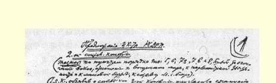
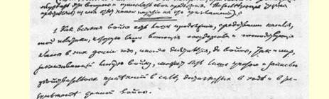
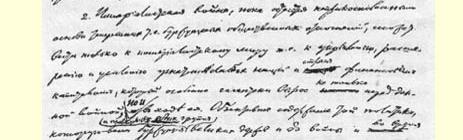
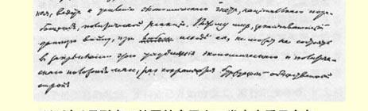
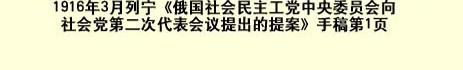

# 俄国社会民主工党中央委员会向社会党第二次代表会议提出的提案１４０

> （１９１６年２—３月）
>
> （关于议程第５、６、７ａ、７ｂ、８等项的***提纲***：为结束战争而斗争， 对和平问题、议会活动、群众斗争以及召集社会党国际局的态度。）

（国际社会党委员会宣布它将召开第二次代表会议，邀请各组织讨论这些问题并提出自己的提案。下述提纲就是我们党对这一邀请的答复。）

１．一切战争都不过是各交战国及其统治阶级战前多年内、有时是几十年内所推行的政治通过暴力手段的继续；同样，结束任何一场战争的和平，也只能是在这场战争的进程和结果中所达到的实际力量变化的记录和记载。

２．在现存的即资产阶级的社会关系的基础没有被触动的情况下，帝国主义战争只能导致帝国主义的和平，也就是说，只能巩固、 扩大和加强金融资本对弱小民族和国家的压迫。金融资本不但在这场战争以前而且在战争进行中有了特别巨大的增长。**两个**大国集团的资产阶级和政府无论在战前或在战争期间所推行的政治， 其客观内容都导致经济压迫、民族奴役和政治反动的加强。因此，

> １９１６年３月列宁《俄国社会民主工党中央委员会向
>
> 社会党第二次代表会议提出的提案》手稿第１页
>
> （按原稿缩小） 在保存资产阶级社会制度的条件下，不管战争结局如何，结束这场战争的和平都只会使群众的经济政治地位的这种恶化固定下来。

如果认为从帝国主义战争可以产生民主的和平，那在理论上就是用庸俗的空谈代替对在这场战争之前和在战争期间所推行的政治的历史分析，在实践上就是欺骗人民群众，模糊他们的政治意识，掩盖和粉饰统治阶级为未来的和平作准备的实际政治，向群众隐瞒一个主要的道理，即不经过一系列的革命，就不可能有民主的和平。

３．社会党人并不放弃争取改良的斗争。例如，他们现在也应当在议会内投票赞成任何改善群众生活状况的措施—— 哪怕是不大的改善也好——，赞成增加遭破坏地区居民的救济金，赞成减轻民族压迫，等等。但是，如果鼓吹用改良来解决历史和实际政治形势以革命方式提出的问题，那就是资产阶级的欺骗。这场战争提到日程上来的，正是这样的问题。这是帝国主义的根本问题，即资本主义社会的存亡问题，按照各“大”国的新的力量对比重新瓜分世界以推迟资本主义崩溃的问题。这些大国最近几十年来不但发展得异常迅速，而且特别重要的是，发展得极不平衡。改变社会力量对比而不是只用空谈来欺骗群众的那种实际的政治活动，在当前只能是下列两种形式之一：或者是帮助“自己”国家的资产阶级掠夺别国（并且把这种帮助叫作“保卫祖国”或“拯救国家”），或者是帮助无产阶级的社会主义革命，支持并且加强所有交战国群众中开始掀起的风潮，支持业已开始的罢工、游行示威等等，扩大和加强这些暂时还很微弱的群众革命斗争的表现，促使它们发展成为无产阶级推翻资产阶级的总攻。

现在，一切社会沙文主义者都在欺骗人民，说什么某个资本主义强盗集团发动了“不光明正大的”进攻，而某个集团在进行“光明正大的”防卫，用这一类假话来掩饰通过这场战争所继续的资本家的实际政治，即帝国主义政治。同样，空谈所谓“民主的和平”，似乎现在资本家和外交家已在准备的未来的和平能够“轻而易举地”消除“不光明正大的”进攻，恢复“光明正大的”关系，而不是同一种政治，即帝国主义政治，即金融掠夺、殖民地抢劫、民族压迫、政治反动和百般加剧资本主义剥削这种政治的继续、发展和加强，这也完全是欺骗人民。资本家和他们的外交家目前正需要这样的“社会党人”充当资产阶级的奴仆，需要这些奴仆用“民主的和平”的空话来蒙蔽、愚弄和麻醉人民，用这种空话掩盖资产阶级的实际政治，使群众难以看出它的实质，引诱群众脱离革命斗争。

４．现在第二国际最有名的代表人物正在制订的“民主的”和平纲领，正是这种资产阶级骗局和伪善。例如，第二国际最有威望和最有“理论修养”的正式代表胡斯曼在阿纳姆召开的代表大会上１４１、考茨基在《新时代》杂志上，都表述了这个纲领：在帝国主义政府缔结和约以前，不进行革命斗争；暂时在口头上反对兼并和赔款，主张民族自决，主张对外政策民主化，用仲裁法庭来解决各国之间的国际冲突，裁军，建立欧洲联邦１４２，等等，等等。

考茨基说伦敦代表会议（１９１５年２月）和维也纳代表会议 （１９１５年４月）一致确认了这个纲领的主要之点，即“民族独立”， 他用这个事实来证明在这个问题上“国际的意向一致”，这样，考茨基就极其明显地暴露了这个“和平纲领”的真实的政治意义。这样， 考茨基就向全世界公开批准了社会沙文主义者明目张胆欺骗人民的行为。这些社会沙文主义者伪善地、毫不负责地和毫无用处地在口头上承认民族“独立”或民族自决，同时又支持“自己的”政府进行帝国主义战争，虽然**双方**进行这场战争都在不断地破坏弱小民族的“独立”，都是**为了**巩固和扩大对弱小民族的压迫。

这个极其流行的“和平纲领”的客观作用，就是使工人阶级更加听命于资产阶级，因为它要开始展开革命斗争的工人同沙文主义领袖“和解”，抹杀社会主义运动中的严重危机，以便恢复各社会党战前状况，而正是这种状况使大多数领袖都转到资产阶级方面了。这种“考茨基主义”政策之所以对无产阶级的危害更大，是因为它用漂亮的言词装潢起来，并且不仅在德国，而且在世界各国都得到了推行。例如，在英国实行这种政策的是大多数领袖；在法国有龙格、普雷斯曼等；在俄国有阿克雪里罗得、马尔托夫、齐赫泽等。 齐赫泽用“拯救国家”的字眼来掩盖在这场战争中“保卫国家”的沙文主义思想，他一方面在口头上赞成齐美尔瓦尔德决议，另一方面在党团的正式声明中赞扬胡斯曼在阿纳姆大会上臭名远扬的演说，而且无论在杜马讲坛上或在报刊上，他实际上都不反对工人参加军事工业委员会，并且继续给赞成参加的报纸撰稿。在意大利实行这种政策的有特雷维斯：见１９１６年３月５日意大利社会党的中央机关报**《前进报》**１４３，该报警告说，要揭露特雷维斯及其他“改良主义的可能派”，揭露那些“不择手段地阻挠党的执行委员会和奥迪诺·莫尔加利促进齐美尔瓦尔德联盟和建立新国际的行动的人”，等等。

５．现在“和平问题”中的主要问题就是兼并问题。正是在这个问题上最清楚不过地看出目前盛行的社会党人的伪善言论以及真正社会主义的宣传鼓动任务。

必须说明什么是兼并，社会党人为什么和应当怎样反对兼并。 不能认为**凡是**把“他人的”领土归并起来就是兼并，因为一般来说， 社会党人是赞成铲除民族之间的疆界和建立较大的国家的；不能认为凡是破坏现状就是兼并，因为这样看是极其反动的，是对历史科学的基本概念的嘲弄；也不能认为凡是用武力归并的就是兼并， 因为社会党人不能否定对大多数人民有利的暴力和战争。只有**违背**某块领土上的居民的**意志**而归并这块领土，才应当算是兼并；换句话说，兼并的概念是和民族自决的概念不可分割地联系着的。

但是，正因为这场战争从参战的大国集团**双方**来说都是帝国主义性质的，所以在这个战争的基础上就会产生而且已经产生这样一种现象：如果正在实行兼并或者已经实行兼并的是敌国的话， 资产阶级和社会沙文主义者就竭力“反对”兼并。显然，这种“反对兼并”和这种在兼并问题上的“意向一致”，完全是伪善的。显然，那些拥护为阿尔萨斯－洛林而战的法国社会党人，那些不要求阿尔萨斯－洛林、德属波兰等地有从德国分离的自由的德国社会党人， 那些把沙皇政府重新奴役波兰的战争叫作“拯救国家”、在“没有兼并的和约”的名义下要求将波兰归并俄国的俄国社会党人，等等， 等等，**实际上**都是**兼并主义者**。

为了使反对兼并的斗争不是伪善的或流于空谈，为了使这一斗争能真正用国际主义精神教育群众，就必须使这个问题的提法能够让群众看清目前在兼并问题上流行的骗局，而不是掩盖这种骗局。各国社会党人光在口头上承认民族平等，或者唱高调，赌咒发誓，说他们反对兼并，这是不够的。他们还必须立即无条件地要求给**他们自己的**“祖国”压迫的殖民地和民族以**分离的自由**。

缺少这个条件，就连齐美尔瓦尔德宣言所承认的民族自决和国际主义原则，顶多也不过是僵死的文字。

６．社会党人的“和平纲领”也同他们的“为结束战争而斗争”的纲领一样，其出发点应当是：揭露现在各国巧言惑众的大臣和部长们、和平主义的资产者、社会沙文主义者和考茨基分子向人民宣扬的所谓“民主的和平”、交战国有爱好和平的意愿等等谎言。要是不首先向群众说明革命的必要性，不支持、促进和扩大到处业已开始的群众革命斗争（风潮、抗议、战壕联欢、罢工、游行示威，以及象在法国发生的从前线写信给亲友，劝他们不要认购战时公债等等）， 任何“和平纲领”都是对人民的欺骗和伪善。

支持、扩大和深入开展一切争取停战的群众运动，是社会党人应尽的义务。可是，实际上只有象李卜克内西那样的社会党人在履行这个义务，他们在国会讲坛上号召士兵放下武器，鼓吹革命，鼓吹变帝国主义战争为争取社会主义的国内战争。

应当提出拒绝支付国债作为一个积极的口号，用这个口号吸引群众参加革命斗争，向他们说明必须采用革命手段才能争得“民主的”和平。

齐美尔瓦尔德宣言固然指出工人应当为自己的事业而不是为他人作出牺牲，以此暗示要进行革命，但这还不够。还必须明确地向群众指出道路。应当让群众知道往哪里走以及为什么要这样走。 战争时期的群众性的革命行动，如果发展得顺利，只会使帝国主义战争变为争取社会主义的国内战争，这是显而易见的，对群众隐瞒这一点是有害的。相反，应当明确指出这一目标，不管在我们刚刚走上这条道路时，要达到这一目标是多么困难。齐美尔瓦尔德宣言说：“资本家说他们”进行这场战争“是为了保卫祖国，这是在撒谎”；工人在革命斗争中不应当顾忌本国的戒严状态，只说这些是不够的；还应当把这里所暗示的意思明说出来：不仅资本家而且社会沙文主义者和考茨基分子都在撒谎，因为他们是在这场帝国主义性质的战争中应用保卫祖国这个概念；如不使“自己的”政府有战败的危险，在战争时期就不可能开展革命行动；政府在反动战争中的一切失败都有助于革命，只有革命才能带来持久的民主的和平。最后，必须告诉群众，他们如果不自己建立秘密组织和创办不经战时书报检查的即秘密的报刊，就不可能有效地支持业已开始的革命斗争，促进它的发展，批评它的个别步骤，纠正它的错误，不断扩大和加强这一斗争。

７．关于社会党人的议会斗争（议会活动）问题，必须指出，齐美尔瓦尔德决议不但对被判流放西伯利亚的我们党的５位社会民主党国家杜马代表表示同情，而且赞同他们的策略。既要承认群众的革命斗争，又要满足于社会党人在议会中的纯粹合法的活动，是不可能的。这只会引起工人们正当的不满，使他们离开社会民主党而走向反议会的无政府主义或工团主义。必须明确地大声疾呼：议会中的社会民主党人不但要利用自己的地位在议会中讲话，而且要在议会外面从各方面去协助工人的秘密组织和革命斗争；群众自己也应当通过自己的秘密组织来检查自己的领袖的这类活动。

８．关于召集社会党国际局的问题可以归结于一个基本的原则问题，即各旧党和第二国际是否能够统一。国际工人运动沿着齐美尔瓦尔德会议所指出的道路每前进一步，都愈来愈清楚地证明齐美尔瓦尔德多数派所持的立场是不彻底的，因为他们一方面认为各旧党和第二国际的政策也就是工人运动中的**资产阶级**政策，即实现资产阶级利益而不是实现无产阶级利益的政策（例如齐美尔瓦尔德宣言中的这样的话：“资本家”说他们进行这场战争是为了 “保卫祖国”，这是在撒谎；此外在国际社会党委员会１９１６年２月 １０日的通告１４４内还有一些更明确的说法）；另一方面，国际社会党委员会又害怕同社会党国际局分裂，它正式许诺：一旦社会党国际局重新召集，国际社会党委员会就宣布解散。１４５

我们要肯定地说明，这种许诺在齐美尔瓦尔德代表会议上不但没有进行过表决，而且没有讨论过。

齐美尔瓦尔德代表会议以后半年的时间证明：按齐美尔瓦尔德代表会议的精神进行的工作（我们指的不是空话，而是工作），**事实上**在全世界都引起了分裂的加深和扩大。在德国，印发秘密反战传单是违背党的决议的，也就是说，是分裂性质的行动。卡·李卜克内西最亲密的同志、国会议员奥托·吕勒公开声明：事实上已经存在着两个党，一个帮助资产阶级，一个同资产阶级作斗争。于是就有许多人，包括考茨基分子在内，为此责骂吕勒，但是谁也无法驳倒他。在法国，社会党党员布尔德朗坚决反对分裂，但是同时他又向自己的党提出一项反对党中央和议会党团（ｄéｓａｐｐｒｏｕｖｅｒ Ｃｏｍｍ．Ａｄｍ．Ｐｅｒｍ．和Ｇｒ．Ｐａｒｌ）的决议案，这项决议案如果被通过，就一定会马上引起分裂。在英国，独立工党党员Ｔ．罗素·威廉斯在温和的《工人领袖》上公开承认分裂不可避免，并且得到许多地方工作人员的来信支持。美国的例子也许更有教益，因为甚至在那里，在中立国，在社会党内也产生了两个不可调和的敌对派别： 一方面是主张所谓“备战”即主张参战、推行军国主义和海上霸权主义的人，另一方面是象前社会党总统候选人尤金·德布兹这样的社会党人，则针对战事迫近而公开鼓吹进行争取社会主义的国内战争。

在全世界，事实上已经发生分裂，已经暴露出工人阶级对待战争的两种绝不调和的政策。闭眼不看这个事实是不行的，这样只会迷惑工人群众，蒙蔽他们的意识，阻碍全体齐美尔瓦尔德派正式表示支持的群众革命斗争，加强那些被国际社会党委员会在１９１６年 ２月１０日的通告中公开责备过的领袖们对群众的影响。在这个通告中该委员会责备他们把群众“引入迷途”，并且在策划反社会主义“阴谋”（“Ｐａｋｔ”）。

各国的社会沙文主义者和考茨基分子想要恢复已经破产的社会党国际局。社会党人的任务则是向群众说明，同那些打着社会主义旗帜执行资产阶级政策的人实行分裂是不可避免的。

> 载于１９１６年４月２２日《伯尔尼译自《列宁全集》俄文第５版国际社会党委员会公报》第４号第２７卷第２８２—２９３页