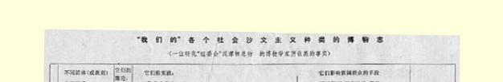
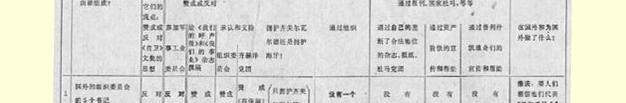
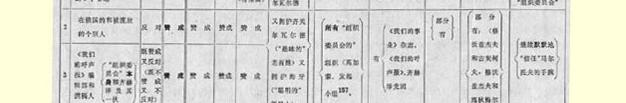
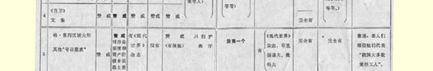

# 昆塔尔和俄国“组委会分子”

> （１９１６年５月２８日〔６月１０日〕以前）

为了拿事实同马尔托夫的“政治” 手腕作一个对照，我们让一位研究各种爬行动物等等的博物学家１５４来发言。在《我们的呼声报》第２７号上刊登了由（第１类）５名国外书记和（第２类）大家知道的**主张**参加军事工业委员会的叶若夫、策列铁里、唐恩等人签名的对《自卫》文集的抗议书。１５５《我们的呼声报》编辑部 （第３类）采取了“中间”立场：既赞成又反对《自卫》文集，既赞成又反对“抗议书”。

下面的表格[^1]是献给尔·马尔托夫的。

（顺便指出，我们的博物学家大概过于好意地想象马尔托夫的立场了。在昆塔尔只有阿克雪里罗得一人声明，他不投票赞成有关反对海牙社会党国际局１５６的决议。博物学家从这里得出结论说， 马尔托夫“只拥护齐美尔瓦尔德”，而不是齐美尔瓦尔德和海牙都拥护。恐怕事实不能证明这个对马尔托夫的乐观估计……）

> 载于１９１６年６月１０日《社会民主译自《列宁文集》俄文版第３９卷党人报》第５４—５５号合刊第１６６—１６９页

## 论德国的和非德国的沙文主义

[^1]: 表格见第３１８—３１９页。—— 编者注