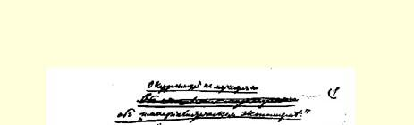
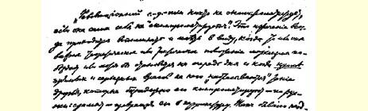
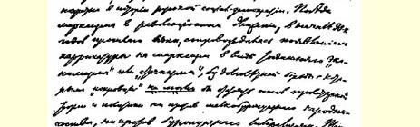
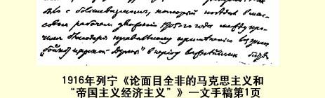

# 论面目全非的马克思主义和 “帝国主义经济主义”

８５

> （１９１６年８—９月）

“如果革命的社会民主党自己不败坏自己，那就谁也败坏不了它。”每当马克思主义的某一重要理论原理或策略原理取得胜利或者才提到日程上来的时候，每当**除了**公开的真正的敌人，还有一些朋友也向马克思主义“扑来”，拼命地败坏[^1]—— 用俄语来说就是玷污—— 它，把它歪曲得面目全非的时候，我们总是回想起和注意到这句名言。在俄国社会民主运动的历史上，这种情况是屡见不鲜的。上一世纪９０年代初期，随着马克思主义在革命运动中的胜利， 出现了一种面目全非的马克思主义，即当时的“经济主义”或“罢工主义”，“火星派”如果不同它作长期斗争，就不能捍卫无产阶级理论和政策的基础，反击小资产阶级民粹主义和资产阶级自由主义。 布尔什维主义的遭遇也是这样。它在１９０５年的群众性工人运动中取得了胜利，其原因之一是它在１９０５年秋天，在俄国革命进行最重要的搏斗的时期正确地运用了“抵制沙皇杜马”的口号８６。可是在１９０８—１９１０年间，它却不得不经历—— 并且通过斗争战胜—— 那种面目全非的布尔什维主义，当时阿列克辛斯基等人大吵大嚷， 反对参加第三届杜马。

８７

现在的情况也是这样。承认**这场**战争是帝国主义战争，指出它同资本主义的帝国主义时代的深刻联系，这不但遇到一些严肃的反对者，也遇到了一些不严肃的朋友，对他们来说，帝国主义这个字眼已经成了“时髦的东西”，他们把这个字眼**背得烂熟**，向工人灌输糊涂透顶的理论，重犯旧“经济主义”的一系列旧错误。资本主义胜利了，因此用不着在政治问题上动脑筋了，老“经济派”在 １８９４—１９０１年间就是这样推断的，他们甚至反对在俄国进行政治斗争。帝国主义胜利了，——** 因此**用不着在政治民主问题上动脑筋了，当代的“帝国主义经济派”就是这样推断的。上面刊载的彼·基辅斯基的文章，就是这种情绪和这种面目全非的马克思主义的标本，它第一次试图把自１９１５年初起在我们党某些国外小组内出现的思想动摇作一稍微完整的书面叙述。

在当前社会主义运动的大危机中，马克思主义者坚决反对社会沙文主义并站在革命国际主义方面，如果“帝国主义经济主义” 在他们中间传播开来，那就是对我们这个派别和我们党的一个最严重的打击，因为这会从内部，从它自己的队伍中败坏党，把党变成面目全非的马克思主义的代表者。因此，我们必须从彼·基辅斯基文章中数不胜数的错误里至少找出几个最主要的错误来加以详细讨论，尽管这样做“枯燥乏味”，常常不得不十分浅显地重复那些细心而善于思考的读者早在我们１９１４年和１９１５年的文献中就已知道和明白了的起码道理。

我们先从彼·基辅斯基议论的“中心”点谈起，以便使读者能够立刻抓住“帝国主义经济主义”这个新派别的“实质”。

> １９１６年列宁《论面目全非的马克思主义和
>
> “帝国主义经济主义”》一文手稿第１页
>
> （按原稿缩小）

## １．马克思主义对战争和 “保卫祖国”的态度

彼·基辅斯基自己相信并且要读者相信，他**只是**“不同意”民族自决，即我们党纲的第９条。他非常气忿地试图驳回对他的如下指责：他在民主问题上根本背离了**全部**马克思主义，在某个根本问题上成了马克思主义的“叛徒”（用意恶毒的引号是彼·基辅斯基加的）。然而问题的实质在于，当我们的作者一开始谈论他仿佛是在局部的个别的问题上有不同意见时，当他一拿出论据和理由等等时，就立刻可以发现，他恰恰完全同马克思主义背道而驰。就拿彼·基辅斯基文章中的第２条（即第２节）来说吧。我们的作者宣布，“这个要求〈即民族自决〉会直接〈！！〉导致社会爱国主义”，他还解释说，保卫祖国这个“背叛性的”口号是“可以完全符合〈！〉逻辑地〈！〉从民族自决权中推导出来的……”结论。在他看来，自决就是 “认可法国和比利时社会爱国主义者的背叛行为，他们正在拿起武器保卫这种独立〈法国和比利时的民族国家的独立〉，也就是说，他们正在**做**‘自决’拥护者仅仅在谈论的事情……’“保卫祖国是我们最凶恶的敌人的武器库中的货色……”“我们实在无法理解，怎么能**同时**既反对保卫祖国又主张自决，既反对祖国又保卫祖国。”

彼·基辅斯基就是这样写的。他显然没有理解我们关于反对在当前这场战争中保卫祖国这个口号的决议。我们只好把这些决议中写得一清二楚的地方提出来，再一次把这些明明白白的俄语含义讲清楚。

１９１５年３月，我们党在伯尔尼代表会议上通过了一项以《关于保卫祖国的口号》为题的决议。这项决议一开始就说：“**当前战争的真正实质就在于**”什么什么。

这里讲的是**当前**战争。用俄语不能说得比这更清楚的了。“真正实质”这几个字表明，必须把假象和真实、外表和本质、言论和行动区别开来。关于在这场战争中保卫祖国的说法，把１９１４—１９１６ 年间的帝国主义战争，为瓜分殖民地和掠夺他国领土等等而进行的战争伪装成民族战争。为了不致留下歪曲我们观点的一丝一毫的可能性，决议还专门补充了一段话，论述“**真正的**民族战争”，“**特别**〈请注意，特别不是仅仅的意思！〉是１７８９—１８７１年间发生的”民族战争。

决议说明，这些“真正”的民族战争，“其基础”“是长期进行的大规模民族运动，反对专制制度和封建制度的斗争，推翻民族压迫 ……”[^2]

看来，不是很清楚了吗？目前的帝国主义战争是由帝国主义时代的种种条件造成的，这就是说，它不是偶然的现象，不是例外的现象，不是违背一般常规的现象。在这场战争中讲保卫祖国就是欺骗人民，因为这**不是**民族战争。在**真正的**民族战争中，“保卫祖国” 一语则**完全不是**欺骗，**我们决不反对**。这种（真正的民族）战争“特别是”在１７８９—１８７１年间发生过。决议丝毫不否认现在也有发生这种战争的可能性，它说明应当怎样把真正的民族战争同用骗人的民族口号掩饰起来的帝国主义战争区别开来。也就是说，为了加以区别，必须研究战争的“基础”是不是“长期进行的大规模民族运动”，“推翻民族压迫”。

关于“和平主义”的决议直截了当地说：“社会民主党人不能否认革命战争的积极意义，这种战争不是帝国主义战争，而是象〈请注意这个“象”〉１７８９—１８７１年期间那样为推翻民族压迫……而进行的战争。”[^3]如果我们不承认民族战争在今天也是可能的，那么我们党１９１５年的决议会不会把１７８９—１８７１年间发生过的战争作为例子来谈论民族战争，并且指出我们并不否认那种战争的积极意义呢？显然不会。

列宁和季诺维也夫的小册子《社会主义与战争》，是对我党决议的解释或通俗的说明。在这本小册子的第５页上写得非常清楚： “社会主义者无论过去或现在”都**只是**在“推翻异族压迫”这个意义上“承认保卫祖国或防御战争的合理性、进步性和正义性”。举了一个例子：波斯反对俄国“**等等**”，并且指出：“这些战争就都是正义的、防御性的战争，而不管是谁首先发动进攻。任何一个社会党人都会希望被压迫的、附属的、主权不完整的国家战胜压迫者、奴隶主和掠夺者的‘大’国。”[^4]

小册子是在１９１５年８月出版的，有德文和法文版本。彼·基辅斯基对它很熟悉。无论彼·基辅斯基或任何别的人，都从没有向我们表示过异议，既没有反对关于保卫祖国的口号的决议，也没有反对关于和平主义的决议，也没有反对小册子中对这些决议的解释，一次也没有！既然彼·基辅斯基从１９１５年３月起并没有反对我们党对战争的看法，而目前，在１９１６年８月，却在一篇论述自决的文章中，也就是在一篇仿佛是关于局部问题的文章中暴露出对 **整个**问题的惊人无知，那么试问，我们说这位著作家根本不懂马克思主义，这是不是诽谤他呢？

彼·基辅斯基把保卫祖国的口号叫作“背叛性的”口号。我们可以平心静气地告诉他，谁如果只机械地重复口号，不去领会它的意义，对事物不作深入的思考，仅仅死记一些词句而不分析它们的含义，那么，**在这样的人**看来，**任何**口号都是而且将永远是“背叛性的”。

一般地说，“保卫祖国”是什么意思呢？它是不是经济学或政治学等等领域中的某种科学的概念呢？不是的。这只是**替战争辩护** 的一种最流行的、常用的、有时简直是庸俗的说法。仅仅如此而已！ 庸人们可以替**一切**战争辩护，说什么“我们在保卫祖国”，只有这种行为才是“背叛性的”，而马克思主义不会把自己降低到庸俗见解的水平，它要求历史地分析每一次战争，以便弄清楚能不能认为**这次**战争是进步的、有利于民主或无产阶级的，**在这个意义上**是正当的、正义的等等。

如果不善于历史地分析每一次战争的意义和内容，保卫祖国的口号就往往是对战争的一种庸俗的不自觉的辩护。

马克思主义作了这样的分析，它指出：**如果**战争的“真正实质”，**譬如说**在于推翻异族压迫（这对１７８９—１８７１年间的欧洲来说是特别典型的），那么，从被压迫国家或民族方面说来，这场战争就是进步的。**如果**战争的“真正实质”是重新瓜分殖民地、分配赃物、 掠夺别国领土（１９１４—１９１６年间的战争就是这样的），那么保卫祖国的说法就是“欺骗人民的弥天大谎”。

怎样找出战争的“真正实质”，怎样确定它呢？战争是政治的继续。应当研究战前的政治，研究正在导致和已经导致战争的政治。 如果政治是帝国主义的政治，就是说，它保护金融资本的利益，掠夺和压迫殖民地以及别人的国家，那么由这种政治产生的战争便是帝国主义战争。如果政治是民族解放的政治，就是说，它反映了反对民族压迫的群众运动，那么由这种政治产生的战争便是民族解放战争。

庸人们不懂得战争是“政治的继续”，因此他们只会说什么“敌人侵犯”，“敌人侵入我国”，而不去分析战争是**因为什么**、**由什么**阶级、为了**什么**政治目的进行的。彼·基辅斯基完全降低到这种庸人的水平，他说：看，德国人占领了比利时，可见，从自决观点看来， “比利时的社会爱国主义者是正确的”；或者说：德国人占领了法国的一部分领土，可见，“盖得可以得意了”，因为“打到本民族〈而不是异族〉居住的领土上来了”。

在庸人们看来，重要的是军队在**什么地方**，**现在**打胜仗的是谁。在马克思主义者看来，重要的是双方军队可能互有胜负的**这场** 战争是**因为什么**而进行的。

当前这场战争是因为什么而进行的呢？这一点在我们的决议中已经指出来了（根据交战国在战前**几十年**中实行的**政治**）。英、 法、俄是为了保持已夺得的殖民地和掠夺土耳其等等而战。德国是为了夺取殖民地和独自掠夺土耳其等等而战。假定德国人甚至拿下巴黎和彼得堡，那么这场战争的性质会不会因此而改变呢？丝毫不会。那时德国人的目的—— 更重要的是他们在胜利后推行的政治—— 是夺取殖民地，统治土耳其，夺取异族的领土，例如波兰等等，而决不是要对法国人或俄国人建立异族压迫。当前这场战争的真正实质不是民族战争，而是帝国主义战争。换句话说，战争的起因不是由于其中一方要推翻民族压迫，而另一方要维护这种压迫。 战争是在两个压迫者集团即两伙强盗之间进行的，是为了确定怎样分赃、由谁来掠夺土耳其和各殖民地而进行的。

简单地说，**在**帝国主义大国（即压迫许多别的民族，迫使它们紧紧依附于金融资本等等的大国）**之间**进行的或同它们**结成联盟** 进行的战争，是帝国主义战争。１９１４—１９１６年间的战争就是这种战争。在**这场**战争中，“保卫祖国”是欺人之谈，是替战争辩护。

被压迫者（例如殖民地人民）为**反对**帝国主义列强即实行压迫的大国而进行的战争，是真正的民族战争。这种战争在今天也是可能的。遭受民族压迫的国家为反对实行民族压迫的国家而“保卫祖国”，这不是欺人之谈，所以社会主义者**决不反对**在**这样的**战争中 “保卫祖国”。

民族自决也就是争取民族彻底解放、争取彻底独立和反对兼并的斗争，社会主义者如果还是社会主义者，就**不能**拒绝**这种**斗争，—— 不管它采取什么形式，直到起义或战争为止。

彼·基辅斯基以为他是在反对普列汉诺夫，据他说，正是普列汉诺夫指出了民族自决同保卫祖国的联系！彼·基辅斯基**相信了** 普列汉诺夫，以为这种联系**确实象**普列汉诺夫所描绘的那样８８。彼 ·基辅斯基既然相信了普列汉诺夫，于是就害怕起来了，认为必须否认自决，以便摆脱普列汉诺夫的结论……对普列汉诺夫太轻信了，同时也太害怕了，可是普列汉诺夫到底错在哪里，却一点也没有**考虑**！

社会沙文主义者为了把这场战争说成是民族战争，就拿民族自决作借口。同他们斗争的唯一正确的方法，就是要指出这场战斗并不是为了民族解放，而是为了确定由哪一个大强盗来压迫**更多的**民族。如果竟然否认**真正**为了民族解放而进行的战争，那就是对马克思主义的最大歪曲。普列汉诺夫和法国社会沙文主义者拿法国的共和制作为借口，来替“保卫”法国共和制、反对德国君主制辩护。如果象彼·基辅斯基那样推论，那么我们就应当反对共和制或反对**真正**为了捍卫共和制而进行的战争！！德国社会沙文主义者拿德国的普选制和普遍识字的义务教育作借口，来替“保卫”德国反对沙皇制度辩护。如果象基辅斯基那样推论，那么我们就应当或者反对普选制和普遍识字的教育，或者反对**真正**为了维护政治自由使之不被剥夺而进行的战争！

卡·考茨基在１９１４—１９１６年间的战争以前是马克思主义者， 他的一系列极为重要的著作和言论将永远是马克思主义的典范。 １９１０年８月２６日，考茨基在《新时代》杂志上曾就日益迫近的战争写道：

> “德英之间一旦发生战争，其争端将不是民主制度，而是世界霸权，即对全世界的剥削。在这个问题上，社会民主党人是不应当站在本国剥削者方面的。”（《新时代》杂志第２８年卷第２册第７７６页）

这是精彩的马克思主义的表述，它同我们的表述完全一致，它彻底揭穿了离开马克思主义而去为社会沙文主义辩护的**今天的**考茨基，它十分清楚地阐明了马克思主义如何对待战争的原则（我们还要在刊物上谈到这个表述）。战争是政治的继续；因此，既然有争取民主的斗争，也就可能有争取民主的战争；民族自决只是民主要求之一，它和其他民主要求根本没有任何区别。简单地讲，“世界霸权”是帝国主义政治的内容，而帝国主义政治的继续便是帝国主义战争。拒绝在民主的战争中“保卫祖国”，即拒绝参加民主的战争， 这是荒谬的，这跟马克思主义毫无共同之处。把“保卫祖国”的概念运用于帝国主义战争，即把帝国主义战争说成是民主的战争，从而粉饰帝国主义战争，这就等于欺骗工人，投到反动资产阶级方面去。

## ２．“我们对新时代的理解”

引号里的这句话是彼·基辅斯基说的，他常常提到“新时代”。 然而遗憾的是，在这里他的论断也是错误的。

我们党的一些决议说，这场战争是由帝国主义时代的一般条件造成的。我们运用马克思主义正确地指出了“时代”和“这场战争”的相互关系：要做一个马克思主义者，就必须具体地评价每一次战争。为什么在各大国之间—— 其中有许多国家在１７８９—１８７１ 年间曾经领导过争取民主的斗争—— 竟会而且必然会发生帝国主义战争，即按其政治意义来说是极端反动的、反民主的战争呢？要了解这一点，就必须了解帝国主义时代的一般条件，即各先进国家的资本主义已变为帝国主义的一般条件。

彼·基辅斯基完全曲解了“时代”和“这场战争”之间的这种关系。照他说来，要**具体地**谈，就是谈论“时代”！这恰巧不对。

１７８９—１８７１年那个时代，对于欧洲说来是一个特殊时代。这是无可争辩的。不了解那个时代的一般条件，就不能了解对于那个时代来说特别典型的任何一次民族解放战争。这是不是说，那个时代的一切战争都是民族解放战争呢？当然不是。这样说是极其荒唐的，是用可笑的死板公式代替对每一次战争的具体研究。在 １７８９—１８７１年间，既发生过殖民地战争，也发生过压迫许多其他民族的反动帝国之间的战争。

试问，能不能从先进欧洲（以及美国）的资本主义已经进入帝国主义新时代这一事实得出结论说，现在只可能发生帝国主义战争呢？作这样的论断是荒谬的，这是不善于把某一具体现象和该时代可能发生的各种现象的总和区别开来。时代之所以称为时代，就是因为它包括所有的各种各样的现象和战争，这些现象和战争既有典型的也有不典型的，既有大的也有小的，既有先进国家所特有的也有落后国家所特有的。象彼·基辅斯基那样只是泛泛地谈论 “时代”，而回避这些具体问题，这就是滥用“时代”这个概念。为了不作无稽之谈，我们现在从许多例子中举出一个例子。但是首先必须指出，有**一个**左派集团，即德国的“国际”派，曾经在《伯尔尼执行委员会公报》第３期（１９１６年２月２９日）中发表了一个提纲，并在第５条中作了如下一个显然错误的论断：“在这猖狂的帝国主义的时代，**不可能再有任何**民族战争。”我们农《〈社会民主党人报〉文集》中分析过这个论断[^5]。这里只须指出，虽然一切关心国际运动的人老早就熟悉这个论点（我们早在１９１６年春天伯尔尼执行委员会扩大会议上就反对过这个论点），可是直到现在**没有一个派别**重述过这个论点，接受过这个论点。彼·基辅斯基在１９１６年８月写他那篇文章时，也没有说过一句同这种论断或类似论断精神一致的话。

之所以必须指出这一点，是因为如果有人发表过这种论断或类似论断，那才谈得上理论上的分歧。既然***没有***提出过任何类似的论断，那我们只好说：这并不是对“时代”的另一种理解，不是什么理论上的分歧．而只是随口说出的一句话，只是滥用了“时代”这个词。

> 例如，彼·基辅斯基在他那篇文章的开头写道：“它〈自决〉岂不是同在火星上免费得到１００００俄亩土地的权利一样吗？对于这个问题，只能十分具体地，同对今天整个时代的估计联系起来加以回答。要知道，在发展当时那种水平的生产力的最好形式—— 民族国家的形成时代，民族自决权是一回事，在这种形式即民族国家形式已经成为生产力发展的桎梏时，民族自决权则是另一回事。在资本主义和民族国家确立的时代与民族国家正在灭亡、资本主义本身也处在灭亡前夜的时代之间，有很大的距离。抛开时间和空间而作‘泛泛’之谈，这不是马克思主义者的事情。”

这段议论是歪曲地运用“帝国主义时代”这一概念的标本。正因为这个概念是新的和重要的，所以必须同这种歪曲作斗争！有人说民族国家的形式已经成为桎梏等等，这是指什么呢？是指各先进资本主义国家，首先是指德国、法国和英国，由于这些国家参加了这场战争，这场战争才首先成为帝国主义战争。在**这些**过去特别是在１７８９—１８７１年间曾经引导人类前进的国家里，民族国家形形成的过程已经结束了，在这些国家里民族运动已经一去不复返了，要想恢复这种运动只能是荒谬绝伦的反动空想。法兰西人、英吉利人和德意志人的民族运动早已结束，在**那里**提到历史日程上来的是另一个问题：已获得解放的民族变成了压迫者民族，变成了处在 “资本主义灭亡前夜”、实行帝国主义掠夺的民族。

而其他民族呢？

彼·基辅斯基象背诵记得烂熟的规则那样，重复说马克思主义者应者“具体地”谈问题，但他自己并不**运用**这条规则。我们在自己的提纲中特意提供了具体回答的范例，可是彼·基辅斯基却不愿意把错误给我们指出来，如果他这里发现了错误的话。

我们的提纲（第６条）指出，为了具体起见，为了具体起见，在自决问题上至少应当区分三类不同的国家。（显然，在一个总的提纲里不能谈到每一个别的国家。）第一类是西欧（以及美洲）的各先进国家，在那里，民族运动是**过去的事情**。第二类是东欧，在那里， 民族运动是**现在的事情**。第三类是半殖民地和殖民地，在那里，民族运动在很大程度上是将来的**事情**。[^6]

这对不对呢？彼·基辅斯基本应把他的批评指向**这里**。然而他甚至没有觉察到，理论问题究竟何在！他没有看到，只要他还没有驳倒我们提纲（第６条）中的上述论点（要驳倒它是不可能的，因为它是正确的），他的关于“时代”的议论就象一个人“挥舞”宝剑而不出手攻击。

> 他在文章的末尾写道：“同弗·伊林的意见相反，我们认为，对于多数〈！〉 西欧〈！〉国家来说，民族问题还没有解决……”

这岂不是说，法兰西人、西班牙人、英吉利人、荷兰人、德意志人、意大利人的民族运动并没有在１７、１８、１９世纪或更早的时候完成吗？在文章开头，“帝国主义时代”这个概念被曲解成这样：似乎民族运动已经完成，而不仅是在西欧各先进国家里已经完成。同一篇文章的结尾却说，**正是**在西欧国家“民族问题”还“没有解决”！！ 这岂不是思想混乱吗？

在西欧各国民族运动是早已过去的事情。在英、法、德等国， “祖国”已经唱完自己的歌了，已经扮演过自己的历史角色了，**也就是说**，在那里，不可能再有进步的、能唤起新的人民群众参加新的经济生活和政治生活的民族运动了。在那里，提到历史日程上来的问题，不是从封建主义或从宗法制的蒙昧状态过渡到民族进步，过渡到文明的和政治上自由的祖国，而是从已经过时的、资本主义过度成熟的“祖国”过渡到社会主义。

东欧的情况则不同。譬如，对乌克兰人和白俄罗斯人来说，只有梦幻中住在火星上的人才会否认：这里的民族运动还没有完成， 这里***还***正在唤醒民众掌握本族语言和本族语言的出版物（而这是资本主义获得充分发展、交换彻底渗入最后一家农户的必要条件和伴随物）。在这里，“祖国”**还**没有唱完自己的全部历史之歌。在这里，“保卫祖国”**还**可能是保卫民主、保卫本族语言和政治自由、 反对压迫民族、反对中世纪制度，而今天英吉利人、法兰西人、德意志人和意大利人说什么在这场战争中保卫祖国，则是撒谎，因为他们实际上保卫的并**不是**本族语言，**不是**本民族发展的自由，而是他们作为奴隶主的权利、他们的殖民地、他们的金融资本在别国的 “势力范围”等等。

在半殖民地和殖民地，民族运动的历史比在东欧还要年轻一些。

所谓“高度发达的国家”和帝国主义时代是指**什么**；俄国的“特殊”地位（彼·基辅斯基的文章第２章第４节的标题）以及并非俄国一国的“特殊”地位究竟**何在**；民族解放运动**在什么地方**是骗人的鬼话，在什么地方是活生生的和具有进步意义的现实，—— 对于这一切彼·基辅斯基一无所知。

## ３．什么叫作经济分析？

反对自决的人的种种议论的焦点，就是借口说在一般资本主义或帝国主义的条件下它“不能实现”。“不能实现”这几个字，常常在各种各样的和不明确的意义上被使用。因此，我们在自己的提纲中要求象在任何一次理论争论中都必须做到的那样：弄清楚所谓 “不能实现”是什么意思。我们不仅提出了问题，还作了解释。说一切民主要求在帝国主义时代“不能实现”，是指不经过多次革命在政治上难以实现或者不能实现。

说自决不能实现是指在经济上不可能，那是根本不对的。

我们的论点就是如此。理论分歧的焦点就在这里，这是我们的论敌在任何稍微严肃一点的争论中都必须十分重视的问题。

现在就来看一看彼·基辅斯基关于这个问题是怎样议论的吧。

他坚决反对把不能实现解释为由于政治原因而“难以实现”。 他直接用经济上不可能这层意思来回答问题。

> 他写道：“这是不是说，自决在帝国主义时代不能实现，如同劳动货币在商品生产下不能实现一样呢？”彼·基辅斯基随即回答说：“是的，是这个意思！因为我们谈的正是‘帝国主义’和‘民族自决’这两个社会范畴之间的逻辑矛盾，如同劳动货币和商品生产这另外两个范畴之间存在着的逻辑矛盾一样。帝国主义是自决的否定，任何魔术家都无法把自决和帝国主义结合起来。”

不管彼·基辅斯基用以挖苦我们的“魔术家”这个字眼多么吓人，我们还是应当向他指出，他根本不懂什么叫作经济分析。“逻辑矛盾”—— 当然，在正确的逻辑思维的条件下——** 无论**在经济分析中或在政治分析中都是不应当有的。因此，在恰恰应当作经济分析 **而不是**作政治分析的时候，搬出**一般**“逻辑矛盾”来搪塞，这无论如何是不适当的。**无论**经济因素或政治因素都属于“社会范畴”。可见，彼·基辅斯基虽然一开始就斩钉截铁地回答说，“是的，是这个意思”（就是说，自决不能实现，如同劳动货币在商品生产下不能实现**一样**），可是后来他实际上只是兜圈子，而没有作出经济分析。

怎样证明劳动货币在商品生产下不能实现呢？通过经济分析。 这种分析也同一切分析一样，不容许有“逻辑矛盾”，它运用的是经济的而且**仅仅是**经济的（而不是一般“社会的”）范畴，并且从中得出劳动货币不能实现的结论。在《资本论》第１章中，根本没有谈到什么政治、政治形式或一般“社会范畴”，这里所分析的只是经济因素，商品交换和商品交换的发展。经济分析表明（当然是用“逻辑” 推理的方法），在商品生产下劳动货币不能实现。

彼·基辅斯基根本不想进行经济分析！他把帝国主义的经济本质同它的政治趋势**搅在一起**，这一点从他那篇文章第一节第一句话里就可以看出来。这句话是：

> “工业资本是前资本主义的生产和商业借贷资本的合成物。借贷资本曾为工业资本效劳。现在资本主义克服了各种形式的资本，产生一种最高级的， 统一的资本即金融资本，因此，整个时代都可以称为金融资本时代，而与这种资本相应的对外政策体系便是帝国主义。”

从经济上来看，这整个定义都毫无用处，因为全是空话，而没有确切的经济范畴。但是现在我们不可能详细地谈这个问题。重要的是彼·基辅斯基把帝国主义称为“对外政策体系”。

第一，这实质上是错误地重述考茨基的错误思想。

第二，这纯粹是而且仅仅是给帝国主义下的政治定义。彼·基辅斯基想用帝国主义是“政策体系”这个定义来回避他曾经答应要作的**经济**分析，当时他说过，自决在帝国主义时代不能实现，即在经济上不能实现，如同劳动货币在商品生产下不能实现“**一样**”！[^7]

考茨基在同左派争论时说：帝国主义“仅仅是对外**政策**体系” （即兼并政策体系），决不能把资本主义的某一经济阶段，某一发展梯级称为帝国主义。

考茨基错了。当然，作字眼上的争论是不明智的。禁止在这种或那种意义上使用帝国主义这个“字眼”是不可能的。但是，如果要进行讨论，就必须把概念弄清楚。

从经济上来看，帝国主义（或金融资本的“时代”，问题不在于字眼）是资本主义发展的最高阶段，即这样一个阶段，此时生产已经达到巨大的和极为巨大的规模，以致**垄断代替了自由竞争**。帝国主义的**经济**本质就在于此。垄断既表现为托拉斯、辛迪加等等，也表现为大银行的莫大势力、原料产地的收买和银行资本的集中等等。一切都归结于经济垄断。

这种新的经济即垄断资本主义（帝国主义就是垄断资本主义） 的政治上层建筑，就是从民主转向政治反动。民主适应于自由竞争。政治反动适应于垄断。鲁·希法亭在他的《金融资本》一书中说得好：“金融资本竭力追求的是统治，而不是自由。”

把“对外政策”和一般政策分开，或者甚至把对外政策和对内政策对立起来，是根本错误的、非马克思主义的、非科学的想法。帝国主义无论在对外或对内政策中，都同样力求破坏民主，实行反动。从这个意义上说，帝国主义无疑就是对**一般民主**即**一切民主**的 “否定”，而决不是对种种民主要求中的一个要求即民族自决的“否定”。

帝国主义既然“否定”民主，**同样**也“否定”民族问题上的民主 （即民族自决）。所谓“同样”，也就是说它力求破坏这种民主。在帝国主义时代实现这种民主与在帝国主义时代实现共和制、民兵制、 由人民选举官吏等等，在同样的程度、同样的意义上更加困难（同垄断前资本主义相比）。根本谈不上“在经济上”不能实现。

大概，使彼·基辅斯基在这里犯错误的还有这样一个情况（除了完全不懂经济分析的要求而外）：从庸人的观点看来，所谓兼并 （即在违反居民意志的情况下吞并异族地区，即破坏民族自决）也就是金融资本向更广阔的经济领土“扩展”（扩张）。

不过，用庸人的概念是不能研究理论问题的。

从经济上说，帝国主义就是垄断资本主义。为了垄断一切，不仅要从国内市场（本国市场）上，同时还要从国外市场上，从全世界上把竞争者排除掉。“在金融资本的时代”，有没有甚至在别国内排除竞争的**经济上的**可能性呢？当然有，这种手段就是使竞争者在金融上处于依附地位，收买其原料产地以至全部企业。

美国的托拉斯是帝国主义即垄断资本主义经济的最高表现。 为了排除竞争者，托拉斯不限于使用经济手段，而且还常常采取政治手段乃至刑事手段。但是，如果认为用纯粹经济的斗争方法在经济上不能实现托拉斯的垄断，那就大错特错了。相反地，现实处处证明这是“可以实现”的：托拉斯通过银行破坏竞争者的信用（托拉斯老板就是银行老板，因为收买了股票），托拉斯破坏竞争者的原料运输（托拉斯老板就是铁路老板，因为收买了股票），托拉斯在一定时期内把价格压低到成本以下，不惜为此付出数以百万计的代价，以便迫使竞争者破产，从而**收买**他的企业和原料产地（矿山、土地等等）。

这就是对托拉斯的实力和对它们的扩张所作的纯经济分析。 这就是实行扩张的纯经济的途径：**收买**企业、工厂、原料产地。

一国的大金融资本也随时可以把别国即政治上独立的国家的竞争者的一切收买过去，而且它向来就是这样做的。这在经济上是 **完全**可以实现的。不带政治“兼并”的经济“兼并”是完全“可以实现”的，并且屡见不鲜。你们在关于帝国主义的著作里随时都可以看到这样的说法，例如：阿根廷实际上是英国的“商业殖民地”，葡萄牙实际上是英国的“附庸”，等等。这是对的，因为在经济上依附英国银行，对英国负有债务，当地的铁路、矿山、土地被英国收买， 等等，—— 这一切都使上述国家在经济意义上被英国所“兼并”，但是并没有破坏这些国家的政治独立。

这些国家的政治独立就叫作民族自决。帝国主义力图破坏这种独立，因为在实行政治兼并的情况下，经济兼并往往更方便，更便宜（更容易收买官吏、取得承租权、实行有利的法令等等），更如意，更稳妥，—— 就象帝国主义力图用寡头政治代替一般民主一样。但是说什么在帝国主义时代自决**在经济上**“不能实现”，这简直是胡说八道。

彼·基辅斯基用一种非常随便和轻率的方法来回避理论上的困难，用德语来说这叫作“信口开河”，即青年学生在饮酒作乐时常有的（也是很自然的）胡吹乱扯。请看下面这个例子。

他写道：“普选制、八小时工作制以至共和制，**从逻辑上**说都是和帝国主

> 义相容的，尽管帝国主义极不喜欢〈！！〉它们，所以实现起来就极为困难。”

诙谐的字眼有时可以使学术著作增色，假如在谈论一个重大问题时，**除了**这些字眼，还从经济和政治方面对种种概念进行分析的话，我们决不反对所谓帝国主义并不“喜欢”共和制这种信口开河的说法。彼·基辅斯基用信口开河代替这种分析，掩盖缺乏分析。

“帝国主义不喜欢共和制”这句话是什么意思呢？为什么会这样呢？

共和制是资本主义社会的政治上层建筑的可能形式之一，而且在现代条件下是最民主的形式。说帝国主义“不喜欢”共和制，这就是说帝国主义和民主之间有矛盾。很有可能，彼·基辅斯基“不喜欢”或者甚至“极不喜欢”我们的这个结论，但这个结论是不容置疑的。

其次，帝国主义和民主之间的这一矛盾是怎样一种性质的呢？ 是逻辑矛盾还是非逻辑矛盾呢？彼·基辅斯基用“逻辑”这个字眼时，却没有想一想，因而也没有觉察到，这个字眼在这里**恰好**是用来替他**掩盖**他所谈论的**问题**（既掩盖读者的耳目，也掩盖作者的耳目）！这个问题就是经济同政治的关系，帝国主义的经济条件和经济内容同政治形式之一的关系。在人的推论中出现的一切“矛盾”， 都是逻辑矛盾，这是空洞的同义反复。彼·基辅斯基用这种同义反复来回避问题的**实质**：这是两种**经济**现象或命题之间的“逻辑”矛盾（１）？还是两种**政治**现象或命题之间的“逻辑”矛盾（２）？或者是 **经济**现象或命题同**政治**现象或命题之间的“逻辑”矛盾（３）？

要知道，问题的实质就在这里，因为提出的是在某种政治形式下在经济上不能实现还是可以实现的问题！

彼·基辅斯基如果不避开这个实质，他大概就会看到，帝国主义同共和制之间的矛盾，是最新资本主义（即垄断资本主义）的经济同一般政治民主之间的矛盾。因为彼·基辅斯基永远也不能证明，有哪一项重大的和根本的民主措施（由人民选举官吏或军官、 实行最充分的结社集会自由等等），与共和制相比，同帝国主义之间的矛盾较小一些（也可以说，更为帝国主义所“喜欢”）。

所以我们得出的正是**我们**在提纲中所坚持的那个论点：帝国主义同**所有一切**政治民主都是矛盾的，都是有“逻辑”矛盾的。彼· 基辅斯基“不喜欢”我们的这个论点，因为它打破了彼·基辅斯基的不合逻辑的结构，但是有什么办法呢？有些人仿佛要驳斥某些论点，其实暗中恰恰搬出这些论点，说什么“帝国主义不喜欢共和制”，这难道能够令人容忍吗？

其次，为什么帝国主义不喜欢共和制呢？帝国主义怎样把自己的经济同共和制“结合起来”呢？

彼·基辅斯基没有考虑这个问题。现在我们不妨向他提一下恩格斯讲过的下面一段话。这里谈的是民主共和国。问题是这样提出的：在这种管理形式下财富能不能实行统治呢？就是说，问题正是关于经济和政治之间的“矛盾”。

恩格斯回答说：“……民主共和国已经不再正式讲什么〈公民之间的〉财产差别了。在这种国家中，财富是间接地但也是更可靠地运用它的权力的：其形式一方面是直接收买官吏〈美国是这方面的典型例子〉，另一方面是政府和交易所结成联盟……”[^8]

这就是对于民主在资本主义制度下“可以实现”的问题所作的经济分析的范例，而自决在帝国主义制度下“可以实现”的问题，只是这个问题的一小部分！

民主共和国“在逻辑上”是同资本主义矛盾的，因为它“正式” 宣布富人和穷人平等。这是经济制度和政治上层建筑之间的矛盾。 帝国主义和共和制之间存在着同样的矛盾，而且这种矛盾被加深和加剧了，因为垄断代替了自由竞争，使一切政治自由都更加“难以”实现。

资本主义怎样和民主结合起来呢？通过间接地行使资本的无限权力！为此可以采取两种经济手段：（１）直接收买；（２）政府和交易所结成联盟。（在我们的提纲中，这一点是用如下的话表述的：在资产阶级制度下，金融资本可以“随意收买和贿赂任何政府和官吏”。）

既然商品生产、资产阶级、货币权力统治一切，因此在任何一种管理形式下，在任何一种民主制度下，收买（直接的或通过交易所）都是“可以实现”的。

试问，在帝国主义代替了资本主义，即垄断资本主义代替了垄断前的资本主义以后，我们所考察的这种关系起了什么变化呢？

唯一的变化就是交易所的权力加强了！因为金融资本是最大的、发展到垄断地步的、同银行资本融合起来的工业资本。大银行正在同交易所融合起来，吞并交易所。（在关于帝国主义的著作中常常谈到交易所的作用下降，但这只是从任何一个大银行本身就是交易所这个意义上说的。）

其次，既然一般“财富”完全能够通过收买和通过交易所来实现对任何民主共和国的统治，那么，彼·基辅斯基怎么能断言拥有亿万资本的托拉斯和银行的巨大财富，不能“实现”金融资本对别国，即对政治上独立的共和国的统治而不陷入可笑的“逻辑矛盾” 呢？？

怎么？在别国内收买官吏“不能实现”吗？或者“政府和交易所结成联盟”，这仅仅是与本国政府结成联盟吗？

读者从这里可以看出，为了剖析和通俗地说明１０行糊涂文字，需要写大约１０个印刷页。我们不能这样详尽地分析彼·基辅斯基的每个论断—— 真的，他没有一个论断不是糊涂的！—— 而且也没有这个必要，因为对主要的问题已经作了分析。剩下的我们将大略提一下。

## ４．挪威的例子

挪威在１９０５年即在帝国主义最猖狂的时代，“实现了”似乎是不能实现的自决权。因此，“不能实现”的说法不仅在理论上是荒谬的，而且也是可笑的。

彼·基辅斯基想反驳这一点，他挖苦我们是“唯理论者”（同这有何相干？唯理论者仅限于下论断，而且是抽象的论断，而我们指出了最具体的事实！彼·基辅斯基使用“唯理论者”这个外国字眼， 恐怕正如他在自己文章的开头以“精炼的形式”提出自己的见解时使用“精炼的”这个词一样……怎样说得更委婉一些呢？……一样地不那么“恰当”吧？）。

彼·基辅斯基责备我们说，在我们看来“重要的是现象的外表，而不是真正实质”。那么我们就来考察一下真正实质吧。

反驳一开始就举了一个例子，说颁布反托拉斯法的事实并不能证明禁止托拉斯是不能实现的。完全正确，只是例子举得不恰当，因为它是**驳斥**彼·基辅斯基的。法律是一种政治措施，是一种政治。任何政治措施也不能禁止经济。不管波兰具有什么样的政治形式，不管它是沙皇俄国的一部分还是德国的一部分，不管它是自治区还是政治上独立的国家，这都不能禁止或消除波兰对帝国主义列强金融资本的依附和后者对波兰企业股票的收买。

挪威在１９０５年所“实现”的独立，仅仅是政治上的独立。它并不打算触及也不可能触及经济上的不独立。我们的提纲所说的正是这一点。我们指出，自决仅仅涉及政治，因此甚至提出经济上不能实现的问题，也是错误的。而彼·基辅斯基却搬出政治禁令对经济无能为力的例子来“反驳”我们！“反驳”得太妙了！

其次。

> “单凭一个甚至许多个关于小企业战胜大企业的例子，还不足以驳倒马克思的如下正确论点：资本主义发展的整个进程都伴随着生产的积聚和集中。”
>
> 这个论点也是以一个不恰当的**例子**为根据的。选择这样的例子，是为了转移人们（读者和作者）对争论的真正实质的注意。

我们的提纲指出，从劳动货币在资本主义制度下不能实现那种意义上来说自决在经济上不能实现，是不正确的。能够证明***劳动货币***能够实现的“例子”一个也举不出来。彼·基辅斯基默认我们在这一点上是正确的，因为他转而去对“不能实现”作**另外的**解释。

他为什么不直截了当地说出来呢？为什么不公开地、确切地提出**自己的**论点，说“自决就其经济上的可能性来说在资本主义制度下不能实现，它是同发展进程相抵触的，因而是反动的或者只是一个例外”呢？

因为作者只要一公开说出他的相反的论点，立刻就会揭穿自己，所以他只好遮遮掩掩。

无论我们的纲领或爱尔福特纲领，都承认经济集中和大生产战胜小生产的规律。彼·基辅斯基隐瞒了一个事实，即两者都不承认政治集中或国家集中的规律。如果这同样是或者也算是一个规律，那么彼·基辅斯基为什么不加以阐述并建议把它补充到我们的纲领中去呢？他既然发现了国家集中这个新规律，发现了这个具有实际意义的、可以使我们纲领消除错误结论的规律，却又让我们保留一个不好的和不全面的纲领，他这样做对吗？

彼·基辅斯基对这个规律没有作任何表述，也没有建议要补充我们的纲领，因为他隐隐约约地感到，那样一来他就会成为笑柄。如果把这种观点公开表现出来，除大生产排挤小生产的规律之外又提出一个大国排挤小国的“**规律**”（与前一规律联在一起或相提并论），那时，人人都会对这种“帝国主义经济主义”的妙论哈哈大笑！

为了说明这一点，我们只向彼·基辅斯基提一个问题：为什么不带引号的经济主义者不谈现代托拉斯或大银行的“瓦解”，不谈这种瓦解是可能的和能够实现的呢？为什么甚至一个带引号的“帝国主义经济主义者”也不得不承认大国瓦解是可能的和能够实现的，并且这还不仅是一般瓦解，而是例如，“小民族”（请注意这一点！）从俄国分离出去（彼·基辅斯基论文的第２章第４节）呢？

最后，为了更清楚地说明我们的作者扯到哪里去了，为了向他提出警告，我们必须指出，我们大家都公开承认大生产排挤小生产的规律，谁也不怕把“小企业战胜大企业”的个别“例子”叫作反动现象。直到现在还**没有一个**反对自决的人敢把挪威同瑞典分离叫作反动现象，虽然从１９１４年起我们就在著作中提出了这个问题。[^9]

只要还保持着例如手工作业台，大生产就不能实现；认为使用机器的工厂可以“瓦解”为手工工场，那是极端荒谬的。建立大帝国的帝国主义趋势完全可以实现，并且在实践中常常通过一些在政治意义上独立自主的国家建立帝国主义联盟的形式来实现。这种联盟是可能的，它不仅表现为两国金融资本的经济结合，同时也表现为在帝国主义战争中的军事“合作”。**在**帝国主义**条件下**，民族斗争、民族起义和民族分离是完全“可以实现”的，并且已见诸行动， 甚至变得更加剧烈，因为帝国主义不是阻止资本主义的发展和人民群众民主意向的增长，而是**加剧**这种民主意向和托拉斯的反民主意向之间的对抗。

只有从“帝国主义经济主义”即面目全非的马克思主义的观点出发，才可以忽视帝国主义政治中的下列特殊现象：一方面，当前的帝国主义战争告诉我们一些事例，依靠金融联系和经济利益能使政治上独立的小国卷进大国之间的斗争（英国和葡萄牙）。另一方面，破坏无论在经济上或政治上都比自己的帝国主义“庇护者” 软弱得多的小民族方面的民主制，结果不是引起起义（如爱尔兰）， 便是使整团整团的官兵投向敌方（如捷克人）。在这种情况下，从金融资本的观点来看，为了不使“自己的”军事行动有遭到破坏的危险，给予**某些**小民族以尽可能多的民主自由乃至实行国家独立，这不仅是“可以实现”的，而且对托拉斯，对**它们的**帝国主义政治，对 **它们的**帝国主义战争，**有时是**直接**有利的**。忘记政治的和战略的相互关系的特点，不管适当不适当，一味背诵“帝国主义”这个记得烂熟的词，这决不是马克思主义。

关于挪威，彼·基辅斯基告诉我们说，第一，它“向来就是一个独立国家”。这是不对的，这种错误只能用作者的信口开河满不在乎和对政治问题的不重视来解释。挪威在１９０５年以前**不**是独立国家，它只享有非常广泛的自治权。瑞典只是**在**挪威同它分离**以后**才承认挪威是一个独立的国家。如果挪威“向来就是一个独立国家”， 那么瑞典政府就不可能在１９０５年１０月２６日向外国宣布，它现在承认挪威是一个独立国家。

第二，彼·基辅斯基用许多引文来证明：挪威朝西看，瑞典则是朝东看，在前者“起作用”的主要是英国金融资本，在后者—— 是德国金融资本，等等。他由此便得出一个扬扬得意的结论：“这个例子〈即挪威〉完全可以纳入我们的公式”。

请看，这就是“帝国主义经济主义”的逻辑典范！我们的提纲指出，金融资本可以统治“任何”国家，“哪怕是独立国家”，因此，说什么从金融资本的观点来看“不能实现”自决的一切论断，都是糊涂观念。人们给我们列举一些材料，这些材料都**证实**我们的关于别国金融资本**无论在**挪威分离**以前或在**挪威分离**以后**都始终起作用的论点，—— 他们却以为这是在**驳斥**我们！！

谈金融资本因而忘记政治问题，难道这就是谈论政治吗？

不是。政治问题决不会因为有人犯了“经济主义”的逻辑错误就不再存在。英国金融资本无论在挪威分离以前或分离以后，都一直在挪威“起作用”。德国金融资本在波兰同俄国分离以前，曾经在波兰“起作用”，今后不管波兰处于**怎样的**政治地位，德国金融资本还会“起作用”。这个道理太简单了，甚至叫人不好意思重申，但是， 既然有人连这个简单的道理都忘记了，那又有什么办法呢？

关于挪威的这种或那种地位、关于挪威从属瑞典、关于分离问题提出之后工人的态度等政治问题，会不会因此就不存在了呢？

彼·基辅斯基回避了这些问题，因为它们刺痛了“经济派”。但是，在实际生活中，这些问题以前存在，现在仍然存在。在实际生活中提出过这样的问题：不承认挪威有分离权的瑞典工人能不能当社会民主党的党员呢？**不能**。

瑞典贵族当时主张对挪威发动战争，牧师们也是如此。这一事实并不因为彼·基辅斯基“忘记”读挪威人民的历史就不存在。瑞典工人作为社会民主党党员，可以劝告挪威人投票反对分离（挪威于１９０５年８月１３日就分离问题举行了全民投票，结果３６８２００票赞成分离，１８４票反对分离，参加投票的约占有投票权的人数的 ８０％）。可是，如果瑞典工人象瑞典贵族和瑞典资产阶级那样，否认挪威人有不通过瑞典人、不顾及瑞典人的意愿而自行解决这一问题的权利，那他们就是**社会沙文主义者**，就是**决不容许留在社会民主党内的恶棍**。

对我们的党纲第９条就应该这样来运用，而我们的“帝国主义经济主义者”却试图跳过这一条。先生们，你们要跳过去，就非投入沙文主义的怀抱不可！

而挪威工人呢？从国际主义的观点看来，他们是否必须投票**赞成**分离呢？根本不是。他们作为社会民主党党员，可以投票反对分离。他们只有向反对挪威有分离**自由**的瑞典黑帮工人伸出友谊之手，才是违背了自己作为社会民主党党员的义务。

有些人不愿意看到挪威工人和瑞典工人的地位之间的这一起码差别。不过他们既然**避开**我们直截了当地向他们提出的这一极其具体的政治问题，他们也就揭穿了自己。他们默不作声、借词推托，从而让出了阵地。

为了证明在俄国也可能发生“挪威”问题，我们特意提出一个论点：在**纯**军事的和战略的条件下，单独的波兰国家即使**现在**也是完全可以实现的。彼·基辅斯基想要“争论”一下，但是却没有作声！！

我们再补充一句，根据**纯**军事和战略的考虑，在**这场**帝国主义战争的某种结局下（如瑞典并入德国，德国人取得一半胜利），甚至芬兰也完全**可能**成为一个单独的国家，但这并不会破坏金融资本的任何一种业务的“可实现性”，不会使收买芬兰铁路和其他企业股票的事情“不能实现”。[^10]

彼·基辅斯基想用惊人之语来掩饰他所讨厌的政治问题，这是他整篇“议论”的一大特色。他说：“……每一分钟〈在第１章第２ 节的末尾，一字不差地这样写着〉达摩克利斯剑８９都可能掉下，断送‘独立’工场〈“暗指”小小的瑞典和挪威〉的生机”。

照这么说来，真正的马克思主义想必是这样的：尽管**瑞典**政府曾把挪威从瑞典分离出去叫作“革命措施”，但挪威这个独立的国家总共不过存在了１０来年。既然我们读过希法亭的《金融资本》一书，并且把他的意思“理解”为“每一分钟”—— 要说就把话说到底！—— 小国都可能消失，那么我们又何必去分析由此而产生的 **政治**问题呢？又何必去注意我们把马克思主义歪曲成“经济主义”， 把自己的政策变成了对道地的俄国沙文主义者的言论的随声附和呢？

俄国工人在１９０５年争取共和国，想必是犯了莫大的错误，因为无论法国的、英国的或其他什么国家的金融资本，早就动员起来要反对它，如果它出现了的话，“每一分钟”都可能用“达摩克利斯剑”将它砍掉！

“最低纲领中的民族自决要求……不是空想的：它并不同社会发展相抵触，因为它的实现并不会妨碍社会发展。”彼·基辅斯基在其文章中作了关于挪威的“摘录”的那一节里，反驳马尔托夫的这段话。其实他的“摘录”一再**证实**下面这个尽人皆知的事实：挪威的“自决”和分离**并没有阻止**一般的发展，特别是金融资本业务的扩大，**也没有阻止**英国人对挪威的收买！

我们常常见到这样一些布尔什维克，例如１９０８—１９１０年间的阿列克辛斯基，他们**恰恰**在马尔托夫讲得正确的时候去反对他！这样的“盟友”千万不能要！

## ５．关于“一元论和二元论”

彼·基辅斯基指责我们“对要求作了二元论的解释”，他写道： “国际的一元论的**行动**，被二元论的**宣传**所代替。”

统一的行动是同“二元论”的宣传相对立的，—— 这听起来似乎完全是马克思主义的、唯物主义的。可惜，我们如果仔细地研究一下，我们就必须说，这和杜林的“一元论”一样，是**口头上的**“一元论”。恩格斯在反对杜林的“一元论”时写道：“如果我把鞋刷子综合在哺乳动物的**统一**体中，那它决不会因此就长出乳腺来。”[^11]

这就是说，只有那些在客观现实中是**统一的**事物、属性、现象和行动，才可以**称为**“统一的”。而我们的作者恰巧忘记了这件“**小事情**”！

第一，他认为我们的“二元论”就在于：我们向被压迫民族工人首先提出的要求（这里只是就民族问题而言），**不同于**我们对压迫民族工人的要求。

为了审查一下彼·基辅斯基在这里的“一元论”是不是杜林的 “一元论”，必须看一看**客观现实**中的情况是怎样的。

从民族问题的角度来看，压迫民族工人和被压迫民族工人的 **实际**地位是不是一样的呢？

不，不一样。

（１）**在经济上**有区别：压迫民族的资产者用一贯加倍盘剥被压迫民族工人的办法取得**超额利润**，压迫国家的工人阶级有一部分人可以从中分享一点残羹剩饭。此外，经济资料表明；压迫民族工人当“工头”的百分比要比被压迫民族工人**高**，压迫民族工人升为工人阶级**贵族**的百分数也**大**[^12]。这是事实。压迫民族工人**在一定程度上**参与**本国**资产阶级掠夺被压迫民族工人（和多数居民）的勾当。

（２）**在政治上**有区别：与被压迫民族工人比较，压迫民族工人在政治生活的许多方面都占**特权地位**。

（３）**在思想上**或精神上有区别：压迫民族工人无论在学校中或在实际生活中，总是受着一种轻视或蔑视被压迫民族工人的教育。 例如，凡是在大俄罗斯人中间受过教育或生活过的大俄罗斯人，对这一点**都有体会**。

总之，在客观现实中**处处**都有差别，就是说，在不以个人意志和意识为转移的客观世界中，到处都有“二元论”。

既然如此，我们应当怎样看待彼·基辅斯基的所谓“国际的一元论的行动”这句话呢？

这是一句响亮的空话，如此而已。

国际**实际上**是由**分别**属于压迫民族和被压迫民族的工人组成的，**为了**使国际的行动**统一**，就必须对两种**不同的**工人进行不同的宣传：从真正的（而不是杜林式的）“一元论”观点看来，从马克思的唯物主义观点看来，只能这样谈问题！

例子呢？我们（两年多以前在合法刊物上！）已经举了关于挪威的例子，而且任何人也没有试图反驳我们。在从实际生活中举出的这一具体事例中，挪威工人和瑞典工人的行动所以是“一元论的”、 统一的、国际主义的，***只是***由于瑞典工人***无条件地***坚持挪威的分离自由，而挪威工人则***有条件地***提出关于这次分离的问题。如果瑞典工人不是**无条件地**赞成挪威人的分离自由，那他们就成了**沙文主义者**，就成了想用暴力即战争把挪威“留住”的瑞典地主们的沙文主义同谋。如果挪威工人**不是有条件**地提出分离问题，即社会民主党党员也可以投票和宣传反对分离，那挪威工人就违背了国际主义者的义务，而陷入了狭隘的、**资产阶级的**挪威民族主义。为什么呢？因为实行分离的是**资产阶级**，而不是无产阶级！因为挪威资产阶级（也同各国资产阶级一样）**总是**力求分裂本国和“异国”的工人！因为在觉悟的工人看来，任何民主要求（其中也包括自决）都要 **服从**社会主义的最高利益。譬如说，挪威同瑞典的分离势必或者可能引起英德之间的战争，**由于这种原因**，挪威工人就应当反对分离。而瑞典工人作为社会党人，**只有**在一贯地、彻底地、经常地反对瑞典政府而拥护挪威分离自由的情况下，才有权利和有可能在类似的场合进行**反对**分离的宣传。否则，挪威工人和挪威人民就**不相信**而且**也不能**相信瑞典工人的劝告是诚恳的。

反对自决的人倒霉的地方，就在于他们只会拿一些僵死的抽象概念来敷衍了事，而**不敢**彻底分析实际生活中任何一个具体的例子。我们的提纲已经具体指出，在纯军事和战略的种种条件一定的配合下，波兰新国家**现在**是完全“可以实现”的[^13]。无论波兰人或者彼·基辅斯基，对这一点都没有表示过异议。但谁也不愿意**想一想**，从默认我们是正确的这一事实中得出的结论是什么。由此而得出的结论显然是：为了教育俄国人和波兰人采取“统一的行动”，国际主义者**决不能**在两者中间进行同样的宣传。大俄罗斯（和德国） 工人应当无条件地赞成波兰的分离自由，否则**在目前**他们**实际上** 就成了尼古拉二世或兴登堡的奴仆。而波兰工人***只能***有条件地主张分离，因为想用某个帝国主义资产阶级的胜利来投机（象“弗腊克派”那样），那就意味着充当它的奴仆。这种差别是国际的“一元论的行动”的条件，不了解这种差别，就等于不了解为了采取“一元论的行动，来反对比如莫斯科附近的沙皇军队，为什么革命军队必须从下诺夫哥罗德向西挺进，而从斯摩棱斯克向东挺进。

第二，我们这位杜林式一元论的新信徒指责我们没有注意在社会变革时期“国际的各个民族支部的最紧密的组织上的团结”。

彼·基辅斯基写道：在社会主义制度下，自决将消亡，因为那时国家也将消亡。这句话仿佛是专为反驳我们而写的！但是我们曾经用了三行字（我们的提纲的第１条的最后三行）说得清清楚楚：“民主也是一种国家形式，它将随着国家的消失而消失。”[^14]彼 ·基辅斯基在他的文章的第３节（第１章）中，用**好几页**篇幅所重复的正是这个真理，—— 当然是为了“反驳”我们！—— 而且在重复时加以**歪曲**。他写道：“我们设想并且从来就设想，社会主义制度是一种严格民主〈！！？〉集中的经济体制，在这种体制下，国家作为一部分居民统治另一部分居民的机构将会消失。”这是糊涂观点， 因为民主也是“一部分居民对另一部分居民”的统治，也是一种国家。作者显然不了解社会主义胜利后国家**消亡**是怎么一回事，这个过程的条件是什么。

不过重要的还是他的有关社会革命时代的“反驳”。作者先拿 “自决的信奉者”这个吓人的字眼骂了我们一顿，接着说：“我们设想这个过程〈即社会变革〉将是所有〈！！〉国家的无产者的统一行动，他们将打破资产阶级〈！！〉国家的疆界，拆掉界碑〈这同“打破国界”无关吗？〉，炸毁〈！！〉民族共同体并建立阶级共同体。”

请“信奉者”的严峻审判官恕我们直说：在这里讲了一大堆空话，可是根本看不到“思想”。

社会变革不可能是**所有**国家的无产者的统一行动，理由很简单：地球上的大多数国家和大多数居民，直到今天甚至还没有达到或者刚刚开始达到资本主义的发展阶段。关于这点我们在提纲第 ６条中已经讲了[^15]，但是，彼·基辅斯基只是由于不经心或者不善于思考而“没有觉察到”，我们提出这一条并不是无的放矢，而恰恰是为了驳斥那些把马克思主义歪曲得面目全非的言论。只有西欧和北美各先进国家才已成熟到可以实现社会主义的地步。彼·基辅斯基在恩格斯给考茨基的一封信９０（《〈社会民主党人报〉文集》９１）中可以读到对这种实在的而不只是许愿的“**思想**”的具体说明：幻想什么“**所有**国家的无产者的统一行动”，就是把社会主义推迟到希腊的卡连德日９２，也就是使它“永无实现之日”。

不是所有国家的无产者，而是少数达到**先进**资本主义发展阶段的国家的无产者，将用统一行动实现社会主义。正因为彼·基辅斯基不懂这个道理，他才犯了错误。在**这些**先进国家（英、法、德等国）里，民族问题早就解决了，民族共同体早已过时了，***在客观上***已不存在“全民族的任务”。因此**现在**只有在这些国家里，才可以“炸毁”民族共同体，建立阶级共同体。

在不发达的国家里，在我们（我们的提纲第６条中）列为第二类和第三类的国家里，也就是在整个东欧和一切殖民地和半殖民地，情形就不同了。这里的民族通常还是受压迫的、资本主义不发达的民族。在这些民族中**客观上**还有全民族的任务，即民主的任务，**推翻异族压迫**的任务。

恩格斯曾拿印度作为这些民族的例子，他说，印度可能要进行一次反对胜利了的社会主义的革命[^16]，—— 因为恩格斯同可笑的 “帝国主义经济主义”大不相同，“帝国主义经济主义”认为，在先进国家中取得胜利的无产阶级，不必采取一定的民主措施，就可以 “自然而然地”消灭各个地方的民族压迫。无产阶级将改造它取得了胜利的那些国家。这不能一下子做到，而且也不能一下子“战胜”资产阶级。我们在自己的提纲中特意着重指出了这一点，而彼 ·基辅斯基又没有想一想，我们在谈到民族问题的时候强调这一点，究竟是**为了什么**。

当先进国家的无产阶级在推翻资产阶级、击退它的反革命企图的时候，不发达的和被压迫的民族不会等待，不会停止生活，不会消失。既然它们甚至可以利用１９１５—１９１６年的这场战争—— 它同社会革命比较起来不过是帝国主义资产阶级的一次小小的危机 —— 来发动起义（一些殖民地、爱尔兰），那么毫无疑问，它们更会利用各先进国家的国内战争这种**大危机**来发动起义。

社会革命的发生只能是指一个时代，其间既有各先进国家无产阶级同资产阶级的国内战争，又有不发达的、落后的和被压迫的民族所掀起的**一系列**民主的、革命的运动，其中包括民族解放运动。

为什么呢？因为资本主义发展得不平衡，而客观现实使我们看到，除了高度发达的资本主义民族，还有许多在经济上不那么发达和完全不发达的民族。彼·基辅斯基根本没有从不同国家在经济上的成熟程度来考虑社会革命的**客观**条件，所以说，他指责**我们** “臆想出”某地应实行自决，实际上是诿过于人。

彼·基辅斯基煞费苦心地反复重述从马克思和恩格斯的著作中摘来的引文，说我们应当“不是从头脑中臆想出，而是通过头脑从现有的物质条件中发现”使人类摆脱这种或那种社会灾难的手段。每当我读到这些重复的引文时，总是不能不想起臭名昭著的 “经济派”，他们是这样无聊地……咀嚼着他们关于资本主义已在俄国获得胜利的“新发现”。彼·基辅斯基想用这些引文来“吓倒” 我们，因为据说我们是从头脑中臆想出在帝国主义时代实行民族自决的条件！不过恰巧在同一个彼·基辅斯基那里，我们却读到了如下一段“不小心的自供”： “单是我们**反对**〈黑体是原作者用的〉保卫祖国这一事实，就再清楚不过

> 地表明，我们将积极反抗一切对民族起义的镇压，因为我们将以此同我们的死敌—— 帝国主义进行斗争。”（彼·基辅斯基的文章的第２章第３节）
>
> 要批评一个有名的作者，要**答复**他，就不能不完整地引用他的文章的论点，哪怕是几个最主要的论点。但是，即使只是完整地引出彼·基辅斯基的一个论点，那也随时都可以发现，他的每一句话都有两三个歪曲马克思主义的错误和疏忽的地方！

（１）彼·基辅斯基没有注意到，民族起义也是“保卫祖国”！任何人只要稍微思索一下，都会相信事情正是这样的，因为**任何**“起义的民族”，都是为了“保卫”本民族不受压迫民族的压迫，都是为了保卫自己的语言、疆土和祖国。

一切民族压迫都引起**广大**人民**群众**的反抗，而遭受民族压迫的居民的一切反抗**趋势**，都是民族起义。如果说我们经常看到（特别在奥地利和俄国），被压迫民族的资产阶级**只是**空谈民族起义， 实际上却背着本国人民**而且针对**本国人民，同压迫民族的资产阶级进行反动的交易，那么在这种情形下，革命的马克思主义者不应当批评民族运动，而应当反对缩小这一运动、使之庸俗化和把它歪曲为无谓争吵。顺便指出，奥地利和俄国的很多社会民主党人都忘记了这一点，他们把自己对许多细小的、庸俗的、微不足道的民族纠纷（例如，为了用哪种文字写的街名应当放在街名牌的上边、哪种文字应当放在下边而发生争吵和斗殴）所抱的正当的反感，变成否认支持民族斗争。我们不会“支持”摩纳哥某公国成立共和国的喜剧式的把戏，也不会“支持”南美洲一些小国或太平洋某岛屿的 “将军们”实行“共和的”冒险，但是我们不能因此就在重大的民主运动和社会主义运动中放弃共和国的口号。我们嘲笑而且应当嘲笑俄国和奥地利各民族间微不足道的民族纠纷和民族争吵，但是我们不能因此就不支持民族起义或一切重大的反民族压迫的全民斗争。

（２）如果在“帝国主义时代”民族起义是不可能的，那么彼·基辅斯基也就无权来谈论民族起义了。如果这种起义是可能的，那么他的一切关于“一元论”、关于我们“臆想出”一些在帝国主义条件下实现自决的例子等等无穷尽的空话，就**统统**不攻自破了。彼·基辅斯基自己在打自己的嘴巴。

如果“我们”“积极反抗对民族起义的镇压”（彼·基辅斯基“***自己***”认为这是可能的事情），那么这是什么意思呢？

这就是说，行动是双重的，如果用我们这位作者所用的文不对题的哲学术语来说，就是“二元论的”。（ａ）第一，遭受民族压迫的无产阶级和农民，同遭受民族压迫的资产阶级**一起**采取**反对**压迫民族的“行动”；（ｂ）第二，压迫民族的无产阶级或其中有觉悟的一部分采取**反对**压迫民族的资产阶级和跟着它走的一切分子的“行动”。

彼·基辅斯基讲了许许多多反对“民族联盟”、民族“幻想”、民族主义“毒害”和“煽动民族仇恨”以及诸如此类的话，这全是空话， 因为作者既然劝告压迫国家的无产阶级（我们不要忘记，作者认为这个无产阶级是一个了不起的力量）“积极反抗对民族起义的镇压”，他也就是在***煽动***民族仇恨，也就是在***支持***被压迫国家的工人 “同资产阶级的联盟”。

（３）如果说在帝国主义条件下民族起义是可能的，那么民族战争也是可能的。从政治上说，这两者之间没有任何重大差别。军事史学家把起义也看作战争，这是完全正确的。彼·基辅斯基由于不加思索，不仅打了自己的嘴巴，而且也打了否认在帝国主义条件下有发生民族战争的**可能性**的尤尼乌斯和“国际”派的嘴巴。而否认这种可能性，就是否认帝国主义条件下民族自决的观点的唯一可以设想的理论基础。

（４）因为—— 什么是“民族”起义呢？就是力图实现被压迫民族的**政治**独立，即建立**单独的**民族国家的起义。

如果说压迫民族的无产阶级是一个了不起的力量（正如作者对帝国主义时代所预料的和应当预料的那样），那么，这个无产阶级下定决心，“积极反抗对民族起义的镇压”，这**是不是**对建立单独的民族国家的**促进**呢？当然是！

我们这位大胆否认自决“可以实现”的作者居然说，各先进国家的觉悟的无产阶级应当促进这个“不能实现的”措施的实现！

（５）**为什么**“我们”应当“积极反抗”对民族起义的镇压呢？彼· 基辅斯基只举了一个理由：“因为我们将以此同我们的死敌—— 帝国主义进行斗争。”这个理由的全部**力量**，就在于“死”这个有力的字眼，总之，在作者那里论据的力量被代之以严厉的响亮的词句的力量，被代之以“把木橛钉入资产阶级发抖的躯体”这类符合阿列克辛斯基风格的漂亮话。

但是，彼·基辅斯基的这个论据是**不正确的**。帝国主义同资本主义一样，都是我们的“死”敌。这是事实。但是任何一个马克思主义者都不会忘记，资本主义比封建主义进步，而帝国主义又比垄断前的资本主义进步。这就是说，我们应当支持的***不是***任何一种反对帝国主义的斗争。我们**并不**支持反动阶级反对帝国主义的斗争，我们**并不**支持反动阶级反对帝国主义和资本主义的起义。

这就是说，如果作者承认必须援助被压迫民族的起义（“积极反抗”镇压就是援助起义），那么他也就承认民族起义的**进步性**，承认在起义胜利后建立单独的新国家和划定新疆界等等的**进步性**。

作者简直**没有一个**政治论断是可以自圆其说的！

顺便指出，我们的提纲在《先驱》杂志第２期上发表以后爆发的１９１６年的爱尔兰起义证明，说民族起义**甚至**在欧洲也可能发生，这决不是毫无根据的！

## ６．彼·基辅斯基所涉及和歪曲了的其他政治问题

我们在自己的提纲中指出，所谓解放殖民地就是实行民族自决。欧洲人常常忘记殖民地人民也是民族，容忍这种“健忘”就是容忍沙文主义。

彼·基辅斯基“反驳”说： “就无产阶级这个词的本义来说”，在纯粹的殖民地“**没有**无产阶级”（第

> ２章第３节末尾）。“既然如此，‘自决’是向谁提出的呢？向殖民地的资产阶级？向费拉９３？向农民？当然不是。**社会党人**〈黑体是彼·基辅斯基用的〉向殖民地提出自决口号，是荒唐的，因为向没有工人的国家提出工人党的口号， 根本就是荒唐的。”

不管说我们观点“荒唐”的彼·基辅斯基多么气愤，我们还是不揣冒昧，恭恭敬敬地向他指出：他的论据是错误的。只有臭名昭著的“经济派”才认为，“工人党的口号”**仅仅**是向工人提出的。[^17]不对，这些口号是向全体劳动居民、向全体人民提出的。我们党纲中的民主要求那一部分（彼·基辅斯基“根本”没有想一想它的意义），是专门向全体人民提出的，因此我们在党纲的这一部分里讲的是“人民”。[^18]

我们估计殖民地和半殖民地有１０亿人口，对于我们这个十分具体的说法，彼·基辅斯基根本无意反驳。在这１０亿人口中，有７ 亿以上（中国、印度、波斯、埃及）属于**有**工人的国家。但是，在每个马克思主义者看来，即使向那些没有工人而只有奴隶主和奴隶等等的殖民地国家提出“自决”，也不仅**不是**荒唐的，而且是**必须**的。 彼·基辅斯基只要略微想一想，大概就会明白这个道理，同时也会懂得，“自决”向来就是“向”被**压迫**民族和压迫民族这**两种**民族提出的。

彼·基辅斯基的另一个“反驳”是：

> “因此，我们向殖民地只限于提出否定的口号，也就是说，只限于由社会党人对本国政府提出‘从殖民地滚出去！’的要求。这个在资本主义范围内不能实现的要求，会加剧反对帝国主义的斗争，但是并不违背发展的趋势，因为社会主义社会不会占有殖民地。”

作者不能或者是不愿意多少考虑一下政治口号的理论内容， 这简直令人吃惊！难道因为我们不使用理论上精确的政治术语而只用一些鼓动词句，问题就会有所改变吗？说“从殖民地滚出去”， 就是用鼓动的词句来避开理论的分析！我们党的任何一个鼓动员， 在说到乌克兰、波兰、芬兰等等时，都有权对沙皇政府（“自己的政府”）说“从芬兰等等地区滚出去”，但是，头脑清楚的鼓动员都懂得，不能仅仅为了“加剧”而提出肯定的或否定的口号。只有阿列克辛斯基式的人物才会坚持用“加剧”反对某种祸害的斗争的愿望来为“退出黑帮杜马”这个“否定的”口号作辩护。

加剧斗争是主观主义者的一句空话，他们忘记了：为了说明任何一个口号是正确的，马克思主义要求对**经济**现实、**政治**形势和这一口号的**政治**意义进行精确的分析。翻来复去说这一点，真叫人不好意思，但是既然非这样不可，那又有什么办法呢？

用鼓动性的叫喊来打断对理论问题的理论争辩，这种阿列克辛斯基式的手法我们见得多了，这是拙劣的手法。“从殖民地滚出去”这个口号的政治内容和经济内容有一点而且只有一点：给殖民地民族分离自由，建立单独国家的自由！彼·基辅斯基既然认为帝国主义的**一般**规律妨碍民族自决，使之成为空想、幻想等等，那么， 怎能不加思索便认定世界上**多数**民族是这些一般规律中的例外呢？显然，彼·基辅斯基的“理论”不过是对理论的一种讽刺罢了。

在大多数殖民地国家里，都有商品生产和资本主义，都有金融资本的千丝万缕的联系。既然从商品生产、资本主义和帝国主义的 **角度看来**，“从殖民地滚出去”是一种“不科学”的，是已经被伦施、 库诺等人自己“驳倒了”的“空想”要求，那又怎能向各帝国主义国家和政府提出这个要求呢？

作者在议论时没有动过一点**脑筋**！

作者没有想一想，所谓解放殖民地“不能实现”，**仅仅**是指“不经多次革命就不能实现”。他没有想一想，**由于**欧洲实行社会主义革命，解放殖民地是可以实现的。他没有想一想，“社会主义社会” **不仅**“不会占有”殖民地，而且也**根本**“不会占有”被压迫民族。他没有想一想，在我们所考察的这个问题上，俄国“占有”波兰或土耳其斯坦，这无论在经济上或政治上都是**没有**差别的。他没有想一想， “社会主义社会”愿意“从殖民地滚出去”，**仅仅**是指给它们自由分离的**权利**，**决**不是指**提倡它们分离**。

由于我们把分离权的问题和我们是不是提倡分离的问题区别开来，彼·基辅斯基就骂我们是“魔术家”，为了向工人“科学地论证”这种见解，他写道：

> “如果工人问一位宣传员，无产者应当怎样对待独立〈即乌克兰的政治独立〉问题，而他得到的回答是：社会党人争取分离权，但同时进行反对分离的宣传，那么工人会怎样想呢？”

我想，我可以对这个问题作出十分明确的答复。这就是，我认为任何头脑清楚的工人都会**想**：彼·基辅斯基**不善于思想**。

每一个头脑清楚的工人都会“想”：正是这位彼·基辅斯基教我们工人喊“从殖民地滚出去”。这就是说，我们大俄罗斯工人应当要求本国政府滚出蒙古、土耳其斯坦和波斯，英国工人应当要求英国政府滚出埃及、印度和波斯等等。但是，难道这就意味着**我们**无产者**想要**同埃及的工人和费拉９３，同蒙古、土耳其斯坦或印度的工人和农民实行分离吗？难道这就意味着**我们**要劝告殖民地的劳动群众去同觉悟的欧洲无产阶级实行“分离”吗？完全不是这么回事。 我们无论过去、现在或将来，一贯主张各先进国家的觉悟工人同**一切**被压迫国家的工人、农民和奴隶最紧密地接近和融合。我们一向劝告而且还将劝告一切被压迫国家（包括殖民地）的一切被压迫阶级**不要**同我们分离，而要尽可能紧密地同我们接近和融合。

如果我们要求本国政府滚出殖民地—— 不用鼓动性的空喊， 而用确切的政治语言来说，就是要求它**给予**殖民地充分的分离**自由**，真正的**自决权**，如果我们一旦夺取了政权，我们自己一定要让这种权利实现，给予这种自由，那么，我们向现在的政府要求这一点而且我们自己在组成政府时将**做到**这一点，这决不是为了“提倡”实行分离，相反地，是为了促进和加速各民族的**民主的**接近和融合。我们要尽一切努力同蒙古人、波斯人、印度人、埃及人接近和融合，我们认为做到这一点是我们的义务和**切身利益**之所在，否则，欧洲的社会主义就将是***不巩固的***。我们要尽量给这些比我们更落后和更受压迫的人民以“无私的文化援助”，用波兰社会民主党人的很好的说法来讲，就是帮助他们过渡到使用机器，减轻劳动， 实行民主和社会主义。

如果我们要求给予蒙古人、波斯人、埃及人以及所有**一切**被压迫的和没有充分权利的民族以分离自由，那么这决不是因为**我们主张**它们**分离**，而**仅仅是**因为我们主张**自由的**、**自愿的**接近和融合，但不主张强制的接近和融合。**仅仅是**因为这一点！

我们认为，在这方面，蒙古或埃及的农民和工人同波兰或芬兰的农民和工人之间的**唯一**差别，就在于后者发展程度高，他们在政治上比大俄罗斯人更有经验，在经济上更加训练有素，等等。因此， 他们大概很快就会说服本国人民：他们现在仇恨充当刽子手的大俄罗斯人是合乎情理的，但是把这种仇恨转移到**社会主义**工人和社会主义俄国身上，那就不明智了；经济的利益以及国际主义和民主主义的本能和意识，都要求各民族在社会主义社会中尽快地接近和融合。因为波兰人和芬兰人都是具有高度文化的人，所以他们大概很快就会相信这种说法是正确的，而波兰和芬兰的分离在社会主义胜利以后，可能只实行一个短时期。文化落后得多的费拉、 蒙古人和波斯人分离的时间可能要长一些，但是我们要象上面所说的那样，力求通过无私的文化援助来缩短分离的时间。

我们在对待波兰人和蒙古人方面，没有而且也不可能有**任何** 别的差别。宣传民族分离自由同**我们**组成政府时坚决实现这种自由，同宣传民族的接近和融合，没有而且也不可能有**任何**“矛盾”。———

———我们确信，任何一个头脑清楚的工人、真正的社会主义者、真正的国际主义者，对于我们和彼·基辅斯基的争论[^19]都会这样“想”的。

一种主要的疑惑象一根红线贯穿着彼·基辅斯基的文章：既然整个发展的趋势是民族**融合**，为什么我们要宣传民族**分离**自由， 并且要在掌握政权时实现这种自由呢？我们回答说，其理由也同下面一点一样：虽然整个发展的趋势是消灭社会的一部分对另一部分的暴力统治，但是我们还是宣传并且在我们掌握政权时要实行无产阶级专政。专政就是社会的一部分对整个社会的统治，而且是直接依靠暴力的统治。为了推翻资产阶级并且击退它的反革命的尝试，必须建立无产阶级这个唯一彻底革命的阶级的专政。无产阶级专政问题具有如此重要的意义，以至凡是否认或仅仅在口头上承认无产阶级专政的人都不能当社会民主党的党员。然而不能否认，在某些情况下，作为例外，例如，在某一个小国家里，在它的大邻国已经完成社会革命之后，资产阶级和平地让出政权是**可能的**， 如果它深信反抗已毫无希望，不如保住自己的脑袋。当然，更大的可能是，即使在各小国家里，不进行国内战争，社会主义也**不会**实现，因此，承认这种战争应当是国际社会民主党的**唯一**纲领，虽然对人使用暴力并不是我们的理想。这个道理只要作相应的改变 （ｍｕｔａｔｉｓ ｍｕｔａｎｄｉｓ），同样可以适用于各个民族。我们主张民族融合，但是没有分离自由，**目前**便不能从强制的融合、从兼并过渡到自愿的融合。我们承认经济因素的主导作用（这完全正确），但是象彼·基辅斯基那样加以解释，那就是把马克思主义歪曲得面目全非。甚至现代帝国主义的托拉斯和银行，尽管在发达的资本主义的条件下到处同样不可避免，但在不同国家里其具体形式却并不相同。美、英、法、德这些先进的帝国主义国家的政治形式更加各不相同，虽然它们在本质上是一样的。在人类从今天的帝国主义走向明天的社会主义革命的道路上，同样会表现出这种多样性。一切民族都将走向社会主义，这是不可避免的，但是一切民族的走法却不会完全一样，在民主的这种或那种形式上，在无产阶级专政的这种或那种形态上，在社会生活各方面的社会主义改造的速度上，每个民族都会有自己的特点。再没有比“为了历史唯物主义”而一律用浅灰色给自己描绘这方面的未来，在理论上更贫乏，在实践上更可笑的了：这不过是苏兹达利城的拙劣绘画９４而已。即使实际情况表明，在社会主义无产阶级取得初次胜利**以前**，获得解放和实行分离的仅占现在被压迫民族的１５００，**在**社会主义无产阶级在全球取得最后胜利以前（也就是说，在已经开始的社会主义革命的大变动时期），实行分离的同样只占被压迫民族的１５００，并且时间极其短暂，——** 即使**在这种情况下，我们劝告工人现在不要让压迫民族中不承认和不宣传**一切**被压迫民族有分离自由的社会主义者跨进自己的社会民主党的大门，这无论在理论上或政治实践上都是对的。因为实际上我们不知道而且也不可能知道，在实践中到底有多少被压迫民族需要实行分离，以便贡献自己的一份力量，使得民主的**形式**和向社会主义过渡的**形式**多样化。至于现在否认分离自由， 那在理论上是极端虚伪的，在实践上则是替压迫民族的沙文主义者效劳，这一点我们每天都了解到、看到和感觉到。

> 彼·基辅斯基在给我们前面所引的那段话所作的脚注中写道：“我们强调指出，我们完全赞成‘反对暴力兼并……’的要求”。

我们曾经说过，这个“要求”等于承认自决，如果不把这个要求归结为自决，就不可能正确地确定“兼并”这个概念，对我们这个十分明确的说法，作者根本不置可否！大概他认为，为了进行争论只须提出论点和要求就够了，而不必加以证明吧！

> 他接着写道：“……总之，对一系列可以加强无产阶级反帝意识的要求， 我们完全接受其**否定的**提法，何况在现存制度的基础上，根本不可能找出相应的**肯定的**提法。反对战争，但是不赞成民主的和平……”

不对，从头到尾都错了。作者读过我们的“和平主义与和平口号”这个决议（小册子《社会主义与战争》第４４—４５页[^20]），看来，甚至同意这个决议，但显然并没有理解它。我们**赞成**民主的和平，只是提醒工人不要受人欺骗，似乎在现今的资产阶级政府的条件下， 如决议中所说，“不经过多次革命”，民主的和平也能实现。我们宣告，“抽象地”宣传和平，即不考虑各交战国**现有**政府的真实阶级本质，尤其是帝国主义本质，那就是蒙蔽工人。我们在《社会民主党人报》（第４７号）的提纲中明确指出，在目前这场战争中，如果革命使我们党掌握了政权，党要立刻向各交战国建议缔结民主的和约。[^21]

彼·基辅斯基为了让自己和别人相信他“仅仅”反对自决，并不反对一般民主，竟说我们“不赞成民主的和平”。这岂不可笑？

我们不必再一一分析彼·基辅斯基所举的其他例子了，因为不值得浪费篇幅来反驳这些只会使每个读者付之一笑的、极为幼稚的逻辑错误。社会民主党没有并且也不可能有任何一个“否定的”口号，只是为了“加强无产阶级的反帝意识”，而不肯定地回答社会民主党在自己执政时应当**怎样**解决有关的问题。不同某种肯定的解决办法配合起来的“否定的”口号，不会“加强”只会削弱意识，因为这样的口号是无谓的空谈，空洞的叫喊，没有内容的高调。

彼·基辅斯基不懂得“否定”或痛斥**政治**灾难和**经济**灾难的两种口号之间的区别。这种区别在于：一定的经济灾难是一般资本主义所固有的，不管它具有怎样的政治上层建筑；不消灭资本主义， 在经济上就**不可能**消灭这些灾难，举不出任何一个例子来证明可能做到这一点。反之，政治灾难在于违背民主制，“在现存制度的基础上”，即在资本主义制度下，民主制在经济上是完全可能的；在资本主义制度下，作为例外，在一个国家里实现它的这一部分，而在另一个国家里实现它的另一部分。作者又一次没有理解的，恰恰是可能实现一般民主的一般条件！

在离婚问题上也是如此。我们请读者回忆一下，在关于**民族**问题的争论中第一次接触到这个问题的是罗莎·卢森堡。她提出了一个完全合理的见解：我们社会民主党人集中派要维护国内（州或边疆区等等）的自治，就必须坚持由全国政权即全国国会决定重大国务问题，关于**离婚**的立法就属于这样的问题。离婚的例子清楚地表明，谁现在不要求充分的离婚自由，谁就不配作一个民主主义者和社会主义者，因为没有这种自由，被压迫的女性就会惨遭蹂躏，—— 虽然不难理解，承认有离开丈夫的**自由**，并不等于**号召**所有的妻子都离开丈夫！

彼·基辅斯基“反驳”说： “如果在**这种**场合〈即妻子**想**离开丈夫〉，妻子**不**能实现自己的权利〈离婚权利〉，那么这种权利又有什么用处呢？或者，假使这一权利的实现取决于**第三**者的意志，或者更糟糕，取决于向这个妻子‘求爱’的人的意志，那又怎么办呢？难道我们要争取宣布**这样的**权利吗？当然不是！”

这一反驳表明，他根本不了解**一般**民主同资本主义的关系。使被压迫阶级不能“实现”自己的民主权利的条件，在资本主义制度下是常见的，不是个别情形，而是典型现象。在资本主义制度下，离婚权多半是不能实现的，因为被压迫的女性在经济上受压迫，因为在资本主义制度下，不管有什么样的民主，妇女始终是“家庭女奴”，是被关在卧室、育儿室和厨房里的女奴。在资本主义制度下， 选举“自己的”人民法官、官吏、教师、陪审员等等的权利，同样多半是不能实现的，其原因就是工人和农民在经济上受压迫。关于民主共和国，情况也是如此：我们的党纲“宣布”民主共和国为“人民专制”，虽然一切社会民主党人都很懂得，在资本主义制度下，连最民主的共和国也只是导致资产阶级收买官吏，导致交易所和政府结成联盟。

只有根本不会思考或根本不懂马克思主义的人，才会由此得出结论说：共和国毫无用处，离婚自由毫无用处，民主毫无用处，民族自决毫无用处！马克思主义者却懂得，民主并不消除阶级压迫， 而只是使阶级斗争变得更单纯，更广泛，更公开，更尖锐；我们需要的正是这一点。离婚自由愈充分，妇女就愈明白，使他们作“家庭奴隶”的根源是资本主义，而不是无权。国家制度愈民主，工人就愈明白，罪恶的根源是资本主义，而不是无权。民族平等愈充分（没有分离的自由，这种平等就**不是**充分的），被压迫民族的工人就愈明白， 问题在于资本主义，而不在于无权。如此等等。

我们再说一遍：老是讲马克思主义的常识，真叫人不好意思， 但是既然彼·基辅斯基不知道，那又有什么办法呢？彼·基辅斯基关于离婚问题的议论，同组委会的一位国外书记谢姆柯夫斯基的论调（记得是在巴黎《呼声报》９５上）如出一辙。后者议论道：不错， 离婚自由并不等于号召所有的妻子都离开丈夫，但是，如果你向一位太太证明说，夫人，别人的丈夫个个都比您的丈夫强，那就会造成同样的结果！！

谢姆柯夫斯基发表这种议论时忘记了，性情古怪并不违背社会主义者和民主主义者的义务。谢姆柯夫斯基如果要使任何一位太太相信，别人的丈夫个个都比她的丈夫强，那谁也不会认为这就违背了民主主义者的义务；充其量人们只会说：在一个大党里难免有一些大怪人！但是假定有一个否认离婚自由的人，例如向法庭、 警察局或教会控告要跟他离婚的妻子，而谢姆柯夫斯基却想替这个人作辩护，并把他叫作民主主义者，那我们相信，谢姆柯夫斯基在国外书记处的多数同事虽然是一些蹩脚的社会主义者，但**甚至** 连这些人也不会支持他！

谢姆柯夫斯基和彼·基辅斯基都“谈论了”离婚，都暴露了对问题的无知，回避了问题的实质，因为离婚权也象**所有**一切民主权利一样，在资本主义制度下是难以实现的，有条件的，有限制的，极其表面的，但是尽管如此，任何一个正派的社会民主党人不但不能把否认这一权利的人叫作社会主义者，甚至不能把他们叫作民主主义者。问题的全部实质就在这里。**一切**“民主制”就在于宣布和实现在资本主义制度下只能实现得很少和附带条件很多的“权利”；不宣布这些权利，不立即为实现这些权利而斗争，不用这种斗争精神教育群众，社会主义是**不可能**实现的。

彼·基辅斯基不懂得这一点，又在自己的文章中回避了一个和他所研究的专题有关的重要问题。这个问题就是：我们社会民主党人**怎样**消灭民族压迫呢？彼·基辅斯基讲了一些诸如世界将“洒遍鲜血”之类的空话（这与问题毫不相干），以此敷衍了事。实际上只有一点：社会主义革命什么都会解决！或者象赞成彼·基辅斯基的观点的人常说的那样：自决在资本主义制度下是不可能的，而在社会主义制度下又是多余的。

这种观点在理论上是荒谬的。在政治实践上是沙文主义的。这样看问题就是不了解民主的意义。没有民主，就不可能有社会主义，这包括两个意思：（１）无产阶级如果不通过争取民主的斗争为社会主义革命作好准备，它就不能实现这个革命；（２）胜利了的社会主义如果不实行充分的民主，就不能保持它所取得的胜利，并且引导人类走向国家的消亡。因此，说自决在社会主义制度下是多余的，正象说民主在社会主义制度下是多余的一样，是十分荒谬、十分糊涂的。

自决在资本主义制度下并**不**比一般民主**更加**不可能，在社会主义制度下如果说它是多余的，则一般民主也**同样**是多余的。

经济变革为消灭**各**种政治压迫创造必要的前提。正因为如此， 当提出的问题是**怎样**消灭民族压迫时，拿经济变革来支吾搪塞，这是不合逻辑的，不正确的。不实现经济变革，就不能消灭民族压迫。 这是无可争辩的。但是，如果仅仅**限于**这一点，那就意味着陷入了可笑而又可怜的“帝国主义经济主义”。

必须实行民族平等，宣布、规定和实现各民族的平等“权利”。 大概除彼·基辅斯基一个人之外，所有的人都会同意这一点。但是，正是在这里有一个人们常常回避的问题：否认有成立自己民族国家的权利，不就是否认平等吗？

当然是的。因此，彻底的即社会主义的民主派宣布、规定并且要实现这一权利，不这样就没有走向各民族完全自愿的接近和融合的道路。

## ７．结论。阿列克辛斯基的手法

我们这里分析过的远不是彼·基辅斯基的全部论断，要全部加以分析，就必须写出一篇比本文长四倍的文章，因为作者的论断没有一个是正确的。他文章中**正确的东西**（如果数字没有差错的话），只有一个提供了关于银行数字的脚注。其余的一切，全是胡说八道，其中夹杂着一些空话，如“把木橛钉入发抖的躯体”，“我们不仅要审判凯旋的英雄，还要把他们判处死刑，消灭他们”，“新世界将在痛苦万状的痉挛中诞生”，“这里要谈的不是证书和法律，不是宣布各族人民自由，而是确立真正自由的关系、摧毁世世代代的奴隶制、消灭一般社会压迫特别是民族压迫”等等。

这些空话掩盖和反映出两件“事情”：第一，它们的基础是“**帝国主义经济主义**”“思想”，这种“帝国主义经济主义”同臭名昭著的 １８９４—１９０２年间的“经济主义”一样，把马克思主义歪曲得面目全非，对社会主义同民主制的关系一窍不通。

第二，我们在这些空话中亲眼看到阿列克辛斯基手法的再现， 关于这一点我们要专门谈一谈，因为在彼·基辅斯基的文章中有整整一节（第２章第５节：《犹太人的特殊地位》），**完全**是按照这种手法写的。

从前，还在１９０７年伦敦代表大会期间，布尔什维克就屏弃了阿列克辛斯基，当时他为了回答理论上的论据，竟装出一副鼓动家的姿态，大喊大叫，文不对题地使用了一些反对一切剥削和压迫之类的响亮词句。“看啊，这简直是嚎叫了”，—— 当时我们的代表们这样说。然而“嚎叫”并没给阿列克辛斯基带来什么好结果。

现在我们看到，彼·基辅斯基也在照样“嚎叫”。他不知道应当怎样回答提纲所提出的一系列理论问题和论据，于是装出一副鼓动家的姿态，开始大喊大叫，讲一些关于犹太人遭受压迫的空话， 虽然每一个多少能够思考的人都明白，无论一般犹太人问题或彼 ·基辅斯基的一切“喊叫”，都同论题根本没有一点关系。

阿列克辛斯基的手法决不会带来什么好结果。

> 载于１９２４年《星》杂志第１期和译自《列宁全集》俄文第５版第２期第３０卷第７７—１３０页

[^1]: 此处用的是外来词“”，该词来自法语的“ｃｏｍｐｒｏｍｅｔｔｒｅ”。—— 编者注

[^2]: 见《列宁全集》第２版第２６卷第１６４—１６５页。—— 编者注

[^3]: 见《列宁全集》第２版第２６卷第１６８页。—— 编者注

[^4]: 同上，第３２４页。—— 编者注

[^5]: 见本卷第４—９页。—— 编者注

[^6]: 见《列宁全集》第２版第２７卷第２６２—２６３页。—— 编者注

[^7]: 彼·基辅斯基是否知道，马克思用一个多么不礼貌的字眼来称呼这样的“逻辑手法”？我们决不对彼·基辅斯基使用这个不礼貌的字眼，但不得不指出：把恰恰在进行争论的东西、恰恰还须要加以证明的东西随心所欲地塞进某一概念的定义中去，—— 马克思把这称之为“骗子手法”。再说一遍，我们不对彼·基辅斯基使用马克思的这个不礼貌的用语。我们只是揭示他的错误的根源。（以上的文字在手稿上被勾去了。—— 俄文版编者注）

[^8]: 见《马克思恩格斯全集》第２１卷第１９７页。—— 编者注

[^9]: 见《列宁全集》第２版第２５卷第２５３—２５９页。—— 编者注

[^10]: 如果在当前战争的一种结局下，在欧洲建立波兰、芬兰等新国家完全“可以实现”（同时丝毫不会破坏帝国主义的发展条件和它的实力，反而会加强金融资本的影响、联系和压力），那么，在战争的另一种结局下，建立匈牙利、捷克等新国家同样也“可以实现”。英帝国主义者现在已经在谋划自己一旦取得胜利时如何实现这第二种结局。帝国主义时代既不会消灭各民族要求政治独立的意向，也不会消灭这种意向在世界帝国主义关系范围内的“可实现性”。超出这一范围，则无论俄国的共和制或世界任何地方的任何巨大的民主改革，不经过多次革命就“不能实现”，没有社会主义就不能巩固。彼·基辅斯基对于帝国主义同民主之间的关系，简直是一窍不通。

[^11]: 见《马克思恩格斯全集》第２０卷第４６页，黑体是列宁用的。—— 编者注

[^12]: 例如，可参看古尔维奇论美国移民和工人阶级状况的一部英文（《移民与劳动》）。

[^13]: 见《列宁全集》第２版第２７卷第２５６页。—— 编者注

[^14]: 见《列宁全集》第２版第２７卷第２５５页。—— 编者注

[^15]: 见《列宁全集》第２版第２７卷第２６２—２６３页。—— 编者注

[^16]: 见《马克思恩格斯全集》第３５卷第３５３页。—— 编者注

[^17]: 我们劝彼·基辅斯基再读一读亚·马尔丁诺夫之流在１８９９—１９０１年间所写的东西。他在那里可以为“自己”找到许多论据。

[^18]: “民族自决”的某些可笑的反对者反驳我们的理由是：“民族”是被分成阶级的！我们常常对这些面目全非的马克思主义者指出，我们在党纲民主要求那一部分里谈的是“人民专制”。

[^19]: 看来，彼·基辅斯基不过是继德国和荷兰的某些马克思主义者之后，重复“从殖民地滚出去”这个口号罢了，他不但没有考虑这个口号的理论内容和意义，而且也没有考虑俄国的具体特点。荷兰和德国的马克思主义者局限于“从殖民地滚出去”这个口号，在一定程度上是可以原谅的，因为第一，对多数西欧国家说来，民族压迫的典型情况就是殖民地压迫，第二，在西欧各国，“殖民地”这个概念是特别清楚、明了和重要的。而在俄国呢？它的特点恰恰在于：“我们的”“殖民地”同“我们的”被压迫民族之间的差别是不清楚、不具体和不重要的！对于一个例如用德语写文章的马克思主义者来说，忘记了俄国的这一特点，是情有可原的，对于彼·基辅斯基来说，这就不可原谅了。一个不但愿意重复而且还愿意思考的俄国社会主义者必须懂得，对俄国说来，试图在被压迫民族和殖民地之间找出某种重大的差别，那是特别荒谬的。

[^20]: 《列宁全集》第２版第２６卷第１６７页。—— 编者注

[^21]: 同上，第２７卷第５５页。—— 编者注