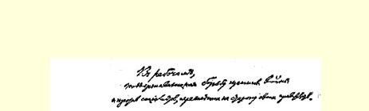
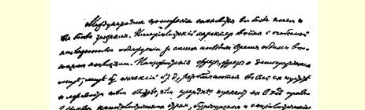
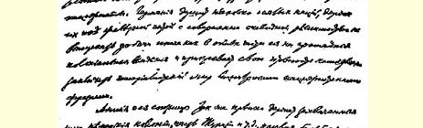
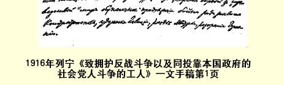

# 致拥护反战斗争以及同投靠本国政府的社会党人斗争的工人

> （１９１６年１２月２６日〔１９１７年１月８日〕以后）

国防局势日益明朗，也日益严重。最近，两大交战集团把这次战争的帝国主义性质暴露得特别明显。各资本主义国家的政府、资产阶级的和平主义者和社会党的和平主义者愈热中于和平主义的词句，愈热中于民主的和约和没有兼并的和约等词句，这些词句的毫无内容和极端虚伪就暴露得愈快。德国正在扼杀一些小民族，把它们置于铁蹄之下，还明目张胆地决定不放弃一切战利品，除非拿其中一部分换取一大片殖民地，它正在用一些假仁假义的和平主义词句来掩盖自己准备立即缔结帝国主义和约的打算。

英国和它的盟国也牢牢抓住它们占领的德国殖民地、土耳其的一部分领土等等，把为占领君士坦丁堡而进行的无休无止的大厮杀，把扼杀加里西亚、瓜分奥地利、搞垮德国，叫作为争取“公正的”和平而斗争。

如果每一个国家的群众不在无产阶级领导下进行反对本国政府的革命斗争，不推翻资产阶级统治，不实行社会主义变革，就谈不上真正反对战争、消灭战争和建立持久和平，—— 在大战初期只有少数人在理论上确信的这一真理，现在已为愈来愈多的觉悟工人清楚地意识到了。战争使各国人民的力量空前地集中起来，它本

> １９１６年列宁《致拥护反战斗争以及同投靠本国政府的
>
> 社会党人斗争的工人》一文手稿第１页
>
> （按原稿缩小） 身就把人类领上这条摆脱绝境的唯一出路，迫使人类沿着国家资本主义的道路上大踏步前进，并且实际表明，应当而且可以怎样在革命的无产阶级领导下不是为了资本家的利益，而是通过剥夺资本家，为了目前因战争所造成的饥饿和其他灾祸而面临死亡的群众的利益，实行有计划的社会经济。

这条真理愈明显，社会党的工作中的两种不可调和的倾向、政策和方向之间的鸿沟就愈深。我们在齐美尔瓦尔德代表会议上就指出了这两种倾向，当时我们就单独作为齐美尔瓦尔德左派出现， 会后又立即以这个左派的名义向各国社会党和全体觉悟的工人发表了一篇宣言。这条鸿沟隔开了如下的两方：一方企图掩饰已经暴露出来的正式的社会主义的破产，掩盖它的代表人物投靠资产阶级和各国政府的行为，使群众容忍这种对社会主义的彻底背叛；另一方则力求充分揭露这种破产的深刻程度，揭穿离开无产阶级而投靠资产阶级的“社会爱国主义者”的资产阶级政策，使群众摆脱他们的影响，为进行真正反对战争的斗争创造可能性和奠定组织基础。

在齐美尔瓦尔德代表会议上占多数的齐美尔瓦尔德右派，拼命反对同社会爱国主义者分裂和建立第三国际的想法。从那时以来，这种分裂在英国已经成为确凿的事实，而在德国，则１９１７年１ 月７日“反对派”的最近一次代表会议已向一切并非故意闭眼不看事实的人表明，实际上在这个国家里也有两个不可调和地敌对的工人政党在按照截然相反的方向进行工作：一个是社会主义的、以卡·李卜克内西等人为首的、在很大程度上从事秘密活动的党；另一个是彻头彻尾资产阶级的、社会爱国主义的、使工人容忍战争和迁就政府的党。世界上没有一个国家没有出现这种分裂。

在昆塔尔代表会议上，齐美尔瓦尔德右派已经不再占多数，因而不能再继续执行**自己的**政策了；这个右派投票赞成反对社会爱国主义的社会党国际局的决议，即对社会党国际局进行最严厉的谴责的决议，并赞成反对社会和平主义的决议，后一决议警告工人不要相信和平主义的谎言，不管这些谎言披着什么样的社会主义外衣。社会和平主义没有向工人说明，指望不推翻资产阶级、不建立社会主义就能求得和平乃是一种幻想，社会和平主义只是重弹资产阶级和平主义的老调，它诱劝工人相信资产阶级，掩盖各国的帝国主义政府和它们彼此间的交易，使群众放弃已经成熟、已经被事变提上日程的社会主义革命。

结果怎样呢？在昆塔尔代表会议以后，法、德、意等最大国家的齐美尔瓦尔德右派完全滚进了被这次代表会议所谴责和所屏弃的社会和平主义的泥坑！在意大利，社会党默认了本党议会党团和主要发言人屠拉梯的和平主义词句，虽然正是在目前这个时候，德国、协约国及一些中立国的资产阶级政府的代表（中立国的资产阶级已经和正在大发战争横财）也在使用完全相同的词句，正是在目前这个时候，这些和平主义词句的整个骗局已昭然若揭。实际上， 使用和平主义的词句是为了掩盖瓜分帝国主义赃物的斗争中的新的转变！

在德国，齐美尔瓦尔德右派的头子考茨基也发表了这种毫无内容、毫不负责、实际上只是让工人把希望寄托在资产阶级身上和相信幻想的和平主义宣言。德国的真正的社会党人，真正的国际主义者，即真正执行卡尔·李卜克内西策略的“国际”派和“德国国际社会党人”，应当正式声明同这个宣言毫无关系。

在法国，齐美尔瓦尔德代表会议的参加者梅尔黑姆、布尔德朗和昆塔尔代表会议的参加者拉芬－杜然，都投票**赞成**一些极其空洞的、按其客观意义来说虚伪透顶的和平主义的决议，这些决议在目前局势下对帝国主义资产阶级如此**有利**，以致在齐美尔瓦尔德和昆塔尔的历次声明中被斥责为社会主义叛徒的茹奥和列诺得尔也都投了赞成票！

梅尔黑姆和茹奥一道，布尔德朗、拉芬－杜然和列诺得尔一道，都投票赞成这些决议，这不是偶然的现象，不是个别的插曲，而是一个鲜明的标志，它说明社会爱国主义者早就到处准备同社会和平主义者**勾结在一起**，以便**反对**国际主义的社会党人。

许多帝国主义政府的照会中都使用和平主义词句，考茨基、屠拉梯、布尔德朗和梅尔黑姆也使用同样的和平主义词句，列诺得尔则友好地向这些政府和这些人伸出了手，—— 这一切都暴露了**实际**政策中的和平主义无非是对人民的一种**安慰**，无非是**帮助**各国政府驱使群众继续进行帝国主义大厮杀的一种手段！

瑞士是齐美尔瓦尔德派唯一可以自由集会并且有自己基地的欧洲国家，在这里，齐美尔瓦尔德右派的彻底破产暴露得更加明显。瑞士社会党在战争期间不受政府的任何阻挠召开过几次代表大会，并且最有条件促进德意志、法兰西、意大利工人反对战争的国际主义团结，它正式参加了齐美尔瓦尔德联盟。

可是现在，这个党的领袖之一，齐美尔瓦尔德代表会议和昆塔尔代表会议的主席，伯尔尼国际社会党委员会的最著名的成员和代表，国民院议员罗·格里姆，却在一个对无产阶级政党具有决定意义的问题上**转到本国**社会爱国主义者**方面去了**，在１９１７年１月 ７日瑞士社会党执行委员会会议上，他设法通过了一项决议：不定期地推迟为解决关于保卫祖国问题以及对待曾谴责过社会和平主义的昆塔尔代表会议的各项决议的态度问题而专门召开的代表大会！

格里姆在１９１６年１２月发表的国际社会党委员会签署的号召书中，说各国政府的和平主义词句是欺人之谈，但是他一个字也没有谈到把梅尔黑姆和茹奥、拉芬－杜然和列诺得尔联系在一起的社会和平主义。格里姆在这个号召书中呼吁社会党的少数派进行斗争，反对各国政府及其社会爱国主义的仆从，但与此同时，他却同瑞士党内的“社会爱国主义的仆从”一道**埋葬**党代表大会，这就激起了瑞士工人中一切觉悟而忠诚的国际主义者的正当的义愤。

１９１７年１月７日党执行委员会的决议表明，瑞士社会爱国主义者已完全**战胜了**瑞士社会党工人，瑞士的反对齐美尔瓦尔德运动的人已完全**战胜了**齐美尔瓦尔德运动，这一事实是任何借口也掩盖不了的。

资产阶级在工人运动中的忠实而公开的奴仆的报纸《格留特利盟员报》说出了人所共知的真相，它说格雷利希、普夫吕格尔之类的社会爱国主义者（还可以而且应当把宰德尔、胡贝尔、朗格、施内贝格尔、迪尔之流加进去）不让召开代表大会，不让工人解决关于保卫祖国的问题，并且威胁说，如果召开代表大会并根据齐美尔瓦尔德精神来解决这个问题，他们就**辞去议员职务**。

格里姆在党执行委员会会议上和在１９１７年１月８日的《伯尔尼哨兵报》上，散布令人愤慨和令人难以容忍的谎言，借口工人还没有准备、必须掀起制止物价飞涨的运动、“左派”自己也同意延期等等，来替延期召开代表大会辩护。１３２

实际上正是左派，即忠诚的齐美尔瓦尔德派，一方面为了考虑到两害相权取其轻，另一方面为了揭穿社会爱国主义者和他们的新伙伴格里姆的真正意图，曾经提议延期到**３月**，投票时又赞成延期到**５月**，并且建议各州执行委员会会议在**７月**以前召开，但是***所有***这些建议都被以齐美尔瓦尔德代表会议和昆塔尔代表会议的主席罗·格里姆为首的“祖国保卫者”拒绝了！！

实际上问题恰恰在于：或者容忍伯尔尼国际社会党委员会和格里姆的报纸大骂**外国的**社会爱国主义者，起初以沉默，后来以罗 ·格里姆的叛变来**掩护瑞士的**社会爱国主义者；或者执行真正的国际主义政策，首先同**本国的**社会爱国主义者进行斗争。

实际上问题在于：或者用革命的词句掩盖社会爱国主义者和改良主义者在瑞士党内的统治；或者在制止物价飞涨问题和反对战争问题上，在把社会主义革命提上日程的问题上，提出**革命的**纲领和策略以反对社会爱国主义者。

实际上问题在于：或者容忍在齐美尔瓦尔德运动内恢复可耻地破产了的第二国际的坏传统，容忍人们把领袖们在党执行委员会内的决定和言论对工人群众隐瞒起来，容忍人们用革命词句掩饰社会爱国主义者和改良主义者的卑鄙行为；或者作**真正的**国际主义者。

实际上问题恰恰在于：***或者***在瑞士（它的党对整个齐美尔瓦尔德联盟具有头等重要意义）坚持明确的、有原则的、政治上诚实的划分：把社会爱国主义者同国际主义者、资产阶级改良主义者同革命者区别开来，把帮助无产阶级实现社会主义革命的无产阶级顾问同企图用改良和改良诺言引诱工人放弃革命的资产阶级代理人或“仆从”区别开来，把格留特利派同社会党区别开来；——***或者***模糊和腐蚀工人的意识，在社会党内执行格留特利派即社会党自己队伍中的社会爱国主义者的“格留特利”政策。

让瑞士社会爱国主义者这些想在党内执行格留特利政策即本国资产阶级政策的“格留特利派”去咒骂外国人吧，让他们去保卫瑞士党的“不可侵犯性”而拒绝其他党的批评吧，让他们坚持使德国党和其他一些国家的党在１９１４年８月４日遭到破产的资产阶级改良主义的陈腐政策吧，我们这些不是口头上而是行动上拥护齐美尔瓦尔德联盟的人，把国际主义理解为另一种东西。

我们决不能对已经彻底暴露的、被齐美尔瓦尔德代表会议和昆塔尔代表会议的主席推崇备至的下列企图熟视无睹：原封不动地保留腐朽的欧洲社会主义运动中的一切，通过虚伪地宣称同卡 ·李卜克内西团结在一起来**回避**这位国际工人领袖的实际口号， **回避**他的“从上到下革新”各个旧党的号召。我们相信，全世界热烈拥护卡·李卜克内西和他的策略的一切觉悟工人，都站在我们一边。

我们要公开揭露已转到资产阶级改良主义的和平主义方面去的齐美尔瓦尔德右派。

我们要公开揭露罗·格里姆背叛齐美尔瓦尔德运动的行为， 要求召开代表会议，解除他的国际社会党委员会成员的职务。

齐美尔瓦尔德这个词是国际社会主义和革命斗争的口号。这个词不应当被用来掩饰社会爱国主义和资产阶级改良主义。

拥护真正的国际主义！真正的国际主义要求**首先**反对本国的社会爱国主义者。拥护真正的革命策略！而要实行这种策略，就不能同社会爱国主义者妥协来**反对**社会主义的革命工人。

> 载于１９２４年《无产阶级革命》杂志译自《列宁全集》俄文集５版第５期第３０卷第２９６—３０５页