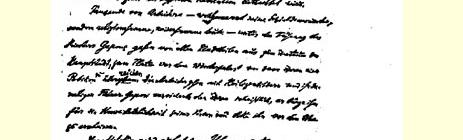
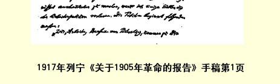

# 关于１９０５年革命的报告

１４７

> （１９１７年１月９日〔２２日〕）

青年朋友们，同志们！

今天我们纪念“流血星期日”十二周年，我们有充分理由把这一天看作俄国革命的开端。

成千上万的工人—— 他们并不是社会民主主义者，而是信仰上帝、忠于皇上的人—— 在加邦神父的率领下，从城内各个地方前往首都中心区，前往冬宫前的广场，以便向沙皇呈递请愿书。工人们举着圣象前进，而他们当时的领袖加邦已经上书沙皇，保证他的人身安全，请求他出来接见人民。

军队调来了。轻骑兵和哥萨克挥舞军刀扑向人群，开枪扫射跪下来央求哥萨克放他们过去谒见沙皇的手无寸铁的工人。根据警察局的报告，当场死了１０００多人，伤了２０００多人。工人的愤怒不是笔墨所能形容的。

这就是１９０５年１月２２日流血星期日的大致情况。

为了使你们更清楚地了解这个事件的历史意义，我不妨把工人的请愿书念几段给你们听听。请愿书的开头是这样的：

> “我们，住在彼得堡的工人，特来求见陛下。我们是些不幸的、受到侮辱的奴隶，我们备受专横暴政的欺压。当我们忍无可忍的时候，我们停止了工作， 请求我们的厂主哪怕是给我们生活中必不可少的东西。但是这个要求被拒绝了，因为厂主认为这一切都是不合法的。我们这里成千上万的工人也象全俄国的人民一样，没有一点人权。由于陛下的官吏之故，我们已变成了奴隶。”

请愿书列举了下面的要求：实行大赦，实现舆论自由，发给正常的工资，逐步把土地转交给人民，根据普遍的、平等的选举召开立宪会议。请愿书最后写道：

> “陛下！请不要拒绝帮助您的人民！请消除陛下和人民之间的隔阂吧！请陛下降旨，并宣誓实现我们的请求，那时陛下将使俄国变成一个幸福的俄国！ 否则，我们就准备死在这里。我们只有两条道路：不是自由和幸福，就是坟墓。”
>
> **现在**人们读这份由神父领导的没有文化教养的工人的请愿书的时候，会产生一种特殊的感觉。人们不禁会感到，这份天真的请愿书同那些想以社会主义者自居、实际上不过是资产阶级清谈家的社会和平主义者目前作出的各种和平决议，颇为相似。革命前俄国的没有受过教育的工人不知道：沙皇是一个**统治阶级**即大地主阶级的首脑，这些大地主已经同大资产阶级有千丝万缕的联系，并且准备用一切暴力手段来维护他们的垄断、特权和利润。今天的社会和平主义者总想以“受过高等教育的”人士自居—— 可不是开玩笑的！—— 但是他们不知道，期待正在进行帝国主义强盗战争的资产阶级政府来实现“民主的”和平，正如以为通过和平请愿能推动血腥的沙皇实行民主改革的想法一样，是非常愚蠢的。

尽管这样，他们之间仍然有很大的区别：今天的社会和平主义者在很大程度上是伪君子，他们企图通过心平气和的劝说使人民脱离革命斗争；而革命前俄国没有受过教育的俄国工人，却用事实证明了他们是正直的人，他们第一次觉醒过来，开始具有政

> １９１７年列宁《关于１９０５年革命的报告》手稿第１页
>
> （按原稿缩小） 治觉悟。

而１９０５年１月２２日的历史意义，恰恰在于广大人民群众的这种觉醒：他们开始具有政治觉悟并且起来进行革命斗争。

“俄国还没有革命的人民”，—— 当时俄国自由派的领袖彼得 ·司徒卢威先生在“流血星期日”**前两天**这样写道，他那时在国外办了一个自由的、秘密的刊物。在这位“受过高等教育的”、高傲自大的和愚蠢透顶的资产阶级改良主义者的领袖看来，认为没有文化的农民国家能够产生革命的人民，这种想法是荒谬绝伦的！当时的改良主义者正如现在的改良主义者一样，深信不可能发生真正的革命！

１９０５年１月２２日（俄历９日）以前，俄国的各革命党派都是由很少的一群人组成的，而当时的改良主义者（也正象现在的改良主义者一样！）骂我们是“宗派”。几百名革命组织者，几千名地方组织的成员，每月最多不过出版一次的半打革命小报（这些小报主要是在国外出版，经过重重困难，付出重大代价，辗转寄到俄国），这就是１９０５年１月２２日以前以革命的社会民主党为首的俄国各革命党派的情况。这种情况就给既目光短浅又目空一切的改良主义者提供了一种表面上的理由，断言俄国还没有革命的人民。

但是，在几个月之内，情况就大变了！几百名革命的社会民主党人“突然”增加到了几千名，这几千名革命的社会民主党人又成了两三百万无产者的领袖。无产阶级的斗争在５０００—１００００万农民群众当中引起了巨大的风潮，在有的地方还引起了革命运动；农民运动得到了军队的响应，又引起了军人的起义，并且使得一部分军队同另一部分军队发生武装冲突。于是这个拥有１３０００万人口的大国就陷入了革命之中，于是这个昏睡的俄国就变成了革命无产阶级和革命人民的俄国。

必须研究这次转变，了解它的可能性，它的所谓方法和道路。

这次转变的最重要手段就是**群众性的罢工**。俄国革命的特点就在于：按其社会内容来说是**资产阶级民主**革命，按其斗争手段来说却是**无产阶级**革命。这次革命之所以是资产阶级民主革命，因为它直接追求的而且依靠自己的力量所能够直接达到的目的，是建立民主共和国、实行八小时工作制和没收大量的贵族大地产，即 １７９２年和１７９３年的法国资产阶级革命大部分已经实现了的一些措施。

俄国革命同时也是无产阶级革命，不仅因为无产阶级是运动的领导力量和先锋队，而且还因为无产阶级特有的斗争手段即**罢工**，是发动群众的主要方法，是种种具有决定意义的事件波浪式前进中的最突出的现象。

俄国革命是世界历史上群众性的政治罢工起了非常巨大作用的**第一次**—— 但决不是最后一次—— 伟大的革命。是的，如果不根据**罢工的统计材料**来研究俄国革命的种种事件以及革命的政治形式更换的**基础**，那就永远也不能了解这些事件以及政治形式的更换。

我很清楚地知道，干巴巴的统计数字是非常不适合作口头报告的，是会把听众吓跑的。但是为了使你们能够估价整个运动的真正客观基础，我还是不能不引证几个化成整数的数字。俄国在革命前１０年内，罢工者的人数平均每年为４３０００。所以在革命前整整 １０年里，罢工者的总数为４３万。１９０５年１月，即革命的第一个月内，罢工者的人数为４４万。这就是说，在仅仅１个月之内就比在过去整整１０年中还**多**！

在世界上任何一个资本主义国家，甚至在最先进的国家如英国、美国和德国，都没有发生过象１９０５年俄国那样大规模的罢工运动。罢工者的总数为２８０万，比工厂工人总数多一倍！这当然不是说，俄国城市工厂工人比他们的西欧弟兄教育程度更高、更有力量或斗争能力更强。其实恰好相反。

但是，这表明无产阶级的潜力是多么巨大。这表明，在革命时期—— 根据俄国历史上的最确切的材料，我可以毫不夸大地肯定说—— 无产阶级**能够**发挥比平时大**一百倍**的斗争力量。这表明，人类直到１９０５年还不知道，当要真正为了伟大目标而斗争、真正革命地进行斗争的时候，无产阶级的力量可以并且一定会增加到多么令人吃惊、多么了不起的程度！

俄国革命的历史告诉我们，最英勇不屈、最奋不顾身地进行斗争的，正是雇佣工人的先锋队，雇佣工人的精华。工厂的规模愈大， 罢工就进行得愈顽强，在同一年内罢工的次数就愈多。城市愈大， 无产阶级在斗争中的作用也就愈大。在工人觉悟程度最高和人数最多的三个大城市—— 彼得堡、里加和华沙，罢工的人数，按工人总数的比例来说，要比其他一切城市的罢工人数多得多，更不用提农村了。[^1]

俄国的五金工人—— 在其他资本主义国家大概也一样—— 是无产阶级的先锋队。在这里我们看到一个富有教益的事实：在 １９０５年，俄国全国每１００个工厂工人当中，罢工者有１６０人次。而在同年，每１００个**五金工人**当中，罢工者有３２０人次！据统计，在 １９０５年，每一个俄国工厂工人因为罢工平均要损失１０个卢布（按战前汇率，约合２６个法郎），可以说这是为了斗争而作出的牺牲。 如果我们只拿五金工人来说，那么我们所得到的数目就要比这**大两倍**！工人阶级最优秀的分子走在前面，吸引动摇者，唤醒沉眠者， 鼓励软弱者。

一个突出的特点是，在革命时期**经济**罢工和政治罢工交织在一起。毫无疑问，只有把这两种罢工形式紧密结合起来，才能保证运动具有强大的威力。如果被剥削的广大群众不是每天都直接看到一些例子，说明各个工业部门的雇佣工人怎样迫使资本家立即直接改善他们的生活状况，那么要把这些群众吸引到革命运动中来是不可能的。这个斗争使全俄国人民群众的精神面貌为之一新。 只是到这个时候，农奴制的、沉睡不醒的、宗法制的、虔信宗教的、 恭顺的俄国，才真正从自己身上抛掉了旧亚当１４８；只是到这个时候，俄国人民才受到了真正民主的、真正革命的教育。

如果说资产阶级先生们以及他们的俯首贴耳的应声虫，即社会党内的改良主义者，也装模作样地谈论“教育”群众，那么他们所谓的教育通常是指摆出一副老师架子，搞学究式的东西，腐蚀群众，向群众灌输资产阶级偏见。

离开群众本身的独立政治斗争特别是革命斗争，在这种斗争之外，永远不可能对群众进行真正的教育。只有斗争才能教育被剥削的阶级，只有斗争才能使它认识到自己的力量有多大，扩大它的眼界，提高它的能力，启迪它的智力，锻炼它的意志。因此，甚至连反动派也不得不承认，１９０５年这个斗争的一年，这个“疯狂的一年”，把宗法制的俄国最终埋葬了。

现在我们进一步来看看１９０５年罢工斗争时俄国五金工人和纺织工人的对比情况。五金工人是工资最高、最有觉悟、最有文化的无产者。１９０５年，俄国纺织工人的人数，比五金工人多一倍半以上，他们是最落后的、工资最低的群众，他们往往还没有同自己在乡间的农民家庭完全割断联系。这里我们可以看到如下的非常重要的事实。

在整个１９０５年当中，特别是在年底，五金工人的罢工表明，政治罢工超过了经济罢工。反之，我们看到，在纺织工人当中，１９０５ 年初，**经济**罢工占压倒优势，只是到年底才转变为政治罢工占优势。因此，显而易见，只有经济斗争，只有为争取立即直接改善其生活状况的斗争，才能唤醒被剥削群众最落后的部分，才能给他们真正的教育，并且—— 在革命时代—— 在短短几个月之内把他们组成政治战士的军队。

要做到这一点，当然必须使工人的先锋队不要把阶级斗争理解成为少数上层分子谋利益的斗争，如同改良主义者经常蒙骗工人的那样，而要使无产者真正成为大多数被剥削者的先锋队，引导这大多数人本身参加斗争，如同在１９０５年的俄国曾经发生的情形那样，如同在即将到来的欧洲无产阶级革命中无疑应当发生而且一定会发生的情形那样。[^2]

１９０５年初，在全国出现了第一次罢工运动的巨大浪潮。同年春天，我们看到第一次大规模的，不仅是经济的而且是政治的**农民运动**已在俄国兴起。这个转折具有什么样的划时代的意义，只有记得如下情况的人才能了解，这种情况就是：俄国的农民只是在 １８６１年才摆脱了最恶劣的农奴制度，他们大部分人都是文盲，生活极其贫困，受地主压迫，被神父愚弄，由于相隔很远，交通几乎完全闭塞，他们互相不通往来。

１８２５年俄国第一次发生了反对沙皇制度的革命运动，参加这次运动的几乎全是贵族。１４９从那时候起，到１８８１年亚历山大二世被恐怖分子刺死时止，站在运动前列的都是中间等级的知识分子。 他们发扬了高度的自我牺牲精神，并且以自己英勇的、恐怖主义的斗争方法震惊了全世界。毫无疑问，这些牺牲并不是枉然的，他们直接或间接地促进了以后俄国人民的革命教育。但是他们的直接目的，即唤起人民革命这个目的，并没有达到而且也不可能达到。

只有无产阶级的革命斗争才达到了这个目的。只有蔓延全国的群众性罢工浪潮，加上日俄帝国主义战争的惨痛教训，才把广大的农民群众从沉睡中唤醒。“罢工者”这个词在农民中间获得了新的意义：它的含义同叛逆者、革命者之类的词相近，而这以前是由 “大学生”这个词表达的。但是“大学生”属于中等阶层，属于“有学问的人”，属于“绅士”，所以他们对于人民是异己的。相反，“罢工者”却来自民间，本身也是被剥削者；他们被赶出彼得堡之后，常常回到农村，向自己的农村同志们讲述那已经烧遍了城市的、既反对资本家也反对贵族的烈火。在俄国农村中出现了新型的人—— 青年农民，即所谓“有觉悟的人”。他们同“罢工者”联系，他们读报纸， 向农民讲述城里发生的事件，向农村的同志们解释政治要求的意义，并且号召他们去进行反对贵族大地主、反对神父和官吏的斗争。

农民成群地聚集起来，讨论自己的处境，逐渐地加入了斗争： 他们成群结队地起来反对大地主，烧毁他们的邸宅和庄园，或者抢劫他们的财物，夺取他们的粮食和其他的生活用品，打死警察，要求把贵族的土地即大地产转交给人民。

１９０５年春天，农民运动还只是处于萌芽状态，它所波及的县份还只是少数，即１７左右。

但是，城市无产阶级的群众性罢工和农村农民运动的结合，已足以动摇沙皇政府最“牢固的”和最后的支柱。我指的是**军队**。

海军和陆军中的**军人起义**开始了。在革命时期，每次罢工运动和农民运动浪潮的高涨，都伴随着全国各地的军人起义。其中最有名的一次起义就是黑海舰队“波将金公爵号”铁甲舰的起义。“波将金公爵号”铁甲舰落入起义者手中之后，参加了敖德萨的革命，这次革命失败后，曾企图占领其他港口（如克里木的费奥多西亚），也没有成功，终于在康斯坦察投降了罗马尼亚当局。

现在我来跟你们详细谈谈黑海舰队这次起义中的一段小插曲，使你们能够具体了解事件发展到高潮时的情况：

> “革命的工人和水兵举行会议，这些会议日益频繁起来。因为不准军人参加工人的群众大会，所以工人就成群结队地开始来参加士兵的群众大会。参加会议的有成千上万的人。共同起事的主张获得了热烈的响应。在一些进步的连队里选出了代表。
>
> 于是军事当局决定采取措施。有些军官企图在群众大会上发表‘爱国的’ 演说，可是结果很惨：那些善于争论的水兵迫使自己的长官抱头鼠窜。由于这种办法不灵，便决定完全禁止召开群众大会。１９０５年１１月２４日早晨，把一个全副武装的战斗连布置在海军营房的大门口。海军少将皮萨列夫斯基厉声命令说：‘不准任何人走出营房！违者枪毙！’水兵彼得罗夫从接受命令的这个连里走出来，当众把子弹上了膛，第一枪打死了比亚韦斯托克团里的上尉施泰因，第二枪打伤了海军少将皮萨列夫斯基。一个军官指挥说：‘逮捕他！’可是大家一动也没有动。彼得罗夫把自己的枪丢在地上说：‘你们干吗站着不动？把我抓起来吧！’彼得罗夫被逮捕了。水兵们马上就从四面八方蜂拥而上， 激烈地要求释放彼得罗夫，并且表示他们愿意给他担保。激愤的情绪达到了顶点。
>
> —— 彼得罗夫，开枪是因为走火，对吗？—— 为了打开僵局，一个军官这样问道。
>
> —— 怎么是走火呢？我走了出来，装上子弹，瞄准开枪，难道这是走火吗？
>
> —— 他们都要求释放你……
>
> 彼得罗夫终于被释放了。但是水兵们并不以此为满足，于是逮捕了所有的值勤军官，解除了他们的武装，并且把他们押送到办公室…… 约有４０人的水兵代表商讨了一个通宵。决定释放这些军官，但是不准他们再到营房里来……”

这段不长的描述形象地告诉你们，多数军人起义事件是怎样发生的。人民中间的革命风潮不能不影响到军队。值得注意的是， 运动的领袖都是海军和陆军中的**那样一些**分子，他们主要是从产业工人中征募来的，他们有高度的技术素养，例如**工兵**。但是广大的群众都还太幼稚，太温和，太宽大，太富有基督教徒式的情绪。他们很容易激动，只要有一点不平，或者长官态度粗暴，伙食不好等等，都能引起他们的愤怒。但是缺乏坚毅的精神，对任务没有明确的认识。他们不了解，只有坚决继续进行武装斗争，战胜一切军事当局和民政当局，推翻政府和夺取全国政权，才是革命成功的唯一保证。

广大的海陆军士兵群众很容易哗变。但是他们也很容易做出象释放被捕军官这样幼稚的蠢事；他们轻信当局的诺言和劝说；这样当局就赢得了宝贵的时间，获得了援兵，瓦解了起义者的力量， 最后就实行极其残酷的镇压，并且把领导者处死。

把１９０５年俄国的军人起义和１８２５年十二月党人的军人起义对比一下是特别有趣的。在１８２５年，领导政治运动的几乎全是军官，即由于在拿破仑战争期间接触到欧洲的民主思想而受了感染的一些贵族军官。当时还是由农奴组成的士兵群众抱消极态度。

１９０５年的历史向我们表明的情形却完全相反。当时的军官， 除少数人外，不是具有资产阶级自由主义和改良主义情绪，就是具有直接反革命的情绪。而身穿军装的工人和农民则是起义的灵魂： 运动成了人民性的运动，它在俄国历史上第一次席卷了大多数被剥削者。当时所缺少的东西，一方面是群众缺乏刚毅果断的精神， 极容易犯轻信的毛病，另一方面是身穿军装的革命社会民主党工人还缺乏组织，他们不懂得要掌握领导权，要领导革命的军队并且向政府的权力发动进攻。

顺便说一说，这两个缺点不仅会被资本主义的一般发展而且会被目前的战争所消除，—— 这也许比我们所希望的要慢一些，但那是确定无疑的……[^3]

无论如何，俄国革命的历史，同１８７１年巴黎公社的历史一样， 使我们得到了一次无可争辩的教训：除非通过人民的军队的这一部分反对其另一部分的胜利斗争，在任何时候和任何场合下用任何其他的方式方法，都不可能战胜和消灭军国主义。光靠指责、咒骂、“否定”军国主义，批评和证明它的危害性是不够的，和平地拒绝服兵役是愚蠢的，我们的任务在于牢牢保持无产阶级的革命意识，并且不仅一般地而且具体地培养它的优秀分子，使他们在人民中一旦发生大风潮的时候能领导革命的军队。

任何一个资本主义国家的每天的经验，都是这样教导我们的。 这些国家所经历的每个“小”危机，都小规模地向我们显示战斗的因素和萌芽，而这些战斗在大危机中不可避免地要大规模地反复进行。比如，任何一次罢工不是资本主义社会的小危机又是什么呢？普鲁士内务大臣冯·普特卡默先生说过一句有名的话：“在每一次罢工中都潜伏着革命这条九头蛇１５０。”他说得难道不对吗？在一切资本主义国家里，甚至在所谓最和平、最“民主的”资本主义国家里，一发生罢工就调动军队，这不是向我们表明，在真正的大危机中，事情会是**怎样**的吗？

现在我必须回头谈俄国革命的历史。

我已经向你们说明，无产阶级的罢工怎样震撼了全国，震撼了最广大、最落后的被剥削者阶层，农民运动是怎样开始的，它怎样得到军人起义的配合。

１９０５年秋天，整个运动达到了最高点。８月１９日（６日），沙皇颁布了成立帝国代表机关的诏书。所谓布里根杜马应当根据选举法建立，可是这个选举法规定只有少得可笑的人数有选举权并且 **没有**赋予这个特殊的“议会”任何立法权，而只是给它以**咨议**协商的权力！

资产阶级、自由派、机会主义者都准备用双手来接受吓得魂不附体的沙皇的这份“礼物”。同所有的改良主义者一样，１９０５年俄国的改良主义者也同样不能了解：在某种历史情况下，改良特别是关于改良的诺言所追求的**唯一**目的，就是要平息人民的风潮，迫使革命的阶级停止斗争，或者至少是要放松斗争。

俄国革命社会民主党非常清楚地了解１９０５年８月钦赐、施舍假宪法这种做法的真正性质。因此它及时地提出了口号：不要“咨议性”杜马！抵制杜马！打倒沙皇政府！继续进行革命斗争，以便推翻沙皇政府！在俄国召集第一个真正人民代表会议的不应当是沙皇，而应当是临时革命政府！

历史证明了革命社会民主党人是正确的，因为**布里根杜马**始终没有召集起来。它还没有召集就被革命的风暴扫除了；革命的风暴迫使沙皇颁布新的选举法，这个选举法大大增加了选举者的人数，并且承认了杜马具有立法的性质。[^4]

１９０５年的１０月和１２月，标志着俄国革命上升线的最高点。 人民的革命力量的一切源泉比从前更广泛地涌现出来了。参加罢工的人数，正象我已经告诉你们的，在１９０５年１月是４４万，１９０５ 年１０月超过了**５０万**，请注意，这仅仅是一个月的数字！并且这**只是**工厂工人的罢工人数，几十万铁路工人、邮电职员等尚未计算在内。

俄国的铁路总罢工使铁路运输中断了，使政府权力严重地陷于瘫痪。大学的大门被打开了，讲堂在平时是专门用教授的哲理麻醉青年人的头脑、使他们成为资产阶级和沙皇政府忠实奴仆的地方，现在却变成千千万万的工人、手工业者、职员公开地、自由地讨论政治问题的集会场所了。

出版自由争到了。书报检查干脆被取消了。任何一个出版者都不敢向当局呈送审查样本，而当局也不敢采取任何措施来加以干涉。在俄国历史上，第一次在彼得堡和其他城市自由地出版革命的报纸。仅仅在彼得堡就有社会民主党的三种日报，印数在５万份到１０万份之间。

无产阶级走在运动的前列。他们给自己提出的任务是用革命手段争取八小时工作制。那时彼得堡无产阶级的战斗口号是：“**八小时工作制和武器**！”愈来愈多的工人认识到，只有武装斗争才能决定而且将决定革命的命运。

在斗争的烈火中一个特殊的群众组织—— 著名的**工人代表苏维埃**即各工厂代表的会议建立起来了。在俄国若干城市中，这些**工人代表苏维埃**日益起着临时革命政府的作用，起着起义的机关和领导者的作用。当时曾经试图建立士兵和水兵代表苏维埃，并且把它们和工人代表苏维埃联合起来。

在这些日子里，俄国某些城市经历了一段各种地方性的小“共和国”的时期，在这些地方，政府的权力被推翻了，工人代表苏维埃真正发挥了新的国家政权的职能。遗憾的是，这段时期太短了，“胜利”太脆弱、太孤立了。

１９０５年秋天，农民运动发展到更大的规模。当时，所谓的“农民骚动”和真正的农民起义席卷了全国**三分之一**以上的县份。农民放火烧毁了约２０００个庄园，分掉了贵族强盗从人民那里抢走的生活资料。

可惜这件事情干得很不彻底！可惜农民当时只消灭了全部贵族庄园的**十五分之一**左右，只消灭了要从俄国土地上彻底洗刷掉封建大地产的污点就**应当**全部予以消灭的东西的十五分之一。可惜农民的行动太分散、太无组织、太缺乏攻势，而这也是革命遭到失败的根本原因之一。

民族解放运动在俄国各被压迫民族中如熊熊烈火燃烧起来了。在俄国，**半数以上**，**几乎五分之三**（确切地说：５７％）的居民遭受着民族压迫，他们甚至没有使用母语的自由，他们被强制实行“俄罗斯化”。例如，占俄国几千万居民的穆斯林，当时以惊人的速度 —— 一般说来，那正是各种组织大发展的时代—— 组成了穆斯林同盟。

为了向到会的人，特别是向青年说明当时俄国的民族解放运动怎样随着工人运动高涨起来，我不妨给你们举一个小小的例子。

１９０５年１２月，在几百个学校里，波兰学生烧毁了所有的俄文书籍、图片和沙皇的肖像，殴打了俄国教员和俄国同学，把他们赶出了学校，并且喊道：“滚回俄国去！”各中学的波兰学生还提出了如下的要求：“（１）所有的中等学校必须归工人代表苏维埃领导； （２）在各学校召开学生和工人联席会议；（３）准许在各中学穿红色短衫，作为学校属于未来无产阶级共和国的标志”，等等。

运动的浪潮愈高，反动派在反对革命的斗争中就武装得愈卖力、愈坚决。１９０５年的俄国革命，证实了卡·考茨基于１９０２年在他的《社会革命》一书中所写的东西（顺便说一下，他当时还是一个革命的马克思主义者，而不是象现在这样为社会爱国主义者和机会主义者作辩护）。他写道：

> “……今后的革命……恐怕不会是突如其来的反对政府的起义，而多半是持久的**国内战争……”**

事情果真如此！在今后的欧洲革命中，事情也必将如此！

沙皇政府对犹太人特别仇视。一方面，在革命运动的领袖当中犹太人占的百分比（同犹太居民总人数相比较）特别大。顺便说一下，即使现在犹太人还有这样的功劳：在国际主义派的代表中他们所占的百分比比其他民族大得多。另一方面，沙皇政府很善于利用最无知的居民阶层对犹太人的最卑劣的偏见。于是发生了多半受到警察支持的、甚至由警察直接领导**反犹暴行**—— 在这个时期， １００个城市里有４０００多人被打死，１００００多人被打成残废—— 这种对犹太平民以及对他们的妻子儿女所进行的骇人听闻的摧残， 引起了整个文明世界对血腥的沙皇政府的强烈的反感。我所指的当然是文明世界真正的民主分子的反感，这样的分子只能是社会主义的工人，即无产者。

资产阶级，即使是西欧最自由的共和国里的资产阶级，也善于巧妙地把反对“俄国的野蛮行为”的虚伪词句同最无耻的现金交易结合起来，特别是同在财政上支持沙皇政府以及通过资本输出对俄国进行帝国主义的剥削等结合起来。

莫斯科的十二月起义是１９０５年革命的顶点。一批人数不多的起义者，即一批已经组织起来和武装起来的工人—— 他们总共不超过８０００人—— 同沙皇政府进行了９天的战斗，沙皇政府非但不能信赖莫斯科的卫戍部队，反而必须把他们禁锢起来，只是由于从彼得堡调来了谢苗诺夫团，才算把起义镇压下去。

资产阶级喜欢把莫斯科的十二月起义叫作什么“人为的东西” 而加以嘲笑。例如在德国的所谓“科学”界麦克斯·维贝尔教授先生就在一部论俄国政治发展的巨著中称莫斯科起义为“盲动”。这位“博学的”教授先生写道：“……列宁集团和一部分社会革命党人早就**准备了**这次**愚蠢的**起义……”

要估价这位胆小的资产阶级教授的智慧，回忆一下枯燥的罢工统计数字也就够了。１９０５年１月，在俄国参加纯政治罢工的人数只有１２３０００，在１０月份有３３万，**在１２月份达到了最高点**，就是说，参加纯政治罢工的人数仅仅在一个月之内就有**３７万**！回忆一下革命的增长，回忆一下农民和军人的起义，我们马上可以断定：资产阶级“科学界”对十二月起义的评价不仅是荒谬的，而且是胆小的资产阶级代言人的无可奈何的遁词，因为资产阶级把革命的无产阶级看作是自己最危险的阶级敌人。

实际上，俄国革命的整个发展，必然导致沙皇政府同具有阶级觉悟的无产阶级先锋队之间的武装决战。

我在上面的论述中已经指出了俄国革命遭到暂时失败的弱点在哪里。

从十二月起义被镇压时起，革命就开始走下坡路。在这段时期中也发生了一些非常有趣的情况，特别是工人阶级中最有战斗精神的分子曾经两次企图中止革命的总退却，并且把这种退却变为新的进攻。

我作报告的时间快要完了，我不想多耽搁听众的时间。对于了解俄国革命最重要的东西，如革命的阶级性质、革命的动力和它的斗争手段这样的大题目，我认为，在一个简短的报告中一般所能谈到的，我都谈了。[^5]

关于俄国革命的世界意义，我还想作几点简单的说明。

俄国在地理上、经济上和历史上不仅属于欧洲，而且还属于亚洲。因此我们看到，俄国革命不仅彻底地把欧洲最大最落后的国家从睡梦中唤醒过来，造就了由革命无产阶级领导的革命的人民。

不仅如此。俄国革命使整个亚洲动起来了。土耳其、波斯、中国的革命证明，１９０５年的强大起义留下了深刻的痕迹，它在**数以亿万计的**人们的前进运动中发生的影响是非常深远的。

俄国革命也间接地影响了西方各国。不应忘记，当关于沙皇的立宪诏书的电报于１９０５年１０月３０日到达维也纳的时候，这个消息对普选权在奥地利的最终胜利起了决定性的作用。

在奥地利社会民主党代表大会会议上，当埃伦博根同志—— 那时他还不是社会爱国主义者，而是一位同志—— 在作关于政治罢工的报告的时候，有人把这份电报放在他面前的桌子上。讨论立刻就停止了。我们到街上去！这个呼声响彻奥地利社会党代表集会的大厅。于是接连几天，在维也纳发生了几次大规模的街头游行示威，在布拉格出现了街垒。普选权在奥地利的胜利被决定了。

经常可以听到西欧人这样评价俄国革命：似乎这个落后国家中的事变、过程和斗争方法很难同西欧的条件相比较，因此未必会有什么实际意义。

没有比这种看法更错误的了。

毫无疑问，在未来的欧洲革命中，未来的斗争形式和导火线， 在很多方面都会与俄国革命中的不同。

但是，尽管这样，俄国革命—— 正因为具有我说过的那种特殊意义的无产阶级性质—— 仍然是未来欧洲革命的序幕。毫无疑问， 未来的这次革命，也只能是无产阶级革命，并且是在更深刻得多的意义上，即按其内容来说也只能是无产阶级的、社会主义的革命！ 未来的这次革命将在更大得多的范围内表明：一方面，只有严酷的斗争，即国内战争，才能把人类从资本压迫下解放出来；另一方面， 只有具有阶级觉悟的无产者才能成为而且一定会成为绝大多数被剥削者的领袖。

我们不要为欧洲目前死气沉沉的静寂所欺骗。欧洲孕育着革命。帝国主义战争的奇灾大祸，物价飞涨的痛苦使得到处都在产生革命情绪，而各国的统治阶级即资产阶级及其代办即各国政府愈来愈陷入绝境，如果没有极大的震动，它们是决不能找到出路的。

如同１９０５年在俄国兴起了无产阶级领导下的、反对沙皇政府、争取民主共和制的人民起义一样，在最近几年内，正是由于这次强盗战争，欧洲也会发生无产阶级领导下的、反对金融资本权力、反对大银行、反对资本家的人民起义，而这些震动只能以剥夺资产阶级和取得社会主义的胜利而告终。

我们这些老年人，也许看不到未来这次革命的决战。但是我认为，我能够满怀信心地表示这样的希望，那就是现在正在瑞士和全世界社会主义运动中出色地工作着的青年们，会有幸在未来的无产阶级革命中不仅参加斗争，而且取得胜利。

> 载于１９２５年１月２２日《真理报》译自《列宁全集》德文版第１８号第２３卷第２４４—２６２页

[^1]: 手稿上这一段被勾去了。—— 俄文版编者注

[^2]: 手稿上以上四段被勾去了。—— 俄文版编者注

[^3]: 手稿上以上三段被勾去了。—— 俄文版编者注

[^4]: 手稿上以上四段被勾去了。—— 俄文版编者注

[^5]: 手稿中，本段从“对于”起至末尾被勾去了。—— 俄文版编者注