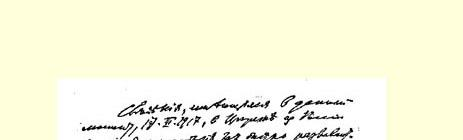
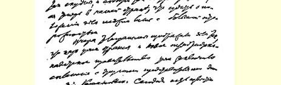
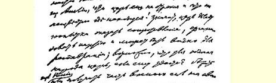
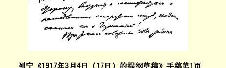

# １９１７年３月４日（１７日） 的提纲草稿１

今天，１９１７年３月１７日，从俄国传到苏黎世的消息非常少， 但目前我们国内的事态却发展得非常快，因此在判断情况时只能采取极其谨慎的态度。

昨天来电说，沙皇已经退位，十月党人－立宪民主党人的新政府２已经同罗曼诺夫王朝的其他代表缔结了协定。今天来自英国的消息说，沙皇还没有退位，现在不知道他在何处！也就是说，沙皇正在作反抗的尝试，策划组织政党，也许还策划组织军队进行复辟；假如沙皇能逃出俄国或取得一部分武装力量，那他为了欺骗人民，也有可能发表立即同德国单独媾和的宣言！

在这种情况下，无产阶级的任务就十分复杂了。毫无疑问，无产阶级应当尽量好地组织起来，集结自己的力量，武装自己，巩固和发展同城乡劳动群众一切阶层的联盟，以便无情地反击沙皇反动派，彻底粉碎沙皇君主制。

另一方面，在彼得堡夺得了政权的新政府，或者确切些说，从经过英勇的流血斗争而取得了胜利的无产阶级手中夺取了政权的新政府，是由自由派资产者和地主组成的；而民主派农民的代表、 也可能是一部分被引上资产阶级道路而忘记了国际主义的工人的代表克伦斯基，是被他们牵着鼻子走的。新政府的组成人员是一些明目张胆地赞成和拥护同德国进行帝国主义战争的人，也就是说， 他们赞成和拥护同英法帝国主义政府联合进行战争，为了掠夺和侵占其他国家领土如亚美尼亚、加里西亚、君士坦丁堡等等而进行战争。

新政府不可能给俄国各族人民（以及那些因战争而同我们联结起来的民族）以和平、面包和充分的自由，因此工人阶级应当继续进行争取社会主义与和平的斗争，应当为此而利用新的形势，并且向最广大的人民群众说明这种形势。

新政府不可能给人民和平，这不仅因为它是资本家和地主的代表，而且还因为它被同英法资本家缔结的条约和对他们在财务上承担的义务束缚住了。因此，始终忠于国际主义的俄国社会民主党，首先和主要应当向期待和平的人民群众说明，在这个政府统治下是不可能取得和平的。这个政府在它的第一篇告人民书（３月１７ 日）３中，一个字也没有提到当前主要的和基本的问题—— 和平问题。它保守沙皇政府同英、法、意、日等国所缔结的掠夺性条约的秘密。它企图向人民隐瞒它的军事纲领的真实内容，即隐瞒它主张战争、主张战胜德国的真相。它不能做目前人民需要做的事情：马上公开建议各交战国立即停战，然后在彻底解放殖民地和一切从属的没有充分权利的民族的基础上缔结和约。要实现这一点，就需要有一个工人政府，而这个政府首先要同贫苦的农村居民群众结成联盟，其次要同各交战国的革命工人结成联盟。

新政府不可能给人民面包。而任何自由都不能满足由于缺粮、 由于粮食分配不合理、更主要是由于地主和资本家夺走了粮食而处于挨饿境地的群众。要给人民面包，就必须对地主和资本家采取革命措施，而能够采取这种措施的只有工人政府。

> 列宁《１９１７年３月４日（１７日）的提纲草稿》手稿第１页
>
> （按原稿缩小） 最后，新政府也不可能给人民充分的自由，虽然它在１９１７年３月 １７日的宣言中只谈政治自由而不谈其他同样重要的问题。新政府已经试着去同罗曼诺夫王朝达成协议，因为它曾提出，只要尼古拉二世退位和指派罗曼诺夫家族的一个成员来当他的儿子的摄政王，它就可以不顾人民的意志而承认罗曼诺夫王朝。新政府在它的宣言中答应给予各种自由，但是并不履行它所承担的直接的和绝对的义务：立即实现自由，由士兵选举军官等；规定彼得堡、莫斯科等地的市杜马选举在真正全民投票而不是仅由男子投票的基础上进行，开放一切官方的和公共的建筑物供人民集会之用；规定一切地方机关和地方自治机关的选举也在真正全民投票的基础上进行；取消对地方自治权的一切限制；撤销由上面委派来监视地方自治的一切官吏；不仅实现信教自由，而且也实现不信教自由；立即使学校同教会分离，使学校不受官吏的监护，等等。

新政府３月１７日的整篇宣言完全不能令人相信，因为它尽是诺言，没有提出要立即采取任何一项最迫切的、完全可以而且应当马上实行的措施。

新政府在它的纲领中一个字也没有提到八小时工作制和其他改善工人生活状况的经济措施，一个字也没有提到农民的土地问题，即无偿地把地主的全部土地转归农民的问题，它对这些迫切的问题保持缄默也就暴露了它的资本家的和地主的本性。

能够给人民以和平、面包和充分自由的只有工人政府，因为这个政府首先依靠绝大多数农民即农业工人和贫苦农民，其次依靠同各交战国革命工人结成的联盟。

因此，革命无产阶级不能不把３月１日（１４日）的革命看作它在自己的伟大道路上取得的初步的但还远不是完全的胜利，不能不给自己提出继续为争取民主共和国和社会主义而斗争的任务。

为了实现这个任务，无产阶级和俄国社会民主工党首先应当利用新政府所开放的相对的和不充分的自由，这种自由只有靠今后进行更坚决更顽强的革命斗争才能得到保证和扩大。

必须使全体城乡劳动群众以及军队认清目前政府的真面目和它对待迫切问题的真实态度。必须成立工人代表苏维埃并把工人武装起来；必须使无产阶级组织也在军队（新政府也答应给军队政治权利）和农村中建立起来；尤其必须成立农业雇佣工人的单独的阶级组织。

只有使最广大的居民群众了解真相并把他们组织起来，才能保证革命下一阶段的完全胜利，才能保证工人政府夺得政权。

这个任务在革命时期和在战争的沉痛教训的影响下，能够在比平常短得多的时间内为人民所理解。为了实现这个任务，必须在思想上和组织上保持革命无产阶级政党的独立性。这个政党始终忠于国际主义，不听信资产阶级用来欺骗人民的谎话，即关于在目前这场帝国主义掠夺性战争中“保卫祖国”的种种言论。

无论是目前的政府还是资产阶级民主共和政府，如果它只是由克伦斯基和其他民粹主义的和“马克思主义的”社会爱国主义者组成的，那它就不能使人民摆脱帝国主义战争，就不能保障和平。

因此，无论同工人护国派，或是同格沃兹杰夫—波特列索夫— 契恒凯里—克伦斯基这帮人，或是同在这个基本问题上象齐赫泽等人那样立场动摇不定的人，我们都不能订立任何同盟、联盟甚至协议。这种协议不仅会使群众造成错觉而依附于俄国的帝国主义资产阶级，而且会削弱和损害无产阶级在使人民摆脱帝国主义战争和保障各国工人政府之间真正持久和平的事业中的领导作用。

> 载于１９２４年《列宁文集》俄文版《列宁全集》俄文第５版第２卷第３１卷第１—６页