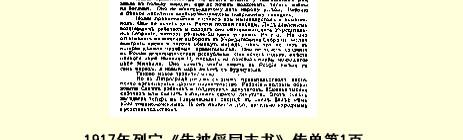

# 告被俘同志书 ５１

> （１９１７年３月中旬）

同志们！俄国的革命已经爆发了。

彼得格勒和莫斯科的工人又一次当了伟大的解放运动的先锋。他们宣布举行政治罢工。他们举着红旗走上街头。他们象狮子一般同沙皇的警察、宪兵和没有立刻转向人民的一小部分军队搏斗。仅仅在彼得格勒这个城市就有２０００多人伤亡。俄国工人用自己的鲜血换得了我国的自由。

工人的要求是：**面包**、**自由**、**和平**。

工人要求**面包**，这是因为在俄国，也象在几乎所有参加这场掠夺性战争的国家一样，人民在挨饿。

工人要求**自由**，这是因为沙皇政府利用战争的机会把整个俄国彻底变成了一所大监狱。

工人要求**和平**，这是因为俄国工人也象其他国家比较觉悟的工人一样，不愿再为一小撮富人的利益卖命，不愿再进行这场由戴王冠的或不戴王冠的强盗所发动的罪恶战争。

彼得堡卫戍部队和莫斯科卫戍部队的大多数士兵都转到起义工人方面来了。穿军装的工人和农民亲热地向不穿军装的工人和农民伸出手来，优秀的军官也参加了革命。甘愿与人民为敌的军官则被士兵枪毙了。

革命是由工人和士兵完成的。但是政权，正如以往历次革命那样，一开始就被资产阶级夺去了。地主资本家占绝大多数的国家杜马，尽了最大努力谋求同沙皇尼古拉二世妥协。甚至在彼得格勒街头内战已经非常激烈的最后时刻，国家杜马还接连不断地致电沙皇，请求他作一些小小的让步，以便保住他的王冠。不是国家杜马 （地主和富人的杜马），**而是起义的工人和士兵推翻了沙皇**。但是新的临时政府却是国家杜马任命的。

这个临时政府是由自由派资本家和大地主的代表组成的。担任政府要职的有：李沃夫公爵（大地主和最温和的自由派分子）、亚 ·古契柯夫（斯托雷平的同伙，曾经赞同用军事法庭对付革命者）、 捷列先科（最大的糖厂主，百万富翁）、米留可夫（过去和现在一直在为沙皇尼古拉及其匪帮迫使我国参加的这场掠夺性战争辩护）。 邀请“民主派”克伦斯基参加新政府，仅仅是为了制造“人民”政府的假象，仅仅是为了在古契柯夫之流和李沃夫之流干反人民**勾当** 的时候，能有一个“民主派”空谈家出来向人民说些响亮而空洞的 **话**。

新政府想继续进行强盗战争。它是俄国、英国和法国资本家的伙计，而这三个国家的资本家同德国资本家一样，都要非“打到底” 不可，想争到一份最称心的赃物。这个政府不想给也不可能给俄国和平。

新政府不愿意把地主的土地夺过来交给人民，它不愿意把战争的重担加在富人的肩上。因此，它不可能给人民面包。工人和贫苦居民都得照旧挨饿。

新政府是由资本家和地主组成的。它不愿意给俄国充分的自由。它曾经在起义的工人和士兵的压力下答应召开立宪会议来解

> １９１７年列宁《告被俘同志书》传单第１页
>
> （按原版缩小） 决怎样治理俄国的问题。但是它一再拖延立宪会议的选举，企图赢得时间，然后象历史上这类政府多次做过的那样，制造蒙蔽人民的骗局。它不愿意在俄国建立民主共和国。它只愿意让所谓“好”沙皇米哈伊尔代替坏沙皇尼古拉二世坐王位。它希望俄国的政权由新沙皇和资产阶级共同掌握而不是由人民自己掌握。

新政府的情况就是这样。

但是在彼得格勒，除这个政府以外，还逐渐组织起另一个政府。工人和士兵建立了工兵代表苏维埃。每一千个工人或士兵选出一名代表。这个苏维埃现在在塔夫利达宫举行会议，出席的代表达１０００多人。工兵代表苏维埃是真正人民的代表机关。

这个苏维埃一开始可能犯这样或那样的错误。但是它一定会大声地威严地要求和平、面包和民主共和国。

工兵代表苏维埃努力争取**立即**召开立宪会议，让士兵参加选举，参加解决战和的问题。苏维埃要做到把沙皇和地主的土地转交给农民。苏维埃要的是共和国，关于指定一个“仁慈的”新沙皇的议论它连听也不想听。苏维埃要求所有男女都享有普遍的、平等的选举权。苏维埃达到了逮捕沙皇和皇后的目的。苏维埃想设立一个监察委员会，这个委员会将检查新政府的每一项措施，而且实际上将成为一个政府。苏维埃力求同其他一切国家的工人联合起来，齐心协力地打击资本家。大批的革命工人已经出发到前线去，以便利用所享有的自由，同士兵商量如何一致行动，如何结束战争，如何保障人民的权利，如何巩固在俄国争得的自由。社会民主党的报纸 《真理报》已在彼得格勒复刊，它将帮助工人完成上述各项重大任务。

同志们，目前的情况就是这样。

你们这些受苦的俘虏不能袖手旁观。你们应当做好准备，也许不要多久，一项重要的任务就将落到你们的肩上。

俄国自由的敌人有时就打你们的主意。他们说：现在约有２００ 万士兵当了俘虏；只要士兵们回到祖国以后站到沙皇这一边，我们又能把尼古拉或他的“心爱的”御弟扶上宝座。历史上常有这样的事情：昨天的敌人同已被推翻的国王言归于好以后，就把战俘交给这个国王，好让他们帮助他反对本国人民……

同志们！你们要在一切条件允许的地方讨论我们祖国发生的重大事件。你们要大声宣布，你们同一切优秀的俄国士兵站在一起，不要沙皇，你们要求建立自由的共和国，要求把地主的土地无偿地交给农民，要求实行八小时工作制，要求立即召开立宪会议。 你们要声明你们是站在彼得格勒工兵代表苏维埃这一边的，要声明你们回到俄国以后，决不保卫沙皇，而要反对沙皇，决不保卫地主和富人，而要反对地主和富人。

你们要在一切条件允许的地方组织起来，要采取实现上述要求的办法，并向落后的同志说明在我们的国家里发生了多么伟大的事件。

你们在战前、战时和被俘期间受尽了苦难。现在，我们正迎着美好的日子前进。自由的曙光已经出现了。

你们要作为一支革命的军队、人民的军队而不是沙皇的军队回到俄国去。１９０５年的时候，从日本回来的战俘都成了优秀的自由战士。

你们回到祖国以后将分散到全国各地。你们要把自由的消息带到每一个边远的角落去，带到每一个受尽了饥饿、凌辱和捐税负担之苦的俄国农村去。你们要开导农民兄弟，就是说你们要克服农村的愚昧无知，号召贫苦农民支援城乡工人的光荣斗争。

俄国工人在争取到共和国以后，一定会同各国工人联合起来， 勇敢地带领全人类走向**社会主义**，走向这样一种制度，在这种制度下不再有富人和穷人，一小撮富人不能再把千千万万人变成他们的雇佣奴隶。

同志们！一有可能，我们就要赶回俄国，投入我们的工人和士兵兄弟们的斗争。但是就在那里我们也决不会忘掉你们。我们一定会尽力从自由的俄国寄书报给你们，告诉你们国内的消息。我们会要求给你们送去足够的钱和面包。我们还会对起义的工人和士兵说：你们是可以依靠你们被俘的兄弟们的。他们是人民的儿子， 他们一定会同我们一起投入争取自由、争取共和国，反对沙皇的战斗。

### 《社会民主党人报》编辑部

> １９１７年印成传单《列宁全集》俄文第５版
>
> 第３１卷第６０—６６页