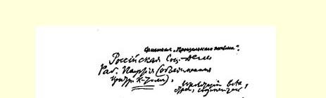
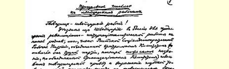
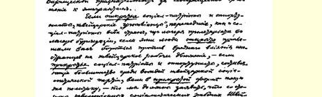
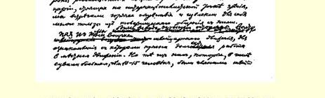

**俄国社会民主工党（由中央委员会统一的）**

### 全世界无产者，联合起来！ 给瑞士工人的告别信 ５２

> （１９１７年３月中旬） 瑞士工人同志们：

当我们，由中央委员会统一的俄国社会民主工党（有别于由组织委员会统一的**同一**名称的**另一个**党）的党员们，将要离开瑞士返回俄国，到我们的祖国去继续进行革命的国际主义工作的时候，我们谨向你们致以同志的敬礼，并对于你们对待外侨的同志态度表示深切的同志的谢意。

瑞士的“格留特利分子”５３这些**公开的**社会爱国主义者和机会主义者，和其他各国的社会爱国主义者一样，从无产阶级阵营跑进资产阶级阵营，这些人**公开**要求你们起来反对外国人对于瑞士工人运动的有害影响，在瑞士社会党５４的领袖中占多数的**隐蔽的**社会爱国主义者和机会主义者也以**隐蔽的**形式推行同样的政策，而我们应当声明，我们从采取国际主义立场的、革命的、社会主义的瑞士工人方面博得了热烈的同情，我们从与他们的同志式的交往中汲取了许多教益。

我们对待瑞士运动中那些必须长期参加当地的运动才能了解的问题一向是格外谨慎的。但是我们中间约有１０—１５个曾经当

> １９１７年列宁《给瑞士工人的告别信》手稿第１页
>
> （按原稿缩小） 过瑞士社会党党员的人，认为自己有责任在国际社会主义运动的共同的、根本的问题上坚决捍卫我们的观点，即“齐美尔瓦尔德左派”５５的观点，既坚决反对社会爱国主义，也坚决反对所谓的“中派”，即瑞士的罗·格里姆、弗·施奈德、雅克·施米德之流，德国的考茨基、哈阿兹、“工作小组”５６，法国的龙格、普雷斯曼之流，英国的斯诺登、拉姆赛·麦克唐纳之流，意大利的屠拉梯、特雷维斯及其同伙，以及上面提到的俄国的“组织委员会”的党（阿克雪里罗得、马尔托夫、齐赫泽、斯柯别列夫之流）。

我们同瑞士革命的社会民主党人有过亲密的合作，他们的一部分人团结在《自由青年》杂志５７的周围，他们草拟了并且散发了举行全党投票的理由书（用德文和法文写成），要求在１９１７年４月召开党代表大会来解决对待战争的态度问题，他们把青年派和“左派”关于军事问题的决议案５８提交在特斯举行的苏黎世州代表大会，他们于１９１７年３月在瑞士法语区的若干地方刊印并散发了法德两种文字的传单《我们的媾和条件》，如此等等。

我们向这些曾经同我们亲密合作过的思想一致的同志致以兄弟般的敬礼。

我们一向确信，英国的帝国主义政府决不会让俄国的国际主义者返回本国，因为这些人毫不妥协地反对古契柯夫—米留可夫及其同伙的帝国主义政府，毫不妥协地反对俄国继续进行**帝国主义**战争。

说到这里，我们应当简单地谈一下我们对俄国革命的任务的看法。我们认为这样做很有必要，尤其是因为我们能够而且应当通过瑞士工人向德国工人、法国工人和意大利工人讲几句话，这些国家的工人同瑞士人民语言相通，而且瑞士人民直到现在还享受着和平的幸福和较多的政治自由。

我们现在仍然恪守我们在我党中央机关报《社会民主党人报》 １９１５年１０月１３日第４７号（当时在日内瓦出版）上所作的声明。 声明里说，假使俄国革命取得胜利，**共和派**政府执掌政权，这个政府想继续联合英法**帝国主义**资产阶级进行以夺取君士坦丁堡、亚美尼亚、加里西亚等地为目的的帝国主义战争，那我们就要坚决反对这个政府，我们就要***反对***在***这种***战争中“保卫祖国”[^1]。

与此类似的局面已经出现了。曾经同尼古拉二世的兄弟进行恢复俄国君主制谈判的、由**君主**派李沃夫和古契柯夫担任最主要的和关键性职位的俄国新政府，试图用“德国人应当推翻威廉”（对呀！但是为什么不加上一句英国人、意大利人等等应当推翻本国国王，俄国人应当推翻本国的君主派李沃夫和古契柯夫呢？？）这一口号来欺骗俄国工人。这个政府试图利用这个口号，又***不***公布沙皇政府同法英等国缔结的而为***古契柯夫—米留可夫—克伦斯基的政府所认可了的***帝国主义的掠夺性条约，把自己同德国进行的***帝国主义***战争说成是“防御的”（即甚至从无产阶级的观点来看也是正义的、合理的）战争，而把保卫俄英等国资本的凶恶的帝国主义掠夺目的说成是“保卫”俄罗斯共和国（俄国**还**没有这个共和国，李沃夫之流和古契柯夫之流甚至还**没有答应**建立共和国！）。

最近有几篇电讯指出，俄国公开的社会爱国主义者（如普列汉诺夫先生、查苏利奇先生、波特列索夫先生等等）同“中派”党，“组织委员会”的党，齐赫泽和斯柯别列夫之流的党在“只要德国人没有推翻威廉，我们的战争就是防御的战争”这个口号的基础上有了某种接近。如果电讯内容属实，那我们就要用加倍的力量去同齐赫泽、斯柯别列夫之流的党进行斗争（我们**过去就**经常对该党的机会主义的摇摆不定的政治行动进行斗争）。

我们的口号是：不给古契柯夫—米留可夫政府任何支持！谁说支持这个政府对于防止沙皇制度的复辟是必要的，谁就是欺骗人民。恰恰相反，正是古契柯夫的政府**已经进行了**恢复俄国君主制的谈判。**只有**把无产阶级武装起来和组织起来，才能制止古契柯夫及其同伙**恢复**俄国的君主制。只有俄国***和全欧洲***忠于国际主义的革命无产阶级才能使人类摆脱帝国主义战争的惨祸！

我们决不闭眼不看摆在俄国无产阶级革命的国际主义先锋队面前的巨大困难。在我们所处的这个时期，可能发生极其迅速而急剧的转变，我们在《社会民主党人报》第４７号上直接而明确地回答了一个自然而然产生的问题：假使革命使我们党**立即**掌握了政权， 那么我们党要做哪些事情呢？我们的回答是：（１）我们将立刻向**各** 交战国建议媾和；（２）我们将宣布我们的媾和条件：立刻解放**一切** 殖民地和**一切**被压迫的或没有充分权利的民族；（３）我们将立刻着手解放受大俄罗斯人压迫的各民族，并把这一事业进行到底；（４） 我们一秒钟也不怀疑，这些条件是德国君主派资产阶级，甚至是德国共和派资产阶级所不能接受的，而且这不仅对德国来说是如此， 就是对英法两国的资本家政府来说也是如此。

我们将被迫进行反对德国资产阶级，而且不仅仅是反对德国一国资产阶级的革命战争。***我们一定会进行这种战争***。我们不是和平主义者。我们反对资本家为分赃而进行的帝国主义战争，但是我们一向认为，如果革命无产阶级断然拒绝**对于社会主义可能**是必要的革命战争，那是荒谬绝伦的。

我们在《社会民主党人报》第４７号上所描述的任务是非常艰巨的。这个任务只有靠无产阶级同资产阶级进行多次阶级大搏斗才能解决。但不是我们的急躁心情，不是我们的愿望，而是帝国主义战争所造成的**客观条件**使**全**人类陷于绝境，使全人类要作出抉择：或者再让几百万人丧生，并让整个欧洲文化遭到彻底毁灭；或者在***一切***文明国家里使政权转到革命无产阶级手中，实现社会主义革命。

俄国无产阶级十分荣幸的是，帝国主义战争在客观上必然引起的一系列革命由它来开始。但是我们绝对没有这样的想法：俄国无产阶级是各国工人中间最优秀的革命无产阶级。我们清楚地知道，俄国无产阶级的组织、修养和觉悟程度都不及其他国家的工人。并不是特殊的素质而只是特殊的历史条件使得俄国无产阶级在某一时期，可能是很短暂的时期内成为全世界革命无产阶级的先锋。

俄国是一个农民国家，是欧洲最落后的国家之一。在这个国家里，社会主义不可能立刻直接取得胜利。但是，在贵族地主的大量土地没有触动的情况下，在有１９０５年经验的基础上，俄国这个国家的农民性质能够使俄国资产阶级民主革命具有巨大的规模，并使我国革命变成全世界社会主义革命的**序幕**，变成进到全世界社会主义革命的一级阶梯。

这些思想已经被１９０５年的经验和１９１７年春季的变革完全证实了。我们党就是在争取实现这些思想、不调和地反对其他一切政党的斗争中形成的，我们今后还将为实现这些思想而奋斗。

社会主义在俄国不可能立刻直接取得胜利。但是农民群众**能够**彻底实行不可避免的、条件已经成熟的土地革命，直到**没收**地主的广袤无垠的全部土地。我们过去一直提这个口号，现在我们党的中央委员会和我们党的报纸《**真理报**》也在彼得堡提出了**这个**口号。无产阶级将为实现这个口号而斗争，同时它决不忽视农业雇佣工人以及跟随他们的贫苦农民同斯托雷平（１９０７—１９１４年）土地 “改革”５９后力量得到加强的**富裕农民**之间发生激烈的阶级冲突的必然性。决不能忘记，１０４个农民代表既在第一届杜马（１９０６年）也在第二届杜马（１９０７年）提出了革命的土地法草案，要求一切土地收归国有，交给按彻底的民主制原则选出的地方委员会支配。

这种变革本身还决不是社会主义的。但是它会极其有力地推动全世界的工人运动。它会大大巩固俄国社会主义无产阶级的阵地及其对农业工人和贫苦农民的影响。它会使城市无产阶级能够依靠这种影响来发展“工人代表苏维埃”这样的革命组织，用它们来代替资产阶级国家的旧的压迫工具—— 军队、警察、官吏，并实施（在无比严酷的帝国主义战争和战争后果的压力下不得不实施） 一系列革命措施来对产品的生产和分配进行**监督**。

俄国无产阶级单靠自己的力量是不能胜利地**完成**社会主义革命的。但它能使俄国革命具有浩大的声势，从而为社会主义革命创造极好的条件，这在某种意义上说就意味着社会主义革命的**开始**。 这样，俄国无产阶级就会使自己***主要的***、最忠实的、最可靠的战友 ——***欧洲***和美洲的***社会主义***无产阶级易于进入决战。

帝国主义资产阶级丑恶的走狗，如德国的谢德曼之流、列金之流、大卫之流，法国的桑巴、盖得和列诺得尔及其同伙，英国的费边派和“拉布分子”６０，在欧洲社会主义运动中确实取得了暂时的胜利，就让意志不坚的人去悲观失望吧。我们则坚信，全世界工人运动的这一***污点***很快就会被革命的浪潮冲洗掉。

德国无产阶级群众在１８７１—１９１４年这数十年的欧洲“沉寂时期”中进行了顽强的、坚持不懈的、不屈不挠的组织工作，给人类和社会主义作出了很多贡献，现在他们的情绪又**沸腾起来了**。代表德国社会主义的未来的，决不是叛徒谢德曼之流、列金之流、大卫之流，也不是动摇不定的、没有气节的、受“平静”时期的陈规束缚的政治家哈阿兹先生、考茨基先生以及诸如此类的人。

德国社会主义的未来属于培养了卡尔·李卜克内西、建立了 “斯巴达克派”６１、在不来梅《工人政治》６２上进行过宣传的那个派别。

帝国主义战争的客观条件，保证了革命不会局限于俄国革命的**第一阶段**，***不会***局限于俄国这一个国家。

***德国无产阶级是俄国和全世界无产阶级革命的最忠实最可靠的同盟军***。

当我们党在１９１４年１１月提出“变帝国主义战争为国内战争” （被压迫者反对压迫者并争取社会主义的国内战争）这一口号的时候，社会爱国主义者曾报以敌视和恶毒的嘲笑，“中派”社会民主党人则报以不信任的、怀疑的、不置可否的、等待观望的缄默。德国的社会沙文主义者、社会帝国主义者大卫把这个口号叫作“疯狂的” 口号，俄国的（和英法的）社会沙文主义即口头上的社会主义实际上的帝国主义的代表普列汉诺夫先生，则称这个口号是一出“梦幻般的滑稽剧”（ＭｉｔｔｅｌｄｉｎｇｚｗｉｓｃｈｅｎＴｒａｕｍｕｎｄＫｏｍｏｄｉｅ）。而中派的代表则避而不谈或者庸俗地讥笑这是“空中楼阁”。

现在，在１９１７年３月以后，只有瞎子才会看不到这一口号的正确性。变帝国主义战争为国内战争的口号**正在成为**事实。

**正在兴起的**欧洲无产阶级革命万岁！

这封信是受回国同志、俄国社会民主工党（由中央委员会统一

的）党员的委托而写的，并由他们在１９１７年４月８日（新历）

的会议上通过。

### 尼·列宁

> 载于１９１７年５月１日《青年国际》《列宁全集》俄文第５版杂志第８期第３１卷第８７—９４页

[^1]: 见《列宁全集》第２版第２７卷《几个要点》。—— 编者注