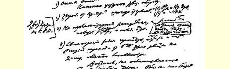
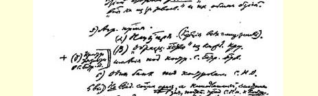
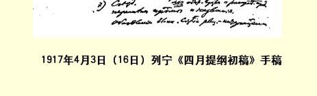

# 四月提纲初稿

> （１９１７年４月３日〔１６日〕）

### 提纲：

（１）对战争的态度。

不对“革命护国主义”作任何让步。

（２）“要求临时政府”“放弃侵略”。

（α）对临时政府的态度。

（β）对工人代表苏维埃的态度。

（***补***２）对工人代表苏维埃的批评。

（３）不要议会制共和国，而要工人、雇农、农民和士兵代表苏维

埃的共和国。

（α）废除军队、官吏、警察。

（β）给官吏的薪金。

（４）从革命的第一阶段向第二阶段过渡的时期中宣传、鼓动和

组织的任务的特殊性。最大限度的合法性。

赞成**只是**“出于不得已才进行战争”、“不是为了侵

略而进行战争”的真心诚意的、但受资产阶级欺骗的

人，以及资产阶级对这种人的欺骗。

> １９１７年４月３日（１６日）列宁《四月提纲初稿》手稿
>
> （按原稿缩小） （５）土地纲领。 （α）国有化。（没收地主的全部土地。） （β）在雇农代表苏维埃的监督下把各个大田庄改建成“示范

农场”。 ＋（γ）重点放在雇农代表苏维埃。

（６）一个由工人代表苏维埃监督的银行。

（补６）***不是一下子***实施社会主义，而是立刻有系统地、逐步地过渡到由工人代表苏维埃**监督**社会的产品生产和分配。

（７）代表大会。

修改党纲和更改党的名称。

革新国际。建立革命的国际的……[^1]

> 载于１９２８年《列宁文集》俄文版《列宁全集》俄文第５版第７卷第３１卷第９９—１００页

[^1]: 手稿到此中断。—— 俄文版编者注