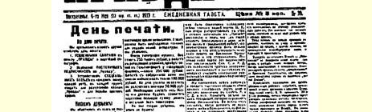
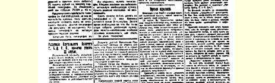
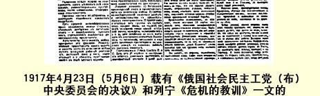

# 俄国社会民主工党（布）中央委员会 １９１７年４月２２日（５月５日） 上午通过的决议

必须承认，４月１９—２１日爆发的政治危机（至少是它的第一阶段）已经结束。

被资本家激怒了的小资产阶级群众起初**离开了**资本家，**倒向** 工人**这一边**；但是过了一天，他们又去追随“信任”资本家并同资本家“妥协”的孟什维克和民粹主义者的领袖们了。

这些领袖妥协了，交出了自己的全部阵地，满足于资本家提出的十分空洞、纯粹口头上的许诺。

危机的原因没有消徐，这种危机的重演是不可避免的。

危机的实质在于：小资产阶级群众摇摆不定，他们时而保持长期以来的对资本家的信任态度，时而痛恨资本家，倾向于信赖革命无产阶级。

资本家在各种词句的掩饰下拖延战争。只有革命无产阶级正在引导人民并且能够引导人民通过全世界工人革命结束战争。这个革命正在我国蓬勃发展，正在德国成熟起来，在其他许多国家也日益逼近。

“打倒临时政府”这个口号在目前是不正确的，因为在革命无产阶级还没有掌握可靠的（即有觉悟的和有组织的）人民大多数的时候，提出这样的口号是讲空话，或者在客观上是一种冒险行动。１４４

只有在工兵代表苏维埃赞成我们的政策并且愿意掌握政权的时候，我们才会主张使政权转归无产者和半无产者。

在危机期间很明显的一点是：我党在组织上是薄弱的，无产阶级力量的团结是不够的。

当前的口号是：（１）**说明**无产阶级的路线和无产阶级结束战争的途径；（２）**批评**小资产阶级信任资本家政府并同它妥协的政策； （３）**在每个团队**、**每个**工厂**中**，特别是在仆役、粗工等最落后的群众中，普遍深入地进行宣传鼓动工作，因为在危机期间资产阶级尤其争取他们的支持；（４）在每个工厂、每个区、每个街区中组织无产阶级，**组织**、**组织**、**再组织**。

我党全体党员应当无条件地遵守彼得格勒工兵代表苏维埃４ 月２１日关于两天之内禁止在街头举行任何群众大会和示威游行的决定。中央昨天早晨散发了，今天又在《真理报》上刊登了这样一个决议：“在这个时候，任何发动内战的想法都是荒谬的、怪诞的”， 示威游行只应该是和平的，如果发生暴力行为，其责任将在临时政府及其拥护者[^1]。所以，我党认为工兵代表苏维埃的上述决定（尤其是反对武装示威游行和反对朝天开枪）完全正确，必须**无条件地执行**。

我们号召全体工人和士兵仔细讨论最近两天的危机的结局， 并且只把能表达多数人的意志的同志选为工兵代表苏维埃和执行

> １９１７年４月２３日（５月６日）载有《俄国社会民主工党（布）
>
> 中央委员会的决议》和列宁《危机的教训》一文的
>
> 《真理报》第３９号第１版
>
> （按原版缩小） 委员会的代表。如果代表不能表达多数人的意见，那就必须在工厂和兵营中进行改选。 载于１９１７年４月２３日（５月６日）《列宁全集》俄文第５版 《真理报》第３９号第３１卷第３１９—３２０页

[^1]: 见本卷第３０９页。—— 编者注