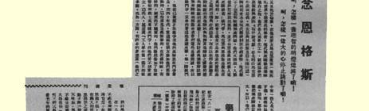
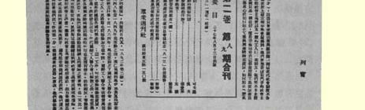
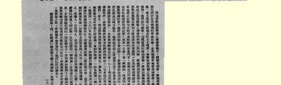

# 前言

本卷收载列宁１８９５—１８９７年的著作，共１５篇。

１９世纪９０年代后半期是俄国社会民主主义运动的“童年时期和少年时期”。在这个时期中，随着俄国资本主义的迅猛发展，工人阶级的人数急剧增加，罢工运动不断扩大。社会民主党人原来只在少数先进工人中间宣传马克思主义，这时则开始进行群众性的政治鼓动和实际革命工作了。１８９５年秋，列宁建立了彼得堡工人阶级解放斗争协会，这标志着社会主义开始和俄国工人运动相结合。斗争协会包括若干马克思主义工人小组，同群众性的工人运动建立了广泛联系。斗争协会是俄国无产阶级革命政党的萌芽。在它的影响下，俄国其他许多地方也相继成立了类似的组织。对俄国社会民主党人来说，当务之急是把各个马克思主义组织联合起来， 建立一个有统一的中央和明确的纲领的无产阶级革命政党。而要建立这样的党，还必须大力批判民粹主义，因为民粹主义仍然是俄国社会民主主义运动前进道路上的严重障碍。总的说来，列宁在此期间的著述活动和实际革命活动都围绕着一个中心任务，即在俄国建立一个无产阶级的革命政党。

本卷的头一篇文章《弗里德里希·恩格斯》是列宁在１８９５年秋为悼念无产阶级革命导师恩格斯的逝世而写的。该文扼要叙述了恩格斯的生平及其对科学共产主义和国际共产主义运动所建树的伟大功勋。列宁在文中对恩格斯的历史地位作了全面的科学的评价，指出在马克思逝世后，“恩格斯是整个文明世界中最卓越的学者和现代无产阶级的导师”（见本卷第１页）。

本卷收载了列宁在早期革命活动中所写的一些宣传鼓动文献，如《告托伦顿工厂男女工人》、《对工厂工人罚款法的解释》、《我们的大臣们在想些什么？》、《告沙皇政府》、《新工厂法》等。列宁十分重视宣传鼓动工作，认为这一工作对于启发工人群众的思想觉悟和提高他们的斗争水平有很大作用。他把为工人群众写作看成自己义不容辞的责任。在这些传单和小册子中，列宁从工人群众的生活实际和工厂的现实情况出发，用通俗易懂的语言向工人讲述革命道理，深刻阐明了俄国无产阶级受资本家阶级的残酷剥削和压迫、陷于贫困和无权地位的原因，并向俄国无产阶级指出了争取自身解放的道路。

本卷收载了列宁阐述俄国马克思主义者的纲领、策略和组织任务的著作，如《社会民主党纲领草案及其说明》。这一文献包括 《党纲草案》和《党纲说明》两部分，分别于１８９５年１２月和１８９６年 ６—７月在监狱写成，后来被合编在一起刊出。《党纲草案》是列宁所写的第一个俄国社会民主党纲领。《党纲说明》是对党纲主要条文所作的解释和阐发。在这一文献中，列宁根据俄国的实际，创造性地运用和发展了马克思主义，论述了俄国无产阶级的斗争任务和目标：推翻专制制度和争得政治自由，夺取政权和建立社会主义社会。列宁还提出了俄国社会民主党的实际要求—— 全国性的要求、工人阶级的要求和农民的要求，并对这三方面的要求—— 作了论证。

和《社会民主党纲领草案及其说明》属于同一内容的文献还有 《俄国社会民主党人的任务》。列宁１８９７年底在流放地写成的这个小册子是专门论述俄国社会民主党人的政治纲领和策略的。列宁在小册子中指出：俄国社会民主党人必须开展两种斗争，即社会主义的斗争（反对资本家阶级，目标是破坏阶级制度、组织社会主义社会）和民主主义的斗争（反对专制制度，目标是在俄国争得政治自由并使俄国的政治制度和社会制度民主化）；这两种斗争既有本质区别，又有不可分割的联系，俄国社会民主党人只有把二者很好地结合起来，才能完成自己的历史使命。小册子批判了民意党人的密谋策略。在民意党人中间，密谋主义的传统非常强烈，他们以为政治斗争不过是政治密谋。小册子指出，俄国社会民主党人始终认为政治斗争不应当由密谋家而应当由依靠工人运动的革命政党来进行。列宁十分强调革命理论对无产阶级解放斗争的重要意义，第一次提出了“没有革命的理论，就不会有革命的行动”（见本卷第 ４４３页）的著名论点，这个论点后来在《怎么办？》一书中得到了进一步的发挥。

在本卷中，批判民粹主义、尤其是在经济问题上批判民粹主义的著作占据中心地位，其中最重要的是《评经济浪漫主义（西斯蒙第和我国的西斯蒙第主义者）》一书。列宁之所以写这本学术性专著，来批判民粹派否认俄国资本主义发展可能性的小资产阶级理论，完全是出于革命的需要，因为这一理论对当时的俄国革命危害甚大。早在１８９６年，列宁就开始酝酿并动笔撰写这一著作。这一著作，正如它的副标题所表明的，是针对１９世纪前期瑞士经济学家西斯蒙第及其俄国追随者—— 民粹派分子瓦·沃·（瓦·巴· 沃龙佐夫）、尼古拉·—逊（尼·弗·丹尼尔逊）等人的。列宁通过深入的分析、比较，揭露了前者和后者之间的思想渊源关系。西斯蒙第在政治经济学史上占有特殊地位，以小资产阶级经济学（或称 “经济浪漫主义”）的奠基人著称，他热烈拥护小生产，反对大企业经济的维护者和思想家。列宁在概述了西斯蒙第学说的要点以及西斯蒙第同其他的（当时的和以后的）经济学派的关系后，指出西斯蒙第尽管揭露了资本主义社会所存在的各种矛盾，但他对资本主义的批判是从小生产者的观点出发的。他不理解资本主义生产代替小生产的历史必然性，他美化小商品生产方式，希望返回小生产时代。这既是空想的，又是反动的。而西斯蒙第学说中的空想和反动方面，正接近于俄国民粹派的观点，因而不仅被俄国民粹派所接受，而且被理想化。例如，西斯蒙第关于资本主义制度下国内市场因小生产者的破产而缩小的理论，就曾被俄国民粹派所利用。俄国民粹派根据西斯蒙第的这一错误理论认为，资本主义在俄国不可能得到发展，俄国经济走的是“独特的”发展道路。他们美化宗法式的小农经济和行会手工业。正如西斯蒙第一样，他们是十足的小资产阶级的思想代表。因此，列宁得出结论说：“**民粹派的经济学说不过是全欧洲浪漫主义的俄国变种**。**”**（见本卷第２１８页）

列宁１８９７年８、９月间在流放地写的一篇经济著作《１８９４— １８９５年度彼尔姆省手工业调查以及“手工”工业中的一般问题》是就手工业问题批判民粹派观点的。当时俄国彼尔姆省的手工业在整个俄国的手工业中具有代表性。为此，彼尔姆省的民粹派通过调查写成了《彼尔姆省手工工业状况概述》一书。在该书中，他们主观主义地对待调查材料，借助于平均数字来歪曲事实，以证明资本主义并未在手工业中得到发展、手工业根本不同于资本主义工业。列宁批判了民粹派在手工业问题上的小资产阶级观点，指明了资本主义对手工业的渗透，以及由此引起的手工业者的阶级分化。这一著作中的材料后来为列宁使用在《俄国资本主义的发展》一书中。

列宁１８９５年１１月发表的《农庄中学与感化中学》和１８９７年底写的《民粹主义空想计划的典型》是两篇在内容上有联系的文章，它们都是为批判自由主义民粹派分子谢·尤沙柯夫的一个反动和空想的计划而写的。对这个既涉及教育问题、也涉及经济问题的计划，尤沙柯夫一再发表文章加以宣扬。他提出在农业中学实行穷学生通过服工役来代替缴纳学费的中等义务教育。尤沙柯夫认为这种中学会成为大型的农业劳动组合，他把这样的计划当作民粹主义的生产“村社化”的第一步，当作俄国要避免资本主义波折所必须选择的那条新道路的一部分。列宁认为，生产“村社化”的计划在资本主义条件下根本无法实现，而要通过这样的计划来使俄国避免资本主义发展道路也是不可能的。和上述两篇文章属同一类的，还有列宁于１８９７年９月写的《论报纸上的一篇短文》。列宁的这篇短文对自由主义民粹派分子尼·列维茨基提出的在全体农民中推行义务互助人寿保险的空想计划进行了批判。

列宁１８９７年底在流放地写的《我们拒绝什么遗产？》一文也是批判自由主义民粹派的错误论调的。当时自由主义民粹派的报刊制造舆论，说什么马克思主义者抛弃优秀的传统，拒绝革命民主主义的思想“遗产”。列宁驳斥说，讲到承受遗产时，一定不能把６０年代启蒙派的遗产和民粹派的遗产这两种完全不同的东西混同起来。民粹派自认是６０年代遗产的继承者，而实际上在一系列有关俄国社会生活的重要问题上都落后于６０年代的启蒙派。列宁把俄国６０年代启蒙派的观点同民粹派的观点以及同社会民主党人的观点作了对比，接着指出，更彻底、更忠实的“遗产”保存者，不是民粹派，而正是马克思主义者。列宁进一步指出：马克思主义者保存遗产，不象档案保管员保存故纸堆；保存遗产并不是局限于遗产， 而是要在新的历史条件下使遗产得到发扬。列宁的这篇文章具有重大意义，它不仅批判了俄国的自由主义民粹派，而且从正面阐明了无产阶级政党如何对待本国革命传统的问题。

