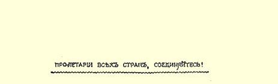
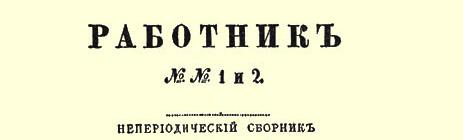
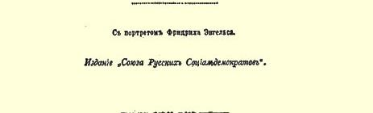

# 弗里德里希·恩格斯 １

> （１８９５年９月７日〔１９日〕以后）
>
> 一盏多么明亮的智慧之灯熄灭了，
>
> 一颗多么伟大的心停止跳动了！[^1]

１８９５年新历８月５日（７月２４日），弗里德里希·恩格斯在伦敦与世长辞了。在他的朋友卡尔·马克思（１８８３年逝世）之后，恩格斯是整个文明世界中最卓越的学者和现代无产阶级的导师。自从命运使卡尔·马克思和弗里德里希·恩格斯相遇之后，这两位朋友的毕生工作，就成了他们的共同事业。因此，要了解弗里德里希·恩格斯对无产阶级有什么贡献，就必须清楚地了解马克思的学说和活动对现代工人运动发展的意义。马克思和恩格斯最先指出，工人阶级及其要求是现代经济制度的必然产物，现代经济制度在造成资产阶级的同时，也必然造成并组织无产阶级。他们指出， 能使人类摆脱现在所受的灾难的，并不是个别高尚人物善意的尝试，而是组织起来的无产阶级所进行的阶级斗争。马克思和恩格斯在他们的科学著作中，最先说明了社会主义不是幻想家的臆造，而是现代社会生产力发展的最终目标和必然结果。到现在为止的全部有记载的历史都是阶级斗争的历史，都是不断更替地由一些社会阶级统治和战胜另一些社会阶级的历史。这种情形，在阶级斗争和阶级统治的基础，即私有制和混乱的社会生产消灭以前，将会继续下去。无产阶级的利益要求消灭这种基础，所以有组织的工人自觉进行的阶级斗争，目标就应该对准这种基础。而任何阶级斗争都是政治斗争。

马克思和恩格斯的这些观点，现在已为正在争取自己解放的全体无产阶级所领会，但是当这两位朋友在４０年代参加社会主义的宣传和当时的社会运动时，这样的见解还是完全新的东西。当时许多有才能的或无才能的人，正直的或不正直的人，都醉心于争取政治自由的斗争，醉心于反对皇帝、警察和神父的专横暴戾的斗争，而看不见资产阶级利益同无产阶级利益的对立。他们根本没有想到工人能成为独立的社会力量。另一方面，当时有许多幻想家， 有时甚至是一些天才人物，都以为只要说服统治者和统治阶级相信现代社会制度是不合理的，就很容易在世界上确立和平和普遍福利。他们幻想不经过斗争就实现社会主义。最后，几乎当时所有的社会主义者和工人阶级的朋友，都认为无产阶级只是一个**脓疮**， 他们怀着恐惧的心情看着这个脓疮如何随着工业的发展而扩大。 因此，他们都设法阻止工业和无产阶级的发展，阻止“历史车轮”的前进。与这种害怕无产阶级发展的普遍心理相反，马克思和恩格斯把自己的全部希望寄托在无产阶级的不断增长上。无产者人数愈多，他们这一革命阶级的力量也就愈大，社会主义的实现也就愈是接近，愈有可能。马克思和恩格斯对工人阶级的功绩，可以这样简单地来表达：他们教会了工人阶级自我认识和自我意识，用科学代替了幻想。

正因为如此，恩格斯的名字和生平，是每个工人都应该知道的。正因为如此，我们在这本与我们其他一切出版物一样都是以

> １８９６年载有列宁《弗里德里希·恩格斯》一文的
>
> 《工作者》文集的扉页唤醒俄国工人的阶级自我意识为目的的文集２中，应该简要地叙述一下现代无产阶级两位伟大导师之一弗里德里希·恩格斯的生平和活动。

恩格斯１８２０年生于普鲁士王国莱茵省的巴门城。父亲是个工厂主。１８３８年，由于家庭情况，恩格斯中学还没有毕业，就不得不到不来梅一家商号去当办事员。从事商业并没有妨碍恩格斯对科学和政治的研究。当他还是中学生的时候，就憎恶专制制度和官吏的专横。对哲学的钻研，使他更前进了。当时在德国哲学界占统治地位的是黑格尔学说，于是恩格斯也成了黑格尔的信徒。黑格尔本人虽然崇拜普鲁士专制国家，他以柏林大学教授的身分为这个国家服务，但是黑格尔的**学说**是革命的。黑格尔对于人类理性和人类权利的信念，以及他的哲学的基本原理—— 世界是不断变化着发展着的过程，使这位柏林哲学家的那些不愿与现实调和的学生得出了一种想法，即认为同现状、同现存的不公平现象、同流行罪恶进行的斗争，也是基于世界永恒发展规律的。既然一切都是发展着的，既然一些制度不断被另一些制度所代替，那么为什么普鲁士国王或俄国沙皇的专制制度，极少数人靠剥夺绝大多数人发财致富的现象，资产阶级对人民的统治，却会永远延续下去呢？黑格尔的哲学谈论精神和观念的发展，它是**唯心主义**的哲学。它从精神的发展中推演出自然界、人以及人与人的关系即社会关系的发展。马克思和恩格斯保留了黑格尔关于永恒的发展过程的思想[^2]，而抛弃了那种偏执的唯心主义观点；他们面向实际生活之后看到，不能用精神的发展来解释自然界的发展，恰恰相反， 要从自然界，从物质中找到对精神的解释…… 与黑格尔和其他黑格尔主义者相反，马克思和恩格斯是唯物主义者。他们用唯物主义观点观察世界和人类，看出一切自然现象都有物质原因作基础，同样，人类社会的发展也是受物质力量即生产力的发展所制约的。生产力的发展决定人们在生产人类必需的产品时彼此所发生的关系。用这种关系才能解释社会生活中的一切现象，人的意向、观念和法律。生产力的发展造成了以私有制为基础的社会关系，但是我们现在看到，生产力的发展又夺走了大多数人的财产， 将它集中在极少数人的手中。生产力的发展正在消灭私有制，即现代社会制度的基础，这种发展本身就是朝着社会主义者所抱定的那个目标前进的。社会主义者就是要了解，究竟哪种社会力量因其在现代社会中所处的地位而关心社会主义的实现，并使这种力量意识到它的利益和历史使命。这种力量就是无产阶级。恩格斯是在英国，是在英国工业中心曼彻斯特结识无产阶级的；１８４２ 年他迁到这里，在他父亲与人合办的一家商号中供职。在这里，他并不是只坐在工厂的办事处里，他常常到工人栖身的肮脏的住宅区去，亲眼看见工人贫穷困苦的情景。但是，他并不满足于亲身的观察，他还阅读了他所能找得到的在他以前论述英国工人阶级状况的一切著作，仔细研究了他所能看到的一切官方文件。这种研究和观察的成果，就是１８４５年出版的《英国工人阶级状况》[^3]一书。上面我们已经提到作为《英国工人阶级状况》一书的作者恩格斯的主要功绩。在恩格斯以前有很多人描写过无产阶级的痛苦， 并且一再提到必须帮助无产阶级。恩格斯**第一个**指出，无产阶级不只是一个受苦的阶级，正是它所处的那种低贱的经济地位，无可遏止地推动它前进，迫使它去争取本身的最终解放。而战斗中的无产阶级是能够**自己帮助自己**的。工人阶级的政治运动必然会使工人认识到，除了社会主义，他们没有别的出路。另一方面，社会主义只有成为工人**阶级**的**政治**斗争的目标时，才会成为一种力量。这就是恩格斯论英国工人阶级状况的一书的基本思想。现在， 这些思想已为全体能思考的和正在进行斗争的无产阶级所领会， 但在当时却完全是新的。叙述这些思想的著作写得很动人，通篇都是描述英国无产阶级穷苦状况的最确实最惊人的情景。这部著作是对资本主义和资产阶级的极严厉的控诉。它给人的印象是很深的。从此，到处都有人援引恩格斯的这部著作，认为它是对现代无产阶级状况的最好描述。的确，不论在１８４５年以前或以后， 还没有一本书把工人阶级的穷苦状况描述得这么鲜明，这么真实。

恩格斯到英国后才成为社会主义者。他在曼彻斯特同当时英国工人运动的活动家发生联系，并开始在英国社会主义出版物上发表文章。１８４４年他在回德国的途中路过巴黎时认识了马克思， 在此以前他已经和马克思通过信。马克思在巴黎时，受到法国社会主义者和法国生活的影响也成了社会主义者。在这里，两位朋友合写了一本书：《神圣家族，或对批判的批判所做的批判》[^4]。这本书比《英国工人阶级状况》早一年出版，大部分是马克思写的。 它奠定了革命唯物主义的社会主义的基础，这种社会主义的主要思想，我们在上面已经叙述过了。“神圣家族”是给哲学家鲍威尔兄弟及其信徒所取的绰号。这班先生鼓吹一种批判，这种批判超越一切现实、超越政党和政治，否认一切实践活动，而只是“批判地” 静观周围世界和其中所发生的事情。鲍威尔先生们高傲地把无产阶级说成是一群没有批判头脑的人。马克思和恩格斯坚决反对这个荒谬而有害的思潮。为了现实的人，即为了受统治阶级和国家践踏的工人，他们要求的不是静观，而是为实现美好的社会制度而斗争。在他们看来，能够进行这种斗争和关心这种斗争的力量当然是无产阶级。还在《神圣家族》一书出版以前，恩格斯就在马克思和卢格两人合编的《德法杂志》３上发表了《政治经济学批判大纲》[^5]一文，从社会主义的观点考察了现代经济制度的基本现象，认为那些现象是私有制统治的必然结果。同恩格斯的交往显然促使马克思下决心去研究政治经济学，而马克思的著作使这门科学发生了真正的革命。

１８４５年到１８４７年，恩格斯是在布鲁塞尔和巴黎度过的，他一面从事科学研究，同时又在布鲁塞尔和巴黎的德籍工人中间进行实际工作。这时，马克思和恩格斯同秘密的德国“共产主义者同盟”４发生了联系，“同盟”委托他们把他们所制定的社会主义基本原理阐述出来。这样就产生了１８４８年出版的马克思和恩格斯的著名的《共产党宣言》[^6]。这本书篇幅不多，价值却相当于多部巨著： 它的精神至今还鼓舞着、推动着文明世界全体有组织的正在进行斗争的无产阶级。

１８４８年的革命首先在法国爆发，然后蔓延到西欧其他国家， 于是马克思和恩格斯就回国了。他们在莱茵普鲁士主编在科隆出版的民主派的《新莱茵报》５。这两位朋友成了莱茵普鲁士所有革命民主意向的灵魂。他们尽一切可能保卫人民和自由的利益，使之不受反动势力的侵害。大家知道，当时反动势力获得了胜利。《新莱茵报》被迫停刊，马克思因侨居国外时丧失普鲁士国籍而被驱逐出境，而恩格斯则参加了人民武装起义，在三次战斗中为自由而战，在起义者失败后经瑞士逃往伦敦。

马克思也迁居伦敦。恩格斯不久又到他在４０年代服务过的那家曼彻斯特商号去当办事员，后来又成了这家商号的股东。１８７０ 年以前他住在曼彻斯特，马克思住在伦敦，但这并没有妨碍他们保持最密切的精神上的联系；他们差不多每天都通信。这两位朋友在通信中交换意见和知识，继续共同创立科学社会主义。１８７０ 年恩格斯移居伦敦，直到１８８３年马克思逝世时为止，他们两人始终过着充满紧张工作的共同精神生活。这种共同的精神生活的成果，在马克思方面，是当代最伟大的政治经济学著作《资本论》， 在恩格斯方面，是许多大大小小的作品。马克思致力于分析资本主义经济的复杂现象。恩格斯则在笔调明快、往往是论战性的著作中，根据马克思的唯物主义历史观和经济理论，阐明最一般的科学问题，以及过去和现在的各种现象。从恩格斯的这些著作中， 我们举出下面几种：反对杜林的论战性著作（它分析了哲学、自然科学和社会科学中最重大的问题）[^7]，《家庭、私有制和国家的起源》（俄译本１８９５年圣彼得堡第３版）[^8]，《路德维希·费尔巴哈》 （俄译本附有格·普列汉诺夫的注释，１８９２年日内瓦版）[^9]，一篇论俄国政府对外政策的文章８（俄译文刊登在日内瓦出版的《社会民主党人》９第１集和第２集上），几篇关于住宅问题的精彩文章１０，以及两篇篇幅虽小，但价值极大的论述俄国经济发展的文章（《弗里德里希·恩格斯论俄国》，维·伊·查苏利奇的俄译本，１８９４年日内瓦版）１１。马克思还没有把他那部论述资本的巨著整理完毕就逝世了。可是，这部著作的草稿已经完成，于是恩格斯在他的朋友逝世后就从事整理和出版《资本论》第２卷和第３卷的艰巨工作。１８８５年他出版了第２卷，１８９４年出版了第３卷（他没有来得及把第４卷１２整理好）。整理这两卷《资本论》，是一件很费力的工作。奥地利社会民主党人阿德勒说得很对：恩格斯出版《资本论》第２卷和第３卷，就是替他的天才朋友建立了一座庄严宏伟的纪念碑，无意中也把自己的名字不可磨灭地铭刻在上面了。的确，这两卷《资本论》是马克思和恩格斯两人的著作。古老传说中有各种非常动人的友谊故事。欧洲无产阶级可以说，它的科学是由这两位学者和战士创造的，他们的关系超过了古人关于人类友谊的一切最动人的传说。恩格斯总是把自己放在马克思之后，总的说来这是十分公正的。他在写给一位老朋友的信中说：“马克思在世的时候，我拉第二小提琴。”[^10]他对在世时的马克思无限热爱， 对死后的马克思无限敬仰。这位严峻的战士和严正的思想家，具有一颗深情挚爱的心。

１８４８—１８４９年的运动以后，马克思和恩格斯在流亡中并没有只限于从事科学工作。马克思在１８６４年创立了“国际工人协会” １３，并在整整十年内领导了这个协会。恩格斯也积极地参加了该会的工作。“国际工人协会”依照马克思的意思联合全世界的无产者，它的活动对工人运动的发展起了巨大作用。就是在７０年代 “国际工人协会”解散后，马克思和恩格斯所起的团结的作用也没有停止。相反，他们作为工人运动精神领导者所起的作用，可以说是不断增长的，因为工人运动本身也在不断发展。马克思逝世以后，恩格斯一个人继续担任欧洲社会党人的顾问和领导者。无论是受政府迫害但力量仍然不断迅速增长的德国社会党人，或者是落后国家内那些还需仔细考虑斟酌其初步行动的社会党人，如西班牙、罗马尼亚和俄国的社会党人，都同样向恩格斯征求意见， 请求指示。他们都从年老恩格斯的知识和经验的丰富宝库中得到教益。

马克思和恩格斯两人都懂俄文，都读俄文书籍，非常关心俄国的情况，以同情的态度注视俄国的革命运动，并一直同俄国的革命者保持联系。他们两人都是由**民主主义者**变成社会主义者的， 所以他们**仇恨**政治专横的民主情感非常强烈。由于马克思和恩格斯具有这种直接的政治情感、对政治专横与经济压迫之间的联系的深刻理论认识以及丰富的生活经验，所以他们在**政治**方面异常敏感。因此，俄国少数革命者所进行的反对强大的沙皇政府的英勇斗争，总是得到这两位久经锻炼的革命家最表同情的反响。相反，那种为了虚幻的经济利益而离开争取政治自由这一俄国社会党人最直接最重要的任务的图谋，在他们看来自然是可疑的，他们甚至直截了当地认为这是背叛伟大的社会革命事业。“无产阶级的解放应当是无产阶级自己的事情”１４，—— 这就是马克思和恩格斯经常教导的。而无产阶级要争取经济上的解放，就必须争得一定的**政治**权利。此外，马克思和恩格斯都清楚地看到，俄国政治革命对于西欧的工人运动也会有巨大的意义。专制的俄国向来是欧洲一切反动势力的堡垒。１８７０年的战争造成了德法之间长期的纷争，使俄国处于一种非常有利的国际地位，这当然只是增加了专制俄国这一反动力量的作用。只有自由的俄国，即既不需要压迫波兰人、芬兰人、德意志人、亚美尼亚人及其他弱小民族，也不需要经常挑拨德法两国关系的俄国，才能使现代欧洲摆脱战争负担而松一口气，才能削弱欧洲的一切反动势力，加强欧洲工人阶级的力量。因此，恩格斯为了西欧工人运动的胜利，也渴望俄国实现政治自由。俄国的革命者因恩格斯的逝世而失去了最好的朋友。

无产阶级的伟大战士和导师弗里德里希·恩格斯永垂不朽！

> 载于１８９６年《工作者》文集译自《列宁全集》俄文第５版第１—２集合刊第２卷第１—１４页

[^1]: 见尼·阿·涅克拉索夫的诗《纪念杜勃罗留波夫》。—— 编者注

[^2]: 马克思和恩格斯不止一次地指出，他们思想的发展，有很多地方得益于德国的大哲学家，尤其是黑格尔。恩格斯说：“没有德国哲学，也就没有科学社会主义。”（见《马克思恩格斯全集》第１８卷第５６５页。—— 编者注）

[^3]: 见《马克思恩格斯全集》第２卷第２６９—５８７页。—— 编者注

[^4]: 见《马克思恩格斯全集》第２卷第３—２６８页。—— 编者注

[^5]: 见《马克思恩格斯全集》第１卷第５９６—６２５页。—— 编者注

[^6]: 同上，第４卷第４６１—５０４页。—— 编者注

[^7]: 这是一部内容十分丰富、十分有益的书６。可惜只有概述社会主义发展史的那一小部分译成了俄文（《科学社会主义的发展》７１８９２年日内瓦第２版）。

[^8]: 见《马克思恩格斯全集》第２１卷第３２—２０３页。—— 编者注

[^9]: 见《马克思恩格斯全集》第２１卷第３０１—３５３页。—— 编者注

[^10]: 见１８８４年１０月１８日恩格斯给贝克尔的信（《马克思恩格斯全集》第３６卷第２１９页）。—— 编者注