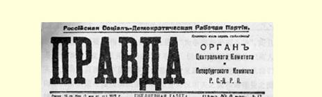
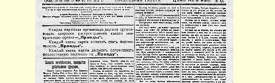
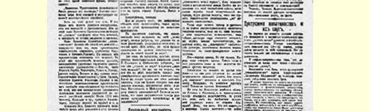
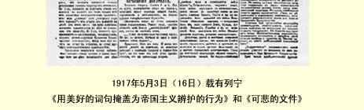

# 用美好的词句掩盖为帝国主义辩护的行为

> （１９１７年５月２日〔１５日〕）

今天报上登载的彼得格勒工兵代表苏维埃执行委员会告各国社会党人书９就是这样干的。指责帝国主义的话说了许许多多，但是一句短短的话就把所有这些话否定了，这句话就是：

“革命俄国的临时政府已接受了这个纲领”（即在民族自决基础上缔结没有兼并和赔款的和约的纲领）。

全部实质就在这句话里。这句话就是为**俄国**帝国主义辩护，就是替它掩盖、粉饰。因为实际上我国临时政府不仅没有“接受”缔结没有兼并的和约的纲领，而且时刻在践踏这个纲领。

我国临时政府同德国资本家政府，同威廉和贝特曼－霍尔韦格强盗们一模一样，发表了关于放弃兼并的“外交式的”声明。口头上**两国**政府都放弃兼并。实际上**两国**政府都继续执行兼并政策：德国资本家政府要用强制手段保持比利时、法国的一部分、塞尔维亚、门的内哥罗、罗马尼亚、波兰、丹麦的几个区、阿尔萨斯和其他地方；俄国资本家政府则要用强制手段保持加里西亚的一部分、土耳其属亚美尼亚、芬兰、乌克兰和其他地方。英国资本家政府是世界上最热中于兼并的政府，因为被它用强制手段保留在英帝国版图内的民族最多：印度（３亿人口）、爱尔兰等地方、土耳其属美索不达米亚、德国在非洲的殖民地等等。

执行委员会的号召书对革命事业和无产阶级事业有极大的危害，因为这个号召书是用最美好的词句来掩饰关于兼并的谎话。第一，号召书没有把口头上放弃兼并（就这个意义来说，世界上**一切** 资本家政府毫无例外都“接受了”“缔结没有兼并的和约的纲领”） **同实际上放弃兼并**（就这个意义来说，世界上**任何一个**资本家政府都**没有**放弃兼并）区别开来。第二，号召书不正确地、毫无根据地、 不顾实际情况地为俄国的资本家临时政府粉饰，其实，这个政府丝毫不比其他资本家政府好些（大概也不坏些）。

用美好的词句掩饰令人不快的真相，对无产阶级事业来说，对劳动群众的事业来说，是最有害最危险的事情。不管现实如何令人痛心，必须正视现实。不符合这一条件的政策是自取灭亡的政策。

关于兼并问题的真相就是，**一切**资本家政府，包括俄国临时政府在内，都用放弃兼并的**诺言**欺骗人民，**实际上**却继续执行兼并政策。任何一个识字的人，只要造一份**完备的**兼并**清单**，即使是德、 俄、英**三国**的兼并清单，他就会很容易地看到这一真相。

谁不这样做，谁错误地为**本国**政府辩白，给其他国家的政府抹黑，谁就在实际上成了帝国主义的维护者。

最后，我们要指出，号召书的结尾部分也搀上了“一勺焦油” １０，即断言：“不管在三年战争期间使社会主义运动发生分裂的意见分歧如何，任何一个无产阶级党派都不应当拒绝共同为争取和平而斗争。”

很遗憾，这也是十分空洞的、毫无内容的美好词句。普列汉诺

> １９１７年５月３日（１６日）载有列宁
>
> 《用美好的词句掩盖为帝国主义辩护的行为》和《可悲的文件》

两文的《真理报》第４７号第１版

> （按原版缩小） 夫和谢德曼硬要人相信，他们两人是在“为争取和平而斗争”，而且是在为争取“没有兼并的和约”而斗争。但是，谁不知道他们两人实际上是各自在为本国资本家的帝国主义政府辩护呢？如果我们向工人阶级说些甜蜜的谎话，掩饰普列汉诺夫之流和谢德曼之流转到**本国**资本家方面去的这种行为，这对工人阶级事业有什么好处呢？这样来掩饰真相，等于替帝国主义和它的维护者打掩护，这难道还不明显吗？ 载于１９１７年５月３日（１６日）译自《列宁全集》俄文第５版 《真理报》第４７号第３２卷第１１—１３页