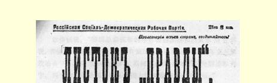
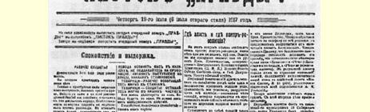
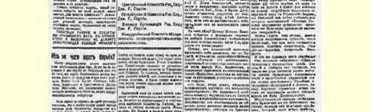
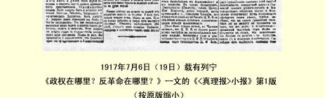

# 政权在哪里？反革命在哪里？

> （１９１７年７月５日〔１８日〕）

对于这个问题，人们往往回答得很简单：反革命根本就没有， 或者是我们不知道它在哪里；至于政权，我们知道得很清楚，它掌握在全俄工兵代表苏维埃代表大会中央执行委员会１２８监督下的临时政府手中。这就是通常的回答。

各种各样的危机多数都能揭露一切假象、消除各种错觉，同样，昨天的政治危机１２９发生后，我们方才引用的对一切革命的根本问题的通常的回答中所表现的错觉，也就烟消云散了。

曾任第二届国家杜马代表的阿列克辛斯基还活在世上，但是 **在他没有恢复自己的名誉以前**，也就是说在他没有恢复自己的人格以前，工兵农代表苏维埃的执政党，即**社会革命党人**和**孟什维克拒绝**让他参加兵工代表苏维埃执行委员会１３０。

这是怎么一回事呢？为什么执行委员会公开正式表示不信任阿列克辛斯基，要求他恢复人格，即认为他是一个身败名裂的人呢？

因为阿列克辛斯基以专事诽谤出名，巴黎各党派的记者曾经宣布他是一个诽谤者。阿列克辛斯基并没有想在执行委员会面前恢复自己的人格，却宁愿在普列汉诺夫的《统一报》中躲藏下来， 起初用缩写的名字发表文章，后来胆子大了，就公开发表文章。

昨天（７月４日）白天，有几个布尔什维克从熟人那里得到警告，说阿列克辛斯基告诉彼得格勒记者委员会一个新的诽谤性消息。获悉情况的人多数根本没有重视这一警告，他们对阿列克辛斯基和他的“工作” 只是感到厌恶和鄙视。但是有一个布尔什维克，中央执行委员会委员朱加施维里（斯大林），他是格鲁吉亚社会民主党人，老早就认识齐赫泽同志，他在中央执行委员会会议上同齐赫泽同志谈起了阿列克辛斯基这一新的卑鄙的诽谤活动。

当时已是深夜，但齐赫泽表示，中央执行委员会对那些害怕中央执行委员会审讯和侦查的人的造谣诽谤，决不会置之不理。他立刻用自己中央执行委员会主席的名义和临时政府成员策列铁里的名义，**打电话**给各报编辑部，要它们**拒绝刊登**阿列克辛斯基的诽谤。他告诉斯大林说，大多数报纸表示要按他的要求办，只有 《统一报》和《言语报》有些“装聋作哑”（《统一报》我们没有看到，《言语报》**没有**转载这一诽谤）。结果，只有知识界多半根本没有听说过的、由Ａ．Ｍ．乌曼斯基编辑和出版的黄色小报《现代言论报》１３１（第５１号（总第４０４号））刊载了这一诽谤性消息。

现在，诽谤者将要受到审讯。从这一方面说来，问题很简单， 并不复杂。

这一诽谤显然是十分荒唐的：第１６西伯利亚步兵团有一个叫什么叶尔莫连科的准尉“在４月２５日被派到〈？〉第６集团军战线的后方，向我们宣传尽速单独对德媾和”。看来，这家伙是个逃出来的俘虏。《现代言论报》刊登的“文件” 又说：“叶尔莫连科是在他的同志再三请求下接受这个任务的！！”

由此就可以断定，对一个愿意接受这种“任务” 的无耻之徒究竟能给予多大的信任！……证人是个毫无人格的人。这是事实。

> １９１７年７月６日（１９日）载有列宁
>
> 《政权在哪里？反革命在哪里？》一文的《〈真理报〉小报》第１版
>
> （按原版缩小）

那么，这个证人说了些什么呢？

他作证说：“德国总参谋部的军官希迪茨基和吕贝尔斯告诉我，在俄国进行这种宣传的还有德国总参谋部的间谍、‘乌克兰解放协会’１３２乌克兰分会主席Ａ．斯柯罗皮西－约尔图霍夫斯基和列宁。列宁的任务是竭力破坏俄国人民对临时政府的信任。”

总之，德国军官为了要叶尔莫连科从事可耻的勾当，就在他面前恬不知耻地诬蔑列宁。但是，正象大家所知道的，正象布尔什维克党**全党**所正式声明的，列宁一直是坚定不移地断然**否定**单独对德媾和的！！德国军官的谎话是如此明显、笨拙和荒诞，任何一个有见识的人都会毫不迟疑地说，这是谎话。而一个有政治见识的人更会毫不迟疑地说，把列宁同约尔图霍夫斯基（？）这等人以及同“乌克兰解放协会” 相提并论，显然是荒谬绝伦的，因为列宁和一切国际主义者正是在战争期间曾多次**公开**同这个可疑的社会爱国主义的“协会”** 划清了界限**！

被德国人收买的叶尔莫连科或德国军官的笨拙谎话，本来完全可以置之不理，如果“文件” 不加上一条所谓“新到消息” 的话（谁收到的消息，怎样收到的，从谁那里收到的，什么时候收到的，这一切都不清楚）。据这条消息说：“宣传经费” 是“经过”“可靠的人”，即“布尔什维克”菲尔斯滕贝格（加涅茨基）和科兹洛夫斯基“领到”的（谁领到的？“文件”**不敢**直截了当地说列宁受到指控或怀疑！！文件没有说是**谁**“领到”的！）。据说还有关于银行汇款的材料，“战时邮检机关已查明，德国间谍同布尔什维克首领们不断〈！〉有政治和金钱方面的电报来往”！！

这同样是极其笨拙的谎话，它的荒诞无稽是一眼就可以看穿的。如果这里有一句话是真的，那么试问：（１）为什么**在不久以前**还让加涅茨基自由地进入俄国，又自由地离开俄国呢？（２）为什么在报上公布加涅茨基和科兹洛夫斯基的罪行**之前没有**把他们逮捕起来呢？如果总参谋部确实掌握了关于汇款、电报等等多少有些可靠的情报，难道会不逮捕加涅茨基和科兹洛夫斯基，反而让阿列克辛斯基之流和黄色报纸走漏风声吗？我们现在碰到的不过是报纸上下流的诽谤者炮制的蹩脚货色，这还不明白吗？

我们再补充一点，加涅茨基和科兹洛夫斯基都不是布尔什维克，而是波兰社会民主党党员，加涅茨基是该党的中央委员，我们是在伦敦代表大会（１９０３年）１３３上认识他的，波兰代表后来退出了这次代表大会，如此等等。无论从加涅茨基那里还是从科兹洛夫斯基那里，布尔什维克都**没有**收到过**任何**钱。这一切都是彻头彻尾的拙劣的谎话。

这种谎话的政治意义是什么呢？第一，布尔什维克的政敌不撒谎、不诽谤就过不了日子。这些敌人就是这样卑鄙和下流。

第二，我们找到了本文标题所提出的那个问题的答案。

关于“文件”的报告早在**５月**１６日就送交克伦斯基了。克伦斯基既是临时政府的成员，又是苏维埃的委员，也就是说，他是两个“政权” 的成员。从５月１６日到７月５日，时间是很多的。 政权既然是政权，它就能够而且应当**自己**研究这些“文件”，传讯证人，逮捕嫌疑分子。政权，即**两个**“政权”，无论临时政府或中央执行委员会，都是能够而且应当这样做的。

两个政权都没有行动。而总参谋部却同因为进行诽谤活动而不能参加苏维埃执行委员会的阿列克辛斯基有某种关系！总参谋部恰恰在立宪民主党人退出内阁的时候（想必是偶然的）把自己的亚式文件交给阿列克辛斯基去公布！

政权没有行动。即使列宁、加涅茨基和科兹洛夫斯基受到了怀疑，克伦斯基、临时政府或苏维埃执行委员会连想都没有想过要逮捕他们。昨天（７月４日）夜里，齐赫泽和策列铁里还要求各家报纸不刊登这种十分明显的诽谤。但是过了不久，在深夜里，波洛夫采夫却派士官生和哥萨克捣毁了《真理报》，使它不能出版， 并且逮捕了出版人，抄走了帐簿（似乎是为了检查一下其中有没有可疑的款项），就在这个时候，黄色的、下流的、卑鄙龌龊的 《现代言论报》登出了卑鄙的诽谤，想煽起狂热，污辱布尔什维克， 造成行凶的气氛，替捣毁《真理报》的波洛夫采夫、士官生和哥萨克的行为开脱。

只要不是闭眼**不看真实情况**的人，就不会迷惑。**必须**行动的时候，**两个**政权都没有行动—— 中央执行委员会是由于“信任”立宪民主党人，怕触怒他们，立宪民主党人则是不愿意作为政权出面行动，他们宁愿从事**幕后**活动。

十分明显，幕后的反革命就是立宪民主党人、总参谋部的某些人物（我们党的决议把他们叫作“军队的高级指挥官”）和形迹可疑的半黑帮报纸。这些人**不是**没有行动，他们是齐心协力地在 “工作”；正是这批人在制造行凶的气氛、策动大暴行、枪杀游行示威者等等，等等。

只要不是故意闭眼不看真实情况的人，就不会再迷惑下去。

在政权转归苏维埃，从而奠定建立政权的基础以前，不存在政权，也不会有政权。反革命势力把立宪民主党人同军队的某些高级指挥官以及黑帮报纸联合在一起，正在利用这种无政权的局面。这就是可悲的现实，但这是现实。

工人和士兵们！你们要沉着、坚定和警惕！

> 载于１９１７年７月６日（１９日）译自《列宁全集》俄文第５版 《〈真理报〉小报》第３２卷第４１０—４１７页