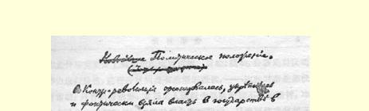
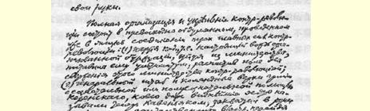
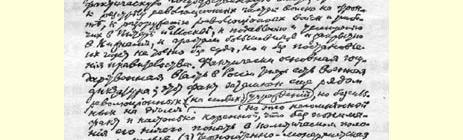
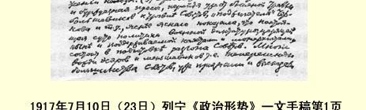

# 政治形势 １

> （１９１７年７月１０日〔２３日〕）

１．反革命组织起来了，巩固起来了，并且实际上已经掌握了国家政权。２

反革命已经完全组织起来和巩固起来，这表现在三种主要的反革命力量经过周密考虑已经实现了联合。这三种主要的反革命力量是：（１）立宪民主党３，即组织起来的资产阶级的真正领袖，它退出内阁时，向内阁提出了最后通牒，为反革命推翻这个内阁扫清了道路。（２）军队的总参谋部和高级将领，他们在克伦斯基（现在连一些最著名的社会革命党人４都称他为卡芬雅克）有意识的或半有意识的帮助下，已经把实际的国家政权夺到手中，并且开始枪杀前线的革命部队，解除彼得格勒和莫斯科的革命军队和工人的武装，在下诺夫哥罗德进行镇压５，不仅不经法庭判决，而且不经政府批准，就逮捕布尔什维克并封闭他们的报馆。现在俄国基本的国家政权实际上是军事专政，这个事实还被许多口头上革命而行动上软弱无力的机关掩盖着。但这是不容置疑的事实，而且是带根本性的事实，不了解它就完全不能了解政治形势。（３）黑帮君主派的和资产阶级的报刊，它们已经从疯狂地攻击布尔什维克转而攻击苏维埃，攻击“煽动者”切尔诺夫等等，这就再清楚不过地表明，现在掌握大权并受到立宪民主党人和君主派支持的军事专政的政策的真正实质，就是准备解散苏维埃。目前在苏维埃中占多数的社会革命党人和孟什维克的许多领袖，在最近几天已经承认了和谈出了这一点，但是，由于他们是真正的小资产者，他们又用最空洞的漂亮词句来掩饰这个可怕的现实。

２．苏维埃以及社会革命党和孟什维克党的领袖们，以策列铁里和切尔诺夫为首，已经彻底出卖了革命事业，把革命事业交给反革命分子，使自己和自己的党以及苏维埃变成了反革命的遮羞布。

这个事实已经得到证明：社会革命党人和孟什维克出卖了布尔什维克，默许了捣毁布尔什维克报馆的行动，甚至不敢直接地公开地告诉人民，这是他们干的，以及为什么他们要这样干。他们使解除工人和革命部队武装的行为合法化，从而就使自己失去了一切实权。他们成了最无聊的空谈家，正在帮助反动势力“转移”人民的注意力，直到反动势力完成解散苏维埃的最后准备。不认识到社会革命党和孟什维克党以及目前的苏维埃多数派这种完全的彻底的破产，不认识到他们的“督政府”以及其他假面具的彻头彻尾的虚伪性，就根本不能了解目前的整个政治形势。

３．俄国革命和平发展的一切希望都彻底破灭了。客观情况是：或者是军事专政取得最终胜利；或者是工人的武装起义取得胜利，而工人的武装起义，只有同经济破坏和战争延长所引起的反政府反资产阶级的群众运动的巨大高潮结合起来才有可能取得胜利。

全部政权归苏维埃的口号是革命和平发展的口号，在４月、５ 月、６月，直到７月５—９日以前，即实际权力转到军事独裁者手中以前，革命和平发展是可能的。现在这个口号已经不正确了，因为它没有考虑到目前发生的这种转变，没有考虑到社会革命党人

> １９１７年７月１０日（２３日）列宁《政治形势》一文手稿第１页
>
> （按原稿缩小） 和孟什维克实际上对革命的彻底背叛。冒险，骚动，分散地对反动势力进行反抗，进行分散的没有希望的抵抗，—— 这些对事业都没有帮助；只有认清形势，发扬工人阶级先锋队坚韧不拔的精神，准备力量举行武装起义，才能对事业有所帮助。目前要使武装起义取得胜利是非常困难的，但是在上面所指出的事实和潮流相结合的情况下，仍然是可能的。不要对立宪和共和国抱任何幻想，不要再对和平道路抱任何幻想，不要进行任何分散的活动，***现在***不要接受黑帮和哥萨克的挑衅，而要聚集力量，重新组织力量，并在危机的进程允许进行真正群众性的全民的武装起义的时候坚决地准备武装起义。现在，不举行武装起义就不可能使土地转归农民，因为反革命在取得政权之后，已经完全同地主阶级联合起来了。

武装起义的目的只能是使政权转到受贫苦农民支持的无产阶级手中，以实现我们党的纲领。

４．工人阶级的党决不放弃合法活动，但一分钟也不对合法活动抱过高的希望，应当象在１９１２—１９１４年那样把合法活动和秘密活动***结合起来***。

就是一小时的合法活动也不要放弃。但是也决不要相信立宪和“和平道路”的幻想。立即在各地建立秘密的组织或支部，来印发传单等等。立即沉着地坚定地在各方面重新部署。

要象在１９１２—１９１４年那样进行活动，当时我们就是既讲要通过革命和武装起义推翻沙皇制度，又不丢掉合法的基地，无论在国家杜马、保险基金会、工会或在其他方面，都没有丢掉合法的基地。

> 载于１９１７年７月２０日（８月２日）译自《列宁全集》俄文第５版 《无产阶级事业报》第６号第３４卷第１—５页