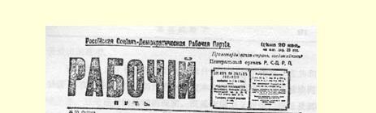
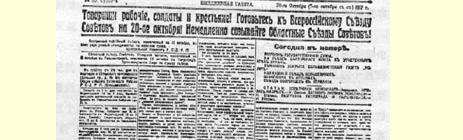
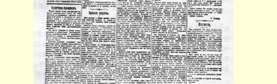
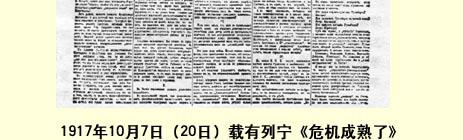

# 危机成熟了 １０３

> （１９１７年９月２９日〔１０月１２日〕）

## 一

毫无疑问，９月底是俄国革命史上，显然也是世界革命史上的一个最伟大的转折点。

世界工人革命是从一些单个人的行动开始的，他们无所畏惧地代表着正式的“社会主义”（实际上是社会沙文主义）腐朽以后所剩下的一切正直的力量。德国的李卜克内西、奥地利的阿德勒、英国的马克林，这些肩负起世界革命先驱者的艰巨使命的孤胆英雄是人们最为熟悉的。

这次革命的第二个历史准备阶段，就是到处群情激愤，这既表现在正式的党的分裂，也表现在秘密出版物的出版和街头游行等等。对战争的抗议愈来愈强烈，遭到政府迫害的人愈来愈多。在德国、法国、意大利和英国这些标榜法治甚至标榜自由的国家中，几十几百个国际主义者、反对战争和拥护工人革命的人被投进监狱。

现在，第三个阶段已经到来，这个阶段可以称之为革命的前夜。在自由的意大利成批地逮捕党的领袖，特别是在德国开始了**军队的起义１０４**，这些无疑是大转折的标志，是全世界**革命前夜**的标志。

毫无疑问，以前德国也个别地发生过士兵哗变的事情，但是规模很小，很零散，没有力量，因此还可以暗中平息、压下不提，这曾经是制止骚乱行动**大规模蔓延**的主要办法。可是，这样的运动终于在海军中也发生了，尽管有制定得极其细密、执行得一丝不苟的严格的德国军事苦役制，但这个运动再也**无法**暗中平息，压下不提了。

不容怀疑，我们正站在世界无产阶级革命的前阶。在世界各国所有的无产阶级国际主义派当中，只有我们俄国布尔什维克享有比较大的自由，拥有公开的党和二十来家报纸，得到两个首都工兵代表苏维埃的支持，在革命时期得到**大多数**人民群众的支持，所以对我们来说，真用得上而且应当用上这样一句话：多得者应当多予。

## 二

在俄国，革命的转折时机显然已经到来。

在一个农民国家里，在小资产阶级民主派中昨天还占优势的社会革命党和孟什维克党所支持的革命共和政府统治之下，**农民起义**正在发展。

这简直是不可想象的，但这是事实。

这一事实并不使我们布尔什维克感到惊奇，我们一直说，这个同资产阶级实行恶名昭彰的“联合”的政府，是**背叛**民主和革命的政府，是进行**帝国主义**大厮杀的政府，是**保护**资本家和地主**不受**人

> １９１７年１０月７日（２０日）载有列宁《危机成熟了》一文的
>
> 《工人之路报》第３０号第１版
>
> （按原版缩小） 民攻击的政府。

在俄国，由于社会革命党人和孟什维克玩弄了骗局，在共和制度下，在革命的时期，仍然有一个资本家地主的政府同苏维埃同时并存。这是痛苦的严峻的现实。既然帝国主义战争的拖延及其后果正在使俄国人民遭受到空前未有的灾难，那么在俄国爆发农民起义，并且日益扩大，这又有什么奇怪呢？

这有什么奇怪呢？甚至布尔什维克的敌人，**正式的**社会革命党的领袖，甚至这个一直支持“联合”的政党的领袖，甚至这个直到最近几天或最近几星期还受到多数人民拥护的政党的领袖，甚至这个正在继续斥责和迫害那些深信联合政策是出卖农民利益的“新” 社会革命党人的政党的领袖，也在他们的正式机关报《人民事业报》９月２９日的社论中写道：

> “……直到现在为止，几乎没有为消灭俄国中部农村中仍占统治地位的奴役关系做什么事…… 调整农村土地关系的法律，早已提交临时政府，甚至已经通过了司法会议这样的涤罪所，但是迄今仍杳无音信，不知压在哪个办公室里…… 我们说，我们的共和政府还远没有摆脱沙皇行政机关的旧习气，斯托雷平那套作风在革命的部长们的办事方式中依然清晰可见，这难道说得不对吗？”

正式的社会革命党人就是这样写的！真是意想不到，主张联合的人居然**不得不**承认，在一个农民国家里经过７个月的革命之后， “几乎没有为消灭〈地主对农民的〉奴役做什么事”！这些社会革命党人**不得不**把他们的同事克伦斯基及其一帮部长称为**斯托雷平分子**。

我们从敌人营垒里得到的证据证明，不仅联合已经破产，不仅那班容忍克伦斯基的正式社会革命党人已经变成**反人民**、**反农民**、 **反革命的**政党，而且整个俄国革命已经到了转折点，难道还能找到比这更有说服力的证据吗？

在一个农民国家里，农民竟举行起义，反对社会革命党人克伦斯基、孟什维克尼基京和格沃兹杰夫以及代表资本、代表地主利益的其他部长们的政府！共和政府居然采取**军事手段**来镇压这一起义。

在这样的事实面前，难道真心诚意拥护无产阶级的人，还能否认危机已经成熟，革命正处在最伟大的转折点吗？还能否认现在让政府战胜农民起义，就等于彻底葬送革命，等于让科尔尼洛夫叛乱取得最后的胜利吗？

## 三

十分明显，既然在一个农民国家里，在民主共和国建立了７个月之后，居然弄到发生农民起义的地步，这就无可争辩地证明，革命正面临着全国性的崩溃，革命危机达到空前尖锐的程度，反革命势力快要达到**极限**了。

这是非常明显的。在农民起义这样的事实面前，其他一切政治征兆，即使同这种全国性危抗的成熟相矛盾，也完全没有任何意义。

况且情况相反，一切征兆都表明，全国性危机已经成熟。

在全俄政治生活中，除了土地问题以外，民族问题具有特别重大的意义，尤其是对居民中的小资产阶级群众更是如此。我们看到，在策列铁里先生之流所伪造的“民主”会议上，“民族”代表团就激进性来说占第二位，仅次于工会代表团，对联合投**反对**票的百分比（５５票中，反对的占４０票）**高于**工兵代表苏维埃代表团。克伦斯基政府，即镇压农民起义的政府正在从芬兰撤出革命的部队，以加强反动的芬兰资产阶级。在乌克兰，乌克兰人特别是乌克兰军队同政府的冲突日益频繁。

其次，我们来看看军队。在战争时期，军队在全国政治生活中具有特别重大的意义。我们看到，芬兰陆军和波罗的海舰队完全同政府**决裂**了。我们看到非布尔什维克军官杜巴索夫的发言，他代表整个前线发表了比所有布尔什维克还要革命的言论：士兵不会再打下去了。１０５我们看到政府的报告说，士兵的情绪“极易波动”，不能保证“秩序”（即不能保证这些部队去参加镇压农民起义）。最后， 我们看到，在莫斯科的选举中，１７０００名士兵中有１４０００名投布尔什维克的票。

莫斯科区杜马选举的投票结果，是全国人心发生极深刻变化的最明显的征兆之一。大家都知道，莫斯科要比彼得格勒更带有小资产阶级性。莫斯科的无产阶级同农村关系要密切得多，更加同情农村，更加接近农民的情绪，这是多次证实了的无可争辩的事实。

而社会革命党人和孟什维克在莫斯科所得的选票，从６月份的７０％降到１８％。小资产阶级抛弃了联合，人民抛弃了联合，这是无可怀疑的。立宪民主党所得的选票从１７％增加到３０％，他们仍旧是少数，毫无希望的少数，尽管“右派”社会革命党人和“右派”孟什维克显然同他们结合在一起了。《俄罗斯新闻》１０６说，立宪民主党得票的**绝对**数字从**６７０００**减少到**６２０００**。只有布尔什维克得票的数字增加，从３４０００增加到８２０００。布尔什维克得票占总数４７％。 现在我们同左派社会革命党人一起，不论在苏维埃中，不论在军队里，不论**在整个国家中**都拥有了多数，这是丝毫不容怀疑的。

此外，下述事实也应当算作一个不仅具有征兆的意义，而且具有非常重大的实际意义的征兆：对整个经济、对整个政治、对军事都是举足轻重的铁路邮电员工大军，还在继续同政府发生尖锐的冲突１０７；连孟什维克护国派对“自己的”部长尼基京也表示不满，连正式的社会革命党人也把克伦斯基之流称为“斯托雷平分子”。由此可见，孟什维克和社会革命党人对政府的这种“支持”只具有（如果有的话）反面的意义，难道不是这样吗？

## 四 ····························

## 五

是的，中央执行委员会的领袖们正在实行保护资产阶级和地主的正确策略。要是布尔什维克落入立宪幻想的圈套，落入“相信”苏维埃代表大会、“相信”立宪会议的召开和“等待”苏维埃代表大会等等的圈套，—— 毫无疑问，这样的布尔什维克就成了无产阶级事业的**可耻的叛徒**。

如果这样，他们就成了无产阶级事业的叛徒，因为他们以这种行为出卖了已经在海军中开始起义的德国革命工人。在这种情况下，“等待”苏维埃代表大会等等，就是**背叛国际主义**，背叛国际社会主义革命的事业。

因为国际主义不在于言词，不在于表示声援，不在于决议，而在于**行动**。

这样的布尔什维克就成了出卖**农民**的叛徒，因为容许政府（**甚至**《人民事业报》也把这个政府比作斯托雷平分子）镇压农民起义， 就等于**断送**整个革命，永远地无法挽回地断送革命。有人叫喊什么无政府状态，叫喊什么群众的态度日益冷漠。既然农民**被逼到不得不举行起义的地步**，而所谓“革命民主派”又容许对它实行军事镇压，那么群众怎么会不对选举表示冷漠呢！！

这样的布尔什维克就成了出卖民主和自由的叛徒，因为在这样的时机容许镇压农民起义，***无异是***听任伪造立宪会议的选举，如同伪造“民主会议”和“预备议会”**一模一样**，甚至伪造得更拙劣更粗暴。

危机成熟了。俄国革命的整个前途已处在决定关头。布尔什维克党的全部荣誉正在受到考验。争取社会主义的国际工人革命的整个前途都在此一举。

危机成熟了……

１９１７年９月２９日

以上可以发表。以下***分发给中央委员会***、***彼得格勒委员会***、***莫斯科委员会***以及***苏维埃***的委员。

## 六

究竟该做什么呢？应当ａｕｓｓｐｒｅｃｈｅｎ ｗａｓ ｉｓｔ，“有什么，说什么”，应当老实承认：在我们中央委员会里，在党的上层分子中存在着一种主张**等待**苏维埃代表大会，**反对**立即夺取政权，**反对**立即起义的倾向或意见。必须***制止***这种倾向或意见１０８。

否则，布尔什维克就会***遗臭***万年，***毁灭***自己的党。

因为错过这样的时机而“等待”苏维埃代表大会，就是**十足的白痴**或**彻底背叛**。

这就是彻底背叛德国工人。我们不能等待他们**开始**革命！！要是这样，李伯尔唐恩之流也将同意“支持”革命了。但是，在克伦斯基和基什金之流掌握政权的时候，革命是**不能**开始的。

这就是彻底背叛农民。我们既然拥有两个**首都的**苏维埃，却又让农民起义受到镇压，这样就会**丧失**而且**理应丧失**农民的一切信任，在他们看来我们同李伯尔唐恩之流以及其他坏蛋就不相上下了。

“等待”苏维埃代表大会就是十足的白痴，因为这样就要耽误 ***几个星期***，而现在几个星期，甚至几天可以决定***一切***。这样就是畏缩不前，**放弃**夺取政权，因为到１１月１—２日夺取政权就不可能了 （不论在政治上或者技术上都不可能，因为在愚蠢地“规定的”[^1]起义日期到来之前，哥萨克已经调到了）。

“等待”苏维埃代表大会就是白痴，因为代表大会**不会有什么结累**，***也不可能有什么结果***！

具有“道义上的”意义吗？那才奇怪呢！！我们知道，苏维埃***支持***农民，而农民起义**正受到镇压**，在这个时候竟谈论什么决议的 “意义”，同李伯尔唐恩之流谈判的“意义”！！这样一来，我们倒真会使**苏维埃**流为可耻的空谈家。先战胜克伦斯基，然后再召开代表大会吧！

现在对于布尔什维克来说，起义的胜利***是有保证的***：（１）我们能够[^2]（如果不“等待”苏维埃代表大会）从彼得格勒、莫斯科和波罗的海舰队这三个据点**出其不意地**进行攻击；（２）我们有保证能得到拥护的口号：打倒镇压农民反对地主的起义的政府！（３）我们**在全国**拥有多数；（４）孟什维克和社会革命党人已经乱作一团；（５）我们在莫斯科（为了乘其不备，击破敌人，甚至可以从这里首先发难） 有夺取政权的技术能力；（６）我们在彼得格勒有***数千名***武装工人和士兵，他们能够***一举***占领冬宫、总参谋部、电话局以及各大印刷厂； 我们不会被人从那里撵走，因为我们将在***军队***中进行这样的鼓动： 他们***不能***反对给人民以和平、给农民以土地等等的政府。

如果我们立刻从彼得格勒、莫斯科和波罗的海舰队这三个据点突然进行攻击，那么我们有百分之九十九的可能获得胜利，而且我们的牺牲会比７月３—５日的牺牲小，因为***军队不会***反对和平的政府。即使克伦斯基在彼得格勒***已经***有“可靠的”骑兵等等，在两面夹攻以及军队同情***我们***的情况下，他也不得不***投降***。如果有目前这样的机会还不夺取政权，那么一切关于政权归苏维埃的言论就都成了***谎话***。

现在不夺取政权，而要“等待”，要在中央执行委员会里空谈， 仅限于“为争取机关”（苏维埃的）“而斗争”、“为争取代表大会而斗争”，这就等于**断送革命**。

鉴于中央委员会***甚至***迄今***没有答复***我自民主会议开幕以来所坚持的上述精神的主张，鉴于中央机关报***删掉了***我的文章中指出布尔什维克作出参加预备议会的可耻决定，把苏维埃主席团的席位让给孟什维克等等，是犯了不可容忍的错误的几段话，我不能不认为这是“微妙地”暗示中央委员会甚至不愿意讨论这一问题，“微妙地”暗示要封住我的嘴，并且要我引退。

我不得不**提出退出中央委员会的请求**，在此我提出这一请求， 同时保留***在***党的***下层***以及在党的代表大会上进行鼓动的自由。

因为我深信，如果我们“等待”苏维埃代表大会，放过目前的时机，就等于***断送***革命。

### 尼·列宁

９月２９日

附言：许多事实表明，***就连***哥萨克军队也不会反对和平的政府！而这些军队又有多少呢？他们在哪里呢？难道整个军队不会派部队来***援助***我们吗？

> 第１—３节和第５节载于１９１７年译自《列宁全集》俄文第５版 １０月７日（２０日）《工人之路报》第３４卷第２７２—２８３页第３０号；第６节发表于１９２４年

[^1]: 主张１０月２０日“召开”苏维埃代表大会以决定“夺取政权”的问题，这同愚蠢地“规定”起义日期究竟有什么区别呢？？现在夺取政权是可能的，而到１０月２０—２９日，就不容许你夺取了。

[^2]: 党在研究军队布防以及进行象“艺术”一样的起义等等方面，到底做了些什么呢？—— 只是在中央执行委员会中发发议论，如此等等！！