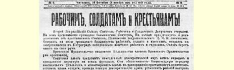
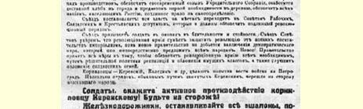
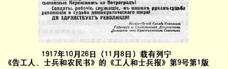

# 全俄工兵代表苏维埃第二次代表大会文献５

> （１９１７年１０月下旬）

## １ 告工人、士兵和农民书

> （１０月２５日〔１１月７日〕）

全俄工兵代表苏维埃第二次代表大会开幕了。绝大多数苏维埃都派出代表参加这次代表大会。很多农民苏维埃的代表也出席了代表大会。妥协派把持的中央执行委员会６的权力结束了。根据绝大多数工人、士兵和农民的意志，依靠彼得格勒工人和卫戍部队所举行的胜利起义，代表大会已经把政权掌握在自己手里。

临时政府已经被推翻。临时政府的大多数成员已被逮捕。

苏维埃政权将向各国人民提议立即缔结民主和约，立即在各条战线上停战。苏维埃政权将保证把地主、皇族和寺院的土地无偿地交给农民委员会处置；将使军队彻底民主化，以维护士兵的权利；将规定工人监督生产；将保证按时召开立宪会议；将设法把粮食运往城市，把生活必需品运往农村；将保证俄国境内各民族都享有真正的自决权。

代表大会决定：全部地方政权一律转归当地的工兵农代表苏维埃，各地苏维埃应负责保证真正的革命秩序。

代表大会号召前线士兵要警惕沉着。苏维埃代表大会深信，在新政府向各国人民直接提出的民主和约尚未缔结以前，革命军队定能捍卫革命，使其不受帝国主义的任何侵犯。新政府将采取一切措施，实行向有产阶级征收和课税的果断政策，以保证供给革命军队一切必需品，并改善士兵家属的生活。

克伦斯基和卡列金等科尔尼洛夫分子正试图调军队到彼得格勒来。有几支被克伦斯基用欺骗手段调动的部队已经站到起义的人民这一边来了。

**士兵们**，**积极反抗科尔尼洛夫分子克伦斯基**！**提高警惕**！

**铁路员工们**，**使克伦斯基派到彼得格勒来的所有军车都停下来**！

**士兵们**，**工人们**，**职员们**，**革命的命运和民主和约的命运完全操在你们手里**！

***革命万岁***！

### 全俄工兵代表苏维埃代表大会农民苏维埃代表

> 载于１９１７年１０月２６日（１１月８日）译自《列宁全集》俄文第５版 《工人和士兵报》第９号第３５卷第１１—１２页

> １９１７年１０月２６日（１１月８日）载有列宁
>
> 《告工人、士兵和农民书》的《工人和士兵报》第９号第１版
>
> （按原版缩小）

## ２ 关于和平问题的报告

> （１０月２６日〔１１月８日〕）

和平问题是现时紧要而棘手的问题。这个问题已经讲得很多， 写得很多，想必你们大家对这个问题也讨论得不少了。因此让我来宣读一个宣言，这个宣言拟将由你们选出的政府来发表。

### 和平法令

１０月２４—２５日的革命所建立的、依靠工兵农代表苏维埃的工农政府，向一切交战国的人民及其政府建议，立即就缔结公正的民主的和约开始谈判。

本政府认为，一切交战国中因战争而精疲力竭、困顿不堪、痛苦万状的工人和劳动阶级的绝大多数所渴望的公正的或民主的和约，推翻沙皇君主制以后俄国工农最明确最坚决地要求的和约，就是立即缔结的没有兼并（即不侵占别国领土，不强制归并别的民族）没有赔款的和约。

俄国政府向一切交战国人民建议立即缔结这种和约，并且决心不等到各国和各民族的享有全权的人民代表会议最后批准这种和约的全部条件，就立即毫不迟延地采取一切果断步骤。

本政府根据一般民主派的法的观念，特别是劳动阶级的法的观念，认为凡是把一个没有明确而自愿地表示同意和希望归并的弱民族或小民族并入一个大国或强国，就是兼并或侵占别国领土， 不管这种强制归并发生在什么时候，不管这个被强制归并或强制留在该国疆界内的民族的发达或落后程度如何，也不管这个民族是居住在欧洲还是居住在远隔重洋的国家，都是一样。

不管哪个民族被强制留在该国的疆界内，也就是违反这个民族的愿望（不管这种愿望是在报刊上、人民会议上、政党的决议上表示的，或是以反对民族压迫的骚动和起义表示的，都完全一样）， 不让它有权在归并它的民族或较强的民族完全撤军的条件下，不受丝毫强制地用自由投票的方式决定本民族的国家生存形式问题，这种归并就是兼并，即侵占和暴力行为。

本政府认为，各富强民族为了如何瓜分它们所侵占的弱小民族而继续进行战争，是反人类的滔天罪行，并郑重声明，决心根据上述的、对所有民族都无一例外是公正的条件，立即签订和约，终止这场战争。

同时本政府声明，上述和平条件决非最后通牒式的条件，也就是说，它愿意考虑任何其他和平条件，而只坚持任何交战国都要尽快地提出这种条件，条件要提得极端明确，没有丝毫的含糊和秘密。

本政府废除秘密外交，决意在全体人民面前完全公开地进行一切谈判，并立刻着手无保留地公布地主资本家政府从１９１７年２ 月到１０月２５日所批准和缔结的各项秘密条约。本政府宣布立即无条件地废除这些条约的全部规定，因为这些规定多半是为了替俄国地主和资本家谋取利益和特权，是为了保持和扩大大俄罗斯人所兼并的土地。

本政府在建议各国政府和人民立即就缔结和约问题进行公开谈判的同时，表示愿意通过电报往来，通过各国代表之间的会谈， 或通过各国代表的会议来进行这种谈判。为了便于进行这种谈判， 本政府特派自己的全权代表前往中立的国家。

本政府向一切交战国政府和人民建议，立即缔结停战协定，并认为停战时间最好不少于三个月，以便有充分的时间使所有卷入战争或被迫参战的民族的代表完成他们所参加的和约谈判，同时也使各国享有全权的人民代表会议能召开会议最终批准和约条件。

俄国工农临时政府在向一切交战国政府和人民提出以上媾和建议的同时，特别向人类三个最先进的民族，这次战争中三个最大的参战国，即英法德三国的觉悟工人呼吁。这些国家的工人对于进步和社会主义事业贡献最多，例如英国的宪章运动７树立了伟大的榜样，法国无产阶级进行过多次具有世界历史意义的革命，最后，德国工人进行过反对非常法８的英勇斗争，并为建立德国无产阶级群众组织进行过堪称全世界工人楷模的长期的坚持不懈的有纪律的工作。所有这些无产阶级英雄主义和历史性的创造的范例， 都使我们坚信上述各国工人定会了解他们现在所担负的使人类摆脱战祸及其恶果的任务，定会从各方面奋力采取果敢的行动，帮助我们把和平事业以及使被剥削劳动群众摆脱一切奴役和一切剥削的事业有成效地进行到底。

１０月２４—２５日的革命所建立的、依靠工兵农代表苏维埃的工农政府，应当立即开始和平谈判。我们应当既向各国政府，也向各国人民呼吁。我们不能漠视各国政府，否则就可能拖延和约的签订，人民政府不应当这样做，但是我们也没有任何权利不同时向各国人民呼吁。各国政府和人民之间都有分歧，所以我们应当帮助各国人民干预战争与和平的问题。当然，我们要极力坚持我们的没有兼并和赔款的全部和平纲领。我们决不放弃这个纲领，但是我们应当使敌人无法抓住把柄说，他们的条件跟我们不同，因此没有必要同我们谈判。不，我们应当使他们无机可乘，我们不应当以最后通牒的方式提出我们的条件。所以才写进这样一句话，说我们将考虑任何和平条件和一切建议。我们将予以考虑，这并不是说将予以接受。我们要把它们提交立宪会议讨论，立宪会议有权决定什么可以让步，什么不可以。我们要与各国政府的欺骗行为作斗争，它们都口头上高谈和平和正义，而实际上却在进行掠夺性的强盗战争。没有一个政府会把它想的统统说出来。我们是反对秘密外交的，我们要在全体人民面前公开行事。我们不忽视，而且也没有忽视过困难。战争不能用拒绝的办法来结束，不能由单方面来结束。我们建议停战三个月，可是我们也不拒绝较短的期限，以便使疲惫不堪的军队可以得到哪怕是短暂的喘息，同时，一切文明国家也有必要召集人民会议，讨论和平条件。

在建议立即缔结停战协定的同时，我们也向那些对开展无产阶级运动有过许多贡献的国家的觉悟工人呼吁。我们向进行过宪章运动的英国工人呼吁，向屡次在起义中充分表现出阶级觉悟的力量的法国工人呼吁，也向经历过反对反社会党人非常法的艰苦斗争并建立了强大组织的德国工人呼吁。

在３月１４日的宣言９中，曾提出要推翻银行家，可是我们自己不但没有推翻本国的银行家，甚至还同他们结成了联盟。现在我们已经把银行家的政府推翻了。

各国政府和资产阶级定会竭尽全力以图联合起来，把工农革命淹没在血泊里。可是三年战争已使群众获得了充分的教训。其他国家也发生了苏维埃运动，在德国有过海军起义１０，尽管它被刽子手威廉的士官生镇压下去了。最后，要记着，我们不是处在非洲的荒漠，而是处在欧洲，这里的一切可以很快地让人们都知道。

工人运动定会占上风，定会铺平走向和平与社会主义的道路。 （掌声经久不息）

> 载于１９１７年１０月２８日（１１月１０日）译自《列宁全集》俄文第５版 《真理报》第１７１号和《中央执行委员弟３５卷第１３—１８页会消息报》第２０９号；和平法令载于 １９１７年１０月２７日（１１月９日）《真理报》第１７０号和《中央执行委员会消息报》第２０８号

## ３ 关于和平问题的报告的总结发言

> （１０月２６日〔１１月８日〕）

我不打算谈宣言的一般性质。你们的代表大会将要建立的政府，对于一些不大重要的条款可以修改。

我将坚决反对以最后通牒的方式提出我们的和平要求。最后通牒的方式会葬送我们的整个事业。我们不能坚持我们的要求毫无变通的余地，这会给帝国主义政府以口实，它们会说，我们抱着毫不妥协的态度，所以无法进行和平谈判。

我们把我们的宣言散发到各地去，大家就会知道。谁想隐瞒我们工农政府提出的条件，就办不到了。

要想隐瞒我国推翻了银行家地主政府的工农革命，是不可能的。

如果采用最后通牒的方式，各国政府就可能置之不理，如果采用我们那样的措辞，它们就不得不答复。要让每个人都知道，他们的政府究竟是怎样想的。我们不希望有什么秘密。我们希望政府时刻受到本国舆论的监督。

如果由于我们采取最后通牒的方式，某边远省份的某农民无从知道别国政府想些什么，那他会怎样说呢？他会说：同志们，你们为什么不让别人有提出各种和平条件的机会呢？我倒要琢磨琢磨， 看看各种条件，然后再告诉我们那些出席立宪会议的代表怎样做。 如果别国政府都不同意，我决心用革命的手段为争取公正的条件而斗争；不过，某些国家也可能有这样的条件，我愿意让这些国家的政府自己去继续斗争。我们的想法，只有推翻整个资本主义制度才能完全实现。这就是农民可能会对我们说的话，他还会责备我们在细节上太不通融，因为我们当前主要是要揭露资产阶级及其派去充当政府首脑的戴皇冠的和不戴皇冠的刽子手的一切卑鄙行径。

我们不能够而且不应当让各国政府把我们毫不通融的态度当作借口，向人民隐瞒它们驱使人民互相厮杀的目的。这不过是一滴水，但是我们不能够而且也不应当放弃这一滴可以滴穿资产阶级掠夺行为顽石的水。最后通牒方式会缓和我们敌人的困难处境。我们要把一切条件都告诉人民。我们要使各国政府正视我们的条件， 让它们去回答本国的人民。我们要把一切和平建议提交立宪会议决定。

同志们，条文中还有一点你们应当十分注意。秘密条约一定要公布。关于兼并和赔款的条款一定要废除。同志们，有各种各样的条款，各个强盗政府不仅达成了关于掠夺的协议，而且还就经济问题以及关于睦邻关系的其他各种条款达成了协议。

我们既不用条约来束缚自己，也不让别人用条约来束缚我们。 我们拒绝一切关于掠夺和暴力的条款，但是我们乐于接受一切关于睦邻关系的条款和经济协定，这些我们是不能拒绝的。我们建议停战三个月，我们选择一个长的期限，是因为各国人民已被拖了三年多的流血战争弄得疲惫不堪，渴望休息。我们应当懂得，必须让各国人民在议会参加下讨论和平条件，表明自己的意愿，而这就需要一定的时间。我们要求长时间停战，是为了让前线部队得到休息，停止恶梦似的无休止的厮杀，可是我们也不拒绝较短时间的停战的建议，我们要研究这种建议，而且应当接受这种建议，哪怕向我们提出的是停战一个月或一个半月的建议。我们的停战建议也不应当是最后通牒式的，因为决不能让敌人把我们毫不妥协的态度当作借口，向人民隐瞒全部真相。这种建议决不应当是最后通牒式的，因为不愿停战的政府就是犯罪的政府。如果我们不把停战建议变成最后通牒式的，我们就能使各国政府成为本国人民眼里的罪犯，而人民对于这样的罪犯是决不会客气的。有人反驳我们说， 我们不采用最后通牒方式，就是表示我们软弱；可是现在该是抛弃资产阶级所谓人民力量的一切谎话的时候了。在资产阶级看来，只有当群众听从帝国主义政府指使，盲目去进行厮杀的时候，才算是有力量。只有当一个国家能运用政府机构的全部威力，把群众派遣到资产阶级当权者想叫他们去的地方的时候，资产阶级才认为这个国家有力量。而我们对力量的理解却不同。在我们看来，一个国家的力量在于群众的觉悟。只有当群众知道一切，能判断一切，并自觉地从事一切的时候，国家才有力量。我们丝毫用不着害怕说出疲乏的真情实况，试问现在哪一个国家不是疲乏不堪，哪一国人民不在公开谈论这一点呢？就拿意大利来说吧，那里由于疲乏不堪而产生过要求结束这场厮杀的长期的革命运动。难道在德国没有发生过工人的群众性示威运动，提出停止战争的口号吗？难道被刽子手威廉及其奴仆残暴地镇压下去的德国海军起义不是疲乏不堪引起的吗？既然在德国这样纪律严明的国家都可能发生这样的现象， 开始说疲乏，说要停止战争，那我们就丝毫用不着害怕公开讲出这一点，因为这无论对于我们，对于一切交战国，甚至对于非交战国来说，都是千真万确的实情。

> 载于１９１７年１０月２８日（１１月１０日）《真理报》译自《列宁全集》俄文第５版第１７１号和《中央执行委员会消息报》第２０９号第３５卷第１９—２２页

## ４ 关于土地问题的报告

> （１０月２６日〔１１月８日〕）

我们认为革命已经证实和表明，把土地问题提得很明确是十分重要的。武装起义，第二次革命即十月革命的发生已经清楚地证明，应当把土地交给农民。已被推翻的政府，以及妥协的孟什维克党和社会革命党１１犯下了罪行，它们用各种口实拖延土地问题的解决，从而使国家陷于经济破坏，激起了农民的起义。他们大谈农村里的大暴行和无政府状态，显然是撒谎和玩弄怯懦的欺骗手腕。 试问什么时候什么地方明智的措施造成过大暴行和无政府状态呢？如果政府的行为是明智的，如果它的措施合乎贫苦农民的需要，难道农民群众还会闹风潮吗？但是政府所采取的、阿夫克森齐耶夫和唐恩领导的苏维埃所赞同的一切措施，都是反对农民的，逼得他们不得不举行起义。

这个政府引起了起义，却又对它自己引起的大暴行和无政府状态大叫大嚷。政府本想用铁和血来镇压起义，可是它自己却被革命士兵、水兵和工人的武装起义扫除了。工农革命政府首先应当解决土地问题，—— 能使广大贫苦农民群众得到安慰和满足的问题。 现在我向你们宣读拟由你们的苏维埃政府颁布的法令的条文，其中一条附有根据２４２份地方农民代表苏维埃委托书拟订的给各地土地委员会的委托书。

### 土地法令

（１）立刻废除地主土地所有制，不付任何赎金。

（２）地主的田庄以及一切皇族、寺院和教会的土地，连同所有耕畜、农具、农用建筑和一切附属物，一律交给乡土地委员会和县农民代表苏维埃支配，直到召开立宪会议时为止。

（３）任何毁坏被没收的即今后属于全民的财产的行为，都是严重的罪行，革命法庭应予惩处。县农民代表苏维埃应采取一切必要的措施，保证在没收地主田庄时遵守最严格的秩序，确定达到多大面积的土地以及哪些土地应予没收，编制全部没收财产的清册，并对转归人民所有的、土地上的产业，包括一切建筑物、工具、牲畜和储存产品等等，用革命手段严加保护。

（４）下附农民委托书是由《全俄农民代表苏维埃消息报》１２编辑部根据２４２份地方农民委托书拟订的，公布于该报第８８号（彼得格勒，１９１７年８月１９日第８８号），在立宪会议对伟大的土地改革作出最后决定以前，各地应该以这份委托书作为实行这一改革的指南。

### 农民的土地问题委托书

> “土地问题只有全民立宪会议才能加以通盘解决。
>
> 解决土地问题的最公正的办法应该是： （１）**永远废除土地私有权**；禁止买卖、出租、典押或以任何其他方式转让土地。
>
> 一切土地：**国家的**、**皇族的**、**皇室的**、**寺院的**、**教会的**、**工厂占有的**、**长子继承的**、**私有的**、**公共的和农民等等的土地**，**一律无偿转让**，成为全民财产并交给一切耕种土地的劳动者使用。
>
> 因财产变革而受到损失的人，只有在适应新生活条件所必需的时间内， 才有权取得社会帮助。 （２）所有地下资源，如矿石、石油、煤炭、盐等等，以及具有全国意义的森林和水流，归国家专用。一切小的河流、湖泊和森林等等交给村社利用，但必须由地方自治机关管理。 （３）**经营水平高**的农场所占的土地，如果园、种植园、苗圃、养殖场、温室等等，**不得分割**，**而应改为示范农场**，并视其规模和作用，归**国家或村社**专用。
>
> 城乡的宅地连同家用果园和菜园，仍归原主使用，其面积和税额，由法律规定之。 （４）养马场，官办和民营的种畜场和种禽场等等，一律没收，变为全民财产，并视其规模和作用，归国家或村社专用。
>
> 赎金问题应由立宪会议审议。 （５）被没收的土地上的全部耕畜和农具，视其大小和用途，无偿转归国家或村社专用。
>
> 土地少的农民的耕畜和农具不在没收之列。 （６）凡愿意用自己的劳动，依靠家属的帮助或组织协作社从事耕种的一切俄国公民（不分性别），均享有土地使用权，但仅以有力耕种的期间为限。禁止使用雇佣劳动。
>
> 村团成员一时丧失劳动力在两年以内者，村团在该成员劳动力尚未恢复的这段时间，有责任通过共耕制的办法予以帮助。
>
> 农民因年老或残废而不再能自己耕种土地时，便丧失其土地使用权，但可向国家领取赡养费。 （７）土地应当平均使用，即根据当地条件，按劳动土地份额或消费土地份额把土地分配给劳动者。
>
> 使用土地的方式应完全自由，究竟采用按户、按独立农庄、按村社、还是按劳动组合的方式，由各乡村自行决定。 （８）一切土地转让后都归入全民地产。在劳动者中分配土地的事宜，由地方的和中心的自治机关（从按民主原则组成的无等级的城乡村社起到各区域中心的机关止）负责主持。
>
> 根据人口增加、农业生产率和经营水平的提高等情况，土地应定期重新分配。
>
> 改变份地地界时，原份地的基本地段应予保留。
>
> 因故离村者应交还其土地，但其近亲及其所指定的人，有取得该段土地的优先权。
>
> 施肥和改良土壤（根本改良）投入的价值，由于在交还份地时尚未用尽， 应予补偿。
>
> 如果个别地方现有土地不能满足当地全体居民需要，过剩人口应迁往他处。
>
> 组织移民和移民费用以及农具供应等等概由国家负责。
>
> 移民应按下列次序办理：首先是自愿迁移的无地农民，其次是品行不良的村社社员、逃兵等等，最后，才采取抽签或协商的办法。”
>
> 这个委托书的全部内容表达了全俄绝大多数觉悟农民的绝对意志，应立即宣布为临时法律，并应在立宪会议召开以前，尽可能立即实行，其中哪些部分必须逐步实行，应由县农民代表苏维埃决定。 （５）普通农民和普通哥萨克的土地概不没收。
>
> 这里有人叫嚷，说这个法令和委托书是社会革命党人拟订的。就让它这样吧。谁拟订的不都是一样吗？我们既是民主政府，就不能漠视下层人民群众的决定，即使我们并不同意。只要把这个决议运用到实际当中去，在各地实行起来，那时农民自己就会通过实际生活烈火的检验懂得，究竟什么是对的。即使农民还继续跟社会革命党人走，即使他们使这个党在立宪会议上获得多数，那时我们还是要说：就让它这样吧。实际生活是最好的教师，它会指明谁是正确的；就让农民从这一头，而我们从另一头来解决这个问题吧。实际生活会使我们双方在革命创造的总的巨流中，在制定新的国家形式的事业中接近起来的。我们应当跟随着实际生活前进，我们应当让人民群众享有发挥创造精神的充分自由。已被武装起义推翻的旧政府，曾想依靠没有撤换的沙皇旧官僚来解决土地问题。可是这些官僚不去解决问题，反而一味反对农民。农民在我国八个月的革命当中，已学会了一些东西，他们想要亲自解决一切有关土地的问题。所以我们反对对这个法案作任何修改，我们不希望规定得很详细，因为我们写的是法令，而不是行动纲领。俄国幅员广大，各地条件不同；我们相信农民自己会比我们更善于正确地妥当地解决问题。至于究竟是按照我们的方式，还是按照社会革命党人纲领所规定的方式，并不是问题的实质。问题的实质在于使农民坚信农村中再不会有地主了，一切问题将由农民自己来解决，他们的生活将由他们自己来安排。（热烈鼓掌） 载于１９１７年１０月２８日（１１月１０日）译自《列宁全集》俄文第５版 《真理报》第１７１号和《中央执行委员第３５卷第２３—２７页会消息报》第２０９号

## ５ 关于成立工农政府的决定

> （１０月２６日〔１１月８日〕）

全俄工兵农代表苏维埃代表大会决定：

成立工农临时政府，在立宪会议召开以前管理国家，临时政府定名为人民委员会。设立各种委员会，主持国家生活各部门的事务，其成员应与工人、水兵、士兵、农民和职员等群众组织紧密团结，保证实行代表大会所宣布的纲领。行政权属于由这些委员会主席组成的会议，即人民委员会。

监督和撤换各人民委员的权利，属于全俄工农兵代表苏维埃代表大会及其中央执行委员会。

现在的人民委员会由下列人员组成：

人民委员会主席：**弗拉基米尔·乌里扬诺夫（列宁）**；

内务人民委员：**阿·伊·李可夫**；

农业人民委员：**弗·巴·米柳亭**；

劳动人民委员：**亚·加·施略普尼柯夫**；

陆海军人民委员会，其成员是：**弗·亚·奥弗申柯（安东诺夫）**，**尼·瓦·克雷连柯和帕·叶·德宾科**；

工商业人民委员：**维·巴·诺根**；

国民教育人民委员：**阿·瓦·卢那察尔斯基**；

财政人民委员：**伊·伊·斯克沃尔佐夫（斯捷潘诺夫）**；

外交人民委员：**列·达·勃朗施坦（托洛茨基）**；

司法人民委员：**格·伊·奥波科夫（洛莫夫）**；

粮食人民委员：**伊·阿·泰奥多罗维奇**；

邮电人民委员：**尼·巴·阿维洛夫（格列博夫）**；

民族事务委员会主席：**约·维·朱加施维里（斯大林）**。

铁道人民委员人选暂缺。

> 载于１９１７年１０月２７日（１１月９日）译自《列宁全集》俄文第５版 《工人和士兵报》第１０号第３５卷第２８—２９页