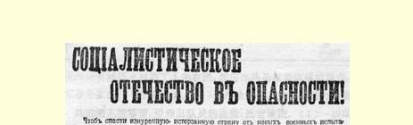
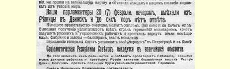
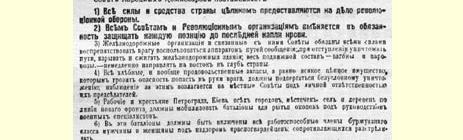
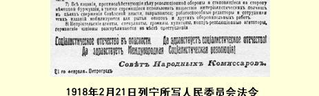

# 社会主义祖国在危急中！ １６７

> （１９１８年２月２１日）

为了使疲惫不堪、疮痍满目的国家免除新的战祸，我们愿忍受最大的牺牲，向德国人声明我们同意接受他们提出的媾和条件。我们的军事谈判代表已于２月２０日（７日）傍晚离开列日察到德文斯克去了，**可是到现在还没有回音**。德国政府显然是在拖延答复。 它显然是不愿意媾和。德国军国主义履行各国资本家的委托，**要扼杀俄罗斯和乌克兰的工人和农民**，**要把土地归还地主**，**工厂归还银行家**，**政权恢复君主制**。德国将军们想在彼得格勒和基辅建立自己的“秩序”。**苏维埃社会主义共和国处在万分危急中**。在德国无产阶级尚未行动起来和取得胜利之前，俄国工农的神圣义务，就是要奋不顾身地保卫苏维埃共和国，抗击资产阶级帝国主义德国的庞大军队。人民委员会决定：（１）**全国所有一切人力物力全部用于革命的国防事业**。**（２）各级苏维埃和革命组织务必保卫每一个阵地**， **战斗到流尽最后一滴血**。（３）所有铁路组织及与之有关的苏维埃， 必须全力阻挠敌人利用铁路设施；在退却时必须破坏轨道，炸毁和烧掉铁路建筑物；全部车辆—— 车厢和机车—— 立即开往我国东部内地去。（４）凡有落入敌人手中危险的全部谷物储备和存粮以及一切贵重财物，应当无条件地销毁；责成各地苏维埃监督执行，并由各苏维埃主席亲自负责。（５）彼得格勒、基辅以及新战

> １９１８年２月２１日列宁所写人民委员会法令
>
> 《社会主义祖国在危急中！》（单页）
>
> （按原版缩小） 线沿线所有城镇乡村的工人和农民，都应当动员起来组成挖壕营， 在军事专家指导下挖掘战壕。**（６）资产阶级中凡有劳动能力的男女**，**均应编入挖壕营**，**受赤卫队员的监视**；**违者枪毙**。（７）一切反对革命的国防事业而站到德国资产阶级方面去的以及想利用帝国主义军队的侵略来推翻苏维埃政权的出版机关，一律封闭；这些出版机关中凡有劳动能力的编辑和工作人员都动员去挖掘战壕和修筑其他防御工事。**（８）所有敌方奸细**、**投机商人**、**暴徒**、**流氓**、**反革命煽动者**、**德国间谍**，**一律就地枪决**。

**社会主义祖国在危急中**！**社会主义祖国万岁**！**国际社会主义革命万岁**！

### 人民委员会

１９１８年２月２１日于彼得格勒

> 载于１９１８年２月２２日（３月９日）译自《列宁全集》俄文第５版 《真理报》第３２号和《中央执行委员会第３５卷第３５７—３５８页消息报》第３１号