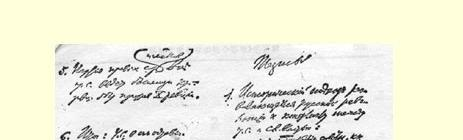
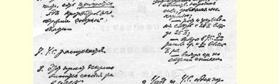
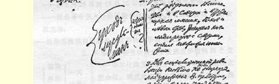
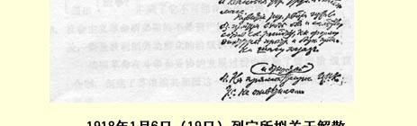

# 附录在全俄农民代表苏维埃非常代表大会上关于土地问题的讲话的提纲 [^1]

> （１９１７年１１月１４日〔２７日〕）
>
> **提纲** 引言

（１）不代表政府，而代表党和党团。

（２）维护自己的事业。

（３）没收——***社会革命党人***背叛了。

（４）**第二次**革命是必要的，“政权在资产阶级手里”（一位报

> 告人说）和在***妥协派***手里。

（５）工人社会主义革命。

（６）同农民的“联合”。

（７）法令＝２４２份委托书，**下层**。

（８）下层和上层，群众和官吏，劳动人民和习惯者１９４。

（９）根据**２４２·份*委托书***拟订的法令中的社会主义：

１０．

没收……

银行………   不分掉，而是公共产业。

农具……

１１．同妥协决裂……

１２．———— 立宪会议的选举。名单。

> 译自《列宁全集》俄文第５版
>
> 第３５卷第４２３页

## 《关于立宪会议的提纲》的要点 [^2]

> （１９１７年１２月１１日〔２４日〕）

### 关于立宪会议的提纲： １．立宪会议和１０月２５日革命：人民在１１月１２日还不可能知道。 ２．立宪会议和争取和平的斗争：人民在１１月１２日还不可能对这一斗争作出判断，甚至不可能知道。 ３．立宪会议和党派（比例制选举）。 ４．      １９１７年１２月６日农民代表大会的分裂。 ５．      社会革命党的分裂（１９１７年１１月底）。 ６．      全俄铁路工会执行委员会和铁路工人代表大会内

部的斗争（１２月１０日和１５日） ７．      军队内部的斗争（群众和集团军委员会）。 （与４—７有关。）工人浪潮和苏维埃浪潮（１９１７年１０月２５日以

前）：在１１月１２日以前，总共１８天时间就准备好

了名单。

> 军队**跟着**行动（１９１７年１１月的军队代表大会）。
>
> 农民**跟着**行动（１９１７年１２月７日的全俄农民第

二次代表大会）。 ８．立宪会议和苏维埃政权。群众的先锋队和全体群众。 ９．立宪会议和国内战争（立宪民主党人和卡列金分子的武装暴动）。 １０．总结＝并非人为安息日而生。 １１．（革命）高涨的浪潮和立宪会议的选举不是同时发生的。 １２．改选权。

选举和民主制。罢免权。 １３．盲目选举：在人民还**不知道**斗争的真正对象时。

（与１２有关。） １４．立宪会议和党纲。

纲领同１９１７年１０—１２月对比：

有立宪会议的共和国高于有预备议会的共和国。

苏维埃共和国高于有立宪会议的共和国。

完全的社会主义共和国高于苏维埃共和国。

共产主义社会高于社会主义共和国。

> 载于１９５７年《苏共历史问题》杂志译自《列宁全集》俄文第５版第３期第３５卷第４２６—４２７页

## 《关于实行银行国有化及有关必要措施的法令草案》的草稿和提纲 [^3]

> （１９１７年１２月１４日〔２７日〕以后）

## １ 草稿 [^4]

５．应专门公布关于银行现金支付以及银行结算私人帐户和贷款合同等帐目的业务细则。

向消费合作社出售产品并通过银行往来帐户支取现金时，按一般价格的５０％征收产品费。[^5]

７．私人的全部现金（个人每周消费的１００—２００卢布除外）， 必须存入国家银行及其分行的往来帐户。隐瞒者以没收惩处。

８．凡属于富有阶级者，必须备有劳动消费（收支）手册，并将其摘记每周送交国家银行。

９．凡占有不动产＞２５０００卢布或每月收入超过５００卢布，或持有现金１０００卢布以上者，均属富有阶级。

１０．最高国民经济委员会建立若干流动检查小组（包括监察员、统计员、会计员等），这些小组持有最高国民经济委员会的委托书，有权彻底地、无条件地检查任何企业和任何私营经济。

１１．宣布对外贸易由国家垄断。

## ２ 提纲

１．宣布一切股份企业为国家财产。

２．董事、经理及全部财产达５０００卢布的股东，

必须以其财产和自由来保证很好地经营业

务（“人民公敌”）。

（８）３．强制居民参加消费合作社。

（９）４．在这方面协助贫民（特别是农民）。打击投

机倒把分子和逃避者：“人民公敌”。

（７）５．现金超过５００卢布必须全部存入银行，否则

就要没收和逮捕（然后盖上戳子，兑换成其

他纸币以及采取其他措施）。每周消费额不

得＞１２５卢布。 押送前线强迫劳动

（３）６．普遍劳动义务制：第一个步骤—— 为富人准

备劳动消费手册、劳动收支手册，监督他们。

他们的义务—— 按规定劳动，否则—— “人

民公敌”。 没收（４）８．铁路火速优先运输粮食和必需品，首逮捕先要遵循最高国民经济委员会和工兵

（１２）（１０）７．怠工者和罢工的官吏—— 人民公敌。

农代表苏维埃的指令。同“私贩粮食

者”作斗争，全面追捕投机倒把分子。

（５）９．转向生产有用的产品并开始进行粮食

和产品的合理的商品交换：上下齐动

手，寻找订货、原料等，从各方面着

手。

（６）１０．废除公债。保护和照顾小额存户的利

益。

（１０）１１．流动检查小组（最高国民经济委员

会和苏维埃）应有党组织推荐的人

参加。

（１１）１２．由工人（和农民）组成法庭，检查

劳动的数量和质量。

> 载于１９５７年《苏维埃政权法令汇编》译自《列宁全集》俄文第５版第１卷第３５卷第４２８—４３０页

## 经济政策问题笔记

> １９５
>
> （不早于１９１７年１２月１４日〔２７日〕） **备忘**：

联合成消费合作社。劳动消费手册。

从富人开始：劳动消费手册，每册５０卢布。

收入２４００卢布以上的房产主

房间数超过人口数的房产主

不动产超过２５０００卢布者。

担任国家职务和社会职务收入３０００卢布以上者（每册１０卢布）。

（（１）准备实行普遍劳动义务制和（２）同怠工作斗争）＋ （（３）农业工人和贫苦农民的阶级联合。）

私营铁路（收归国有）予以没收。

股份公司收归国有。

工人超过２０名或资金周转额超过１０万卢布的工厂予以没收。

中央执行委员会布尔什维克党团：每五人抽一人 “Ｗｈｉｐ”  当“值班” 或“督办”（“Ｗｈｉｐ”）或“催办”。

党团委员会：表决时服从。

检查组织委员会或流动检查组织小组（从中央执行委员会布尔什维克党团中委派）。

流动会计小组：银行及其他经理处。

> 载于１９５９年《列宁文集》俄文版译自《列宁全集》俄文第５版第３６卷第５４卷第４８８—４８９页

## 《关于消费公社的法令草案》的提纲初稿

> （１９１７年１２月２４—２７日〔１９１８年１月６—９日〕）

## 提纲初稿

粮食人民委员部关于“供给局”、“代表委员会”等的草案，以及最高国民经济委员会关于“区国民经济委员会”的草案１９６，使人产生一种必须把这些组织联合起来的思想。

提纲初稿：

（大致是）：[^6]

供销委员会？

供给和销售委员会？

基层单位应当是乡的消费生产联合会（比采购贸易等等联合会好），其作用相当于供给委员会和销售机构，乡界必要时可以改变。

在城市中，可能要以街区委员会或街道委员会作为基层单位。

如果能在各地建立起这样的基层单位委员会，那么把这些委员会联合起来，就会形成能够正确组织全体居民一切必需品的供应和正确组织全国范围内生产的整套的组织。

也可能不是“联合会”，而是包括商业服务人员等等在内的 “工农代表苏维埃”。

每个这样的联合会或委员会或苏维埃（或供销委员会），将按销售品的**生产部门**和供应的**产品种类**分科或部，以便统一调整生产和消费（每个供销委员会都应该有财务科或出纳科）。在有权征收所得税，可以给无产者贷款而不取利息，以及实行普遍劳动义务制的情况下，这种组织可以成为社会主义社会的基层单位。乡银行那时就应该同国家储金局合并，应该把帐目纳入全国簿记，纳入国家收支总帐。

产品的调运以及买卖***只能***在供销委员会之间进行，禁止一切私人间的销售。凭乡（一般是“基层的” 即下层的）供给和销售委员会的证明，个人也可以向中央仓库购买产品，但必须记在乡或其他供给和销售委员会的帐上（在小单位内或购买零星物品不在此例）。没有供销委员会的证明，产品不许作任何调运。

这就要

合并农业人民委员部

工商业人民委员部

劳动人民委员部

粮食人民委员部

最高国民经济委员会

财政人民委员部

交通人民委员部

**注意**： “供给和销售委员会”：乡的、县的、省的、区域的（总计 ＝最高国民经济委员会）

供给和销售委员会所属各部：中央布匹委员会、中央制糖工业委员会、中央煤炭工业委员会等等（总计＝最高国民经济委员会），中央银行等。

**注意**： 城市的富人区（或富人的别墅区等），应该服从工兵农代表苏维埃的代表，就是工农所占的百分比低于，譬如说，６０％的某些住宅区等等也应如此。

> 载于１９２９年１月２２日《消息报》译自《列宁全集》俄文第５版第２２号第３５卷第２０６—２０８页

## 《解散立宪会议的法令草案》的提纲

> （１９１８年１月５—６日〔１８—１９日〕）

## １ 提纲初稿

> （１月５日〔１８日〕）

穆斯林的退出

引证喀山的分裂？

２．（１）在苏维埃和人民中占多数的两党的退出…… 历史[^7] ＋１（２）形式方面…… （在Ｘ[^8]前选出）

３

β

α

（４）物质方面（问题的本质）劳动者的组织……

从阶级斗争观点来看的原则意义。 ＋４．（４）对中央执行委员会关于政权的直接声明没有

答复

５．（５）总结＝为推翻苏维埃政权的反革命斗争打

掩护。

６． （６）解散……

７． （７）提交中央执行委员会［苏维埃第三次代表大会］。 与＋**１有关**：＋右派社会革命党人在苏维埃代表大会上当选（各省

的名单）

补＋**４**：仍是这个政治派别（社会革命党人和孟什维克）进行

反对苏维埃政权的最疯狂的斗争。

> 译自《列宁文集》俄文版第１８卷
>
> 第４８页

> １９１８年１月６日（１９日）列宁所拟
>
> 关于解散立宪会议的法令草案的提纲的手稿
>
> （按原稿缩小）

## ２ 提纲

> （１月６日〔１９日〕） １．发展中的俄国革命的历史进程已到达立宪会议与苏维埃政权之间发生冲突的阶段： —— 苏维埃是摧毁君主制的唯一的人民力量； —— 从２月２８日到１０月２５日期间苏维埃的成长和巩固； —— 社会革命党人分裂***以前***和伟大的十月革命以前的立宪会议选举； —— 根据苏维埃提出的名单选举社会革命党人。

２．在苏维埃和劳动群众中显然占多数的两个党穆斯一天林的 会议，明显地表明了苏维埃同它决裂，造成了退出的事？

—— 布尔什维克党和左派社会革命党退出立宪

它不可能存在的局面。 ３．社会主义革命所必需的不是资产阶级议会制的所谓“全民”机关，而是被剥削劳动群众的阶级机关。

俄国革命在斗争和妥协的发展过程中废除了资产阶级议会制，创建了苏维埃共和国这一无产阶级和贫苦农民专政的形式。

一步也不后退。 ４．对中央执行委员会直接和公开提出的质问立宪会议没有答复 …… ５．右派社会革命党和孟什维克党在立宪会议外面，疯狂地进行着反对十月革命的反革命斗争。 ６．结论：立宪会议，即留在立宪会议里的那部分人，是为反革命分子推翻苏维埃政权的斗争打**掩护**的…… ７．解散立宪会议。

８．此法令草案今天就提交中央执行委员会。

> 载于１９３１年《列宁文集》俄文版译自（列宁全集》俄文第５版第１８卷第３５卷第２３２—２３５页

## 《关于立刻缔结单独的兼并性和约问题的提纲》的要点１９７

> （不晚于１９１８年１月７日〔２０日〕）

９．主张立刻进行革命战争的各种理由（理由的不正确）

９．—（）（１）“答应过”……（对比１９１５年１０月１３日）——

—— （我们的责任是**准备**革命战争）

１０．— （ａａ）（２）国际义务……[^9]

１１．—（ＢＢ）（３）士气沮丧……

（σσ）（４）同德帝国主义“妥协”。[^10]

补１１。同德帝国主义“妥协”？

不正确。罢工的例子。

１２．反对立刻进行革命战争，赞成兼并性和约：

（α）客观上＝威尔逊的走狗

（每个士兵１００卢布）

１３．（β）孤注一掷（雷瓦尔和爱斯兰将被占领，损失炮兵，可能还会丢掉彼得格勒）。

１４．（γ）在继续进行战争的情况下，***不可能***完成俄国社会主义

革命的各项任务。

１４．（δ）军队（现在已是民主的）的疲劳和情绪。

１５．（）首先**扼杀**俄国资产阶级，对俄国进行社会主义**改造**， ***然后***，开始革命战争。一刻都不停顿地准备革命战争。

１６．总的结论：***如果***最近三个月到半年德国发生革命，***那么***， 尽管有革命战争的重压，我们也能打赢。

***如果再晚一些***发生革命，那么百分之九十九的可能是，疲惫不堪的工人和农民将要推翻我们的政权，把政权交给冒险家，而冒险家们会去签订**更加不利**的兼并性和约。

１７．我们没有权利使俄国社会主义革命的命运陷于这种捉摸不定的、毫无把握的处境。

１８．怎样更好：失掉波兰＋立陶宛＋库尔兰＋其他，还是失掉俄国的社会主义革命？

接着是：

**为了**波兰等，**甘冒**失掉社会主义革命的风险？

对这个问题的回答是毫无疑问的。

１９．不把赌注押在欧洲革命的**迅速**（三个月到半年）到来上， 而要利用***两***大帝国主义集团**“*忙于*”*战争***的时机，**坚持不懈地**、没有狂热地***准备***革命战争。

２０．漂亮姿势和革命空谈的政策—— 这就是当前的危险。

２１．客观上：同威尔逊结盟，或者宁愿失败也绝不同帝国主义

> 者建立***任何***联盟。

２２．我们退出之后，两大集团几乎势均力敌。让他们去两败

俱伤（直到他们那里也爆发革命），而我们将巩固社会主

> 义革命。这是走向国际社会主义革命的***更可靠的***途径。这

是唯一的没有冒险、没有狂热、不孤注一掷的道路。

> 载于１９２９年《列宁文集》俄文版译自《列宁全集》俄文第５版第１１卷第５４卷第４８９—４９１页

# 注释

[^1]: 讲话见本卷第８８—８９页。—— 编者注

[^2]: 提纲见本卷第１６３—１６７页。—— 编者注

[^3]: 法令草案见本卷第１７６—１７９页。—— 编者注手稿第１页没有保存下来。—— 俄文版编者注

[^4]: 

[^5]: 手稿中这一段已删去，缺编号“６”。—— 俄文版编者注

[^6]: 工兵农代表苏维埃所属供给和销售委员会（供销委员会）。

[^7]: 见本卷第２３６—２３８页。—— 编者注

[^8]: 指十月革命。—— 编者注

[^9]: 手稿中的“１０．— （ａａ）（２）” 和“１１．— （σσ）（４）” 两项已删去。列宁在“１１．— （σσ）（４）” 这一项之后写了“见背面的补１１”，页边也注有“见补１１” 字样。—— 俄文版编者注