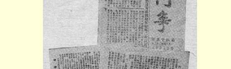
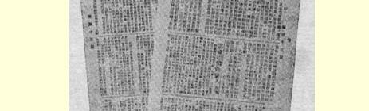
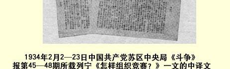

# 怎样组织竞赛？

> （１９１７年１２月２４—２７日〔１９１８年１月６—９日〕）

资产阶级的著作家过去和现在耗费了无数的笔墨，来赞扬资本家和资本主义制度的竞争、私人进取心及其他绝妙的品质和魅力。他们责备社会主义者不愿意了解这些品质的意义和不顾“人的本性”。其实，资本主义早已把那种能使竞争在稍微**广阔的**范围内培植进取心、毅力和大胆首创精神的独立的小商品生产排挤掉了，而代之以大的和最大的工厂生产、股份企业、辛迪加和其他垄断组织。在**这样的**资本主义制度下，竞争意味着空前残暴地压制**广大的**、占绝大多数的居民，即百分之九十九的劳动者的进取心、毅力和大胆首创精神，而且还意味着排斥竞赛，而代之以社会阶梯上层的金融诈骗、任人唯亲和阿谀逢迎。

社会主义不仅不窒息竞赛，反而第一次造成真正**广泛地**、真正 **大规模地**运用竞赛的可能，把真正大多数劳动者吸引到这样一个工作舞台上来，在这个舞台上，他们能够大显身手，施展自己的本领，发现有才能的人。有才能的人在人民中间是无穷无尽的，可是资本主义却把他们成千上万乃至成百万地摧残、压制和窒息了。

现在当社会主义政府执政时，我们的任务就是要组织竞赛。

资产阶级的走卒和食客们把社会主义描写成生活千篇一律的、死气沉沉的、单调无味的军营。富人的奴才，剥削者的仆从——

> １９３４年２月２—２３日中国共产党苏区中央局《斗争》报
>
> 第４５—４８期所载列宁《怎样组织竞赛？》一文的中译文资产阶级知识分子老爷们，总是拿社会主义来“吓唬” 人民，然而，正是在资本主义制度下，人民才注定了要过那种服苦役住军营的生活，从事永无休止、令人厌烦的劳动，过着半饥半饱、贫困不堪的日子。使劳动者摆脱这种苦役生活的第一步，就是没收地主土地，实行工人监督，把银行收归国有。下一步便是把工厂收归国有，强迫全体居民加入消费合作社（这种合作社同时又是产品销售合作社），以及由国家垄断粮食和其他必需品的贸易。

只有现在才广泛地、真正普遍地开辟了表现进取心、进行竞赛和发挥大胆首创精神的可能性。每个赶走了资本家或者至少是用真正的工人监督制服了资本家的工厂，每个赶跑了地主剥削者并且剥夺了他们土地的农村，现在而且只有现在才成了劳动者可以大显身手的场所，在这里劳动者可以稍微直一点腰，可以挺起胸来，可以感到自己是人了。他们千百年来都是为别人劳动，被迫为剥削者做工，现在第一次有可能为**自己工作**，而且可以利用技术和文化的一切最新成就来工作了。

用为自己劳动取代被迫劳动，是人类历史上最伟大的更替，当然不能不发生摩擦、困难和冲突，不能不对那些顽固的寄生虫及其走卒采用暴力。在这方面，任何一个工人都不抱什么幻想。工人和贫苦农民成年累月地替剥削者做苦工，受到了剥削者无数的欺侮和凌辱，过着极端贫困的生活，由于他们经受了这些磨炼，他们知道要**粉碎**剥削者的反抗是需要时间的。工人和农民丝毫没有染上多愁善感的知识分子老爷们、所有这些新生活派和其他废物的幻想，这些人力竭声嘶地“高喊”反对资本家，“指骂”资本家、 “痛斥”资本家，可是一到**要真正行动**，要把威胁变成事实，要在实践中真正**去掉**资本家的时候，他们就痛哭流涕，活象一只挨了打的小狗。

用全国广大范围内（在某种程度上也是在国际的、世界的范围内）有计划地组织起来的为自己的劳动取代被迫劳动，—— 这种伟大的更替除需要采取“**军事**” 措施镇压剥削者的反抗，还需要无产阶级和贫苦农民作出**组织方面的**即组织家的巨大努力。组织任务同采取军事措施无情地镇压昨天的奴隶主（资本家）及其奴才们（资产阶级知识分子老爷们）的任务，已经结成一个不可分割的整体。昨天的奴隶主和他们的知识分子奴仆们总是这样想， 这样说：我们一向是组织者和长官，一向是发号施令的，我们仍旧要这样，我们不会听“老百姓”的话，不会听工人和农民的话， 不会服从他们，我们要把知识变成保护富人特权和保护资本对人民的统治的工具。

资产者和资产阶级知识分子就是这样想，这样说，这样做的。 从**一己私利的**角度来看，他们的行为是可以理解的，因为农奴主 －地主所豢养的食客和寄生虫，神父、录事、果戈里笔下的那类官吏、那些痛恨别林斯基的“知识分子”，对农奴制也是“恋恋” 不舍的。可是剥削者及其知识分子奴仆的事业是毫无希望的事业。 工人和农民正在粉碎他们的反抗（可惜还不够坚决、果断和无情），**而且一定会粉碎**他们的反抗。

“他们”以为，社会主义革命赋予劳动者的那种伟大的、在世界历史上是真正豪迈的组织任务，“老百姓”即“普通”工人和贫苦农民是负担不了的。那些惯于替资本家和资本主义国家效劳的知识分子自我安慰说：“没有我们不行。” 他们厚颜无耻的盘算是不会实现的，因为有学问的人现在正在分化，正在转到人民方面， 转到劳动者方面来，并且帮助他们粉碎资本奴仆们的反抗。而有组织才能的人在农民和工人阶级中间是很多的，他们现在才刚刚开始认识自己，觉醒过来，投入生气勃勃的、创造性的、伟大的工作，独立地着手建设社会主义社会。

现在最主要的任务之一，也许就是最主要的任务，是尽量广泛地发扬工人以及一切被剥削劳动者在创造性的**组织**工作中所表现的这种独创精神。无论如何要打破这样一种**荒谬的**、怪诞的、卑劣的陈腐偏见，似乎只有所谓“上层阶级”，只有富人或者受过富有阶级教育的人，才能管理国家，才能领导社会主义社会的组织建设。

这是一种偏见。这种偏见受到了陈规陋习、守旧心理、奴才习气，尤其是资本家的卑鄙私利的支持。资本家所关心的是怎样借掠夺来管理，借管理来掠夺。不，工人们一分钟也不会忘记自己需要知识的力量。工人们在追求知识方面表现出非常大的热情， 而且正是在现在表现出来，这证明无产阶级在这方面没有而且也不可能有迷误。凡是识字的、有识别人的本领的、有实际经验的 **普通**工人和农民都能够胜任**组织家的**工作。资产阶级知识分子用傲慢蔑视态度谈论的“老百姓” 中，有**很多**这样的人。这样的有才能的人在工人阶级和农民中间是无穷无尽、源源不绝的。

工人和农民还有些“胆怯”，对于**自己**现在是**统治**阶级这一点还不习惯，他们还不够坚决。革命不可能**立刻**在一生困于饥饿贫穷而不得不在棍棒下工作的千百万人身上培养出这些品质。但是， １９１７年十月革命的力量，它的生命力，它的不可战胜性，正是在于它**激发**这些品质，破除一切旧的障碍，摧毁腐朽的桎梏，把劳动者引上**独立**创造新生活的道路。

计算和监督，这就是每个工兵农代表苏维埃、每个消费合作社、每个工会或供给委员会、每个工厂委员会或一般工人监督机关的**主要**经济任务。

用被迫劳动者的眼光来看待劳动量，看待生产资料，即尽量躲避加重的担子，只求**从资产阶级那里**捞一把，—— 这种旧习惯必须破除。先进的有觉悟的工人已经开始了这场斗争，坚决反击有些新进厂的人（这样的人在战争时期特别多），因为他们现在对待**人民的**工厂，对待已经变成人民财产的工厂，还象从前那样，一心想“多捞一把，然后溜之大吉”。一切有觉悟的、诚实的、有头脑的农民和劳动群众，在这场斗争中一定会站到先进工人这方面来。

既然无产阶级的政治统治已经建立，已经有了保障，那么，实行计算和监督，实行全面的、普遍的、包括一切的计算和监督，即对劳动数量和产品分配实行计算和监督，——** 只要**它们由作为最高国家政权机关的工兵农代表苏维埃来实行，或者依照**这个**政权机关的指示和委托来实行，—— 这就是社会主义改造的**实质**。

过渡到社会主义所必需的计算和监督，只能由群众来实行。只有工农**群众**怀着满腔的革命热情自愿地和诚挚地进行合作，共同 **对富人**、**骗子**、**懒汉**和**流氓**实行计算和监督，才能清除万恶的资本主义社会的这些残余，清除人类的这些渣滓，清除这些无可救药的、腐烂的、坏死的部分，清除这些由资本主义遗留给社会主义的传染病、瘟疫和溃疡。

工人和农民们，被剥削劳动者们！土地、银行、工厂已经变成全体人民的财产了！大家**亲自**来计算和监督产品的生产和分配吧，这是**唯一**走向社会主义胜利的道路，社会主义胜利的保障，战胜一切剥削和一切贫困的保障！因为俄国有足够的粮食、铁、木料、羊毛、棉花和亚麻，可以满足全体人民的需要，只是必须正确地分配劳动和产品，对这种分配建立切实可行的全民监督，不仅在政治上而且在***日常经济***生活中战胜那些人民的敌人—— 首先是富人和他们的食客，其次是骗子、懒汉和流氓。

对这些人民的敌人，社会主义的敌人，劳动者的敌人要毫不宽容。必须同富人和他们的食客即资产阶级知识分子作殊死的斗争，向骗子、懒汉、流氓开战。这前后两种人，都是同胞兄弟，都是资本主义的儿女，都是贵族和资产阶级社会的产儿。在这种社会中，一小撮人掠夺人民，侮辱人民。在这种社会中，贫困驱使成千上万的人走上流氓无赖、卖身投靠、尔虞我诈、丧失人格的道路。在这种社会中，必然使劳动者养成这样一种心理：为了逃避剥削，就是欺骗也行；为了躲避和摆脱令人厌恶的工作，就是少干一分钟也行；为了不挨饿，为了使自己和亲人吃饱肚子，就是不择手段，不惜任何代价哪怕捞到一块面包也行。

富人和骗子是一枚奖章的两面，这是资本主义豢养的两种主要**寄生虫**，这是社会主义的主要敌人，这些敌人应当由全体人民专门管制起来，只要他们稍一违背社会主义社会的规章和法律，就要无情地予以惩治。在这方面任何软弱、任何动摇、任何怜悯，都是对社会主义的极大犯罪。

要使社会主义社会不受这些寄生虫的危害，就必须对劳动数量，对产品的生产和分配组织全民的、千百万工人和农民自愿地积极地用满腔革命热情来支持的计算和监督。而要组织这种计算和监督，即每个诚实、精明、能干的工人和农民**完全能够做到**和完全能够胜任的计算和监督，就必须唤起工农自己的、也就是从他们中间产生的有组织才能的人，必须鼓励他们在组织工作方面实行**竞赛**，并在全国范围内把这种竞赛组织起来，必须使工人和农民清楚地懂得，应当向有学问的人请教是一回事，而应当由 “普通的”工农来监督那些“有学问的”人所常有的懈怠是另一回事。

这种懈怠、大意、马虎、草率、急躁，喜欢用讨论代替行动， 用空谈代替工作，干什么事都是开一个头但又半途而废，—— 这是“有学问的人” 的特点之一，这根本不是由他们天性低劣，更不是由他们存心不良造成的，而是由他们的全套生活习惯、他们的劳动环境、疲劳过度、脑力劳动和体力劳动的反常分离等等造成的。

由于我们的知识分子的这种可悲的、但在目前不可避免的特点，由于**工人**对知识分子的**组织**工作**缺乏**应有的监督，因而产生了一些错误、缺点和失策，这些东西在我国革命的错误、缺点和失策中占了不小的地位。

工人和农民还有些“胆怯”，他们应当克服这种毛病，他们***一定***会克服这种毛病。没有知识分子、专家这些有学问的人的建议和指导性的意见是不行的。任何一个有点头脑的工人和农民，对于这一点是知道得很清楚的，我们的知识分子不能抱怨工农对他们不够重视，对他们缺少同志式的尊敬。但是，建议和意见是一回事，组织***实际的***计算和监督又是一回事。知识分子往往能够提出极好的建议和意见，可是他们“笨手笨脚” 到了可笑、**荒谬**和丢脸的地步，没有本事去**实行**这些建议和意见，***切实*监督**怎样把言论变成行动。

由此可见，如果没有来自“老百姓” 即工人和劳动农民的实际组织工作者的帮助，***没有***这些人的***领导作用***，是绝对不行的。 “事在人为”，工人和农民应当把这个真理牢牢记住。他们应当懂得，现在一切都**在于实践**，现在已经到了这样一个历史关头：理论在变为实践，理论由实践赋予活力，由实践来修正，由实践来检验；马克思说的“一步实际运动比一打纲领更重要”[^1]这句话，显得尤其正确了，—— 在对富人和骗子切实进行惩治、限制，对他们充分实行计算和监督的每一步，都比一打冠冕堂皇的关于社会主义的议论更重要。要知道，“我的朋友，理论是灰色的，而生活之树是常青的”。

必须组织来自工农的实际组织工作者互相展开竞赛。必须反对知识分子所爱好的一切死套公式和由上面规定划一办法的企图。无论是死套公式或者由上面规定划一办法，都与民主的、社会主义的集中制毫无共同之点。在细节方面，在地方特征方面，在 **处理**问题的方法、实现监督的**方法**以及消灭和制裁寄生虫（富人和骗子，知识分子中间的懒汉和歇斯底里人物等等）的**手段**方面， **多样性**不但不会破坏在主要的、根本的、本质的问题上的统一，反而会保证这种统一。

巴黎公社作出了把来自下面的首创精神、独立性、放手的行动、雄伟的魄力和自愿实行的、与死套公式不相容的集中制互相结合起来的伟大榜样。我们的苏维埃走的也是这条道路。但是苏维埃还有些“胆怯”，还没有放开手脚，还没有“渗透”到建立社会主义秩序这一新的、伟大的、创造性的工作中去。必须使苏维埃更大胆、更主动地去从事工作。必须使每个“公社” —— 每个工厂，每个乡村，每个消费合作社，每个供给委员会—— 都能作为对劳动和产品分配实行计算和监督的实际组织工作者，互相展开**竞赛**。这种计算和监督的纲领是简单明了的，谁都懂得的：它就是要使每个人都有面包吃，都能穿上结实的鞋子和整洁的衣服， 都有温暖的住宅，都能勤勤恳恳地工作；不让一个骗子（其中也包括不愿做工的懒汉）逍遥自在，而是把他们关进监牢，或者给予最繁重的强迫劳动的处分；不让一个违反社会主义规章和法律的富人逃脱理所当然与骗子同样的命运。“不劳动者不得食”，—— 这就是社会主义**实践的**训条。这就是必须**实际**安排好的事情。我们的“公社”、我们的来自工农的组织工作者，尤其是知识分子出身的组织工作者，应当为这些**实际**成就而自豪（这里加上**尤其**二字，是因为知识分子**太**习惯于而且**过分**习惯于以自己的空泛的意见和决议而自豪）。

对富人、骗子和懒汉切实进行计算和监督的成千上万种方式和方法，应当由公社本身、由城乡基层组织在实践中来创造和检验。方式方法的多样性，可以保证具有活力，保证成功地达到共同的一致的目标，即**肃清**俄国土地上的一切害虫，**肃清**骗子这种跳蚤和富人这种臭虫，等等。有的地方会监禁十来个富人、一打骗子、半打逃避工作的工人（在彼得格勒，特别是党的各个印刷所，有许多排字工人逃避工作，这同样也是流氓行为）。有的地方会叫他们去打扫厕所。有的地方在他们监禁期满后发给黄色身分证，使全体人民在他们改过自新以前把他们当作**危害**分子加以监视。有的地方会从十个寄生虫中挑出一个来就地枪决。还有的地方会想到把不同办法配合起来运用，例如，把富人、资产阶级知识分子、骗子和流氓中的那些可以改正的人有条件地释放，使他迅速改过自新。方式愈多愈好，方式愈多，共同的经验就愈加丰富，社会主义的胜利就愈加可靠、愈加迅速，而实践也就愈容易创造出—— 因为只有实践才能创造出——** 最好的**斗争方式和手段。

看哪一个公社，大城市的哪一个街区，哪一个工厂，哪一个村子，**没有**挨饿的人，**没有**失业的人，**没有**有钱的懒汉**，没有**资产阶级奴才中的恶棍和自称为知识分子的怠工分子；看哪里为提高劳动生产率做的事情最多；看哪里为穷人建造新的好的住宅、安置穷人住进富人的住宅、按时供给穷人家小孩每人一瓶牛奶等方面做的事情最多；—— 正是在这些问题上，各个公社、村社、消费生产合作社和协作社以及各工兵农代表苏维埃应当展开**竞赛**。 正是应当通过这些工作让***有组织才能的人在实践中***脱颖而出，并且把他们提拔上来，参加全国的管理工作。这样的人在人民中间是很多的。不过他们都被埋没了。必须帮助他们发挥才能。他们， ***而且只有他们***才能在群众的支持下拯救俄国，拯救社会主义事业。

> 载于１９２９年１月２０日《真理报》译自《列宁全集》俄文第５版第１７号第３５卷第１９５—２０５页

[^1]: 见《马克思恩格斯全集》第１９卷第１３页。—— 编者注