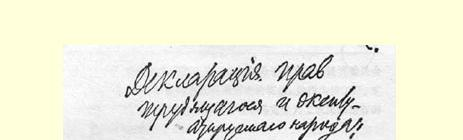
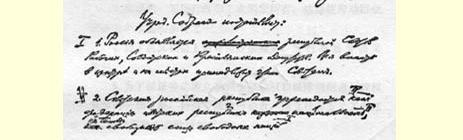
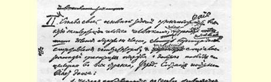
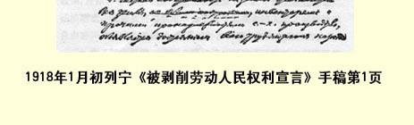

# 被剥削劳动人民权利宣言 １０７

> （不晚于１９１８年１月３日〔１６日〕）

立宪会议决定：

## 一

１．宣布俄国为工兵农代表苏维埃共和国。中央和地方全部政权属于苏维埃。

２．俄罗斯苏维埃共和国是建立在自由民族的自由联盟基础上的各苏维埃民族共和国联邦。

## 二

立宪会议的基本任务是消灭人对人的任何剥削，完全消除社会的阶级划分，无情地镇压剥削者的反抗，建立社会主义的社会组织，使社会主义在一切国家获得胜利，因此决定：

１．废除土地私有制。宣布全部土地连同一切建筑物、农具和其他农业生产用具均为全体劳动人民的财产。

> １９１８年１月初列宁《被剥削劳动人民权利宣言》手稿第１页
>
> （按原稿缩小）

２．批准苏维埃关于工人监督和关于最高国民经济委员会的法令，以保证劳动人民对剥削者的统治，并作为使工厂、矿山、铁路及其他生产资料和运输工具完全为工农国家所有的第一个步骤。

３．批准将一切银行收归工农国家所有，这是使劳动群众摆脱资本压迫的条件之一。

４．为了消灭社会上的寄生阶层起见，实行普遍劳动义务制。

５．为了保证劳动群众掌握全部政权和根除剥削者的政权复辟的一切可能，特命令武装劳动者，建立社会主义工农红军，彻底解除有产阶级的武装。

## 三

１．金融资本和帝国主义使全世界都淹没在这次空前的罪大恶极的战争的血泊之中，立宪会议表示坚定不移的决心，要把人类从它们的魔掌中拯救出来，因此完全赞同苏维埃政权所执行的下述政策：废除秘密条约，组织目前交战国双方军队中的工农进行最广泛的联欢，无论如何都要用革命手段争取在各国人民之间缔结以自由的民族自决为基础的、没有兼并没有赔款的民主的和约。

２．为了同一目的，立宪会议坚持必须同资产阶级文明世界的野蛮政策彻底决裂，这种政策把不多几个特殊民族的剥削者的幸福建筑在对亚洲和一切殖民地以及小国亿万劳动人民的奴役之上。

立宪会议欢迎人民委员会宣布芬兰完全独立、开始从波斯撤出军队、宣布亚美尼亚有自决自由的政策１０８。

３．立宪会议认为苏维埃关于废除（取消）沙皇、地主和资产阶级政府所订立的债约的法令，是对国际银行资本即金融资本的第一个打击，并深信苏维埃政权将坚定地沿着这条道路前进，直到国际工人奋起反对资本压迫的斗争获得完全胜利。

## 四

立宪会议是根据十月革命前各党所提的名单选出的，当时人民还不可能全体都起来反对剥削者，还不知道剥削者为保护他们的阶级特权而进行的反抗会多么激烈，还没有实际着手建立社会主义社会，因此，立宪会议认为，如果它同苏维埃政权对立起来， 即使从形式的观点来看，也是根本不正确的。

而就问题实质来说，立宪会议认为，现在正是人民同剥削者进行最后斗争的时刻，任何政权机关都不能有剥削者立足之地。政权应当完全地、绝对地属于劳动群众和他们的全权代表机关—— 工兵农代表苏维埃。

立宪会议拥护苏维埃政权和人民委员会的法令，并且认为它本身的全部任务就是规定对社会进行社会主义改造的根本原则。

同时，立宪会议力求建立俄国各民族劳动阶级的真正自由和自愿的、因而也是更加紧密和巩固的联盟，不过它的任务只限于规定俄罗斯苏维埃共和国联邦的根本原则，而让每个民族的工人和农民在自己的全权苏维埃代表大会上独立决定，他们是否愿意参加和在什么基础上参加联邦政府及其他联邦苏维埃机关。

> 载于１９１８年１月４日（１７日）译自《列宁全集》俄文第５版 《真理报》第２号和《中央执行第３５卷第２２１—２２３页委员会消息报》第２号