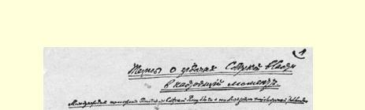
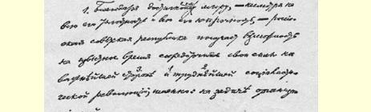
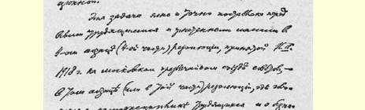
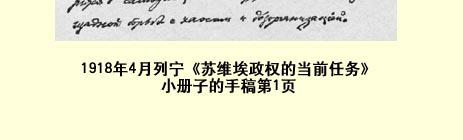

## 苏维埃政权的当前任务 ６５

> （１９１８年４月）

## 俄罗斯苏维埃共和国的国际环境和社会主义革命的基本任务

俄罗斯苏维埃共和国取得了和平（虽然是条件极其苛刻和极不稳固的和平），因而有可能在一段时间内把自己的力量集中到社会主义革命最重要和最困难的方面，即集中到组织任务上来。

在莫斯科举行的苏维埃非常代表大会１９１８年３月１５日通过的决议第４段（第４部分），在谈到劳动者的自觉纪律以及同混乱和组织涣散现象作无情的斗争的那一段（或那一部分），已经把这个任务向一切被压迫劳动群众明确地提出来了。[^1]

俄罗斯苏维埃共和国得到的和平不稳固，自然不是由于它现在想要恢复军事行动；除资产阶级反革命分子及其应声虫（孟什维克等等）外，没有一个头脑健全的政治家会想到这种事情。和平不稳固，是由于在东西两面同俄国接壤的、拥有强大军事力量的帝国主义国家里，主战派随时可能占上风，俄国的暂时虚弱使他们跃跃

> １９１８年４月列宁《苏维埃政权的当前任务》小册子的手稿第１页
>
> （按原稿缩小） 欲试，仇视社会主义和酷嗜抢劫的资本家们也在怂恿他们。

在这种情况下，帝国主义列强之间已经白热化的纠纷，对于我们说来，才是实际的而不是纸上的和平保证。这种纠纷一方面表现在西欧各国间的帝国主义大厮杀在重新进行，另一方面表现为日美争夺太平洋及其沿岸地区的霸权的帝国主义竞争极其剧烈。

很明显，防御力如此薄弱的我们苏维埃社会主义共和国，处于极不稳固、十分危急的国际环境中。我们必须竭尽全力利用客观条件的凑合给我们造成的喘息时机，医治战争带给俄国整个社会机体的极其严重的创伤，发展国家的经济。不这样做，就谈不到使国防力量真正有所增强。

同样很明显，我们对西欧由于种种原因而迟迟尚未爆发的社会主义革命能给予多少重大的援助，全看我们对面临的组织任务解决得如何。

顺利解决我们当前首要的组织任务的基本条件，就是要使人民的政治领导者即俄国共产党（布尔什维克）党员以及劳动群众中一切觉悟的分子，能够完全理解过去的历次资产阶级革命同现在的社会主义革命在这一方面的根本区别。

在资产阶级革命中，劳动群众的主要任务，是完成消灭封建制度、君主制度、中世纪制度这种消极的或者说破坏性的工作。组织新社会的积极的或者说建设性的工作，是由占人口少数的有产者即资产者来完成的。他们能够不顾工人和贫苦农民的反抗而比较容易地完成这种任务，原因不仅在于受资本剥削的群众由于自身的涣散和不成熟，当时的反抗极其微弱，而且还在于自发地向广度和深度发展的国内市场和国际市场是在无政府状态中建立起来的资本主义社会的基本组织力量。

相反，在任何社会主义革命中，因而也在我们于１９１７年１０月 ２５日所开始的俄国社会主义革命中，无产阶级和它所领导的贫苦农民的主要任务，却是进行积极的或者说创造性的工作，就是要把对千百万人生存所必需的产品进行有计划的生产和分配这一极其复杂和精密的新的组织系统建立起来。这种革命，只有在人口的大多数首先是劳动群众的大多数进行独立的历史创造活动的条件下，才能顺利实现。只有在无产阶级和贫苦农民能够表现充分的自觉性、思想性、坚定性和忘我精神的情况下，社会主义革命的胜利才有保障。我们建立了使被压迫劳动群众能够十分积极地参加独立建设新社会的新型的国家，即苏维埃类型的国家，这还只是解决了困难任务的一小部分。主要的困难是在经济方面：对产品的生产和分配实行最严格的普遍的计算和监督，提高劳动生产率，使生产 **在事实上社会化**。

现在成为俄国执政党的布尔什维克党的发展特别明显地表明，我们正在经历什么样的历史转折，这一转折构成目前政治局势的特点，要求苏维埃政权确定新的方针，就是说，以新的方式提出新的任务。

任何一个代表着未来的政党的第一个任务，都是说服大多数人民相信其纲领和策略的正确。无论在沙皇制度时代或在切尔诺夫之流、策列铁里之流同克伦斯基之流、基什金之流妥协的时期， 这个任务都曾占据首要地位。现在这个任务当然还远未完成（而且无论何时都不会彻底完成），但是大体上已经解决了，因为在莫斯科举行的最近一次苏维埃代表大会已经无可争辩地证明，俄国大多数工人农民明显地站在布尔什维克方面。

我们党的第二个任务，是夺取政权和镇压剥削者的反抗。这个任务也远没有彻底完成。因此对这个任务不能忽视，因为君主派和立宪民主党人以及他们的应声虫和走卒孟什维克和右派社会革命党人，仍然试图联合起来推翻苏维埃政权。可是，镇压剥削者反抗这个任务，在１９１７年１０月２５日到（大约）１９１８年２月或者说到鲍加耶夫斯基投降这个时期中，已经大体上解决了。

现在，构成目前时局特点的第三个迫切任务提上了日程，这就是组织对俄国的**管理**。当然，我们在１９１７年１０月２５日的第二天， 就已经提出并且着手解决这个任务，可是在过去这段时间里，剥削者还采取公开的内战形式进行反抗，管理的任务**不可能**成为**主要的中心的**任务。

现在它已经成为这样的任务了。我们布尔什维克党已经**说服了**俄国。我们已经**夺回了**俄国—— 为了穷人，为了劳动者，从富人手里，从剥削者手里夺回了俄国。现在我们应当**管理**俄国。目前时局的全部特点，全部困难，就是要了解从主要任务是说服人民和用武力镇压剥削者转到主要任务是**管理**这一**过渡的特征**。

一个社会主义政党能够做到大体上完成夺取政权和镇压剥削者的事业，能够做到**直接着手管理**任务，这在世界历史上是第一次。我们应该不愧为完成社会主义革命的这个最困难的（也是最能收效的）任务的人。应该**考虑到**，要有成效地进行管理，**除了**善于说服，除了善于在内战中取得胜利，还必须善于**实际地进行组织工作**。这是一项最困难的任务，因为这是要用新的方式去建立千百万人生活的最深刻的经济的基础。这也是一项最能收效的任务，因为只有解决（大体上和基本上解决）这项任务**以后**，才可以说，俄国不仅**成了**苏维埃共和国，而且**成了**社会主义共和国。

### 当前的总口号

条件极其苛刻和不稳固的和平，战争和资产阶级统治（其代表为克伦斯基和支持他的孟什维克以及右派社会革命党人）遗留给我们的极其严重的经济破坏、失业和饥荒，—— 这一切所造成的上述客观形势，必然使广大劳动群众十分疲惫，甚至精疲力竭。他们迫切要求（也不能不要求）一定的休息。现在提上日程的是恢复被战争和资产阶级统治所破坏的生产力，医治由战争、军事失败、投机活动和资产阶级妄图恢复被推翻的剥削者政权的行径所造成的创伤，发展国家的经济，稳固地维持基本秩序。苏维埃政权目前只有排除资产阶级、孟什维克和右派社会革命党人的反抗，实际解决这些维持社会生活的基本的和最基本的任务，才能保障俄国向社会主义过渡，—— 这看来好象是一种怪论，但事实上，在上述客观条件下，这却是毫无疑义的。现在，由于当前形势的具体特点，由于有了苏维埃政权及其关于土地社会化、工人监督等等法令，实际解决这些最基本的任务同克服走向社会主义的最初步骤的组织工作上的困难，已经成为同一个事物的两个方面。

精打细算，节俭办事，不偷懒，不盗窃，遵守最严格的劳动纪律 —— 正是这些从前被资产阶级用来掩饰他们这个剥削阶级的统治时受到革命无产者的正当讥笑的口号，现在，在推翻资产阶级以后，已变成当前迫切的主要的口号。一方面，劳动**群众**切实实现这些口号，是挽救被帝国主义战争和帝国主义强盗（以克伦斯基为首）弄得半死的国家的**唯一**条件；另一方面，**苏维埃**政权用**自己的** 方法，根据**自己的**法令来切实实现这些口号，又是取得社会主义最终胜利所必需的和**足够的**条件。那些鄙夷地拒绝把这些如此“陈腐的”和“庸俗的”口号提到首要地位的人，正是不善于了解这个道理。在推翻了沙皇制度仅仅一年、摆脱克伦斯基之流还不到半年的小农国家里，当然还有不少自发的无政府主义（每一次长期的和反动的战争带来的野蛮残暴行为更加强了这种无政府主义），还产生了不少悲观绝望和无端愤怒的情绪；如果再加上资产阶级的走狗 （孟什维克、右派社会革命党人等等）的挑拨政策，那么，非常明显， 要使群众的情绪完全转变，要使群众转到正规的、坚持不懈的、有纪律的劳动，优秀的和最觉悟的工人和农民需要作出多么长期而顽强的努力。只有贫苦群众（无产者和半无产者）实现了这种转变， 才能完全战胜资产阶级，尤其是最顽固的和人数众多的农民资产阶级。

### 同资产阶级斗争的新阶段

资产阶级在我国已被击败，可是还没有根除，没有消灭，甚至还没有彻底摧毁。因此，同资产阶级斗争的新的更高形式便提到日程上来了，要由继续剥夺资本家这个极简单的任务转到一个更复杂和更困难得多的任务，就是要造成使资产阶级既不能存在也不能再产生的条件。很明显，这个任务是重大无比的，这个任务不完成，那就还没有社会主义。

拿西欧革命的规模来比较，我们现在大约处于１７９３年和 １８７１年达到的水平。我们完全有理由引以自豪的是：我们达到了这种水平，并且在一个方面无疑还超过了一些，这就是用法令确认并在全国各地建立了最高的国家**类型**—— 苏维埃政权。但是我们绝不能满足于已经取得的成绩，因为我们仅仅是开始向社会主义过渡，而在**这**方面我们**还**没有做出有决定意义的事情。

有决定意义的事情是对产品的生产和分配组织最严格的全民计算和监督。但是在从资产阶级手里夺取过来的那些企业、经济部门和经济领域中，我们**还没有**做到计算和监督。而不做到这一点， 便谈不到实施社会主义的另一个同样非常重要的物质条件，即在全国范围内提高劳动生产率。

因此，不能以继续向资本进攻这个简单的公式来规定当前的任务。虽然资本显然还没有被我们彻底击败，虽然向劳动者的这个敌人继续进攻也是绝对必要的，但这样规定当前任务就会不确切， 不具体，其中没有估计到目前时局的**特点**：为了**今后**进攻的胜利， **目前**应当“暂停”进攻。

这一点可以打个比喻来说明。我们在反资本战争中的状况好比一支打胜仗的军队的状况，它已经从敌人手中夺取了比如一半或三分之二的地盘，它必须暂停进攻，以便聚集力量，增加武器弹药的储备，修理和加固交通线，建筑新的仓库，调集新的后备军等等。在这种情况下，打胜仗的军队暂停进攻，正是为了夺取敌人其余的地盘，即为了取得完全胜利所必需的。目前客观形势要求我们的正是要这样“暂停”向资本的进攻，谁不懂得这一点，那他就是完全不了解目前的政治局势。

当然，所谓“暂停”向资本的进攻只能是带引号的，只是个比喻。在通常的战争中，可以下一道暂停进攻的通令，可以实际停止前进。而在反资本的战争中，却不能停止前进，也谈不上我们不再继续剥夺资本。这里讲的是改变我们经济工作和政治工作的**重心**。 在此以前，居**首要地位的是直接剥夺剥夺者的措施**。**现在居首要地位**的是在资本家已被剥夺的那些企业和其余一切企业中组织计算和监督。

如果我们现在想用以前的速度继续剥夺资本，那我们一定会失败，因为我们组织无产阶级的计算和监督的工作显然**落后于直接**“剥夺剥夺者”的工作，而这是任何一个有头脑的人都看得很清楚的。如果我们现在竭尽全力进行组织计算和监督的工作，我们就能解决这个任务，就能弥补疏忽了的事情，就能赢得我们反资本的 **整个**“战役”。

但是，我们承认必须弥补疏忽了的事情，是否等于承认某些事情做错了呢？丝毫不是。我们再拿军事作比喻吧。如果单用轻骑兵就能够击溃并且击退敌人，那就应该这样做。但是，如果这样做只能取得一定限度的胜利，那就完全可以想见，要超出这个限度， 就有必要调来重炮兵。我们承认现在应该弥补以前没有调来重炮兵这件疏忽了的事情，这绝不是承认轻骑兵的胜利的进攻是一个错误。

资产阶级的走狗常常责骂我们对资本采取“赤卫队式的”进攻。这种责骂是荒谬的，只能出于富人的走狗之口。因为对资本采取“赤卫队式的”进攻，是**当时**的情况所绝对要求的：第一，**当时**资本是通过克伦斯基和克拉斯诺夫、萨文柯夫和郭茨、杜托夫和鲍加耶夫斯基等人进行军事反抗（格格奇柯利直到目前还在进行这样的反抗）。粉碎军事反抗非用军事手段不可，赤卫队正是完成了使被剥削劳动者摆脱剥削者压迫的极其崇高伟大的历史事业。

第二，当时我们不能把管理的方法摆在首要地位来代替镇压的方法，还因为管理的艺术并不是人们生来就有，而是从经验中得来的。当时我们还没有这种经验。而现在已经有了。第三，当时我们还不可能支配各种学术和技术领域的专家，因为他们或者是在鲍加耶夫斯基之流的队伍中作战，或者是还能用怠工不断进行顽强的消极反抗。现在我们已经粉碎了怠工。对资本采取“赤卫队式的”进攻收到了成效，获得了胜利，因为我们既战胜了资本的军事反抗，又战胜了资本的怠工反抗。

这是不是说对资本采取“赤卫队式的”进攻在**任何时候**和**任何** 形势之下都是适当的，是不是说我们没有其他办法同资本作斗争呢？这样想是幼稚无知。我们用轻骑兵获得了胜利，可是我们也有重炮兵。我们用镇压的方法获得了胜利，我们也能够用管理的方法获得胜利。形势改变了，对敌斗争的方法也要善于改变。我们一分钟也不放弃采用“赤卫队”镇压萨文柯夫之流和格格奇柯利之流先生们以及其他一切地主和资产阶级反革命分子。可是，我们并不会如此愚蠢，竟在需要用赤卫队进攻的时代已经基本结束（而且已经胜利地结束），无产阶级国家政权利用资产阶级专家来重耕土壤， 使它绝不能再生长任何资产阶级这种时代已经来到的时候，还把 “赤卫队式的”方法摆在首要地位。

这是发展过程中的一个特殊时代，或者确切些说，这是发展过程中的一个特殊阶段，要彻底战胜资本，就应该善于使我们的斗争形式适合这个阶段的特殊情况。

没有各种学术、技术和实际工作领域的专家的指导，向社会主义过渡是不可能的，因为社会主义要求广大群众自觉地在资本主义已经达到的基础上向高于资本主义的劳动生产率迈进。社会主义应该**按照自己的方式**，用自己的方法—— 具体些说，用**苏维埃的** 方法—— 来实现这种迈进。而专家大多数必然是资产阶级的，这是把他们培养成为专家的整个社会生活环境造成的。如果我们无产阶级在掌握政权后迅速地在全民范围内解决了计算、监督和组织的任务（当时由于战争和俄国的落后，这是无法实现的），那么，在粉碎了怠工以后，我们就能用普遍的计算和监督的方法使资产阶级专家也完全服从我们。由于整个计算和监督工作搞得相当“晚”， 我们虽然已经战胜了怠工，但还没有造成使资产阶级专家受我们支配的局面；大多数怠工者虽然“上班”了，但是国家要利用优秀的组织家和最大的专家只有两种方式：或是按照旧的方式，资产阶级的方式（即付给高额报酬），或是按照新的方式，无产阶级的方式 （即造成全民计算和自下而上的监督的局面，这样就必然而且自然地使这些专家服从，并把他们吸引过来）。

现在我们不得不采用旧的资产阶级的方式，同意对资产阶级最大的专家的“服务”付给高额报酬。熟悉情况的人都看到了这一点，但并不是所有的人都仔细考虑到无产阶级国家采用这种办法的意义。显然，这种办法是一种妥协，是对巴黎公社和任何无产阶级政权的原则的背离，这些原则要求把薪金降到中等工人工资的水平，要求在事实上而不是在口头上同名利思想作斗争。

不仅如此。显然，这种办法不只是在一定的部门和一定的程度上暂停向资本的进攻（因为资本不是一笔货币，而是一定的社会关系），而且还是我们社会主义苏维埃国家政权**后退了一步**，因为这个政权一开始就曾宣布并实行了把高额薪金降低到中等工人工资水平的政策６６。

自然，资产阶级的走狗，尤其是象孟什维克、新生活派和右派社会革命党人这帮下等奴仆，会因为我们承认后退了一步而耻笑我们。可是我们丝毫用不着去理睬这种耻笑。我们应该研究走向社会主义这一极端困难的新道路的特点，不要掩盖我们的错误和弱点，而要努力及时做完尚未完成的事情。用非常高的薪金吸引资产阶级专家是对公社原则的背离，如果对群众隐瞒这一点，那就是堕落到资产阶级政客的水平，那就是欺骗群众。公开说明我们怎样和为什么后退了一步，然后公开讨论，有什么办法可以弥补疏忽了的事情，—— 这就是教育群众，同他们一块从实际经验中学习建设社会主义。在历史上任何一次胜利的战役中，胜利者未必没有犯过个别的错误，遭受过局部的失败，在某一方面和某一地方暂时后退过。而我们所进行的反对资本主义的“战役”，比最困难的战役还要困难百万倍，如果因为部分和局部的后退就垂头丧气，那是愚蠢而可耻的。

我们从实际方面来看这个问题。假设俄罗斯苏维埃共和国需要１０００名各种学术、技术和实际工作领域的第一流的学者和专家来指导国民劳动，以便尽快地发展国家的经济。假设应当付给这些 “头等明星”—— 当然，其中大多数叫喊工人腐化叫得最凶的人，他们自己就是受资产阶级道德腐化最深的人—— 每年每人２５０００卢布。假设这个总数（２５００万卢布）增加一倍（假定对成绩特别优良而迅速地完成了最重要的组织技术任务的人给以奖金），或者甚至再加三倍（假定还要聘请几百个要价更高的外国专家）。试问，为了按照最新的科学技术改组国民劳动，苏维埃共和国每年花费５０００ 万或１亿卢布，能不能说是花费过多或担负不起呢？当然不能。绝大多数觉悟的工人农民会赞成花这笔钱，因为他们从实际生活中认识到：我们的落后使我们不能不损失数十亿卢布，而在组织、计算和监督方面，我们**还没有**达到能使资产阶级知识界的“明星”人人自愿来参加**我们的**工作的程度。

当然，问题还有另外一面。高额薪金的腐化作用既影响到苏维埃政权（尤其在急剧变革的情况下，不会没有相当数量的冒险家和骗子混入这个政权，他们和各种委员当中那些无能的或者无耻的人，也是乐意充当“明星”—— 盗窃公产的“明星”的），也影响到工人群众，这是无可争辩的。可是，每一个有头脑的正直的工人和贫苦农民都会同意我们的做法，都会认识到：要一下子摆脱资本主义的遗毒是办不到的；要使苏维埃共和国免除５０００万或１亿卢布的 “贡赋”（因我们在组织**全民**计算和**自下而上**的监督工作上的落后而付出的贡赋），就只有组织起来，整顿自己队伍的纪律，清除自己行列中一切“保存资本主义遗产”、“拘守资本主义传统”的人，即清除一切懒汉、寄生虫、公产盗窃者（现在一切土地、一切工厂、一切铁路都是苏维埃共和国的“公产”）。如果觉悟的先进的工人和贫苦农民在苏维埃机关帮助之下，能够在一年内组织起来，有了纪律， 振奋起精神，建立起强有力的劳动纪律，那么，一年以后我们便能免除这项“贡赋”，甚至在这之前，随着我们工人农民的劳动纪律和组织性的提高，就能缩减这种“贡赋”。我们工人农民通过利用资产阶级专家，自己愈快地学会最好的劳动纪律和高级劳动技术，我们就能愈快地免除向这些专家交纳的一切“贡赋”。

在无产阶级领导下组织对产品的生产和分配的全民的计算和监督方面，我们的工作大大地落后于我们直接剥夺剥夺者的工作。 这种状况对于了解目前时局的特点和由此产生的苏维埃政权的各种任务是一个关键。反对资产阶级的斗争的重心正在转移到组织这种计算和监督的工作上来。只有从这一点出发，才能在银行国有化、垄断对外贸易、国家监督货币流通、征收在无产阶级看来是适当的财产税和所得税以及在实行劳动义务制方面，正确规定经济政策和财政政策的当前任务。

在这些方面（而这都是极其重要的方面）的社会主义改造工作上，我们还极为落后。其所以落后，正是因为整个计算和监督没有充分地组织起来。自然，这是最困难的任务中的一项任务，在战争所造成的经济破坏的情形下，这项任务只有经过长时期才能解决， 可是，不能忘记，资产阶级，尤其是人数众多的农民小资产阶级，恰恰是在这里同我们进行最严重的较量，他们破坏正在建立的监督， 例如破坏粮食垄断，夺取阵地进行投机活动和投机买卖。我们已经用法令规定的事情还远没有充分实现，而目前的主要任务，就是要集中全力，认真地切实**实现**那些已经成为法令（可是还没有成为事实）的改造原则。

要继续实行银行国有化，坚决地把银行变为社会主义制度下的公共簿记的枢纽机关，首先而且最重要的是做出下列的实际成果：增加人民银行分行的数量，吸收存款，简化储户存款取款的手续，消灭“排队”现象，逮捕和**枪毙**受贿者和骗子等等。先把最简单的事情切实做好，把目前的事情安排好，然后再准备做比较复杂的事情。

巩固并且整顿那些已经实行了国家垄断的事业（如粮食垄断、 皮革垄断等等），借此准备实行对外贸易的国家垄断；没有这种垄断，我们就不能用交纳“贡赋”的办法“摆脱”外国资本６７。而社会主义建设是否可能，就全看我们能否在一定的过渡时期内，用向外国资本交纳一些贡赋的办法保护自己国内经济的独立。

一般的征税工作，特别是征收财产税和所得税的工作，我们也非常落后。向资产阶级征收特别税（这是一项在原则上完全可行并且得到无产阶级赞同的措施）表明，我们在这一方面仍然更接近于夺取的方法（为了穷人，从富人手里把俄国夺取回来的方法），而不是管理的方法。可是，我们要想更加强大，要想更稳固地站住脚，就必须转而采用这后一种方法，就必须用常规的、照章征收的财产税和所得税来代替向资产阶级征收特别税的办法。这能给无产阶级国家**更多的**好处，但也要求我们有更高的组织程度，有更完善的计算和监督６８。

我们实行劳动义务制过迟再一次表明，当前迫切需要着手的正是组织准备工作，这项工作一方面是要彻底巩固已得的成果，另一方面也是为准备一次“包围”资本并迫使它“投降”的战役所必需的。我们应该立刻开始实行劳动义务制，但在实行时应当十分慎重，逐步进行，用实际经验检验每一步骤，而且，第一步当然是**对富人**实行劳动义务制。对每个资产者（农村资产者也在内）建立劳动消费收支手册，将是进到完全“包围”敌人和建立对产品的生产和分配的真正全民计算和监督的一个重大步骤。

### 为全民计算和监督而斗争的意义

千百年来，国家都是压迫人民和掠夺人民的机关，它留给我们的遗产是群众对国家的一切极端仇视和不信任。克服这一点，是个非常困难的任务，只有苏维埃政权才能胜任，然而就是苏维埃政权也需要经过很长的时间和坚韧不拔的努力。在计算和监督的问题上，即在推翻资产阶级以后社会主义革命立即面临的这个根本问题上，这个“遗产”的影响表现得特别尖锐。推翻地主和资产阶级之后第一次感受到自由的群众，必然要经过一段时间才能认识（不是根据书本，而是根据亲身的**苏维埃的**经验）并且**感受到**：对产品的生产和分配不实行全面的国家计算和监督，劳动者的政权、劳动者的自由***就***不能维持，重新受资本主义的压迫***就不可避免***。

资产阶级尤其是小资产阶级的一切习惯和传统，也是反对**国家**监督而主张“神圣的私有财产”和“神圣的”私有企业不可侵犯。 现在我们看得特别明显：马克思主义关于无政府主义和无政府工团主义是**资产阶级**思潮的论点是多么正确，这些思潮同社会主义、 无产阶级专政和共产主义的矛盾是多么不可调和。努力把由**苏维埃**即国家实行监督和计算的思想灌输到群众中去，力求实现这种思想，力求破除把获得衣食看作“私”事，把买卖看作“只是与我有关”的这种旧时恶习，—— 这是一场具有全世界历史意义的极其伟大的斗争，是社会主义自觉性反对资产阶级无政府主义自发性的斗争。

我们已经把工人监督制定为法律，可是它刚刚开始深入无产阶级广大群众的生活，甚至刚刚开始深入他们的意识。在产品的生产和分配方面没有表报，没有监督，就是扼杀社会主义的幼芽，就是盗窃公产（因为现在一切财产都属于公家，而公家也就是苏维埃政权，即大多数劳动群众的政权）；对计算和监督漫不经心就是直接帮助德国的和俄国的科尔尼洛夫之流，因为**只有**在我们解决不了计算和监督的任务的情况下，这些人才能推翻劳动者的政权，他们正在全体农民资产阶级的帮助下，在立宪民主党人、孟什维克、 右派社会革命党人的帮助下“窥伺着”我们，待机而动，—— 以上这些情况，我们在鼓动工作中说得不够，先进的工人和农民也想得不够，说得不够。可是只要工人监督还没有成为事实，只要先进工人还没有对破坏这种监督或对监督掉以轻心的人组织并开展胜利的和无情的斗争，就不能从走向社会主义的第一步（从工人监督）进到第二步，即转到工人调节生产。

社会主义国家只能在以下情况下产生：它已经成为一个生产消费公社网，这些公社诚实地计算自己的生产和消费，节省劳动， 不断提高劳动生产率，因而能够把工作日缩短到每天７小时或６ 小时以至更少。这就非搞好对**粮食**和**粮食生产**（然后，再对一切其他必需品）的最严格的、无所不包的全民计算和监督不可。资本主义留给我们一种便于过渡到对产品分配实行广泛的计算和监督的群众组织—— 消费合作社。在俄国，这种组织不象在先进国家里那样发达，可是还是拥有１０００万以上的社员。前几天颁布的关于消费合作社的法令６９，是一件非常有意义的事情，它清楚地表明了苏维埃社会主义共和国目前形势和任务的特点。

这个法令是同资产阶级合作社以及仍然持资产阶级观点的工人合作社达成的一种协议。说它是协议或妥协，是因为第一，上述这些组织的代表不仅参加了法令的讨论，而且实际上还取得了表决权，法令中有一部分条文因受到这些组织的坚决反对而删掉了。 第二，这种妥协实质上就是苏维埃政权放弃了免费入社的原则（这是唯一的彻底无产阶级的原则），而且还放弃了一地全体居民加入一个合作社的原则。放弃这个同消灭阶级的任务相符合的唯一的社会主义原则，就给了“工人的阶级合作社”（这些合作社在这种场合叫“阶级合作社”，只是因为它们服从资产阶级的阶级利益）继续存在的权利。最后，苏维埃政权所提出的把资产阶级从合作社管理委员会完全排除出去的条文也大大放宽了，只禁止私人资本主义性质的工商企业的老板进入合作社管理委员会。

如果无产阶级通过苏维埃政权已经搞好了全国范围内的计算和监督，或者至少是搞好了这种监督的基础，那就不会有作这种妥协的必要。那时我们就能通过各地苏维埃的粮食部门，通过各地苏维埃下设的供给机关，使居民都参加统一的受无产阶级领导的合作社，而用不着资产阶级合作社的协助，用不着对纯粹资产阶级的原则让步，这种原则使得工人合作社仍然与资产阶级合作社**同时并存**，**而不是**使这个资产阶级合作社完全服从自己，把两种合作社合并起来，**自己**掌握***全部***管理权，**自己**监视富人的消费。

苏维埃政权同资产阶级合作社达成这种协议时，具体确定了自己在目前发展阶段上的策略任务和特殊的工作方法：领导资产阶级分子，利用他们，对他们作某些局部的让步，这样我们就能创造向前进展的条件，这种进展比我们最初预计的要缓慢些，但是会更稳固，能更可靠地保证根据地和交通线，更好地巩固已经夺得的阵地。苏维埃现在能够**（*而且应该*）**用一种非常明显、简单、实际的尺度测量自己在社会主义建设事业上的成绩，这就是看合作社的发展有多少村社（公社或村庄、街区等等）以及在何种程度上接近于包括全体居民。

### 提高劳动生产率

在任何社会主义革命中，当无产阶级夺取政权的任务解决以后，随着剥夺剥夺者及镇压他们反抗的任务大体上和基本上解决， 必然要把创造高于资本主义的社会结构的根本任务提到首要地位，这个根本任务就是；提高劳动生产率，因此（并且为此）就要有更高形式的劳动组织。我们苏维埃政权正处于这样一种形势：它已经战胜了剥削者—— 从克伦斯基到科尔尼洛夫，因而有可能立即开始解决这项任务，直接着手执行这项任务。这里也立刻可以看出，夺取国家中央政权可以只花几天工夫，在这个大国的各个角落镇压剥削者的军事反抗（和怠工反抗）可以只用几个星期，而要切实地解决提高劳动生产率的任务，至少（尤其是在极其残酷和带来极大破坏的战争以后）需要几年的工夫。这个工作的长期性完全是由客观情况决定的。

提高劳动生产率，首先需要保证大工业的物质基础，即发展燃料、铁、机器制造业、化学工业的生产。俄罗斯苏维埃共和国所处的条件非常优越，甚至在布列斯特和约以后也还拥有丰富的资源，如矿石（乌拉尔一带）、燃料（西西伯利亚的煤、高加索和俄国东南部的石油以及中部地区的泥炭）、极丰富的森林、水力、化学工业原料 （卡拉布加兹湾）等等。用最新技术来开采这些天然富源，就能造成生产力空前发展的基础。

提高劳动生产率的另一种条件就是：第一，提高居民群众的文化教育水平。现在这一工作正在突飞猛进，那些被资产阶级陈腐观念所蒙蔽的人看不到这一点，他们不能了解，由于存在苏维埃组织，现在人民“下层”中的求知热情和首创精神是多么高涨。第二， 提高劳动者的纪律、工作技能、效率、劳动强度，改善劳动组织，这也是发展经济的条件。

在这一方面，我们的情况特别不好，要是相信那些被资产阶级吓倒或为私利而替资产阶级效劳的人的说法，甚至是没有希望的。 这些人不懂得，从来没有而且也不会有一种革命是不被旧事物拥护者责骂为崩溃和无政府状态等等的。自然，刚刚摆脱空前残酷压迫的群众，他们的情绪是沸腾激昂的；要群众培植出劳动纪律的新基础是一个很长的过程，在没有完全战胜地主和资产阶级以前，这种工作甚至还不可能开始。

我们绝不受资产者和资产阶级知识分子（他们对保住自己旧有的特权已经绝望）所散布的、往往是制造出来的那种悲观失望情绪的影响，可是，无论如何我们都不应该掩盖明显的坏事。恰恰相反，我们要揭发它，加强用苏维埃的方法同它斗争，因为如果无产阶级自觉的纪律性不能战胜自发的小资产阶级无政府状态—— 克伦斯基分子和科尔尼洛夫分子可能复辟的真正保证，社会主义的胜利便不能设想。

俄国无产阶级最觉悟的先锋队，已经给自己提出了加强劳动纪律的任务。例如五金工会中央委员会和工会中央理事会，已经开始制定相应的办法和法令草案７０。这项工作应该加以支持和全力推进。目前应当提上日程的是实际采用和试行计件工资７１，采用泰罗制中许多科学的先进的方法，以及使工资同产品的总额或铁路水路运输的经营总额等等相适应。

同先进民族比较起来，俄国人是比较差的工作者。在沙皇制度统治下和农奴制残余存在的时候，情况不可能不是这样。学会工作，这是苏维埃政权应该充分地向人民提出的一项任务。资本主义在这方面的最新成就泰罗制，同资本主义其他一切进步的东西一样，既是资产阶级剥削的最巧妙的残酷手段，又包含一系列的最丰富的科学成就，它分析劳动中的机械动作，省去多余的笨拙的动作，制定最适当的工作方法，实行最完善的计算和监督方法等等。 苏维埃共和国无论如何都要采用这方面一切有价值的科学技术成果。社会主义能否实现，就取决于我们把苏维埃政权和苏维埃管理组织同资本主义最新的进步的东西结合得好坏。应该在俄国组织对泰罗制的研究和传授，有系统地试行这种制度并使之适用。在着手提高劳动生产率的同时，还要考虑到从资本主义到社会主义的过渡时期的特点。这些特点一方面要求为按社会主义方式组织竞赛奠定基础，另一方面要求采取强制手段，使无产阶级专政这个口号不致为无产阶级政权在实践中的软弱无力所玷污。

### 组织竞赛

说社会主义者否认竞赛的意义，这是资产阶级谈到社会主义时喜欢散布的一种谬论。实际上只有社会主义，通过消灭阶级因而也消灭对群众的奴役，第一次开辟了真正大规模竞赛的途径。正是苏维埃组织从资产阶级共和国形式上的民主转到劳动群众实际参加**管理**，才第一次广泛地组织竞赛。在政治方面实行竞赛比在经济方面容易得多，可是为了社会主义的胜利，重要的正是经济方面的竞赛。

就拿公开报道这样一种组织竞赛的方法来讲吧。资产阶级共和国只是在形式上保证这点，实际上却使报刊受资本的支配，拿一些耸人听闻的政治上的琐事供“小百姓”消遣，用保护“神圣财产” 的“商业秘密”掩盖作坊中、交易中、以及供应等等活动中的真实情况。苏维埃政权取消了商业秘密７２，走上新的道路，可是在为经济竞赛而利用公开报道方面，我们几乎还没有做什么事。必须系统地进行工作，除了无情地压制那些满篇谎言和无耻诽谤的资产阶级报刊，还要努力创办这样一种报刊：它不是拿一些政治上的耸人听闻的琐事供群众消遣和愚弄群众，而是把日常的经济问题提交群众评判，帮助他们认真研究这些问题。每个工厂、每个乡村都是一个生产消费公社，都有权并且应该按照自己的方式实行共同的苏维埃法规（所谓“按照自己的方式”，并不是说违反法规，而是说用各种不同的形式实行这些法规），按照自己的方式解决产品的生产和分配的计算问题。在资本主义制度下，这是个别资本家、地主和富农的“私事”。在苏维埃政权下，这不是私事，而是国家大事。

我们差不多还没有着手进行这种艰巨的然而是能收效的工作 —— 组织各公社间的竞赛，在生产粮食衣服等等的过程中实行表报制度和公开报道的方法，把枯燥的、死板的官僚主义的表报变成生动的实例（既有使人厌弃的例子，也有令人向往的榜样）。在资本主义生产方式下，个别榜样的意义，比如说，某个生产合作社的榜样的意义，必然是极其有限的；只有小资产阶级幻想家，才会梦想用慈善机关示范的影响来“纠正”资本主义。在政权转到无产阶级手里以后，在剥夺了剥夺者以后，情况就根本改变了，而且，如一些最著名的社会主义者多次指出过的那样，榜样的力量第一次有可能表现自己的广大影响。模范公社应该成为而且一定会成为落后公社的辅导者、教师和促进者。报刊应该成为社会主义建设的工具，详细介绍模范公社的成绩，研究它们取得成绩的原因和它们经营的方法；另一方面，把那些顽固地保持“资本主义传统”，即无政府状态、好逸恶劳、无秩序、投机活动的公社登上“黑榜”。在资本主义社会，统计纯粹是“官府人员”或本行专家的事情；我们则应该把它带到群众中去，使它普及，让劳动群众自己能逐渐懂得和看到应该如何工作，工作多少，怎样休息，休息多久，使各个公社经营的**业务成绩的比较**成为大家共同关心和研究的事情，使优秀的公社立即得到奖赏（如在一定时期内缩短工作日，提高工资，提供许多文化或艺术方面的福利和奖品等等）。

一个新的阶级作为社会的领袖和指导者走上历史舞台时，从来没有不经过极大的“颠簸”、震撼、斗争和风暴时期的，这是一方面；而另一方面，在选择适合新的客观环境的新方法上，也从来没有不经过无把握的步骤、试验、动摇和犹豫时期的。趋于灭亡的封建贵族在报复战胜和排挤它的资产阶级时，不仅施展了各种阴谋手段，进行种种图谋暴动和复辟的活动，并且还不断讥笑那些没有王公贵族那种长期执政的素养而胆敢执掌国家“神圣大权”的“暴发户”、“无耻之徒”的低能、笨拙和错误，—— 现在，科尔尼洛夫之流和克伦斯基之流，郭茨之流和马尔托夫之流，所有这帮资产阶级投机取巧的或资产阶级怀疑论的英雄，对于“胆敢”夺取政权的俄国工人阶级，也正是采用这种报复手段。

不用说，新的社会阶级，而且是以前一直受压迫、被贫困和愚昧无知压得喘不过气来的阶级，要适应新的地位，认清环境，搞好自己的工作，选拔出**自己的**组织家，这不是几个星期的事情，而是长年累月的事情。显然，领导革命无产阶级的政党过去不可能取得从事大规模的、包括千百万公民的组织事业的经验和技能；要把旧的、差不多完全从事鼓动工作的技能改造过来，是一件很长期的事情。可是这绝不是不可能的事情，而且只要我们明确意识到必须转变，有实现这种转变的坚定决心，有达到这个伟大而困难的目标的毅力，我们就一定能够实现这个转变。在“老百姓”即工人和不剥削别人劳动的农民中，有大量有组织家才能的人；成千上万这样的人被资本摧残、毁灭和抛弃，而我们呢，也还不善于去发现、鼓励、扶持、提拔他们。可是，如果我们能以全部的革命热忱—— 没有这种革命热忱，便不会有胜利的革命—— 着手学习这项工作，我们就一定能够学会。

历史上任何一次深刻而强大的人民运动都不免会有肮脏的泡沫泛起，不免有些冒险家和骗子、吹牛大王和大喊大叫的人混杂在没有经验的革新者中间，不免有瞎忙乱干、杂乱无章、空忙一阵的现象，不免有个别“领袖”企图百废俱兴而一事无成的现象。让资产阶级社会的哈巴狗７３—— 从别洛鲁索夫到马尔托夫，为采伐古老森林时多砍下一块碎木片而狂吠吧！既然是些哈巴狗，也就只能向无产阶级大象狂吠。让他们去狂吠吧！我们走自己的路，力求尽量慎重而耐心地去考验和识别真正的组织家，即具有清醒头脑和实际才干的人，他们既忠实于社会主义，又善于不声不响地（而且能排除各种纷扰和喧嚷）使很多人在苏维埃组织范围内坚定地、同心协力地工作。**只有**这样的人，经过多次考验，让他们从担负最简单的任务进而担负最困难的任务，然后才应提拔到领导国民劳动和领导管理工作的负责岗位上来。我们还没有学会这一点。但是我们一定能学会。

### “协调的组织”和专政

最近的（在莫斯科召开的）苏维埃代表大会的决议，提出建立 “协调的组织”和加强纪律作为目前的首要任务[^2]。现在大家都乐意“投票赞成”和“签署”这类决议，但是关于实现这些决议需要强制，而且正是专政形式的强制这一点，人们通常却不去仔细考虑。 可是，认为不要强制，不要专政，便可以从资本主义向社会主义过渡，那就是极端的愚蠢和最荒唐的空想主义。马克思的理论很早就十分明确地反对过这种小资产阶级民主主义的和无政府主义的胡说。１９１７—１９１８年的俄国，也在这方面非常明显、具体、有力地证实了马克思的理论，只有绝顶愚钝或硬不承认真理的人，才会在这方面仍然执迷不悟。或者是科尔尼洛夫专政（如果把科尔尼洛夫看作俄国式资产阶级的卡芬雅克的话），或者是无产阶级专政，—— 对于这个经过了几次非常急剧的转变而非常迅速地发展的国家， 在灾难性的战争造成惨重经济破坏的情况下，**根本不可能有**其他出路。一切中间的解决办法，如果不是资产阶级对人民的欺骗（资产阶级不能讲真话，不能说他们需要科尔尼洛夫），便是小资产阶级民主派切尔诺夫之流、策列铁里之流、马尔托夫之流的愚蠢念头 （他们一味宣扬所谓民主派的统一、民主派专政、民主联合战线、以及诸如此类的谬论）。如果１９１７—１９１８年俄国革命的进程都没有使一个人懂得不可能有中间的解决办法，那么对这样的人也就不必抱什么希望了。

另一方面，不难了解，凡是从资本主义向社会主义过渡，由于两个主要原因，或者说在两个主要方面，必须有专政。第一，不无情地镇压剥削者的反抗，便不能战胜和铲除资本主义，这些剥削者的财富，他们在组织能力上和知识上的优势是不可能一下子被剥夺掉的，所以在一个相当长的期间，他们必然试图推翻他们所仇视的贫民政权。第二，任何大革命，尤其是社会主义革命，即令不发生外部战争，也决不会不经过内部战争即内战，而内战造成的经济破坏会比外部战争造成的更大，内战中会发生千百万起动摇和倒戈事件，会造成极不明确、极不稳定、极为混乱的状态。旧社会的一切有害分子—— 其数量当然非常之多，而且大半都是同小资产阶级有联系的，因为一切战争和一切危机首先使小资产阶级破产和毁灭 —— 在这种深刻变革的时候，自然不能不“大显身手”。而这些有害分子“大显身手”就**只能**使犯罪行为、流氓行为、收买、投机活动及各种坏事增多。要消除这种现象，需要时间，**需要铁的手腕**。

在历史上任何一次大革命中，人民没有不本能地感觉到这一点，没有不通过把盗贼就地枪决来表现其除恶灭害的决心的。从前历次革命的不幸，就在于使革命保持紧张状态并使它有力量去无情镇压有害分子的那种群众革命热忱，未能长久保持下去。群众革命热忱未能持久的社会原因即阶级原因，就是无产阶级还不强大， 而**唯有**它才能（如果它有足够的数量、觉悟和纪律）把**大多数**被剥削劳动者（如果简单通俗些说，就是大多数贫民）吸引过来，并且长期掌握政权来彻底镇压一切剥削者和一切有害分子。

马克思正是总结了历次革命的这个历史经验，这个有全世界历史意义的—— 经济的和政治的—— 教训，提出了一个简短、尖锐、准确、鲜明的公式：无产阶级专政。俄国革命已正确地开始实现这个有全世界历史意义的任务，苏维埃组织在俄国一切民族地区的胜利进军**证明了**这一点。因为苏维埃政权正是无产阶级专政即先进阶级专政的组织形式。这个先进阶级发动千百万被剥削劳动者来实行新的民主，独立参加国家的管理，他们正根据亲身体验认识到，有纪律有觉悟的无产阶级先锋队是自己最可靠的领袖。

但是，专政是一个大字眼，大字眼是不能随便乱说的。专政就是铁的政权，是有革命勇气的和果敢的政权，是无论对剥削者或流氓都实行无情镇压的政权。而我们的政权却软弱得很，往往不大象铁，却很象浆糊。我们一分钟也不应忘记，资产阶级的和小资产阶级的自发势力从两方面来反对苏维埃政权：一方面是从外部进行活动，采取萨文柯夫之流、郭茨之流、格格奇柯利之流、科尔尼洛夫之流的办法，搞阴谋和暴动，以及通过他们污浊的“思想上的”反映，在立宪民主党人、右派社会革命党人和孟什维克的报刊上不断造谣诬蔑；另一方面，这种自发势力还从内部进行活动，利用一切有害分子、一切弱点来进行收买，来助长无纪律、自由散漫和混乱现象。我们愈接近于用武力把资产阶级彻底镇压下去，小资产阶级无政府状态的自发势力对于我们也就愈加危险。要同这种自发势力作斗争，决不能只靠宣传和鼓动，只靠组织竞赛，只靠选拔组织家，—— 进行这种斗争还必须依靠强制。

随着政权的基本任务由武力镇压转向管理工作，镇压和强制的典型表现也会由就地枪决转向法庭审判。在这一方面，革命群众在１９１７年１０月２５日以后，也走上了正确的道路，证明了革命的生命力，在解散资产阶级官僚司法机关的任何法令颁布以前就已经开始组织自己的即工农的法院。可是，我们革命的人民的法院还非常非常软弱。还可以感觉到，人民把法院看作一种同自己对立的衙门，这种由于地主资产阶级压迫而留传下来的观点，还没有彻底打破。人民还没有充分意识到，法院正是吸引全体贫民参加国家管理的机关（因为司法工作是国家管理的职能之一），法院是无产阶级和贫苦农民的**权力机关**，法院是**纪律教育**的工具。人民还没有充分意识到这样一个简单而明显的事实：俄国的主要苦难既然是饥荒和失业，那么要战胜这种苦难，就决不能凭一时的热情，而只能靠全面的、无所不包的、全民的组织和纪律来增产人民所需要的粮食和工业所需要的粮食（燃料），把它们及时运到并且正确地进行分配。因此，在任何工厂、任何经济单位、任何事情上，**凡是**破坏劳动纪律的人，就是造成饥荒和失业痛苦的罪人；应该善于查出这种 **罪人**，交付审判，严厉惩办。我们现在要最坚决反对的这种小资产阶级自发势力的影响，就表现在对饥荒和失业现象同组织和纪律方面的普遍自由散漫有着国民经济上的和政治上的联系这一点认识不足，就表现在还牢固地保持着这样一种**小私有者的**观点：只要我能够多捞一把，哪管它寸草不生。

在铁路这个可以说是最明显地体现着大资本主义造成的机构的经济联系的部门，小资产阶级自由散漫的自发势力反对无产阶级组织性的这种斗争表现得特别突出。“蹲办公室的”人员中间产生出大量的怠工者和受贿者；优秀的无产阶级分子为纪律而斗争； 而在前后两种人之间，自然有很多动摇的、“软弱的”人，他们无力抗拒投机活动、贿赂和私利的“诱惑”，不惜破坏整个机构来换取私利，而战胜饥荒和失业是要靠这些机构正确地进行工作的。

在这个基础上围绕最近颁布的关于铁路管理的法令，即赋予领导者个人以独裁的权力（或“无限的”权力）的法令展开的斗争 ７４，是很说明问题的。小资产阶级自由散漫的自觉的（而大部分大概是不自觉的）代表，想把赋予个人以“无限的”（即独裁的）权力看作是背离集体管理制原则，背离民主制和背离苏维埃政权的原则。 某些左派社会革命党人在一些地方利用一些人的劣根性和小私有者“捞一把”的欲望进行了简直是流氓式的煽动，反对关于独裁权的法令。问题变得确实意义重大：第一是原则问题，即委派拥有独裁者无限权力的个人的这种做法同苏维埃政权的根本原则究竟是否相容；第二，这件事情，也可说是这个先例，同政权在目前具体形势下的特殊任务有什么关系。对于这两个问题，我们都应该非常仔细地加以研究。

无可争辩的历史经验说明：在革命运动史上，个人独裁成为革命阶级独裁的表现者、体现者和贯彻者，是屡见不鲜的。个人独裁同资产阶级民主制，无疑是彼此相容的。可是在这一点上，咒骂苏维埃政权的资产阶级分子以及他们的小资产阶级应声虫总是耍弄手腕，一方面，他们说苏维埃政权不过是一种荒谬的、无政府主义的、野蛮的东西，极力避开我们用来证明苏维埃是民主制的高级形式，甚至是民主制的**社会主义**形式的开端的所有历史对比和理论论据；另一方面，他们却向我们要求高于资产阶级民主制的民主制，并且说，个人独裁是同你们布尔什维克的（即不是资产阶级的， **而是社会主义的**）苏维埃民主制绝不相容的。

这种论断是十分拙劣的。如果我们不是无政府主义者，那我们就应该承认从资本主义过渡到社会主义必需有国家，**即强制**。强制的形式，取决于当时革命阶级发展的程度，其次取决于某些特殊情况，如长期反动战争造成的后果，再其次，取决于资产阶级和小资产阶级反抗的形式。所以苏维埃的（**即**社会主义的）民主制和实行个人独裁权力之间，根本***没有***任何原则上的矛盾。无产阶级专政和资产阶级专政的区别，就在于无产阶级专政是打击占少数的剥削者以利于占多数的被剥削者，其次在于无产阶级专政不仅是由被剥削劳动群众——***也是通过个人***—— 来实现的，而且是由正是为了唤起和发动这些群众去从事历史创造活动而建立起来的组织 （苏维埃组织就是这种组织）来实现的。

关于第二个问题，即从当前特殊任务来看个人独裁权力的意义问题。应该说，任何大机器工业—— 即社会主义的物质的、生产的泉源和基础—— 都要求无条件的和最严格的统一意志，以指导几百人、几千人以至几万人共同工作。这一必要性无论从技术上、经济上或历史上看来，都是很明显的，凡是思考过社会主义的人，始终认为这是社会主义的一个条件。可是，怎样才能保证有最严格的**统一意志**呢？这就只有使千百人的意志服从于一个人的意志。

在参加共同工作的人们具有理想的自觉性和纪律性的情况下，这种服从就很象听从乐团指挥者的柔和的指挥。如果没有理想的自觉性和纪律性，那就可能采取严厉的独裁形式。但是，不管怎样，为了使按大机器工业形式组织起来的工作能够顺利进行， **无条件服从**统一意志是绝对必要的。对铁路来说，这种服从更是加倍地和三倍地必要。这种由一个政治任务向另一个政治任务的过渡（**在表面上看来**，后一种任务同前一种任务是完全不相象的），构成目前时局的突出特点。革命刚刚打碎了强加于群众的那种最陈旧、最牢固、最沉重的镣铐。这是昨天的事。但是在今天， 同样是这个革命，并且正是为了发展和巩固这个革命，正是为了社会主义，却要求群众**无条件服从**劳动过程的领导者的**统一意志**。 当然，这种过渡是不能一下子做到的。当然，只有经过极大的动荡、震撼、倒退，经过领导人民建设新生活的无产阶级先锋队的巨大努力，这个过渡才会实现。害了《新生活报》、《前进报》７５、 《人民事业报》或《我们时代报》７６那种庸人的歇斯底里症的人， 是不肯考虑这一点的。

就拿一个普普通通的被剥削劳动群众的心理来看，把这种心理同他的社会生活的客观物质条件比较一下吧。在十月革命以前， 他实际上从来**没有**看到有产阶级即剥削阶级真正作出过任何对他们来说是真正重大的牺牲或做过有利于他的事情。他从来没有看到过有产阶级即剥削阶级把许诺过多次的土地和自由给他，把和平给他，牺牲“大国地位” 的利益和大国秘密条约的利益，牺牲资本和利润。只是**在**１９１７年１０月２５日**以后**，当他自己用强力取得了这种东西，并且必须用强力来保卫这种东西不受克伦斯基之流、郭茨之流、格格奇柯利之流、杜托夫之流、科尔尼洛夫之流侵犯的时候，他才看到了这种情形。当然，在一定时间内，他的一切注意、一切思想、一切精力都只求喘喘气，伸伸腰和舒展一下躯体，取得一些可以取得的而被推翻的剥削者没有给过他的眼前生活上的福利。当然，需要经过一定时间，普通的群众才能不仅亲眼看见，不仅信服，而且还会亲身感到：这样随便地“取得”、夺得、捞一把是不行的，这样会助长经济破坏，招致灭亡， 导致科尔尼洛夫之流的卷土重来。普通劳动群众生活条件上（因而还有心理上）相应的转变不过刚刚开始。我们的全部任务，被剥削者求解放愿望的自觉代表者共产党（布尔什维克）的任务，就在于认识这个转变，了解这种转变的必然性，领导为寻找出路而精疲力竭的群众，引导他们走上正确的道路，即遵守劳动纪律，把开群众大会**讨论**工作条件同***在***工作***时间***无条件服从拥有独裁权力的苏维埃领导者的意志这两项任务结合起来。

资产者、孟什维克和新生活派嘲笑“开群众大会”，更常常恶意地加以指摘，认为这只是混乱、胡闹和小私有者利己主义的发作。可是，不开群众大会，被压迫群众永远也不能由剥削者强加给他们的纪律转到自觉自愿的纪律。开群众大会，这也就是劳动者的真正民主，是他们扬眉吐气的机会，是他们觉醒过来投入新生活的行动，是他们在这样一个活动场所的初步行动，他们自己从这个场所清除了恶棍（剥削者、帝国主义者、地主、资本家）， 他们自己还希望学会按自己的方式，为自己的利益，根据自己的、 **苏维埃的**政权（不是别人的，不是贵族的，不是资产阶级的政权）的原则，整顿这个活动场所。正是要有劳动者战胜剥削者的十月胜利，正是要有由劳动者自己初步讨论新生活条件和新任务的整个历史时期，才能够稳固地过渡到更高形式的劳动纪律，过渡到自觉地领会必须实行无产阶级专政的思想，过渡到在工作时间无条件服从苏维埃政权代表的个人指挥。

这个过渡现在已经开始了。

我们已经胜利地解决了革命的第一个任务，我们看到，劳动群众怎样在自己中间创造出革命胜利的基本条件：为推翻剥削者而共同奋斗。１９０５年１０月以及１９１７年２月和１０月这样一些阶段，是有全世界历史意义的。

我们已经胜利地解决了革命的第二个任务：唤醒和发动被剥削者推下去的社会“下层”，这些人只是在１９１７年１０月２５日以后才得到了推翻剥削者、开始认识环境和按照自己的方式安排生活的完全自由。正是这些被压迫被蹂躏得最厉害的、受教育最少的劳动群众开群众大会，他们转到布尔什维克方面来，到处建立自己的苏维埃组织，—— 这便是革命的第二个伟大阶段。

现在正开始第三个阶段。必须使我们自己夺得的东西，使我们自己颁布过的、确定为法令的、讨论过的、拟订了的东西巩固下来，用**日常劳动纪律**这种稳定的形式巩固下来。这是一项最困难而又最能收效的任务，因为只有解决这项任务，我们才能有社会主义的秩序。劳动群众开群众大会的这种民主精神，犹如春潮泛滥，汹涌澎群，漫过一切堤岸。我们应该学会把这种民主精神同劳动时的**铁的**纪律结合起来，同劳动时**无条件服从**苏维埃领导者一个人的意志结合起来。

这件事我们还没有学会。

这件事我们一定能学会。

昨天，我们曾遇到以科尔尼洛夫之流、郭茨之流、杜托夫之流、格格奇柯利之流、鲍加耶夫斯基之流为代表的资产阶级剥削制复辟的威胁。我们战胜了他们。今天，这种复辟，这种同样的复辟，又以另一种形式威胁着我们，它表现为小资产阶级自由散漫的和无政府主义的自发势力以及小私有者“事不关己” 心理的自发势力，表现为这种自发势力对无产阶级纪律性进行的日常的、 细小的、可是为数极多的进攻和袭击。我们必须战胜这种小资产阶级无政府状态的自发势力，而且我们一定能战胜它。

### 苏维埃组织的发展

苏维埃民主制即目前具体实施的无产阶级民主制的社会主义性质就在于：第一，选举人是被剥削劳动群众，排除了资产阶级；第二，废除了选举上一切官僚主义的手续和限制，群众自己决定选举的程序和日期，并且有罢免当选人的完全自由；第三，建立了劳动者先锋队即大工业无产阶级的最优良的群众组织，这种组织使劳动者先锋队能够领导最广大的被剥削群众，吸收他们参加独立的政治生活，根据他们亲身的体验对他们进行政治教育，从而第一次着手使真正全体人民都学习管理，并且开始管理。

这就是在俄国实行的民主制的主要特征，这种民主制是更高 **类型**的民主制，是与资产阶级所歪曲的民主制截然不同的民主制， 是向社会主义民主制和使国家能开始消亡的条件的过渡。

当然，小资产阶级涣散组织的自发势力（在**任何**无产阶级革命中，这种自发势力都**必然**会或多或少地表现出来，而在我国革命中，由于我国的小资产阶级性质、落后以及反动战争所造成的恶果，更表现得特别厉害），也不能不对苏维埃产生影响。

必须坚持不懈地发展苏维埃组织和苏维埃政权组织。现在有一种使苏维埃成员变为“议会议员” 或变为官僚的小资产阶级趋势。必须吸引**全体**苏维埃成员实际参加管理来防止这种趋势。在许多地方，苏维埃的各部正在变成一种逐渐同各人民委员部合并的机关。我们的目的是要吸收**全体贫民**实际参加管理，而实现这个任务的一切步骤—— 愈多样化愈好—— 应该详细地记载下来， 加以研究，使之系统化，用更广泛的经验来检验它，并且定为法规。我们的目的是要使**每个**劳动者做完８小时“份内的” 生产劳动之后，还要**无报酬地**履行国家义务。过渡到这一点特别困难，可是只有实现这种过渡才能保证社会主义彻底巩固。这种转变是新鲜事物，是一件难事，当然会产生许多可说是摸索的步骤，许多错误和动摇，—— 没有这些，就不可能有任何显著的进步。在许多想以社会主义者自居的人看来目前情况十分独特，因为他们惯于抽象地把资本主义同社会主义对立起来，而又在两者之间意味深长地加上一个词：“飞跃”（有些人想起从恩格斯著作中看到的片言只语，作了更加意味深长的补充：“从必然王国进入自由王国的飞跃”[^3]）。“在书本上读过”社会主义，却从来没有认真加以钻研的大多数所谓社会主义者，都认识不到：社会主义的导师们是从全世界历史上的转变这个角度把那种突然转折称之为“飞跃” 的，这种飞跃要延续１０来年或更长的时间。自然，在这样的时期， 在所谓“知识界”中，会出现无数的哭丧妇：有的哭立宪会议，有的哭资产阶级纪律，有的哭资本主义秩序，有的哭文明地主，有的哭帝国主义的大国地位以及诸如此类等等。

大飞跃时代真正应该注意的是：旧事物的碎片极多，并且有时比新事物的幼芽（不是常常可以一眼看到的）的数量积累得更快，这就要求我们善于从发展路线或链条中找出最重要的环节。有这样的历史时刻，当时为了取得革命的胜利，最重要的是多积累一些碎片，就是多破坏些旧机构；也有另一种时刻，即在破坏已经够了的时候，那就需要做些“平凡的” 工作（在小资产阶级革命家看来是“枯燥无味的”工作），清除地面上的碎片；还有一种时刻，这时最重要的是精心照料在瓦砾还没有清除干净的地面上从碎片底下生长出来的新事物的幼芽。

仅仅一般地做一个革命者和社会主义拥护者或者共产主义者是不够的。必须善于在每个特定时机找出链条上的特殊环节，必须全力抓住这个环节，以便抓住整个链条并切实地准备过渡到下一个环节；而在这里，在历史事变的链条里，各个环节的次序，它们的形式，它们的联接，它们之间的区别，都不象铁匠所制成的普通链条那样简单和粗陋。

苏维埃同“人民” 之间，即同被剥削劳动者之间的联系的牢固性，以及这种联系的灵活性和伸缩性，是消除苏维埃组织的官僚主义弊病的保证。即使是世界上民主制最完善的资本主义共和国的资产阶级议会，贫民也从不把它看成是“自己的” 机关。而苏维埃在工农群众看来，则是“自己的”，而不是别人的。无论是谢德曼式的，或者是同他们如出一辙的马尔托夫式的现代“社会民主党人”，都厌恶苏维埃，羡慕体面的资产阶级议会或立宪会议， 正如６０年前屠格涅夫羡慕温和的君主贵族立宪制，而厌恶杜勃罗留波夫和车尔尼雪夫斯基的农夫民主制７７一样。

正是苏维埃同劳动“人民” 的亲密关系，造成一些特殊的罢免形式和另一种自下而上的监督，这些现在应该大力加以发展。例如，国民教育委员会，作为苏维埃选民及其代表为讨论和监督苏维埃政权在这方面的工作而举行的定期会议，是应该得到充分的赞同和支持的。如果把苏维埃变成一种停滞不前的和自满自足的东西，那是再愚蠢不过的。现在我们愈是要坚决主张有绝对强硬的政权，主张***在一定的工作过程中***，**在履行*纯粹执行的***职能的一定时期实行个人独裁，就愈是要有多种多样的自下而上的监督形式和方法，以便消除苏维埃政权的一切可能发生的弊病，反复地不倦地铲除官僚主义的莠草。

### 结论

国际方面的情况是非常严重、困难和危险的；必须随机应变和退却；这是等待西欧极其缓慢地成熟起来的革命重新爆发的时期；在国内，是缓慢建设和无情“整饬” 的时期，是无产阶级严格的纪律性同小资产阶级自由散漫及无政府状态的危险的自发势力作长期的坚决斗争的时期，—— 简单说来，这就是我们所处的社会主义革命特殊阶段的特点。这就是历史事变链条中我们现在必须用全力抓住的环节，抓住这个环节才能顺利解决当前的任务， 直至过渡到下一个环节，—— 这下一个环节闪耀着特别的令人向往的光辉，国际无产阶级革命胜利的光辉。

我们可以把从当前阶段的特点产生出来的随机应变、退却、等待、缓慢建设、无情整饬、严守纪律、消灭自由散漫这些口号同通常流行的“革命家” 这个概念放到一起试试看……有些“革命家” 听到这些口号不禁义愤填膺，他们开始“痛斥” 我们，说我们忘掉了十月革命的传统，说我们同资产阶级专家妥协，同资产阶级调和，说我们是小资产阶级倾向，是改良主义，等等，等等， 这有什么奇怪呢？

这些可怜的革命家的不幸就在于，连他们中间那些具有世界上最高尚的动机并且绝对忠实于社会主义事业的人都不了解一个落后的、被反动和不幸的战争严重破坏、又远远早于先进国家开始社会主义革命的国家必然要经历的特殊的和特别“不愉快的”状态，都缺乏经受住这个艰难过渡中的艰难时刻的坚毅精神。自然， 对我们党持**这种**“正式” 反对态度的是左派社会革命党。在集团和阶级的代表人物中，个人的例外当然是有的，而且总是会有的。 可是，各类社会代表人物始终是存在的。在小私有者人口比纯粹无产阶级人口占有巨大优势的国家，无产阶级革命者同小资产阶级革命者之间的差别必然会显露出来，而且有时会极其尖锐地显露出来。小资产阶级革命者在事变的每一转折关头都会犹豫和动摇，由１９１７年３月间的激烈的革命态度转到５月间的颂扬“联合”，转到７月间的仇视布尔什维克（或者为布尔什维克的“冒险主义”痛哭流涕），又转到１０月底小心翼翼地回避布尔什维克，再转到１２月间支持布尔什维克，最后，在１９１８年３月和４月间，这种人物又常常摆出一副目空一切的样子说：“我可不是那种为‘机关’工作、实际主义和渐进精神唱赞歌的人。”

这种人物的社会来源就是小业主，他们被战争的惨祸、突然破产以及饥荒和破坏的空前折磨弄得暴怒发狂，他们疯狂地东奔西窜，寻求出路和解救办法，他们摇摆不定，时而信任和支持无产阶级，时而又爆发绝望情绪。应该清楚懂得和明确了解：靠这种社会基础，社会主义根本不可能建立起来。只有毫不动摇地走自己的路，在最困难、最艰苦、最危险的转变时刻也不灰心失望的阶级，才能领导被剥削劳动群众。我们不需要狂热。我们需要的是无产阶级铁军的匀整的步伐。

> 载于１９１８年４月２８日《真理报》译自《列宁全集》俄文第５版第８３号和《全俄中央执行委员会第３６卷第１６５—２０８页消息报》第８５号附刊

[^1]: 见本卷第１１４—１１５页。—— 编者注

[^2]: 见本卷第１１４—１１５页。—— 编者注

[^3]: 见《马克思恩格斯全集》第２０卷第３０８页。—— 编者注