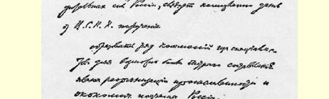
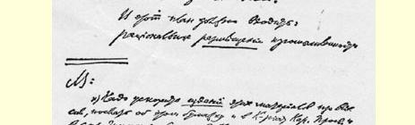

## 科学技术工作计划草稿 ９９

> （１９１８年４月１８日和２５日之间）

科学院已经开始对俄国自然生产力进行系统的研究和调查[^1]，最高国民经济委员会应当立即委托科学院

成立一系列由专家组成的委员会，以便尽快制定俄国的工业改造和经济发展计划。

这个计划应当包括：

使俄国工业**布局**合理，着眼点是接近原料产地，尽量减少从原料加工转到半成品加工一直到制出成品等阶段时的劳动消耗。

从现代最大工业的角度，特别是从托拉斯的角度，把生产合理地合并和集中于少数最大的企业。

最大限度地保证现在的俄罗斯苏维埃共和国（不包括乌克兰及德国人占领的地区）能够在**一切**最主要的原料和工业品方面**自给自足**。

特别注意工业和运输业的电气化以及电力在农业中的运用。 利用次等燃料（泥炭、劣质煤），以燃料开采和运送方面最少的耗费取得电力。

> １９１８年４月列宁《科学技术工作计划草稿》手稿第１页
>
> （按原稿缩小）

注意水力和风力发动机及其在农业中的运用。

> 载于１９２４年３月４日《真理报》译自《列宁全集》俄文第５版第５２号第３８卷第２２８—２３１页

[^1]: 注意：应当尽力加快出版这些材料，并就此发一个通知给国民教育人民委员部、印刷工人工会和劳动人民委员部。１００