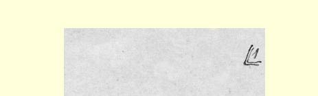
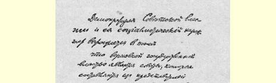
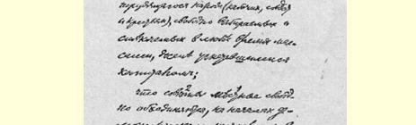
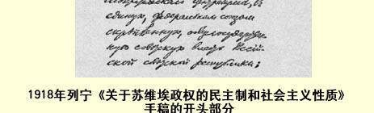

## 关于苏维埃政权的民主制和社会主义性质

> （１９１８年上半年）

苏维埃政权的民主制和它的社会主义性质表现在：

最高国家政权是由以前受资本压迫的群众自由选出和随时都可以撤换的劳动人民（工人、士兵和农民）的代表组成的苏维埃；

地方苏维埃根据民主集中制原则，自由联合成俄罗斯苏维埃共和国这一统一的、结合为联邦的全国性苏维埃政权；

苏维埃不仅把立法权和对执行法律的监督权集中在自己的手里，而且通过苏维埃全体委员把直接执行法律的职能集中在自己的手里，以便逐步过渡到由全体劳动居民人人来履行立法和管理国家的职能。

其次，应该注意到：

无论直接或间接地把个别工厂或个别行业的工人对他们各自的生产部门的所有权合法化，还是把他们削弱或阻挠执行全国政权命令的权利合法化，都是对苏维埃政权基本原则的极大歪曲，都是对社会主义的彻底背弃……[^1]。

> 载于１９５７年４月２２日《真理报》译自《列宁全集》俄文第５版第１１２号第３６卷第４８１页

> １９１８年列宁《关于苏维埃政权的民主制和社会主义性质》
>
> 手稿的开头部分
>
> （按原稿缩小）

[^1]: 手稿到此中断。—— 俄文版编者注