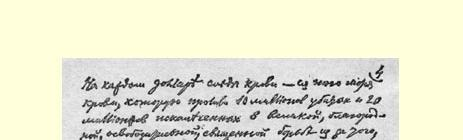
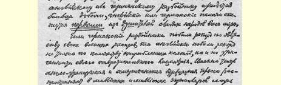
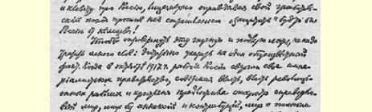
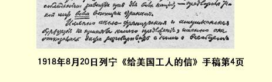

# 给美国工人的信 ３０

> （１９１８年８月２０日）

同志们：有一个参加过１９０５年革命、后来在你们国家住过多年的俄国布尔什维克向我建议，我的这封信由他带给你们。我十分高兴地接受了他的建议，因为美国革命无产者正是在目前担负着一个特别重要的使命，就是要毫不调和地反对美帝国主义，反对这个最新最强的、最后参加资本家为瓜分利润而进行的全世界各民族间的大厮杀的帝国主义。正是在目前，美国的亿万富翁们，这些现代的奴隶主们，揭开了血腥的帝国主义的血腥历史上特别悲惨的一页，因为他们赞同英日野兽们为扼杀第一个社会主义共和国而发动的武装进攻，不管这种赞同是直接的还是间接的，是公开的还是伪善地掩盖起来的，都是一样。

现代的文明的美国的历史，是从一次伟大的、真正解放的、真正革命的战争开始的；这种战争，同那些因帝王、地主、资本家瓜分已夺得的土地或已攫取的利润而引起的掠夺战争（象目前的帝国主义战争）比较起来，是不多见的。这是美国人民反对英国强盗的战争，这些英国强盗当时压迫美国，使它处于殖民地奴隶地位，就象这些“文明的”吸血鬼现在压迫印度、埃及和世界各地的亿万人民，使他们处于殖民地奴隶地位一样。

从那时起，差不多过去了１５０年。资产阶级的文明已经结出了累累硕果。美国就人的联合劳动的生产力发展水平来说，就应用机器和一切最新技术奇迹来说，都在自由文明的国家中间占第一位。 同时美国也成了贫富最悬殊的国家之一，在那里，一小撮亿万富翁肆意挥霍，穷奢极欲，而千百万劳苦大众却永远濒于赤贫境地。曾经给世界树立过以革命战争反对封建奴隶制榜样的美国人民，竟沦为一小撮亿万富翁的现代的资本主义雇佣奴隶，充当雇佣刽子手的角色，为了满足富有的恶棍们的愿望，１８９８年在“解放”菲律宾的借口下扼杀了菲律宾３１，１９１８年又在“保卫”俄罗斯社会主义共和国不受德国侵略的借口下来扼杀俄罗斯社会主义共和国。

但是，四年各民族间的帝国主义大厮杀并没有白白过去。英德这两个强盗集团的恶棍们对人民的欺骗，已被不可争辩的明显事实彻底揭穿了。四年战争的结果表明，资本主义的一般规律，运用在强盗分赃战争上就是：谁最富最强，他聚敛的财富就最多，掠夺的就最多；谁最弱，他遭到的掠夺、蹂躏、压榨和扼杀就最厉害。

英帝国主义强盗就他们拥有的“殖民地奴隶”的数量来说是最强的。英国资本家不但没有丧失“自己的”（也就是他们在数百年间掠夺来的）一寸土地，反而夺取了德国在非洲的所有殖民地，夺取了美索不达米亚和巴勒斯坦，扼杀了希腊，并已开始掠夺俄罗斯了。

德帝国主义强盗就“他们的”军队的组织性和纪律性来说是最强的，但就拥有殖民地来说是较弱的。他们失掉了所有的殖民地， 却抢劫了半个欧洲，扼杀了大批弱小国家和弱小民族。从交战双方来看，这是多么伟大的“解放”战争！两个集团的强盗们，英法资本家和德国资本家们，同他们的走狗社会沙文主义者即投靠“**本国**” 资产阶级的社会党人一起，多么出色地“保卫了祖国”！

> １９１８年８月２０日列宁《给美国工人的信》手稿第４页
>
> （按原稿缩小）

美国的亿万富翁们几乎是最富的，并且处在最安全的地理位置上。他们聚敛的财富最多。他们把所有的国家，甚至最富有的国家，都变成了自己的进贡者。他们掠夺了数千亿美元。每一块美元都有英国和它的“盟国”、德国和它的附庸国缔结的各种肮脏的秘密条约的污迹，为了分赃、为了在压迫工人和迫害国际主义者社会党人方面互相“帮助”而缔结的各种条约的污迹。每一块美元都有使每个国家的富人发财、穷人破产的“有利可图的”军事订货的污迹。每一块美元都有１０００万死者和２０００万残废者的血迹，他们在这场为了确定英国和德国强盗谁争得更多赃物、英国和德国刽子手谁在摧残世界弱小民族方面占***首位***而展开的伟大的、高尚的、解放的、神圣的斗争中血流成河。

如果说德国强盗在军事屠杀的残暴性方面打破了纪录，那么英国强盗不仅在夺得的殖民地的数量方面，而且在玩弄令人厌恶的虚伪手法的高超方面，也打破了纪录。正是现在，英、法、美三国的资产阶级用几百万份报纸来散布诽谤俄国的言论，同时却虚伪地把自己对俄国的掠夺性进攻说成是要“保卫”俄国不受德国人的侵略！

要驳倒这种卑鄙龌龊的谎话，用不着多费唇舌，只要指出一件尽人皆知的事实就够了。１９１７年１０月，俄国工人刚把本国的帝国主义政府推翻，苏维埃政权，革命工人和农民的政权，就公开向***所有***交战国建议缔结没有兼并和赔款的公正的和约，充分保证各民族权利一律平等的和约。

正是英、法、美三国的资产阶级没有接受我们的建议，正是他们甚至拒绝同我们商谈普遍和约！正是***他们***背叛了各国人民的利益，正是他们延长了帝国主义大厮杀！

正是他们一心指望把俄国重新拖入帝国主义战争而拒绝了和平谈判，从而使得同样是掠夺成性的德国资本家能够为所欲为，把兼并性、强制性的布列斯特和约强加给俄国！

很难设想还有什么比英、法、美三国的资产阶级把**签订**布列斯特和约归“罪”于我们的这种虚伪手法更可恶的了。恰好是当时能够把布列斯特谈判变为各国都参加的缔结普遍和约的谈判的那些国家的资本家们，现在竟来“责难”我们！靠掠夺殖民地、靠各民族间的大厮杀发了财的残暴的英法帝国主义者，在布列斯特谈判之后又把战争延长了将近一年之久，却“责难”***我们***这些曾向所有国家建议缔结公正的和约的布尔什维克，“责难”***我们***这些撕毁了以前沙皇和英法资本家签订的罪恶秘密条约并把它们公布出来使它们当众出丑的布尔什维克。

全世界的工人，不论他们生活在哪一个国家，都欢迎我们，同情我们，向我们鼓掌欢呼，因为我们斩断了帝国主义相互勾结、帝国主义肮脏条约、帝国主义压迫的锁链，因为我们不惜付出最大的牺牲而争得了自由，因为我们这个社会主义共和国虽然遭受过帝国主义者的摧残和掠夺，但仍然***摆脱了***帝国主义战争，在全世界面前举起了和平的旗帜，社会主义的旗帜。

毫不奇怪，国际帝国主义匪帮因此憎恨我们，“责难”我们，帝国主义者的一切仆从，包括我国右派社会革命党人和孟什维克在内，也“责难”我们。这些帝国主义走狗对布尔什维克的憎恨，正如同世界各国觉悟的工人的同情一样，使我们更加相信我们事业的正义性。

为了战胜资产阶级，为了把政权转到工人手中，为了***开始***国际无产阶级革命，可以而且应当***不***惜任何牺牲，包括牺牲一部分国土，包括在帝国主义面前遭受严重失败，谁不了解这一点，谁就不是社会主义者。谁不***用行动***证明他有决心为了真正推进社会主义革命事业而使“他的”祖国承担最大的牺牲，谁就不是社会主义者。

英国和德国的帝国主义者为了“自己的”事业，就是说，为了夺取世界霸权，不惜彻底毁灭和扼杀从比利时和塞尔维亚到巴勒斯坦和美索不达米亚等一大批国家。那么，社会主义者为了“自己的”事业，为了使全世界劳动人民摆脱资本压迫，为了争取普遍的持久的和平，难道因为找不到一条没有牺牲的道路就应当观望等待吗？难道因为不能“担保”轻易获得胜利就应当害怕开始战斗吗？ 难道应当把“自己的”、资产阶级建立起来的“祖国”的安全和完整置于全世界社会主义革命的利益之上吗？应当百倍地鄙视抱有这种想法的国际社会主义的败类和资产阶级道德的奴才。

英、法、美三国的帝国主义豺狼们“责难”我们同德帝国主义达成了“协议”。十足的伪君子！一群恶棍！他们看见“他们”本国工人对我们表示同情而吓得发抖，竟诽谤起工人政府来了！但是他们的伪善面孔一定会被揭穿。他们假装不懂两种协议的差别：一种是 “社会主义者”同资产阶级（本国和外国的）达成协议来**反对工人**， 反对劳动者；另一种是**为了保卫**战胜了本国资产阶级的工人，为了无产阶级能利用资产阶级不同集团间的对立，而同具有一种色彩的资产阶级达成协议来**反对**具有另一种民族色彩的**资产阶级**。

实际上，每一个欧洲人都很清楚这种差别，而美国人民，正象我就要指出的，在他们本国的历史中特别具体地“感受到了”这种差别。协议和协议不同，正如法国人所常说的：ｆａｇｏｔｓｅｔｆａｇｏｔｓ[^1]。

当德帝国主义强盗在１９１８年２月派兵进攻没有武装的、把军队复员了的、在国际革命还没有完全成熟之前就信赖无产阶级国际声援的俄国时，我毫不犹豫地和法国君主派达成了一种“协议”。 一位口头上同情布尔什维克、实际上忠心为法帝国主义效劳的法国上尉沙杜尔，领了一个叫让·吕贝尔萨克的法国军官来见我。让 ·吕贝尔萨克向我声明：“我是一个君主派分子，我的唯一目的就是使德国失败。”我答道，这是很自然的（ｃｅｌａｖａｓａｎｓｄｉｒｅ）。这丝毫也不妨碍我和让·吕贝尔萨克达成“协议”，利用愿意帮助我们的、 精通爆破技术的法国军官去破坏铁路线，以阻止德国人的进犯。这是每个觉悟的工人都会赞同的、有利于社会主义的“协议”的范例。 我和法国君主派分子握手时，明明知道我们当中每一方都很想把自己的“伙伴”绞死。但是，我们的利益暂时是一致的。为了对付向我们进攻的德国掠夺者，为了维护俄国和国际社会主义革命的利益，**我们**利用了**其他**帝国主义者的同样是掠夺性质的相反利益。我们这样做是为了俄国和其他国家工人阶级的利益，我们加强了全世界的无产阶级而削弱了全世界的资产阶级，我们采用了在**一切** 战争中都必须采用的最合理的手段—— 随机应变，迂回，退却，以便等待一些先进国家中迅速发展着的无产阶级革命**完全成熟起来**。

不管英、法、美三国的帝国主义豺狼怎样凶恶地号叫，不管他们怎样诽谤我们，不管他们怎样花费千百万金钱收买右派社会革命党的、孟什维克的和其他社会爱国主义分子的报纸，如果英法军队对俄国的进攻需要我和德帝国主义强盗缔结**这样的**“协议”，**我将毫不迟疑地**这样做。我很清楚，我的策略将得到俄国、德国、法国、英国、美国，一句话，整个文明世界的觉悟的无产阶级的赞同。 这样的策略将促进社会主义革命事业，加速社会主义革命的到来， 削弱国际资产阶级，加强正在战胜国际资产阶级的工人阶级的阵地。

而美国人民早就运用过这一策略，并给革命带来了好处。当美国人民进行反对英国压迫者的伟大解放战争的时候，压迫美国人民的还有法国人和西班牙人，现在的北美合众国的一部分领土当时就属于他们。美国人民在争取解放的艰苦战争中，为了削弱压迫者，为了加强从事反压迫的革命斗争的人们的力量，为了被压迫**群众**的利益，也曾和一些压迫者缔结“协议”去反对另一些压迫者。美国人民利用了法国人、西班牙人和英国人之间的纠纷，有时甚至同法国人和西班牙人这些压迫者的军队并肩作战，反对英国压迫者。 美国人民先战胜了英国人，然后从法国人和西班牙人手中解放了自己的国土（一部分是赎回的）。

伟大的俄国革命家车尔尼雪夫斯基说过：历史活动并不是涅瓦大街的人行道３２。谁认为无产阶级革命必须一帆风顺，各国无产者必须一下子就采取联合行动，事先必须保证不会遭到失败，革命的道路必须宽阔、畅通、笔直，在走向胜利的途中根本不必承受极其重大的牺牲，不必“困守在被包围的要塞里”，或者穿行最窄狭、 最难走、最曲折和最危险的山间小道，谁认为只有“在这种条件下” 才“可以”进行无产阶级革命，谁就不是革命者，谁就没有摆脱资产阶级知识分子的迂腐气，谁就常常会在实际上滚入反革命资产阶级的阵营，象我国右派社会革命党人、孟什维克以至左派社会革命党人（虽然比较少见）那样。

这些老爷喜欢跟着资产阶级责难我们，说我们制造革命“混乱”，“破坏”工业，造成失业和饥荒。这些人明明欢迎和支持过帝国主义战争，或同继续进行这一战争的克伦斯基达成过“协议”，却发出这种责难，多么假仁假义！这一切灾难正是帝国主义战争的罪孽。战争所引起的革命，不能不经受难以想象的困难和痛苦，那都是各民族间进行了多年的毁灭性的反动的大厮杀遗留下来的。责难我们“破坏”工业或制造“恐怖”，这是假仁假义，要不就是极其迂腐，不能理解被称为革命的那种尖锐到极点的激烈的阶级斗争的基本条件。

实质上，这一类“责难者”即使“承认”阶级斗争，也只是口头上承认，实际上往往陷入要各个阶级“协议”与“合作”的小市民空想。 因为在革命时代，阶级斗争在一切国家总是不可避免地要采取**国内战争**的形式，而没有极严重的破坏，没有恐怖，没有为了战争利益而对形式上的民主的限制，国内战争是不可想象的。只有甜言蜜语的牧师，不管是基督教牧师，还是沙龙的议会的社会党人这样的 “世俗”牧师，才会看不见、不理解和感觉不到这种必然性。只有僵死的“套中人”３３才会因此避开革命，而不在历史要求用斗争和战争来解决人类最大的问题时以最大的热情和决心投入战斗。

美国人民是有革命传统的，美国无产阶级的优秀代表继承了这种传统，不止一次地表示完全同情我们布尔什维克。这种传统就是１８世纪的反英解放战争以及后来１９世纪的国内战争。１８７０ 年，美国在某些方面，如果只拿某些工业部门和国民经济所遭受的 “破坏”来说，是**落后于**１８６０年的。但如果有人根据***这点***而否定美国１８６３—１８６５年国内战争的极伟大的、世界历史性的、进步的和革命的意义，那该是多么迂腐、多么愚蠢呵！

资产阶级的代表人物懂得，为了推翻黑奴制度，为了推翻奴隶主的政权，就是使全国经历多年国内战争，遭受任何战争都避免不了的极严重的破坏和恐怖，也是值得的。可是现在要来解决推翻资本主义**雇佣**奴隶制、推翻资产阶级政权这个无比伟大的任务时，这些资产阶级的代表人物和辩护人以及被资产阶级吓倒的、躲避革命的社会党人改良主义者，却不能理解也不愿意理解国内战争的必然性和合理性了。

美国工人是不会跟着资产阶级走的。他们将同我们一起，拥护反资产阶级的国内战争。世界工人运动和美国工人运动的全部历史使我坚信这一点。我还记得美国无产阶级最爱戴的领袖之一尤金· 德布兹的话，他在给《向理智呼吁报》（ＡｐｐｅａｌｔｏＲｅａ－ ｓｏｎ）３４—— 似乎是在１９１５年底—— 写的一篇文章《我将为什么而战》（《ＷｈａｔｓｈａｌｌＩｆｉｇｈｔｆｏｒ》）里（１９１６年初，在瑞士伯尔尼一次公开的工人大会上，我曾引用过这篇文章[^2]）说道：

他，德布兹，宁愿被枪毙，也不会投票赞成给现在这场罪恶的反动的战争拨款；他德布兹只知道一种神圣的、从无产者观点看来是合理的战争，那就是反对资本家的战争，使人类摆脱雇佣奴隶制的战争。

威尔逊这个美国亿万富翁的头子、大资本家的奴仆把德布兹逮捕入狱，并不使我感到惊奇。让资产阶级去残酷地迫害真正的国际主义者、革命无产阶级的真正代表吧！他们愈是残暴，无产阶级革命胜利的日子就来得愈快。

有人责难我们，说我们的革命造成了破坏…… 这些责难者究竟是什么人呢？他们是资产阶级的走狗。而正是资产阶级在四年帝国主义战争中几乎毁灭了欧洲的全部文化，使欧洲陷入野蛮、粗野和饥饿的境地。正是这个资产阶级现在又要求我们不要在这些破坏的基础上、在文化的废墟中间、在战争造成的废墟中间进行革命，不要同那些被战争弄得粗野的人一起进行革命。这个资产阶级多么人道、多么公正啊！

资产阶级的奴仆们责难我们实行恐怖…… 英国资产者忘记了自己的１６４９年，法国人忘记了自己的１７９３年３５。当资产阶级为了本身利益对封建主实行恐怖的时候，恐怖就是正当的、合理的。 当工人和贫苦农民胆敢对资产阶级实行恐怖的时候，恐怖竟成为骇人听闻的和罪恶的！当一个剥削者少数为了代替另一个剥削者少数而实行恐怖的时候，恐怖就是正当的、合理的。当我们为了推翻**一切**剥削者少数，为了真正的大多数，为了无产阶级和半无产阶级—— 工人阶级和贫苦农民的利益而开始实行恐怖的时候，恐怖竟成为骇人听闻的和罪恶的！

国际帝国主义资产阶级在“自己的”战争中，即在确定由英国强盗还是由德国强盗来称霸世界的战争中杀死了１０００万人，使 ２０００万人成了残废。

如果**我们的**战争，被压迫者和被剥削者反对压迫者和剥削者的战争，要在世界各国一共牺牲５０万人或１００万人，资产阶级就会说：前一种牺牲是合理的，后一种牺牲是罪恶的。

无产阶级的说法却完全不同。

现在无产阶级通过帝国主义战争的惨祸充分地具体地懂得了一个伟大的真理，它是一切革命给我们的教诲，是工人最好的导师、现代社会主义的创始人给工人留下的遗言。这个真理就是：不 **镇压剥削者的反抗**，革命就不能成功。在我们工人和劳动农民掌握了政权以后，我们的职责就是镇压剥削者的反抗。我们自豪的是， 我们一直在这样做。我们惋惜的是，我们在这方面还做得不够强硬，不够坚决。

我们知道，在一切国家中，资产阶级对社会主义革命的疯狂反抗是不可避免的，而且革命愈发展，反抗就愈**厉害**。无产阶级一定能摧毁这种反抗，在打垮资产阶级反抗的过程中完全成熟起来，最后取得胜利，取得政权。

让卖身投靠的资产阶级报刊向全世界大肆宣扬我国革命所犯的每一个错误吧。我们不怕有错误。人们并不因为发生了革命而变成圣人。劳动阶级多少世纪来一直受压迫，受折磨，被迫处于贫穷、愚昧、粗野的境地，他们干革命是不可能不犯错误的。而资产阶级社会的尸体，正如我有一次说过的，又不能装进棺材，埋到地下[^3]。被打死的资本主义在我们中间腐烂发臭，污染空气，毒化我们的生活，用陈旧的、腐败的、死亡的东西的密网死死缠住新鲜的、 年轻的、生气勃勃的东西。

资产阶级及其走狗（其中包括我国孟什维克和右派社会革命党人）向全世界大肆宣扬我们所犯的错误，可是我们每犯一百个错误就有一万个伟大的英勇的行动，这些行动是平凡的，不起眼的， 是淹没在工厂区或偏僻乡村的日常生活中间的，是由不习惯（也没有可能）向全世界大肆宣扬自己每一个成就的人们做出来的，因此，也就更加伟大，更加英勇。

假定事情完全相反（虽然我知道这种假定不符合事实），假定我们每有一百个正确行动就有一万个错误，我们的革命仍然是**而且在世界历史面前一定是**伟大的，不可战胜的，因为这是**第一次**不是由少数人，不是仅仅由富人、仅仅由有教养的人，而是由真正的群众、由大多数劳动者**自己**来建设新生活，**用自己的经验**来解决社会主义组织工作中的最困难的问题。

在这项工作中，在这项千百万普通工人和农民真心实意地进行的改造他们整个生活的工作中所犯的每一个错误，都抵得上剥削者少数的一千个、一百万个“没有错误的”成就，在欺骗和愚弄劳动者方面所得到的成就。因为工人和农民只有**通过**这样一些错误才能**学会**建设新生活，学会***不要***资本家也能进行建设，才能给自己开拓出一条穿越千万重障碍而到达社会主义胜利的道路。

我们的农民在进行革命工作时会犯错误，但他们在１９１７年 １０月２５日（俄历）的一夜之间就一举废除了一切土地私有制，并且现在逐月地克服着莫大的困难，自己纠正自己的失误，切实地解决着极困难的任务：创造新的经济生活条件，同富农作斗争，保证土地掌握在劳动者手里（而不是掌握在富人手里），向**共产主义的** 大农业过渡。

我们的工人在进行革命工作时会犯错误，但他们只用了几个月时间差不多已经把所有的大工厂收归国有，现正通过日常的艰苦的劳动学习管理整个工业部门的新业务，克服因循守旧、小资产阶级性和利己主义这些巨大的阻力，使国有化企业走上正轨，用一块块基石为**新的**社会联系、**新的**劳动纪律、工会对其会员的**新的**权力奠定基础。

我们的苏维埃，远在１９０５年的群众运动高潮中建立起来的苏维埃，在进行革命工作时会犯错误。工农苏维埃，这是新的国家**类型**，新的最高的民主**类型**，这是无产阶级专政的一种形式，是在**不要**资产阶级和**反对**资产阶级的情况下来管理国家的一种方式。在这里，民主第一次为群众为劳动者服务，不再是富人的民主，而在一切资产阶级的、甚至是最民主的共和国里，民主始终是富人的民主。人民群众现在第一次为亿万人解决实现无产者和半无产者专政的任务，而不解决这一任务，也就**谈不上**社会主义。

让学究们或满脑子资产阶级民主偏见或议会制偏见的人们在谈到我们的工人、农民和红军代表苏维埃不是由直接选举产生的时候去摇头耸肩表示不解吧。这些人在１９１４—１９１８年的大转变时期既没有忘掉什么，也没有学到什么。无产阶级专政与劳动者的新的民主相结合，国内战争与最广泛地吸引群众参加政治相结合，—— 这样的结合是不可能一蹴而就的，也是保守的议会民主制的陈旧形式容纳不了的。新的世界，社会主义的世界，是以苏维埃共和国的面貌出现在我们面前的。毫不奇怪，这个世界不会一生下来就完美无缺，不会象密纳发那样一下子从丘必特脑袋里钻出来３６。

旧的资产阶级民主宪法大书特书形式上的平等和集会权利， 我们的、无产阶级和农民的、苏维埃的宪法则抛弃形式上平等的虚伪词句。当资产阶级共和派推翻帝制时，他们并不关心君主派同共和派的形式上的平等。现在要来推翻资产阶级了，只有叛徒或白痴才会极力为资产阶级争取形式上的平等权利。如果所有好的建筑物都让资产阶级占去了，“集会自由”对工人和农民来说就一文不值。我们的苏维埃把城市和乡村中好的建筑物从富人手里全部**夺了过来**，并把***所有***这些建筑物**交给了**工人和农民，供***他们***集会结社之用。这就是我们的集会自由—— 劳动者享受的集会自由！这就是我们的苏维埃宪法、我们的社会主义宪法的意义和内容！

正因为这样，我们大家深信，不管我们苏维埃共和国还会遭到什么灾祸，**它是不可战胜的**。

它之所以不可战胜，是因为疯狂的帝国主义的每一次打击，国际资产阶级使我们遭受的每一次失败，都会激励更多的工人和农民起来斗争，使他们从惨重的牺牲中受到教育，使他们受到锻炼， 激发起新的群众性的英雄主义。

我们知道，美国工人同志们，你们的帮助也许还不会很快到来，因为革命的发展在不同的国家有不同的形式，不同的速度（也不能不是这样）。我们知道，欧洲的无产阶级革命，不管它近来成熟得多么快，在最近几个星期内还不可能爆发。我们指望国际革命必然发生，但这决不是说，我们象傻瓜一样指望它在**某个**短时期内必然发生。我们国家有过两次大革命（１９０５年和１９１７年），所以知道革命是不能按定单或协议制造的。我们知道，形势把**我们**俄国的社会主义无产阶级的队伍推到前面，并不是由于我们的功劳，而是由于俄国特别落后；我们知道，**在**国际革命爆发**之前**，一些国家的革命遭到失败还是可能的。

虽然如此，我们还是坚定地认为我们是不可战胜的，因为人类不会毁于帝国主义大厮杀，而一定会战胜它。第一个**打碎**帝国主义战争的沉重锁链的就是**我们**国家。我们在打碎这条锁链的斗争中作出了重大牺牲，但是我们把它**打碎了**。我们**摆脱了**对帝国主义的依赖，我们在全世界面前举起了为彻底推翻帝国主义而斗争的旗帜。

在国际社会主义革命的其他队伍来援助我们之前，我们就好象守在一个被包围的要塞里。但这些队伍**是存在的**，他们比我们**人数众多**，他们正随着帝国主义继续肆虐而日益成熟起来，日益成长壮大起来。工人们正在同龚帕斯、韩德逊、列诺得尔、谢德曼、伦纳之流的社会主义叛徒决裂。工人们在缓慢地但是坚定不移地转向共产主义的即布尔什维主义的策略，走向无产阶级革命，因为只有无产阶级革命才能挽救正在毁灭的文化和正在毁灭的人类。

总之，我们是不可战胜的，因为世界无产阶级革命是不可战胜的。

### 尼·列宁

１９１８年８月２０日

> 载于１９１８年８月２２日《真理报》译自《列宁全集》俄文第５版第１７８号第３７卷第４８—６４页

[^1]: 都是柴捆，各有不同。—— 编者注

[^2]: 见《列宁全集》第２版第２７卷《在伯尔尼国际群众大会上的讲话》—— 编者注

[^3]: 见《列宁全集》第２版第３４卷第３８０页。—— 编者注