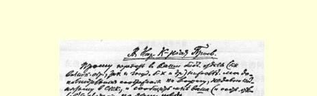
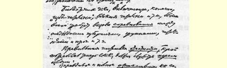
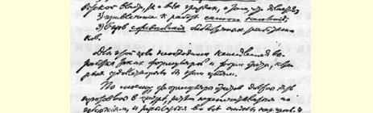
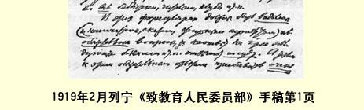

# 致教育人民委员部

> （不晚于１９１９年２月８日）

我对人民委员会不久以前所提出的问题[^1]补充了以下一些意见，请将这些意见转告你部管理图书馆的各个部门（包括社会教育司图书馆处和国立图书馆处等等），并将你部（和有关各处）对这一问题的看法告诉我。

要办好图书馆（当然包括“农村阅览室”、各种阅览室等等），最需要在各省、各团体、各阅览室等等之间开展**竞赛**。

现在人民委员会要求**定期汇报**，正确的做法应该达到**三个**目的：

（１）使苏维埃政权和全体公民能**了解到**真实的和全部的工作情况；

（２）吸引**居民**参加办馆；

（３）促使图书馆工作人员开展**竞赛**。

为此，必须立即编制一些能够达到这些目的的报表。

我认为，报表应该由上面统一编制，然后由各省翻印，分发各国民教育局和***所有的***图书馆、阅览室、俱乐部等等。

在报表上一定要**突出**（譬如用黑体字印刷）**必须**回答的问题， 图书馆馆长等人如不回答，要负**法律上的**责任。除了这些必须回

> １９１９年２月列宁《致教育人民委员部》手稿第１页
>
> （按原稿缩小） 答的问题，还要开列***很***多**不是必须**回答的问题（就是说，这些问题如不回答，不一定要交法庭究办）。

报表中应该包括的必须回答的项目，举例来说有图书馆（或阅览室等等）的地址，馆长和管委会成员的姓名及其住址，书报数量， 开馆时间等等（对于大型图书馆还要有其他项目）。

在不是必须回答的项目中，应该以提问的方式列举瑞士和美国（以及其他国家）所采取的***一切***改进措施，以**鼓励**运用改进措施最多最好的工作人员（奖给贵重的书籍和成套的期刊等等）。

例如：（１）你能否用确切的材料证明你们图书馆的图书**流通率** 在增长？（２）你们阅览室的读者有多少？（３）是否和其他图书馆、阅览室交换书报？（４）是否编有图书总目录？（５）星期日是否开馆？ （６）晚间是否开馆？（７）是否扩大了读者范围，如妇女、儿童、非俄罗斯人等等？（８）是否满足了读者的查询？（９）有哪些简单切实的保管书报的方法？保存书报的方法？是否有机械化的取书、放书设备？ （１０）图书是否外借？（１１）外借手续是否简便？（１２）邮借手续是否简便？***以及诸如此类的问题***。

报告写得好的，工作有成绩的，都给予奖励。

教育人民委员部图书馆司一定要向人民委员会汇报：每月收到**多少份**报告，哪些问题得到了回答，如此等等，都总计一下。

> 载于１９３３年《列宁文集》俄文版译自《列宁全集》俄文第５版第２４卷第３７卷第４７４—４７７页

[^1]: 参看本卷第４５７页。—— 编者注