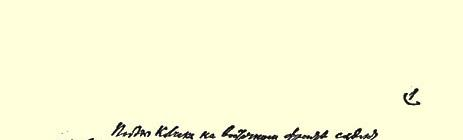
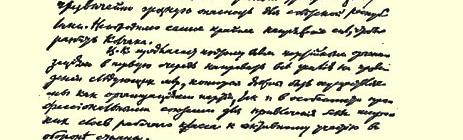
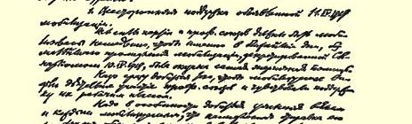
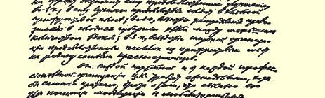

# 为支援东线告彼得格勒工人书

> （１９１９年４月１０日）

告彼得格勒工人同志们

同志们！东线的情况极度恶化。高尔察克今天占领了沃特金斯克工厂，布古利马即将陷落，看来，高尔察克还会向前推进。

情况十分危急。

我们今天在人民委员会里通过了一系列支援东线的紧急措施８９，加强了鼓动工作。

我们请彼得格勒的工人**把一切都发动起来**，**动员一切力量**去支援东线。

到那里去的工人－士兵不但自己能吃饱，还能寄粮食接济自己的家属。而主要的是那里决定着革命的命运。

那里胜利了，**我们便可以结束战争**，因为**那时白卫分子再也得不到外援了**。在南方，我们已经接近胜利。只要南方没有获得完全胜利，就不能从南方抽调兵力。

所以**大家都要支援东线**！

工人、农民和红军代表苏维埃和工会应当拿出所有力量，把一切都发动起来，用各种方法支援东线。

同志们，我相信彼得格勒的工人定会给全国作出榜样。

致共产主义的敬礼

### 列宁

１９１９年４月１０日于莫斯科

> 载于１９１９年４月１２日《彼得格勒译自《列宁全集》俄文第５版真理报》第８１号第３８卷第２６８页

> １９１９年列宁《俄共（布）中央关于东线局势的提纲》手稿第１页
>
> （按原稿缩小）