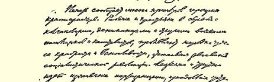
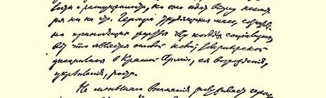
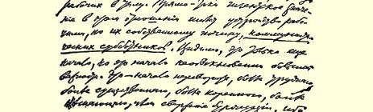

# 伟大的创举

> （论后方工人的英雄主义。
>
> 论“共产主义星期六义务劳动”）
>
> （１９１９年６月２８日）

报刊上登载了红军战士的许多英勇事迹。工人和农民们在与高尔察克、邓尼金和其他地主资本家军队作斗争中，表现了不少英勇果敢和坚韧不拔的奇迹，保卫着社会主义革命的果实。根绝游击习气和克服疲沓涣散现象的过程进行得很缓慢，很费力，然而却一直在前进。为了社会主义的胜利而自觉地承受牺牲的劳动群众的英雄主义，是红军中新的同志纪律的基础，是红军恢复、巩固和壮大的基础。

后方工人的英雄主义也同样值得重视。在这方面，工人自己发起组织的**共产主义星期六义务劳动**确实具有极大的意义。显然，这还只是开端，但这是非常重要的开端。这是比推翻资产阶级更困难、更重大、更深刻、更有决定意义的变革的开端，因为这是战胜自身的保守、涣散和小资产阶级利己主义，战胜万恶的资本主义遗留给工农的这些习惯。当**这种**胜利获得巩固时，那时，而且只有那时， 新的社会纪律，社会主义的纪律才会建立起来；那时，而且只有那时，退回到资本主义才不可能，共产主义才真正变得不可战胜。

５月１７日《真理报》登载了阿·日·同志的文章《用革命精神从事工作（共产主义星期六）》。这篇文章很重要，所以我们把它全文照录如下：

### 用革命精神从事工作

（共产主义星期六）

俄共中央关于用**革命精神**从事工作的信[^1]，给了共产党组织和共产党员

> 以有力的推动。由于热情普遍高涨，铁路上的许多共产党员职工走上了前线， 但是大多数人不能离开重要岗位，要用革命精神从事工作，又找不到新的方法。来自各地的关于动员工作缓慢的消息和办事拖拉的现象，使莫斯科—喀山铁路分局不得不去注意铁路机构的工作情况。结果了解到，由于劳动力不够和劳动效率低，一些急活和机车赶修任务都拖了下来。５月７日，在莫斯科 —喀山铁路分局共产党员和同情分子大会上，提出了不能嘴上说帮助而要以实际行动帮助战胜高尔察克的问题。提出的建议中说： “鉴于国内外形势的严重，为了对阶级敌人取得优势，共产党员和同情分子应当更加鞭策自己，从休息时间内抽出一小时，也就是把自己的工作日延长一小时，将这些时间集中起来，在星期六这天进行一次六小时的体力劳动， 以便立即创造出实际的价值。我们认为，共产党员为保卫革命果实，不应吝惜自己的健康和生命，所以这项工作应该是无报酬的。提议在全分局内实行**共产主义星期六**，一直干到完全战胜高尔察克。”
>
> 开始人们有些犹豫，最后一致同意这个建议。 ５月１０日，星期六，晚上六点钟，共产党员和同情分子象士兵一样来到工作现场，整队之后，秩序井然地由领工员分别领到各处工作。
>
> **用革命精神**从事工作**收到了明显的**效果。下列表格指明了工作部门和工作性质。

> 工作地点工作名称 完成工作量
>
> 工人
>
> 数目合计
>
> 工作时数
>
> 工作
>
> 小时
>
> 莫斯科装载发往佩罗沃、穆罗４８５２４０装车７５００普特，卸车机车总修配厂姆、阿拉特里和塞兹兰   １８００普特
>
> 的沿线所需材料以及２１３６３
>
> 修理机车用的装备和
>
> 车辆部件５４２０
>
> 莫斯科机车的复杂日常修理２６５１３０总共修理车１．５台客车机务段
>
> 莫斯科机车的日常修理２４６１４４修理好机车２台，拆卸
>
> 编组站４台机车的应修部件
>
> 莫斯科机车的日常修理１２６７２三等客车２辆
>
> 车辆部 “佩罗沃”车辆修理和小修   棚车１２辆和平车２辆车辆总修配厂
>
> 星期六４６５２３０
>
> 星期日２３５１１５
>
> ２０５－１０１４共修好机车４台和客
>
> **总计**……………货车１６辆，装卸车９
>
> ３００普特
>
> 工作总值按正常工资计算为５００万卢布，按加班工资计算还应增加 ５０％。
>
> 装车的劳动效率较普通工人高２７０％。其余工作的效率大致上也是这样。
>
> 因劳动力不足和办事拖拉而拖延７天至３个月的定活（紧急的）现已完成。
>
> 由于设备发生故障（不难排除的故障），个别组曾耽误三四十分钟，但并未影响工作的完成。
>
> 留下来指导工作的管理人员，忙得几乎来不及给人们准备新的工作。一位上年纪的领工员也许是有些夸张地说，在一个**共产主义星期六**干的活，等于不自觉的疲沓的工人一个星期干的。
>
> 鉴于一些真心拥护苏维埃政权的人也来参加了工作，而且今后还会有大批这样的人来参加星期六义务劳动，同时其他地区也会要求学习莫斯科—喀山铁路的共产党员的榜样，现在我根据来自各个现场的消息较详细地谈谈组织方面的情况。
>
> 参加工作的约有１０％是经常在现场工作的共产党员。其余的则是负责工作人员和选任的人员，其中有路局的政治委员，也有各企业的政治委员，以及工会人员、管理局和交通人员委员部的工作人员。
>
> 大家干活时非常努力并密切合作。当工人、办事员、管理人员齐心协力地把住４０普特重的客运机车轮箍，象勤劳的蚂蚁似的把它滚往目的地的时候， 人们心中油然产生一种来自集体劳动的强烈的愉快感觉，坚定了工人阶级必胜的信心。世界上的掠夺者扼杀不了胜利的工人，国内的怠工者也盼不到高尔察克。
>
> 工作完结时，在场的人都亲眼看到这一空前未有的情景：上百个身体疲乏但眼中闪烁着愉快光芒的共产党员，唱起庄严的《国际歌》来庆祝工作的胜利，这胜利的凯歌的声浪仿佛越过墙壁，涌向工人的莫斯科，象投右激起的水波一样荡漾在整个工人的俄罗斯，激励着疲惫、懒散的人们。

### 阿·日·

５月２０日《真理报》刊登的恩·尔·同志的《值得学习的榜样》一文，在评价这个出色的榜样时写道：

> “共产党员做这样的工作并不是罕见的事情。我知道电站和各铁路线都有这样的事例。在尼古拉铁路上，共产党员加班干了几个晚上，把陷在转盘坑里的机车起了出来；冬季，北方铁路上的全体共产党员和同情分子用了好几个星期天去清除铁路上的积雪；许多货运站的支部为了同盗窃货物作斗争， 在站上进行夜间巡逻，—— 不过这种工作都是偶然进行的，而不是经常性的。 莫斯科—喀山线的同志们提供的新的东西是，他们把这一工作变成了有系统的经常的工作。他们决定‘一直干到完全战胜高尔察克’，工作的全部意义正在于此。他们决定在整个战争状态时期把共产党员和同情分子的工作日延长一小时；同时他们作出工作高效率的榜样。
>
> 这个榜样已经引起而且今后**一定会**进一步引起大家的效法。亚历山德罗夫铁路的共产党员和同情分子大会，讨论了军事形势和莫斯科—喀山线的同志们的决议之后通过了如下的决议：（１）亚历山德罗夫铁路的共产党员和同情分子决定实行‘星期六义务劳动’。第一次星期六义务劳动定于５月１７日进行。（２）把共产党员和同情分子组织成示范队，向工人表明，应当怎样工作， 在现有的材料、工具和伙食的情况下实际上能够做到什么。
>
> 据莫斯科—喀山线的同志们说，他们的榜样给人们留下了很深的印象， 他们预料下一个星期六将有大量的**非党**工人参加工作。作者写此文时，亚历山德罗夫铁路修配厂的共产党员还没有开始做加班工作，但是要组织义务劳动的消息刚一传出，非党群众就激动地谈论起来了。到处都有人说：‘昨天我们不知道，不然我们也会做好准备干它一场’，‘下星期六我一定来’。这项工作给人留下的印象是很深的。
>
> 后方的所有共产党支部都应当向莫斯科—喀山线的同志们学习。不仅莫斯科枢纽站上的各共产党支部应当如此，全俄罗斯的党组织都应当效法这个榜样。乡村中的共产党支部，首先应当帮助红军家属，实行代耕。
>
> 莫斯科—喀山线的同志们高唱《国际歌》结束了第一次共产主义星期六劳动。如果全俄罗斯的共产党组织都学习他们的榜样，而且坚持不懈地贯彻下去，那么，俄罗斯苏维埃共和国就会在共和国全体劳动者的洪亮的《国际歌》声中度过今后一段艰苦的岁月……
>
> 共产党员同志们，动手干吧！”

１９１９年５月２３日《真理报》报道说： **“５月１７日在亚历山德罗夫铁路举行了第一次共产主义‘星期六义务劳动’**。**共产党员和同情分子共９８人根据大会决议在班后做了５小时无报酬的工作**，**他们不过有权再买一顿饭**，**而这顿饭同一般体力劳动工人的一样**，**也是每人半俄磅面包**。**”**

尽管准备工作做得不充分，组织得也差，但***劳动生产率***还是***比平常高*１—２·倍**。

例如：

５个旋工在４小时内做了８０根小轴。生产率等于平常的 ２１３％。

２０个粗工在４小时内收集了６００普特旧材料和７０个各重３． ５普特的车底弹簧，共重８５０普特。生产率等于平常的３００％。

> “同志们解释说，这是因为平时干活枯燥乏味，在这里，大家干活都兴高采烈。可是今后，平时干活比共产主义星期六义务劳动干得少，那就太丢脸了。” “现在有许多非党工人都表示愿意参加星期六义务劳动。各机车修理队都自告奋勇要在星期六义务劳动时间内把机车从‘坟堆’里弄出来，修好使用。
>
> 有消息说，维亚济马铁路上也在组织这样的星期六义务劳动。”

Ａ．嘉琴科同志在６月７日《真理报》上谈到了共产主义星期六义务劳动的情形，现在把他的《星期六义务劳动记》一文的主要部分摘引如下：

> “我和一个同志怀着极愉快的心情，遵照铁路分局党委员会的决定，去上星期六义务劳动‘课’，让脑子暂且休息几个小时，让肌肉发挥一下作用…… 我们的工作是在铁路局的木工厂。到那里后，看到自己人，彼此问好，开一会儿玩笑，查点了人数—— 总共３０人……我们面前躺着一个‘怪物’—— 一个相当有份量的蒸汽锅炉，足有６００—７００普特重，要我们把它‘搬家’，就是说， 要把它滚到大约１４或１３俄里以外的一个平车那里。我们心里不由得产生了一些疑虑……但我们动手干起来了：同志们把木滚就那么往锅炉下面一垫，系上两根绳子，工作就开始了……锅炉还有点不情愿挪动，但终于还是移动了。我们很高兴，要知道，我们人是这样少……就是这台锅炉，比我们多两倍的非党工人几乎拖了两个星期，在我们到来之前它还躺在原地不动……我们在一位领班同志有节奏的‘一、二、三’口令声中，齐心协力地卖劲地干了一个小时，锅炉慢慢地向前移动着。忽然，出了岔子！一长串同志突然狼狈不堪地倒了下去，—— 原来我们手里的一根绳子‘叛变了’……但是没有多大一会儿，就换上了一根粗缆绳……到了傍晚，天色已经明显地暗下来，但我们还得拖过一个小岗子，那时很快就会完工了。我们胳膊酸痛，手掌发烧，周身火热， 还是拼命地往前拉，—— 事情进行得很顺利。旁边站着一位‘管理人’，他被我们的成绩弄得不好意思了，也不由自主地拉起缆绳。帮着干吧！你早就该过来了！一个红军战士出神地瞧着我们工作。他拿着手风琴。他在想什么？也许他想：这是些什么人？大家都回家去过星期六，他们这是在干什么？我打破他的疑团说：‘同志！给我们奏一个快乐的曲子吧，我们可不是什么来随便凑数干活的，我们是真正的共产党员，—— 你看，这手里的活干得多欢，咱们可没有偷懒，是在拼命地干。’红军战士轻轻地放下手风琴，赶快跑过来抓住缆绳 ……
>
> ——‘英国人真机灵！’—— 响起了乌·同志动听的男高音。我们和着他的歌声，高唱起工人歌曲：‘唉嗨，杜宾努什卡，嗨哟，拉呀，拉呀……’
>
> 干这活不习惯，累得要死，肩酸背痛，但是……明天就是假日，可以好好休息，有时间睡个够。目的地快到了，经过一番小小的周折，我们的‘怪物’已差不多靠近平车了：只要垫上木板，滚到平车上，这锅炉就能干人们早就等着它干的工作了。我们一窝蜂涌进屋里，这是地方支部的‘俱乐部’，屋里挂满标语，摆着步枪，灯光明亮，我们很好地唱完了《国际歌》，享受了加‘甜酒’的茶， 还吃了面包。干完重活以后，当地同志这样款待我们，真是再惬意不过了。和同志们亲热地告别之后，我们列成纵队。夜阑人静，革命歌声响彻了沉睡的街道，整齐的步伐声应和着歌声。‘同志们，勇敢地齐步前进。’‘起来，饥寒交迫的奴隶’—— 我们唱起劳动歌和《国际歌》。
>
> 过了一个星期。胳膊和肩膀都歇过来了，这回我们的‘星期六义务劳动’ 是到９俄里以外去修理车辆。目的地是佩罗沃。同志们爬到叫作‘美国人’的车厢顶上，嘹亮动听地唱起《国际歌》。乘客们带着惊异的神情静静听着。车轮有节奏地响着；我们没有来得及爬到上面去的人就蹬在‘美国人’车厢的梯子上，象是一些‘玩命的’乘客。转眼就到了车站。我们到达目的地，又走过一个长长的院子，见到了亲热的政治委员格·同志。
>
> —— 工作有的是，就是人太少了！总共才３０个人，６小时内要完成１３辆车的中修！面前就是划了记号的轮对，不光有空车，还有装得满满的一辆油罐车……不过没问题，同志们咱们‘对付得了’！
>
> 工作热火朝天地干起来了。我和五位同志用吊杆，也就是用杠杆干活。按照‘领头’同志的指挥，这些重六七十普特的轮对，在我们的肩膀和两个吊杆的推压下，轻快地从一条线路跳到另一条线路上。一对车轮撤掉之后，就换上一对新的。放好所有的轮对，我们就把那些磨损了的旧家伙顺着轨道迅速地 ‘打发到’棚子里去……一、二、三，—— 它们被一台旋转式铁吊杆吊到空中， 轨道就腾出来了。那边，在黑暗中，响着手锤声，同志们在自己的‘病’车跟前象蜜蜂般地忙碌着。既做木工，又上油漆，还盖车顶，工作干得热火朝天，我们和政治委员同志都很高兴。那里的锻工们也需要我们帮忙。在一座移动锻工炉上放着一根烧红了的‘导杆’，也就是车辆上用的钩杆，钩已经撞弯。白热的钩杆被钳到砧子上，直冒火花，在经验丰富的同志的指导下，我们灵巧的锤击使它渐渐恢复了原状。它还放着红光就被我们迅速地抬去，冒着火花安进铁孔里，—— 锤了几下，就把它安好了。我们爬到车厢底下。这些车钩和导杆的构造并不象我们想象的那样简单，那里有一整套东西，有铆钉、弹簧……
>
> 工作热火朝天，夜幕降临了，炉火烧得更亮。很快就完工了。一部分同志靠着一堆轮箍在‘憩息’，慢慢地‘品’着热茶。清凉的５月之夜，一钩美妙的新月悬在天空。人们有说有笑，互相开着玩笑。
>
> —— 格·同志，收工吧，修好１３辆不少了！
>
> 但格·同志还没有心满意足。
>
> 喝完了茶，我们唱着庆祝胜利的歌曲，向出口走去……”

开展“共产主义星期六义务劳动”运动的地方，不只是莫斯科。 ６月６日《真理报》报道：

> “５月３１日在特维尔进行了第一次共产主义星期六义务劳动。有１２８名共产党员到铁路上劳动。三个半小时装卸了１４辆车，修好了３台机车，锯了 １０立方俄丈木柴，还做了别的工作。熟练的工人党员的工作效率比一般效率高１２倍。”

接着，６月８日《真理报》又写道：

### 共产主义星期六义务劳动

“萨拉托夫６月５日讯。铁路上的共产党员职工响应莫斯科的同志们

> 的号召，在党员大会上决定：为了支援国民经济，每星期六无报酬地加班劳动 ５小时。”

我详尽无遗地援引了关于共产主义星期六义务劳动的消息， 因为我们从这里无疑地可以看到共产主义建设的一个极其重要的方面，对于这个方面，我们的报刊没有充分地加以重视，我们大家也还没有给予应有的评价。

少唱些政治高调，多注意些极平凡的但是生动的、来自生活并经过生活检验的共产主义建设方面的事情，—— 我们大家，我们的作家、鼓动员、宣传员、组织者等等都应当不倦地反复提出这个口号。

在无产阶级革命后的初期，我们首先忙于主要的和基本的任务，即击败资产阶级的反抗，战胜剥削者，粉碎他们的阴谋（如从黑帮和立宪民主党人１到孟什维克和社会革命党人２都参加过的企图出卖彼得格勒的“奴隶主的阴谋”３），这是当然的，不可避免的。 但除了这个任务以外，同样不可避免地要提出—— 而且愈向前发展就愈要提出—— 一个更重要的任务，即从积极方面来说建设共产主义，创造新的经济关系，建立新社会。

我曾屡次指出，例如３月１２日我在彼得格勒工人、农民和红军代表苏维埃会议上讲话时就曾指出，无产阶级专政不只是对剥削者使用的暴力，甚至主要的不是暴力。这种革命暴力的经济基础，它的生命力和成功的保证，就在于无产阶级代表着并实现着比资本主义更高类型的社会劳动组织。实质就在这里。共产主义的力量源泉和必获全胜的保证就在这里。

农奴制的社会劳动组织靠棍棒纪律来维持，劳动群众极端愚昧，备受压抑，横遭一小撮地主的掠夺和侮辱。资本主义的社会劳动组织靠饥饿纪律来维持，在最先进最文明最民主的共和国内，尽管资产阶级文化和资产阶级民主有很大的进步，广大劳动群众仍旧是一群愚昧的、受压抑的雇佣奴隶或被压迫的农民，横遭一小撮资本家的掠夺和侮辱。共产主义的社会劳动组织—— 其第一步为社会主义—— 则靠推翻了地主资本家压迫的劳动群众本身自由的自觉的纪律来维持，而且愈向前发展就愈要靠这种纪律来维持。

这种新的纪律不是从天上掉下来的，也不是由善良的愿望产生的，它是从资本主义大生产的物质条件中生长起来的，而且只能是从这种条件中生长起来。没有这种物质条件就不可能有这种纪律。代表或体现这种物质条件的是大资本主义所创造、组织、团结、训练、启发和锻炼出来的一定历史阶级。这个阶级就是无产阶级。

如果我们把无产阶级专政这个原出拉丁文的、历史哲学的科学用语译成普通的话，它的意思就是：

在推翻资本压迫的斗争中，在推翻这种压迫的过程中，在保持和巩固胜利的斗争中，在创建新的社会主义的社会制度的事业中，在完全消灭阶级的全部斗争中，只有一个阶级，即城市的总之是工厂的产业工人，才能够领导全体被剥削劳动群众。（我们要顺便指出：社会主义和共产主义之间的科学区别，只在于第一个词是指从资本主义生长起来的新社会的第一阶段，第二个词是指它的下一个阶段，更高的阶段。）

“伯尔尼”国际４即黄色国际的错误，就在于它的领袖们只在口头上承认阶级斗争和无产阶级的领导作用，却害怕思索到底，害怕作出恰恰是资产阶级觉得特别可怕和绝对不能接受的必然结论。他们害怕承认无产阶级专政也是一个阶级斗争时期，只要阶级没有消灭，阶级斗争就不可避免，不过它的形式有所改变，在推翻资本后的初期变得更加残酷，更加独特。无产阶级夺得政权之后，并不停止阶级斗争，而是继续阶级斗争，直到消灭阶级—— 当然，是在另一种环境中，在另一种形式下，采取另一些手段。

“消灭阶级”是什么意思呢？凡自称为社会主义者的人，都承认社会主义的这个最终目的，但远不是所有的人都深入思索过它的含义。所谓阶级，就是这样一些大的集团，这些集团在历史上一定的社会生产体系中所处的地位不同，同生产资料的关系（这种关系大部分是在法律上明文规定了的）不同，在社会劳动组织中所起的作用不同，因而取得归自己支配的那份社会财富的方式和多寡也不同。所谓阶级，就是这样一些集团，由于它们在一定社会经济结构中所处的地位不同，其中一个集团能够占有另一个集团的劳动。

显然，为了完全消灭阶级，不仅要推翻剥削者即地主和资本家，不仅要废除**他们的**所有制，而且要废除**任何**生产资料私有制， 要消灭城乡之间、体力劳动者和脑力劳动者之间的差别。这是很长时期才能实现的事业。要完成这一事业，必须大大发展生产力， 必须克服无数小生产残余的反抗（往往是特别顽强特别难于克服的消极反抗），必须克服与这些残余相联系的巨大的习惯势力和保守势力。

认为一切“劳动者” 都同样能胜任这一工作，那是纯粹的空话或马克思以前的旧社会主义者的幻想。因为这种能力不是自行产生的，而是在历史上生长起来的，并且**只能**是从资本主义大生产的物质条件中生长起来的。在开始从资本主义走向社会主义的时候，**只有**无产阶级才具有这种能力。它所以能够完成它所肩负的巨大任务，第一是因为它是各文明社会中最强大最先进的阶级； 第二是因为它在最发达的国家中占人口的多数；第三是因为在象俄国这样一些落后的资本主义国家中，大多数人是半无产者，就是说，这些人总是每年有一部分时间过着无产者的生活，总是某种程度上靠在资本主义企业中从事雇佣劳动来维持生活。

谁想根据什么自由、平等、一般民主、劳动民主派的平等这类泛泛的空话来解决从资本主义向社会主义过渡的任务（象考茨基、马尔托夫和伯尔尼国际即黄色国际其他英雄们所做的那样）， 谁就只能以此暴露出他在思想方面奴隶般地跟着资产阶级跑的小资产者、庸人和市侩的本性。要正确地解决这一任务，只有具体地研究已经夺得政权的那个特殊的阶级即无产阶级和所有一切非无产阶级以及半无产阶级劳动群众之间的特殊的关系，这种关系不是在空想和谐的、“理想的”环境中形成的，而是在资产阶级进行疯狂的和多种多样的反抗的现实环境中形成的。

在任何一个资本主义国家里，包括俄国在内，大多数人，尤其是劳动群众，都千百次地亲身遭受过，他们的亲属也遭受过资本的压迫、资本的掠夺和各种各样的侮辱。帝国主义战争—— 为决定由英国资本或德国资本取得掠夺全世界的霸权而屠杀千百万人的战争—— 更异常地加剧、扩大和加深了这种困苦，使人们认清了这种困苦。所以大多数人尤其是劳动群众必然同情无产阶级， 因为无产阶级英勇果敢、毫不留情地以革命手段推翻资本的压迫， 推翻剥削者，镇压他们的反抗，用自己的鲜血开辟一条创建不容剥削者存在的新社会的道路。

非无产阶级和半无产阶级劳动群众的那种小资产阶级的犹豫动摇，即倒退到资产阶级“秩序”、资产阶级“卵翼”下去的倾向不论如何严重，如何不可避免，他们也终究不能不承认无产阶级的道义上政治上的威信，因为无产阶级不仅推翻剥削者并镇压他们的反抗，而且建立新的更高的社会联系，新的更高的社会纪律， 即联合起来的自觉的工作者的纪律，这些工作者除了他们自己的职合组织的权威以外，除了他们自己的更加自觉、勇敢、团结、革命、坚定的先锋队的权威以外，是不承认任何束缚和任何权威的。

为了取得胜利，为了建立和巩固社会主义，无产阶级应当解决双重的或二位一体的任务：第一，用自己在反对资本的革命斗争中奋不顾身的英勇精神吸引全体被剥削劳动群众，吸引他们，组织他们，领导他们去推翻资产阶级和彻底镇压资产阶级的一切反抗；第二，把全体被剥削劳动群众以及小资产阶级的所有阶层引上新的经济建设的道路，引上建立新的社会联系、新的劳动纪律、 新的劳动组织的道路，这种劳动组织把科学和资本主义技术的最新成就同创造社会主义大生产的自觉工作者大规模的联合联结在一起。

这第二个任务比第一个任务更困难，因为解决这个任务决不能靠一时表现出来的英勇气概，而需要在大量的日常工作中表现出来的最持久、最顽强、最难得的英勇精神。但这个任务又比第一个任务更重要，因为归根到底，战胜资产阶级所需力量的最深源泉，这种胜利牢不可破的唯一保证，只能是新的更高的社会生产方式，只能是用社会主义的大生产代替资本主义的和小资产阶级的生产。

“共产主义星期六义务劳动”所以具有巨大的历史意义，是因为它向我们表明了工人自觉自愿提高劳动生产率、过渡到新的劳动纪律、创造社会主义的经济条件和生活条件的首创精神。

一位不可多得的、甚至可以说是绝无仅有的德国资产阶级民主主义者约·雅科比（他在１８７０—１８７１年的教训之后没有转向沙文主义和民族自由主义而转向了社会主义）曾经说过，建立一个工人联合会比萨多瓦会战５具有更大的历史意义。这话说得很对。 萨多瓦会战所解决的，是在建立德意志民族资本主义国家方面奥地利和普鲁士这两个资产阶级君主国究竟哪一个当霸主的问题。 建立一个工人联合会是无产阶级在世界范围内战胜资产阶级的一个小小的步骤。我们同样也可以说，１９１９年５月１０日莫斯科—喀山铁路工人在莫斯科举行的第一次共产主义星期六义务劳动，要比兴登堡或者福煦和英国人在１９１４—１９１８年帝国主义大战中的任何一次胜利具有更大的历史意义。帝国主义者的胜利是为了英美法三国亿万富翁的利润而对千百万工人进行的屠杀，是垂死的、 快胀死的和在活活腐烂的资本主义的残暴行为。而莫斯科—喀山铁路工人的共产主义星期六义务劳动，却是使世界各国人民摆脱资本桎梏和战争的社会主义新社会的一个细胞。

资产者老爷们及其走狗，包括那些惯于自命为“舆论” 代表的孟什维克和社会革命党人在内，当然要嘲笑共产党人的希望，称这种希望是“小花盆里栽大树”，讥笑星期六义务劳动的次数同大量存在的盗窃公物、游手好闲、生产率低落、损毁原料和产品等等现象比较起来是微乎其微的。我们回答这班老爷们说：假如资产阶级知识分子把自己的知识用来帮助劳动群众，而不是用来帮助俄国和外国的资本家恢复他们的权力，那么变革会进行得快一些，和平一些。但这是空想，因为问题要由阶级斗争来解决，而大多数知识分子是倾向于资产阶级的。无产阶级取得胜利，将不是靠知识分子的帮助，而是排除他们的对抗（至少是在大多数场合下），抛弃那些不可救药的资产阶级知识分子，同时改造和重新教育动摇的知识分子，使之服从自己，把其中越来越多的人逐步争取到自己方面来。对变革中的困难和挫折幸灾乐祸，散布惊慌情绪，宣传开倒车，—— 这一切都是资产阶级知识分子进行阶级斗争的手段和方法。无产阶级是不会让自己受骗的。

如果从实质上来观察问题，难道历史上有一种新生产方式是不经过许许多多的失败、错误和反复而一下子就确立起来的吗？农奴制颠覆后过了半个世纪，俄国农村仍有不少的农奴制残余。美国废除黑奴制度后过了半个世纪，那里的黑人往往还处于半奴隶状态。资产阶级知识分子，包括孟什维克和社会革命党人在内，一贯替资本服务，至今还在强词夺理，在无产阶级革命之前，他们责备我们是空想主义，在革命之后，他们却要求我们以神奇的速度铲除过去的遗迹！

但我们不是空想主义者，我们知道资产阶级“论据” 的真正价值，也知道在革命后的一定时期内旧习俗残余必然比新事物的幼芽占优势。当新事物刚刚诞生时，旧事物在某些时候总是比新事物强些，这在自然界或社会生活中都是常见的现象。讥笑新事物的幼芽嫩弱，抱着知识分子的轻浮的怀疑态度等等，—— 这一切实际上是资产阶级反对无产阶级的阶级斗争手段，是保护资本主义而反对社会主义。我们应当仔细研究新事物的幼芽，对它们极其关切，千方百计地帮助它们成长和“护理”这些嫩弱的幼芽。 其中有一些不免会死亡。不能担保说，“共产主义星期六义务劳动” 一定会起特别重要的作用。问题不在这里。问题在于应支持各种各样新事物的幼芽，生活本身会从中选出最富有生命力的幼芽。一位日本科学家为了帮助人们战胜梅毒，耐心地试验了６０５种药品，直到制出满足一定要求的第６０６种药品，要想解决战胜资本主义这一更困难的任务的人们，也应该具有坚韧不拔的精神来试验几百以至几千种新的斗争方法、方式和手段，直到从中得出最适当的办法。

“共产主义星期六义务劳动”所以非常重要，是因为发起这种劳动的，并不是条件特别好的工人，而是各种不同专业的工人，还有并无专业的工人，也就是处于**通常的**即**最困难的**条件下的粗工。 我们大家都清楚，现在不仅在俄国一国，而且在世界各国都出现劳动生产率低落的现象，其基本原因就是帝国主义战争所引起的破产和贫困，愤恨和疲乏，以及疾病和饥饿。最后这一点最为重要。饥饿，这就是原因之所在。为了消灭饥饿现象，必须提高农业、运输业和工业中的劳动生产率。结果就形成了这样一个循环： 要提高劳动生产率，就得消除饥饿，而要消除饥饿，又得提高劳动生产率。

大家知道，这类矛盾在实践上是靠打破这种循环，靠群众情绪的转变，靠一些集团的英勇首创精神来解决的，而首创精神在群众情绪转变的背景下往往起着决定的作用。莫斯科的粗工和莫斯科的铁路员工（当然指的是大多数，而不是少数投机者、管理者以及诸如此类的白卫分子）是生活极端困难的劳动者。他们经常吃不饱，而在目前青黄不接、粮食状况普遍恶化的时候，简直是在饿肚子。可是，就是这些处在资产阶级、孟什维克和社会革命党人恶毒的反革命煽动包围中的忍饥挨饿的工人，不顾饥饿、疲乏和衰弱，实行“共产主义星期六义务劳动”，**不领任何报酬地**加班工作，并且**大大提高了劳动生产率**。难道这不是极伟大的英雄主义吗？难道这不是具有世界历史意义的转变的开端吗？

劳动生产率，归根到底是使新社会制度取得胜利的最重要最主要的东西。资本主义创造了在农奴制度下所没有过的劳动生产率。资本主义可以被最终战胜，而且一定会被最终战胜，因为社会主义能创造新的高得多的劳动生产率。这是很困难很长期的事业，但**这个事业已经开始**，这是最主要的。度过四年艰苦的帝国主义战争、又度过一年半更艰苦的国内战争的挨饿的工人，１９１９ 年夏季尚且能在饥饿的莫斯科开始这件伟大的事业，一旦我们在国内战争中获得胜利并争得和平，它又将获得怎样的发展呢？

共产主义就是利用先进技术的、自愿自觉的、联合起来的工人所创造的较资本主义更高的劳动生产率。共产主义星期六义务劳动非常可贵，它是**共产主义**的**实际**开端，而这是极其难得的，因为我们现时所处的阶段，“只是采取**最初步骤**从资本主义向共产主义过渡”（正如我们党纲中完全正确地指出的那样）[^2]。

**普通工人**起来承担艰苦的劳动，奋不顾身地设法提高劳动生产率，保护**每一普特粮食**、**煤**、**铁**及其他产品，这些产品不归劳动者本人及其“近亲” 所有，而归他们的“远亲” 即归全社会所有，归起初联合为一个社会主义国家然后联合为苏维埃共和国联盟的亿万人所有，—— 这也就是共产主义的开始。

卡尔·马克思在《资本论》中讥笑了资产阶级民主的自由人权大宪章的浮华辞藻，讥笑了所有关于**一般**自由、平等、博爱的美丽词句，这些词句迷惑了一切国家的市侩和庸人，也迷惑了今日的卑鄙的伯尔尼国际的卑鄙英雄们。与这种冠冕堂皇的人权宣言针锋相对，马克思用无产阶级的平凡的、质朴的、实在的、简单的提法提出问题。由国家规定缩短工作日，就是这种提法的一个典型。[^3]无产阶级革命的内容愈展开，马克思意见的全部正确性和深刻性在我们面前就显得愈清楚，愈透彻。真正共产主义的 “公式”与考茨基之流、孟什维克、社会革命党人及其在伯尔尼国际中的亲爱“兄弟们”的华丽、圆滑、堂皇的辞藻不同的地方，就在于它把一切归结于**劳动条件**。少谈些什么“劳动民主”，什么 “自由、平等、博爱”，什么“民权制度” 等等的空话吧。今天有觉悟的工人和农民从这些浮夸的词句里，是不难看出资产阶级知识分子的欺诈手腕的，正象每个有生活经验的人只要看到那种 “贵人”修饰得十分“光滑的”面孔和外表，就能一下子正确无误地断定“这准是个骗子”。

少说些漂亮话，多做些平凡的、**日常的**工作，多关心每普特粮食和每普特煤吧！多多努力使挨饿的工人和褴褛的农民所必需的每一普特粮食和每一普特煤，**不**是通过**奸商的**交易，通过资本主义的方式获得，而是通过象莫斯科—喀山铁路的粗工和铁路员工这样的普通劳动者自觉自愿的奋不顾身的英勇劳动来获得。

我们大家应当承认，资产阶级知识分子在革命问题上崇尚空谈的遗风现在还到处都可以看到，甚至在我们队伍里也是这样。例如，我们的报刊很少向腐朽的资产阶级民主的这些腐朽的残余开战，很少支持普通的、质朴的、平凡的但是生气勃勃的真正共产主义幼芽。

拿妇女状况来说吧。在这一方面，世界上任何一个最先进的资产阶级共和国内的任何一个民主政党，几十年中也没有做出我们在我国政权建立后第一年内所做到的百分之一。我们真正彻底废除了那些剥夺妇女平等权利、限制离婚、规定可恶的离婚手续、 不承认私生子、追究私生子的父亲等等卑鄙的法律，这种法律的残余在各文明国家内还大量存在，而这正是资产阶级和资本主义的耻辱。我们有充分的权利以我们在这方面所做的一切而自豪。可是，我们把旧时资产阶级法律和制度的废物清除得**愈干净**，我们就愈清楚地看到，这只是为建筑物清理地基，还不是建筑物本身。

尽管颁布了种种解放妇女的法律，妇女仍然是**家庭奴隶**，因为**琐碎的家**务压在她们身上，使她们喘不过气来，变得愚钝卑微， 把她们禁锢在做饭管孩子的事情上，用完全非生产性的、琐碎的、 劳神的、使人愚钝的、折磨人的事情消耗她们的精力。只有在大规模地开始为消除这种琐碎家务而斗争（在掌握国家权力的无产阶级领导下），更确切地说，**大规模地**开始把琐碎家务**改造**为社会主义大经济的地方和时候，才会开始有真正的**妇女解放**，真正的共产主义。

对于这个所有共产党员在理论上都没有异议的问题，我们在实践中给予了足够的注意吗？当然没有。我们对于这方面已有的共产主义**幼芽**给予了足够的关心吗？还是这句话：没有，没有。公共食堂、托儿所和幼儿园就是这些幼芽的标本，正是这些平凡的、 普通的、既不华丽、也不夸张、更不显眼的设施，**在实际上**能够 **解放妇女**，减少和消除她们在社会生产和社会生活中的作用方面同男子的不平等。这些设施不是新的，它们（也如社会主义的一切物质前提一样）是由大资本主义造成的，但它们在资本主义制度下，第一，数量极少，第二，—— 这点特别重要—— 不是具有投机、渔利、欺骗、伪造等劣迹的**营利性**企业，就是理应受到优秀工人憎恶和鄙视的“资产阶级慈善事业的把戏”。

毫无疑问，在我国，这样的机构已经比过去多得多了，而且它们的性质已经**开始**改变。毫无疑问，女工和农妇中**有组织才能的人**比我们知道的要多许多倍，她们善于举办有很多工作者和更多使用者参加的实际事业，而没有自命不凡的“知识分子” 或幼稚的“共产党员”所常“患”的那些毛病：空话连篇，无事奔忙， 无谓争吵，空谈计划、体系等等。可是我们还**没有**认真地**护理**这些新事物的幼芽。

请看看资产阶级。他们多么善于宣扬**他们**所需要的东西！资本家在**他们**发行千百万份的报纸上对他们心目中的“模范” 企业大肆赞扬，把资产阶级的“模范” 机构当作民族的骄傲！我们的报刊却不注意或者说几乎完全不注意报道那些最好的食堂或托儿所，不断促使其中一些机构成为模范机构，为它们作宣传。至于 **模范的**、**共产主义的工作**，在节省人力方面，在便利使用者、节约产品、把妇女从家庭奴隶境遇中解放出来、改善卫生条件等方面正在作出什么成绩，能够作出什么成绩，以及如何将这一切推广到全社会，推广到全体劳动群众中去，报刊也没有详细报道。

模范的生产，模范的共产主义星期六义务劳动，对取得和分配每普特粮食所表现的模范的认真负责态度，模范的食堂，某个工人住房和某个街区的模范的清洁卫生工作，—— 这一切是我们的报刊和**每个**工人和农民组织应当比现在更加十倍注意和关心的对象。所有这些都是共产主义的幼芽，照管这些幼芽是我们共同的和首要的义务。不管我们的粮食和生产状况怎样困难，在布尔什维克执政的一年半中还是在**各方面**取得了无可怀疑的进展：粮食的收购量从３０００万普特（１９１７年８月１日至１９１８年８月１ 日）增加到１亿普特（１９１８年８月１日至１９１９年５月１日）；蔬菜业发展了，未播种的土地面积减少了，铁路运输在燃料极其困难的情况下开始得到改善，等等。在这样的总的背景下，在无产阶级国家政权的支持下，共产主义的幼芽不会夭折，一定会茁壮地成长起来，发展成为完全的共产主义。

应该好好考虑一下“共产主义星期六义务劳动” 的意义，以便从这个伟大创举中得出一切由它产生的极其重要的实际教训。

从各方面支持这一创举，这是首先的、也是主要的教训。“公社” 这个词在我们这里用得太随便了。凡是共产党员创立的或在共产党员参加下创立的一切企业，往往一下子就宣布为“公社”， 而人们却往往忘记，**如此光荣的名称**是要用长期顽强的劳动**争得** 的，是要用在真正共产主义建设中证实了的实际成效争得的。

因此，中央执行委员会大多数委员已经考虑成熟，决定**废除** 人民委员会法令中涉及“消费公社”这一**名称**６的内容，这个决定在我看来是完全正确的。让名称普通一些，这样，新的组织工作在**最初**阶段上的缺陷和缺点也就不会推到“公社” 身上，而将由 **不好的**共产党员负责（这是理所当然的）。最好是不允许**广泛**使用 “公社”字样，禁止动辄使用这个字眼，或者***只*承认**那些在实践中真正证明（并由附近全体居民一致公认）有按共产主义精神办事的能力和本领的真正的公社，**才有权使用这个名称**。首先你要证明自己能为社会、为全体劳动群众无偿地劳动，能“用革命精神从事工作”，能提高劳动生产率和模范地进行工作，然后你才有权取得“公社” 这个光荣称号！

在这方面，“共产主义星期六义务劳动”是一个十分宝贵的例外，因为这里，莫斯科—喀山铁路的粗工和铁路工人**首先在实际上**证明了他们确实能象**共产主义者**一样工作，然后他们才称自己的创举是“共产主义星期六义务劳动”。应当努力争取，而且一定要做到。今后不论是谁，只要**未经**艰苦劳动和**长期劳动的**实际**成效**以及真正按共产主义精神办事的模范事迹**证实**，就把自己的企业、机关或事业称作公社，都应当被看成骗子或空谈家，受到无情的嘲笑和羞辱。

“共产主义星期六义务劳动”这个伟大创举，在另一方面，即在**清党**工作中，也应当予以利用。在革命后的初期，很多“诚实的” 和抱着庸俗心理的人特别胆小畏缩，资产阶级知识分子—— 自然包括孟什维克和社会革命党人在内—— 则全体怠工，以此讨好资产阶级，在这种情况下，冒险家和其他危害分子乘机混进执政党里来，这是完全不可避免的。任何革命都有过这种现象，而且不可能没有这种现象。全部问题在于，以健康的强有力的先进阶级作为依靠的执政党，要善于清洗自己的队伍。

在这方面我们早已开始工作。要坚持不懈地继续这一工作。动员共产党员去作战这件事帮助了我们—— 胆小鬼和坏蛋逃到党外去了。让他们滚开吧！党员数量上的**这种**减少意味着党的力量和作用的**大大增加**。要利用“共产主义星期六义务劳动” 这个创举继续清党：非经半年“用革命精神从事工作” 的“考验” 或“见习期”，不得接收入党。１９１７年１０月２５日以后入党的**一切**党员， 如果没有特殊的劳动或功绩证明自己绝对忠诚可靠，能够做一个共产党人，都需要经过这样的审查。

清党工作，同不断**提高党**对真正共产主义工作的**要求**联系起来，将会改善国家政权**机关**，并大大促使农民早日**彻底转到**革命无产阶级方面来。

“共产主义星期六义务劳动”也非常鲜明地显示了无产阶级专政下的国家政权机关的阶级性质。党中央写过一封“用革命精神从事工作”的信。[^4]这是拥有一二十万党员（我预料在严格清党后将留下这么多，目前党员人数是超过这一数字的）的中央委员会提出的主张。

这个主张得到了工会的有组织的工人的响应。这样的工人在我们俄罗斯和乌克兰有４００万人。他们绝大多数是拥护无产阶级的国家政权，拥护无产阶级专政的。２０万和４００万，这就是两个 “齿轮”（如果可以这样说的话）的比例。此外，还有几千万农民， 他们主要分成三类：人数最多的、同无产阶级最接近的一类，即半无产者，或者说贫苦农民；其次是中农；最后是人数最少的一类，即富农，或者说农村资产阶级。

只要还有可能买卖粮食和利用饥荒来干投机勾当，农民就仍是（这在无产阶级专政下的一定时期内是不可避免的）半劳动者和半投机者。作为投机者，农民是敌视我们，敌视无产阶级国家的，他们同资产阶级和主张自由买卖粮食的资产阶级的忠实奴仆 （直到孟什维克舍尔或社会革命党人波·切尔年科夫）往往是一致的。但是**作为劳动者**，农民是无产阶级国家的朋友，是工人在反对地主资本家的斗争中最忠实的同盟者。作为劳动者，千百万的农民大众是支持一二十万人的无产阶级共产主义先锋队所领导并由几百万有组织的无产者所组成的国家“机器” 的。

真正更民主的、同被剥削劳动群众有更紧密联系的国家**在世界上还没有过**。

正是这种由“共产主义星期六义务劳动” 所标志所实现的无产阶级工作，一定会彻底巩固农民对无产阶级国家的尊敬和爱戴。 这种工作，而且只有这种工作，才会彻底使农民相信我们正确，相信共产主义正确，才会使农民成为我们无限忠实的拥护者，也就是说，才会把粮食困难完全克服，使共产主义在粮食生产和分配问题上完全战胜资本主义，使共产主义完全巩固起来。

１９１９年６月２８日

> １９１９年７月由莫斯科国家出版社译自《列宁全集》俄文第５版印成单行本第３９卷第１—２９页

[^1]: 见《列宁全集》第２版第３６卷第２６３—２６６页。—— 编者注

[^2]: 见《列宁全集》第２版第３６卷第４１７页。—— 编者注

[^3]: 参看《马克思恩格斯全集》第２３卷第３３３—３３５页。—— 编者注

[^4]: 见《列宁全集》第２版第３６卷第２６３—２６６页。—— 编者注