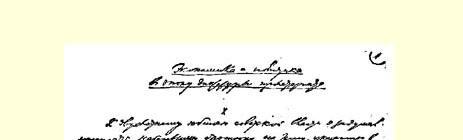
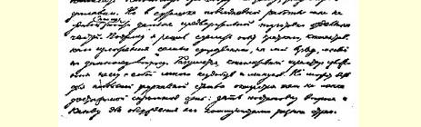
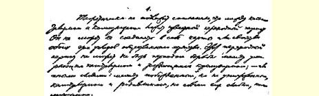
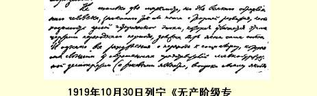
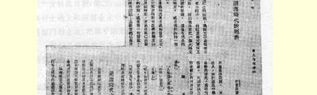
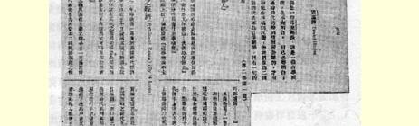
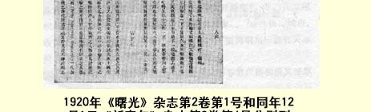

# 无产阶级专政时代的经济和政治

> （１９１９年１０月３０日）

在苏维埃政权成立两周年快要到来的时候，我曾打算用本文题目写一本小册子。但因忙于日常工作，直到现在还只是为某些部分做了初步的准备。[^1]所以，我决定试一试，把我认为是这个问题上最重要的思想，简单扼要地叙述一下。自然，扼要的叙述有许多不便和缺点。但是一篇不大的杂志论文，也许还能达到一个小小的目的，就是把问题及其要点提出来，供各国共产党人讨论。

## １

在资本主义和共产主义之间有一个过渡时期，这在理论上是毫无疑义的。这个过渡时期不能不兼有这两种社会经济结构的特点或特性。这个过渡时期不能不是衰亡着的资本主义与生长着的共产主义彼此斗争的时期，换句话说，就是已被打败但还未被消灭的资本主义和已经诞生但还非常幼弱的共产主义彼此斗争的时期。

具有这种过渡时期特点的整个历史时代的必然性，不仅对马克思主义者来说，而且对任何一个有学识的、多少懂得一点发展论的人来说，应当是不言而喻的。但是，我们听到的现代小资产阶级民主派代表（第二国际一切代表人物，包括麦克唐纳、让·龙格、考茨基和弗里德里希·阿德勒之流在内，都是这样的代表，尽管他们挂着所谓社会主义的招牌）关于向社会主义过渡的议论，都有一个特点，就是完全忘掉了这个不言自明的真理。小资产阶级民主派的特性就是厌恶阶级斗争，幻想可以不要阶级斗争，力图加以缓和、 调和，磨掉锐利的锋芒。所以，这类民主派或者根本不承认从资本主义过渡到共产主义的整个历史阶段，或者认为自己的任务是设想种种方案把相互斗争的两种力量调和起来，而不是领导其中一种力量进行斗争。

## ２

由于我国十分落后而且具有小资产阶级的性质，俄国的无产阶级专政必然有一些不同于先进国家的特点。但是俄国的基本力量以及社会经济的基本形式却是同任何资本主义国家一样的，所以这些特点能涉及的只是非最主要的方面。

这些社会经济的基本形式就是资本主义、小商品生产和共产主义。这些基本力量就是资产阶级、小资产阶级（特别是农民）和无产阶级。

无产阶级专政时代的俄国经济表现为如下双方的斗争，一方面是在一个大国的全国范围内按共产主义原则联合劳动的最初步

> １９１９年１０月３０日列宁《无产阶级专政时代的经济和政治》手稿第１页
>
> （按原稿缩小）

> １９２０年《曙光》杂志第２卷第１号和同年１２月１日《新青年》杂志第８卷第４号分别刊载的列宁《无产阶级专政时代的经济和政治》一文的中译文骤，另一方面是小商品生产，是保留下来的以及在小商品生产基础上复活着的资本主义。

说劳动在俄国按共产主义原则联合起来了，第一，是指废除了生产资料私有制；第二，是指由无产阶级国家政权在全国范围内在国有土地上和国营企业中组织大生产，把劳动力分配给不同的经济部门和企业，把属于国家的大量消费品分配给劳动者。

我们说俄国共产主义的“最初步骤”（１９１９年３月通过的我们的党纲也是这样说的），因为所有这些条件在我国还只实现了一部分，换句话说，这些条件的实现还处在开始的阶段。凡是一下子可以办到的事情，我们用革命的打击一下子都办到了。例如，在无产阶级专政的第一天，即１９１７年１０月２６日（１９１７年１１月８日），就废除了土地私有制，无偿地剥夺了大土地所有者。在几个月内，又同样无偿地剥夺了几乎所有的大资本家即工厂、股份企业、银行、 铁路等等的占有者。由国家来组织工业大生产，从“工人监督”过渡到“工人管理”工厂、铁路，—— 这基本上已经实现了，但在农业方面，事情还只是刚刚开始（办“国营农场”，即由工人国家在国有土地上办的大农场）。同样，把小农组织成各种协作社这一从小商品农业过渡到共产主义农业的办法，也刚刚开始实行。[^2]由国家组织产品分配来代替私营商业这件事，即由国家收购粮食供应城市、收购工业品供应农村这件事，也是这样。下面将引用一些有关本问题的统计材料。

农民经济仍然是小商品生产。这是一个非常广阔和极其深厚的资本主义基础。在这个基础上，资本主义得以保留和重新复活起来，同共产主义进行着极其残酷的斗争。这个斗争的形式，就是以私贩粮食和投机倒把来反对国家收购粮食（以及其他农产品），总之，是反对由国家分配农产品。

## ３

为了说明这些抽象的原理，我们来引用一些具体的数字。

根据粮食人民委员部的统计资料，从１９１７年８月１日到 １９１８年８月１日，俄国由国家收购的粮食约为３０００万普特。下一个年度约为１１０００万普特。再下一个收购年度（１９１９—１９２０年）头三个月的数字看来可以达到４５００万普特，而在１９１８年同时期 （８—１０月）只有３７００万普特。

这些数字清楚地说明，从共产主义战胜资本主义的意义上说来，情况虽然改善得很慢，但总是不断地在改善着。尽管俄国和外国的资本家动用世界列强的全部力量来组织国内战争，造成了世界上空前未有的困难，情况还是在改善着。

所以，不管各国资产者及其公开的和隐蔽的帮凶们（第二国际的“社会党人”）怎样造谣诬蔑，有一点是不容怀疑的：从无产阶级专政的基本经济问题来看，共产主义战胜资本主义在我国是有保证的。全世界资产阶级之所以疯狂地拼命地反对布尔什维主义，组织军事进攻，策划阴谋活动等等来反对布尔什维克，正是因为他们十分清楚，若不用武力把我们压倒，我们就必然会在改造社会经济方面获得胜利。但资产阶级要想这样把我们压倒是办不到的。

在我们所经历的这个短时期内，在我们所处的世界上空前未有的困难条件下，我们究竟在多大程度上战胜了资本主义，从下述总结数字中就可以看出来。中央统计局刚刚整理了一份关于苏维埃俄国２６个省（不是全国）粮食生产情况和消费情况的统计材料， 准备发表。

统计结果如下：

> 苏维埃人  口食拥有量食消费量俄 国 （单位百万）（单位百（单 位 ２６省
>
> 粮食产量
>
> （不包括
>
> 种子和
>
> 饲料）由粮食人由投机
>
> （单位百民委员部商贩供
>
> 万普特）供应的  应的
>
> 粮食供应量
>
> （单位百万普特）
>
> 居民的粮每人的粮
>
> 万普特）普 特） > 产粮省 > 消费省 > >

## ４

如果仔细研究一下上面引的统计资料，就可以看出，这个准确的材料勾划出了目前俄国经济的一切基本特点。

劳动群众摆脱了长期以来的压迫者和剥削者—— 地主和资本家。这个向真正自由和真正平等跨出的一步，按其大小、规模和速度说来，都是世界上空前未有的，而资产阶级的拥护者（包括小资产阶级民主派在内）对这一步却不加考虑。他们从资产阶级议会民主的意义上侈谈自由和平等，把这种民主虚伪地称为一般“民主” 或“纯粹民主”（考茨基）。

但劳动群众所考虑的却是真正的平等，真正的自由（不受地主资本家压迫的自由），所以他们这样坚定地拥护苏维埃政权。

在一个农民国家里，从无产阶级专政方面首先获得利益、获得利益最多和马上获得利益的是农民。农民在地主资本家统治下的俄国是经常挨饿的。在我国多少世纪的漫长历史中，农民从来没有可能为自己劳动，总是把亿万普特粮食交给资本家，运往城市和国外，自己只好挨饿。在无产阶级专政下，农民才**第一次**为自己劳动， **而且比城市居民吃得好些**。农民第一次看到了真正的自由，即享用自己粮食的自由，不挨饿的自由。谁都知道，在分配土地时做到了最大限度的平等，因为在绝大多数情况下，农民是“按人口”分配土地的。

社会主义就是消灭阶级。

为了消灭阶级，首先就要推翻地主和资本家。这一部分任务我们已经完成了，但这只是任务的一部分，而且**不是**最困难的部分。 为了消灭阶级，其次就要消灭工农之间的差别，使**所有的人**都成为 **工作者**。这不是一下子能够办到的。这是一个无比困难的任务，而且必然是一个长期的任务。这个任务不能用推翻哪个阶级的办法来解决。要解决这个任务，只有把整个社会经济在组织上加以改造，只有从个体的、单独的小商品经济过渡到公共的大经济。这样的过渡必然是非常长久的。采用急躁轻率的行政手段和立法手段， 只会延缓这种过渡，给这种过渡造成困难。只有帮助农民大大改进以至根本改造全部农业技术，才能加速这种过渡。

为了解决这个最困难的第二部分任务，战胜了资产阶级的无产阶级在对农民的政策中应当始终不渝地贯彻以下基本路线：无产阶级应当把劳动者农民和私有者农民，即把种地的农民和经商的农民、劳动的农民和投机的农民区别开来，划分开来。

这种划分就是社会主义的**全部实质**所在。

那些口头上的社会主义者实际上的小资产阶级民主派（马尔托夫之流、切尔诺夫之流和考茨基之流等等）不懂得社会主义的这种实质，是并不奇怪的。

这里所说的划分，做起来很困难，因为在实际生活中，“农民” 的各种特性不管多么不同，多么矛盾，总是溶合成为一个整体。但是划分还是可能的，不仅可能，而且是农民经济条件和农民生活条件必然产生的结果。劳动农民历来都受地主、资本家、商人、投机者和**他们的**国家（包括最民主的资产阶级共和国在内）的压迫。多少世纪以来，劳动农民养成了一种敌视和仇恨这些压迫者和剥削者的心理，实际生活所给予的这种“教育”使农民**不得不**寻求同工人结成联盟来反对资本家，反对投机者，反对商人。同时，经济环境， 商品经济的环境，又必然使农民（不是任何时候，而是在大多数情况下）成为商人和投机者。

我们上面引用的统计资料清楚地说明了劳动农民和投机农民的区别。例如，一种农民在１９１８—１９１９年间为了供应城市里挨饿的工人，按照国家固定价格，把４０００万普特粮食交给了国家机关， 尽管这些机关还有种种缺点（这些缺点是工人政府清楚地意识到的，但在向社会主义过渡的初期是无法消除的），—— 这种农民是劳动农民，是社会主义工人真正的同志，是他最可靠的同盟者，是他在反资本压迫斗争中的亲兄弟。而另一种农民却利用城市工人的饥饿和困苦，非法地按相当于国家价格十倍的高价，出卖了 ４０００万普特粮食，他们欺骗国家，使蒙骗、掠夺和欺诈勾当在各地应运而生并且日益猖獗—— 这种农民是投机者，是资本家的同盟者，是工人的阶级敌人，是剥削者。因为，粮食是从全国公有土地上收获来的，所用的农具也不仅是农民而且还有工人等等花了某种劳动才创造出来的，而有了余粮就拿来投机，这就是剥削挨饿的工人。

人们指着我们宪法上工农的不平等以及解散立宪会议、强行拿走余粮等等事情，从四面八方向我们大叫大嚷：你们是自由、平等、民主的破坏者。我们回答说：世界上还从来没有哪一个国家做过这样多的事情，来消除劳动农民多少世纪以来所遭受的事实上的不平等和事实上的不自由。可是对于投机的农民，我们永远也不会承认跟他们有平等，正如我们永远不承认剥削者同被剥削者、饱食者同挨饿者有“平等”，不承认前者有掠夺后者的“自由”一样。而对于那些不愿意了解这种区别的有教养的人，我们就要用对待白卫分子的态度来对待他们，尽管他们自称为民主主义者、社会主义者、国际主义者、考茨基派、切尔诺夫派或马尔托夫派。

## ５

社会主义就是消灭阶级。为此，无产阶级专政已做了它能做的一切。但是要一下子消灭阶级是办不到的。

在无产阶级专政时代，阶级**始终是存在的**。阶级一消失，专政也就不需要了。没有无产阶级专政，阶级是不会消失的。

在无产阶级专政时代，阶级依然存在，但**每个**阶级都起了变化，它们相互间的关系也起了变化。在无产阶级专政条件下，阶级斗争并不消失，只是采取了别的形式。

在资本主义制度下，无产阶级是被压迫阶级，是被剥夺了任何生产资料所有权的阶级，是唯一同资产阶级直接对立和完全对立的因而也是唯一能够革命到底的阶级。无产阶级在推翻资产阶级、 夺得政权以后，成了**统治**阶级：它掌握着国家政权，支配着已经公有化的生产资料，领导着动摇不定的中间分子和中间阶级，镇压着剥削者的日益强烈的反抗。这些都是阶级斗争的**特殊**任务，是无产阶级以前不曾提出也不可能提出的任务。

在无产阶级专政下，剥削者阶级，即地主和资本家阶级，还没有消失，也不可能一下子消失。剥削者已被击溃，可是还没有被消灭。他们还有国际的基础，即国际资本，他们是国际资本的一个分支。他们还部分地保留着某些生产资料，还有金钱，还有广泛的社会联系。正是由于他们遭到失败，他们反抗的劲头增长了千百倍。 管理国家、军事和经济的“艺术”，使他们具有很大很大的优势，所以他们的作用比他们在人口中所占的比重要大得多。被推翻了的剥削者反对胜利了的被剥削者的先锋队，即反对无产阶级的阶级斗争，变得无比残酷了。既然说的是革命，既然不是用改良主义的幻想去代替革命这个概念（象第二国际中的一切英雄所干的那样），那么情况就只能如此。

最后，农民和任何小资产阶级一样，在无产阶级专政下**也**处于中间的地位：一方面，他们是由劳动者要求摆脱地主资本家压迫的共同利益联合起来的、人数相当多的（在落后的俄国是极多的）劳动群众；另一方面，他们又是单独的小业主、小私有者、小商人。这样的经济地位必然使他们在无产阶级与资产阶级之间摇摆不定。 到了无产阶级和资产阶级的斗争尖锐化的时候，到了一切社会关系遭到非常急剧的破坏的时候，由于农民和一般小资产者最习惯于因循守旧，那就很自然，我们必然会看到他们从一边转到另一边，摇摆不定，反复无常，犹豫不决，等等。

对于这个阶级，或者说，对于这些社会成分，无产阶级的任务就是领导他们，设法影响他们。带领动摇分子和不坚定分子前进， 这就是无产阶级应做的事情。

我们把所有的基本力量或基本阶级及其被无产阶级专政改变了的相互关系比较一下，就可以看出，第二国际的一切代表所持的、流行的小资产阶级观念，即“经过”一般“民主”过渡到社会主义的观念，在理论上是何等荒谬，何等愚蠢。这种错误观念的根源就是从资产阶级那里继承下来的偏见，即以为“民主”具有绝对的、超阶级的内容。其实，在无产阶级专政下，民主也进入了崭新的阶段， 阶级斗争也上升到了更高的阶段，而使一切形式都服从它。

搬弄关于自由、平等和民主的笼统词句，实际上等于盲目重复那些反映商品生产关系的概念。用这些笼统词句来解决无产阶级专政的具体任务，就意味着全面地转到资产阶级的理论立场和原则立场上去了。从无产阶级的观点看来，问题只能这样提：是不受哪个阶级压迫的自由？是哪一个阶级同哪一个阶级的平等？是私有制基础上的民主，还是废除私有制的斗争基础上的民主？如此等等。

恩格斯在《反杜林论》中早已阐明，如果不把平等了解为**消灭阶级**，反映商品生产关系的平等概念就会变成一种偏见。[^3]这个关于资产阶级民主主义平等概念不同于社会主义平等概念的起码真理，是常常被人遗忘的。只要不忘记这个真理，就可以清楚地看到， 无产阶级推翻资产阶级就是朝着消灭阶级的方向迈进了最有决定意义的一步，而无产阶级要完成这一事业，就应当利用国家政权机关来继续进行阶级斗争，就应当对被推翻了的资产阶级和动摇不定的小资产阶级采用斗争、影响、诱导等不同的方法来继续进行阶级斗争。

（待续）[^4]

１９１９年１０月３０日

> 载于１９１９年１１月７日《真理报》译自《列宁全集》俄文第５版第２５０号和《全俄中央执行委员会第３９卷第２６９—２８２页消息报》２５０号

[^1]: 见本卷第２５３—２６２、４２８—４３７页。—— 编者注

[^2]: 苏维埃俄国的“国营农场”大约有３５３６个，“农业公社”大约有１９６１个，农业劳动组合有３６９６个。我国中央统计局现在正对全国的国营农场和农业公社作一次精确的统计。１９１９年１１月间就会陆续得到统计结果。城市………４．４乡村……２８．６城市………５．９乡村……１３．８－６２５．４－１１４．０２０．９－２０．０１２．１２０．６－２０．０２７．８４１．５４８１．８４０．０１５１．４９．５１６．９６．８１１．０总 计（２６省） ５２．７７３９．４５３．０６８．４７１４．７１３．６由此可见，城市的粮食大约有一半是由粮食人民委员部供应的，另一半是由粮贩供应的。根据１９１８年的精确调查，对城市工人的粮食供应的比例正是如此。不过工人购买国家的粮食比购买粮贩的粮食要少付九成的钱。粮食的黑市价格十倍于国家价格。这是精确研究工人收支情况所得出的结果。

[^3]: 参看《马克思恩格斯全集》第２０卷第１１６—１１８页。—— 编者注

[^4]: 本文没有写完。—— 俄文版编者注